# 第11章\_kref\_refcount\_t\_kobject\_的边界

## 11.1\_本章导读\_先分清对象层次

前十章已经能为一个私有对象回答：谁持有、怎样取得、谁归还、最后归还怎样清理。现在把同一个驱动放进更完整的系统：它有请求完成次数，要把请求对象交给异步使用者，还要向用户空间展示设备。三个需求都可能出现“计数”，却不能靠选一个更大的结构体一起解决。

先只看驱动内部的一次 request。它没有名字目录，没有设备匹配任务；创建者和消费者需要共享使用期限，kref 已足够组织这份责任。如果驱动还要统计一共完成多少次请求，这个统计值达到零没有销毁含义，可以使用适当的普通或原子统计工具。若把统计值误当引用，值归零就释放；若把引用误当普通统计，越界或重复归还又可能破坏回收决定。

接着增加另一种需求：用户空间希望通过 **sysfs** 中的目录和属性查看对象。sysfs 是内核把部分对象关系与属性呈现给用户空间的文件系统，常挂载在 `/sys`。现在不仅要保活，还要决定名字、父子关系、属性访问和类型清理。**kobject** 是组织这类内核对象身份与层次的基础构件；名字不是额外加一份引用就能解决的。

如果被管理的已经是设备，通常还要设备与驱动的匹配、绑定、解绑和电源管理。**driver core** 是 Linux 组织这些设备模型关系的核心框架，`struct device` 表示其中一个设备对象。**bus_type** 描述一类设备和驱动如何匹配及参与相关回调；**class** 则提供按功能组织设备的视图，例如同类输入设备。总线归属和功能分类是不同关系，不能画成“class 持大引用、bus 持小引用”的单一计数树。

本章不重讲整套 sysfs 或设备模型，而是回答：已经知道私有 kref 协议后，什么时候应该继续使用它，什么时候必须进入框架规定的接口。先看需求，再看对象中实际嵌入什么；不要从 atomic_t 一路“升级”到 device，仿佛它们只是性能或功能档次不同的计数器。

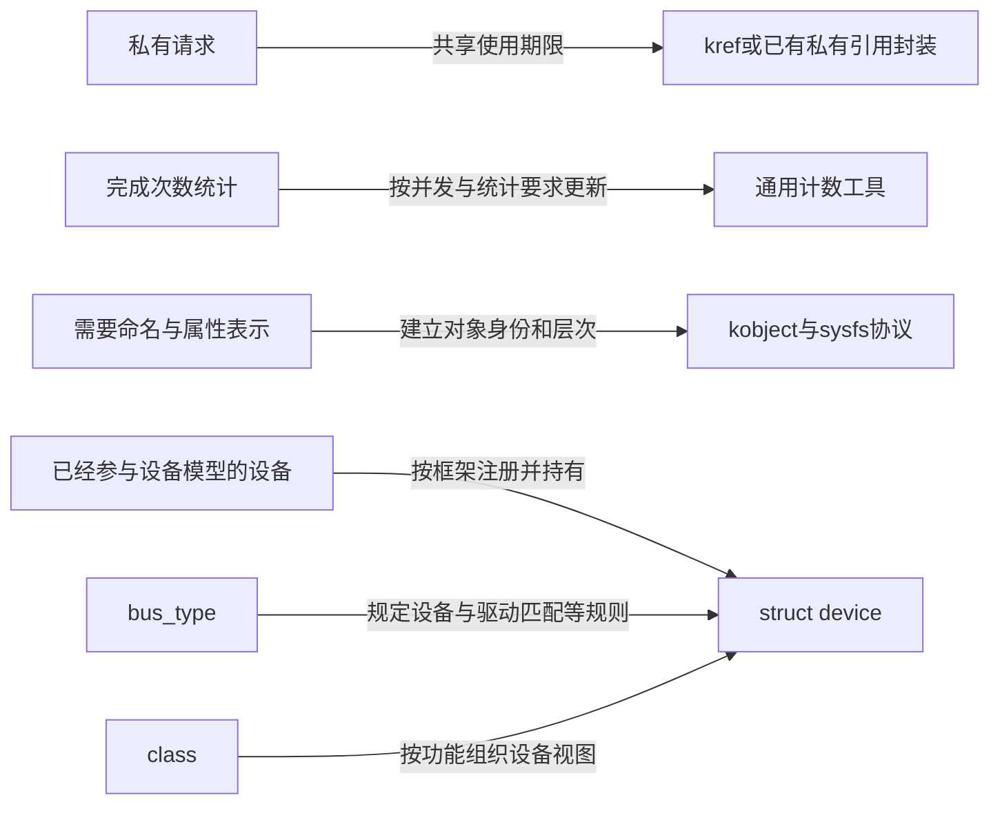
```mermaid
flowchart LR
    R[私有请求] -->|共享使用期限| K[kref或已有私有引用封装]
    S[完成次数统计] -->|按并发与统计要求更新| A[通用计数工具]
    N[需要命名与属性表示] -->|建立对象身份和层次| O[kobject与sysfs协议]
    D[已经参与设备模型的设备] -->|按框架注册并持有| V[struct device]
    B[bus_type] -->|规定设备与驱动匹配等规则| V
    C[class] -->|按功能组织设备视图| V
```

图中箭头表示需求或关系，不表示这些对象自动持有哪份引用。具体的保活与销毁路径必须继续查接口契约；一个对象与另一个对象有关联，并不意味着前者已经为后者持有引用。

## 11.2\_底层计数工具\_atomic\_t\_refcount\_t\_kref

先把范围缩回私有请求。其存储、引用安全检查和最后清理调用分别位于哪一层？这几个工具的区别要从一次完整创建—共享—退出观察，不能只比较结构体成员数。

### 11.2.1\_atomic\_t\_通用原子计数工具

atomic_t 是内核的通用原子整数类型。它让相应操作不可被其他并发更新拆开观察，但不会知道这个整数表示完成次数、状态还是对象份额。若统计两个线程各完成一次，可以按统计协议原子增加；这个用途通常不需要“从1减到0后释放对象”。

引用计数则把数值变化接到了存储回收。假设一个错误的额外归还把零减成负值，或反复增加触及表示范围，普通整数更新本身不等于安全的所有权判断。即使用 atomic_dec_and_test 检查零，也仍要证明初始份额、有效地址、不能从零重新取得、异常处理和每个失败分支的责任。

所以问题不在于 atomic_t 无法用于实现引用计数，而在于通用原子更新没有替应用提供完整引用纪律。直接手写时，这些约束会散落在多个调用点，后续维护者很容易只看到一个可随意加减的整数。

原子也不等于任意字段间都有完整顺序。不同函数及其 relaxed、acquire、release 形式有不同内存序契约。把某个 atomic 接口改成名字相似的 refcount 接口，必须重新审查原程序依赖的发布与清理顺序，不能以“都原子”代替核对。

### 11.2.2\_refcount\_t\_引用计数安全原语

refcount_t 为对象引用提供专用操作和异常处理。先从[kref 源码总索引](../../../../research/source_reading/kref/navigation/P01_Linux_6.12_kref源码阅读索引.md#1.2_按问题进入已落地证据)进入固定版本，再看[refcount_t 的存储定义](../../../../research/source_reading/kref/source_explanations/include/linux/refcount_types.h.md#1.1_原子存储字段)：它内含 atomic_t refs。专用语义来自围绕这个存储实现的操作，不是 C 类型名字本身能阻止错误赋值。

普通增加要求已经有正引用保护；条件增加允许在有效地址上处理零值失败；最后减少以返回值交付归零结果。固定实现还检测特定的下溢、从零增加及溢出异常，并采用[告警与饱和处理](../../../../research/source_reading/kref/source_explanations/lib/refcount.c.md#1.1_告警之前先收敛到饱和)。这降低引用错误转成错误回收的风险，却不会让已经错误的所有权协议恢复健康；饱和可能使对象不再正常回收。

直接用 refcount_t 的对象通常在自己的 put 封装中处理最后减少，例如下面的接口片段。它假设调用者确有一份，且 sample_release 是该类型约定的最终清理函数：

```c
static void sample_put(struct sample_object *obj)
{
    if (refcount_dec_and_test(&obj->refs))
        sample_release(obj); /* 最后减少的结果由本类型封装接到清理。 */
}
```

这本身是合法设计，不因没有采用 container_of 或字段名叫 refs 就成为缺陷。如果现有子系统已经提供成熟的 sample_get/sample_put，继续遵循它的接口；仅为了统一拼写而转换 kref，会增加审查范围且不自动改善正确性。

真正需要核对的是内存序和外层协议。固定 NXP Linux 6.12.20 的 Documentation/core-api/refcount-vs-atomic.rst 对比指出：普通 refcount 增加不替代发布读取；refcount_dec_and_test 提供 release，并在归零成功路径建立相应 acquire；从部分原子条件增加迁移到 refcount 条件增加时，原有的完全有序保证也不能照搬。精确函数链见[普通减少](../../../../research/source_reading/kref/source_explanations/include/linux/refcount.h.md#1.3_旧值决定归零与异常分支)和[条件比较](../../../../research/source_reading/kref/source_explanations/include/linux/refcount.h.md#1.5_条件增加与失败重试)。

不必在这一节背诵全部屏障规则，但要记住审查顺序：先找到原来是谁发布对象、谁取得可见地址，再核对引用 API 是否改变了原来依赖的顺序。引用操作不是所有字段的 acquire/release 万用包装。

### 11.2.3\_kref\_对象生命周期引用计数封装

kref 进一步把“最后减少成功，就调用本次传入的清理函数”组织成常用接口。固定[计数成员定义](../../../../research/source_reading/kref/source_explanations/include/linux/kref.h.md#1.1_计数成员)只保存 refcount_t；对象地址、锁、状态以及清理回调都不存放在这个成员里。回调作为参数传给[kref_put](../../../../research/source_reading/kref/source_explanations/include/linux/kref.h.md#1.4_最后归还调用清理)，由最后归还的那条路径同步调用。

回到 P02 的完整 [note_kref_object.c](../../../../labs/kernel/object_lifetime/materials/note_kref_object.c)。本章复用原程序观察接口分工，不增加另一套只差字段名的对象；完整源码与构建步骤见[P02 对象模板](P02_源码入口与结构定义.md#2.19_标准自定义引用对象模板)。沿同一程序逐个预测：

| 阶段 | 应用函数与实际责任 | kref/refcount层的动作 |
| --- | --- | --- |
| S0 创建 | my_refobj_alloc 申请外壳，随后申请data | kref_init 建立初始一份；不自动分配data |
| S1 交付 | 完整初始化成功后才把地址返回创建者 | 单纯返回不自动增加份额 |
| S2 共享 | my_refobj_get 以已有正引用为前提，为consumer追加一份 | 普通增加1→2；不验证任意裸地址 |
| S3 使用 | creator归还后，consumer打印固定id/state/data | 2→1保留存储；字段正确性仍来自本例同步初始化与使用 |
| S4 最后归还 | consumer调用my_refobj_put | 1→0后kref_put调用指定release |
| S5 清理 | my_refobj_release回收data，再回收外壳 | container_of恢复地址；清理步骤由应用定义 |

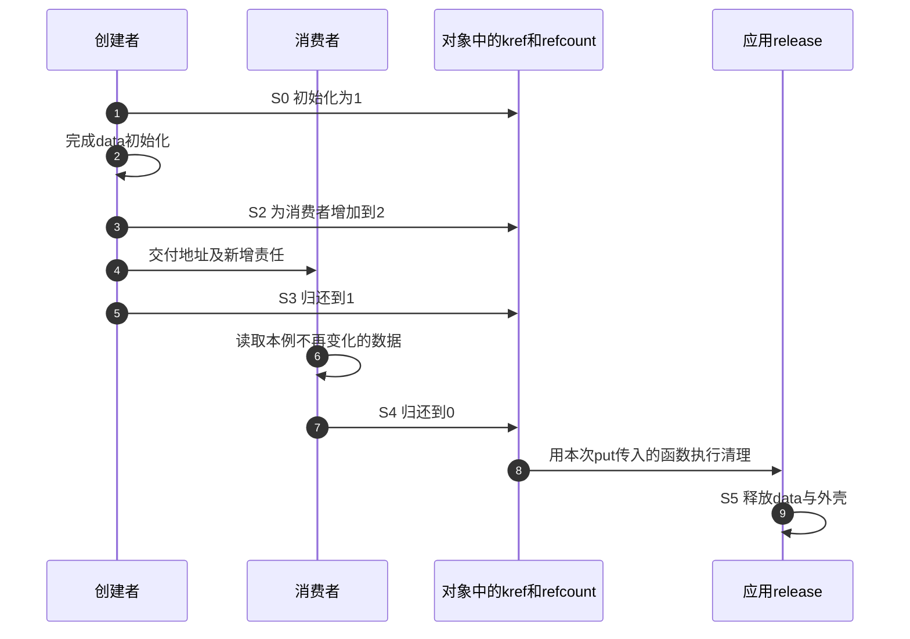
```mermaid
sequenceDiagram
    autonumber
    participant A as 创建者
    participant B as 消费者
    participant K as 对象中的kref和refcount
    participant F as 应用release
    A->>K: S0 初始化为1
    A->>A: 完成data初始化
    A->>K: S2 为消费者增加到2
    A->>B: 交付地址及新增责任
    A->>K: S3 归还到1
    B->>B: 读取本例不再变化的数据
    B->>K: S4 归还到0
    K->>F: 用本次put传入的函数执行清理
    F->>F: S5 释放data与外壳
```

再看 data 申请失败。外壳已经建立初始份额，所以失败路径通过同一个 put 进入 release；kzalloc 使 data 尚为空，应用清理允许这一部分初始化状态。kref 不替你判断“构造到第几步”，更不自动回收子资源，正确性来自应用回调支持这一状态。

原程序及其已有验证记录保持不变，本批没有重新运行目标模块或增加行为覆盖。阅读练习是给每个调用标出“地址来自谁、归还哪份、是否可能最后一次”，而不是把所有出现 get 的地方都当成同一种查找。

### 11.2.4\_kref\_和\_refcount\_t\_的关系

这三个名字现在可以放在同一张关系图里，因为它们各自解决的问题已经出现：

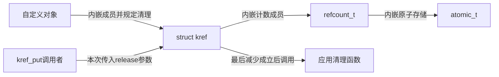
```mermaid
flowchart LR
    O[自定义对象] -->|内嵌成员并规定清理| K[struct kref]
    K -->|内嵌计数成员| R[refcount_t]
    R -->|内嵌原子存储| A[atomic_t]
    P[kref_put调用者] -->|本次传入release参数| K
    K -->|最后减少成立后调用| F[应用清理函数]
```

| 当前任务 | 可选工具或接口 | 选择依据 |
| --- | --- | --- |
| 普通并发统计或状态 | 按具体并发需求选原子或锁 | 不把零值解释为对象最后责任 |
| 已有类型封装需要引用原语 | refcount_t及该类型get/put | 类型已规定最后减少与清理的衔接 |
| 新的简单私有共享对象 | kref加类型封装 | 使用现成的初始化、取得、归还与回调形态 |
| 已经拿到框架对象 | 后文的kobject/device等接口 | 框架拥有额外身份、发布和销毁契约 |

kref 并未增加一套与 refcount 并行的引用数，也不是两次 get 或两次 put。选择它不会解决链表登记、业务关门、RCU 窗口或字段锁；直接使用 refcount_t 也不表示对象必然更危险、更快或更高级。

做一个迁移练习：若把原程序的 ref 成员改成 refcount_t，除了改名，还要在哪里接回 release，回调参数怎样调整，data 失败时由谁归还初始份额？答案应覆盖 S0、S2、S4 和部分初始化失败，且仍保持同一个清理出口。只有数值路径相同还不够，原子 API 的内存序差异也要按前节检查。下一节再增加“对象需要名字与属性表示”这一新约束，进入 kobject。

## 11.3\_kobject\_边界\_引用计数之外的对象模型

已有的请求对象可以被正确共享，却还没有名字或目录。现在给一个简单对象增加名称，并观察“目录已经撤下、外壳仍被引用”这一新组合。先把它和裸 kref 的共同责任接起来，再看框架额外管理哪些状态。

### 11.3.1\_kobject\_不只是引用计数

对象名字、父节点和类型描述不能由一个引用数推导出来。kobject 把这些身份关系与内嵌 kref 放在一起，并提供配套的初始化、添加、撤下和最终清理接口。**kobj_type** 是类型级描述，提供最终 release 和可选属性等规则；每个实例通过指针关联它。**kset** 是 kobject 的集合组织之一，并可参与事件处理，它不等于业务链表，也不要求每个对象都加入一个。

对象添加到 sysfs 后，用户空间可能看到对应目录；**uevent** 则是内核对象事件通知。二者并非同一个动作：固定 kobject_add/init_and_add 的添加成功不会自动替调用者发送 ADD 事件。属性和事件要根据真实接口需求设计，不能把“用了 kobject”当作用户空间已经被通知。

先从[kref 源码总索引](../../../../research/source_reading/kref/navigation/P01_Linux_6.12_kref源码阅读索引.md#1.2_按问题进入已落地证据)进入新增的[kobject模块导读](../../../../research/source_reading/kref/navigation/P07_kobject身份与类型清理导读.md#7.2_从K0到K5连接状态与回调)。本章使用固定 NXP Linux 6.12.20 的 include/linux/kobject.h 与 lib/kobject.c，仍以官方不可变提交为证据，不从实验HEAD推断。

这不是一个仅靠计数推进的状态机。初始化事实、sysfs登记、事件发送和父关系分别保存状态；下面用 K0～K5 说明它们怎样在一次操作周期中相接：

| 阶段 | 本对象责任 | 身份与框架动作 |
| --- | --- | --- |
| K0 初始化 | 初始一份归创建者 | 初始化内部状态、关联类型描述 |
| K1 添加 | 成功不消费K0份额；失败也仍需归还 | 建立名称、父关系与目录，失败清理按框架规则 |
| K2 追加观察者 | 自己已有正引用才用kobject_get | 返回同一个地址，不重新发布目录 |
| K3 主动撤下 | 本对象份额不减少 | kobject_del撤下目录与关系，归还相应父引用 |
| K4 各方归还 | 最后一份触发core的kobject_release | 普通配置同步清理；调试配置可能延迟 |
| K5 类型清理 | 类型release可以销毁外壳 | core处理其负责的名字与关系收尾 |

完整 [note_kobject.c](../../../../labs/kernel/object_lifetime/materials/note_kobject.c) 只创建一个带固定值的对象，在 `/sys/kernel` 下短暂添加 `note_kref_lifetime` 目录，再在初始化期间撤下。它没有属性接口、外部用户或主动 ADD 事件，目的只是观察登记与存储期限的区别；不能用用户空间没来得及看见目录判断添加失败。

```c
// SPDX-License-Identifier: GPL-2.0
#include <linux/errno.h>
#include <linux/kobject.h>
#include <linux/module.h>
#include <linux/slab.h>

struct named_object {
    struct kobject kobj;
    int value; /* 发布前固定，本例不提供属性读写入口。 */
};
static unsigned int release_calls;

static void named_release(struct kobject *kobj)
{
    struct named_object *obj = container_of(kobj, struct named_object, kobj);
    ++release_calls;
    kfree(obj); /* 名称和父引用由kobject core按自己的协议清理。 */
}
static const struct kobj_type named_type = { .release = named_release };

static int __init note_kobject_init(void)
{
    struct named_object *creator, *reader;
    struct kobject *held;
    int result;

    /* 此同步演示不实现延迟调试释放时模块代码的异步退出协议。 */
    if (!IS_ENABLED(CONFIG_SYSFS) || IS_ENABLED(CONFIG_DEBUG_KOBJECT_RELEASE))
        return -EOPNOTSUPP;
    creator = kzalloc(sizeof(*creator), GFP_KERNEL);
    if (!creator)
        return -ENOMEM;
    creator->value = 7;
    result = kobject_init_and_add(&creator->kobj, &named_type,
                                 kernel_kobj, "note_kref_lifetime");
    if (result) {
        kobject_put(&creator->kobj); /* 初始化已完成，失败也经类型回调。 */
        return result;
    }
    held = kobject_get(&creator->kobj); /* 已拥有正引用，追加观察者的一份。 */
    reader = container_of(held, struct named_object, kobj);
    pr_info("note_kobject: added value=%d release=%u\n", reader->value, release_calls);
    kobject_del(&creator->kobj); /* 撤下层次与sysfs入口，不归还本对象初始一份。 */
    kobject_put(&creator->kobj);
    creator = NULL;
    pr_info("note_kobject: removed value=%d release=%u\n", reader->value, release_calls);
    kobject_put(held); /* 最后观察者归还，core再调用named_type.release。 */
    return 0;
}

static void __exit note_kobject_exit(void)
{
    /* 无外部入口、无异步持有者；支持配置下init已完成所有归还。 */
    pr_info("note_kobject: release=%u\n", release_calls);
}
module_init(note_kobject_init);
module_exit(note_kobject_exit);
MODULE_LICENSE("GPL");
MODULE_DESCRIPTION("kobject撤下与最后引用分离的同步演示");
```

本演示要求 CONFIG_SYSFS 开启且 CONFIG_DEBUG_KOBJECT_RELEASE 关闭，否则初始化直接返回 -EOPNOTSUPP，不建立对象。后一个选项会让框架延迟执行类型清理；演示没有实现那种情况下的模块代码退出协议，因此明确拒绝，而不是让模块先卸载再执行它的函数地址。

Linux 目标构建和观察步骤如下，KDIR 应指向与运行内核相匹配的构建环境：

```bash
make -C "$KDIR" M="$PWD/labs/kernel/object_lifetime/materials" modules
sudo insmod labs/kernel/object_lifetime/materials/note_kobject.ko
sudo rmmod note_kobject
sudo dmesg | tail -n 20
```

预计支持配置下的日志为：

```text
note_kobject: added value=7 release=0
note_kobject: removed value=7 release=0
note_kobject: release=1
```

第二行中目录已经撤下，创建者也已归还，但观察者仍持一份，所以仍可读取发布前固定的 value。第三行说明最后观察者归还后才完成类型清理。对象可能在最后 put 内立即消失，程序没有再通过 reader 或 held 访问它。

本次 ARM 前端和七组宿主检查通过；宿主执行固定九个 kobject 函数与既有普通引用链，命名、sysfs、分配等为显式替身。两类不支持配置、分配失败、添加失败、正常周期、隐式/显式撤下和 NULL 包装均检查；目标链接、装卸、实际 sysfs/事件、并发及调试延迟释放分支未执行。日志是预期目标结果，不冒充实际内核运行。

### 11.3.2\_kobject\_的\_release\_和\_kref\_release\_的区别

在裸 kref 程序里，每次 put 由应用传入 `void (*)(struct kref *)`。在本例里，应用调用 kobject_put，不再自行挑选内部 kref 回调；core 固定传入自己的 kobject_release，后者经过清理流程才分派到 `named_type.release`，其参数是 `struct kobject *`。

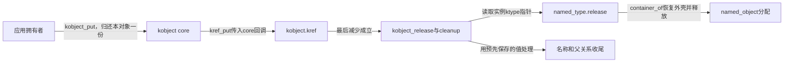
```mermaid
flowchart LR
    U[应用拥有者] -->|kobject_put，归还本对象一份| P[kobject core]
    P -->|kref_put传入core回调| R[kobject.kref]
    R -->|最后减少成立| C[kobject_release与cleanup]
    C -->|读取实例ktype指针| T[named_type.release]
    T -->|container_of恢复外壳并释放| O[named_object分配]
    C -->|用预先保存的值处理| N[名称和父关系收尾]
```

入口参数不同只是表面差别。真正多出来的是 core 在类型回调前后仍有自己的清理责任。固定[最后归还实现](../../../../research/source_reading/kref/source_explanations/lib/kobject.c.md#1.4_最后归还进入类型清理)先保存 name、parent 和类型，必要时补做撤下，再调用类型 release；因为外壳此时可能已经释放，之后不能再从旧 kobj 读取成员。

所以 named_release 只回收自己的外壳，不额外 free core 管理的名字，也不随意再 put 同一个父引用。`struct kobj_type` 和其中函数代码同样必须活到全部实例的最终清理；把类型描述放到早已返回的函数栈上，即使对象引用还在也会留下悬空指针。[类型描述定义](../../../../research/source_reading/kref/source_explanations/include/linux/kobject.h.md#1.2_类型回调不存放在内嵌kref里)展示的是这条实例到类型的地址关系。

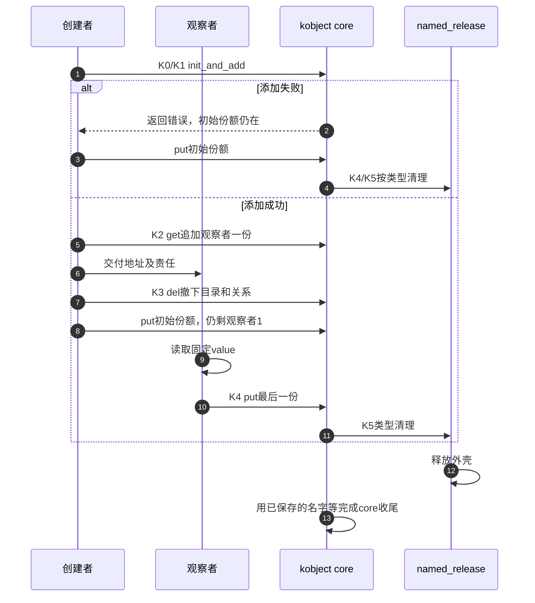
```mermaid
sequenceDiagram
    autonumber
    participant A as 创建者
    participant B as 观察者
    participant K as kobject core
    participant T as named_release
    A->>K: K0/K1 init_and_add
    alt 添加失败
        K-->>A: 返回错误，初始份额仍在
        A->>K: put初始份额
        K->>T: K4/K5按类型清理
    else 添加成功
        A->>K: K2 get追加观察者一份
        A->>B: 交付地址及责任
        A->>K: K3 del撤下目录和关系
        A->>K: put初始份额，仍剩观察者1
        B->>B: 读取固定value
        B->>K: K4 put最后一份
        K->>T: K5类型清理
    end
    T->>T: 释放外壳
    K->>K: 用已保存的名字等完成core收尾
```

图示采用模块支持的非调试延迟配置。固定实现的调试分支会安排延迟工作，不能从这张同步轨迹推断所有配置下最后 put 返回就已经完成类型 release。

再核对两个容易误写的失败/撤下动作。其一，[初始化与添加包装](../../../../research/source_reading/kref/source_explanations/lib/kobject.c.md#1.1_初始化后失败仍有初始责任)已经先初始化一份，即使添加失败也应该 put，而非直接 kfree 外壳。其二，[kobject_del](../../../../research/source_reading/kref/source_explanations/lib/kobject.c.md#1.3_撤下层次不消费本对象引用)归还的是相应父关系责任，不消费本对象初始一份；不能少 put，也不能把 del 当作自动最后销毁。

### 11.3.3\_为什么不要为了引用计数强行引入\_kobject

现在可以具体比较成本。私有 request 若只有创建者和消费者，kref 加类型封装已经能完成责任转移；引入 kobject 会让实例还要维持类型描述、名字/登记决策、失败清理与层次退出，新增的状态没有解决请求原本的业务问题。

反过来，如果对象确实需要稳定身份和属性表示，就不能只在私有结构里加一个 name 字符串，便假定 sysfs 和用户空间访问已自动安全。应先查所在子系统是否已有适当的高层对象，再按该框架管理发布和退出。已经是设备时通常进入 device 层，不为了创建一个目录另造一套与设备并行的 kobject 身份。

也不必为了“用齐 kobject”给每个类型填满 sysfs_ops、default_groups、kset 和事件回调。本例只展示空目录与类型清理，因此只提供必要 release；具体需求增加以后，再补相应访问和退出规则。

做三项练习。先删去正常路径的观察者 get，说明为何后续不能继续保留 reader 别名；再保留观察者、去掉显式 del，沿固定 cleanup 的 state_in_sysfs 分支解释目录何时被清理；最后让添加返回名称冲突，证明为什么错误返回仍要消费K0那一份。宿主检查覆盖了后两类清理路径，第一项只作所有权推导，不运行悬空访问。

下一节把已有框架身份继续接到设备注册、解绑和资源管理。设备的引用、是否登记、驱动资源是否仍可用仍是不同问题，不能把本节的 kobject_del/put 名字直接替换成所有设备退出动作。

## 11.4\_driver\_core\_边界\_device\_class\_bus\_不是裸\_kref

### 11.4.1\_device\_driver\_core\_已经封装好的对象模型

`struct device` 是 driver core 的设备对象。

它不是普通裸 kref 示例里的 `my_obj`。

它承担的职责远超过引用计数：

```text
1. 设备名字。
2. 父子设备关系。
3. 所属 bus。
4. 所属 class。
5. 绑定 driver。
6. sysfs 节点。
7. 设备属性。
8. 电源管理。
9. DMA / IOMMU 相关信息。
10. 设备 release。
11. driver core 注册和注销流程。
```

driver model 文档说明，发现设备的 bus driver 用 `device_register()` 把设备注册到 core；设备从 core 中移除发生在引用计数归零时，并且设备引用通过 `get_device()` 和 `put_device()` 调整。([Linux Kernel 文档](https://docs.kernel.org/driver-api/driver-model/device.html))

所以对 `struct device`，普通驱动代码通常不应该写：

```c
kref_get(&dev->kobj.kref);
kref_put(&dev->kobj.kref, ...);
```

而应该使用 driver core 给你的接口：

```c
get_device(dev);
put_device(dev);
```

或者在 managed resource 场景下使用：

```c
devm_kzalloc(dev, ...);
devm_request_irq(dev, ...);
devm_...
```

这背后的原因是：

```text
device 的生命周期不只是 refcount++ / refcount--；
它还绑定了 driver core 的注册、注销、父子关系、sysfs、class、bus、uevent 和 release 约定。
```

裸 kref 对象的模型是：

```text
我自己定义对象；
我自己决定谁 get；
我自己决定谁 put；
我自己写 release。
```

device 模型是：

```text
driver core 管理设备对象；
驱动通过 device_register/device_unregister/get_device/put_device 等接口参与生命周期；
release 必须符合 driver core 约定。
```

对比图：

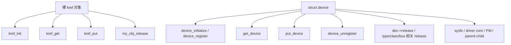
```mermaid
flowchart TD
    A["裸 kref 对象"] --> A1["kref_init"]
    A --> A2["kref_get"]
    A --> A3["kref_put"]
    A --> A4["my_obj_release"]

    B["struct device"] --> B1["device_initialize / device_register"]
    B --> B2["get_device"]
    B --> B3["put_device"]
    B --> B4["device_unregister"]
    B --> B5["dev->release / type/class/bus 相关 release"]
    B --> B6["sysfs / driver core / PM / parent-child"]
```

一句话：

```text
device 不是“带 kref 的 my_obj”；
device 是 driver core 的类型化对象。
```

------

### 11.4.2\_get\_device/put\_device\_和\_kref\_get/kref\_put\_的区别

从表面看：

```c
kref_get(&obj->ref);
kref_put(&obj->ref, obj_release);
```

和：

```c
get_device(dev);
put_device(dev);
```

都像是在做引用计数。

但它们的层次不同。

| API             | 对象类型                     | 所属层次       | 调用者关心什么                     |
| --------------- | ---------------------------- | -------------- | ---------------------------------- |
| `kref_get()`    | 自定义对象内的 `struct kref` | 裸生命周期工具 | 引用归属                           |
| `kref_put()`    | 自定义对象内的 `struct kref` | 裸生命周期工具 | 最后 put 调 release                |
| `get_device()`  | `struct device *`            | driver core    | 设备对象引用                       |
| `put_device()`  | `struct device *`            | driver core    | 释放设备引用，可能触发设备 release |
| `kobject_get()` | `struct kobject *`           | kobject core   | kobject 引用                       |
| `kobject_put()` | `struct kobject *`           | kobject core   | 释放 kobject 引用                  |

所以如果你拿到的是：

```c
struct device *dev;
```

你应该想：

```text
这是 driver core 对象；
用 get_device/put_device。
```

而不是想：

```text
我去找它内部 kref 字段手动操作。
```

类似地，如果你拿到的是：

```c
struct kobject *kobj;
```

你应该想：

```text
这是 kobject；
用 kobject_get/kobject_put。
```

如果你拿到的是：

```c
struct my_obj *obj;
```

并且对象内部是：

```c
struct kref ref;
```

你才使用：

```c
kref_get(&obj->ref);
kref_put(&obj->ref, my_obj_release);
```

这个边界非常关键。

------

### 11.4.3\_device\_release\_不是\_my\_obj\_release

裸 kref release：

```c
static void my_obj_release(struct kref *ref)
{
	struct my_obj *obj = container_of(ref, struct my_obj, ref);

	kfree(obj);
}
```

device release 通常是：

```c
static void my_dev_release(struct device *dev)
{
	struct my_dev *mdev = container_of(dev, struct my_dev, dev);

	kfree(mdev);
}
```

这两个函数虽然都可能最终 `kfree()`，但意义不同。

裸 kref release 表示：

```text
自定义对象最后一个引用释放；
进入对象私有销毁路径。
```

device release 表示：

```text
driver core 设备对象最后一个引用释放；
设备模型允许最终销毁这个设备对象。
```

device release 的重要性更高，因为 `struct device` 一旦注册到 driver core，就可能被多个 core 路径持有引用：

```text
sysfs；
bus；
class；
driver；
parent/child；
device links；
PM；
用户空间打开的属性访问；
异步 probe/remove 路径。
```

所以不能用裸 kref 的思维写：

```text
我 unregister 了，所以马上 kfree device。
```

更准确的模型是：

```text
device_unregister() 取消发布设备；
put_device() 释放引用；
最后一个引用归零时，driver core 调用 release；
release 才能释放包含 struct device 的外层对象。
```

这里和前面 RCU 一样，要区分：

```text
取消发布 != 没有引用；
没有引用 != 所有框架关系都已经清理；
release 才是最终释放点。
```

------

### 11.4.4\_class\_release\_也不是\_my\_obj\_release

`struct class` 也是 driver core 的分类对象。

它用于把设备按功能类别组织起来，例如：

```text
input
net
block
tty
gpio
leds
hwmon
```

class 也会涉及 kobject/sysfs 层级和引用管理。

但是它不是你的业务对象。

所以不要把：

```text
class_release
```

理解成：

```text
释放某个业务 obj。
```

更准确地说：

```text
class_release 释放的是 class 这个 driver core 分类对象本身。
```

如果你有一个设备：

```c
struct my_dev {
	struct device dev;
	struct kref ref;
	...
};
```

这时一定要分清：

```text
dev 的引用：
    由 driver core 管理，用 get_device/put_device。

my_dev 私有业务引用：
    如果确实需要，才由你自己的 kref 管理。

class 的引用：
    属于 class 对象，不是某个设备实例的私有引用。
```

很多混乱来自下面这种误解：

```text
class 管 device；
device 管 obj；
所以 class_release/device_release/my_obj_release 是一条链。
```

这个理解太粗糙。

更准确的关系是：

```text
class 是分类视图；
bus 是匹配和组织机制；
device 是设备实例；
driver 是驱动实例；
私有 obj 是驱动自己的业务对象。
```

它们可以有关联，但不是简单总分 kref 链。

------

### 11.4.5\_bus\_type\_不是引用计数对象模板

`struct bus_type` 是 driver core 中描述一类总线的结构。

它关心的是：

```text
设备和驱动如何匹配；
设备添加/删除时如何产生 uevent；
probe/remove/shutdown/suspend/resume 怎么走；
bus/device/driver 的默认属性；
父锁需求；
DMA/IOMMU 等总线相关行为。
```

内核 driver infrastructure 文档中，`struct bus_type` 包含 `match`、`uevent`、`probe`、`remove`、`shutdown`、`suspend`、`resume` 等成员，用于组织设备和驱动之间的关系。([Linux Kernel 文档](https://docs.kernel.org/driver-api/infrastructure.html))

所以 bus 不是：

```text
一个大的 kref 管理器。
```

也不是：

```text
bus 持有 device 的 kref，然后 device 持有 obj 的 kref。
```

这种说法过度简化。

更准确的是：

```text
bus_type 是 driver core 的匹配和组织层；
device 是挂在某个 bus/class/parent 关系里的设备实例；
引用计数只是这些对象生命周期管理的一部分。
```

bus 的核心不是：

```text
refcount++ / refcount--
```

而是：

```text
match；
probe；
remove；
uevent；
device-driver 绑定关系；
sysfs 组织；
PM 回调。
```

所以不要把 bus 当成 kref 教材里的“大对象”。

------

## 11.5\_分层对照\_裸\_kref\_driver\_core\_和私有引用

### 11.5.1\_裸\_kref\_对象和\_driver\_core\_对象的对比

这一节把边界集中放到一张表里。

| 对象              | 是否只是引用计数 | 典型 API                     | release 类型                       | 主要职责             |
| ----------------- | ---------------- | ---------------------------- | ---------------------------------- | -------------------- |
| `atomic_t`        | 不是             | `atomic_inc/dec`             | 无                                 | 通用原子操作         |
| `refcount_t`      | 接近             | `refcount_inc/dec_and_test`  | 调用者自己组织                     | 安全引用计数原语     |
| `struct kref`     | 是生命周期封装   | `kref_get/put`               | `void (*)(struct kref *)`          | 自定义对象生命周期   |
| `struct kobject`  | 不是             | `kobject_get/put`            | `ktype->release(struct kobject *)` | 内核对象模型/sysfs   |
| `struct device`   | 不是             | `get_device/put_device`      | `release(struct device *)`         | driver core 设备对象 |
| `struct class`    | 不是             | `class_create/destroy` 等    | class release                      | 设备分类             |
| `struct bus_type` | 不是             | `bus_register/unregister` 等 | bus/core 管理                      | 设备-驱动匹配组织    |

重点是：

```text
kref 是“工具”；
kobject/device/class/bus 是“对象模型”。
```

工具可以嵌入对象模型。

但是不能反过来把对象模型降级理解成工具。

图示：

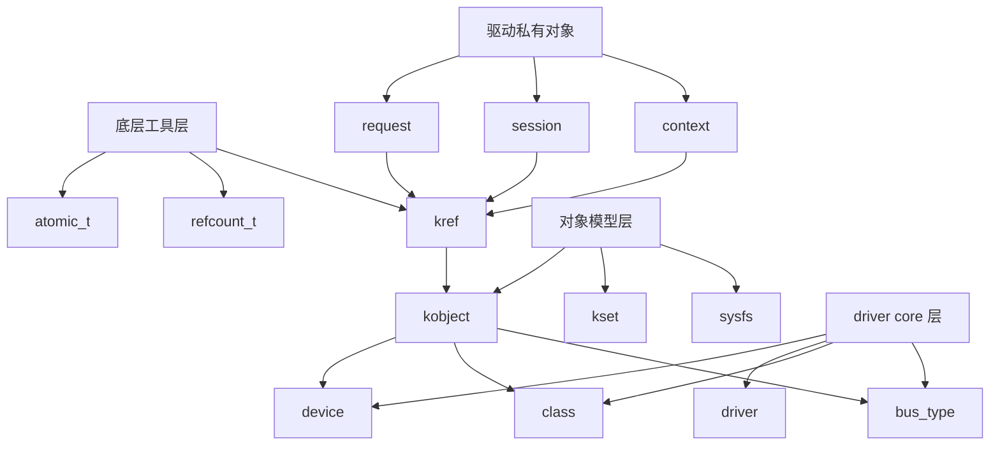
```mermaid
flowchart TD
    A["底层工具层"] --> A1["atomic_t"]
    A --> A2["refcount_t"]
    A --> A3["kref"]

    B["对象模型层"] --> B1["kobject"]
    B --> B2["kset"]
    B --> B3["sysfs"]

    C["driver core 层"] --> C1["device"]
    C --> C2["driver"]
    C --> C3["class"]
    C --> C4["bus_type"]

    A3 --> B1
    B1 --> C1
    B1 --> C3
    B1 --> C4

    D["驱动私有对象"] --> D1["request"]
    D --> D2["session"]
    D --> D3["context"]
    D1 --> A3
    D2 --> A3
    D3 --> A3
```

------

### 11.5.2\_为什么裸\_kref\_示例不能直接套到\_device/class/bus

前面章节里经常用这种对象：

```c
struct my_obj {
	struct kref ref;
	struct list_head node;
	int id;
};
```

这是教学模型。

它的假设是：

```text
对象是你自己定义的；
对象由你自己发布到集合；
对象由你自己 lookup；
对象由你自己 get/put；
对象由你自己的 release 销毁。
```

但是 `struct device` 的假设完全不同：

```text
对象被 driver core 注册；
对象可能出现在 sysfs；
对象可能属于 bus；
对象可能属于 class；
对象可能有 parent；
对象可能绑定 driver；
对象可能被 core、driver、sysfs、PM、device link 等路径持有引用；
对象释放必须走 driver core 的 release 约定。
```

所以你不能把第 1-10 章里的 `my_obj` 模型直接替换成：

```c
struct device
```

然后得出：

```text
device 里面也有 kref，所以我照着 my_obj_release 写就行。
```

这是错误的。

正确理解是：

```text
my_obj 是裸生命周期对象；
device 是 driver core 对象；
两者都涉及引用计数，但生命周期协议不在同一层。
```

对比图：

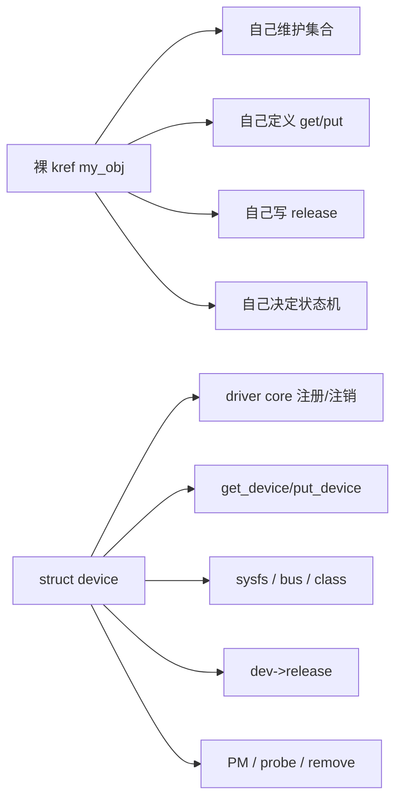
```mermaid
flowchart LR
    A["裸 kref my_obj"] --> A1["自己维护集合"]
    A --> A2["自己定义 get/put"]
    A --> A3["自己写 release"]
    A --> A4["自己决定状态机"]

    B["struct device"] --> B1["driver core 注册/注销"]
    B --> B2["get_device/put_device"]
    B --> B3["sysfs / bus / class"]
    B --> B4["dev->release"]
    B --> B5["PM / probe / remove"]
```

一句话：

```text
裸 kref 讲的是自定义对象生命周期；
device/class/bus 讲的是 driver core 已经封装好的分层对象模型。
```

------

### 11.5.3\_kobject\_和\_device\_中仍然可以有私有\_kref\_吗

可以，但要非常谨慎。

有些驱动对象可能长这样：

```c
struct my_dev {
	struct device dev;

	struct kref ref;
	struct mutex lock;

	struct list_head sessions;
};
```

这里有两个生命周期层次：

```text
struct device dev：
    driver core 设备对象生命周期。

struct kref ref：
    驱动私有业务对象生命周期。
```

这时必须明确：

```text
dev 的引用由 get_device/put_device 管；
my_dev 私有业务引用由 kref_get/kref_put 管；
两者不能混用。
```

错误写法：

```c
kref_get(&mdev->ref);
/* 以为这能保护 mdev->dev 在 driver core 中有效 */
```

这不一定成立。

因为：

```text
私有 kref 只能保护你定义的私有生命周期；
不能替代 driver core 对 struct device 的引用规则。
```

反过来也一样：

```c
get_device(&mdev->dev);
/* 以为这能保护所有私有业务状态可用 */
```

这也不一定成立。

因为：

```text
get_device 保护 device 对象生命周期；
不代表你的私有 session、队列、硬件状态、业务状态仍然可用。
```

所以如果一个结构里同时存在 `struct device` 和私有 `struct kref`，需要明确两张表。

#### (1)\_device\_引用表

```text
引用对象：
    struct device dev

引用 API：
    get_device()
    put_device()

release：
    dev->release

保护内容：
    driver core 设备对象生命周期
```

#### (2)\_私有\_kref\_引用表

```text
引用对象：
    struct my_dev / my_session / my_request

引用 API：
    kref_get()
    kref_put()

release：
    my_xxx_release(struct kref *ref)

保护内容：
    私有业务对象生命周期
```

不要把两张表合成一张。

------

### 11.5.4\_一个典型的分层结构

假设你写一个驱动，里面有设备对象和用户会话对象：

```c
struct my_device {
	struct device dev;
	struct mutex lock;
	bool dying;

	struct list_head session_list;
};

struct my_session {
	struct kref ref;
	struct my_device *mdev;
	struct list_head node;
	int id;
};
```

这里的生命周期层次是：

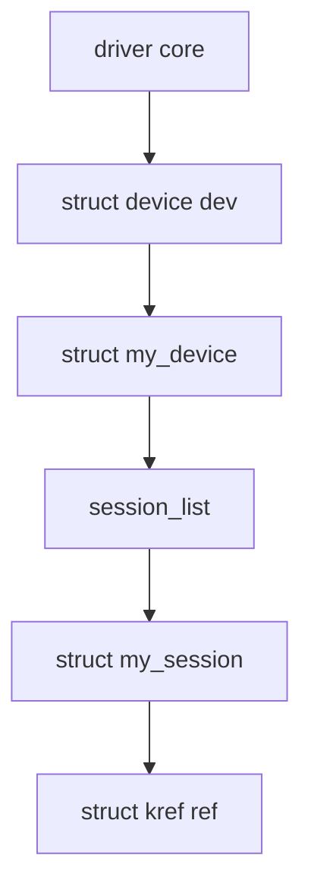
```mermaid
flowchart TD
    A["driver core"] --> B["struct device dev"]
    B --> C["struct my_device"]
    C --> D["session_list"]
    D --> E["struct my_session"]
    E --> F["struct kref ref"]
```

但是注意：

```text
my_session 的 kref 不等于 my_device 的 device 引用；
my_device 的 dev 引用不等于 my_session 的引用；
session_list 的锁不等于 session 的生命周期；
dying 状态不等于引用计数。
```

可能的规则是：

```text
my_device：
    由 driver core 管理注册和注销；
    用 get_device/put_device 保护 device 对象；
    remove 时设置 dying，阻止新 session 创建。

my_session：
    由驱动自己管理；
    创建时 kref_init；
    加入 session_list 前持有一个引用；
    异步任务或用户上下文使用时 kref_get；
    最后 put 时 my_session_release。
```

这比简单说：

```text
device 管 session
```

准确得多。

因为真正要回答的是：

```text
session 是否持有 mdev？
mdev remove 时如何阻止新 session？
已有 session 如何退出？
session 是否需要 get_device(&mdev->dev)？
mdev release 前是否必须 drain 所有 session？
session release 是否能访问 mdev？
```

这些都不是 `kref` 或 `device` 自动帮你决定的。

------

### 11.5.5\_container\_of\_在不同层次中的作用

裸 kref：

```c
static void my_obj_release(struct kref *ref)
{
	struct my_obj *obj = container_of(ref, struct my_obj, ref);
}
```

kobject：

```c
static void my_kobj_release(struct kobject *kobj)
{
	struct my_obj *obj = container_of(kobj, struct my_obj, kobj);
}
```

device：

```c
static void my_dev_release(struct device *dev)
{
	struct my_device *mdev = container_of(dev, struct my_device, dev);
}
```

这三种写法都使用 `container_of()`。

但是不要因为都用了 `container_of()`，就认为它们是同一层机制。

`container_of()` 只是：

```text
通过内嵌成员指针找回外层对象。
```

它不决定：

```text
引用计数语义；
release 语义；
sysfs 语义；
driver core 语义；
对象是否可 lookup；
对象是否 dying。
```

对比：

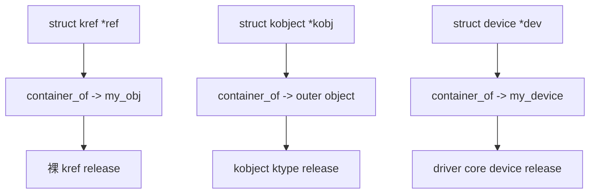
```mermaid
flowchart TD
    A["struct kref *ref"] --> A1["container_of -> my_obj"]
    B["struct kobject *kobj"] --> B1["container_of -> outer object"]
    C["struct device *dev"] --> C1["container_of -> my_device"]

    A1 --> D["裸 kref release"]
    B1 --> E["kobject ktype release"]
    C1 --> F["driver core device release"]
```

同一个 C 技巧，不代表同一种生命周期协议。

------

### 11.5.6\_不同层次的\_get/put\_命名规律

可以把命名规律记成下面这样：

```text
你操作什么对象，就用那个对象层次的 get/put。
```

具体：

```c
struct my_obj *obj;
kref_get(&obj->ref);
kref_put(&obj->ref, my_obj_release);
struct kobject *kobj;
kobject_get(kobj);
kobject_put(kobj);
struct device *dev;
get_device(dev);
put_device(dev);
struct module *mod;
try_module_get(mod);
module_put(mod);
struct file *file;
get_file(file);
fput(file);
```

这说明 Linux 内核里引用计数不是只有一个 API。

原因是：

```text
不同对象层次有不同生命周期协议。
```

不要看到引用计数就统一替换成 `kref_get/kref_put`。

`kref_get/kref_put` 只适合：

```text
你自己在对象里嵌入 struct kref；
你自己定义 release；
你自己管理引用归属。
```

------

## 11.6\_本章常见误解

### 11.6.1\_误解一\_kobject\_是高级\_kref

错误。

更准确：

```text
kobject 是带引用计数、名字、父子层级、ktype、sysfs 表示和 kset 归属的内核对象模型。
```

如果只是引用计数，用 `kref`。

------

### 11.6.2\_误解二\_device\_就是内嵌\_kref\_的对象

错误。

更准确：

```text
device 是 driver core 的设备对象；
引用计数只是它生命周期管理的一部分。
```

对 `struct device` 应该用：

```c
get_device(dev);
put_device(dev);
```

不是手动摸内部 kref。

------

### 11.6.3\_误解三\_class/bus\_是\_device\_的总引用管理器

错误。

更准确：

```text
class 是分类视图；
bus 是匹配和组织机制；
device 是设备实例；
它们之间有 driver core 关系，但不是简单的“大 kref 管小 kref”。
```

------

### 11.6.4\_误解四\_release\_都是\_kfree

错误。

release 可能做：

```text
取消 sysfs 表示；
释放属性组；
释放私有资源；
释放子对象；
等待异步路径；
call_rcu/kfree_rcu；
最终 kfree 外层对象。
```

而且不同层次 release 的入口参数不同：

```text
kref release:
    struct kref *

kobject release:
    struct kobject *

device release:
    struct device *
```

------

### 11.6.5\_误解五\_get\_device\_可以替代私有\_kref

不一定。

`get_device()` 保护的是：

```text
struct device 对象生命周期。
```

它不自动保护：

```text
你的私有 request；
你的私有 session；
你的硬件状态；
你的业务队列；
你的 opened file context。
```

如果这些私有对象有独立生命周期，仍然需要自己的引用模型。

------

### 11.6.6\_误解六\_私有\_kref\_可以替代\_get\_device

也不一定。

私有 `kref` 保护的是：

```text
你定义的私有对象。
```

它不自动保护：

```text
driver core 对 struct device 的生命周期规则。
```

如果你要长期保存 `struct device *dev`，通常要按 driver core 规则持有设备引用。

------

## 11.7\_选择规则

写代码时可以按下面规则选择。

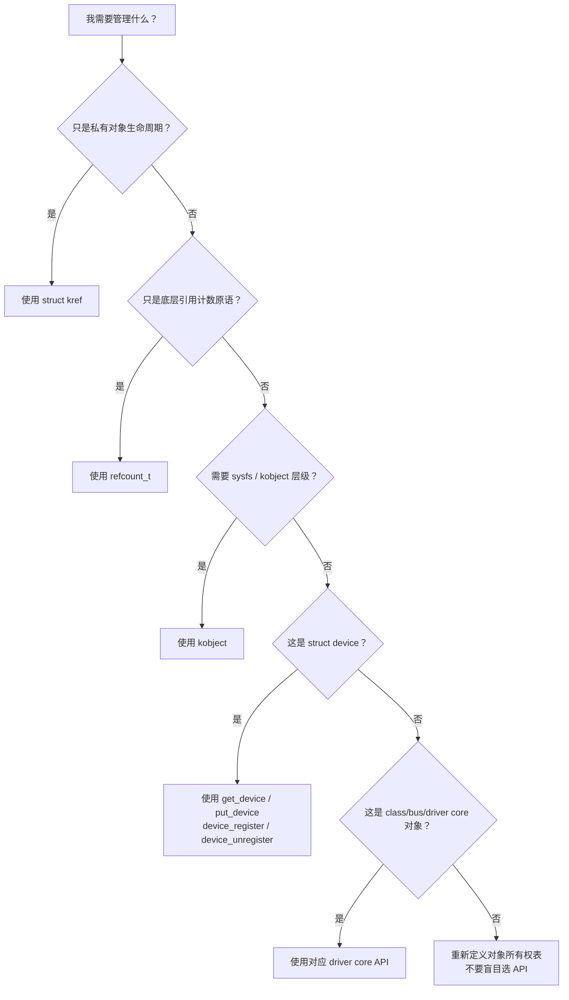
```mermaid
flowchart TD
    A["我需要管理什么？"] --> B{"只是私有对象生命周期？"}
    B -- "是" --> C["使用 struct kref"]

    B -- "否" --> D{"只是底层引用计数原语？"}
    D -- "是" --> E["使用 refcount_t"]

    D -- "否" --> F{"需要 sysfs / kobject 层级？"}
    F -- "是" --> G["使用 kobject"]

    F -- "否" --> H{"这是 struct device？"}
    H -- "是" --> I["使用 get_device / put_device<br/>device_register / device_unregister"]

    H -- "否" --> J{"这是 class/bus/driver core 对象？"}
    J -- "是" --> K["使用对应 driver core API"]

    J -- "否" --> L["重新定义对象所有权表<br/>不要盲目选 API"]
```

简化成表：

| 需求                   | 优先选择                                    |
| ---------------------- | ------------------------------------------- |
| 私有对象生命周期       | `struct kref`                               |
| 自己封装更底层引用计数 | `refcount_t`                                |
| 通用原子变量           | `atomic_t`                                  |
| sysfs 层级对象         | `struct kobject`                            |
| 设备对象生命周期       | `get_device()` / `put_device()`             |
| 设备注册注销           | `device_register()` / `device_unregister()` |
| 分类设备               | `struct class` / class API                  |
| 设备驱动匹配           | `struct bus_type` / bus API                 |

------

## 11.8\_和前面章节的关系

第 1 章讲：

```text
kref 解决的是引用所有权，不是锁，不是状态机，不是设备安全代理。
```

第 2 章讲：

```text
struct kref 内部嵌入 refcount_t；
release 通过 container_of 找回外层对象。
```

第 3 章讲：

```text
kref_init/get/put/release 串成生命周期状态机。
```

第 8、9、10 章讲：

```text
lookup、锁、RCU 如何保护 get 前窗口。
```

本章补上边界：

```text
这些规则主要针对裸 kref 私有对象；
不能直接照搬到 kobject/device/class/bus。
```

也就是说：

```text
裸 kref 是你自己管理对象生命周期；
driver core 对象是框架已经定义好了生命周期协议。
```

三层关系如下：

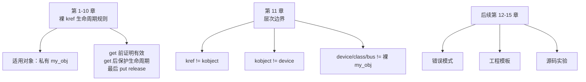
```mermaid
flowchart TD
    A["第 1-10 章<br/>裸 kref 生命周期规则"] --> B["适用对象：私有 my_obj"]
    A --> C["get 前证明有效<br/>get 后保护生命周期<br/>最后 put release"]

    D["第 11 章<br/>层次边界"] --> E["kref != kobject"]
    D --> F["kobject != device"]
    D --> G["device/class/bus != 裸 my_obj"]

    H["后续第 12-15 章"] --> I["错误模式"]
    H --> J["工程模板"]
    H --> K["源码实验"]
```

------

## 11.9\_本章检查清单

看到一个引用计数对象时，先问这些问题：

```text
1. 这是私有对象，还是 driver core 对象？
2. 对象里是 struct kref，还是 struct kobject，还是 struct device？
3. 应该用 kref_get，还是 kobject_get，还是 get_device？
4. release 的参数是 struct kref *、struct kobject *，还是 struct device *？
5. release 是我自己定义的，还是 ktype/device/class/bus 框架定义的？
6. 这个对象是否需要出现在 sysfs？
7. 这个对象是否参与 uevent？
8. 这个对象是否有 parent/child 层级？
9. 这个对象是否属于 class？
10. 这个对象是否挂在 bus 上参与 match/probe/remove？
11. 我是不是只是为了引用计数而错误引入 kobject？
12. 我是不是把 device 当成裸 kref 对象手动管理？
13. 如果 struct device 和私有 kref 同时存在，两套引用表是否分清？
14. 私有 kref 是否错误替代了 get_device？
15. get_device 是否错误替代了私有对象状态机或私有 kref？
```

如果这些问题答不清楚，就不要急着写：

```c
kref_get(...)
```

也不要急着写：

```c
kobject_init(...)
```

先把对象层次画出来。

------

## 11.10\_本章小结

本章核心不是学习更多 API，而是分清层次。

可以压缩成下面几句话：

```text
atomic_t 是通用原子工具。

refcount_t 是引用计数安全原语。

kref 是基于 refcount_t 的对象生命周期引用计数封装。

kobject 是带名字、引用、父子层级、ktype、sysfs 表示和 kset 归属的内核对象模型。

device 是 driver core 的设备对象，不是裸 kref 的 my_obj。

class 是设备分类视图，不是业务对象 release 管理器。

bus_type 是设备和驱动匹配组织机制，不是大号 kref 管理器。
```

最重要的边界是：

```text
裸 kref 讲的是自定义对象如何管理引用；
device/class/bus 讲的是 driver core 已经封装好的分层对象模型。
```

一句话总结：

```text
需要引用计数，不等于需要 kobject；
操作 struct device，不等于直接操作 kref；
不同对象层次，必须使用对应层次的生命周期 API。
```

------

专题导航：[kref 引用计数机制章节大纲](大纲.md)。

上一篇：[kref 与 RCU](P10_kref_与_RCU.md#10.10_本章小结)。

下一篇：[典型错误模式与调试线索](P12_典型错误模式与调试线索.md)。
