# 第11章\_kref\_refcount\_t\_kobject\_的边界

## 11.1\_本章导读\_先分清对象层次

前十章已经能为一个私有对象回答：谁持有、怎样取得、谁归还、最后归还怎样清理。现在把同一个驱动放进更完整的系统：它有请求完成次数，要把请求对象交给异步使用者，还要向用户空间展示设备。三个需求都可能出现“计数”，却不能靠选一个更大的结构体一起解决。

先只看驱动内部的一次 request。它没有名字目录，没有设备匹配任务；创建者和消费者需要共享使用期限，kref 已足够组织这份责任。如果驱动还要统计一共完成多少次请求，这个统计值达到零没有销毁含义，可以使用适当的普通或原子统计工具。若把统计值误当引用，值归零就释放；若把引用误当普通统计，越界或重复归还又可能破坏回收决定。

接着增加另一种需求：用户空间希望通过 **sysfs** 中的目录和属性查看对象。sysfs 是内核把部分对象关系与属性呈现给用户空间的文件系统，常挂载在 `/sys`。现在不仅要保活，还要决定名字、父子关系、属性访问和类型清理。**kobject** 是组织这类内核对象身份与层次的基础构件；名字不是额外加一份引用就能解决的。

如果被管理的已经是设备，通常还要设备与驱动的匹配、绑定、解绑和电源管理。**driver core** 是 Linux 组织这些设备模型关系的核心框架，`struct device` 表示其中一个设备对象。**bus_type** 描述一类设备和驱动如何匹配及参与相关回调；**class** 则提供按功能组织设备的视图，例如同类输入设备。总线归属和功能分类是不同关系，不能画成“class 持大引用、bus 持小引用”的单一计数树。

本章不重讲整套 sysfs 或设备模型，而是回答：已经知道私有 kref 协议后，什么时候应该继续使用它，什么时候必须进入框架规定的接口。先看需求，再看对象中实际嵌入什么；不要从 atomic_t 一路“升级”到 device，仿佛它们只是性能或功能档次不同的计数器。

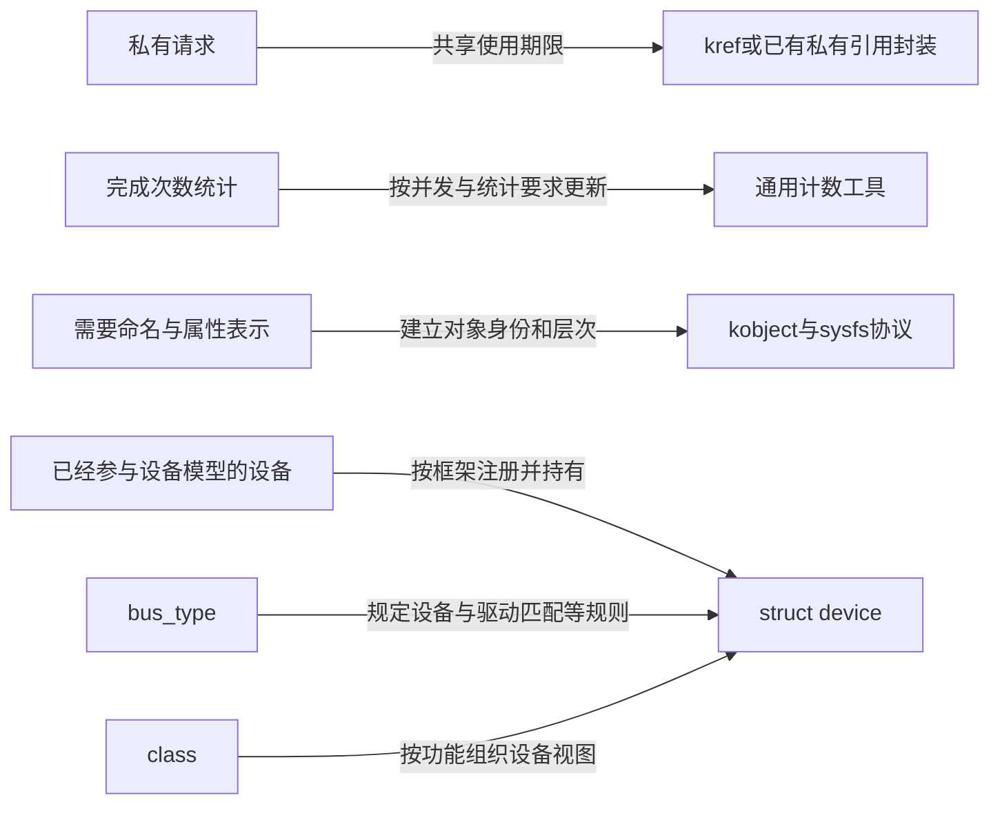
```mermaid
flowchart LR
    R[私有请求] -->|共享使用期限| K[kref或已有私有引用封装]
    S[完成次数统计] -->|按并发与统计要求更新| A[通用计数工具]
    N[需要命名与属性表示] -->|建立对象身份和层次| O[kobject与sysfs协议]
    D[已经参与设备模型的设备] -->|按框架注册并持有| V[struct device]
    B[bus_type] -->|规定设备与驱动匹配等规则| V
    C[class] -->|按功能组织设备视图| V
```

图中箭头表示需求或关系，不表示这些对象自动持有哪份引用。具体的保活与销毁路径必须继续查接口契约；一个对象与另一个对象有关联，并不意味着前者已经为后者持有引用。

## 11.2\_底层计数工具\_atomic\_t\_refcount\_t\_kref

先把范围缩回私有请求。其存储、引用安全检查和最后清理调用分别位于哪一层？这几个工具的区别要从一次完整创建—共享—退出观察，不能只比较结构体成员数。

### 11.2.1\_atomic\_t\_通用原子计数工具

atomic_t 是内核的通用原子整数类型。它让相应操作不可被其他并发更新拆开观察，但不会知道这个整数表示完成次数、状态还是对象份额。若统计两个线程各完成一次，可以按统计协议原子增加；这个用途通常不需要“从1减到0后释放对象”。

引用计数则把数值变化接到了存储回收。假设一个错误的额外归还把零减成负值，或反复增加触及表示范围，普通整数更新本身不等于安全的所有权判断。即使用 atomic_dec_and_test 检查零，也仍要证明初始份额、有效地址、不能从零重新取得、异常处理和每个失败分支的责任。

所以问题不在于 atomic_t 无法用于实现引用计数，而在于通用原子更新没有替应用提供完整引用纪律。直接手写时，这些约束会散落在多个调用点，后续维护者很容易只看到一个可随意加减的整数。

原子也不等于任意字段间都有完整顺序。不同函数及其 relaxed、acquire、release 形式有不同内存序契约。把某个 atomic 接口改成名字相似的 refcount 接口，必须重新审查原程序依赖的发布与清理顺序，不能以“都原子”代替核对。

### 11.2.2\_refcount\_t\_引用计数安全原语

refcount_t 为对象引用提供专用操作和异常处理。先从[kref 源码总索引](../../../../research/source_reading/kref/navigation/P01_Linux_6.12_kref源码阅读索引.md#1.2_按问题进入已落地证据)进入固定版本，再看[refcount_t 的存储定义](../../../../research/source_reading/kref/source_explanations/include/linux/refcount_types.h.md#1.1_原子存储字段)：它内含 atomic_t refs。专用语义来自围绕这个存储实现的操作，不是 C 类型名字本身能阻止错误赋值。

普通增加要求已经有正引用保护；条件增加允许在有效地址上处理零值失败；最后减少以返回值交付归零结果。固定实现还检测特定的下溢、从零增加及溢出异常，并采用[告警与饱和处理](../../../../research/source_reading/kref/source_explanations/lib/refcount.c.md#1.1_告警之前先收敛到饱和)。这降低引用错误转成错误回收的风险，却不会让已经错误的所有权协议恢复健康；饱和可能使对象不再正常回收。

直接用 refcount_t 的对象通常在自己的 put 封装中处理最后减少，例如下面的接口片段。它假设调用者确有一份，且 sample_release 是该类型约定的最终清理函数：

```c
static void sample_put(struct sample_object *obj)
{
    if (refcount_dec_and_test(&obj->refs))
        sample_release(obj); /* 最后减少的结果由本类型封装接到清理。 */
}
```

这本身是合法设计，不因没有采用 container_of 或字段名叫 refs 就成为缺陷。如果现有子系统已经提供成熟的 sample_get/sample_put，继续遵循它的接口；仅为了统一拼写而转换 kref，会增加审查范围且不自动改善正确性。

真正需要核对的是内存序和外层协议。固定 NXP Linux 6.12.20 的 Documentation/core-api/refcount-vs-atomic.rst 对比指出：普通 refcount 增加不替代发布读取；refcount_dec_and_test 提供 release，并在归零成功路径建立相应 acquire；从部分原子条件增加迁移到 refcount 条件增加时，原有的完全有序保证也不能照搬。精确函数链见[普通减少](../../../../research/source_reading/kref/source_explanations/include/linux/refcount.h.md#1.3_旧值决定归零与异常分支)和[条件比较](../../../../research/source_reading/kref/source_explanations/include/linux/refcount.h.md#1.5_条件增加与失败重试)。

不必在这一节背诵全部屏障规则，但要记住审查顺序：先找到原来是谁发布对象、谁取得可见地址，再核对引用 API 是否改变了原来依赖的顺序。引用操作不是所有字段的 acquire/release 万用包装。

### 11.2.3\_kref\_对象生命周期引用计数封装

kref 进一步把“最后减少成功，就调用本次传入的清理函数”组织成常用接口。固定[计数成员定义](../../../../research/source_reading/kref/source_explanations/include/linux/kref.h.md#1.1_计数成员)只保存 refcount_t；对象地址、锁、状态以及清理回调都不存放在这个成员里。回调作为参数传给[kref_put](../../../../research/source_reading/kref/source_explanations/include/linux/kref.h.md#1.4_最后归还调用清理)，由最后归还的那条路径同步调用。

回到 P02 的完整 [note_kref_object.c](../../../../labs/kernel/object_lifetime/materials/note_kref_object.c)。本章复用原程序观察接口分工，不增加另一套只差字段名的对象；完整源码与构建步骤见[P02 对象模板](P02_源码入口与结构定义.md#2.19_标准自定义引用对象模板)。沿同一程序逐个预测：

| 阶段 | 应用函数与实际责任 | kref/refcount层的动作 |
| --- | --- | --- |
| S0 创建 | my_refobj_alloc 申请外壳，随后申请data | kref_init 建立初始一份；不自动分配data |
| S1 交付 | 完整初始化成功后才把地址返回创建者 | 单纯返回不自动增加份额 |
| S2 共享 | my_refobj_get 以已有正引用为前提，为consumer追加一份 | 普通增加1→2；不验证任意裸地址 |
| S3 使用 | creator归还后，consumer打印固定id/state/data | 2→1保留存储；字段正确性仍来自本例同步初始化与使用 |
| S4 最后归还 | consumer调用my_refobj_put | 1→0后kref_put调用指定release |
| S5 清理 | my_refobj_release回收data，再回收外壳 | container_of恢复地址；清理步骤由应用定义 |

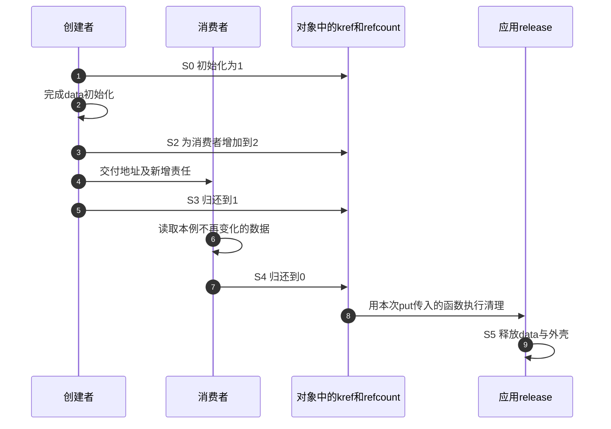
```mermaid
sequenceDiagram
    autonumber
    participant A as 创建者
    participant B as 消费者
    participant K as 对象中的kref和refcount
    participant F as 应用release
    A->>K: S0 初始化为1
    A->>A: 完成data初始化
    A->>K: S2 为消费者增加到2
    A->>B: 交付地址及新增责任
    A->>K: S3 归还到1
    B->>B: 读取本例不再变化的数据
    B->>K: S4 归还到0
    K->>F: 用本次put传入的函数执行清理
    F->>F: S5 释放data与外壳
```

再看 data 申请失败。外壳已经建立初始份额，所以失败路径通过同一个 put 进入 release；kzalloc 使 data 尚为空，应用清理允许这一部分初始化状态。kref 不替你判断“构造到第几步”，更不自动回收子资源，正确性来自应用回调支持这一状态。

原程序及其已有验证记录保持不变，本批没有重新运行目标模块或增加行为覆盖。阅读练习是给每个调用标出“地址来自谁、归还哪份、是否可能最后一次”，而不是把所有出现 get 的地方都当成同一种查找。

### 11.2.4\_kref\_和\_refcount\_t\_的关系

这三个名字现在可以放在同一张关系图里，因为它们各自解决的问题已经出现：

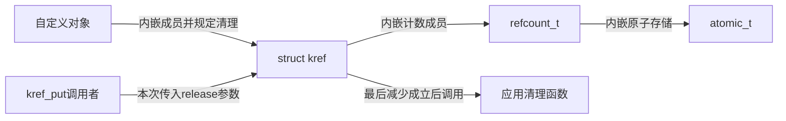
```mermaid
flowchart LR
    O[自定义对象] -->|内嵌成员并规定清理| K[struct kref]
    K -->|内嵌计数成员| R[refcount_t]
    R -->|内嵌原子存储| A[atomic_t]
    P[kref_put调用者] -->|本次传入release参数| K
    K -->|最后减少成立后调用| F[应用清理函数]
```

| 当前任务 | 可选工具或接口 | 选择依据 |
| --- | --- | --- |
| 普通并发统计或状态 | 按具体并发需求选原子或锁 | 不把零值解释为对象最后责任 |
| 已有类型封装需要引用原语 | refcount_t及该类型get/put | 类型已规定最后减少与清理的衔接 |
| 新的简单私有共享对象 | kref加类型封装 | 使用现成的初始化、取得、归还与回调形态 |
| 已经拿到框架对象 | 后文的kobject/device等接口 | 框架拥有额外身份、发布和销毁契约 |

kref 并未增加一套与 refcount 并行的引用数，也不是两次 get 或两次 put。选择它不会解决链表登记、业务关门、RCU 窗口或字段锁；直接使用 refcount_t 也不表示对象必然更危险、更快或更高级。

做一个迁移练习：若把原程序的 ref 成员改成 refcount_t，除了改名，还要在哪里接回 release，回调参数怎样调整，data 失败时由谁归还初始份额？答案应覆盖 S0、S2、S4 和部分初始化失败，且仍保持同一个清理出口。只有数值路径相同还不够，原子 API 的内存序差异也要按前节检查。下一节再增加“对象需要名字与属性表示”这一新约束，进入 kobject。

## 11.3\_kobject\_边界\_引用计数之外的对象模型

已有的请求对象可以被正确共享，却还没有名字或目录。现在给一个简单对象增加名称，并观察“目录已经撤下、外壳仍被引用”这一新组合。先把它和裸 kref 的共同责任接起来，再看框架额外管理哪些状态。

### 11.3.1\_kobject\_不只是引用计数

对象名字、父节点和类型描述不能由一个引用数推导出来。kobject 把这些身份关系与内嵌 kref 放在一起，并提供配套的初始化、添加、撤下和最终清理接口。**kobj_type** 是类型级描述，提供最终 release 和可选属性等规则；每个实例通过指针关联它。**kset** 是 kobject 的集合组织之一，并可参与事件处理，它不等于业务链表，也不要求每个对象都加入一个。

对象添加到 sysfs 后，用户空间可能看到对应目录；**uevent** 则是内核对象事件通知。二者并非同一个动作：固定 kobject_add/init_and_add 的添加成功不会自动替调用者发送 ADD 事件。属性和事件要根据真实接口需求设计，不能把“用了 kobject”当作用户空间已经被通知。

先从[kref 源码总索引](../../../../research/source_reading/kref/navigation/P01_Linux_6.12_kref源码阅读索引.md#1.2_按问题进入已落地证据)进入新增的[kobject模块导读](../../../../research/source_reading/kref/navigation/P07_kobject身份与类型清理导读.md#7.2_从K0到K5连接状态与回调)。本章使用固定 NXP Linux 6.12.20 的 include/linux/kobject.h 与 lib/kobject.c，仍以官方不可变提交为证据，不从实验HEAD推断。

这不是一个仅靠计数推进的状态机。初始化事实、sysfs登记、事件发送和父关系分别保存状态；下面用 K0～K5 说明它们怎样在一次操作周期中相接：

| 阶段 | 本对象责任 | 身份与框架动作 |
| --- | --- | --- |
| K0 初始化 | 初始一份归创建者 | 初始化内部状态、关联类型描述 |
| K1 添加 | 成功不消费K0份额；失败也仍需归还 | 建立名称、父关系与目录，失败清理按框架规则 |
| K2 追加观察者 | 自己已有正引用才用kobject_get | 返回同一个地址，不重新发布目录 |
| K3 主动撤下 | 本对象份额不减少 | kobject_del撤下目录与关系，归还相应父引用 |
| K4 各方归还 | 最后一份触发core的kobject_release | 普通配置同步清理；调试配置可能延迟 |
| K5 类型清理 | 类型release可以销毁外壳 | core处理其负责的名字与关系收尾 |

完整 [note_kobject.c](../../../../labs/kernel/object_lifetime/materials/note_kobject.c) 只创建一个带固定值的对象，在 `/sys/kernel` 下短暂添加 `note_kref_lifetime` 目录，再在初始化期间撤下。它没有属性接口、外部用户或主动 ADD 事件，目的只是观察登记与存储期限的区别；不能用用户空间没来得及看见目录判断添加失败。

```c
// SPDX-License-Identifier: GPL-2.0
#include <linux/errno.h>
#include <linux/kobject.h>
#include <linux/module.h>
#include <linux/slab.h>

struct named_object {
    struct kobject kobj;
    int value; /* 发布前固定，本例不提供属性读写入口。 */
};
static unsigned int release_calls;

static void named_release(struct kobject *kobj)
{
    struct named_object *obj = container_of(kobj, struct named_object, kobj);
    ++release_calls;
    kfree(obj); /* 名称和父引用由kobject core按自己的协议清理。 */
}
static const struct kobj_type named_type = { .release = named_release };

static int __init note_kobject_init(void)
{
    struct named_object *creator, *reader;
    struct kobject *held;
    int result;

    /* 此同步演示不实现延迟调试释放时模块代码的异步退出协议。 */
    if (!IS_ENABLED(CONFIG_SYSFS) || IS_ENABLED(CONFIG_DEBUG_KOBJECT_RELEASE))
        return -EOPNOTSUPP;
    creator = kzalloc(sizeof(*creator), GFP_KERNEL);
    if (!creator)
        return -ENOMEM;
    creator->value = 7;
    result = kobject_init_and_add(&creator->kobj, &named_type,
                                 kernel_kobj, "note_kref_lifetime");
    if (result) {
        kobject_put(&creator->kobj); /* 初始化已完成，失败也经类型回调。 */
        return result;
    }
    held = kobject_get(&creator->kobj); /* 已拥有正引用，追加观察者的一份。 */
    reader = container_of(held, struct named_object, kobj);
    pr_info("note_kobject: added value=%d release=%u\n", reader->value, release_calls);
    kobject_del(&creator->kobj); /* 撤下层次与sysfs入口，不归还本对象初始一份。 */
    kobject_put(&creator->kobj);
    creator = NULL;
    pr_info("note_kobject: removed value=%d release=%u\n", reader->value, release_calls);
    kobject_put(held); /* 最后观察者归还，core再调用named_type.release。 */
    return 0;
}

static void __exit note_kobject_exit(void)
{
    /* 无外部入口、无异步持有者；支持配置下init已完成所有归还。 */
    pr_info("note_kobject: release=%u\n", release_calls);
}
module_init(note_kobject_init);
module_exit(note_kobject_exit);
MODULE_LICENSE("GPL");
MODULE_DESCRIPTION("kobject撤下与最后引用分离的同步演示");
```

本演示要求 CONFIG_SYSFS 开启且 CONFIG_DEBUG_KOBJECT_RELEASE 关闭，否则初始化直接返回 -EOPNOTSUPP，不建立对象。后一个选项会让框架延迟执行类型清理；演示没有实现那种情况下的模块代码退出协议，因此明确拒绝，而不是让模块先卸载再执行它的函数地址。

Linux 目标构建和观察步骤如下，KDIR 应指向与运行内核相匹配的构建环境：

```bash
make -C "$KDIR" M="$PWD/labs/kernel/object_lifetime/materials" modules
sudo insmod labs/kernel/object_lifetime/materials/note_kobject.ko
sudo rmmod note_kobject
sudo dmesg | tail -n 20
```

预计支持配置下的日志为：

```text
note_kobject: added value=7 release=0
note_kobject: removed value=7 release=0
note_kobject: release=1
```

第二行中目录已经撤下，创建者也已归还，但观察者仍持一份，所以仍可读取发布前固定的 value。第三行说明最后观察者归还后才完成类型清理。对象可能在最后 put 内立即消失，程序没有再通过 reader 或 held 访问它。

本次 ARM 前端和七组宿主检查通过；宿主执行固定九个 kobject 函数与既有普通引用链，命名、sysfs、分配等为显式替身。两类不支持配置、分配失败、添加失败、正常周期、隐式/显式撤下和 NULL 包装均检查；目标链接、装卸、实际 sysfs/事件、并发及调试延迟释放分支未执行。日志是预期目标结果，不冒充实际内核运行。

### 11.3.2\_kobject\_的\_release\_和\_kref\_release\_的区别

在裸 kref 程序里，每次 put 由应用传入 `void (*)(struct kref *)`。在本例里，应用调用 kobject_put，不再自行挑选内部 kref 回调；core 固定传入自己的 kobject_release，后者经过清理流程才分派到 `named_type.release`，其参数是 `struct kobject *`。

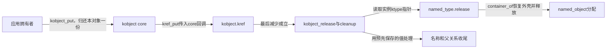
```mermaid
flowchart LR
    U[应用拥有者] -->|kobject_put，归还本对象一份| P[kobject core]
    P -->|kref_put传入core回调| R[kobject.kref]
    R -->|最后减少成立| C[kobject_release与cleanup]
    C -->|读取实例ktype指针| T[named_type.release]
    T -->|container_of恢复外壳并释放| O[named_object分配]
    C -->|用预先保存的值处理| N[名称和父关系收尾]
```

入口参数不同只是表面差别。真正多出来的是 core 在类型回调前后仍有自己的清理责任。固定[最后归还实现](../../../../research/source_reading/kref/source_explanations/lib/kobject.c.md#1.4_最后归还进入类型清理)先保存 name、parent 和类型，必要时补做撤下，再调用类型 release；因为外壳此时可能已经释放，之后不能再从旧 kobj 读取成员。

所以 named_release 只回收自己的外壳，不额外 free core 管理的名字，也不随意再 put 同一个父引用。`struct kobj_type` 和其中函数代码同样必须活到全部实例的最终清理；把类型描述放到早已返回的函数栈上，即使对象引用还在也会留下悬空指针。[类型描述定义](../../../../research/source_reading/kref/source_explanations/include/linux/kobject.h.md#1.2_类型回调不存放在内嵌kref里)展示的是这条实例到类型的地址关系。

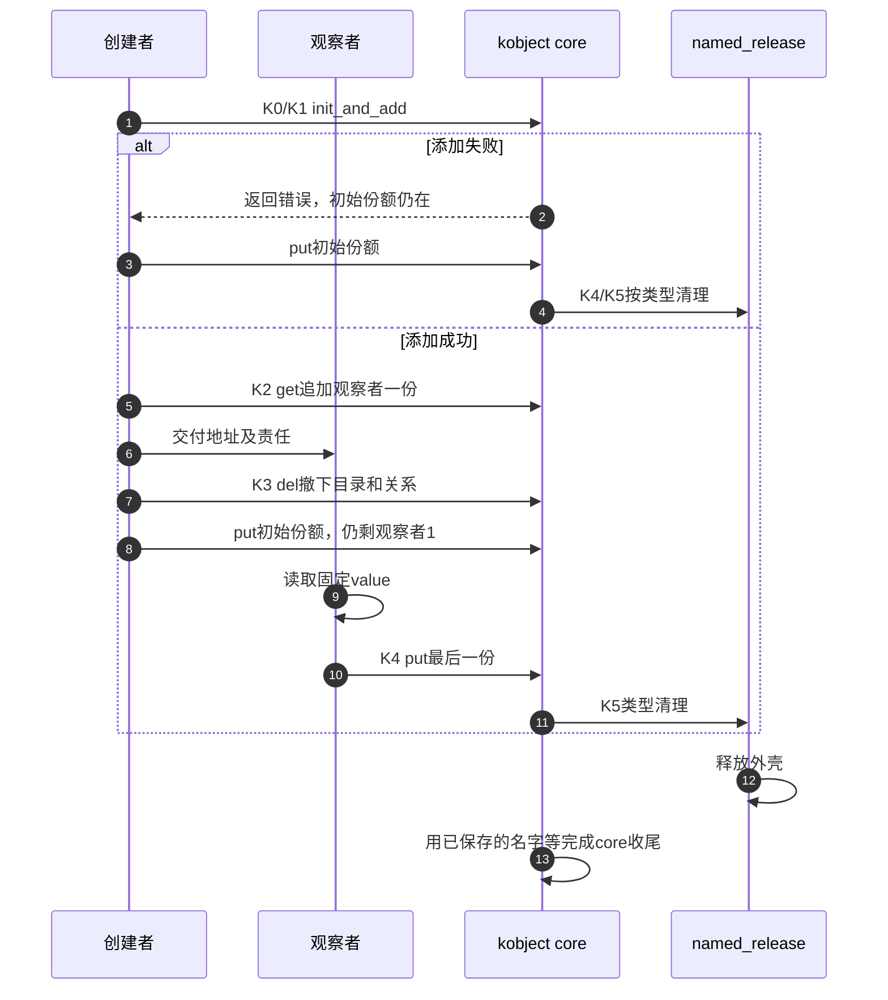
```mermaid
sequenceDiagram
    autonumber
    participant A as 创建者
    participant B as 观察者
    participant K as kobject core
    participant T as named_release
    A->>K: K0/K1 init_and_add
    alt 添加失败
        K-->>A: 返回错误，初始份额仍在
        A->>K: put初始份额
        K->>T: K4/K5按类型清理
    else 添加成功
        A->>K: K2 get追加观察者一份
        A->>B: 交付地址及责任
        A->>K: K3 del撤下目录和关系
        A->>K: put初始份额，仍剩观察者1
        B->>B: 读取固定value
        B->>K: K4 put最后一份
        K->>T: K5类型清理
    end
    T->>T: 释放外壳
    K->>K: 用已保存的名字等完成core收尾
```

图示采用模块支持的非调试延迟配置。固定实现的调试分支会安排延迟工作，不能从这张同步轨迹推断所有配置下最后 put 返回就已经完成类型 release。

再核对两个容易误写的失败/撤下动作。其一，[初始化与添加包装](../../../../research/source_reading/kref/source_explanations/lib/kobject.c.md#1.1_初始化后失败仍有初始责任)已经先初始化一份，即使添加失败也应该 put，而非直接 kfree 外壳。其二，[kobject_del](../../../../research/source_reading/kref/source_explanations/lib/kobject.c.md#1.3_撤下层次不消费本对象引用)归还的是相应父关系责任，不消费本对象初始一份；不能少 put，也不能把 del 当作自动最后销毁。

### 11.3.3\_为什么不要为了引用计数强行引入\_kobject

现在可以具体比较成本。私有 request 若只有创建者和消费者，kref 加类型封装已经能完成责任转移；引入 kobject 会让实例还要维持类型描述、名字/登记决策、失败清理与层次退出，新增的状态没有解决请求原本的业务问题。

反过来，如果对象确实需要稳定身份和属性表示，就不能只在私有结构里加一个 name 字符串，便假定 sysfs 和用户空间访问已自动安全。应先查所在子系统是否已有适当的高层对象，再按该框架管理发布和退出。已经是设备时通常进入 device 层，不为了创建一个目录另造一套与设备并行的 kobject 身份。

也不必为了“用齐 kobject”给每个类型填满 sysfs_ops、default_groups、kset 和事件回调。本例只展示空目录与类型清理，因此只提供必要 release；具体需求增加以后，再补相应访问和退出规则。

做三项练习。先删去正常路径的观察者 get，说明为何后续不能继续保留 reader 别名；再保留观察者、去掉显式 del，沿固定 cleanup 的 state_in_sysfs 分支解释目录何时被清理；最后让添加返回名称冲突，证明为什么错误返回仍要消费K0那一份。宿主检查覆盖了后两类清理路径，第一项只作所有权推导，不运行悬空访问。

下一节把已有框架身份继续接到设备注册、解绑和资源管理。设备的引用、是否登记、驱动资源是否仍可用仍是不同问题，不能把本节的 kobject_del/put 名字直接替换成所有设备退出动作。

## 11.4\_driver\_core\_边界\_device\_class\_bus\_不是裸\_kref

kobject 已经建立名字、层次和类型回调；设备模型又规定设备怎样登记、怎样与驱动及其他设备关联。进入这一层以后，不能只看到内嵌 kref 就绕过框架接口。

### 11.4.1\_device\_driver\_core\_已经封装好的对象模型

struct device 表示一个设备模型对象。**驱动绑定** 表示由某个驱动接管这个设备的操作，而 **设备登记** 表示对象进入核心框架的设备关系与可见体系。二者不同：一个设备可以已经登记但尚未找到驱动，也可以在驱动解绑以后仍保留设备对象。

父设备关系描述设备模型层次，bus 参与设备与驱动匹配，class 提供功能分类。电源管理、DMA配置、设备链接等也可能与设备对象关联，但这些关联各有建立和退出步骤；不能仅从结构体里有相应指针，就声称每一条都拥有相同的引用。

先运行一个不绑定真实驱动的最小观察程序，专门回答“注销返回后，另一个拥有者还能保留什么”。完整 [note_device.c](../../../../labs/kernel/object_lifetime/materials/note_device.c) 动态创建包含 struct device 的外壳，初始化、命名并添加，追加观察者份额，再注销和最终归还。它没有定义硬件I/O或驱动私有资源，因此注销后只读外壳中发布前固定的 value，不借此声称设备仍可操作。

```c
// SPDX-License-Identifier: GPL-2.0
#include <linux/device.h>
#include <linux/errno.h>
#include <linux/module.h>
#include <linux/slab.h>

struct note_device {
    struct device dev;
    int value; /* 本例发布前固定，不表示硬件仍可操作。 */
};
static unsigned int release_calls;

static void note_device_release(struct device *dev)
{
    struct note_device *obj = container_of(dev, struct note_device, dev);
    ++release_calls;
    kfree(obj);
}

static int __init note_device_init(void)
{
    struct note_device *creator, *reader;
    struct device *held;
    int result;
    if (!IS_ENABLED(CONFIG_SYSFS) || IS_ENABLED(CONFIG_DEBUG_KOBJECT_RELEASE))
        return -EOPNOTSUPP; /* 同步演示不实现调试延迟释放的代码退出。 */
    creator = kzalloc(sizeof(*creator), GFP_KERNEL);
    if (!creator)
        return -ENOMEM;
    creator->value = 7;
    device_initialize(&creator->dev);
    creator->dev.release = note_device_release;
    result = dev_set_name(&creator->dev, "note_device_lifetime");
    if (result)
        goto put_creator;
    result = device_add(&creator->dev);
    if (result)
        goto put_creator;
    held = get_device(&creator->dev); /* 已有正引用，取得观察者一份。 */
    reader = container_of(held, struct note_device, dev);
    pr_info("note_device: added value=%d release=%u\n", reader->value, release_calls);
    device_unregister(&creator->dev); /* 已包含归还初始化份额，不再额外put它。 */
    creator = NULL;
    pr_info("note_device: removed value=%d release=%u\n", reader->value, release_calls);
    put_device(held);
    return 0;
put_creator:
    put_device(&creator->dev); /* 初始化后，即使命名或添加失败也由框架清理。 */
    return result;
}

static void __exit note_device_exit(void)
{
    pr_info("note_device: release=%u\n", release_calls);
}
module_init(note_device_init);
module_exit(note_device_exit);
MODULE_LICENSE("GPL");
MODULE_DESCRIPTION("设备注销与最终引用回收的同步演示");
```

模块沿前节的同步限制：CONFIG_SYSFS开启、CONFIG_DEBUG_KOBJECT_RELEASE关闭，否则提前拒绝。它在初始化内短暂添加并注销名为note_device_lifetime的设备；device层可能按框架条件处理目录、属性与事件，例子不提供外部业务入口。完整driver core发布过程不能由三个日志概括成已经验证。

```bash
make -C "$KDIR" M="$PWD/labs/kernel/object_lifetime/materials" modules
sudo insmod labs/kernel/object_lifetime/materials/note_device.ko
sudo rmmod note_device
sudo dmesg | tail -n 20
```

KDIR应与目标运行内核匹配；预计支持配置下的日志是：

```text
note_device: added value=7 release=0
note_device: removed value=7 release=0
note_device: release=1
```

这里的第二行和kobject例子看似相同，归还动作却不同：kobject_del不归还本对象初始份额；device_unregister内部已经在device_del之后调用put_device。因此程序在unregister之后不能再为同一份初始责任额外put；它只在观察者结束时归还独立取得的held。

本次ARM前端与八组宿主检查通过。宿主运行实际应用、五个固定device函数、前节九个固定kobject函数和普通引用链；初始化/命名/设备添加删除/sysfs/devres等是显式替身。检查覆盖配置拒绝、分配/命名/添加失败、正常周期、三个release选择优先级、register包装和NULL接口。未执行目标链接装卸、真实设备事件、绑定解绑、完整资源清理或并发；以上日志为预计目标输出。

版本化证据从[kref源码总索引](../../../../research/source_reading/kref/navigation/P01_Linux_6.12_kref源码阅读索引.md#1.2_按问题进入已落地证据)进入[device模块导读](../../../../research/source_reading/kref/navigation/P08_device引用与资源退出导读.md#8.2_从D0到D5区分登记与存储)。以下结论按固定NXP Linux6.12.20的drivers/base/core.c和dd.c核对。

### 11.4.2\_get\_device/put\_device\_和\_kref\_get/kref\_put\_的区别

固定[get_device与put_device包装](../../../../research/source_reading/kref/source_explanations/drivers/base/core.c.md#1.2_设备取得与归还进入kobject)把设备地址转到内嵌kobject接口。get_device返回同一个设备地址，并非复制设备，也不是探测任意裸指针是否仍有效；要在已有有效正引用或其他约定窗口里追加一份。NULL输入有包装处理，悬空非NULL地址没有这样的保护。

put_device不接受应用临时挑选的release参数。core的device类型描述已经把kobject最终清理接到了设备清理链；若直接kref_put(dev->kobj.kref, 自选回调)，就可能跳过名称、父关系、设备资源与类型分派。底层增加最终也经过kref，不表示调用层次可以随意绕开。

再看初始化的失败责任。[device_register](../../../../research/source_reading/kref/source_explanations/drivers/base/core.c.md#1.1_注册包装建立初始份额)组合device_initialize和device_add；无论整体注册是否成功，初始化建立的份额都已经需要结算。本例为了观察命名失败，拆成initialize、dev_set_name、add三步；初始化以后失败统一put_device，不能直接kfree外壳。只有最初kzalloc失败、尚无设备初始化时，才没有这一份。

**devm资源管理不是设备引用接口的替代。** devm_kzalloc等把资源登记到设备关联的受管清理体系，使框架能在相应失败或驱动解绑阶段释放它；它们不会给每个资源使用者自动发一张长期持有票据。固定[解绑清理](../../../../research/source_reading/kref/source_explanations/drivers/base/dd.c.md#1.1_解绑清理不等待设备引用归零)会调用devres_release_all，不等待额外get_device的使用者都退出。

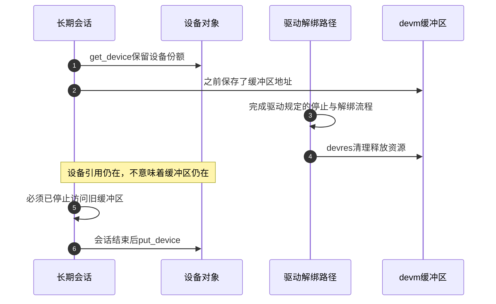
```mermaid
sequenceDiagram
    autonumber
    participant S as 长期会话
    participant D as 设备对象
    participant U as 驱动解绑路径
    participant B as devm缓冲区
    S->>D: get_device保留设备份额
    S->>B: 之前保存了缓冲区地址
    U->>U: 完成驱动规定的停止与解绑流程
    U->>B: devres清理释放资源
    Note over S,D: 设备引用仍在，不意味着缓冲区仍在
    S->>S: 必须已停止访问旧缓冲区
    S->>D: 会话结束后put_device
```

图中的“必须已停止”是驱动需要建立的条件，不是get_device自动做到的事。需要会话活过解绑时，可以让会话只保留独立寿命的数据，或让停止协议拒绝新操作并排空正在进行的访问；不能继续使用已失效的devm指针。设备引用也不保证硬件仍在、驱动仍绑定或业务队列仍接纳。

### 11.4.3\_device\_release\_不是\_my\_obj\_release

普通kref回调接收struct kref，kobject类型回调接收struct kobject，设备应用回调则接收struct device。这里不仅参数不同，还多了一层类型分派：设备内嵌kobject的类型是core规定的device_ktype，它先进入device_release，再选择最终设备回调。

固定[device_release唯一实现](../../../../research/source_reading/kref/source_explanations/drivers/base/core.c.md#1.4_最终release按对象类型选择)的优先级为：先dev->release，其次dev->type->release，再次dev->class->dev_release；只选择第一个可用项，不把三者都调用，也没有泛化的bus release兜底。class自身的class_release又是另一个对象的清理，下一节继续区分。

core在应用回调前先保存内部私有指针p，进行devres兜底与DMA范围存储清理；应用回调可能释放整个外壳，之后core才用保存的p完成内部收尾。因此应用不能因为都名叫release就任意重做这些框架清理。最终devres兜底也不表示所有受管资源都一定活到了最终release，解绑路径可能早已清理过。

将完整模块按D0～D5复盘：

| 阶段 | 实际函数与责任 | 此时不能推出的结论 |
| --- | --- | --- |
| D0 初始化 | 创建者获得设备初始份额 | 还未登记，不表示驱动可操作 |
| D1 添加 | device_add进入设备模型 | 不等于已经绑定驱动 |
| D2 共享 | get_device追加观察者 | 不保留所有devm资源或业务许可 |
| D3 注销 | device_del撤下，put_device归还初始份额 | 其他引用可能仍在，不能马上free |
| D4 最后归还 | 观察者put后进入kobject清理 | 调试配置可能延迟类型清理 |
| D5 设备清理 | core选择release，应用释放外壳 | 不能再读取已释放设备成员 |

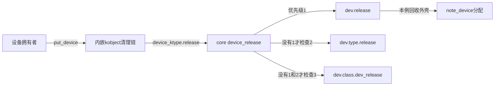
```mermaid
flowchart LR
    A[设备拥有者] -->|put_device| K[内嵌kobject清理链]
    K -->|device_ktype.release| C[core device_release]
    C -->|优先级1| R[dev.release]
    C -->|没有1才检查2| T[dev.type.release]
    C -->|没有1和2才检查3| L[dev.class.dev_release]
    R -->|本例回收外壳| F[note_device分配]
```

device_unregister不是“等待所有人归还然后才返回”的同步回收屏障。它包含撤下和一次归还，是否触发最终回收取决于剩余引用；如果最后引用仍在观察者手中，调用者不能因注销已返回而手动释放设备。反过来，如果它恰好归还最后一份，设备可能已在函数内消失，之后也不能再随手读取成员。

做两个检查练习。把观察者get去掉以后，注销后的日志为何不再合法？因为unregister可能已触发最终回收。把初始化份额误当仍未归还，再额外put一次，会消耗谁的责任？它将错误地消费观察者唯一剩余份额，造成提前清理；修复应回到份额账本，而不是靠多加一次get掩盖。

### 11.4.4\_class\_release\_也不是\_my\_obj\_release

前面的观察者保留了一台设备的存储。若系统有多台提供同类功能的设备，应用还需要回答“哪些设备提供这种功能”，而不必先知道每台设备接在哪种总线上。`class` 就提供这样的分类视图：input、net、block、tty、gpio、leds、hwmon 等名称表达不同功能类别。这里的分类不是新分配一个业务对象，更不表示所有同类设备共用一份引用。

用同一台设备来比较：设备实例描述“这一台”，`dev->class` 表达它归入哪种功能分类，`dev->bus` 表达它按哪套规则和驱动匹配，`dev->parent` 表达设备层次关系。分类相同的两台设备可以使用不同的连接方式。因此这些关系不能压成一条“class 拥有 device，device 拥有所有私有数据”的释放链。

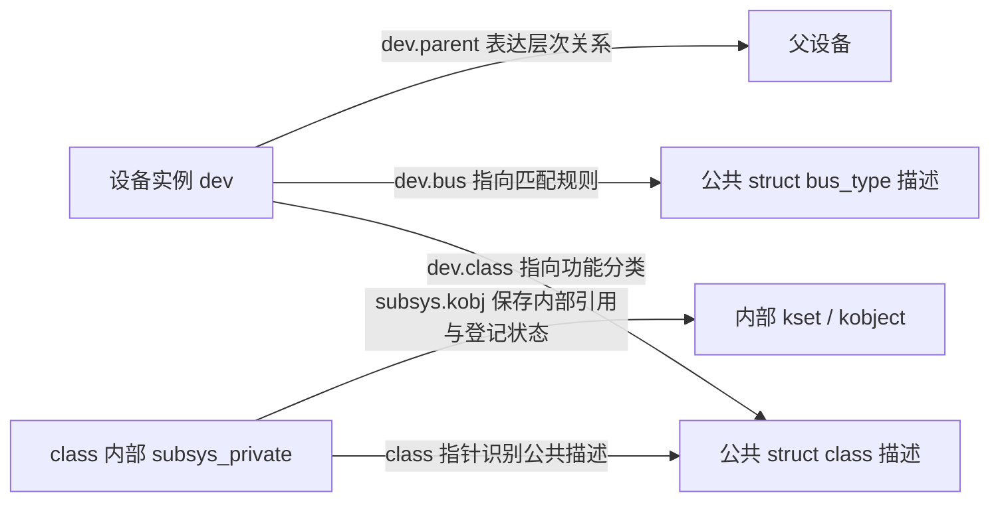
```mermaid
flowchart LR
    D[设备实例 dev] -->|dev.class 指向功能分类| C[公共 struct class 描述]
    D -->|dev.bus 指向匹配规则| B[公共 struct bus_type 描述]
    D -->|dev.parent 表达层次关系| P[父设备]
    I[class 内部 subsys_private] -->|class 指针识别公共描述| C
    I -->|subsys.kobj 保存内部引用与登记状态| K[内部 kset / kobject]
```

**先确定是哪块分配，才有可能讨论最后一次释放。** 固定 Linux 6.12.20 中，公共 `struct class` 描述保存名称和回调；driver core 另行分配 `subsys_private`，其 `subsys` 内嵌 kset/kobject，承载内部登记与引用。公共描述没有把这份内部 kref 直接公开给普通驱动。内部查找通过公共描述地址找到对应项，在列表锁内取得一份内部引用，然后才解除列表锁；这样查找者用完时有明确的 `subsys_put` 责任。具体阅读从[设备与分类模块](../../../../research/source_reading/kref/navigation/P08_device引用与资源退出导读.md#8.5_分类与总线的公共描述及内部份额)进入。

同一个 class 描述有两个容易读混的回调：

| 回调 | 清理对象 | 触发边界 |
| --- | --- | --- |
| `class->class_release` | 公共 class 描述所属的存储 | 内部分类对象最终清理时调用 |
| `class->dev_release` | 属于该类的一个设备实例 | 设备最终 release 选择分支之一；更高优先级的 dev/type 回调存在时不会选择它 |

`class_create()` 动态分配公共描述，设置专门的 `class_create_release()`，再注册。这个回调释放公共描述；随后内部 `class_release()` 释放它自己的 `subsys_private`。两次 `kfree` 对应两块分配，不是对一个设备释放两次。手工注册的静态描述必须根据自己的存储期限设计清理，不能套用动态分配描述的释放策略。参见[创建与双分配清理](../../../../research/source_reading/kref/source_explanations/drivers/base/class.c.md#1.3_动态描述与内部外壳各有清理者)。

下面把分类退出分成 C0～C3。它与某个设备的 D0～D5 周期是两组相关但独立的状态，不是一个大计数器。这里假定所属子系统已停止新使用并按其协议撤下使用者；图中没有替子系统补做这一步。

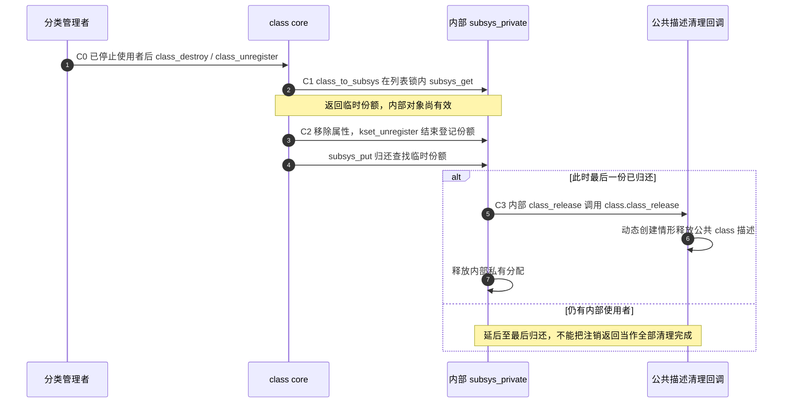
```mermaid
sequenceDiagram
    autonumber
    participant M as 分类管理者
    participant C as class core
    participant I as 内部 subsys_private
    participant R as 公共描述清理回调
    M->>C: C0 已停止使用者后 class_destroy / class_unregister
    C->>I: C1 class_to_subsys 在列表锁内 subsys_get
    Note over C,I: 返回临时份额，内部对象尚有效
    C->>I: C2 移除属性，kset_unregister 结束登记份额
    C->>I: subsys_put 归还查找临时份额
    alt 此时最后一份已归还
        I->>R: C3 内部 class_release 调用 class.class_release
        R->>R: 动态创建情形释放公共 class 描述
        I->>I: 释放内部私有分配
    else 仍有内部使用者
        Note over I,R: 延后至最后归还，不能把注销返回当作全部清理完成
    end
```

[查找实现](../../../../research/source_reading/kref/source_explanations/drivers/base/class.c.md#1.1_查找内部对象会取得临时份额)解释 C1 的引用从哪里来；[注销实现](../../../../research/source_reading/kref/source_explanations/drivers/base/class.c.md#1.2_注销配对登记与临时查找份额)解释 C2 为什么既有 unregister 又有 put。`class_destroy()` 用于 `class_create()` 产生的分类描述，并不替调用者逐一销毁仍在使用的全部设备。把它提前调用，再希望分类引用自动解决设备和驱动退出顺序，会把“引用保障存储”错误地扩大成“自动完成整个子系统关闭”。

------

### 11.4.5\_bus\_type\_不是引用计数对象模板

分类能让使用者找到同类功能，却没有回答“某台设备该由哪个驱动接管”。设备和驱动必须按同一规则比较身份，匹配成功后才可能建立绑定；设备加入、移除、电源状态变化时，还需要按照所属总线或子系统的约定执行回调。`struct bus_type` 描述这组规则。此处的 bus 不限于物理导线，关键是它组织哪一组设备、驱动和匹配行为。

固定版本的公共描述包含 `match`、`uevent`、`probe`、`remove`、`shutdown`、`suspend`、`resume` 等入口，还涉及默认属性、父锁需求和 DMA 配置/清理。列出这些成员是为了辨认责任；本章并不展开完整匹配、电源管理或 DMA 教程。与 class 一样，core 内部的 `subsys_private` 才承载登记所需的 kset/kobject、集合和同步状态，公共描述中的回调并不是一组引用计数操作。

| 同一设备面对的问题 | 对应对象或协议 | 它不能单独证明什么 |
| --- | --- | --- |
| 哪些设备提供同类功能 | class 分类关系 | 不能据此决定某台设备匹配哪个驱动 |
| 哪组设备和驱动按哪些规则协作 | bus_type 与绑定流程 | 不能据此证明当前仍绑定、硬件仍可用 |
| 这台设备的存储何时可回收 | device 的取得/归还与 release | 不延长已解绑驱动的 devm 资源期限 |
| 一次业务会话何时结束 | 私有对象自己的所有权协议 | 不自动继承 class/bus/device 的全部保证 |

总线注销也要配对两类内部份额：`bus_to_subsys()` 在内部列表锁下取得临时份额；`bus_unregister()` 清理可选根设备、属性及内部 devices/drivers kset，注销内部 subsys，再归还临时份额。最终 `bus_release()` 清理的是内部 `subsys_private`，没有顺便 `kfree` 公共 `bus_type`。如果描述及回调属于将退出的代码，该代码仍须完成所属子系统的使用者退出协议，不能由此推断描述可以提前消失。参见[注销内部登记](../../../../research/source_reading/kref/source_explanations/drivers/base/bus.c.md#1.1_注销内部目录与登记份额)和[内部清理对象](../../../../research/source_reading/kref/source_explanations/drivers/base/bus.c.md#1.2_内部release不释放公共bus_type描述)。

现在回看选择：只有私有数据共享时，继续用已有 kref 对象即可；需要设备实例时使用 device 框架及其公开引用接口；需要提供功能分类或定义设备/驱动匹配体系时，再进入 class 或 bus 的管理责任。普通设备驱动不应为了“多一层引用保护”自建 class/bus，也不应直接操作 core 的私有 kset。

**停下来检验一次。** 设备仍有观察者引用时，能否提前注销分类、卸载描述所在代码，并继续使用观察者访问硬件？不能。设备引用只回答存储寿命，既没有完成分类/总线使用者退出，也没有保存驱动绑定和硬件资源。若只需在硬件退出后保留一次会话的统计结果，应考虑独立的业务存储和明确的关闭协议；下一节具体讨论这种私有引用怎样连接设备引用，而不是在同一块内存里随意加第二个计数器。

------

## 11.5\_分层对照\_裸\_kref\_driver\_core\_和私有引用

现在已经能区分计数、设备存储和分类登记。再增加一个实际需求：设备退出后，已经打开的会话还要读取之前完成的请求数。继续使用硬件应当失败，读取独立保存的统计却应当成功。这要求我们连接两种存储寿命，同时把“仍能做业务”留给关闭协议判断。

### 11.5.1\_裸\_kref\_对象和\_driver\_core\_对象的对比

先沿已建立的实例回顾。普通原子变量可以计数，但没有引用专用的误用约束；refcount 提供引用原语，kref 在其上统一调用者的清理入口。到 kobject、device 这一层，名称、登记、关联和框架清理也成为协议的一部分。

| 操作对象 | 正常接口与清理入口 | 必须另外回答的问题 |
| --- | --- | --- |
| `atomic_t` 通用原子值 | 原子读改写；不自带释放入口 | 此整数表示什么状态，是否适合引用计数 |
| `refcount_t` 引用原语 | 专用增减与归零结果，由调用者清理 | 谁能取得第一份，最后归还怎样释放 |
| 自定义 kref 对象 | `kref_get/put`，调用指定 release | 发布、业务状态、资源和调用上下文 |
| kobject | `kobject_get/put`，类型的 release | 名称和层次登记何时撤下 |
| device | `get_device/put_device`，设备清理分派 | 绑定、硬件、受管资源何时停止使用 |
| class / bus_type 描述 | 按所属框架注册/注销及清理规则 | 公共描述、内部对象、成员使用者的退出顺序 |

这个表不是从低级到高级的推荐排行榜。只有引用计数需求时，独立 kref 对象已经足够；若需要设备模型的登记和关系，就必须履行设备框架责任，不能把内部计数当成公共接口。增加框架对象会增加登记、失败恢复和退出责任，不会自动补全业务协议。

------

### 11.5.2\_为什么裸\_kref\_示例不能直接套到\_device/class/bus

前面链表对象的发布者决定集合引用从何取得，最后归还进入自己编写的 release。设备实例则已经交给 driver core：它可能有父设备、分类、总线和驱动绑定，还参与 sysfs、电源管理等流程。这些路径依据各自契约使用对象，最终清理要经过设备框架选定的入口。

因此，设备注销时先归还哪一份、初始化失败时是否仍须 put，都应从设备接口契约出发。不能把教学对象的“摘链、put集合、put创建者”机械复制到 `device_unregister()` 后：该接口本身已经归还初始化份额，再把它当作只摘链就会多 put 一次。另一方面，保留一个 device 引用不会替代驱动停止硬件、排空工作和清理资源的步骤。

把框架已有保证接入自己的设计，通常比绕开它更容易验证。下一例仅添加会话统计对象，保留设备框架的清理入口，不另行接管 `dev.kobj.kref`。

------

### 11.5.3\_kobject\_和\_device\_中仍然可以有私有\_kref\_吗

可以有，但“两个字段分别表示两个生命周期”还不是安全协议。假设一块 `my_dev` 分配同时内嵌 device 和私有 kref，设备观察者还在使用它时，私有计数先归零；如果私有 release 直接 `kfree(my_dev)`，设备观察者就悬空。反过来，若 device 的 release 先释放同一分配，尚未归还的私有 kref 本身也位于已经失效的内存。写出两张引用表并不能消除这个交错。

最容易检查的设计是 **不同寿命的数据使用不同分配，并建立单向持有关系**：会话拥有设备一份，会话的 kref 只控制会话分配；会话最后释放时归还它拥有的设备份额。设备不再拥有会话份额，就没有“双方都等对方归零”的引用环。设备的最后清理始终只由设备 release 完成。

如果确有理由把两种计数放在同一分配，也必须指定唯一的最终释放入口。例如在私有引用开始可见以前取得一份独立设备引用，由整个私有引用域共同拥有；私有计数归零时只归还这份设备引用，绝不直接释放外壳；外壳统一在设备 release 中回收。这样，私有计数非零能够推出桥接设备份额仍存在。设备发布的初始份额与这份桥接份额必须独立结算，还要说明失败恢复、重新开启是否允许以及关闭后怎样阻止重新取得。该方案增加了一套协议，没有独立业务引用域时就继续使用 device 引用，不必默认加第二个计数器。

下一例采用两块分配。我们不需要同一分配双计数的复杂度，也不引入会话集合；若以后增加列表、异步任务或用户入口，需要分别规定它们的引用来源和排空步骤，不能只在结构里添一个链表节点。

------

### 11.5.4\_一个典型的分层结构

设备外壳 `session_device` 保存内嵌 device、互斥锁和关闭门 `closing`；独立的 `note_session` 保存私有 kref、不可变的 `owner` 指针和完成数。这里有三组正交状态：设备的登记/引用、会话的引用，以及业务开关/统计。`owner` 的有效性由会话拥有的一份设备引用证明，而不是因为字段名叫 owner。

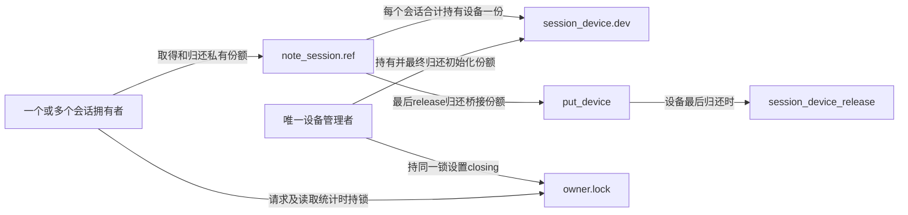
```mermaid
flowchart LR
    M[唯一设备管理者] -->|持有并最终归还初始化份额| D[session_device.dev]
    U[一个或多个会话拥有者] -->|取得和归还私有份额| S[note_session.ref]
    S -->|每个会话合计持有设备一份| D
    S -->|最后release归还桥接份额| R[put_device]
    R -->|设备最后归还时| F[session_device_release]
    U -->|请求及读取统计时持锁| L[owner.lock]
    M -->|持同一锁设置closing| L
```

先预测退出时的计数：一个会话有两个拥有者，设备却只有初始化份额加会话桥接份额共两份。注销消费初始化份额，设备剩一份。第一个会话拥有者退出只改变会话计数；第二个退出才销毁会话并归还设备份额，设备最终清理。

| 阶段 | 修改者、状态地址与动作 | 后续读取者及退出条件 |
| --- | --- | --- |
| S0 设备就绪 | 管理者初始化dev与lock，closing初值false，再添加设备 | open调用者必须已有设备份额，才可访问owner.lock |
| S1 会话建立 | open在owner.lock内检查closing，get_device后初始化session.ref与owner | 成功返回交付一份会话；关闭或分配失败不交付 |
| S2 业务执行 | 请求者持会话份额，在owner.lock内检查closing并更新completed | 读取统计也持该锁；owner指针发布后不变 |
| S3 关闭 | 管理者在同一锁内设closing，解锁后unregister归还初始化份额 | open与request以后读到关闭并拒绝；已完成统计可读 |
| S4 会话归零 | 最后拥有者的put同步进入session_release | 保存设备地址，释放会话，然后put_device桥接份额 |
| S5 设备归零 | 最后设备份额经框架进入session_device_release | 释放设备外壳；调用者此后不再访问它 |

`closing` 的传播通过共享地址和同一互斥锁完成，没有额外通知。它只拒绝后续进入临界区的操作：若请求先持锁，本例会先完成计数更新，关闭者等它解锁；若关闭先持锁，请求返回错误。这里没有把 I/O 留在锁外继续执行，所以不需要另设“在途硬件请求”计数。一旦改为异步操作，就必须补上在途责任、取消/等待和资源退出，这个短锁本身不能代替排空。

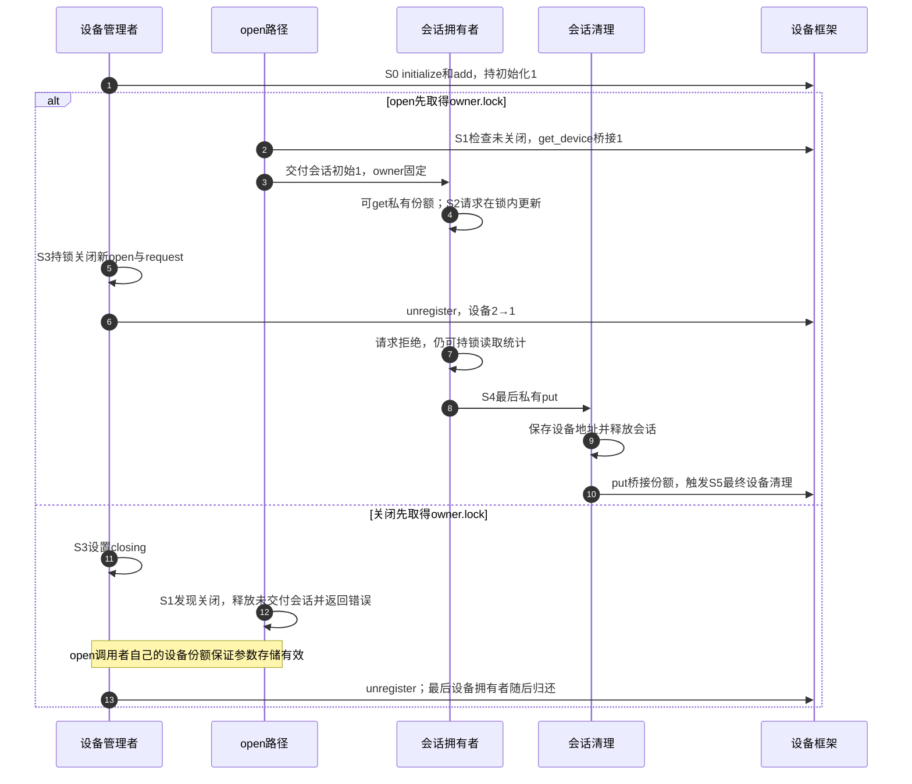
```mermaid
sequenceDiagram
    autonumber
    participant M as 设备管理者
    participant O as open路径
    participant U as 会话拥有者
    participant S as 会话清理
    participant D as 设备框架
    M->>D: S0 initialize和add，持初始化1
    alt open先取得owner.lock
        O->>D: S1检查未关闭，get_device桥接1
        O->>U: 交付会话初始1，owner固定
        U->>U: 可get私有份额；S2请求在锁内更新
        M->>M: S3持锁关闭新open与request
        M->>D: unregister，设备2→1
        U->>U: 请求拒绝，仍可持锁读取统计
        U->>S: S4最后私有put
        S->>S: 保存设备地址并释放会话
        S->>D: put桥接份额，触发S5最终设备清理
    else 关闭先取得owner.lock
        M->>M: S3设置closing
        O->>O: S1发现关闭，释放未交付会话并返回错误
        Note over M,O: open调用者自己的设备份额保证参数存储有效
        M->>D: unregister；最后设备拥有者随后归还
    end
```

程序用错误常量 `ENODEV` 表示设备服务已经不可用，函数返回它的负值；正常请求返回0，分配失败仍用前文的 `-ENOMEM`。

下面是完整模块；[note_session.c](../../../../labs/kernel/object_lifetime/materials/note_session.c)和材料 Makefile 提供可直接取用的版本。它沿用上一例的配置限制：启用 sysfs，关闭延迟 kobject 清理调试选项；所有会话均在初始化函数返回前结束，模块没有外部入口、真实驱动绑定或硬件资源。统计 release 的全局变量仅用于这个同步演示，不是并发驱动的统计实现。

```c
// SPDX-License-Identifier: GPL-2.0
#include <linux/device.h>
#include <linux/errno.h>
#include <linux/kref.h>
#include <linux/module.h>
#include <linux/mutex.h>
#include <linux/slab.h>

struct session_device {
    struct device dev;
    struct mutex lock; /* 同时保护关闭门和会话的完成数。 */
    bool closing;
};
struct note_session {
    struct kref ref;
    struct session_device *owner; /* 每个会话合计拥有设备的一份。 */
    unsigned int completed;
};
static unsigned int device_releases, session_releases;

static void session_device_release(struct device *dev)
{
    struct session_device *obj = container_of(dev, struct session_device, dev);
    ++device_releases;
    kfree(obj);
}

static void session_release(struct kref *ref)
{
    struct note_session *session = container_of(ref, struct note_session, ref);
    struct device *held = &session->owner->dev;
    ++session_releases;
    kfree(session);
    put_device(held); /* 会话消失后归还桥接份额；此后不再访问owner。 */
}

/* 调用者已有设备份额；成功交付会话初始份额，失败不交付任何引用。 */
static int session_open(struct session_device *owner, struct note_session **out)
{
    struct note_session *session;
    *out = NULL;
    session = kzalloc(sizeof(*session), GFP_KERNEL);
    if (!session)
        return -ENOMEM;
    mutex_lock(&owner->lock);
    if (owner->closing) {
        mutex_unlock(&owner->lock);
        kfree(session);
        return -ENODEV;
    }
    get_device(&owner->dev);
    session->owner = owner;
    kref_init(&session->ref);
    mutex_unlock(&owner->lock);
    *out = session;
    return 0;
}

/* 已持会话份额；本例只同步更新统计，不启动任何硬件或异步工作。 */
static int session_request(struct note_session *session)
{
    struct session_device *owner = session->owner;
    int result = 0;
    mutex_lock(&owner->lock);
    if (owner->closing)
        result = -ENODEV;
    else
        ++session->completed;
    mutex_unlock(&owner->lock);
    return result;
}

static unsigned int session_completed(struct note_session *session)
{
    struct session_device *owner = session->owner;
    unsigned int result;
    mutex_lock(&owner->lock);
    result = session->completed;
    mutex_unlock(&owner->lock);
    return result;
}

/* 唯一管理者只调用一次，并消费设备初始化份额。 */
static void session_device_stop(struct session_device *owner)
{
    mutex_lock(&owner->lock);
    owner->closing = true;
    mutex_unlock(&owner->lock);
    device_unregister(&owner->dev);
}

static int __init note_session_init(void)
{
    struct session_device *owner;
    struct note_session *session;
    int result;
    if (!IS_ENABLED(CONFIG_SYSFS) || IS_ENABLED(CONFIG_DEBUG_KOBJECT_RELEASE))
        return -EOPNOTSUPP; /* 同步示例不实现延迟设备清理的模块退出。 */
    owner = kzalloc(sizeof(*owner), GFP_KERNEL);
    if (!owner)
        return -ENOMEM;
    mutex_init(&owner->lock);
    device_initialize(&owner->dev);
    owner->dev.release = session_device_release;
    result = dev_set_name(&owner->dev, "note_session_lifetime");
    if (result)
        goto put_owner;
    result = device_add(&owner->dev);
    if (result)
        goto put_owner;
    result = session_open(owner, &session);
    if (result) {
        session_device_stop(owner);
        return result;
    }
    kref_get(&session->ref); /* 第二个会话拥有者，不额外取得设备份额。 */
    result = session_request(session);
    pr_info("note_session: before=%d completed=%u\n", result, session_completed(session));
    session_device_stop(owner);
    owner = NULL; /* 初始份额已被unregister消费。 */
    result = session_request(session);
    pr_info("note_session: after=%d completed=%u device_release=%u\n",
            result, session_completed(session), device_releases);
    kref_put(&session->ref, session_release);
    kref_put(&session->ref, session_release);
    return 0;
put_owner:
    put_device(&owner->dev);
    return result;
}

static void __exit note_session_exit(void)
{
    pr_info("note_session: session_release=%u device_release=%u\n",
            session_releases, device_releases);
}
module_init(note_session_init);
module_exit(note_session_exit);
MODULE_LICENSE("GPL");
MODULE_DESCRIPTION("独立会话引用与设备份额的单向连接");
```

在与运行内核匹配的 Linux 构建环境中，在材料目录执行：

```bash
make -C /lib/modules/"$(uname -r)"/build M="$PWD" modules
sudo insmod ./note_session.ko
sudo rmmod note_session
sudo dmesg | tail -n 12
```

第一行构建材料目录中的模块；加载时初始化函数执行整个周期，卸载时打印最终清理次数。构建需要该运行内核的开发头和构建树；错误应先按返回值与内核日志定位，不可把宿主编译前端结果当作已经生成可加载模块。若加载返回不支持，先检查上述两个配置限制。本例不是长期保持的设备服务，短暂登记的设备在初始化返回前已经撤下。

正常预期是 `before=0 completed=1`，关闭后 `after=-19 completed=1 device_release=0`，最后 `session_release=1 device_release=1`。这里 `-19` 是本版本 Linux 的 `-ENODEV`：本例用它报告服务已经关闭。设备清理暂未发生，不表示关闭失败，而是会话桥接引用仍在履行责任。最后一个会话拥有者归还后才完成两块存储的回收。

检查重点是两条失败线：设备初始化以后命名或添加失败，统一 put 初始化份额；设备已添加但会话分配失败，则执行关闭和 unregister。会话在锁内发现关闭时还没有取得桥接份额，释放尚未交付的会话即可，不能多 put_device。正式调用者即使与关闭竞争，也必须先拥有有效设备份额；互斥锁无法修复传入悬空 owner 的错误。

本批完成十组宿主控制路径检查，并通过 ARM 编译前端；372份头中360份非生成源码与固定提交无差异。宿主使用固定引用及设备包装函数，原子操作、锁、设备登记和sysfs等是顺序替身，不能证明多CPU同步、真实驱动退出或模块装卸。上面的目标步骤本批未执行。

练习先从预测开始：删去第二个 `kref_get` 却保留两次 put，会在哪一步失去合法访问资格？第一次 put 已可能销毁会话和设备，第二次连 ref 地址都不能读取。再改为创建两个独立会话：两次 open 各取得一份设备引用，注销后还有两份；第一个会话最后退出不会销毁第二个所需的设备。最后解释为何不能用 devm 分配这里希望跨解绑存在的会话：受管清理的触发时点不由会话 kref 决定，会把尚有拥有者的会话提前回收。

------

### 11.5.5\_container\_of\_在不同层次中的作用

现在看两个真实回调：`session_release` 收到私有 kref 地址，恢复的是 `note_session`；`session_device_release` 收到 device 地址，恢复的是 `session_device`。前面的 kobject 示例则由 kobj 地址恢复命名对象。三者都用 `container_of` 做成员偏移换算，却依据不同协议进入。

换算没有取得引用、检查关闭门或证明对象仍有效。只有框架按照正确类型和有效寿命调用 release，转换才有前提。在本例中，私有 release 使用自己仍有效的 owner 关系保存设备地址，然后释放会话、归还设备；不能在 `kfree(session)` 后再从 session 读取 owner，也不能在可能触发最后清理的 `put_device` 后再访问设备字段。

------

### 11.5.6\_不同层次的\_get/put\_命名规律

接口选择从手里的对象及取得契约出发。自定义会话用自己的 kref 封装，kobject 用 kobject_get/put，device 用 get_device/put_device；内核模块还有 try_module_get/module_put，打开文件有 get_file/fput。后两类对象另有取得失败、代码寿命和文件清理契约，这里只用来说明引用接口不止一种，不把它们展开成同一个可互换模板。

例如本例的 `kref_get(&session->ref)` 只增加会话拥有者数；会话已经整体持有设备一份，所以无需每次私有 get 再给设备 get。最后私有 put 统一归还桥接份额，构成可审查的配对。若为了“每一层都加一份”随意额外 get_device，却没有对应归还点，反而会泄漏设备。

本节已经把独立业务对象与设备外壳连接起来，也保留了关闭后只读统计的需求。下一节回到常见误解，检查我们是否又把计数、状态、框架和硬件可用性混成了一件事。

------

## 11.6\_本章常见误解

### 11.6.1\_误解一\_kobject\_是高级\_kref

错误。

更准确：

```text
kobject 是带引用计数、名字、父子层级、ktype、sysfs 表示和 kset 归属的内核对象模型。
```

如果只是引用计数，用 `kref`。

------

### 11.6.2\_误解二\_device\_就是内嵌\_kref\_的对象

错误。

更准确：

```text
device 是 driver core 的设备对象；
引用计数只是它生命周期管理的一部分。
```

对 `struct device` 应该用：

```c
get_device(dev);
put_device(dev);
```

不是手动摸内部 kref。

------

### 11.6.3\_误解三\_class/bus\_是\_device\_的总引用管理器

错误。

更准确：

```text
class 是分类视图；
bus 是匹配和组织机制；
device 是设备实例；
它们之间有 driver core 关系，但不是简单的“大 kref 管小 kref”。
```

------

### 11.6.4\_误解四\_release\_都是\_kfree

错误。

release 可能做：

```text
取消 sysfs 表示；
释放属性组；
释放私有资源；
释放子对象；
等待异步路径；
call_rcu/kfree_rcu；
最终 kfree 外层对象。
```

而且不同层次 release 的入口参数不同：

```text
kref release:
    struct kref *

kobject release:
    struct kobject *

device release:
    struct device *
```

------

### 11.6.5\_误解五\_get\_device\_可以替代私有\_kref

不一定。

`get_device()` 保护的是：

```text
struct device 对象生命周期。
```

它不自动保护：

```text
你的私有 request；
你的私有 session；
你的硬件状态；
你的业务队列；
你的 opened file context。
```

如果这些私有对象有独立生命周期，仍然需要自己的引用模型。

------

### 11.6.6\_误解六\_私有\_kref\_可以替代\_get\_device

也不一定。

私有 `kref` 保护的是：

```text
你定义的私有对象。
```

它不自动保护：

```text
driver core 对 struct device 的生命周期规则。
```

如果你要长期保存 `struct device *dev`，通常要按 driver core 规则持有设备引用。

------

## 11.7\_选择规则

写代码时可以按下面规则选择。

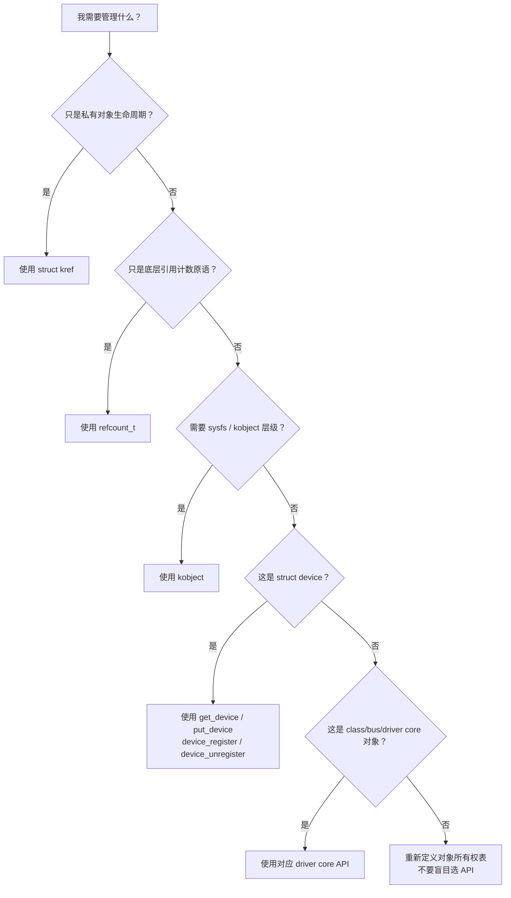
```mermaid
flowchart TD
    A["我需要管理什么？"] --> B{"只是私有对象生命周期？"}
    B -- "是" --> C["使用 struct kref"]

    B -- "否" --> D{"只是底层引用计数原语？"}
    D -- "是" --> E["使用 refcount_t"]

    D -- "否" --> F{"需要 sysfs / kobject 层级？"}
    F -- "是" --> G["使用 kobject"]

    F -- "否" --> H{"这是 struct device？"}
    H -- "是" --> I["使用 get_device / put_device<br/>device_register / device_unregister"]

    H -- "否" --> J{"这是 class/bus/driver core 对象？"}
    J -- "是" --> K["使用对应 driver core API"]

    J -- "否" --> L["重新定义对象所有权表<br/>不要盲目选 API"]
```

简化成表：

| 需求                   | 优先选择                                    |
| ---------------------- | ------------------------------------------- |
| 私有对象生命周期       | `struct kref`                               |
| 自己封装更底层引用计数 | `refcount_t`                                |
| 通用原子变量           | `atomic_t`                                  |
| sysfs 层级对象         | `struct kobject`                            |
| 设备对象生命周期       | `get_device()` / `put_device()`             |
| 设备注册注销           | `device_register()` / `device_unregister()` |
| 分类设备               | `struct class` / class API                  |
| 设备驱动匹配           | `struct bus_type` / bus API                 |

------

## 11.8\_和前面章节的关系

第 1 章讲：

```text
kref 解决的是引用所有权，不是锁，不是状态机，不是设备安全代理。
```

第 2 章讲：

```text
struct kref 内部嵌入 refcount_t；
release 通过 container_of 找回外层对象。
```

第 3 章讲：

```text
kref_init/get/put/release 串成生命周期状态机。
```

第 8、9、10 章讲：

```text
lookup、锁、RCU 如何保护 get 前窗口。
```

本章补上边界：

```text
这些规则主要针对裸 kref 私有对象；
不能直接照搬到 kobject/device/class/bus。
```

也就是说：

```text
裸 kref 是你自己管理对象生命周期；
driver core 对象是框架已经定义好了生命周期协议。
```

三层关系如下：

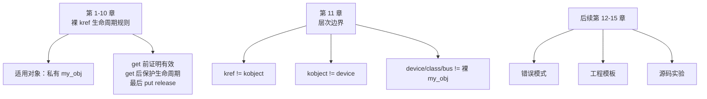
```mermaid
flowchart TD
    A["第 1-10 章<br/>裸 kref 生命周期规则"] --> B["适用对象：私有 my_obj"]
    A --> C["get 前证明有效<br/>get 后保护生命周期<br/>最后 put release"]

    D["第 11 章<br/>层次边界"] --> E["kref != kobject"]
    D --> F["kobject != device"]
    D --> G["device/class/bus != 裸 my_obj"]

    H["后续第 12-15 章"] --> I["错误模式"]
    H --> J["工程模板"]
    H --> K["源码实验"]
```

------

## 11.9\_本章检查清单

看到一个引用计数对象时，先问这些问题：

```text
1. 这是私有对象，还是 driver core 对象？
2. 对象里是 struct kref，还是 struct kobject，还是 struct device？
3. 应该用 kref_get，还是 kobject_get，还是 get_device？
4. release 的参数是 struct kref *、struct kobject *，还是 struct device *？
5. release 是我自己定义的，还是 ktype/device/class/bus 框架定义的？
6. 这个对象是否需要出现在 sysfs？
7. 这个对象是否参与 uevent？
8. 这个对象是否有 parent/child 层级？
9. 这个对象是否属于 class？
10. 这个对象是否挂在 bus 上参与 match/probe/remove？
11. 我是不是只是为了引用计数而错误引入 kobject？
12. 我是不是把 device 当成裸 kref 对象手动管理？
13. 如果 struct device 和私有 kref 同时存在，两套引用表是否分清？
14. 私有 kref 是否错误替代了 get_device？
15. get_device 是否错误替代了私有对象状态机或私有 kref？
```

如果这些问题答不清楚，就不要急着写：

```c
kref_get(...)
```

也不要急着写：

```c
kobject_init(...)
```

先把对象层次画出来。

------

## 11.10\_本章小结

本章核心不是学习更多 API，而是分清层次。

可以压缩成下面几句话：

```text
atomic_t 是通用原子工具。

refcount_t 是引用计数安全原语。

kref 是基于 refcount_t 的对象生命周期引用计数封装。

kobject 是带名字、引用、父子层级、ktype、sysfs 表示和 kset 归属的内核对象模型。

device 是 driver core 的设备对象，不是裸 kref 的 my_obj。

class 是设备分类视图，不是业务对象 release 管理器。

bus_type 是设备和驱动匹配组织机制，不是大号 kref 管理器。
```

最重要的边界是：

```text
裸 kref 讲的是自定义对象如何管理引用；
device/class/bus 讲的是 driver core 已经封装好的分层对象模型。
```

一句话总结：

```text
需要引用计数，不等于需要 kobject；
操作 struct device，不等于直接操作 kref；
不同对象层次，必须使用对应层次的生命周期 API。
```

------

专题导航：[kref 引用计数机制章节大纲](大纲.md)。

上一篇：[kref 与 RCU](P10_kref_与_RCU.md#10.10_本章小结)。

下一篇：[典型错误模式与调试线索](P12_典型错误模式与调试线索.md)。
