# 第12章_典型错误模式与调试线索

## 12.1_本章导读_把错误模式归类排查

前面章节已经分别讲过：

```text
第 1 章：kref 要解决什么问题
第 2 章：源码入口与结构定义
第 3 章：生命周期状态机
第 4 章：三条核心规则
第 5 章：基础 API
第 6 章：release 回调
第 7 章：handoff
第 8 章：lookup
第 9 章：锁组合
第 10 章：RCU 组合
第 11 章：kref / refcount_t / kobject / device 边界
```

所以本章不再重复原理。

本章只做一件事：

```text
把 kref 相关 bug 按错误模式整理出来。
```

本章组织方式是：

```text
错误现象；
错误代码；
并发时序；
根因分析；
修复方式；
调试线索。
```

本章主线：

```text
kref 错误通常不是“计数器写错”这么简单。

它本质上是：
引用归属不清；
生命周期边界不清；
lookup 保护不清；
handoff 协议不清；
release 收尾不清。
```

整体错误分类如下：

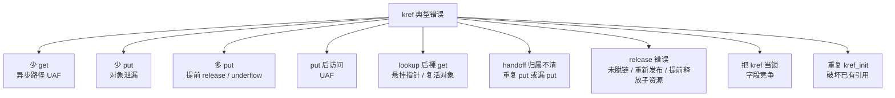

------

## 12.2_调试入口_工具只能发现症状

### 12.2.1_调试工具先导

kref bug 常见表现有几类：

```text
use-after-free；
内存泄漏；
refcount underflow；
对象提前 release；
对象永远不 release；
并发字段竞争；
死锁；
RCU 读者访问已释放内存。
```

对应调试工具大致如下：

| 问题类型                 | 常用线索                    |
| ------------------------ | --------------------------- |
| use-after-free           | KASAN                       |
| 越界访问                 | KASAN                       |
| 泄漏                     | kmemleak、自定义引用日志    |
| 字段数据竞争             | KCSAN                       |
| 锁顺序 / 死锁风险        | lockdep                     |
| refcount 异常            | refcount warning / WARN     |
| release 时对象仍在集合中 | `WARN_ON(!list_empty(...))` |
| RCU 释放过早             | KASAN、RCU debug、trace     |
| handoff 归属不清         | 引用日志、路径审计          |

KASAN 是内核中的动态内存安全错误检测器，目标就是发现越界访问和 use-after-free 这类问题；KASAN 报告通常会包含错误访问栈、分配栈以及 UAF 场景下的释放栈。([Linux Kernel 文档](https://docs.kernel.org/dev-tools/kasan.html?utm_source=chatgpt.com))

KCSAN 是内核中的动态数据竞争检测器，使用编译期插桩和基于 watchpoint 的采样方式寻找并发访问冲突。([Linux Kernel 文档](https://docs.kernel.org/dev-tools/kcsan.html?utm_source=chatgpt.com))

lockdep 主要用于锁依赖和死锁场景分析，内核文档也明确建议使用标准锁原语，因为这些原语能和 lockdep 正确配合。([Linux Kernel 文档](https://docs.kernel.org/dev-tools/lkmm/docs/simple.html?utm_source=chatgpt.com))

但是要注意：

```text
工具只能帮你发现症状；
kref bug 的根因通常仍然要回到所有权表分析。
```

也就是问：

```text
谁 get？
谁 put？
谁 handoff？
谁 release？
谁还能 lookup？
谁还能访问字段？
```

------

## 12.3_基础引用错误_少_get_少_put_多_put

### 12.3.1_错误一_少_get_异步路径_UAF

#### (1)_错误现象

最典型的 kref bug 是：

```text
当前路径把 obj 指针交给异步路径；
但是没有给异步路径单独 get；
当前路径随后 put；
异步路径晚一点执行时访问了已经释放的对象。
```

常见场景：

```text
workqueue；
timer；
completion；
irq bottom half；
回调函数；
异步发送完成；
用户态 fd 延迟关闭；
RCU 延迟路径外的异步处理。
```

#### (2)_错误代码

```c
static void my_obj_schedule_work_bad(struct my_obj *obj)
{
	/*
	 * 错误：
	 * 这里只是把 obj 指针放进 work，
	 * 但没有给 work 持有一个引用。
	 */
	obj->work_obj = obj;
	schedule_work(&obj->work);
}

static void my_obj_workfn(struct work_struct *work)
{
	struct my_obj *obj = container_of(work, struct my_obj, work);

	do_something(obj);   /* 可能 UAF */
}
```

调用路径可能是：

```c
obj = my_obj_get_by_id(id);
if (!obj)
	return -ENOENT;

my_obj_schedule_work_bad(obj);

kref_put(&obj->ref, my_obj_release);
```

这里的问题是：

```text
work 只拿到了指针；
没有拿到引用。
```

#### (3)_并发时序

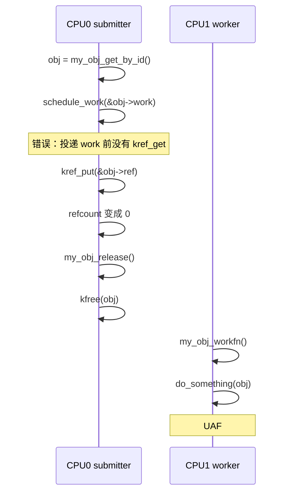

#### (4)_正确写法

投递异步 work 前先 get。

```c
static int my_obj_schedule_work(struct my_obj *obj)
{
	kref_get(&obj->ref);

	if (!schedule_work(&obj->work)) {
		/*
		 * 如果 schedule_work 失败或者 work 已经在队列中，
		 * 必须明确这次 get 的归属是否成立。
		 *
		 * 如果这次投递没有产生新的 worker 持有者，
		 * 就必须 put 回去。
		 */
		kref_put(&obj->ref, my_obj_release);
		return -EBUSY;
	}

	return 0;
}

static void my_obj_workfn(struct work_struct *work)
{
	struct my_obj *obj = container_of(work, struct my_obj, work);

	do_something(obj);

	kref_put(&obj->ref, my_obj_release);
}
```

如果你的语义是：

```text
work 已经在队列中时，不新增引用。
```

那就必须在失败路径 put。

如果你的语义是：

```text
work 只允许一次 pending，pending 期间引用已经存在。
```

那就不能每次重复 get。

也就是说，workqueue 场景不是简单写：

```c
kref_get();
schedule_work();
```

而是必须定义清楚：

```text
每一次 schedule 是否对应一个独立 work 持有者？
schedule_work 返回 false 时，这个持有者是否成立？
```

#### (5)_调试线索

少 get 通常表现为：

```text
KASAN: use-after-free；
work 回调里访问野指针；
release 已经打印，但后续还有路径访问 obj；
refcount 看起来没有 underflow，但对象已经提前释放。
```

调试时可以给对象加生命周期日志：

```c
pr_debug("obj %p get: %s\n", obj, __func__);
pr_debug("obj %p put: %s\n", obj, __func__);
pr_debug("obj %p release\n", obj);
```

重点观察：

```text
release 是否早于 work/timer/callback 执行。
```

------

### 12.3.2_错误二_少_put_对象泄漏

#### (1)_错误现象

少 put 的表现是：

```text
对象永远不 release；
模块卸载时仍有对象残留；
kmemleak 报告泄漏；
引用计数一直大于 0；
remove 后对象还挂着。
```

#### (2)_错误代码

```c
static int my_obj_open(struct inode *inode, struct file *file)
{
	struct my_obj *obj;

	obj = my_obj_get_by_id(iminor(inode));
	if (!obj)
		return -ENODEV;

	file->private_data = obj;
	return 0;
}

static int my_obj_release_file_bad(struct inode *inode, struct file *file)
{
	/*
	 * 错误：
	 * open 中 get 了；
	 * close/release 中没有 put。
	 */
	file->private_data = NULL;
	return 0;
}
```

这里 `open()` 成功后，文件上下文持有一个引用。

`release()` 必须 put。

#### (3)_正确写法

```c
static int my_obj_release_file(struct inode *inode, struct file *file)
{
	struct my_obj *obj = file->private_data;

	file->private_data = NULL;

	if (obj)
		kref_put(&obj->ref, my_obj_release);

	return 0;
}
```

#### (4)_所有权表

| 持有者     | get 位置      | put 位置                     |
| ---------- | ------------- | ---------------------------- |
| 创建者     | `kref_init()` | 发布失败或 remove            |
| 文件实例   | `open()` 成功 | `file_operations->release()` |
| work       | 投递成功      | work 回调结束                |
| list/table | 加入集合      | 从集合删除                   |
| callback   | 注册成功      | callback 注销或执行结束      |

少 put 的根因通常是：

```text
所有权表里有 get 行，但没有对应 put 行。
```

#### (5)_调试线索

可以在对象里临时加调试字段：

```c
struct my_obj {
	struct kref ref;
	atomic_t debug_refs;
	...
};
```

包装 get/put：

```c
static void my_obj_get(struct my_obj *obj, const char *why)
{
	atomic_inc(&obj->debug_refs);
	pr_debug("obj %p get %s debug_refs=%d\n",
		 obj, why, atomic_read(&obj->debug_refs));
	kref_get(&obj->ref);
}

static void my_obj_put(struct my_obj *obj, const char *why)
{
	pr_debug("obj %p put %s debug_refs=%d\n",
		 obj, why, atomic_read(&obj->debug_refs));
	atomic_dec(&obj->debug_refs);
	kref_put(&obj->ref, my_obj_release);
}
```

注意这只是调试辅助，不要把它当正式引用计数。

------

### 12.3.3_错误三_多_put_提前_release_或_underflow

#### (1)_错误现象

多 put 通常比少 put 更危险。

它可能导致：

```text
对象提前 release；
其他路径继续访问对象时 UAF；
refcount underflow warning；
release 被提前触发；
偶发崩溃。
```

#### (2)_错误代码_错误路径重复_put

```c
static int my_obj_init_path_bad(struct my_obj *obj)
{
	int ret;

	kref_get(&obj->ref);

	ret = step1(obj);
	if (ret)
		goto err;

	ret = step2(obj);
	if (ret)
		goto err_put;

	return 0;

err_put:
	kref_put(&obj->ref, my_obj_release);
err:
	kref_put(&obj->ref, my_obj_release);  /* 错误：可能重复 put */
	return ret;
}
```

这个错误来自错误路径标签设计不清楚。

#### (3)_正确写法

```c
static int my_obj_init_path(struct my_obj *obj)
{
	int ret;

	kref_get(&obj->ref);

	ret = step1(obj);
	if (ret)
		goto err_put;

	ret = step2(obj);
	if (ret)
		goto err_put;

	return 0;

err_put:
	kref_put(&obj->ref, my_obj_release);
	return ret;
}
```

或者把资源阶段拆清楚：

```c
static int my_obj_init_path(struct my_obj *obj)
{
	int ret;
	bool got_ref = false;

	kref_get(&obj->ref);
	got_ref = true;

	ret = step1(obj);
	if (ret)
		goto err;

	ret = step2(obj);
	if (ret)
		goto err;

	return 0;

err:
	if (got_ref)
		kref_put(&obj->ref, my_obj_release);
	return ret;
}
```

#### (4)_错误代码_handoff_后当前路径又_put

```c
static int my_obj_enqueue_bad(struct my_queue *q, struct my_obj *obj)
{
	mutex_lock(&q->lock);
	list_add_tail(&obj->node, &q->list);
	mutex_unlock(&q->lock);

	/*
	 * 错误：
	 * 如果约定是“当前引用转移给队列”，
	 * 那么这里不能再 put。
	 */
	kref_put(&obj->ref, my_obj_release);

	return 0;
}
```

这里要分清两种模型。

#### (5)_模型_A_队列新增引用

```c
static int my_obj_enqueue_get(struct my_queue *q, struct my_obj *obj)
{
	kref_get(&obj->ref);

	mutex_lock(&q->lock);
	list_add_tail(&obj->node, &q->list);
	mutex_unlock(&q->lock);

	return 0;
}
```

调用者仍然持有自己的引用，后面还要 put。

#### (6)_模型_B_当前引用转移给队列

```c
static int my_obj_enqueue_take(struct my_queue *q, struct my_obj *obj)
{
	mutex_lock(&q->lock);
	list_add_tail(&obj->node, &q->list);
	mutex_unlock(&q->lock);

	/*
	 * 成功后，当前引用归队列。
	 * 调用者不能再 put，也不能再访问 obj。
	 */
	return 0;
}
```

函数名最好表达所有权：

```text
my_obj_enqueue_get()
    队列额外 get 一份引用。

my_obj_enqueue_take()
    队列接管调用者当前引用。

my_obj_enqueue_borrow()
    队列不持有长期引用，只在调用期间借用。
```

多 put 的核心根因：

```text
同一份引用被两个持有者都认为“该由我 put”。
```

------

### 12.3.4_错误四_put_后继续访问对象

#### (1)_错误现象

这是最经典的 kref 生命周期边界错误。

错误代码：

```c
kref_put(&obj->ref, my_obj_release);

pr_info("obj id=%d\n", obj->id);   /* 错误 */
```

问题是：

```text
kref_put() 之后，你不知道 obj 是否已经 release。
```

如果这是最后一个引用：

```text
kref_put()
    -> refcount 变成 0
    -> my_obj_release()
    -> kfree(obj)
```

那么后面的 `obj->id` 就是 UAF。

#### (2)_正确写法

如果你需要打印字段，必须在 put 前保存。

```c
int id = obj->id;

kref_put(&obj->ref, my_obj_release);

pr_info("obj id=%d released/ref dropped\n", id);
```

如果字段需要锁保护：

```c
int id;

spin_lock(&obj->lock);
id = obj->id;
spin_unlock(&obj->lock);

kref_put(&obj->ref, my_obj_release);

pr_info("obj id=%d\n", id);
```

#### (3)_时序图

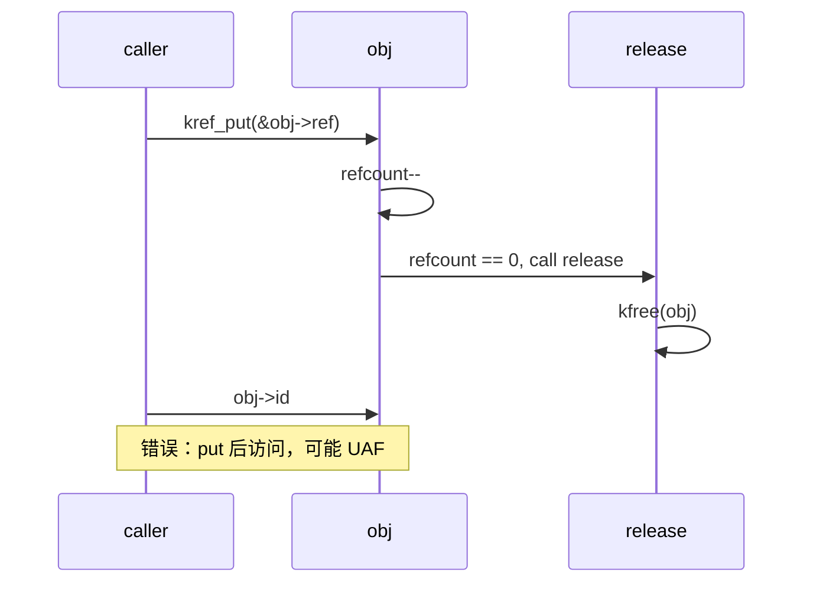

#### (4)_检查规则

凡是看到：

```c
kref_put(&obj->ref, release);
```

立刻检查后续代码有没有：

```text
obj->field；
obj->lock；
obj->node；
obj->state；
container_of 结果；
传 obj 给其他函数；
打印 obj 内字段。
```

允许的只有：

```text
不再访问 obj；
只打印提前保存的值；
只打印裸地址 %p 也要谨慎，最好 put 前保存。
```

------

## 12.4_lookup_与_handoff_错误_从指针到引用的窗口

### 12.4.1_错误五_lookup_后无保护_get

#### (1)_错误现象

这是第 8、10 章反复强调的错误。

错误代码：

```c
obj = my_obj_find(id);
if (!obj)
	return -ENOENT;

kref_get(&obj->ref);
```

如果 `my_obj_find()` 没有锁、RCU 或其他机制保证对象内存有效，那么这段代码就是危险的。

#### (2)_并发时序

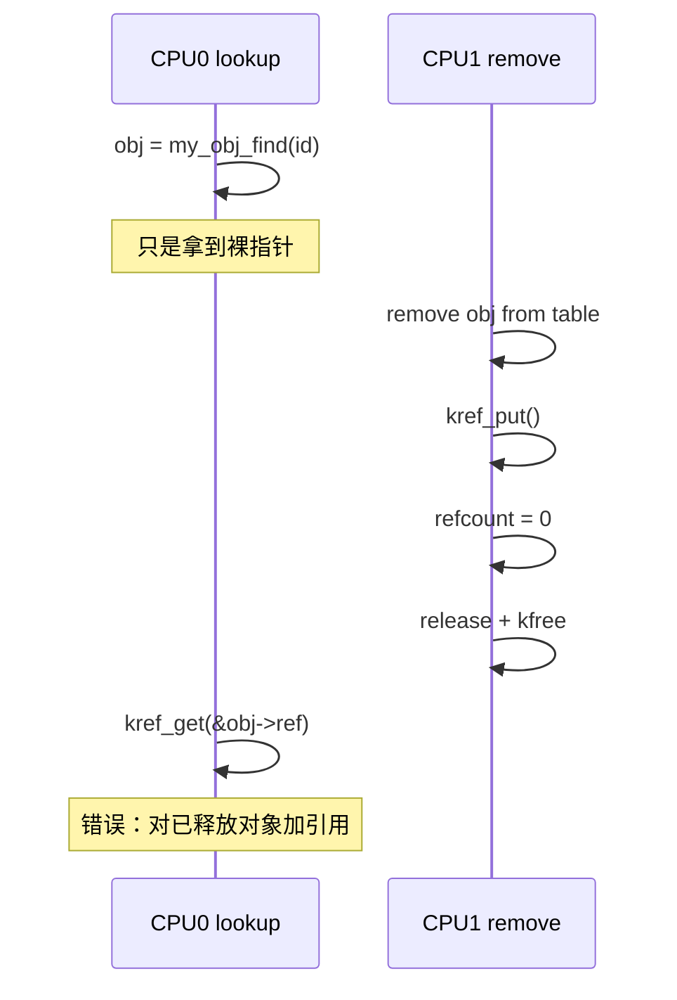

#### (3)_mutex/list_正确写法

```c
mutex_lock(&my_obj_list_lock);

obj = my_obj_find_locked(id);
if (obj)
	kref_get(&obj->ref);

mutex_unlock(&my_obj_list_lock);
```

这里锁保护的是：

```text
从集合中找到 obj；
确认 obj 还在集合里；
在这个窗口里给 obj 增加引用。
```

#### (4)_RCU_正确写法

```c
rcu_read_lock();

obj = my_obj_find_rcu(id);
if (obj && !kref_get_unless_zero(&obj->ref))
	obj = NULL;

rcu_read_unlock();
```

kref 文档特别强调：`kref_get_unless_zero()` 必须放在与 lookup 相同的受保护临界区中，否则它可能访问已经释放的内存；同时，不检查它的返回值是非法用法。([Linux Kernel 文档](https://docs.kernel.org/core-api/kref.html?utm_source=chatgpt.com))

#### (5)_根因

这个错误的本质是：

```text
有指针，不等于有引用；
能查到，不等于能带走；
get 前必须证明对象还活着。
```

------

### 12.4.2_错误六_handoff_成功和失败路径归属不清

#### (1)_错误现象

handoff bug 经常发生在：

```text
enqueue；
submit；
schedule_work；
start_timer；
register_callback；
send_async；
attach；
publish。
```

常见错误：

```text
成功路径不知道谁 put；
失败路径不知道谁 put；
返回值 false/0/-errno 对引用归属没有定义；
调用者和被调用者都 put；
调用者和被调用者都不 put。
```

#### (2)_错误代码

```c
static int my_obj_submit_bad(struct my_queue *q, struct my_obj *obj)
{
	int ret;

	ret = queue_push(q, obj);
	if (ret)
		return ret;

	return 0;
}
```

这个函数完全没说明：

```text
成功后 obj 引用归谁？
失败后 obj 引用归谁？
queue_push 是否 get？
queue_push 是否 take？
```

#### (3)_正确写法一_submit_get

```c
/*
 * 成功时队列新增一个引用。
 * 调用者仍然持有自己的引用。
 * 失败时不改变引用归属。
 */
static int my_obj_submit_get(struct my_queue *q, struct my_obj *obj)
{
	int ret;

	kref_get(&obj->ref);

	ret = queue_push(q, obj);
	if (ret) {
		kref_put(&obj->ref, my_obj_release);
		return ret;
	}

	return 0;
}
```

#### (4)_正确写法二_submit_take

```c
/*
 * 成功时队列接管调用者当前引用。
 * 失败时调用者仍然持有当前引用。
 */
static int my_obj_submit_take(struct my_queue *q, struct my_obj *obj)
{
	int ret;

	ret = queue_push(q, obj);
	if (ret)
		return ret;

	/*
	 * 成功后调用者不能再访问 obj，
	 * 也不能再 put obj。
	 */
	return 0;
}
```

#### (5)_正确写法三_submit_take_always

```c
/*
 * 不管成功失败，函数都会消耗调用者当前引用。
 * 这种语义很危险，必须在函数名和注释中写清楚。
 */
static int my_obj_submit_take_always(struct my_queue *q, struct my_obj *obj)
{
	int ret;

	ret = queue_push(q, obj);
	if (ret) {
		kref_put(&obj->ref, my_obj_release);
		return ret;
	}

	return 0;
}
```

#### (6)_handoff_状态图

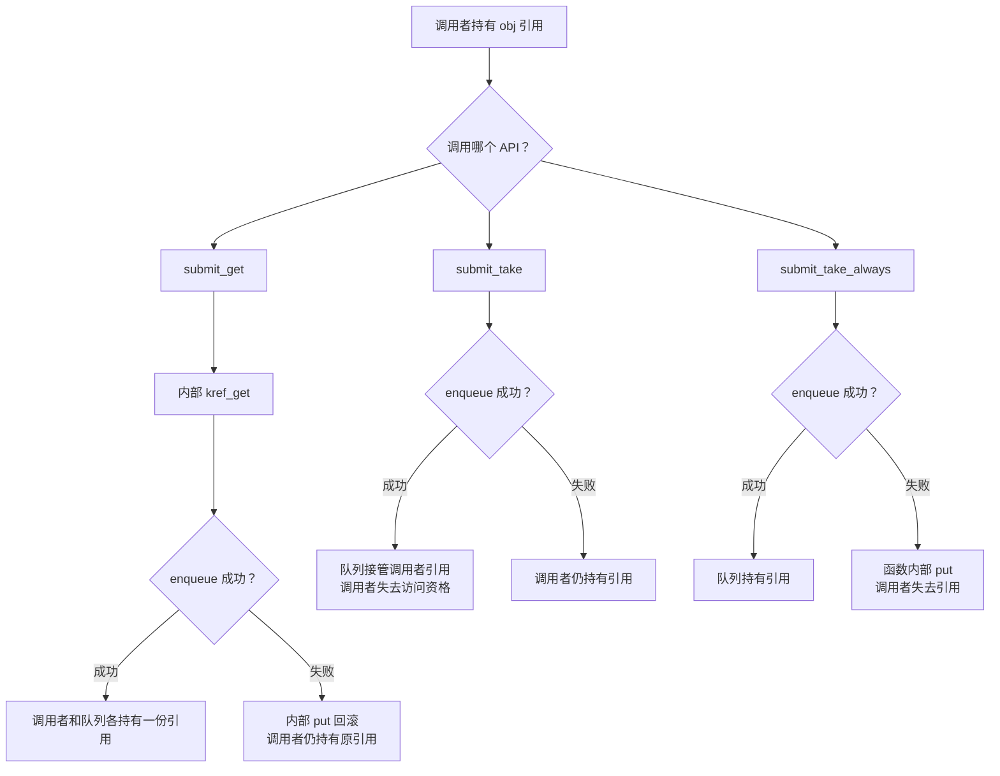

本节核心：

```text
handoff 函数必须把成功和失败时的引用归属写成契约。
```

------

## 12.5_release_与_remove_错误_销毁边界要收干净

### 12.5.1_错误七_release_里重新发布对象

#### (1)_错误现象

错误代码：

```c
static void my_obj_release_bad(struct kref *ref)
{
	struct my_obj *obj = container_of(ref, struct my_obj, ref);

	if (need_retry(obj)) {
		list_add(&obj->node, &global_list);   /* 严重错误 */
		kref_init(&obj->ref);                 /* 严重错误 */
		return;
	}

	kfree(obj);
}
```

这是非常严重的错误。

#### (2)_根因

release 的语义是：

```text
最后一个引用已经释放；
对象生命周期已经结束；
现在进入销毁路径。
```

release 里不能：

```text
重新 list_add；
重新 kref_init；
重新发布到全局表；
重新注册回调；
重新启动 timer/work；
把 obj 交给新的持有者。
```

否则就是复活对象。

#### (3)_正确处理

如果你需要 retry，应该在最后一个 put 之前决定。

例如：

```c
if (need_retry(obj)) {
	kref_get(&obj->ref);
	queue_retry_work(obj);
}

kref_put(&obj->ref, my_obj_release);
```

或者让状态机在对象仍活着时决定：

```c
spin_lock(&obj->lock);
if (obj->state == OBJ_RETRYABLE)
	obj->state = OBJ_RETRYING;
spin_unlock(&obj->lock);
```

release 只做收尾：

```c
static void my_obj_release(struct kref *ref)
{
	struct my_obj *obj = container_of(ref, struct my_obj, ref);

	WARN_ON(!list_empty(&obj->node));

	kfree(obj);
}
```

#### (4)_release_状态边界

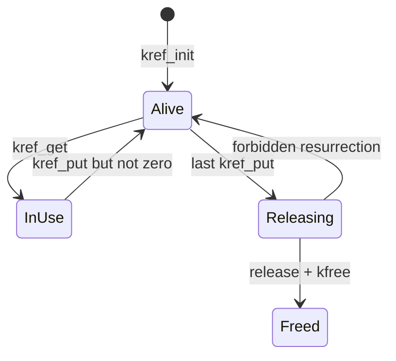

------

### 12.5.2_错误八_release_时对象仍挂在全局结构中

#### (1)_错误现象

错误代码：

```c
static void my_obj_release_bad(struct kref *ref)
{
	struct my_obj *obj = container_of(ref, struct my_obj, ref);

	kfree(obj);
}
```

如果对象还在全局 list/hash/xarray/idr 中，释放后集合里就留下了悬挂指针。

后续 lookup 会拿到已经释放的对象。

#### (2)_正确模型_A_remove_路径脱链

```c
static void my_obj_remove(struct my_obj *obj)
{
	mutex_lock(&my_obj_list_lock);
	list_del_init(&obj->node);
	mutex_unlock(&my_obj_list_lock);

	kref_put(&obj->ref, my_obj_release);
}

static void my_obj_release(struct kref *ref)
{
	struct my_obj *obj = container_of(ref, struct my_obj, ref);

	WARN_ON(!list_empty(&obj->node));

	kfree(obj);
}
```

#### (3)_正确模型_B_release_中脱链

```c
static void my_obj_release(struct kref *ref)
{
	struct my_obj *obj = container_of(ref, struct my_obj, ref);

	mutex_lock(&my_obj_list_lock);
	list_del_init(&obj->node);
	mutex_unlock(&my_obj_list_lock);

	kfree(obj);
}
```

这个模型要求：

```text
对象生命周期结束和集合可见性结束绑定。
```

多数工程里更推荐：

```text
remove 路径取消发布；
release 只做最终释放。
```

#### (4)_检查方式

release 中可以加：

```c
WARN_ON(!list_empty(&obj->node));
```

如果对象使用 xarray/idr/hash，则加对应检查：

```text
对象是否已经从 xa/idr/hash 删除；
对象是否仍在全局链表；
对象是否仍在队列；
对象是否仍被 timer/work/callback 挂住。
```

------

## 12.6_并发与_API_误用_kref_不是锁_也不是状态判断

### 12.6.1_错误九_把_kref_当锁_字段竞争仍然存在

#### (1)_错误现象

错误代码：

```c
kref_get(&obj->ref);

obj->state++;
obj->flags |= MY_FLAG;

kref_put(&obj->ref, my_obj_release);
```

这个代码只说明：

```text
在 get 成功到 put 之前，对象内存不会释放。
```

它不说明：

```text
obj->state 没有其他 CPU 同时修改；
obj->flags 没有竞争；
字段组合状态一致。
```

#### (2)_并发时序

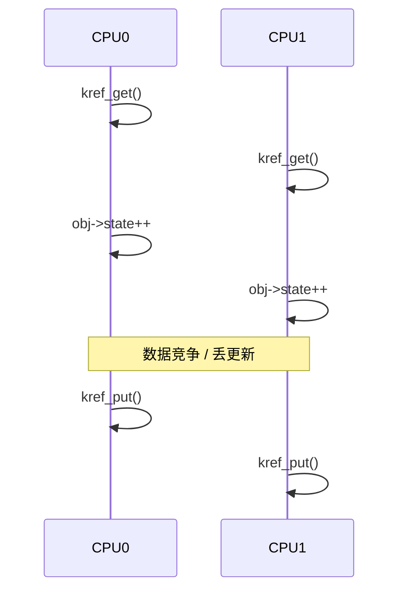

#### (3)_正确写法

如果字段需要互斥：

```c
kref_get(&obj->ref);

spin_lock(&obj->lock);
obj->state++;
obj->flags |= MY_FLAG;
spin_unlock(&obj->lock);

kref_put(&obj->ref, my_obj_release);
```

如果字段是状态位，可能使用原子位操作：

```c
set_bit(MY_FLAG_BIT, &obj->flags);
```

如果只是单次读取，可能使用：

```c
state = READ_ONCE(obj->state);
```

具体取决于字段语义。

#### (4)_调试线索

字段竞争可能表现为：

```text
KCSAN 报告 data race；
状态偶发异常；
引用计数正常，但业务状态错乱；
对象没 UAF，但字段值不符合状态机。
```

KCSAN 的定位正是动态检测数据竞争，所以这类问题不能只盯着 kref，要看字段访问是否有锁、原子或 READ_ONCE/WRITE_ONCE 约束。([Linux Kernel 文档](https://docs.kernel.org/dev-tools/kcsan.html?utm_source=chatgpt.com))

------

### 12.6.2_错误十_重复_kref_init

#### (1)_错误现象

错误代码：

```c
static void my_obj_reset_bad(struct my_obj *obj)
{
	kref_init(&obj->ref);   /* 严重错误 */
	obj->state = 0;
}
```

如果对象已经被多个路径持有引用，重复 `kref_init()` 会直接破坏当前引用关系。

#### (2)_并发问题

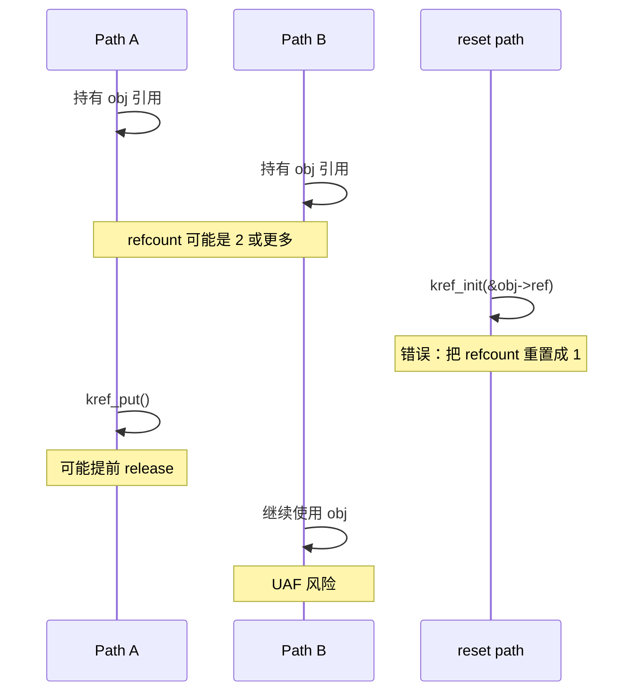

#### (3)_正确理解

`kref_init()` 只能用于：

```text
对象刚创建；
对象还没有发布；
对象还没有被其他路径看到；
对象没有任何已有引用关系。
```

不能用于：

```text
reset 对象；
复用对象；
清理状态；
重新发布对象；
release 中复活对象；
错误恢复时重置引用计数。
```

如果对象需要复用，通常应该：

```text
释放旧对象；
重新分配新对象；
重新 kref_init 新对象；
重新发布。
```

而不是对旧对象重复 init。

------

### 12.6.3_错误十一_kref_read_用来判断能否访问对象

#### (1)_错误代码

```c
if (kref_read(&obj->ref) > 0)
	do_something(obj);
```

这个写法是错的。

#### (2)_根因

`kref_read()` 只能读到某个瞬间的计数值。

它不能保证：

```text
读完之后对象还活着；
读完之后 refcount 没有变成 0；
当前路径已经持有引用；
obj 指针本身有效。
```

并发时序：

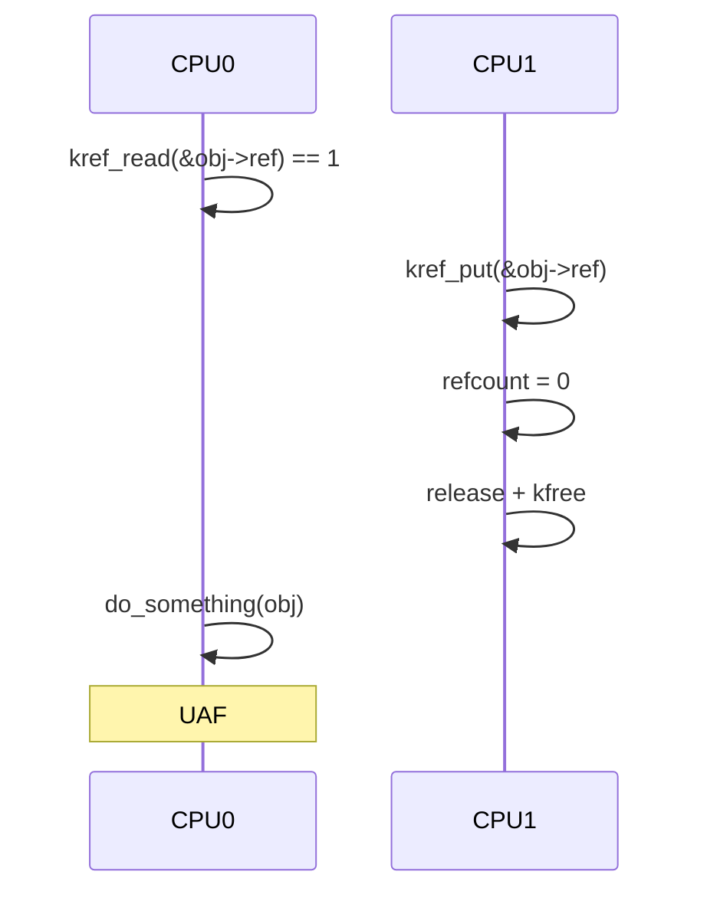

#### (3)_正确用法

`kref_read()` 只能作为：

```text
调试观察；
统计打印；
WARN 辅助；
非安全决策信息。
```

不能作为：

```text
对象有效性判断；
lookup 成功依据；
是否可以访问字段的依据；
是否可以 get 的依据。
```

真正要长期使用对象，必须：

```text
已经持有引用；
或者在锁/RCU 保护下 get 成功。
```

------

### 12.6.4_错误十二_kref_get_unless_zero_返回值不检查

#### (1)_错误代码

```c
rcu_read_lock();

obj = my_obj_find_rcu(id);
if (obj)
	kref_get_unless_zero(&obj->ref);  /* 错误：返回值未检查 */

rcu_read_unlock();

return obj;
```

#### (2)_根因

`kref_get_unless_zero()` 可能失败。

失败表示：

```text
refcount 已经是 0；
对象已经进入释放路径；
当前路径没有取得引用。
```

如果你不检查返回值，就可能把没有引用的对象返回给调用者。

kref 文档明确指出，不检查 `kref_get_unless_zero()` 的返回值是非法的；如果你已经确定有有效指针且它一定会成功，应该使用 `kref_get()`。([Linux Kernel 文档](https://docs.kernel.org/core-api/kref.html?utm_source=chatgpt.com))

#### (3)_正确写法

```c
rcu_read_lock();

obj = my_obj_find_rcu(id);
if (obj && !kref_get_unless_zero(&obj->ref))
	obj = NULL;

rcu_read_unlock();

return obj;
```

如果还要检查 dying：

```c
rcu_read_lock();

obj = my_obj_find_rcu(id);
if (obj && kref_get_unless_zero(&obj->ref)) {
	if (my_obj_is_dying(obj)) {
		kref_put(&obj->ref, my_obj_release);
		obj = NULL;
	}
} else {
	obj = NULL;
}

rcu_read_unlock();

return obj;
```

------

## 12.7_remove_上下文和辅助_API_引用之外还有收尾协议

### 12.7.1_错误十三_remove_后已有引用没有_drain

#### (1)_错误现象

remove 路径常见错误是：

```text
从全局表删除对象；
停止硬件；
释放底层资源；
但是已有引用仍然可能进入业务路径；
旧用户继续访问已经停掉的硬件或资源。
```

这类 bug 不是纯 kref bug。

它是：

```text
生命周期存在；
但业务资源已经撤销。
```

#### (2)_错误代码

```c
static void my_obj_remove_bad(struct my_obj *obj)
{
	mutex_lock(&my_obj_list_lock);
	list_del_init(&obj->node);
	mutex_unlock(&my_obj_list_lock);

	hw_shutdown(obj->hw);
	kfree(obj->buffer);

	kref_put(&obj->ref, my_obj_release);
}
```

如果已有用户还持有引用：

```c
do_io(obj);
```

那么 `obj` 本体还活着，但 `obj->hw` 或 `obj->buffer` 可能已经不可用。

#### (3)_正确模型

remove 应该分阶段：

```text
1. 设置 dying，阻止新用户进入。
2. 从 lookup 结构中取消发布。
3. 停止新请求提交。
4. drain 已有请求 / work / timer / callback。
5. 撤销硬件或底层资源。
6. put 发布引用。
7. 最后 release 释放对象本体。
```

流程图：

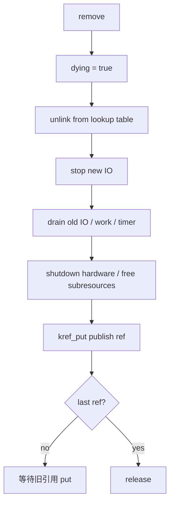

#### (4)_核心区别

```text
kref 保护 obj 内存；
不保护 obj 背后的硬件仍然可用；
不保护 obj->buffer 仍然可用；
不保证 remove 后旧用户还能做完整业务操作。
```

所以 remove 后旧引用应该看到：

```text
-ENODEV；
-EIO；
dying 状态；
closed 状态；
stopped 状态；
```

而不是继续正常操作。

------

### 12.7.2_错误十四_release_中睡眠上下文不清

#### (1)_问题

`kref_put()` 可能在很多上下文被调用：

```text
进程上下文；
spinlock 持锁上下文；
中断上下文；
timer 回调；
workqueue；
RCU callback；
错误路径。
```

最后一个 `kref_put()` 会直接调用 release。

所以 release 能不能睡眠，取决于：

```text
最后一个 put 可能发生在哪里。
```

#### (2)_错误代码

```c
static void my_obj_release_bad(struct kref *ref)
{
	struct my_obj *obj = container_of(ref, struct my_obj, ref);

	mutex_lock(&global_mutex);   /* 可能睡眠 */
	...
	mutex_unlock(&global_mutex);

	kfree(obj);
}
```

如果最后一个 put 发生在不能睡眠的上下文，这就有问题。

#### (3)_解决方式

方式一：保证最后 put 只发生在可睡眠上下文。

```text
所有 kref_put 路径都必须审计。
```

方式二：release 不做睡眠操作，把复杂释放转给 workqueue。

```c
static void my_obj_release(struct kref *ref)
{
	struct my_obj *obj = container_of(ref, struct my_obj, ref);

	INIT_WORK(&obj->release_work, my_obj_release_workfn);
	schedule_work(&obj->release_work);
}

static void my_obj_release_workfn(struct work_struct *work)
{
	struct my_obj *obj = container_of(work, struct my_obj, release_work);

	mutex_lock(&global_mutex);
	...
	mutex_unlock(&global_mutex);

	kfree(obj);
}
```

但这种写法要非常小心：

```text
release_work 本身嵌在 obj 里；
obj 不能在 work 执行前释放；
真正 kfree 必须在 release_workfn 末尾。
```

方式三：使用 RCU 延迟释放。

```c
static void my_obj_release(struct kref *ref)
{
	struct my_obj *obj = container_of(ref, struct my_obj, ref);

	kfree_rcu(obj, rcu);
}
```

#### (4)_检查规则

release 里如果有下面动作，要审计上下文：

```text
mutex_lock；
msleep；
wait_for_completion；
flush_work；
cancel_work_sync；
synchronize_rcu；
可能阻塞的 IO；
可能递归触发 put 的操作。
```

------

### 12.7.3_错误十五_kref_put_lock_/_kref_put_mutex_使用误解

#### (1)_问题

`kref_put_lock()` 和 `kref_put_mutex()` 不是“自动解决所有锁问题”的 API。

它们解决的是一类特殊问题：

```text
最后一个 put 时，需要在持锁状态下执行 release 相关动作；
但又希望避免普通 put 路径都手写锁组合。
```

#### (2)_常见误解

错误理解：

```text
用了 kref_put_lock，就不需要设计 remove/unlink 顺序了。
```

错误。

它仍然要求你知道：

```text
release 里会做什么；
锁保护什么；
最后 put 时能不能持这个锁；
release 会不会再次拿同一把锁；
是否有死锁风险；
是否允许睡眠。
```

#### (3)_错误示例

```c
static void my_obj_release(struct kref *ref)
{
	struct my_obj *obj = container_of(ref, struct my_obj, ref);

	spin_lock(&my_lock);       /* 错误：可能和 kref_put_lock 外层锁重复 */
	list_del(&obj->node);
	spin_unlock(&my_lock);

	kfree(obj);
}

kref_put_lock(&obj->ref, my_obj_release, &my_lock);
```

如果 `kref_put_lock()` 已经在最后释放路径持有 `my_lock` 调用 release，而 release 里再次加同一把锁，就可能死锁。

#### (4)_检查规则

使用这些 API 前必须回答：

```text
1. 这把锁保护的是集合还是字段？
2. release 是否会拿同一把锁？
3. release 是否会调用可能睡眠的函数？
4. 最后 put 是否可能发生在中断上下文？
5. 是否有更清晰的 remove 先 unlink、release 只 kfree 模型？
```

如果答不清楚，优先使用普通结构：

```text
remove 路径持锁 unlink；
kref_put 只负责释放引用；
release 只做最终释放。
```

------

## 12.8_driver_core_层次错误_device_引用和私有_kref

### 12.8.1_错误十六_device_对象上手动操作内部_kref

#### (1)_错误代码

```c
kref_get(&dev->kobj.kref);     /* 不推荐 / 错误层次 */
kref_put(&dev->kobj.kref, ...);
```

#### (2)_根因

`struct device` 是 driver core 对象。

它的生命周期应该通过 driver core API 参与：

```c
get_device(dev);
put_device(dev);
```

而不是手动操作内部 kobject/kref。

第 11 章已经讲过：

```text
device 不是裸 kref 的 my_obj；
device 是 driver core 的类型化对象。
```

#### (3)_正确写法

```c
struct device *dev2;

dev2 = get_device(dev);
if (!dev2)
	return -ENODEV;

/* 使用 dev */

put_device(dev2);
```

#### (4)_调试线索

如果你在代码里看到：

```text
dev->kobj
dev->kobj.kref
kobject_get(&dev->kobj)
```

就要问：

```text
为什么不用 get_device/put_device？
是不是层次错了？
是不是把 driver core 对象当成裸 kref 对象？
```

------

### 12.8.2_错误十七_私有_kref_和_device_引用混用

#### (1)_错误模型

```c
struct my_dev {
	struct device dev;
	struct kref ref;
	bool dying;
};
```

错误理解：

```text
我 get 了 my_dev->ref，所以 dev 一定安全。
```

或者反过来：

```text
我 get_device(&mdev->dev)，所以 my_dev 私有业务状态一定可用。
```

这两个都不一定成立。

#### (2)_正确分层

```text
get_device/put_device：
    保护 struct device 生命周期。

kref_get/kref_put：
    保护私有业务对象生命周期。

dying/state：
    保护业务是否允许继续进入。

mutex/spinlock：
    保护字段和集合关系。
```

图示：

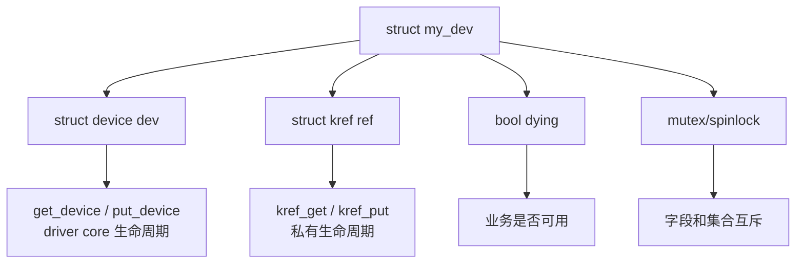

#### (3)_检查规则

如果一个对象里同时有：

```text
struct device；
struct kref；
struct mutex；
bool dying；
list_head；
```

必须写两张表：

```text
device 引用表；
私有 kref 引用表。
```

不要混成一句：

```text
这个对象有引用。
```

------

## 12.9_调试方法_从所有权表到_release_断言

### 12.9.1_调试方法一_写引用所有权表

遇到 kref bug，第一步不是看代码细节，而是写表。

例如：

```c
struct my_request {
	struct kref ref;
	struct list_head node;
	struct work_struct timeout_work;
	struct completion done;
};
```

引用表：

| 持有者            | 获得引用         | 释放引用                       | 备注            |
| ----------------- | ---------------- | ------------------------------ | --------------- |
| 创建者            | `kref_init()`    | submit 成功 handoff 或失败路径 | 初始引用        |
| 队列              | enqueue 成功     | dequeue                        | 保护队列中对象  |
| timeout work      | schedule 成功    | workfn 结束                    | 异步路径        |
| completion waiter | lookup 成功      | wait 结束                      | 用户等待路径    |
| 硬件完成路径      | 从队列取出并 get | 完成处理后                     | 中断/线程上下文 |

然后逐行检查：

```text
每个 get 是否有 put？
每个 put 是否只对应一份引用？
handoff 成功失败是否清楚？
remove 时是否阻止新 get？
release 前是否脱链？
```

引用表比盯着 `refcount++` 更有用。

------

### 12.9.2_调试方法二_给_get/put_加原因标签

正式代码中通常不这么写，但调试时非常有用。

```c
static void my_obj_get_dbg(struct my_obj *obj, const char *why)
{
	pr_debug("GET obj=%p why=%s caller=%pS\n",
		 obj, why, __builtin_return_address(0));

	kref_get(&obj->ref);
}

static void my_obj_put_dbg(struct my_obj *obj, const char *why)
{
	pr_debug("PUT obj=%p why=%s caller=%pS\n",
		 obj, why, __builtin_return_address(0));

	kref_put(&obj->ref, my_obj_release);
}
```

调用：

```c
my_obj_get_dbg(obj, "open");
my_obj_put_dbg(obj, "file release");

my_obj_get_dbg(obj, "queue");
my_obj_put_dbg(obj, "dequeue");

my_obj_get_dbg(obj, "work");
my_obj_put_dbg(obj, "work done");
```

日志目标不是证明“计数对了”，而是看：

```text
哪条路径 get 了但没 put；
哪条路径 put 了但没 get；
release 发生在什么调用栈；
release 是否早于异步回调；
remove 后是否还有新 get。
```

------

### 12.9.3_调试方法三_在_release_中加断言

release 是最后防线。

可以加一些临时断言。

```c
static void my_obj_release(struct kref *ref)
{
	struct my_obj *obj = container_of(ref, struct my_obj, ref);

	WARN_ON(!list_empty(&obj->node));
	WARN_ON(timer_pending(&obj->timer));
	WARN_ON(work_pending(&obj->work));
	WARN_ON(!obj->dying);

	kfree(obj);
}
```

这些断言的意义是：

```text
release 时对象不应该还挂在 list 中；
release 时 timer 不应该还 pending；
release 时 work 不应该还 pending；
release 时对象应该已经进入 dying/remove 流程。
```

注意：

```text
断言必须符合你的对象模型；
不要机械照抄。
```

例如，有些对象是正常自然释放，不一定有 `dying`。

------

### 12.9.4_调试方法四_区分三类_还活着

排查时要把“活着”拆成三类。

| 问题                 | 由谁回答                    |
| -------------------- | --------------------------- |
| 内存还没释放吗？     | kref / RCU / allocator 状态 |
| 生命周期还没结束吗？ | kref 是否持有成功           |
| 业务还可用吗？       | state / dying / remove 状态 |

错误说法：

```text
obj 还活着，所以可以用。
```

正确说法：

```text
obj 内存还在，不等于生命周期有效；
生命周期有效，不等于业务可用；
业务可用，也不等于字段访问不需要锁。
```

图示：

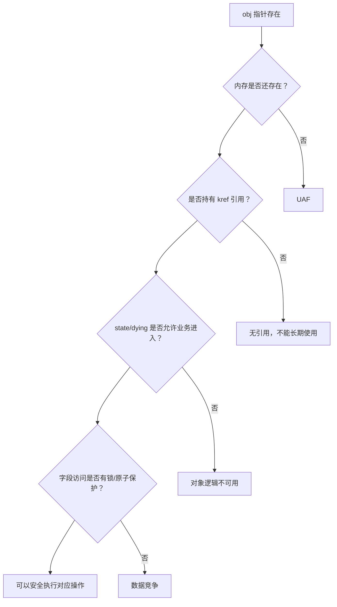

------

## 12.10_汇总审查_总表_流程和小结

### 12.10.1_本章错误模式总表

| 错误模式                     | 典型后果                 | 主要修复                           |
| ---------------------------- | ------------------------ | ---------------------------------- |
| 少 get                       | 异步 UAF                 | 投递/保存长期指针前 get            |
| 少 put                       | 泄漏                     | 所有权表补 put                     |
| 多 put                       | 提前 release / underflow | 一份引用只 put 一次                |
| put 后访问                   | UAF                      | put 前保存需要字段                 |
| lookup 后裸 get              | 悬挂指针 / 复活对象      | 锁内 get 或 RCU 内 get_unless_zero |
| get_unless_zero 不检查返回值 | 返回无引用对象           | 必须检查 false                     |
| handoff 归属不清             | 漏 put / 多 put          | 函数名和注释写清 take/get/borrow   |
| release 重新发布             | 对象复活                 | release 只做销毁                   |
| release 未脱链               | 全局悬挂指针             | remove 或 release 中明确 unlink    |
| kref 当锁                    | 字段竞争                 | 字段用锁/原子/状态机               |
| 重复 kref_init               | 破坏引用关系             | 只在新对象初始化时 init            |
| kref_read 判断有效           | UAF                      | 用真正 get 取得引用                |
| remove 不 drain              | 旧用户访问已撤销资源     | dying + unlink + drain + shutdown  |
| release 睡眠上下文不清       | 原子上下文睡眠 / 死锁    | 审计最后 put 上下文                |
| 手动操作 device 内部 kref    | driver core 生命周期错乱 | 使用 get_device/put_device         |
| 私有 kref 和 device 引用混用 | 层次错乱                 | 分两张引用表                       |

------

### 12.10.2_最小审查流程

看到一段 kref 代码，可以按这个顺序审查：

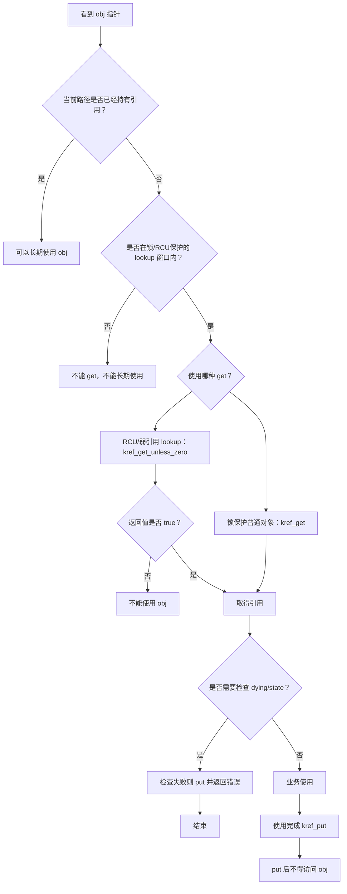

这个流程可以变成代码审查清单：

```text
1. 指针从哪里来？
2. 当前路径有没有引用？
3. 如果没有引用，get 前靠什么证明对象有效？
4. get 是否可能失败？
5. 失败后是否还访问对象？
6. 成功后是否检查对象状态？
7. 使用完是否 put？
8. put 后是否还有访问？
9. release 是否只执行最终销毁？
10. 对象是否从集合中正确脱链？
```

------

### 12.10.3_本章小结

本章不是新增规则，而是把前面规则转成错误清单。

kref bug 的本质通常不是：

```text
refcount++ 写少了；
refcount-- 写多了。
```

而是：

```text
引用归属没有定义；
handoff 成功失败没有定义；
lookup 到 get 的窗口没有保护；
remove 和 release 的边界没有拆开；
对象生命周期和业务可用性混在一起；
私有 kref 和 driver core 对象层次混在一起。
```

最重要的排查方法是：

```text
不要先盯着计数值；
先画所有权表。
```

最终检查句：

```text
谁持有对象？
谁负责 get？
谁负责 put？
谁能 lookup？
get 前由什么保护？
put 后是否还访问？
release 前是否已经不可见？
release 后内存什么时候真正释放？
```

一句话总结：

```text
kref 错误不是计数器错误，而是对象所有权协议错误。
```
