# 第12章\_典型错误模式与调试线索

## 12.1\_本章导读\_把错误模式归类排查

上一章已经能为设备与会话画出完整持有关系。现在程序偶尔在工作回调中报内存错误：是工作者没有取得引用，还是创建者把已经转交的份额又归还了一次？两种错误都可能让对象过早清理，但修复位置不同。只在崩溃行附近多加一个get，可能暂时掩盖错误，同时在另一条路径留下泄漏。

本章把前三条引用规则、交付、查找、锁、RCU和设备边界用于诊断。每个具体模式沿“现象—发生顺序—责任缺口—修复条件—可观察证据”展开。判断重点不只是整数加减是否配平，还包括每一次访问是否在合法期限内、每份责任是否只消费一次，以及退出以后还允许哪些业务。

先把故障分成几组。**UAF** 是 use-after-free，即释放后使用；它是访问时暴露的后果，错误的引用交接可能更早发生。

| 观察到的现象 | 优先追踪的责任缺口 | 不能直接推出的结论 |
| --- | --- | --- |
| 异步访问UAF、过早release | 少取得、转交后重复归还、未保护首次取得窗口 | 不能只凭访问栈认定错误就在访问函数 |
| 关闭后仍有分配或引用 | 成功/失败路径漏归还、在途使用者未结束 | 有正计数不自动等于泄漏 |
| refcount异常告警 | 从零增加、额外归还、溢出等可检测异常 | 没有告警不证明每份责任合法 |
| 存储仍在但字段/硬件错误 | 字段同步、关闭门、资源排空 | 多加引用不能替代锁或恢复硬件 |
| 等待不返回、关闭卡住 | 等待依赖、最后清理上下文、回调接锁协议 | 不能把所有卡住都归为少put |

后文分别追踪这些模式。首先建立一个诊断实验：同样是“get/put日志”，记录完整度、责任转交和观察区间怎样改变结论。

------

## 12.2\_调试入口\_工具只能发现症状

工具能够提供违反某项检查规则的证据；报告本身并不自动给出完整修复。先分清程序发生的事件和检查器掌握的事件，再判断该工具能排除哪些解释。

### 12.2.1\_调试工具先导

假定只审查一个新对象，创建者可为工作者新取一份，也可以把自己的份额转交过去。工作者必须拥有份额才能长期访问；本模型没有跨函数借用协议。事件日志记录的是已经成立的动作：成功取得以后才记录SHARE，成功转交才记录TRANSFER；失败尝试不能伪装成成功事件。PUT记录说明该份已消费，不能再用“我还有那个地址”为下一次访问辩护。

完整内核里，实际引用状态在对象的refcount成员，分配器管理存储是否仍可访问；诊断日志、KASAN元数据或Lockdep账本是另一组状态。我们的离线程序只维护 **影子责任账本**：creator和worker是当前记录推导出的份额，输入数组是事件历史，complete/closed分别声明记录是否完整、被审查业务区间是否结束。它不会对真实对象执行get、put或free，更不会故意触发UAF。

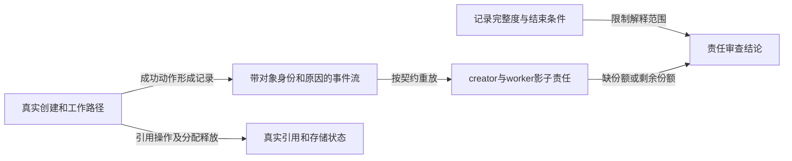
```mermaid
flowchart LR
    P[真实创建和工作路径] -->|成功动作形成记录| T[带对象身份和原因的事件流]
    P -->|引用操作及分配释放| F[真实引用和存储状态]
    T -->|按契约重放| S[creator与worker影子责任]
    Q[记录完整度与结束条件] -->|限制解释范围| V[责任审查结论]
    S -->|缺份额或剩余份额| V
```

代码中的 `event_kind` 枚举表示六种已发生事件：CREATE创建初始份额，SHARE_WORK为工作者另取一份，TRANSFER_WORK转交原份额，DROP_CREATOR/DROP_WORK归还对应拥有者的一份，USE_WORK表示工作者访问。`audit`函数按事件顺序更新责任，返回 `verdict` 枚举结论；程序末尾的断言把每条轨迹的预期与实际判定比较。

图中从事件流到影子账本只有单向信息传递。检查器无法靠修正自己的账本修复真实对象，也无法在记录丢失时猜回那次get。下面程序把“责任不合法”“结束后有剩余”“证据不完整”和“还没结束”分成不同结果。材料为[ownership_audit.c](../../../../labs/kernel/object_lifetime/materials/ownership_audit.c)。

```c
// SPDX-License-Identifier: MIT
#include <assert.h>
#include <stdbool.h>
#include <stddef.h>
#include <stdio.h>

enum event_kind {
    CREATE, SHARE_WORK, TRANSFER_WORK, DROP_CREATOR, DROP_WORK, USE_WORK
};
enum verdict { BALANCED, INVALID_OWNER, LEFTOVER, INCOMPLETE, STILL_OPEN };

/* 离线责任账本，不实现内核计数，也不实际释放或访问悬空内存。 */
static enum verdict audit(const enum event_kind *events, size_t count,
                          bool complete, bool closed)
{
    unsigned int creator = 0, worker = 0;
    bool created = false;
    if (!complete)
        return INCOMPLETE; /* 记录缺失时不能把缺少get判为真实少get。 */
    for (size_t i = 0; i < count; ++i) {
        switch (events[i]) {
        case CREATE:
            if (created)
                return INVALID_OWNER;
            created = true;
            creator = 1;
            break;
        case SHARE_WORK:
            if (!creator)
                return INVALID_OWNER;
            ++worker; /* 约定：创建者持份额时为工作者新取一份。 */
            break;
        case TRANSFER_WORK:
            if (!creator)
                return INVALID_OWNER;
            --creator;
            ++worker; /* 转交不增加总份额。 */
            break;
        case DROP_CREATOR:
            if (!creator)
                return INVALID_OWNER;
            --creator;
            break;
        case DROP_WORK:
            if (!worker)
                return INVALID_OWNER;
            --worker;
            break;
        case USE_WORK:
            if (!worker)
                return INVALID_OWNER;
            break;
        default:
            return INCOMPLETE;
        }
    }
    if (!created)
        return INCOMPLETE;
    if (!closed)
        return STILL_OPEN; /* 业务未结束时，有份额不等于泄漏。 */
    return creator || worker ? LEFTOVER : BALANCED;
}

int main(void)
{
    static const enum event_kind shared[] = {
        CREATE, SHARE_WORK, DROP_CREATOR, USE_WORK, DROP_WORK
    };
    static const enum event_kind missing_get[] = {
        CREATE, DROP_CREATOR, USE_WORK
    };
    static const enum event_kind duplicate_put[] = {
        CREATE, TRANSFER_WORK, DROP_CREATOR, USE_WORK, DROP_WORK
    };
    static const enum event_kind missing_put[] = {
        CREATE, SHARE_WORK, DROP_CREATOR, USE_WORK
    };
    static const struct {
        const char *name;
        const enum event_kind *events;
        size_t count;
        bool complete, closed;
        enum verdict expected;
    } cases[] = {
        {"shared", shared, 5, true, true, BALANCED},
        {"missing_get", missing_get, 3, true, true, INVALID_OWNER},
        {"transfer_then_put", duplicate_put, 5, true, true, INVALID_OWNER},
        {"missing_put", missing_put, 4, true, true, LEFTOVER},
        {"dropped_records", shared, 5, false, true, INCOMPLETE},
        {"active_worker", missing_put, 4, true, false, STILL_OPEN}
    };
    static const char *const names[] = {
        "balanced", "invalid_owner", "leftover", "incomplete", "still_open"
    };
    for (size_t i = 0; i < sizeof(cases) / sizeof(cases[0]); ++i) {
        enum verdict result = audit(cases[i].events, cases[i].count,
                                    cases[i].complete, cases[i].closed);
        assert(result == cases[i].expected);
        printf("%s: %s\n", cases[i].name, names[result]);
    }
    return 0;
}
```

在材料目录使用C11编译器执行：

```bash
cc -std=c11 -Wall -Wextra -Werror -O2 ownership_audit.c -o ownership_audit
./ownership_audit
```

本次宿主实际运行得到：

```text
shared: balanced
missing_get: invalid_owner
transfer_then_put: invalid_owner
missing_put: leftover
dropped_records: incomplete
active_worker: still_open
```

第一条是共享：1→2→1→0，工作者访问时拥有一份。第二条在创建者已经归还后才出现没有份额的工作者访问；程序只报告责任错误，不实际解引用已释放内存。第三条更值得停下来：转交以后总份额还是1，但这1属于工作者，创建者的DROP不合法。即使某次真实计数操作恰好减到零、没有发生下溢，它也已经消费了别人的保护。

第四条只有在声明业务区间已经结束时，才能把工作者剩余份额标为待清账；第六条相同事件却仍有活动工作者，所以是still_open。第五条说明“看起来配平”依赖完整日志前提：complete为false就只给incomplete。真实系统中这个前提需要由事件覆盖、缓冲区丢失计数、采集起止点和对象身份来证明，不能为了得到绿色结果手工填true。同一地址还可能被不同代对象复用，实际日志须有分配代次或其他稳定身份，不能把地址相同的事件强行串成一生。

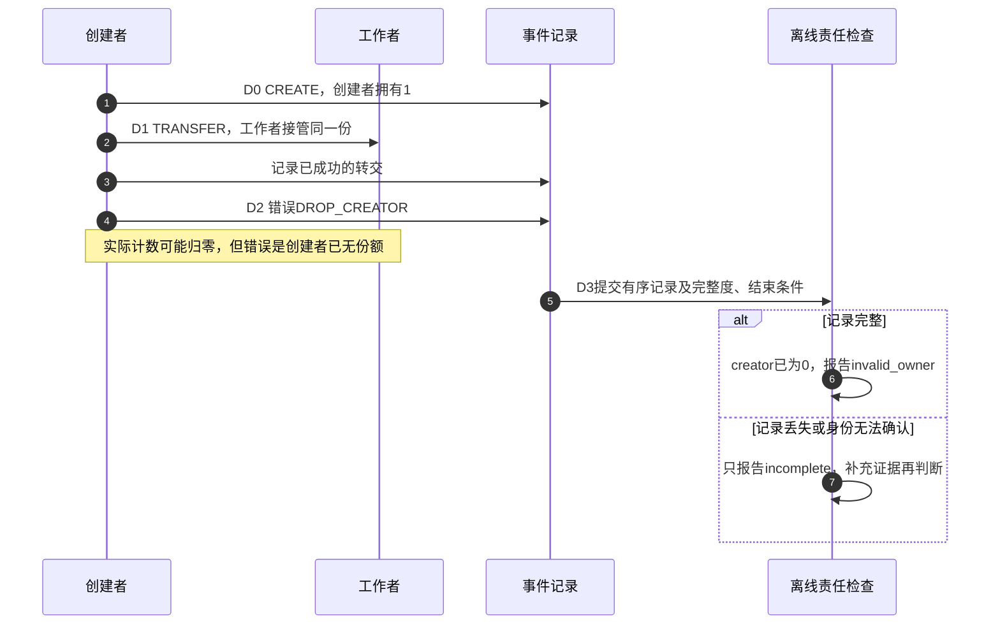
```mermaid
sequenceDiagram
    autonumber
    participant C as 创建者
    participant W as 工作者
    participant L as 事件记录
    participant A as 离线责任检查
    C->>L: D0 CREATE，创建者拥有1
    C->>W: D1 TRANSFER，工作者接管同一份
    C->>L: 记录已成功的转交
    C->>L: D2 错误DROP_CREATOR
    Note over C,W: 实际计数可能归零，但错误是创建者已无份额
    L->>A: D3提交有序记录及完整度、结束条件
    alt 记录完整
        A->>A: creator已为0，报告invalid_owner
    else 记录丢失或身份无法确认
        A->>A: 只报告incomplete，补充证据再判断
    end
```

顺序数组已经给定动作次序，六组断言只验证这个有限协议的重放结果。它没有验证多CPU日志的排序、原子性、内存屏障、真实分配器或内核诊断器。实际事件采集还须区分操作尝试、成功、失败回滚和释放；某些工具为了建模等待会在功能动作成功之前上报，不能根据事件名称猜测对象已经取得。Lockdep的这类区别见[当前账本与历史账本](../../synchronization_and_asynchrony/synchronization/lockdep/P01_为什么需要_Lockdep.md#1.3_为了组合证据还需要当前账本与历史账本)。

回到内核，应根据缺少的证据选择工具。下面只建立诊断入口，各工具的完整实现不在本章重复展开。

| 工具或观察方式 | 它记录或检查什么 | 如何用于本章 | 主要边界 |
| --- | --- | --- | --- |
| KASAN，Kernel Address Sanitizer，内核地址检查器 | 按模式检查越界、释放后访问等内存错误 | 找到非法访问，再结合可用的分配/释放栈回溯 | 模式、插桩与分配类型有边界，栈记录依赖配置；报告不一定包含所有历史 |
| KCSAN，Kernel Concurrency Sanitizer，内核并发检查器 | 通过编译插桩及观察点采样寻找访问冲突 | 区分引用仍在但字段存在数据竞争的情况 | 采样、插桩遗漏及注解影响覆盖；未报告不是无竞争证明 |
| kmemleak，内核内存泄漏检测器 | 跟踪分配并扫描是否找到指向对象的值 | 从可疑孤立分配追查漏归还路径 | 不直接核对引用账本；可达却逻辑泄漏的对象可能不报告，瞬时状态也需复核 |
| Lockdep，锁依赖检查器 | 当前任务持锁记录与跨时间锁类依赖历史 | 追踪最后归还、清理和等待形成的锁依赖 | 依赖正确接入、路径覆盖和仍有效的检查状态，不代替所有关闭活性证明 |
| refcount告警与自定义责任日志 | 特定数值异常及应用记录的取得/交付/归还 | 查明哪个调用点破坏了份额或数值条件 | 告警会影响固定refcount异常路径，但不会恢复正确责任；日志完整度仍需证明 |
| 模型匹配的退出断言、RCU诊断与跟踪 | 已明确的成员、回调和退出前提 | 核对本对象的具体不变量 | 一条WARN不自动阻止后续free，pending不等于没有正在执行的回调 |

版本证据以NXP官方固定Linux6.12.20为准，从[kref源码总索引](../../../../research/source_reading/kref/navigation/P01_Linux_6.12_kref源码阅读索引.md#1.2_按问题进入已落地证据)进入[异常诊断证据导读](../../../../research/source_reading/kref/navigation/P02_普通引用与归零回调导读.md#2.16_异常报告与检查覆盖)。固定Documentation/dev-tools下的kasan.rst、kcsan.rst、kmemleak.rst与Documentation/locking/lockdep-design.rst分别限定上述工具范围；refcount的具体异常入口见[告警前先饱和](../../../../research/source_reading/kref/source_explanations/lib/refcount.c.md#1.1_告警之前先收敛到饱和)。

例如KASAN报告中的分配/释放栈不是无条件存在：固定文档要求相应栈记录配置，且软件与硬件标签模式并非同一支持范围。这里不把ARM64标签能力套到当前ARM平台。kmemleak的候选名单也不是“少put次数表”：它扫描可达性，所以必须继续解释为什么那块存储本应已经不再被使用。

要让“这次未告警”成为有限证据，至少记录四件事：目标内核及工具配置；检查器运行时仍有效、没有被关闭或耗尽；目标访问、失败和退出分支确实执行；插桩、注解和日志采集覆盖所需事件。仅看到 `CONFIG_LOCKDEP=y` 还不够，Lockdep当前生命状态及容量边界见[查询与诊断模块](../../../../research/source_reading/lockdep/navigation/P04_Linux_6.12_Lockdep查询适配与诊断模块导读.md#4.1_模块问题)。

这次读取的源码工作树配置启用PROVE_LOCKING/LOCKDEP，未启用KASAN和DEBUG_KMEMLEAK，未见启用KCSAN；它只是构建配置快照，不证明虚拟机正在运行该内核，也不证明运行中的Lockdep仍有效。本批仅运行上述C模型，没有触发真实内核告警。调试时应为实际运行镜像重新记录这些条件，不能把工具名称列在表中就算已经验证。

先做两个小改动练习。将转交错误轨迹中的DROP_CREATOR删除，结论应变为balanced；如果再删除最后的DROP_WORK，并保持closed为true，则应为leftover。再把complete设为false：此时应回到incomplete，而不是报告缺失日志中“必然少了一个put”。这就是下一节分析真实错误代码时要保持的证据纪律。

------

## 12.3\_基础引用错误\_少\_get\_少\_put\_多\_put

先沿上一节同一个创建者—工作者协议定位问题：访问时没有可用份额、结束后还有无主份额、同一份被重复消费，以及归还后越过访问边界。它们可能产生相似日志，却需要回到不同交接点修复。本节先检查谁拥有，再解释计数为何变成所见数值。

### 12.3.1\_错误一\_少\_get\_异步路径\_UAF

#### (1)\_错误现象

设定本次调查的契约：提交者拥有一份，函数成功返回以后提交者还保留这一份，工作者也要独立使用对象。现在调用者排队后归还自己的份额，工作者晚一点才访问。若没有为工作者增加份额，也没有其他管理者保活，最后归还就可能先回收对象。

这里的错误是 **承诺独立共享却没有交付工作者那一份**。不能直接改写成“凡是异步就必须get”：P07的转交方案可把已有份额交给工作者；P06的管理者借用方案可由管理者保活直到取消/等待结束。只有先确定契约，才知道少了get还是多了put、少了等待。

workqueue、timer、回调、异步发送完成、中断下半部和延迟文件处理都可能出现这种交接缺口。completion只是事件通知，不自动交付对象份额；RCU读区外的长期使用也不能靠曾经见过地址来维持对象。逐种场景要核对实际拥有者，不能按回调名字分配引用。

#### (2)\_错误代码

下面是共享契约下的错误接口片段，`my_obj_get_by_id`返回调用者拥有的一份，worker通过内嵌work恢复外壳。它不是另一个可直接构建的驱动模板。

```c
obj = my_obj_get_by_id(id); /* 成功带回一份，不是裸查找。 */
if (!obj)
    return -ENOENT;
schedule_work(&obj->work); /* 只发布工作，没有自动为外壳增加kref。 */
kref_put(&obj->ref, my_obj_release); /* 创建者的份额结束。 */
```

worker中的 `container_of` 只计算外壳地址，不能补出一份引用。给结构另存 `work_obj = obj` 也只是复制地址，因此旧示例的这个字段不承担任何保活作用。失败是否入队、成功由谁归还都还没有定义，不能通过在回调末尾随意加put补救。

#### (3)\_并发时序

将错误压到一条具体交错。W0是调用者刚取得唯一份额，W1发布work，W2调用者归还，W3工作者开始访问。

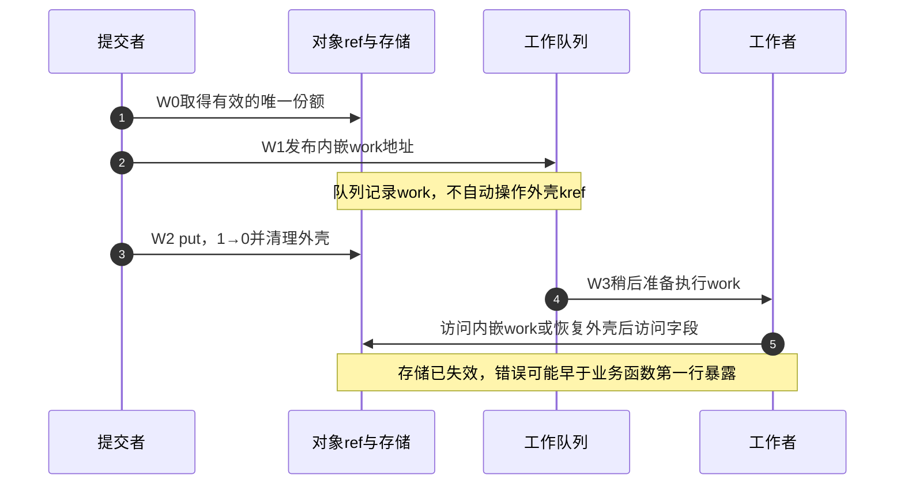
```mermaid
sequenceDiagram
    autonumber
    participant S as 提交者
    participant O as 对象ref与存储
    participant Q as 工作队列
    participant W as 工作者
    S->>O: W0取得有效的唯一份额
    S->>Q: W1发布内嵌work地址
    Note over Q,O: 队列记录work，不自动操作外壳kref
    S->>O: W2 put，1→0并清理外壳
    Q->>W: W3稍后准备执行work
    W->>O: 访问内嵌work或恢复外壳后访问字段
    Note over W,O: 存储已失效，错误可能早于业务函数第一行暴露
```

并非每次调度都按这个顺序：若工作者先完成，错误可能暂时没有表现；压力变化或多CPU才暴露只是交错变了，不表示该协议曾经正确。也不必等到业务回调里才出错，框架读取已经释放的内嵌work本身就越界于有效期限。

#### (4)\_正确写法

以同一对象比较三种能闭合的协议：

| 协议 | W1以前的动作 | W2提交者怎样退出 | W3及之后怎样结束 |
| --- | --- | --- | --- |
| 独立共享 | 在仍拥有有效份额时，另get一份作为工作候选 | 成功后保留自己的份额，自己结束时put | worker完成后put自己的份额；若未建立工作则提交者退回候选 |
| 成功转交 | 不增加总数，把当前份额交给工作路径 | 成功后不再消费已转交份额；失败仍负责它 | worker归还转来的那一份 |
| 管理者保活的借用 | 管理者持有份额并覆盖工作整个执行期限 | 先关新入口，再等待/取消所有借用使用结束 | worker没有一份可put；等待结束后管理者归还 |

完整共享程序可回到[note_kref_work.c](../../../../labs/kernel/object_lifetime/materials/note_kref_work.c)：新对象只提交一次，排队以前get，拒绝时退回候选和创建者两份，成功时创建者与worker各归还一份，模块退出等队列结束再撤走回调代码。这里的“两次put”配对的是两份不同责任，不是后文的重复归还错误。

对照[P07双协议完整请求](P07_handoff_所有权转移模型.md#7.6.1_一个完整请求对象_handoff_示例)，成功take以后再put生产者就是错误；对照[P06管理者等待借用](P06_release_回调与复杂销毁模式.md#6.2.2_运行一个由管理者等待借用退出的模块)，worker自己再put也会多消费一份。三个完整程序职责不同，不能截取一行get/put拼装成第四种不明契约。

对于可反复投递的work，固定6.12.20还要区分pending和正在执行：执行路径在调用工作函数前清除pending，因此“正在执行”不等于“本次排队必然返回false”。已有pending或禁用状态也可能使本次没有建立新执行责任。**按每次成功排队拥有一份的设计**，应先预留候选，返回false就仅退回本次候选，不触碰原来工作已有的份额；成功则将候选交给这次执行。若还有取消路径，它必须明确接管被取消而不会执行的那份，不能只等worker归还。

这不是鼓励在任意旧模板上直接增加重排。状态、关闭门、成功次数和取消责任要一起设计。固定证据从[工作队列总索引](../../../../research/source_reading/workqueue/navigation/P01_Linux_6.12_工作队列源码总阅读索引.md#1.3_三条模块分支)进入[投递与非重入](../../../../research/source_reading/workqueue/source_explanations/P02_Linux_6.12_工作队列投递与激活源码实现.md#2.4_queue_work选择pool并保持非重入)、[执行时清除pending](../../../../research/source_reading/workqueue/source_explanations/P03_Linux_6.12_worker_flush与取消源码实现.md#3.3_worker_thread与process_one_work执行边界)及[取消等待](../../../../research/source_reading/workqueue/source_explanations/P03_Linux_6.12_worker_flush与取消源码实现.md#3.5_cancel_work_sync撤销与等待)。

#### (5)\_调试线索

按W0～W3收集对象代次、发布结果、责任方、归还与清理事件，再比较实际访问栈。若release先于工作访问，支持“访问越过存储期限”，但仍要分别检查少取得、转交后多归还和错误取消；单看计数没有underflow，不能排除创建者消费了工作者的份额。

日志可以在合法拥有对象时打印原因标签，例如“为成功排队预留”“本次拒绝退回”“worker结束”。最后put以前先记录必要字段，避免为了诊断又在put之后读取对象。日志是否开启、是否丢记录及地址是否复用仍沿12.2的前提，不把缺少一行直接判为缺少操作。

用本章已给的C账本作预测：missing_get应报告invalid_owner；改为先TRANSFER_WORK再让创建者DROP仍应报错；若选择管理者借用，则当前这个“worker必须自有一份”的账本不适用，必须改成记录借用开始、退出及管理者等待的协议。检查模型也有契约，不能为了得到预期告警随意套用。

------

### 12.3.2\_错误二\_少\_put\_对象泄漏

#### (1)\_错误现象

设一个成功open为文件实例取得对象一份，文件最终release时却只清空private_data。对象计数仍有那一份，应用又丢掉了负责归还它的位置，可能永远不进入最终清理。模块退出时仍有对象、退出阶段结束后还有无主份额，都是追查漏归还的线索。

但“计数大于零”或“暂时没有release”本身不够：也许文件仍开着、工作还在运行，或者RCU只结束了引用却还没执行回收回调。先定义观察终点，再证明所有合法拥有者本应结束。kmemleak按可达性产生候选，不能承诺每一种逻辑引用泄漏都被发现。

#### (2)\_错误代码

下面是文件操作的接口片段。前提是open已经成功得到一份，并交给 `file->private_data` 所表示的文件实例责任；这里的private_data只是存放地址，不自动增加或归还对象引用。

```c
static int my_obj_release_file_bad(struct inode *inode, struct file *file)
{
    (void)inode;
    file->private_data = NULL; /* 丢掉了归还位置，却没有消费对应的一份。 */
    return 0;
}
```

这里要区分文件描述符和内核 `struct file` 实例。复制描述符可以共享同一文件实例，不会为每个描述符重新执行驱动open；对应release也不是每次close都执行一次。文件最终清理才进入其release回调，而且fput触发的最终清理可能通过任务工作或延迟路径完成。调试记录应以文件实例的责任周期为单位，不能按用户态close次数给对象多put。固定源码位置与验证边界见[工作与文件责任导读](../../../../research/source_reading/kref/navigation/P02_普通引用与归零回调导读.md#2.17_工作与文件份额的诊断落点)。

#### (3)\_正确写法

在该契约下，先取走private_data代表的责任，再清空字段、归还一次：

```c
static int my_obj_release_file(struct inode *inode, struct file *file)
{
    struct my_obj *obj = file->private_data;
    (void)inode;
    file->private_data = NULL;
    if (obj)
        kref_put(&obj->ref, my_obj_release); /* 消费文件实例持有的一份。 */
    return 0;
}
```

这段代码依赖文件最终release的生命周期条件，不是支持并发重复调用的通用“幂等put”。普通指针清空没有自动替你加锁。open后续若还有可能失败，失败路径必须归还已经取得但尚未成功交给文件的份额；不能假设open失败也会替你走成功文件的release。

如果文件向异步路径交付了另一份，文件release只归还文件这一份，不能顺便消费worker的份额。若选择文件保活的借用模式，则文件退出须先停止并排空借用；这属于另一套明确的协议。

#### (4)\_所有权表

将“集合里有指针”改成明确责任，再检查每个出口：

| 拥有者或角色 | 份额来源 | 结束或交付位置 |
| --- | --- | --- |
| 创建者 | 成功初始化的一份 | 自己结束时put，或成功take交给下一方；不是两者都做 |
| 文件实例 | 成功open接管lookup取得的一份 | 文件最终release；失败则由失败路径归还尚未交付份额 |
| 按执行计费的work | 排队以前预留，成功后交付 | 执行尾部或明确接管取消责任的路径；未排队退回候选 |
| 拥有型集合 | 发布时另取一份或接管参数份额 | 真实移除后归还一次，或出队转交给消费者 |
| 注册回调 | 按注册契约取得或接管 | 执行或注销中规定的一条收尾路径 |

非拥有索引不凭空增加“集合份额”；借用worker也不应出现在“自己必须put”的行里。这些例外不是放松纪律，而是把实际保活者写清楚。出队若转交同一份，就没有一次额外put；如果出队决定丢弃请求，才在该路径消费它。

#### (5)\_调试线索

从“已经结束但还剩一份”的案例，反向找该份的来源，检查成功、失败、取消和转交出口。先看12.2的missing_put与active_worker：事件相同，只有观察区间是否结束不同，因此一个是leftover、另一个仍在使用。实际系统同样不能为了让计数归零而强行put未知份额。

可以临时增加带原因的get/put日志，也可以增加debug_refs辅助计数，但它必须包含初始份额并覆盖全部包装路径。调试计数与真实kref分属不同存储，多CPU上两个原子更新不会自动组成一个原子事务；采样点不同就可能暂时不相等。禁止用辅助值决定是否free或是否还能访问，也不能在可能最后的put之后读取debug_refs。与其只追总数，通常更应记录对象身份、事件原因和责任流向。

验证修复时，除了正常关闭，还应覆盖open取得后失败、投递被拒、取消未执行工作、以及转交后原调用者退出。完整协议与失败路径可回到已有对象和交付模块；本节只增加诊断判断，没有把这些接口片段冒充完整可加载驱动，也没有实际执行VFS文件退出测试。

------

### 12.3.3\_错误三\_多\_put\_提前\_release\_或\_underflow

#### (1)\_错误现象

多put的根因是 **没有一份属于本路径的责任，却执行了归还**。它可能使计数提前归零，也可能在仍有很多引用时悄悄消费另一方的保护。只有某些数值状态会触发underflow等告警；即使每次减法都从正数开始，也可能已经违反所有权。

沿上一节的两方共享场景，创建者与消费者各有一份。创建者连续put两次，把计数2→1→0，release提前执行；消费者随后使用就越过存储期限。数值恰好到零不是“计数没问题”，而是第二次减法消费了消费者的那一份。调试时要找到两次归还各自声称的责任来源。

#### (2)\_错误代码\_错误路径重复\_put

下面只讨论候选引用的清理。调用者已有一份，函数为了成功返回另一个拥有型结果再get一份；`step1`、`step2`是同步检查，不分配资源、不改变份额。如果它们还建立其他资源，必须另加对应资源的分阶段撤销，不能由一次put包办。

```c
static int prepare_ref_bad(struct my_obj *obj, struct my_obj **out)
{
    int result;
    *out = NULL;
    kref_get(&obj->ref); /* 新候选；调用者的原份额仍归调用者。 */
    result = step1(obj);
    if (result)
        goto err;
    result = step2(obj);
    if (result)
        goto err_put;
    *out = obj; /* 成功交付候选，接收者负责归还。 */
    return 0;
err_put:
    kref_put(&obj->ref, my_obj_release);
err:
    kref_put(&obj->ref, my_obj_release); /* 第二步失败会连续消费两份。 */
    return result;
}
```

第二步失败以后流经两个标签，两次put并不是“两个步骤各清理一次”：本函数只新取得一份。若调用者原来仅有一份，进入时计数1→2，第一次put退回候选为1，落入err再次put则将调用者那一份也消费掉。调用者仍以为参数有效，错误因此在函数外暴露。

#### (3)\_正确写法

统一候选引用的失败出口，成功则明确通过out交付这一份：

```c
static int prepare_ref(struct my_obj *obj, struct my_obj **out)
{
    int result;
    *out = NULL;
    kref_get(&obj->ref);
    result = step1(obj);
    if (result)
        goto put_candidate;
    result = step2(obj);
    if (result)
        goto put_candidate;
    *out = obj; /* 两种返回都不消费调用者原份额；成功另交付一份。 */
    return 0;
put_candidate:
    kref_put(&obj->ref, my_obj_release);
    return result;
}
```

检查四个点：输入地址和原份额有效；候选只取得一次；任一检查失败只退回候选；成功以后out代表新拥有者，不能漏掉其归还。仅把两个goto改到同一个标签而仍不解释成功后的引用归属，会修复多put、留下少put。

如果取得是条件性的，可以用 `got_ref` 记录本路径是否拥有候选；成功交付或归还后要随之撤销这项本地责任。只有分支确实可能未取得时，这个标志才有信息价值。若每次都会get，再写一个永远为true的标志，不会让协议更安全。多种资源的标签应按已完成阶段逆序撤销，每个标签负责哪项资源或份额必须能从上面的成功步骤对应出来。

本批使用固定普通引用函数编译并运行以上两个片段，检查第一步失败、第二步失败、成功交付，以及错误第二步失败导致原份额被消费。夹具用静态对象记录release次数，没有实际访问已释放内存；两个step是可控返回值替身，不能证明真实业务检查无副作用。

#### (4)\_错误代码\_handoff\_后当前路径又\_put

同一种“消费别人的份额”还可能藏在成功路径。如果入队接口约定成功接管当前份额，那么成功以后调用者再put，就把队列已经拥有的一份归还了。队列仍保存地址，却失去其存储保障。指针从未改变，也不会在C类型里自动显示“份额已经转走”。

```c
result = enqueue_take(queue, obj);
if (result)
    kref_put(&obj->ref, my_obj_release); /* 拒绝，当前路径仍负责这份。 */
/* 成功时不put已转交份额，也不再靠它访问obj。 */
obj = NULL; /* 只清本地变量，避免误用；这不是一次引用操作。 */
```

该片段假定当前路径在返回以后不再需要其份额，失败也选择放弃对象。若失败要继续重试，就保留份额，不在该分支put。共享接口则不同：成功新增队列份额，调用者自己的那一份依旧需要在自己结束时归还。

#### (5)\_模型\_A\_队列新增引用

回看P07完整程序中的 `enqueue_ref`：它先预留新候选，再调用接管式底层。底层拒绝时包装退回候选，调用者始终保留原份额；底层成功时槽位拥有新份额。消费者出队接管槽位份额，再交给工作路径，工作者最后归还。

因此不能把“入队函数内部有put”直接当成错误：拒绝分支归还的是这次候选。也不能只看到成功分支没有put就判泄漏，因为这一份已经交给队列、消费者和worker。要沿同一份责任的完整路径核对。

#### (6)\_模型\_B\_当前引用转移给队列

P07的 `enqueue_take` 不增加总数；成功时队列锁内把槽位和阶段改好，原份额随之归队列，拒绝时仍留给调用者。它也检查槽位占用和请求阶段，避免同一内嵌节点被反复无条件加入。原来的短 `list_add_tail` 示例缺少这些前提，不能冒充可直接使用的队列实现。

名字可以帮助表达契约：ref/get说明新增份额，take说明接管，borrow说明在已证明的期限内借用。但名字本身不决定失败是否消费、是否允许重试及可否跨函数保存。borrow若异步持续，就必须有管理者的保活和退出等待，不能仅以“这次没get”为借用成立的证据。

可复盘[同一请求的完整两种设计](P07_handoff_所有权转移模型.md#7.6.1_一个完整请求对象_handoff_示例)，再用12.2的transfer_then_put轨迹验证责任：转交以后创建者已为0，即使工作者为1，创建者也无权消费它。多put的定位单位是“一份归谁”，不是“总数还能不能再减”。

------

### 12.3.4\_错误四\_put\_后继续访问对象

#### (1)\_错误现象

若当前路径只有一份，归还后不能继续凭那份读取对象。其他路径也许还有引用，但当前路径不知道它们什么时候退出，不能将“刚才计数大于1”当成自己之后的保护。

```c
kref_put(&obj->ref, my_obj_release);
pr_info("obj id=%d\n", obj->id); /* 没有剩余保护时，字段读取可能UAF。 */
```

更隐蔽的是归还后解锁 `obj->lock`、读取 `obj->node` 或把obj交给另一个函数。它们同样需要对象存储有效；不是只有业务数据字段才算访问。

#### (2)\_正确写法

若只为日志需要一个标量，先在合法期限内按字段同步规则复制，再归还：

```c
int id;
spin_lock(&obj->lock); /* 前提：当前上下文适用且输入已持一份。 */
id = obj->id;
spin_unlock(&obj->lock);
kref_put(&obj->ref, my_obj_release);
pr_info("obj id=%d ref dropped\n", id); /* 只使用本地副本。 */
```

不可变字段不必为这次复制凭空加锁；可变字段则沿其真正的同步协议读取。复制一个指针不等于复制指向的数据：若保存的是obj内部字符串地址，而字符串也在release中释放，put后再打印该字符串仍有问题。应复制所需内容，或为被指对象另持合法份额。

有一种合法例外：本路径确实独立拥有两份，先归还其中一份以后，仍可依据另一份继续使用，最后再归还。另有明确借用期限也要由对应拥有者保证。关键是指出 **put以后哪一项保护还成立**，不能让调用者猜“别人应该还在”。

#### (3)\_时序图

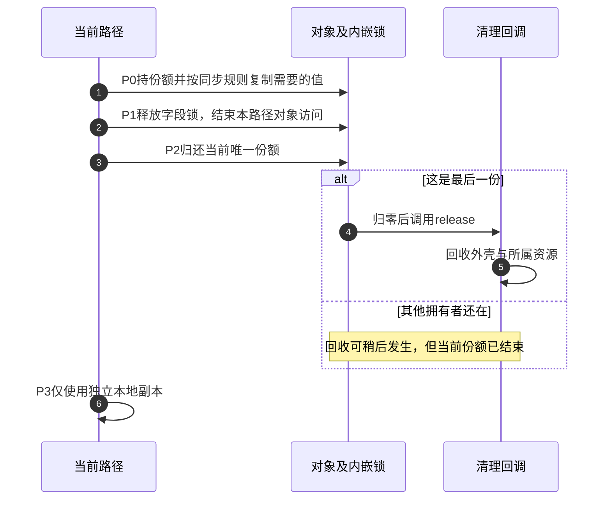
```mermaid
sequenceDiagram
    autonumber
    participant C as 当前路径
    participant O as 对象及内嵌锁
    participant R as 清理回调
    C->>O: P0持份额并按同步规则复制需要的值
    C->>O: P1释放字段锁，结束本路径对象访问
    C->>O: P2归还当前唯一份额
    alt 这是最后一份
        O->>R: 归零后调用release
        R->>R: 回收外壳与所属资源
    else 其他拥有者还在
        Note over O,R: 回收可稍后发生，但当前份额已结束
    end
    C->>C: P3仅使用独立本地副本
```

P1必须早于可能释放内嵌锁的P2；P3是否安全取决于副本是否独立，不取决于这次恰好走了哪个归零分支。对于本来允许在锁内put的特殊协议，还必须有另一个保护使锁地址有效，不能从这个普通例子推出所有锁组合都相同。

#### (4)\_检查规则

遇到可能消耗当前最后一份的put，检查后续的字段、锁、节点、状态、container_of恢复结果及传参路径。日志应保存对象代次等独立标识，不依赖清理后的对象字段；仅保存地址也不能据此继续解引用，更不能忽略地址复用。

练习沿上一小节的prepare_ref成功路径：原调用者和out接收者各一份，原调用者put以后，接收者能继续使用，因为它有明确独立份额；原调用者若仍使用原局部指针，则须证明自己还另有份额或借用期限，不能借接收者的存在冒充自己的契约。返回同一个地址，并不意味着返回了同一项责任。

------

## 12.4\_lookup\_与\_handoff\_错误\_从指针到引用的窗口

上一节检查已有份额怎样被错误消费。现在退回最早一步：第一次从共享结构拿到地址时，还没有自己的份额，谁使这个地址有效？取得以后再把它交给另一条路径时，返回值又怎样决定责任？这两个窗口是许多“每处都有get/put”却仍会出错的来源。

### 12.4.1\_错误五\_lookup\_后无保护\_get

#### (1)\_错误现象

如果find只返回裸地址，保护在它返回时已经结束，调用者随后get就留下回收窗口：

```c
obj = my_obj_find(id); /* 假定只返回裸地址，没有持有型结果。 */
if (!obj)
    return -ENOENT;
kref_get(&obj->ref); /* 不能靠这一步倒过来证明输入地址有效。 */
```

先核对find的契约。如果它本来已经返回拥有型引用，这段额外get可能是另一个漏归还问题；如果它在明确的外层锁/读区内借出地址，保护可能仍然有效。不能只按函数名判断，也不能在失去保护后加一个条件get就认为安全。

#### (2)\_并发时序

Q0～Q3追踪同一表项：查找者从共享表读出地址，移除者在表保护下摘掉入口，再归还发布份额；查找者随后才尝试取得。下面假定发布份额是唯一剩余份额，且没有延迟回收保护。

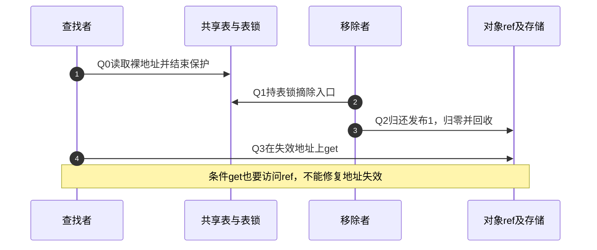
```mermaid
sequenceDiagram
    autonumber
    participant L as 查找者
    participant T as 共享表与表锁
    participant R as 移除者
    participant O as 对象ref及存储
    L->>T: Q0读取裸地址并结束保护
    R->>T: Q1持表锁摘除入口
    R->>O: Q2归还发布1，归零并回收
    L->>O: Q3在失效地址上get
    Note over L,O: 条件get也要访问ref，不能修复地址失效
```

问题发生在首次引用建立以前。原子操作只能针对有效的存储执行，不会先替你询问分配器“这个地址现在还是原对象吗”。若地址已被另一对象复用，还可能把新分配误当成旧身份；这也需要由查找和回收协议排除。

#### (3)\_mutex/list\_正确写法

对于 **拥有型集合**，发布时已经取得集合份额，查找和摘除使用同一把锁。查找在锁内找到成员，就能证明它尚未被移除且集合份额仍在，然后普通get建立自己的份额，再离开锁。

```c
mutex_lock(&my_obj_list_lock);
obj = my_obj_find_locked(id);
if (obj)
    kref_get(&obj->ref); /* 这里依赖集合持有正引用，而不只是“有一把锁”。 */
mutex_unlock(&my_obj_list_lock);
```

如果集合只是非拥有索引，另一路可能在不持此锁时先把计数减到零，再到release里等待表锁摘除。这时锁使地址暂时不被释放，却不能使计数必然为正；查找要在同一地址保护窗口内条件取得并处理失败。另一种可行设计让可能的最后归还与取得在同一锁下串行化，具体接锁协议见前面的锁组合单元。**锁名相同不是证明，份额和回收顺序才是。**

完整对照已经在[P08查找窗口](P08_lookup_场景与_kref_get_unless_zero%28%29.md#8.3.1_正确模型一_mutex/list_lookup_+_kref_get%28%29)及[非拥有索引](P08_lookup_场景与_kref_get_unless_zero%28%29.md#8.4.3_kref_get_unless_zero%28%29_仍然需要锁或_RCU)建立，本节用它们定位现有代码缺的前提，不另造只含一行锁的“万能修复”。

#### (4)\_RCU\_正确写法

若协议允许计数先归零、存储等旧RCU读者退出后再回收，读者可能看到“地址仍有效但计数为零”。此时必须在读区内完成条件取得，失败不能把地址作为拥有型结果带走：

```c
rcu_read_lock();
obj = my_obj_find_rcu(id); /* 对应RCU发布、摘链与延迟回收协议。 */
if (obj && !kref_get_unless_zero(&obj->ref))
    obj = NULL;
rcu_read_unlock();
/* 非空结果才拥有一份；业务可用性还须按对象协议判断。 */
```

固定kref文档强调查找与条件取得必须处于同一保护临界区，并检查返回值。实现及失败分支从[kref源码索引](../../../../research/source_reading/kref/navigation/P01_Linux_6.12_kref源码阅读索引.md#1.2_按问题进入已落地证据)进入[条件取得实现](../../../../research/source_reading/kref/source_explanations/include/linux/kref.h.md#1.7_有效地址上的条件取得)。如果没有正确的发布和延迟回收，空加一对rcu_read_lock/unlock也不能保护任意对象。

还有另一种已经在P10讲过的退休顺序：移除入口以后，保留发布份额直到相应旧读者全部结束，再归还它。旧读区内因这份发布引用而仍能证明正计数，普通get可以成立。回放[P10的两种退休顺序](P10_kref_与_RCU.md#10.2.1_RCU_和_kref_分别保护什么)即可看见区别：RCU这个名字并不单独决定选哪个get，真正决定的是当前读区内可用的保证。

#### (5)\_根因

把判定拆成三问：地址在何种期限内有效，取得时能否证明正计数，成功以后返回哪一份责任。前两问决定普通还是条件取得，第三问决定调用者离开保护后怎样使用和归还。取得之后是否允许新请求，则继续由业务门和字段同步负责。

“没有保护的get会复活对象”也不够准确。固定普通refcount路径对从零增加有诊断和饱和处理，并不授予合法新生命周期；对已经释放的地址，连检查计数这一步都没有有效输入。应先修复地址期限和取得协议，而不是依赖异常路径替应用兜底。

------

### 12.4.2\_错误六\_handoff\_成功和失败路径归属不清

#### (1)\_错误现象

enqueue、submit、schedule、注册回调、异步发送和发布接口都可能改变责任位置。成功后双方都put会重复归还，双方都不put会遗留份额；失败以后重试已消费的参数，又可能访问失效地址。不同API的0、false或负错误码只表达各自返回约定，不天然表达引用是否转移。

#### (2)\_错误代码

只有转发调用的包装并不自动错误，但仅看下面代码无法确定拥有权：

```c
static int my_obj_submit(struct my_queue *queue, struct my_obj *obj)
{
    return queue_push(queue, obj); /* 必须继承并说明底层的成功/失败责任契约。 */
}
```

如果底层和包装文档都明确且调用者遵守，就不必为了“看见get”硬添一次引用。审查缺口是契约未知：queue_push是借用、新增还是接管？失败是否已经清理？它保存的地址由谁保障到执行结束？先查实现和所有调用方，再修改。

#### (3)\_正确写法一\_submit\_get

共享式包装先为底层接管接口预留新候选，成功交付候选，失败退回候选；调用者的原份额两种返回都保留。P07完整程序的enqueue_ref已经实现这一层。不能在失败时同时把调用者原份额也归还，除非接口另有明确的“始终消费”契约。

#### (4)\_正确写法二\_submit\_take

成功接管式不需要增加总数：成功以后当前参数代表的一份已经移交，失败仍留给调用者。P07的enqueue_take还检查槽位和对象阶段，出队再把同一份交给消费者。成功返回以后，调用者只应清除本地变量或使用另外独立拥有的份额，不能继续消费刚转交的那份。

#### (5)\_正确写法三\_submit\_take\_always

始终消费也是可以成立的接口设计：调用者希望把“提交或丢弃”一次交给被调用方，失败以后不再保留重试资格。它并非天生危险，但必须在名字、注释和调用方中一致，尤其不能套用“失败由调用者put”的习惯。

在P07完整队列的接管接口上增加如下包装即可说明区别。这里只使用已经存在的request_queue、queued_request和request_put，完整底层及构建入口仍在P07；这是补充接口片段，不是另一个队列实现。

```c
/* 成功交给队列，失败直接丢弃；两种返回都消费参数代表的一份。 */
static int enqueue_take_always(struct request_queue *queue,
                               struct queued_request *request)
{
    int result = enqueue_take(queue, request);
    if (result)
        request_put(request);
    return result;
}
```

成功后队列持有那一份，拒绝时可能立即触发release。调用者若要记录字段，应事先按同步规则复制，或明确额外持有另一份，不能在失败返回后才读取被消费的对象。重试需要新的拥有型输入，不是再次提交旧裸地址。

#### (6)\_handoff\_状态图

以同一个队列底层比较三种外层契约，图中的“原份额”始终指调用前参数代表的那一份：

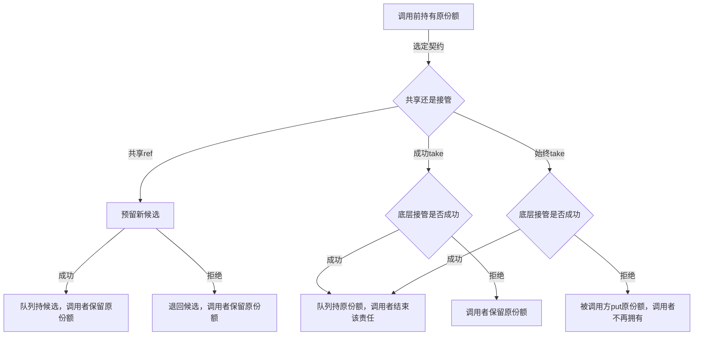
```mermaid
flowchart TD
    A[调用前持有原份额] -->|选定契约| B{共享还是接管}
    B -->|共享ref| C[预留新候选]
    C -->|成功| D[队列持候选，调用者保留原份额]
    C -->|拒绝| E[退回候选，调用者保留原份额]
    B -->|成功take| F{底层接管是否成功}
    F -->|成功| G[队列持原份额，调用者结束该责任]
    F -->|拒绝| H[调用者保留原份额]
    B -->|始终take| I{底层接管是否成功}
    I -->|成功| G
    I -->|拒绝| J[被调用方put原份额，调用者不再拥有]
```

对这个包装的本批宿主检查包含成功入槽与满槽拒绝，并重跑底层既有十组控制路径。成功时归零留给消费者，拒绝时被调用方清理该请求且不影响已占槽对象；锁和工作调度仍是明确替身，没有验证真实并发或目标模块。

练习：把同一调用方从enqueue_take改成enqueue_take_always，却保留失败后的request_put，会发生什么？拒绝时被调用方已经消费原份额，调用者再put就是重复归还。反过来，从always改成只成功take，却删除了失败归还，则会遗留责任。改接口时必须沿调用方同步审查，不能只让函数体编译通过。

------

## 12.5\_release\_与\_remove\_错误\_销毁边界要收干净

取得和交付都配平以后，最后归还仍可能暴露外部入口、异步使用者或资源退出的缺口。本节先问release接手了什么责任，再分别核对拥有型集合和非拥有索引；不能只看到“还有链表节点”就决定必须在哪个函数摘链。

### 12.5.1\_错误七\_release\_里重新发布对象

#### (1)\_错误现象

假定对象已经按普通kref协议归零，release却决定继续正常业务，重新加入全局列表并把计数设回1：

```c
static void my_obj_release_bad(struct kref *ref)
{
    struct my_obj *obj = container_of(ref, struct my_obj, ref);
    if (need_retry(obj)) {
        list_add(&obj->node, &global_list); /* 没有建立新的发布与同步协议。 */
        kref_init(&obj->ref); /* 用重置整数伪装成仍可取得的原对象。 */
        return;
    }
    kfree(obj);
}
```

顺序本身也有漏洞：先发布地址、再初始化计数，会让查找者在两步之间见到旧状态。即使反过来写，这段代码也没有说明已启动的关闭、旧读者和资源撤销怎样恢复。它不能靠“又有一个1”重新获得原业务身份。

#### (2)\_根因

最后归还把该引用域交给最终清理；旧拥有者已经没有继续普通业务的份额。release不是一个可以临时决定“还有工作，算了别结束”的请求处理入口。重新暴露同一地址，会让外部路径误以为旧生命周期还连续有效，而字段、子资源、索引和关闭状态可能已经沿退出流程变化。

这里限制的是 **原引用域的重新发布与普通业务复活**。它不禁止合法的延迟清理：release可以把独占的清理责任交给工作或RCU回调，只要存储保持到该清理完成、旧普通入口不再取得对象、回调代码寿命和失败处理也有保证。这个清理任务不是一个重新get旧零计数的业务拥有者。

同一内存块在旧生命周期完全结束以后由专门对象池用于新对象，是另一套新生命周期协议；必须先证明旧引用、借用、回调和身份已脱离，再重新初始化和发布。不能把“存储可以复用”当成上面release分支可以恢复旧对象的理由。本节不设计对象池。

#### (3)\_正确处理

若需要业务重试，在仍持有合法份额且业务门允许时决定。然后按12.4的共享或转交契约提交：成功交付相应份额；拒绝退回候选或保留/消费原份额，必须与接口约定一致。只写get、queue_retry_work、put而不处理返回责任，可能把复活问题换成泄漏问题。

重试与关闭还要排好先后。若关闭者已经禁止新工作，重试路径不能只凭旧引用继续排队；检查关闭状态和建立新执行责任须处于该对象规定的同步窗口。已讲清的完整工作/队列模块给出了这种入口和失败责任，release则专注于完成已经交付给它的最后清理。

诊断时若发现release仍有不应存在的成员关系，不要以一条WARN代替修复。例如 `WARN_ON(!list_empty(&obj->node)); kfree(obj);` 即使输出告警，正常继续执行时仍会释放全局可达对象。告警证明某项假设被打破，不会自动摘链、停掉旧访问或补回被少算的份额。应按下面两类协议修正入口/摘链/回收的实际责任；临时停止释放也只会保留错误状态，不能宣称协议已经恢复。

#### (4)\_release\_状态边界

把“延迟清理”与“重新业务化”在图上分开。F0～F3用于检查最后归还以后的责任，既有发布/关闭阶段必须先满足各对象自己的前提。

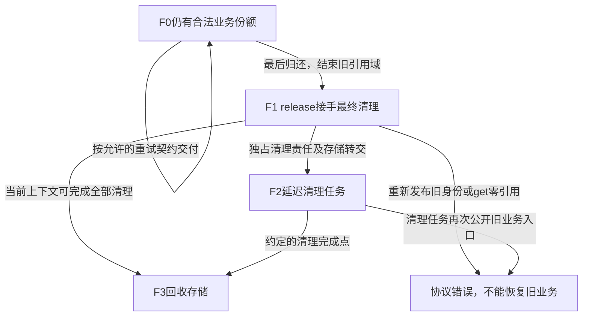
```mermaid
flowchart TD
    A[F0仍有合法业务份额] -->|按允许的重试契约交付| A
    A -->|最后归还，结束旧引用域| B[F1 release接手最终清理]
    B -->|当前上下文可完成全部清理| D[F3回收存储]
    B -->|独占清理责任及存储转交| C[F2延迟清理任务]
    C -->|约定的清理完成点| D
    B -->|重新发布旧身份或get零引用| X[协议错误，不能恢复旧业务]
    C -->|清理任务再次公开旧业务入口| X
```

排查时问：延迟任务持有的是哪一种责任，谁防止提前free，谁等待回调代码退出，是否还允许普通查找找到这个对象？仅看到schedule_work不能回答这些问题。反过来，也不能因为它在release中就一律判错。

------

### 12.5.2\_错误八\_release\_时对象仍挂在全局结构中

#### (1)\_错误现象

全局list/hash/XArray/IDR仍能返回对象地址，而存储已经回收，就留下悬空入口。但“进入release时还在索引里”和“free以后还在索引里”不是同一个条件：非拥有索引可以由最后清理者在锁内摘除，前提是查找与归零协议配套。必须先判断索引是否拥有份额，以及读者靠什么保持地址。

#### (2)\_正确模型\_A\_remove\_路径脱链

拥有型集合在发布时另持一份，或接管一份。正常情况下，成员还可见就有集合份额，因此应该由真实移除动作结束它，而不是指望计数先归零再进release摘链——集合那一份本来就会阻止归零。

完整链表服务的移除者自己也有一份，持表锁确认成员，关闭业务并摘链，在锁外只对实际移除归还集合份额。重复调用只在仍有效的参数上成立，且不能再次消费已经结束的集合份额。自己的参数份额再按调用约定另行归还。参见[P09完整链表服务](P09_kref_与锁的组合.md#9.6.1_一个完整的锁_+_kref_对象模板)。

若对象使用RCU，摘链以后旧读者仍可能保留节点地址，计数归零与真正回收还须按读区协议排序。不能因为“入口已经删了”就立即free，也不能把list_del_rcu换成会破坏旧前向遍历的节点初始化操作。完整对照见[P10撤下与延迟释放](P10_kref_与_RCU.md#10.4.3_list_del_rcu%28%29_kref_put%28%29_kfree_rcu%28%29_的职责边界)。

#### (3)\_正确模型\_B\_release\_中脱链

非拥有索引只保存地址，没有一份等着remove归还。若采用普通put，计数可能先归零，release再等索引锁：查找在锁内仍能见到未摘的节点，地址因清理者等待锁而暂时有效，但计数已为零。此时查找必须允许条件取得失败，并在释放索引锁以后才可能让清理继续。所有实际回收都要遵守这把锁的协议。

另一种完整设计是本仓库的[note_kref_locked.c](../../../../labs/kernel/object_lifetime/materials/note_kref_locked.c)：所有归还统一走kref_put_mutex，可能最后的减少在索引锁内重查，归零后直接把锁交给回调；回调清入口、解锁再free。因此锁内可见时仍为正，查找可普通get。回调已经持锁，不能再次mutex_lock同一把锁。固定路径见[最后归还模块](../../../../research/source_reading/kref/navigation/P04_最后归还与锁交接导读.md#4.2_把最后减少留在锁内)。

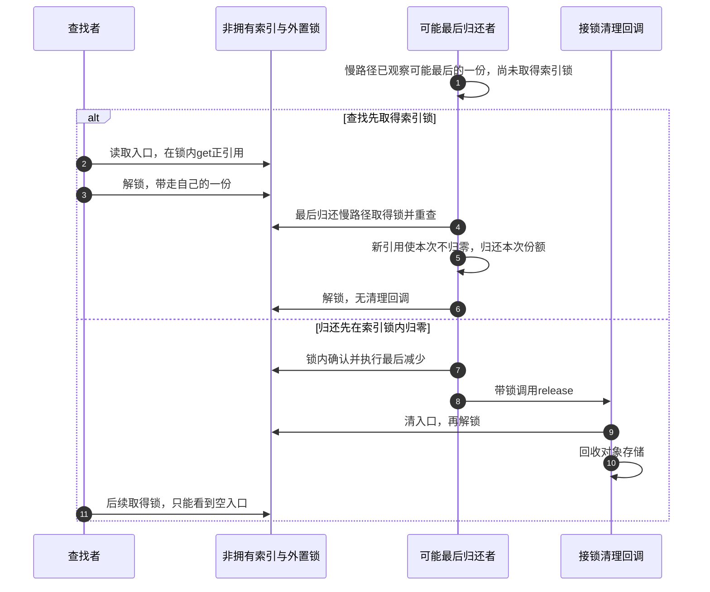
```mermaid
sequenceDiagram
    autonumber
    participant L as 查找者
    participant I as 非拥有索引与外置锁
    participant P as 可能最后归还者
    participant R as 接锁清理回调
    P->>P: 慢路径已观察可能最后的一份，尚未取得索引锁
    alt 查找先取得索引锁
        L->>I: 读取入口，在锁内get正引用
        L->>I: 解锁，带走自己的一份
        P->>I: 最后归还慢路径取得锁并重查
        P->>P: 新引用使本次不归零，归还本次份额
        P->>I: 解锁，无清理回调
    else 归还先在索引锁内归零
        P->>I: 锁内确认并执行最后减少
        P->>R: 带锁调用release
        R->>I: 清入口，再解锁
        R->>R: 回收对象存储
        L->>I: 后续取得锁，只能看到空入口
    end
```

图中限定已经进入可能最后的慢路径；如果一开始就能完成非最后减少，可以走不取得这把锁的快路径。两种非拥有索引方案都能成立，但不能拼成“查找普通get，最后归零在锁外，release再补锁”。这一拼法在查找拿到索引锁而计数已归零时失去正计数证明。源码导读中的等待后重查正是为处理这条交错，不是把锁作为装饰加在free附近。

#### (4)\_检查方式

先逐个登记真实可见入口：集合、文件私有数据、回调注册、待执行或正在执行的工作、定时器，以及RCU旧读者各由谁保证寿命。再检查最后清理之前的必要条件，不把不同容器都简化成一个list_empty判断。

`list_empty`是否有意义取决于节点协议：初始化并以list_del_init撤下的普通链表可以有自环不变量；RCU摘链需要保留旧读者前向路径，不能为让检查返回“空”就破坏它。XArray、IDR和哈希也应检查真实成员状态及对应同步，而不是先读一个失效对象字段再断言它不在集合。

同理，timer_pending/work_pending的瞬间结果不证明没有正在执行的回调。等待、取消返回条件、业务关门和引用责任都要对照已建立的协议。WARN正常继续时只提供诊断；若异常路径选择隔离或停止清理，应清楚记录状态与后续处理，不能把泄漏当成已经修好的正常退出。

练习：一个拥有型表一直保留其份额，却计划在最后release才把表项删除，会发生什么？在没有其他错误的前提下那一份使计数不能到零，release不会按计划到达。把表改为非拥有索引也不是单改一行get：必须同时重建首次取得窗口、归零与摘链锁、以及最终回收协议。

------

## 12.6\_并发与\_API\_误用\_kref\_不是锁\_也不是状态判断

前面已经解决份额如何取得、交付和退出。本节假定对象地址有合法保护，再检查引用之外的四个误用：并发字段更新、重置仍在使用的计数、拿快照代替取得，以及忽略条件取得失败。每一类都要指出原有保证到哪里结束，不能只说“加锁”或“检查一下”。

### 12.6.1\_错误九\_把\_kref\_当锁\_字段竞争仍然存在

#### (1)\_错误现象

两个线程各自持有对象份额，所以存储不会在它们使用期间回收；但它们同时执行 `obj->state++` 或 `obj->flags |= MY_FLAG`，仍可能产生数据竞争。引用操作修改的是ref中的计数地址，不是state和flags，也不把两个字段的更新合成一个事务。

如果一次业务要求“计数增加且标志同时置位”，单独保证每个地址的寿命远远不够。其他读者可能在两步之间观察，或两个写者各自基于旧值覆盖新值。出现这种错误时继续添加kref不会把写者排成先后顺序。

#### (2)\_并发时序

下图只展示一个可能观察到的丢更新过程，帮助定位缺失的同步；它不是对无同步C表达式所有编译和执行结果的保证。

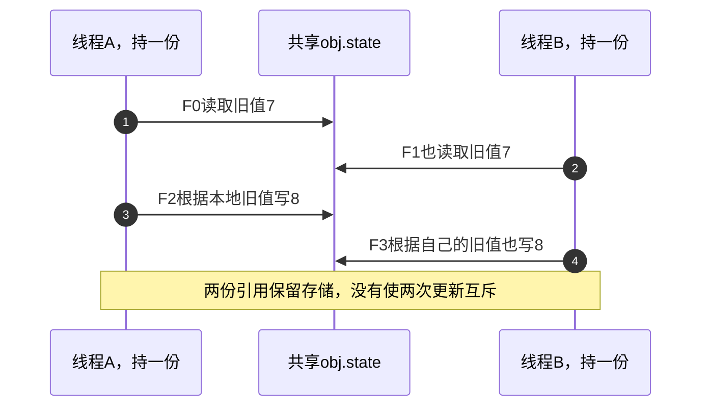
```mermaid
sequenceDiagram
    autonumber
    participant A as 线程A，持一份
    participant S as 共享obj.state
    participant B as 线程B，持一份
    A->>S: F0读取旧值7
    B->>S: F1也读取旧值7
    A->>S: F2根据本地旧值写8
    B->>S: F3根据自己的旧值也写8
    Note over A,B: 两份引用保留存储，没有使两次更新互斥
```

存储一直有效，因此没有UAF报告也不能排除这个错误。要审查的是所有写者、读者以及字段组合的约束，而不是只盯住最后release。

#### (3)\_正确写法

若协议要求互斥更新，所有参与者必须使用同一字段锁。下面是已持一份且处于适用上下文中的操作片段；锁种类仍须符合中断、抢占和实时配置边界。

```c
spin_lock(&obj->lock);
++obj->state;
obj->flags |= MY_FLAG;
spin_unlock(&obj->lock);
/* 当前引用在字段操作完成后按外层协议归还。 */
```

若仅维护独立计数，可选择相应原子操作；若维护独立状态位，可以考虑原子位操作。但 `set_bit` 不自动把另一个state字段与它一起提交。若读者需要同一时点的一组值，仍须组合锁、序列计数或已明确的发布协议，不能把每个字段各自原子就视为整体一致。

`READ_ONCE/WRITE_ONCE`用于标明特定单次访问约束，不使读改写互斥，也不自动提供跨字段发布和对象寿命。它们可能是正确无锁协议的一部分，却不能用来把未知数据竞争“标记成正确”。是否允许观察旧值、丢更新或不一致组合，要从字段语义证明。

#### (4)\_调试线索

KCSAN可能报告冲突访问，业务也可能表现为计数丢失、标志和状态不匹配，而引用数看起来正常。报告后先找发生冲突的两个访问及保护规则，再检查目标路径的插桩与覆盖。仅加忽略注解、改为READ_ONCE或重复运行直到没有告警，都不是正确性证明。

本章的诊断工具入口已经说明KCSAN采样边界；本节不新增真实并发测试。可回访P09完整对象锁服务，把引用保护外壳、锁保护字段、关闭门拒绝业务三项责任分别对应到代码。

------

### 12.6.2\_错误十\_重复\_kref\_init

#### (1)\_错误现象

对象已有两个拥有者时，再调用 `kref_init(&obj->ref)` 会把计数写成1；它不会询问已有使用者是否同意退出，也不通知它们手里的责任失效。随后其中一方put就可能触发release，另一方仍按旧协议使用对象。

```c
static void my_obj_reset_bad(struct my_obj *obj)
{
    kref_init(&obj->ref); /* 破坏仍存在的份额，不能用来重置业务。 */
    obj->state = 0;
}
```

即使重置和put没有同时执行，错误仍然成立：这是责任账本被覆盖，不只是一个竞争窗口。

#### (2)\_并发问题

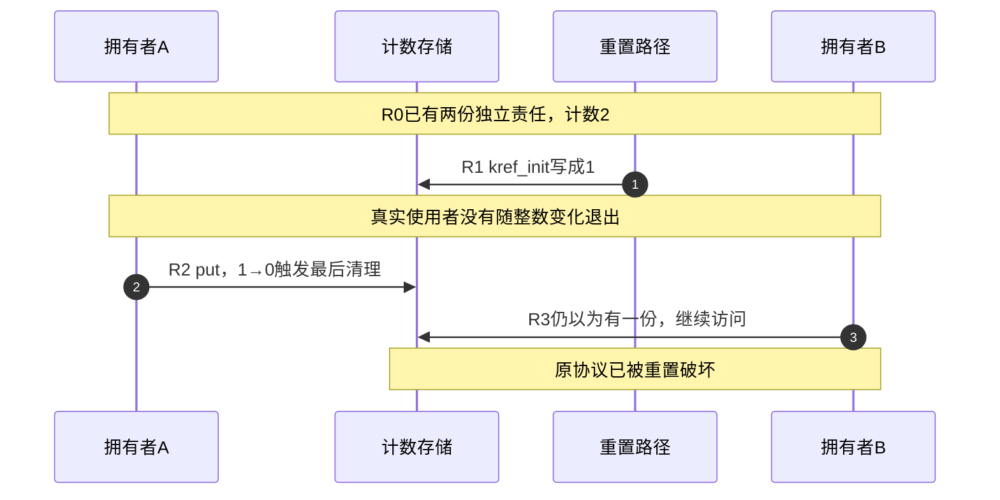
```mermaid
sequenceDiagram
    autonumber
    participant A as 拥有者A
    participant R as 计数存储
    participant X as 重置路径
    participant B as 拥有者B
    Note over A,B: R0已有两份独立责任，计数2
    X->>R: R1 kref_init写成1
    Note over A,B: 真实使用者没有随整数变化退出
    A->>R: R2 put，1→0触发最后清理
    B->>R: R3仍以为有一份，继续访问
    Note over B,R: 原协议已被重置破坏
```

本批用静态存储及固定普通kref函数验证2被重置为1后，第一次put就调用release且没有下溢告警；不实际释放内存或执行UAF。它说明API不会把“有人还在用”的外层事实存进一个隐藏账本。

#### (3)\_正确理解

业务reset应修改业务状态，按字段锁和关闭/重启协议执行；已经存在的引用关系继续按原规则归还。不能为恢复错误计数、清空队列或重新启动设备而直接init。

初始化属于一个新引用域建立的阶段，必须在新使用者可见以前完成。专门存储池可以在旧生命周期彻底结束、旧引用/借用/回调和身份均已脱离之后重用内存，届时是新对象的初始化，不是覆盖正在使用的计数。普通应用没有这套复用证明时，采用独立的新对象更容易检查。

调试发现计数不符合预期时，应追踪第一处责任偏离，而不是把计数设回“应该有的数”。重置会抹掉症状，却使以后每个拥有者的put更难解释。

------

### 12.6.3\_错误十一\_kref\_read\_用来判断能否访问对象

#### (1)\_错误代码

```c
if (kref_read(&obj->ref) > 0)
    do_something(obj); /* 读快照没有新增本路径的一份。 */
```

第一行也需要有效地址。如果obj已经失效，用kref_read“检查它是否活着”就在检查以前违反前提。即使读取时地址有效，结果为正也没有阻止别的拥有者马上归还最后一份。

#### (2)\_根因

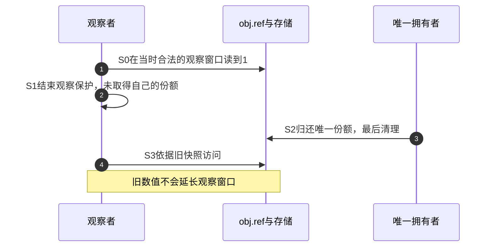
```mermaid
sequenceDiagram
    autonumber
    participant R as 观察者
    participant O as obj.ref与存储
    participant P as 唯一拥有者
    R->>O: S0在当时合法的观察窗口读到1
    R->>R: S1结束观察保护，未取得自己的份额
    P->>O: S2归还唯一份额，最后清理
    R->>O: S3依据旧快照访问
    Note over R,O: 旧数值不会延长观察窗口
```

读到1和条件增1不是同一种动作。后者在受保护地址上成功时确实增加责任；前者只复制一个瞬时数值到本地。先read再get也没有把两个动作合成一个不可分割的取得过程。

#### (3)\_正确用法

在合法存储期限内，计数快照可以用于调试、统计和验证明确的协议不变量。若某个优化判断另有完整串行化保证，其安全性来自那个外层协议，不能从“这次read是1”独立推出。尤其不能通过任意裸地址读取计数后决定自己是否有权进入业务。

长期使用须已拥有一份，或在有效的查找窗口里完成相应取得；有限借用则必须留在其被证明的期限内。日志在最后put以前读取需要的值，put以后只用独立副本。引用值也不能代替dying/closing或字段同步。

本批静态夹具保留一个读到1的本地快照，再归还唯一份额，验证release已发生而快照仍是1；该夹具只展示观察值不会更新，不证明真实失效地址仍可以读。

------

### 12.6.4\_错误十二\_kref\_get\_unless\_zero\_返回值不检查

#### (1)\_错误代码

```c
rcu_read_lock();
obj = my_obj_find_rcu(id);
if (obj)
    kref_get_unless_zero(&obj->ref); /* 错误：忽略是否真正取得。 */
rcu_read_unlock();
return obj; /* 可能返回一份从未建立责任的地址。 */
```

这里假定对应RCU发布和回收协议已经保证读区内地址有效；没有这个前提，问题会更早发生。固定接口标记了必须检查的返回值，编译器可能诊断忽略返回，但有没有警告不能替代代码契约。

#### (2)\_根因

零值失败时，函数没有新增引用。旧RCU读者仍可能暂时访问必要节点字段，不等于它能把这个地址当作拥有型结果带出读区。如果失败以后仍返回obj，调用者可能访问已回收存储，或最后put一份从未取得的责任。

失败也不是一个需要put回滚的“半份”：它没有交付份额，不能再put。成功才新增一份，并要求调用者在结束时归还。固定文档和[有效地址上的条件取得](../../../../research/source_reading/kref/source_explanations/include/linux/kref.h.md#1.7_有效地址上的条件取得)都以这个返回契约为边界。

#### (3)\_正确写法

把失败转换为空结果，并在保护结束以前完成判断：

```c
rcu_read_lock();
obj = my_obj_find_rcu(id);
if (obj && !kref_get_unless_zero(&obj->ref))
    obj = NULL;
rcu_read_unlock();
return obj; /* 非空才交付一份，仍不承诺业务一直开放。 */
```

若还需通过mutex检查dying，先取得、离开普通RCU读区，再等待对象锁。已有P10可选包装按这个顺序实现：`object_lookup`返回拥有型结果，随后锁内检查，拒绝时在锁外归还本次份额。具体片段见[P10提前过滤](P10_kref_与_RCU.md#10.3.4_加入_dying_状态后的_lookup_模板)，完整基础模块也在那里。

不能在普通RCU读区内调用可能睡眠的 `my_obj_is_dying` 或未经审查的release回滚；反过来，未取得份额就退出读区再等对象mutex，又可能连锁本身都失去存储保证。业务检查通过也只说明那个时点开放，真正执行请求时仍须按同一关闭协议判断。

本批用固定条件取得函数检查有效静态地址上的零值失败与正值成功，分别确认没有新增责任和必须配对归还；没有模拟真实RCU或并发比较交换重试。与重置、快照两组一起，它们强调同一件事：状态读数、错误提示和函数返回值都必须放回自己的契约解释。

------

## 12.7\_remove\_上下文和辅助\_API\_引用之外还有收尾协议

### 12.7.1\_错误十三\_remove\_后已有引用没有\_drain

#### (1)\_错误现象

remove 路径常见错误是：

```text
从全局表删除对象；
停止硬件；
释放底层资源；
但是已有引用仍然可能进入业务路径；
旧用户继续访问已经停掉的硬件或资源。
```

这类 bug 不是纯 kref bug。

它是：

```text
生命周期存在；
但业务资源已经撤销。
```

#### (2)\_错误代码

```c
static void my_obj_remove_bad(struct my_obj *obj)
{
	mutex_lock(&my_obj_list_lock);
	list_del_init(&obj->node);
	mutex_unlock(&my_obj_list_lock);

	hw_shutdown(obj->hw);
	kfree(obj->buffer);

	kref_put(&obj->ref, my_obj_release);
}
```

如果已有用户还持有引用：

```c
do_io(obj);
```

那么 `obj` 本体还活着，但 `obj->hw` 或 `obj->buffer` 可能已经不可用。

#### (3)\_正确模型

remove 应该分阶段：

```text
1. 设置 dying，阻止新用户进入。
2. 从 lookup 结构中取消发布。
3. 停止新请求提交。
4. drain 已有请求 / work / timer / callback。
5. 撤销硬件或底层资源。
6. put 发布引用。
7. 最后 release 释放对象本体。
```

流程图：

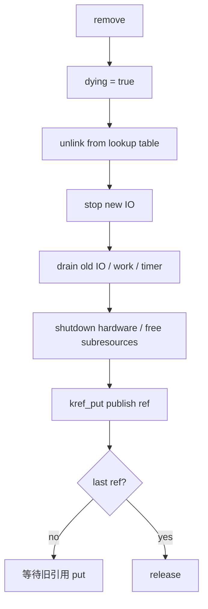
```mermaid
flowchart TD
    A["remove"] --> B["dying = true"]
    B --> C["unlink from lookup table"]
    C --> D["stop new IO"]
    D --> E["drain old IO / work / timer"]
    E --> F["shutdown hardware / free subresources"]
    F --> G["kref_put publish ref"]
    G --> H{"last ref?"}
    H -- "no" --> I["等待旧引用 put"]
    H -- "yes" --> J["release"]
```

#### (4)\_核心区别

```text
kref 保护 obj 内存；
不保护 obj 背后的硬件仍然可用；
不保护 obj->buffer 仍然可用；
不保证 remove 后旧用户还能做完整业务操作。
```

所以 remove 后旧引用应该看到：

```text
-ENODEV；
-EIO；
dying 状态；
closed 状态；
stopped 状态；
```

而不是继续正常操作。

------

### 12.7.2\_错误十四\_release\_中睡眠上下文不清

#### (1)\_问题

`kref_put()` 可能在很多上下文被调用：

```text
进程上下文；
spinlock 持锁上下文；
中断上下文；
timer 回调；
workqueue；
RCU callback；
错误路径。
```

最后一个 `kref_put()` 会直接调用 release。

所以 release 能不能睡眠，取决于：

```text
最后一个 put 可能发生在哪里。
```

#### (2)\_错误代码

```c
static void my_obj_release_bad(struct kref *ref)
{
	struct my_obj *obj = container_of(ref, struct my_obj, ref);

	mutex_lock(&global_mutex);   /* 可能睡眠 */
	...
	mutex_unlock(&global_mutex);

	kfree(obj);
}
```

如果最后一个 put 发生在不能睡眠的上下文，这就有问题。

#### (3)\_解决方式

方式一：保证最后 put 只发生在可睡眠上下文。

```text
所有 kref_put 路径都必须审计。
```

方式二：release 不做睡眠操作，把复杂释放转给 workqueue。

```c
static void my_obj_release(struct kref *ref)
{
	struct my_obj *obj = container_of(ref, struct my_obj, ref);

	INIT_WORK(&obj->release_work, my_obj_release_workfn);
	schedule_work(&obj->release_work);
}

static void my_obj_release_workfn(struct work_struct *work)
{
	struct my_obj *obj = container_of(work, struct my_obj, release_work);

	mutex_lock(&global_mutex);
	...
	mutex_unlock(&global_mutex);

	kfree(obj);
}
```

但这种写法要非常小心：

```text
release_work 本身嵌在 obj 里；
obj 不能在 work 执行前释放；
真正 kfree 必须在 release_workfn 末尾。
```

方式三：使用 RCU 延迟释放。

```c
static void my_obj_release(struct kref *ref)
{
	struct my_obj *obj = container_of(ref, struct my_obj, ref);

	kfree_rcu(obj, rcu);
}
```

#### (4)\_检查规则

release 里如果有下面动作，要审计上下文：

```text
mutex_lock；
msleep；
wait_for_completion；
flush_work；
cancel_work_sync；
synchronize_rcu；
可能阻塞的 IO；
可能递归触发 put 的操作。
```

------

### 12.7.3\_错误十五\_kref\_put\_lock\_/\_kref\_put\_mutex\_使用误解

#### (1)\_问题

`kref_put_lock()` 和 `kref_put_mutex()` 不是“自动解决所有锁问题”的 API。

它们解决的是一类特殊问题：

```text
最后一个 put 时，需要在持锁状态下执行 release 相关动作；
但又希望避免普通 put 路径都手写锁组合。
```

#### (2)\_常见误解

错误理解：

```text
用了 kref_put_lock，就不需要设计 remove/unlink 顺序了。
```

错误。

它仍然要求你知道：

```text
release 里会做什么；
锁保护什么；
最后 put 时能不能持这个锁；
release 会不会再次拿同一把锁；
是否有死锁风险；
是否允许睡眠。
```

#### (3)\_错误示例

```c
static void my_obj_release(struct kref *ref)
{
	struct my_obj *obj = container_of(ref, struct my_obj, ref);

	spin_lock(&my_lock);       /* 错误：可能和 kref_put_lock 外层锁重复 */
	list_del(&obj->node);
	spin_unlock(&my_lock);

	kfree(obj);
}

kref_put_lock(&obj->ref, my_obj_release, &my_lock);
```

如果 `kref_put_lock()` 已经在最后释放路径持有 `my_lock` 调用 release，而 release 里再次加同一把锁，就可能死锁。

#### (4)\_检查规则

使用这些 API 前必须回答：

```text
1. 这把锁保护的是集合还是字段？
2. release 是否会拿同一把锁？
3. release 是否会调用可能睡眠的函数？
4. 最后 put 是否可能发生在中断上下文？
5. 是否有更清晰的 remove 先 unlink、release 只 kfree 模型？
```

如果答不清楚，优先使用普通结构：

```text
remove 路径持锁 unlink；
kref_put 只负责释放引用；
release 只做最终释放。
```

------

## 12.8\_driver\_core\_层次错误\_device\_引用和私有\_kref

### 12.8.1\_错误十六\_device\_对象上手动操作内部\_kref

#### (1)\_错误代码

```c
kref_get(&dev->kobj.kref);     /* 不推荐 / 错误层次 */
kref_put(&dev->kobj.kref, ...);
```

#### (2)\_根因

`struct device` 是 driver core 对象。

它的生命周期应该通过 driver core API 参与：

```c
get_device(dev);
put_device(dev);
```

而不是手动操作内部 kobject/kref。

第 11 章已经讲过：

```text
device 不是裸 kref 的 my_obj；
device 是 driver core 的类型化对象。
```

#### (3)\_正确写法

```c
struct device *dev2;

dev2 = get_device(dev);
if (!dev2)
	return -ENODEV;

/* 使用 dev */

put_device(dev2);
```

#### (4)\_调试线索

如果你在代码里看到：

```text
dev->kobj
dev->kobj.kref
kobject_get(&dev->kobj)
```

就要问：

```text
为什么不用 get_device/put_device？
是不是层次错了？
是不是把 driver core 对象当成裸 kref 对象？
```

------

### 12.8.2\_错误十七\_私有\_kref\_和\_device\_引用混用

#### (1)\_错误模型

```c
struct my_dev {
	struct device dev;
	struct kref ref;
	bool dying;
};
```

错误理解：

```text
我 get 了 my_dev->ref，所以 dev 一定安全。
```

或者反过来：

```text
我 get_device(&mdev->dev)，所以 my_dev 私有业务状态一定可用。
```

这两个都不一定成立。

#### (2)\_正确分层

```text
get_device/put_device：
    保护 struct device 生命周期。

kref_get/kref_put：
    保护私有业务对象生命周期。

dying/state：
    保护业务是否允许继续进入。

mutex/spinlock：
    保护字段和集合关系。
```

图示：

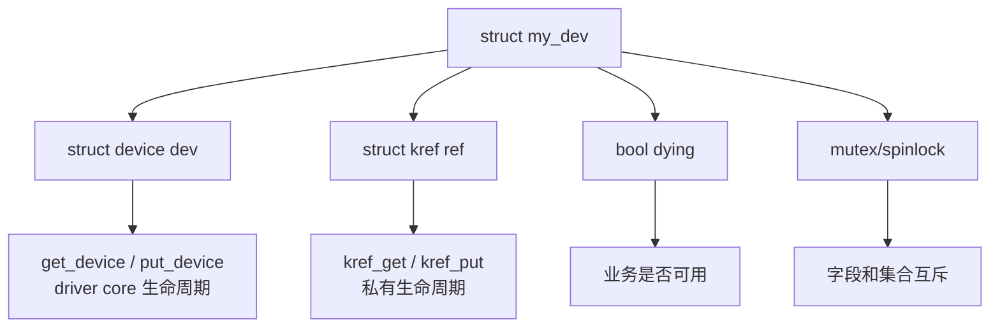
```mermaid
flowchart TD
    A["struct my_dev"] --> B["struct device dev"]
    A --> C["struct kref ref"]
    A --> D["bool dying"]
    A --> E["mutex/spinlock"]

    B --> B1["get_device / put_device<br/>driver core 生命周期"]
    C --> C1["kref_get / kref_put<br/>私有生命周期"]
    D --> D1["业务是否可用"]
    E --> E1["字段和集合互斥"]
```

#### (3)\_检查规则

如果一个对象里同时有：

```text
struct device；
struct kref；
struct mutex；
bool dying；
list_head；
```

必须写两张表：

```text
device 引用表；
私有 kref 引用表。
```

不要混成一句：

```text
这个对象有引用。
```

------

## 12.9\_调试方法\_从所有权表到\_release\_断言

### 12.9.1\_调试方法一\_写引用所有权表

遇到 kref bug，第一步不是看代码细节，而是写表。

例如：

```c
struct my_request {
	struct kref ref;
	struct list_head node;
	struct work_struct timeout_work;
	struct completion done;
};
```

引用表：

| 持有者            | 获得引用         | 释放引用                       | 备注            |
| ----------------- | ---------------- | ------------------------------ | --------------- |
| 创建者            | `kref_init()`    | submit 成功 handoff 或失败路径 | 初始引用        |
| 队列              | enqueue 成功     | dequeue                        | 保护队列中对象  |
| timeout work      | schedule 成功    | workfn 结束                    | 异步路径        |
| completion waiter | lookup 成功      | wait 结束                      | 用户等待路径    |
| 硬件完成路径      | 从队列取出并 get | 完成处理后                     | 中断/线程上下文 |

然后逐行检查：

```text
每个 get 是否有 put？
每个 put 是否只对应一份引用？
handoff 成功失败是否清楚？
remove 时是否阻止新 get？
release 前是否脱链？
```

引用表比盯着 `refcount++` 更有用。

------

### 12.9.2\_调试方法二\_给\_get/put\_加原因标签

正式代码中通常不这么写，但调试时非常有用。

```c
static void my_obj_get_dbg(struct my_obj *obj, const char *why)
{
	pr_debug("GET obj=%p why=%s caller=%pS\n",
		 obj, why, __builtin_return_address(0));

	kref_get(&obj->ref);
}

static void my_obj_put_dbg(struct my_obj *obj, const char *why)
{
	pr_debug("PUT obj=%p why=%s caller=%pS\n",
		 obj, why, __builtin_return_address(0));

	kref_put(&obj->ref, my_obj_release);
}
```

调用：

```c
my_obj_get_dbg(obj, "open");
my_obj_put_dbg(obj, "file release");

my_obj_get_dbg(obj, "queue");
my_obj_put_dbg(obj, "dequeue");

my_obj_get_dbg(obj, "work");
my_obj_put_dbg(obj, "work done");
```

日志目标不是证明“计数对了”，而是看：

```text
哪条路径 get 了但没 put；
哪条路径 put 了但没 get；
release 发生在什么调用栈；
release 是否早于异步回调；
remove 后是否还有新 get。
```

------

### 12.9.3\_调试方法三\_在\_release\_中加断言

release 是最后防线。

可以加一些临时断言。

```c
static void my_obj_release(struct kref *ref)
{
	struct my_obj *obj = container_of(ref, struct my_obj, ref);

	WARN_ON(!list_empty(&obj->node));
	WARN_ON(timer_pending(&obj->timer));
	WARN_ON(work_pending(&obj->work));
	WARN_ON(!obj->dying);

	kfree(obj);
}
```

这些断言的意义是：

```text
release 时对象不应该还挂在 list 中；
release 时 timer 不应该还 pending；
release 时 work 不应该还 pending；
release 时对象应该已经进入 dying/remove 流程。
```

注意：

```text
断言必须符合你的对象模型；
不要机械照抄。
```

例如，有些对象是正常自然释放，不一定有 `dying`。

------

### 12.9.4\_调试方法四\_区分三类\_还活着

排查时要把“活着”拆成三类。

| 问题                 | 由谁回答                    |
| -------------------- | --------------------------- |
| 内存还没释放吗？     | kref / RCU / allocator 状态 |
| 生命周期还没结束吗？ | kref 是否持有成功           |
| 业务还可用吗？       | state / dying / remove 状态 |

错误说法：

```text
obj 还活着，所以可以用。
```

正确说法：

```text
obj 内存还在，不等于生命周期有效；
生命周期有效，不等于业务可用；
业务可用，也不等于字段访问不需要锁。
```

图示：

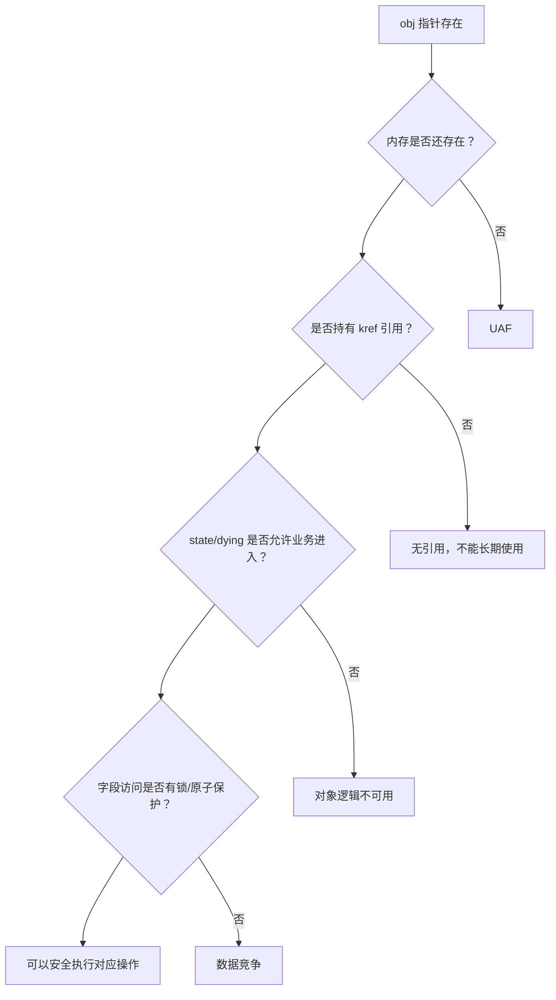
```mermaid
flowchart TD
    A["obj 指针存在"] --> B{"内存是否还存在？"}
    B --> C{"是否持有 kref 引用？"}
    C --> D{"state/dying 是否允许业务进入？"}
    D --> E{"字段访问是否有锁/原子保护？"}
    E --> F["可以安全执行对应操作"]

    B -- "否" --> X1["UAF"]
    C -- "否" --> X2["无引用，不能长期使用"]
    D -- "否" --> X3["对象逻辑不可用"]
    E -- "否" --> X4["数据竞争"]
```

------

## 12.10\_汇总审查\_总表\_流程和小结

### 12.10.1\_本章错误模式总表

| 错误模式                     | 典型后果                 | 主要修复                           |
| ---------------------------- | ------------------------ | ---------------------------------- |
| 少 get                       | 异步 UAF                 | 投递/保存长期指针前 get            |
| 少 put                       | 泄漏                     | 所有权表补 put                     |
| 多 put                       | 提前 release / underflow | 一份引用只 put 一次                |
| put 后访问                   | UAF                      | put 前保存需要字段                 |
| lookup 后裸 get              | 悬挂指针 / 复活对象      | 锁内 get 或 RCU 内 get_unless_zero |
| get_unless_zero 不检查返回值 | 返回无引用对象           | 必须检查 false                     |
| handoff 归属不清             | 漏 put / 多 put          | 函数名和注释写清 take/get/borrow   |
| release 重新发布             | 对象复活                 | release 只做销毁                   |
| release 未脱链               | 全局悬挂指针             | remove 或 release 中明确 unlink    |
| kref 当锁                    | 字段竞争                 | 字段用锁/原子/状态机               |
| 重复 kref_init               | 破坏引用关系             | 只在新对象初始化时 init            |
| kref_read 判断有效           | UAF                      | 用真正 get 取得引用                |
| remove 不 drain              | 旧用户访问已撤销资源     | dying + unlink + drain + shutdown  |
| release 睡眠上下文不清       | 原子上下文睡眠 / 死锁    | 审计最后 put 上下文                |
| 手动操作 device 内部 kref    | driver core 生命周期错乱 | 使用 get_device/put_device         |
| 私有 kref 和 device 引用混用 | 层次错乱                 | 分两张引用表                       |

------

### 12.10.2\_最小审查流程

看到一段 kref 代码，可以按这个顺序审查：

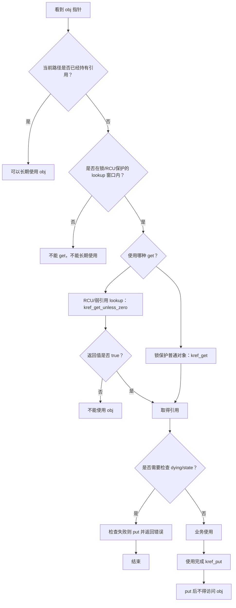
```mermaid
flowchart TD
    A["看到 obj 指针"] --> B{"当前路径是否已经持有引用？"}
    B -- "是" --> C["可以长期使用 obj"]
    B -- "否" --> D{"是否在锁/RCU保护的 lookup 窗口内？"}

    D -- "否" --> E["不能 get，不能长期使用"]
    D -- "是" --> F{"使用哪种 get？"}

    F --> G["锁保护普通对象：kref_get"]
    F --> H["RCU/弱引用 lookup：kref_get_unless_zero"]

    H --> I{"返回值是否 true？"}
    I -- "否" --> J["不能使用 obj"]
    I -- "是" --> K["取得引用"]

    G --> K
    K --> L{"是否需要检查 dying/state？"}
    L -- "是" --> M["检查失败则 put 并返回错误"]
    L -- "否" --> N["业务使用"]

    M --> O["结束"]
    N --> P["使用完成 kref_put"]
    P --> Q["put 后不得访问 obj"]
```

这个流程可以变成代码审查清单：

```text
1. 指针从哪里来？
2. 当前路径有没有引用？
3. 如果没有引用，get 前靠什么证明对象有效？
4. get 是否可能失败？
5. 失败后是否还访问对象？
6. 成功后是否检查对象状态？
7. 使用完是否 put？
8. put 后是否还有访问？
9. release 是否只执行最终销毁？
10. 对象是否从集合中正确脱链？
```

------

### 12.10.3\_本章小结

本章不是新增规则，而是把前面规则转成错误清单。

kref bug 的本质通常不是：

```text
refcount++ 写少了；
refcount-- 写多了。
```

而是：

```text
引用归属没有定义；
handoff 成功失败没有定义；
lookup 到 get 的窗口没有保护；
remove 和 release 的边界没有拆开；
对象生命周期和业务可用性混在一起；
私有 kref 和 driver core 对象层次混在一起。
```

最重要的排查方法是：

```text
不要先盯着计数值；
先画所有权表。
```

最终检查句：

```text
谁持有对象？
谁负责 get？
谁负责 put？
谁能 lookup？
get 前由什么保护？
put 后是否还访问？
release 前是否已经不可见？
release 后内存什么时候真正释放？
```

一句话总结：

```text
kref 错误不是计数器错误，而是对象所有权协议错误。
```

------

专题导航：[kref 引用计数机制章节大纲](大纲.md)。

上一篇：[kref、refcount_t 与 kobject 的边界](P11_kref_refcount_t_kobject_的边界.md#11.10_本章小结)。

下一篇：[工程模板](P13_工程模板.md)。
