# 第13章_工程模板

## 13.1_本章导读_把规则落成可复制模板

前面章节已经把规则、API、handoff、lookup、锁、RCU、错误模式都讲过了。

本章不再继续解释原理，而是把常见写法整理成工程模板。

本章目标是：

```text
把 kref 生命周期规则落成可复制代码结构。
```

本章重点不是：

```text
为什么要 get？
为什么要 put？
为什么 lookup 要保护？
为什么 release 是销毁点？
```

这些前面已经讲过。

本章重点是：

```text
对象怎么定义？
alloc/init 怎么写？
get/put 包装函数怎么写？
lookup 怎么写？
handoff 怎么写？
remove 怎么写？
release 怎么写？
错误路径怎么回滚？
RCU 模板怎么组合？
```

本章所有模板默认适用于：

```text
裸 kref 私有对象；
驱动内部对象；
子系统私有对象；
request/session/context/job/buffer 等自定义生命周期对象。
```

不适用于直接管理：

```text
struct device
struct class
struct bus_type
struct kobject
```

这些对象应该使用对应框架 API，例如：

```c
get_device();
put_device();
kobject_get();
kobject_put();
device_register();
device_unregister();
```

本章主线：

```text
先定义对象所有权；
再写 get/put；
再写 lookup；
再写 handoff；
最后写 remove/release。
```

整体结构：

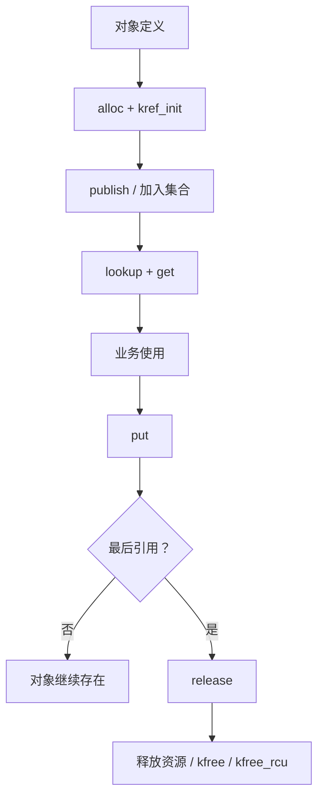

------

## 13.2_模板命名约定

为了让所有权更清楚，本章建议使用固定命名：

```text
xxx_alloc()
    分配并初始化对象，返回初始引用。

xxx_get()
    当前路径已经证明对象有效，增加引用。

xxx_get_unless_zero()
    弱引用/RCU 场景下尝试取得引用。

xxx_put()
    释放当前路径持有的引用。

xxx_release()
    最后一个 put 触发的销毁函数。

xxx_lookup_get()
    从集合中查找对象，并返回一个已持有引用的对象。

xxx_publish()
    把对象发布到全局集合，让 lookup 能找到。

xxx_unpublish()
    从全局集合取消发布，让新 lookup 找不到。

xxx_remove()
    进入删除流程，阻止新用户进入，释放发布引用。

xxx_enqueue_get()
    队列额外持有一个引用。

xxx_enqueue_take()
    队列接管调用者当前引用。
```

命名重点不是好看，而是表达引用归属。

例如：

```text
get:
    新增一份引用。

take:
    接管调用者当前引用。

borrow:
    临时借用，不长期保存。

put:
    释放一份引用。

release:
    最后一份引用释放后的销毁点。
```

建议不要使用语义模糊的名字：

```c
submit_obj(obj);
queue_obj(obj);
save_obj(obj);
set_obj(obj);
```

这些名字看不出引用归谁。

更推荐：

```c
my_obj_submit_get(obj);
my_obj_submit_take(obj);
my_obj_queue_get(obj);
my_obj_queue_take(obj);
my_obj_set_borrow(obj);
```

------

## 13.3_基础对象模板_alloc_init_get_put_release

### 13.3.1_模板一_最小_kref_对象模板

这是最小对象。

```c
#include <linux/kref.h>
#include <linux/slab.h>

struct my_obj {
	struct kref ref;

	int id;
	void *priv;
};
```

release：

```c
static void my_obj_release(struct kref *ref)
{
	struct my_obj *obj = container_of(ref, struct my_obj, ref);

	kfree(obj);
}
```

alloc：

```c
static struct my_obj *my_obj_alloc(int id)
{
	struct my_obj *obj;

	obj = kzalloc(sizeof(*obj), GFP_KERNEL);
	if (!obj)
		return NULL;

	kref_init(&obj->ref);

	obj->id = id;

	return obj;
}
```

get：

```c
static struct my_obj *my_obj_get(struct my_obj *obj)
{
	kref_get(&obj->ref);
	return obj;
}
```

put：

```c
static void my_obj_put(struct my_obj *obj)
{
	kref_put(&obj->ref, my_obj_release);
}
```

使用：

```c
struct my_obj *obj;

obj = my_obj_alloc(1);
if (!obj)
	return -ENOMEM;

/*
 * obj 初始引用归当前路径。
 */

do_something(obj);

my_obj_put(obj);
```

这个模板的所有权表：

| 持有者   | get 来源       | put 位置       |
| -------- | -------------- | -------------- |
| 创建者   | `kref_init()`  | 使用结束       |
| 额外用户 | `my_obj_get()` | `my_obj_put()` |

这个模板只适合：

```text
没有全局 lookup；
没有异步 handoff；
没有并发集合；
没有 RCU；
没有复杂 remove。
```

------

### 13.3.2_模板二_alloc/init/get/put/release_分层模板

实际工程里，不建议把所有初始化都塞进 alloc。

更常见的是：

```text
alloc:
    分配内存，初始化基础字段，kref_init。

init:
    初始化复杂资源。

publish:
    加入集合，让其他路径可见。

remove:
    取消发布，释放初始引用。

release:
    最后销毁。
```

对象：

```c
struct my_obj {
	struct kref ref;

	struct mutex lock;
	bool dying;

	int id;
	void *buffer;
};
```

release：

```c
static void my_obj_release(struct kref *ref)
{
	struct my_obj *obj = container_of(ref, struct my_obj, ref);

	kfree(obj->buffer);
	kfree(obj);
}
```

alloc：

```c
static struct my_obj *my_obj_alloc(int id)
{
	struct my_obj *obj;

	obj = kzalloc(sizeof(*obj), GFP_KERNEL);
	if (!obj)
		return NULL;

	kref_init(&obj->ref);
	mutex_init(&obj->lock);

	obj->id = id;
	obj->dying = false;

	return obj;
}
```

init：

```c
static int my_obj_init(struct my_obj *obj)
{
	obj->buffer = kzalloc(4096, GFP_KERNEL);
	if (!obj->buffer)
		return -ENOMEM;

	return 0;
}
```

put：

```c
static void my_obj_put(struct my_obj *obj)
{
	kref_put(&obj->ref, my_obj_release);
}
```

创建完整流程：

```c
static struct my_obj *my_obj_create(int id)
{
	struct my_obj *obj;
	int ret;

	obj = my_obj_alloc(id);
	if (!obj)
		return ERR_PTR(-ENOMEM);

	ret = my_obj_init(obj);
	if (ret)
		goto err_put;

	return obj;

err_put:
	my_obj_put(obj);
	return ERR_PTR(ret);
}
```

这里的语义是：

```text
my_obj_alloc 成功后，当前路径持有初始引用。
my_obj_init 失败时，必须 put 初始引用。
my_obj_create 成功返回时，调用者持有初始引用。
```

流程图：

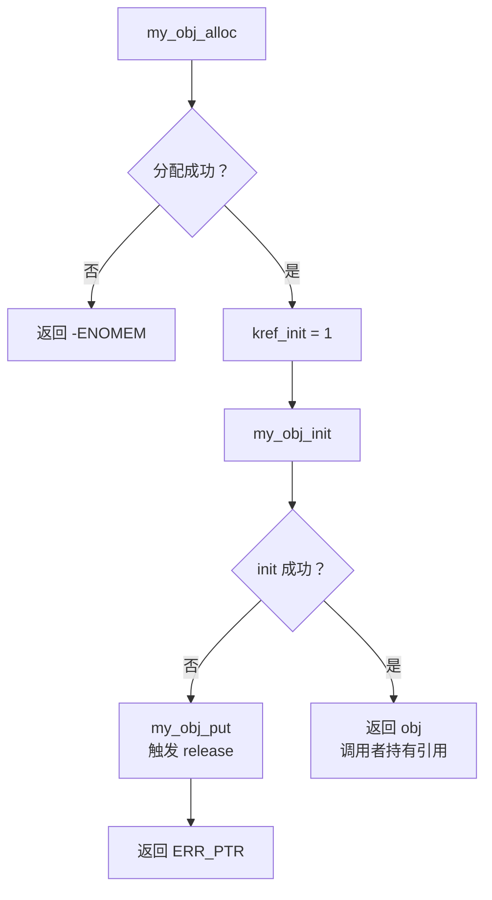

------

## 13.4_lookup_集合模板_list_hash_xarray

### 13.4.1_模板三_list_+_mutex_+_kref_lookup_模板

这是最常见的非 RCU 模型。

对象：

```c
struct my_obj {
	struct kref ref;
	struct list_head node;

	struct mutex lock;
	bool dying;

	int id;
};

static LIST_HEAD(my_obj_list);
static DEFINE_MUTEX(my_obj_list_lock);
```

release：

```c
static void my_obj_release(struct kref *ref)
{
	struct my_obj *obj = container_of(ref, struct my_obj, ref);

	WARN_ON(!list_empty(&obj->node));

	kfree(obj);
}
```

alloc：

```c
static struct my_obj *my_obj_alloc(int id)
{
	struct my_obj *obj;

	obj = kzalloc(sizeof(*obj), GFP_KERNEL);
	if (!obj)
		return NULL;

	kref_init(&obj->ref);
	INIT_LIST_HEAD(&obj->node);
	mutex_init(&obj->lock);

	obj->id = id;
	obj->dying = false;

	return obj;
}
```

publish：

```c
static void my_obj_publish(struct my_obj *obj)
{
	mutex_lock(&my_obj_list_lock);
	list_add_tail(&obj->node, &my_obj_list);
	mutex_unlock(&my_obj_list_lock);
}
```

lookup + get：

```c
static struct my_obj *my_obj_lookup_get(int id)
{
	struct my_obj *obj;

	mutex_lock(&my_obj_list_lock);

	list_for_each_entry(obj, &my_obj_list, node) {
		if (obj->id != id)
			continue;

		kref_get(&obj->ref);
		mutex_unlock(&my_obj_list_lock);

		return obj;
	}

	mutex_unlock(&my_obj_list_lock);
	return NULL;
}
```

如果 remove 后要禁止新用户进入，需要加入 `dying` 检查。

```c
static struct my_obj *my_obj_lookup_get_live(int id)
{
	struct my_obj *obj;

	mutex_lock(&my_obj_list_lock);

	list_for_each_entry(obj, &my_obj_list, node) {
		if (obj->id != id)
			continue;

		mutex_lock(&obj->lock);
		if (obj->dying) {
			mutex_unlock(&obj->lock);
			mutex_unlock(&my_obj_list_lock);
			return NULL;
		}

		kref_get(&obj->ref);

		mutex_unlock(&obj->lock);
		mutex_unlock(&my_obj_list_lock);

		return obj;
	}

	mutex_unlock(&my_obj_list_lock);
	return NULL;
}
```

使用：

```c
static int my_obj_use_by_id(int id)
{
	struct my_obj *obj;
	int ret;

	obj = my_obj_lookup_get_live(id);
	if (!obj)
		return -ENOENT;

	ret = do_something(obj);

	my_obj_put(obj);
	return ret;
}
```

remove：

```c
static void my_obj_remove(struct my_obj *obj)
{
	mutex_lock(&my_obj_list_lock);

	mutex_lock(&obj->lock);
	obj->dying = true;
	mutex_unlock(&obj->lock);

	list_del_init(&obj->node);

	mutex_unlock(&my_obj_list_lock);

	my_obj_put(obj);
}
```

生命周期图：

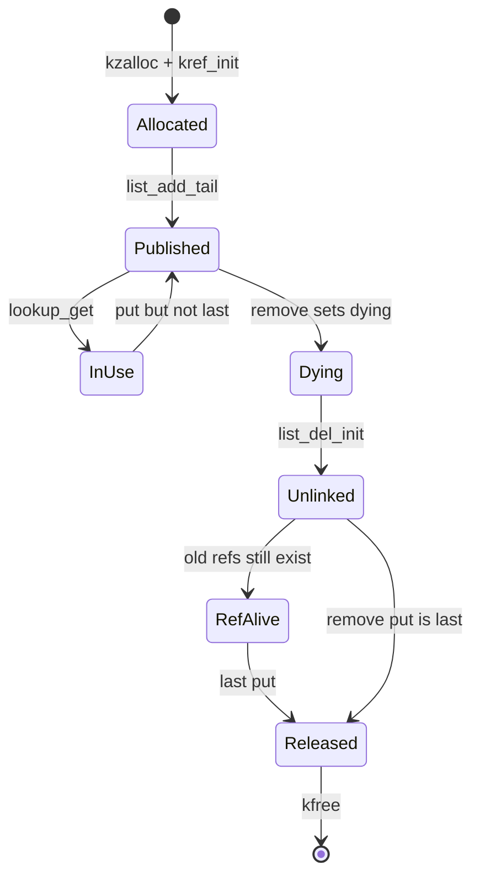

关键规则：

```text
list_lock 保护集合关系；
obj->lock 保护 dying/state；
kref 保护离开锁后的对象生命周期；
release 只在对象已经脱链后 kfree。
```

------

### 13.4.2_模板四_hash/list_+_spinlock_+_kref_lookup_模板

如果对象在原子上下文或中断相关路径使用，可能需要 `spinlock_t`。

对象：

```c
#define MY_OBJ_HASH_BITS 6
#define MY_OBJ_HASH_SIZE (1 << MY_OBJ_HASH_BITS)

struct my_obj {
	struct kref ref;
	struct hlist_node node;

	spinlock_t lock;
	bool dying;

	u32 id;
};

static struct hlist_head my_obj_table[MY_OBJ_HASH_SIZE];
static DEFINE_SPINLOCK(my_obj_table_lock);
```

初始化 hash table：

```c
static void my_obj_table_init(void)
{
	int i;

	for (i = 0; i < MY_OBJ_HASH_SIZE; i++)
		INIT_HLIST_HEAD(&my_obj_table[i]);
}
```

hash 函数：

```c
static unsigned int my_obj_hash(u32 id)
{
	return hash_32(id, MY_OBJ_HASH_BITS);
}
```

publish：

```c
static void my_obj_publish(struct my_obj *obj)
{
	unsigned long flags;
	unsigned int h = my_obj_hash(obj->id);

	spin_lock_irqsave(&my_obj_table_lock, flags);
	hlist_add_head(&obj->node, &my_obj_table[h]);
	spin_unlock_irqrestore(&my_obj_table_lock, flags);
}
```

lookup + get：

```c
static struct my_obj *my_obj_lookup_get(u32 id)
{
	struct my_obj *obj;
	unsigned long flags;
	unsigned int h = my_obj_hash(id);

	spin_lock_irqsave(&my_obj_table_lock, flags);

	hlist_for_each_entry(obj, &my_obj_table[h], node) {
		if (obj->id != id)
			continue;

		spin_lock(&obj->lock);
		if (obj->dying) {
			spin_unlock(&obj->lock);
			spin_unlock_irqrestore(&my_obj_table_lock, flags);
			return NULL;
		}

		kref_get(&obj->ref);

		spin_unlock(&obj->lock);
		spin_unlock_irqrestore(&my_obj_table_lock, flags);

		return obj;
	}

	spin_unlock_irqrestore(&my_obj_table_lock, flags);
	return NULL;
}
```

remove：

```c
static void my_obj_remove(struct my_obj *obj)
{
	unsigned long flags;

	spin_lock_irqsave(&my_obj_table_lock, flags);

	spin_lock(&obj->lock);
	obj->dying = true;
	spin_unlock(&obj->lock);

	hlist_del_init(&obj->node);

	spin_unlock_irqrestore(&my_obj_table_lock, flags);

	my_obj_put(obj);
}
```

release：

```c
static void my_obj_release(struct kref *ref)
{
	struct my_obj *obj = container_of(ref, struct my_obj, ref);

	WARN_ON(!hlist_unhashed(&obj->node));

	kfree(obj);
}
```

注意：

```text
spinlock 版本要求 release 不能睡眠；
如果 release 需要睡眠，最后 put 不能发生在 spinlock/irq 上下文；
或者 release 需要转 workqueue。
```

锁顺序建议固定：

```text
先拿 table_lock；
再拿 obj->lock；
不要反过来。
```

锁顺序图：

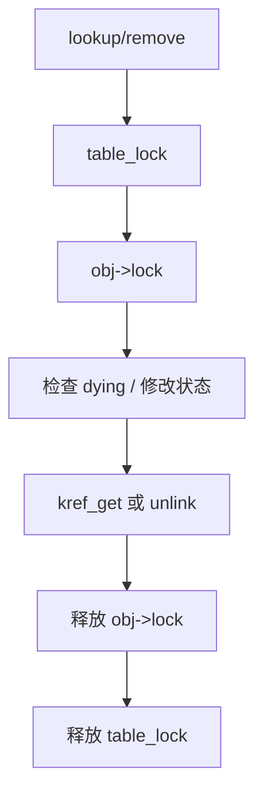

------

### 13.4.3_模板五_xarray_+_kref_lookup_模板

如果对象按整数 ID 管理，可以使用 xarray。

这里给一个保守模板：

```text
使用外部 mutex 保护 xarray 修改和 lookup + get 窗口。
```

对象：

```c
#include <linux/xarray.h>

struct my_obj {
	struct kref ref;

	struct mutex lock;
	bool dying;

	u32 id;
};

static DEFINE_XARRAY(my_obj_xa);
static DEFINE_MUTEX(my_obj_xa_lock);
```

publish：

```c
static int my_obj_publish(struct my_obj *obj)
{
	int ret;

	mutex_lock(&my_obj_xa_lock);
	ret = xa_insert(&my_obj_xa, obj->id, obj, GFP_KERNEL);
	mutex_unlock(&my_obj_xa_lock);

	return ret;
}
```

lookup + get：

```c
static struct my_obj *my_obj_lookup_get(u32 id)
{
	struct my_obj *obj;

	mutex_lock(&my_obj_xa_lock);

	obj = xa_load(&my_obj_xa, id);
	if (!obj)
		goto out_unlock;

	mutex_lock(&obj->lock);
	if (obj->dying) {
		mutex_unlock(&obj->lock);
		obj = NULL;
		goto out_unlock;
	}

	kref_get(&obj->ref);
	mutex_unlock(&obj->lock);

out_unlock:
	mutex_unlock(&my_obj_xa_lock);
	return obj;
}
```

remove：

```c
static void my_obj_remove(struct my_obj *obj)
{
	mutex_lock(&my_obj_xa_lock);

	mutex_lock(&obj->lock);
	obj->dying = true;
	mutex_unlock(&obj->lock);

	xa_erase(&my_obj_xa, obj->id);

	mutex_unlock(&my_obj_xa_lock);

	my_obj_put(obj);
}
```

release：

```c
static void my_obj_release(struct kref *ref)
{
	struct my_obj *obj = container_of(ref, struct my_obj, ref);

	kfree(obj);
}
```

这里没有在 release 里 `xa_erase()`，因为采用的是：

```text
remove 取消发布；
release 只做最终释放。
```

所有权表：

| 持有者        | get 来源              | put 位置          |
| ------------- | --------------------- | ----------------- |
| 创建者/发布者 | `kref_init()`         | `my_obj_remove()` |
| lookup 用户   | `my_obj_lookup_get()` | 使用结束          |
| 异步路径      | handoff 前 get        | 异步完成          |

注意：

```text
xa_load 只是拿到指针；
不能离开 xa_lock 后再 get；
必须在同一保护窗口里完成 lookup + get。
```

流程图：

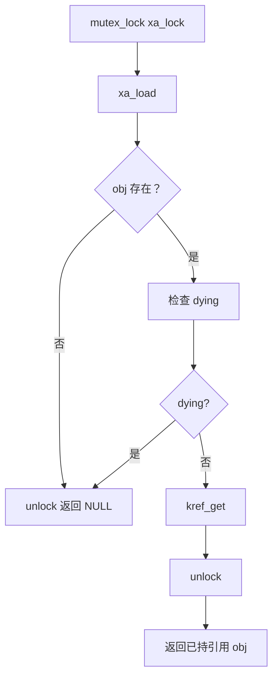

------

## 13.5_handoff_异步模板_work_timer_completion_错误回滚

### 13.5.1_模板六_workqueue_handoff_模板

workqueue 是 kref 最常见的 handoff 场景之一。

对象：

```c
struct my_obj {
	struct kref ref;
	struct work_struct work;

	spinlock_t lock;
	bool work_pending;
	bool dying;
};
```

初始化：

```c
static struct my_obj *my_obj_alloc(void)
{
	struct my_obj *obj;

	obj = kzalloc(sizeof(*obj), GFP_KERNEL);
	if (!obj)
		return NULL;

	kref_init(&obj->ref);
	INIT_WORK(&obj->work, my_obj_workfn);
	spin_lock_init(&obj->lock);

	obj->work_pending = false;
	obj->dying = false;

	return obj;
}
```

#### (1)_模型_A_每次成功投递_work_work_持有一份引用

```c
static int my_obj_schedule_work(struct my_obj *obj)
{
	unsigned long flags;
	bool queue;

	spin_lock_irqsave(&obj->lock, flags);

	if (obj->dying || obj->work_pending) {
		spin_unlock_irqrestore(&obj->lock, flags);
		return -EBUSY;
	}

	obj->work_pending = true;
	kref_get(&obj->ref);

	spin_unlock_irqrestore(&obj->lock, flags);

	queue = schedule_work(&obj->work);
	if (!queue) {
		/*
		 * 理论上如果 work_pending 自己维护正确，
		 * 这里不应该失败。
		 *
		 * 但为了模板完整，失败要回滚引用和状态。
		 */
		spin_lock_irqsave(&obj->lock, flags);
		obj->work_pending = false;
		spin_unlock_irqrestore(&obj->lock, flags);

		my_obj_put(obj);
		return -EBUSY;
	}

	return 0;
}
```

work 回调：

```c
static void my_obj_workfn(struct work_struct *work)
{
	struct my_obj *obj = container_of(work, struct my_obj, work);

	do_work(obj);

	spin_lock_irq(&obj->lock);
	obj->work_pending = false;
	spin_unlock_irq(&obj->lock);

	my_obj_put(obj);
}
```

这个模型的所有权：

| 持有者 | get                          | put         |
| ------ | ---------------------------- | ----------- |
| work   | schedule 成功前 `kref_get()` | workfn 结束 |

#### (2)_模型_B_调用者当前引用_handoff_给_work

这种模型更危险，但有时很清楚。

```c
/*
 * 成功后，work 接管调用者当前引用。
 * 调用者不能再访问 obj，也不能再 put。
 */
static int my_obj_schedule_work_take(struct my_obj *obj)
{
	if (!schedule_work(&obj->work))
		return -EBUSY;

	return 0;
}
```

work 回调：

```c
static void my_obj_workfn(struct work_struct *work)
{
	struct my_obj *obj = container_of(work, struct my_obj, work);

	do_work(obj);

	my_obj_put(obj);
}
```

调用者：

```c
obj = my_obj_lookup_get(id);
if (!obj)
	return -ENOENT;

ret = my_obj_schedule_work_take(obj);
if (ret) {
	/*
	 * 失败时 work 没有接管引用；
	 * 当前路径仍然负责 put。
	 */
	my_obj_put(obj);
	return ret;
}

/*
 * 成功后不能访问 obj。
 */
return 0;
```

handoff 图：

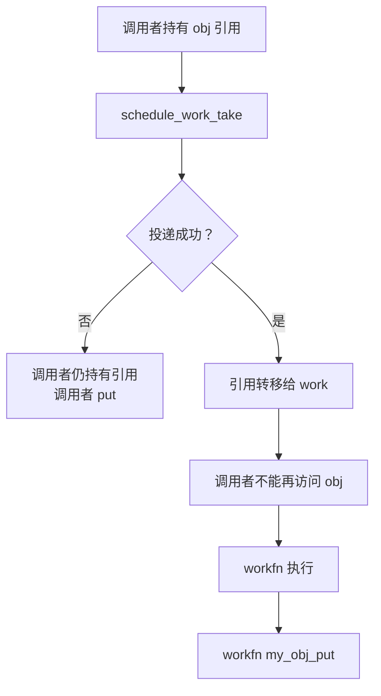

建议：

```text
普通代码优先用模型 A；
只有所有权转移非常明确时，才用模型 B。
```

------

### 13.5.2_模板七_timer_handoff_模板

timer 和 work 类似，但上下文更严格。

timer 回调通常不能睡眠。

对象：

```c
struct my_obj {
	struct kref ref;
	struct timer_list timer;

	spinlock_t lock;
	bool timer_pending;
	bool dying;
};
```

初始化：

```c
timer_setup(&obj->timer, my_obj_timerfn, 0);
```

启动 timer：

```c
static int my_obj_start_timer(struct my_obj *obj, unsigned long expires)
{
	unsigned long flags;

	spin_lock_irqsave(&obj->lock, flags);

	if (obj->dying || obj->timer_pending) {
		spin_unlock_irqrestore(&obj->lock, flags);
		return -EBUSY;
	}

	obj->timer_pending = true;
	kref_get(&obj->ref);

	mod_timer(&obj->timer, expires);

	spin_unlock_irqrestore(&obj->lock, flags);

	return 0;
}
```

timer 回调：

```c
static void my_obj_timerfn(struct timer_list *t)
{
	struct my_obj *obj = from_timer(obj, t, timer);

	spin_lock(&obj->lock);
	obj->timer_pending = false;
	spin_unlock(&obj->lock);

	handle_timeout(obj);

	my_obj_put(obj);
}
```

remove 时取消 timer：

```c
static void my_obj_remove(struct my_obj *obj)
{
	spin_lock_irq(&obj->lock);
	obj->dying = true;
	spin_unlock_irq(&obj->lock);

	if (del_timer_sync(&obj->timer)) {
		/*
		 * timer 成功删除，说明 timerfn 不会再为这次 pending 执行；
		 * 之前给 timer 的引用需要在 remove 路径归还。
		 */
		spin_lock_irq(&obj->lock);
		obj->timer_pending = false;
		spin_unlock_irq(&obj->lock);

		my_obj_put(obj);
	}

	my_obj_put(obj);
}
```

注意：

```text
timer 的引用归属必须和 del_timer_sync 返回值对应。
```

典型规则：

```text
启动 timer 成功：
    timer 持有引用。

timerfn 执行：
    timerfn 末尾 put。

remove 成功 del_timer_sync：
    timerfn 不会执行，remove 负责 put timer 引用。
```

流程图：

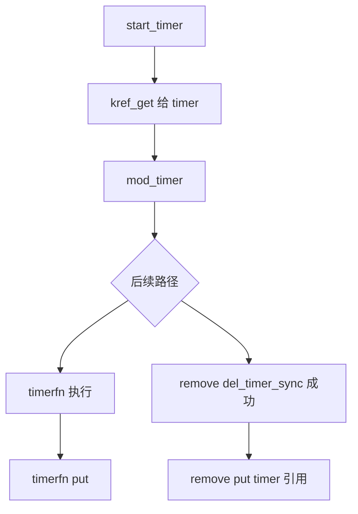

------

### 13.5.3_模板八_completion_/_wait_用户持有模板

有些对象会被用户等待完成。

对象：

```c
struct my_request {
	struct kref ref;
	struct completion done;

	struct mutex lock;
	int status;
	bool completed;
};
```

创建：

```c
static struct my_request *my_request_alloc(void)
{
	struct my_request *req;

	req = kzalloc(sizeof(*req), GFP_KERNEL);
	if (!req)
		return NULL;

	kref_init(&req->ref);
	init_completion(&req->done);
	mutex_init(&req->lock);

	req->completed = false;
	req->status = 0;

	return req;
}
```

waiter 获取引用：

```c
static int my_request_wait(struct my_request *req)
{
	int status;

	kref_get(&req->ref);

	wait_for_completion(&req->done);

	mutex_lock(&req->lock);
	status = req->status;
	mutex_unlock(&req->lock);

	my_request_put(req);

	return status;
}
```

完成路径：

```c
static void my_request_complete(struct my_request *req, int status)
{
	mutex_lock(&req->lock);
	req->status = status;
	req->completed = true;
	mutex_unlock(&req->lock);

	complete_all(&req->done);
}
```

最后 put：

```c
static void my_request_release(struct kref *ref)
{
	struct my_request *req = container_of(ref, struct my_request, ref);

	kfree(req);
}

static void my_request_put(struct my_request *req)
{
	kref_put(&req->ref, my_request_release);
}
```

注意：

```text
completion 只解决等待唤醒；
不自动保护 req 生命周期；
等待者如果要在等待后访问 req，必须持有引用。
```

关系图：

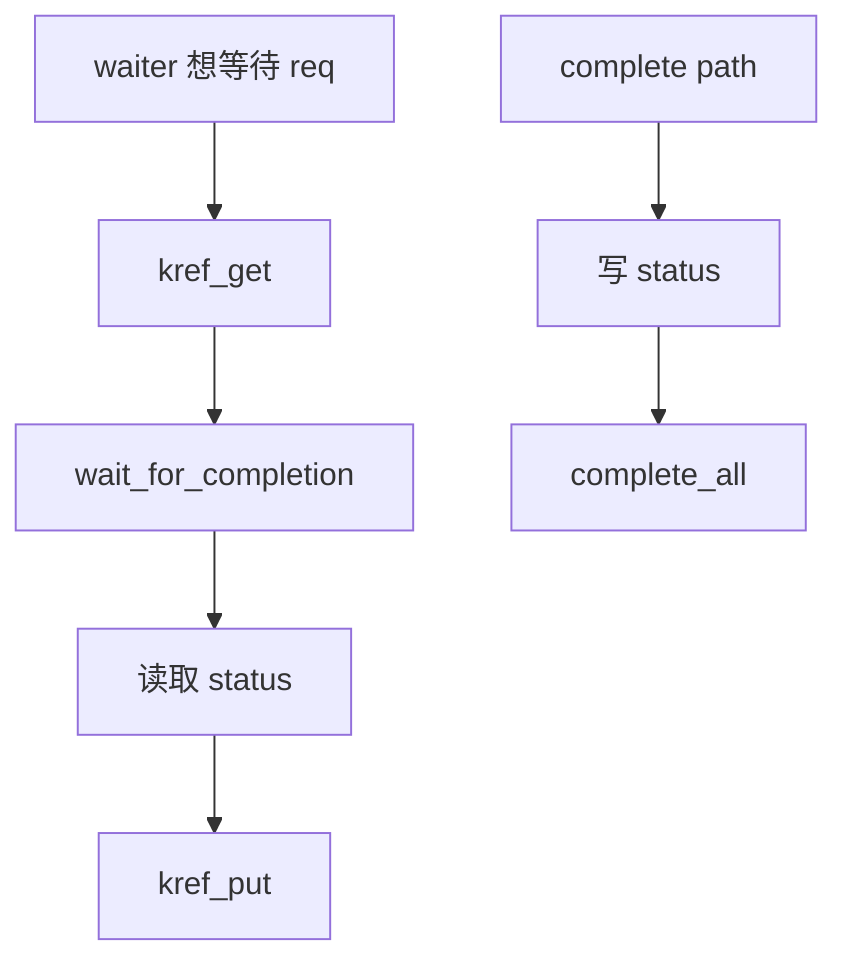

------

### 13.5.4_模板九_error_path_回滚模板

错误路径最容易漏 put 或多 put。

建议按阶段写 label。

对象创建流程：

```c
static struct my_obj *my_obj_create_full(int id)
{
	struct my_obj *obj;
	int ret;

	obj = my_obj_alloc(id);
	if (!obj)
		return ERR_PTR(-ENOMEM);

	ret = my_obj_init_buffer(obj);
	if (ret)
		goto err_put;

	ret = my_obj_init_hw(obj);
	if (ret)
		goto err_free_buffer;

	ret = my_obj_publish(obj);
	if (ret)
		goto err_cleanup_hw;

	return obj;

err_cleanup_hw:
	my_obj_cleanup_hw(obj);

err_free_buffer:
	my_obj_free_buffer(obj);

err_put:
	my_obj_put(obj);

	return ERR_PTR(ret);
}
```

这里有一个原则：

```text
谁初始化，谁回滚；
最后统一 put 初始引用。
```

如果子资源统一在 release 中释放，也可以简化：

```c
static struct my_obj *my_obj_create_full(int id)
{
	struct my_obj *obj;
	int ret;

	obj = my_obj_alloc(id);
	if (!obj)
		return ERR_PTR(-ENOMEM);

	ret = my_obj_init_buffer(obj);
	if (ret)
		goto err_put;

	ret = my_obj_init_hw(obj);
	if (ret)
		goto err_put;

	ret = my_obj_publish(obj);
	if (ret)
		goto err_put;

	return obj;

err_put:
	my_obj_put(obj);
	return ERR_PTR(ret);
}
```

但是这要求 release 能正确处理部分初始化状态。

例如：

```c
static void my_obj_release(struct kref *ref)
{
	struct my_obj *obj = container_of(ref, struct my_obj, ref);

	if (obj->hw_inited)
		my_obj_cleanup_hw(obj);

	kfree(obj->buffer);
	kfree(obj);
}
```

不建议混合两种风格。

#### (1)_风格_A_错误路径逐级回滚

优点：

```text
每个失败点释放已经初始化的资源；
release 只处理完整对象最终释放。
```

缺点：

```text
错误标签较多。
```

#### (2)_风格_B_release_统一处理

优点：

```text
错误路径简单，失败就 put。
```

缺点：

```text
release 必须能处理半初始化对象；
需要 inited 标志。
```

对比图：

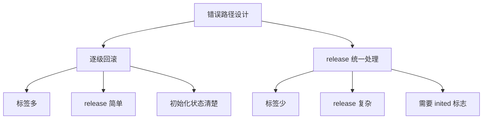

建议：

```text
小对象可以 release 统一处理；
复杂对象优先逐级回滚；
不要两种风格混在一起。
```

------

## 13.6_删除和弱引用模板_remove_RCU_缓存指针

### 13.6.1_模板十_remove_/_unlink_/_drain_/_release_模板

这是驱动里最重要的模板之一。

remove 不是简单：

```c
list_del();
kref_put();
```

真实 remove 通常要分阶段：

```text
1. 标记 dying，阻止新用户进入。
2. 从 lookup 结构取消发布。
3. 停止新请求提交。
4. 取消 timer/work/callback。
5. drain 已有异步路径。
6. 停止硬件或底层资源。
7. put 发布引用。
8. 最后 release 释放对象本体。
```

对象：

```c
struct my_obj {
	struct kref ref;
	struct list_head node;

	struct mutex lock;
	bool dying;

	struct work_struct work;
	struct timer_list timer;
	bool work_pending;
	bool timer_pending;

	void *buffer;
};
```

remove 模板：

```c
static void my_obj_remove(struct my_obj *obj)
{
	/*
	 * 1. 阻止新业务进入。
	 */
	mutex_lock(&obj->lock);
	obj->dying = true;
	mutex_unlock(&obj->lock);

	/*
	 * 2. 从 lookup 集合取消发布。
	 */
	mutex_lock(&my_obj_list_lock);
	if (!list_empty(&obj->node))
		list_del_init(&obj->node);
	mutex_unlock(&my_obj_list_lock);

	/*
	 * 3. 取消 timer。
	 * 如果 timer 被成功删除，归还 timer 持有的引用。
	 */
	if (del_timer_sync(&obj->timer)) {
		mutex_lock(&obj->lock);
		obj->timer_pending = false;
		mutex_unlock(&obj->lock);

		my_obj_put(obj);
	}

	/*
	 * 4. drain work。
	 * 这里是否需要 put，取决于你的 work 引用归属模型。
	 */
	cancel_work_sync(&obj->work);

	/*
	 * 5. 停止硬件 / 阻止新 IO / drain 队列。
	 */
	my_obj_stop_io(obj);
	my_obj_drain_queue(obj);

	/*
	 * 6. 释放发布者持有的初始引用。
	 */
	my_obj_put(obj);
}
```

release：

```c
static void my_obj_release(struct kref *ref)
{
	struct my_obj *obj = container_of(ref, struct my_obj, ref);

	WARN_ON(!list_empty(&obj->node));
	WARN_ON(timer_pending(&obj->timer));

	kfree(obj->buffer);
	kfree(obj);
}
```

remove 流程图：

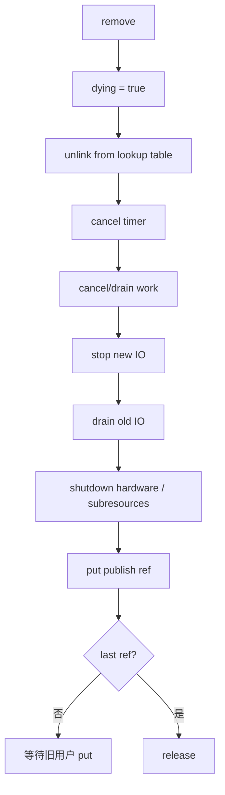

注意：

```text
kref 只保证 obj 内存存在；
remove 还必须保证业务资源不会被旧用户错误访问。
```

所以旧用户路径应该检查：

```c
mutex_lock(&obj->lock);
if (obj->dying) {
	mutex_unlock(&obj->lock);
	return -ENODEV;
}
mutex_unlock(&obj->lock);
```

------

### 13.6.2_模板十一_RCU_lookup_+_kref_get_unless_zero_+_kfree_rcu

对象：

```c
struct my_obj {
	struct kref ref;
	struct rcu_head rcu;
	struct list_head node;

	spinlock_t lock;
	bool dying;

	int id;
};

static LIST_HEAD(my_obj_list);
static DEFINE_SPINLOCK(my_obj_list_lock);
```

release：

```c
static void my_obj_release(struct kref *ref)
{
	struct my_obj *obj = container_of(ref, struct my_obj, ref);

	kfree_rcu(obj, rcu);
}
```

publish：

```c
static void my_obj_publish(struct my_obj *obj)
{
	spin_lock(&my_obj_list_lock);
	list_add_rcu(&obj->node, &my_obj_list);
	spin_unlock(&my_obj_list_lock);
}
```

lookup + get：

```c
static struct my_obj *my_obj_lookup_get_rcu(int id)
{
	struct my_obj *obj;
	struct my_obj *found = NULL;

	rcu_read_lock();

	list_for_each_entry_rcu(obj, &my_obj_list, node) {
		if (obj->id != id)
			continue;

		if (!kref_get_unless_zero(&obj->ref))
			break;

		spin_lock(&obj->lock);
		if (obj->dying) {
			spin_unlock(&obj->lock);
			rcu_read_unlock();

			my_obj_put(obj);
			return NULL;
		}
		spin_unlock(&obj->lock);

		found = obj;
		break;
	}

	rcu_read_unlock();

	return found;
}
```

remove：

```c
static void my_obj_remove(struct my_obj *obj)
{
	spin_lock(&obj->lock);
	obj->dying = true;
	spin_unlock(&obj->lock);

	spin_lock(&my_obj_list_lock);
	list_del_rcu(&obj->node);
	spin_unlock(&my_obj_list_lock);

	my_obj_put(obj);
}
```

使用：

```c
static int my_obj_use_rcu(int id)
{
	struct my_obj *obj;
	int ret;

	obj = my_obj_lookup_get_rcu(id);
	if (!obj)
		return -ENOENT;

	ret = do_something(obj);

	my_obj_put(obj);
	return ret;
}
```

RCU 模板图：

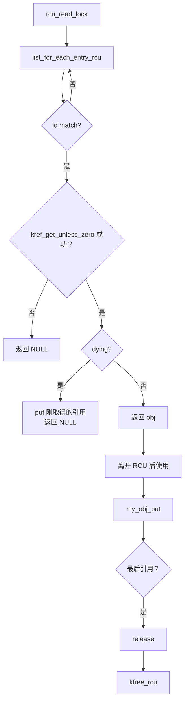

关键规则：

```text
RCU 保护 lookup 到 get_unless_zero 的窗口；
kref 保护离开 RCU 后的生命周期；
dying 保护逻辑可用性；
kfree_rcu 保护最终内存释放。
```

------

### 13.6.3_模板十二_弱引用缓存指针模板

有时对象会被缓存成弱引用。

例如：

```c
struct my_holder {
	struct my_obj __rcu *cached;
};
```

注意：

```text
弱引用指针不拥有对象；
不能直接使用；
必须转换成强引用。
```

获取强引用：

```c
static struct my_obj *my_holder_get_cached(struct my_holder *holder)
{
	struct my_obj *obj;

	rcu_read_lock();

	obj = rcu_dereference(holder->cached);
	if (obj && !kref_get_unless_zero(&obj->ref))
		obj = NULL;

	rcu_read_unlock();

	return obj;
}
```

更新缓存：

```c
static void my_holder_set_cached(struct my_holder *holder,
				 struct my_obj *obj)
{
	rcu_assign_pointer(holder->cached, obj);
}
```

清除缓存：

```c
static void my_holder_clear_cached(struct my_holder *holder)
{
	rcu_assign_pointer(holder->cached, NULL);
}
```

使用：

```c
obj = my_holder_get_cached(holder);
if (!obj)
	return -ENOENT;

ret = do_something(obj);

my_obj_put(obj);
```

错误写法：

```c
obj = rcu_dereference(holder->cached);
do_something(obj);   /* 错误：没有长期引用 */
```

弱引用转换图：

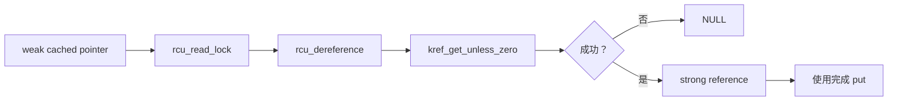

------

## 13.7_分层持有模板_父子对象_file_包装函数_状态机

### 13.7.1_模板十三_父子对象引用模板

有些对象有父子关系。

例如：

```c
struct my_parent {
	struct kref ref;
	struct mutex lock;
	bool dying;

	struct list_head child_list;
};

struct my_child {
	struct kref ref;
	struct my_parent *parent;
	struct list_head node;
};
```

这里必须定义：

```text
child 是否持有 parent 引用？
parent 是否持有 child 引用？
remove parent 时如何处理 child？
child release 时能否访问 parent？
```

一种清晰模型是：

```text
child 创建成功后，child 持有 parent 引用；
child release 时 put parent；
parent 的 child_list 只是集合关系；
parent remove 时阻止新 child 创建，并 drain 旧 child。
```

parent get/put：

```c
static void my_parent_release(struct kref *ref)
{
	struct my_parent *parent = container_of(ref, struct my_parent, ref);

	kfree(parent);
}

static void my_parent_get(struct my_parent *parent)
{
	kref_get(&parent->ref);
}

static void my_parent_put(struct my_parent *parent)
{
	kref_put(&parent->ref, my_parent_release);
}
```

child release：

```c
static void my_child_release(struct kref *ref)
{
	struct my_child *child = container_of(ref, struct my_child, ref);
	struct my_parent *parent = child->parent;

	kfree(child);

	my_parent_put(parent);
}
```

child 创建：

```c
static struct my_child *my_child_create(struct my_parent *parent)
{
	struct my_child *child;

	mutex_lock(&parent->lock);
	if (parent->dying) {
		mutex_unlock(&parent->lock);
		return ERR_PTR(-ENODEV);
	}

	my_parent_get(parent);
	mutex_unlock(&parent->lock);

	child = kzalloc(sizeof(*child), GFP_KERNEL);
	if (!child) {
		my_parent_put(parent);
		return ERR_PTR(-ENOMEM);
	}

	kref_init(&child->ref);
	child->parent = parent;
	INIT_LIST_HEAD(&child->node);

	mutex_lock(&parent->lock);
	if (parent->dying) {
		mutex_unlock(&parent->lock);
		my_child_put(child);
		return ERR_PTR(-ENODEV);
	}

	list_add_tail(&child->node, &parent->child_list);
	mutex_unlock(&parent->lock);

	return child;
}
```

注意这里有一个竞态点：

```text
parent 可能在 child 分配期间进入 dying。
```

所以需要二次检查。

更简单的工程做法是：

```text
在 parent->lock 下完成 parent get 和 child 加入；
如果分配可能睡眠，则先分配 child，再加锁检查 dying。
```

更推荐的写法：

```c
static struct my_child *my_child_create(struct my_parent *parent)
{
	struct my_child *child;

	child = kzalloc(sizeof(*child), GFP_KERNEL);
	if (!child)
		return ERR_PTR(-ENOMEM);

	kref_init(&child->ref);
	INIT_LIST_HEAD(&child->node);

	mutex_lock(&parent->lock);
	if (parent->dying) {
		mutex_unlock(&parent->lock);
		kfree(child);
		return ERR_PTR(-ENODEV);
	}

	my_parent_get(parent);
	child->parent = parent;
	list_add_tail(&child->node, &parent->child_list);

	mutex_unlock(&parent->lock);

	return child;
}
```

child remove：

```c
static void my_child_remove(struct my_child *child)
{
	struct my_parent *parent = child->parent;

	mutex_lock(&parent->lock);
	if (!list_empty(&child->node))
		list_del_init(&child->node);
	mutex_unlock(&parent->lock);

	my_child_put(child);
}
```

父子引用图：

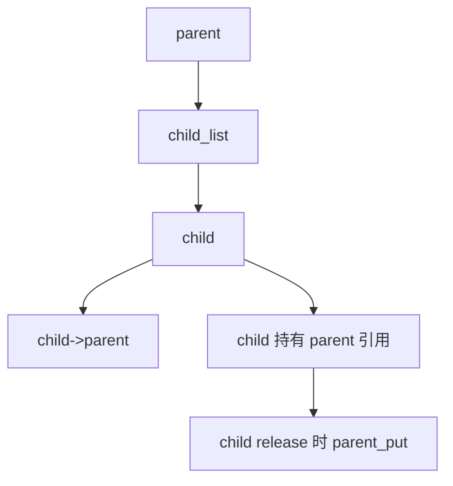

关键规则：

```text
如果 child release 里要访问 parent，child 必须持有 parent 引用；
如果 parent remove 要等待 child 消失，需要 drain child；
list 关系不是生命周期引用。
```

------

### 13.7.2_模板十四_file->private_data_持有引用

字符设备、misc 设备中很常见。

对象：

```c
struct my_obj {
	struct kref ref;
	struct mutex lock;
	bool dying;
	int id;
};
```

open：

```c
static int my_fops_open(struct inode *inode, struct file *file)
{
	struct my_obj *obj;

	obj = my_obj_lookup_get(iminor(inode));
	if (!obj)
		return -ENODEV;

	file->private_data = obj;
	return 0;
}
```

release：

```c
static int my_fops_release(struct inode *inode, struct file *file)
{
	struct my_obj *obj = file->private_data;

	file->private_data = NULL;

	if (obj)
		my_obj_put(obj);

	return 0;
}
```

read/write/ioctl：

```c
static long my_fops_ioctl(struct file *file,
			  unsigned int cmd,
			  unsigned long arg)
{
	struct my_obj *obj = file->private_data;
	int ret;

	if (!obj)
		return -ENODEV;

	mutex_lock(&obj->lock);
	if (obj->dying) {
		mutex_unlock(&obj->lock);
		return -ENODEV;
	}
	mutex_unlock(&obj->lock);

	ret = my_obj_ioctl(obj, cmd, arg);

	return ret;
}
```

这里的规则：

```text
open 成功：
    file 持有 obj 引用。

release：
    file 释放 obj 引用。

read/write/ioctl：
    可以使用 file->private_data，因为 file 持有引用；
    但仍要检查 dying/state；
    字段访问仍要加锁。
```

流程图：

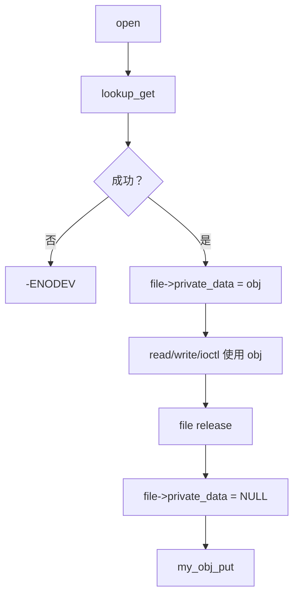

错误写法：

```c
file->private_data = obj;   /* 但 open 没有 get */
```

这会导致：

```text
file 持有裸指针；
remove 后 file 操作可能 UAF。
```

------

### 13.7.3_模板十五_引用包装函数统一入口

工程里建议不要到处直接写：

```c
kref_get(&obj->ref);
kref_put(&obj->ref, my_obj_release);
```

而是包装：

```c
static inline struct my_obj *my_obj_get(struct my_obj *obj)
{
	kref_get(&obj->ref);
	return obj;
}

static inline void my_obj_put(struct my_obj *obj)
{
	if (obj)
		kref_put(&obj->ref, my_obj_release);
}
```

好处：

```text
1. get/put 统一命名。
2. release 函数不散落。
3. 方便加调试日志。
4. 方便后续改成 trace/ref tracker。
5. 调用点更容易读出对象语义。
```

调试版本：

```c
static inline struct my_obj *my_obj_get_dbg(struct my_obj *obj,
					    const char *why)
{
	pr_debug("my_obj_get obj=%p why=%s caller=%pS\n",
		 obj, why, __builtin_return_address(0));

	kref_get(&obj->ref);
	return obj;
}

static inline void my_obj_put_dbg(struct my_obj *obj,
				  const char *why)
{
	if (!obj)
		return;

	pr_debug("my_obj_put obj=%p why=%s caller=%pS\n",
		 obj, why, __builtin_return_address(0));

	kref_put(&obj->ref, my_obj_release);
}
```

宏：

```c
#define my_obj_get(obj) my_obj_get_dbg((obj), __func__)
#define my_obj_put(obj) my_obj_put_dbg((obj), __func__)
```

注意：

```text
调试宏只用于开发排查；
正式代码是否保留要看子系统风格。
```

------

### 13.7.4_模板十六_对象状态机_+_kref_模板

kref 只保护生命周期，不保护对象状态。

建议给复杂对象加状态机。

```c
enum my_obj_state {
	MY_OBJ_NEW = 0,
	MY_OBJ_LIVE,
	MY_OBJ_DYING,
	MY_OBJ_DEAD,
};

struct my_obj {
	struct kref ref;
	struct mutex lock;
	enum my_obj_state state;
	struct list_head node;
};
```

状态切换：

```c
static bool my_obj_try_enter(struct my_obj *obj)
{
	bool ok = false;

	mutex_lock(&obj->lock);
	if (obj->state == MY_OBJ_LIVE)
		ok = true;
	mutex_unlock(&obj->lock);

	return ok;
}
```

lookup + get + state：

```c
static struct my_obj *my_obj_lookup_get_live(int id)
{
	struct my_obj *obj;

	mutex_lock(&my_obj_list_lock);

	obj = my_obj_find_locked(id);
	if (!obj)
		goto out_unlock;

	mutex_lock(&obj->lock);
	if (obj->state != MY_OBJ_LIVE) {
		mutex_unlock(&obj->lock);
		obj = NULL;
		goto out_unlock;
	}

	kref_get(&obj->ref);
	mutex_unlock(&obj->lock);

out_unlock:
	mutex_unlock(&my_obj_list_lock);
	return obj;
}
```

remove：

```c
static void my_obj_remove(struct my_obj *obj)
{
	mutex_lock(&obj->lock);
	if (obj->state != MY_OBJ_LIVE) {
		mutex_unlock(&obj->lock);
		return;
	}

	obj->state = MY_OBJ_DYING;
	mutex_unlock(&obj->lock);

	mutex_lock(&my_obj_list_lock);
	list_del_init(&obj->node);
	mutex_unlock(&my_obj_list_lock);

	my_obj_put(obj);
}
```

release：

```c
static void my_obj_release(struct kref *ref)
{
	struct my_obj *obj = container_of(ref, struct my_obj, ref);

	mutex_lock(&obj->lock);
	obj->state = MY_OBJ_DEAD;
	mutex_unlock(&obj->lock);

	WARN_ON(!list_empty(&obj->node));

	kfree(obj);
}
```

状态图：

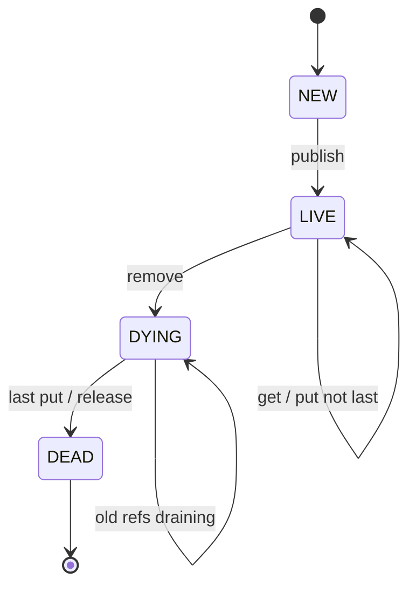

注意：

```text
state 解决逻辑可用性；
kref 解决内存生命周期；
list 解决 lookup 可见性；
lock 解决状态并发修改。
```

------

## 13.8_约定和收尾模板_注释_borrow_release_退出_断言

### 13.8.1_模板十七_引用归属注释模板

复杂函数必须在注释里写清引用归属。

#### (1)_get_型函数注释

```c
/*
 * my_obj_lookup_get - find object by id and return a referenced object
 *
 * On success:
 *   returns obj with one kref held by caller.
 *
 * On failure:
 *   returns NULL and caller owns no reference.
 *
 * Caller must call my_obj_put() on success.
 */
static struct my_obj *my_obj_lookup_get(int id);
```

#### (2)_take_型函数注释

```c
/*
 * my_obj_enqueue_take - enqueue object and transfer caller's reference
 *
 * On success:
 *   queue owns caller's reference.
 *   caller must not touch obj after this function returns 0.
 *
 * On failure:
 *   caller still owns the reference and must put it.
 */
static int my_obj_enqueue_take(struct my_queue *q, struct my_obj *obj);
```

#### (3)_get_型_enqueue_注释

```c
/*
 * my_obj_enqueue_get - enqueue object with an extra queue reference
 *
 * On success:
 *   queue holds a new reference.
 *   caller still owns its original reference.
 *
 * On failure:
 *   no new reference is kept.
 *   caller still owns its original reference.
 */
static int my_obj_enqueue_get(struct my_queue *q, struct my_obj *obj);
```

#### (4)_borrow_型函数注释

```c
/*
 * my_obj_peek_borrow - return a borrowed object pointer
 *
 * Returned pointer is valid only while caller holds my_obj_list_lock.
 * Caller must not store it.
 * Caller must not use it after unlocking.
 * Caller must not put it.
 */
static struct my_obj *my_obj_peek_borrow(int id);
```

注释模板的目的：

```text
让调用者知道：
成功时引用归谁；
失败时引用归谁；
是否需要 put；
是否还能访问对象；
是否只是借用指针。
```

------

### 13.8.2_模板十八_borrow_指针模板

有些函数只在锁内借用指针，不增加引用。

```c
/*
 * Caller must hold my_obj_list_lock.
 * Returned pointer is borrowed and valid only under the lock.
 */
static struct my_obj *my_obj_find_locked(int id)
{
	struct my_obj *obj;

	list_for_each_entry(obj, &my_obj_list, node) {
		if (obj->id == id)
			return obj;
	}

	return NULL;
}
```

调用：

```c
mutex_lock(&my_obj_list_lock);

obj = my_obj_find_locked(id);
if (obj)
	ret = read_field_under_lock(obj);

mutex_unlock(&my_obj_list_lock);
```

不能这样：

```c
mutex_lock(&my_obj_list_lock);
obj = my_obj_find_locked(id);
mutex_unlock(&my_obj_list_lock);

do_something(obj);   /* 错误：borrow 指针离开锁后失效 */
```

如果要离开锁使用：

```c
mutex_lock(&my_obj_list_lock);

obj = my_obj_find_locked(id);
if (obj)
	my_obj_get(obj);

mutex_unlock(&my_obj_list_lock);

if (!obj)
	return -ENOENT;

do_something(obj);

my_obj_put(obj);
```

borrow 到 strong ref 的转换图：

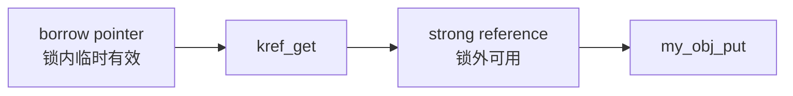

------

### 13.8.3_模板十九_release_中资源释放顺序

release 里释放资源建议按反初始化顺序。

初始化：

```c
ret = init_a(obj);
if (ret)
	goto err_put;

ret = init_b(obj);
if (ret)
	goto err_cleanup_a;

ret = init_c(obj);
if (ret)
	goto err_cleanup_b;
```

release：

```c
static void my_obj_release(struct kref *ref)
{
	struct my_obj *obj = container_of(ref, struct my_obj, ref);

	cleanup_c(obj);
	cleanup_b(obj);
	cleanup_a(obj);

	kfree(obj);
}
```

如果有子资源：

```c
struct my_obj {
	struct kref ref;

	void *buffer;
	struct workqueue_struct *wq;
	struct my_subobj *sub;
};
```

release：

```c
static void my_obj_release(struct kref *ref)
{
	struct my_obj *obj = container_of(ref, struct my_obj, ref);

	if (obj->wq)
		destroy_workqueue(obj->wq);

	if (obj->sub)
		my_subobj_put(obj->sub);

	kfree(obj->buffer);
	kfree(obj);
}
```

注意：

```text
release 不能释放仍可能被异步路径访问的资源；
必须先 drain work/timer/callback；
如果 RCU 读者可能访问子资源，子资源也要延迟释放。
```

释放顺序图：

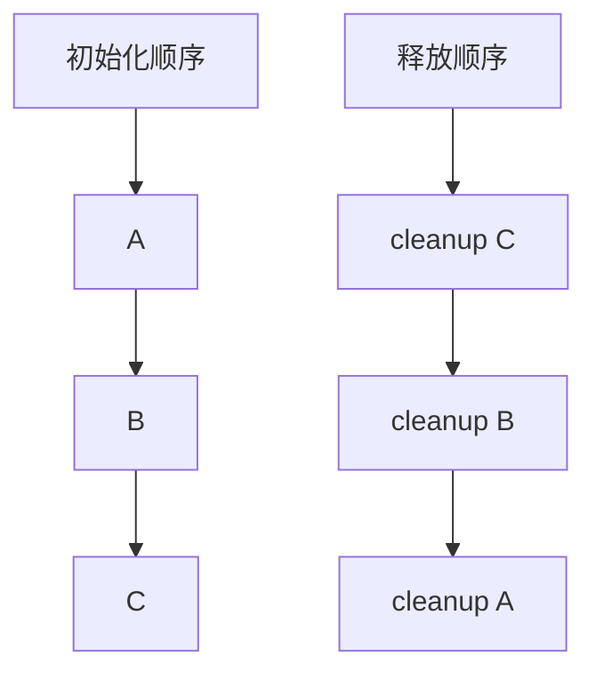

------

### 13.8.4_模板二十_模块退出时清理所有对象

模块退出时要清理全局集合。

```c
static void my_obj_destroy_all(void)
{
	struct my_obj *obj, *tmp;
	LIST_HEAD(to_free);

	mutex_lock(&my_obj_list_lock);

	list_for_each_entry_safe(obj, tmp, &my_obj_list, node) {
		mutex_lock(&obj->lock);
		obj->dying = true;
		mutex_unlock(&obj->lock);

		list_del_init(&obj->node);
		list_add_tail(&obj->node, &to_free);
	}

	mutex_unlock(&my_obj_list_lock);

	list_for_each_entry_safe(obj, tmp, &to_free, node) {
		list_del_init(&obj->node);

		my_obj_stop(obj);
		my_obj_put(obj);
	}
}
```

注意：

```text
不要在持全局锁时做可能睡眠的 stop/drain；
先把对象从全局表摘到临时表；
释放锁后逐个 stop/put。
```

流程图：

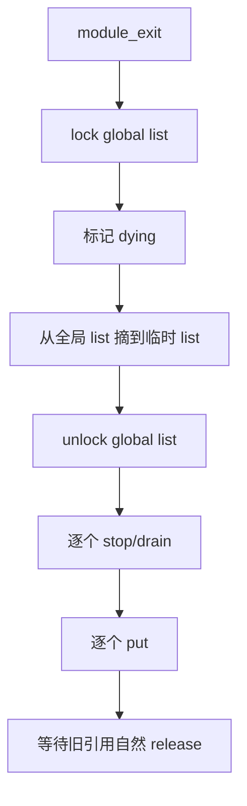

如果需要等待所有对象释放，必须有额外同步机制，例如：

```text
completion；
refcount 追踪；
模块引用；
flush_workqueue；
drain 队列；
等待活动计数归零。
```

kref 本身没有提供“等待所有对象 release”的通用接口。

------

### 13.8.5_模板二十一_禁止新用户进入的统一检查

很多路径都要检查对象是否 dying。

可以包装：

```c
static bool my_obj_is_live_locked(struct my_obj *obj)
{
	lockdep_assert_held(&obj->lock);

	return !obj->dying;
}
```

进入业务路径：

```c
static int my_obj_enter(struct my_obj *obj)
{
	int ret = 0;

	mutex_lock(&obj->lock);
	if (!my_obj_is_live_locked(obj))
		ret = -ENODEV;
	mutex_unlock(&obj->lock);

	return ret;
}
```

使用：

```c
ret = my_obj_enter(obj);
if (ret)
	return ret;

ret = do_something(obj);
```

但是注意：

```text
my_obj_enter 只是状态检查；
它不增加引用；
调用者必须已经持有引用。
```

如果你需要“检查 live 并取得引用”，应该放在 lookup_get 中完成。

------

### 13.8.6_模板二十二_调试断言模板

release 中断言：

```c
static void my_obj_release(struct kref *ref)
{
	struct my_obj *obj = container_of(ref, struct my_obj, ref);

	WARN_ON(!list_empty(&obj->node));
	WARN_ON(timer_pending(&obj->timer));
	WARN_ON(work_pending(&obj->work));

	kfree(obj);
}
```

lookup 中断言：

```c
static struct my_obj *my_obj_find_locked(int id)
{
	lockdep_assert_held(&my_obj_list_lock);

	...
}
```

状态访问断言：

```c
static void my_obj_set_state_locked(struct my_obj *obj, int state)
{
	lockdep_assert_held(&obj->lock);

	obj->state = state;
}
```

put 后防误用：

```c
my_obj_put(obj);
obj = NULL;
```

这不能消除所有 bug，但可以减少当前函数后续误访问：

```c
my_obj_put(obj);
obj = NULL;

return ret;
```

------

## 13.9_本章模板总表

| 场景            | 推荐模板                                       |
| --------------- | ---------------------------------------------- |
| 最小对象        | `kref_init/get/put/release`                    |
| 复杂初始化      | `alloc + init + publish + put`                 |
| list 查找       | `list_lock 内 lookup + kref_get`               |
| hash 查找       | `hash_lock 内 lookup + kref_get`               |
| xarray 查找     | `xa_lock/mutex 内 xa_load + kref_get`          |
| RCU 查找        | `rcu_read_lock + kref_get_unless_zero`         |
| work handoff    | 投递成功前 get，workfn 末尾 put                |
| timer handoff   | start timer get，timerfn 或 del_timer_sync put |
| file 私有数据   | open lookup_get，release put                   |
| completion 等待 | waiter get，wait 后 put                        |
| remove          | dying + unlink + drain + put                   |
| release         | 最后销毁，不重新发布                           |
| 父子对象        | child 持 parent 引用                           |
| weak pointer    | RCU + get_unless_zero 转强引用                 |
| 错误路径        | 按阶段回滚或 release 统一处理                  |
| 调试            | get/put 日志 + release WARN                    |

------

## 13.10_本章审查清单

写完一个 kref 对象后，按下面清单检查：

```text
1. struct kref 是否嵌入在业务对象内部？
2. alloc 成功后是否 kref_init？
3. kref_init 是否只执行一次？
4. get/put 是否有统一包装函数？
5. release 是否能通过 container_of 找回对象？
6. release 是否只做销毁，不重新发布？
7. 对象是否有全局 lookup 入口？
8. lookup + get 是否在同一锁/RCU 窗口内完成？
9. 如果使用 RCU，是否使用 kref_get_unless_zero？
10. get_unless_zero 返回值是否检查？
11. 是否有 dying/state 阻止新用户进入？
12. remove 是否先 dying，再 unlink？
13. remove 是否 drain work/timer/callback？
14. 异步路径是否持有自己的引用？
15. handoff 成功失败时引用归属是否写清楚？
16. file->private_data 是否持有引用？
17. put 后是否还有访问 obj？
18. release 前对象是否已经从集合脱链？
19. RCU 对象是否使用 kfree_rcu/call_rcu？
20. 字段访问是否有锁/原子/状态机保护？
```

------

## 13.11_本章小结

本章不是讲新概念，而是把 kref 写成工程结构。

最小模板是：

```c
struct my_obj {
	struct kref ref;
};

kref_init(&obj->ref);
kref_get(&obj->ref);
kref_put(&obj->ref, my_obj_release);
```

但真实工程里，更常见的是：

```text
alloc/init/publish；
lookup/get/use/put；
handoff/drain；
remove/unlink；
release/free。
```

最终工程模型应该是：

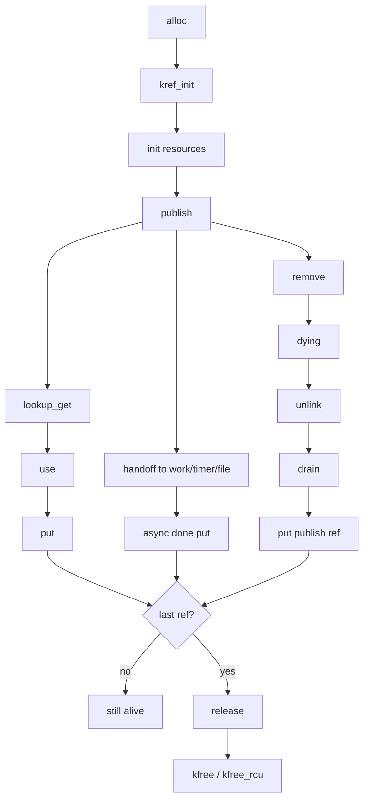

一句话总结：

```text
kref 工程模板不是 refcount++ / refcount-- 模板；
而是对象发布、查找、持有、转移、撤销、释放的完整生命周期模板。
```
