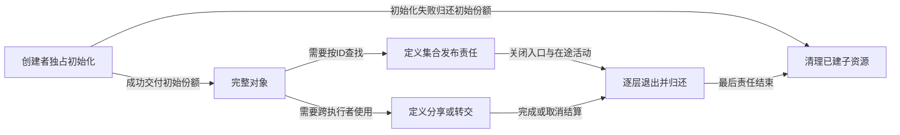
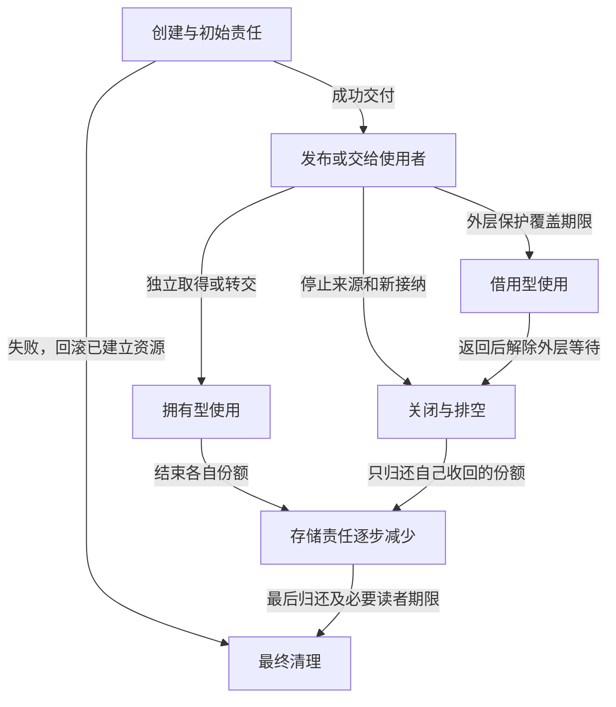

# 第13章\_工程模板

## 13.1\_本章导读\_把规则落成可复制模板

上一章已经能从一次错误访问倒推责任缺口。本章反过来：假设要给驱动增加一个请求对象，怎样从一张责任表写出可以复用的创建、交付、查找和退出代码？目标是复用已经证明的协议。只复制相同的结构体和函数名，缺少一次失败回滚，仍会得到与模板外观相同的bug。

先限定对象范围。这里的私有对象由本层定义分配和最终清理，例如request、session、job或buffer的外壳。若存储已经归设备模型管理，应采用get_device/put_device或相应框架接口；不能把内部kref换成自己的release。私有会话可以通过一份桥接引用持有设备，但须维持P11已经建立的分配边界。

每组模板回答三个问题：输入时调用者有什么资格，成功与失败分别把责任留给谁，退出时怎样阻止仍需使用的状态被提前清理。先从没有共享入口的同步对象开始；随后才为查找加入集合责任，为异步加入交付和取消，为退出加入关闭与等待。不能一开始给每个对象都塞上mutex、dying、work和rcu_head，再希望字段自行组成协议。

```mermaid
flowchart LR
    A[创建者独占初始化] -->|成功交付初始份额| B[完整对象]
    A -->|初始化失败归还初始份额| F[清理已建子资源]
    B -->|需要按ID查找| C[定义集合发布责任]
    B -->|需要跨执行者使用| D[定义分享或转交]
    C -->|关闭入口与在途活动| E[逐层退出并归还]
    D -->|完成或取消结算| E
    E -->|最后责任结束| F
```

模板按场景组织；同一场景中仍要选择具体条件。拥有型与非拥有型索引、共享与转交、普通RCU与锁保护，都有前面章节的完整实例可对照。本章会说明选择理由和改动位置，不能把某一模板提升为所有对象的固定规则。

## 13.2\_模板命名约定

模板名称只表达预期，输入资格、成功与失败后的责任、可用上下文由契约兑现。按[创建模板的命名约定](P16_对象创建与失败清理模板.md#16.1_模板命名约定)逐项确认alloc/create、get、put、take、borrow和publish的边界，再进入完整创建过程。

## 13.3\_基础对象模板\_alloc\_init\_get\_put\_release

从[最小对象与分层创建](P16_对象创建与失败清理模板.md#16.2_基础对象模板_alloc_init_get_put_release)开始，追踪创建者和observer的份额，分别观察外壳分配、缓冲区准备和业务校验失败。该篇保留完整C模块、运行步骤、预期结果、验证边界及练习。

## 13.4\_lookup\_集合模板\_list\_hash\_xarray

创建函数交付初始份额以后，其他调用者若需按ID查找，就必须定义集合自身的责任。按同一拥有型模型依次改变索引和执行上下文，避免把不同容器或锁的名字当作引用保证。

| 阅读单元 | 解决的问题 | 接给下一步的条件 |
| --- | --- | --- |
| [拥有型链表](P17_拥有型链表工程模板.md#17.1_拥有型链表的发布与撤下) | 表份额、重复发布/撤下、关闭与旧读者 | 明白成员、业务状态及份额可以同时变化 |
| [拥有型哈希与IRQ](P18_拥有型哈希与IRQ工程模板.md#18.1_拥有型哈希与IRQ上下文) | 同ID冲突、桶碰撞、本地IRQ与单锁/双锁 | 不把哈希、spinlock和生命周期混成同一保证 |
| [XArray身份与删除](P19_XArray身份与删除工程模板.md#19.1_整数索引与期待对象删除) | 公开与已持锁入口、编号复用及期待对象删除 | 确定移除者消费的是哪一个对象的成员份额 |

四个独立模板保留完整正文和代码，按“创建 → 链表 → 哈希 → XArray”读完后回到13.5，继续讨论跨执行者交付。P13承担工程入口和后续模板的衔接，章节文件号不要求在本分支按数值连续跳转。

------

## 13.5\_handoff\_异步模板\_work\_timer\_completion\_错误回滚

集合已经明确取回成员份额的路径。异步交付还要确定提交返回以前对方能否执行、失败时责任归谁，以及关闭是否真正覆盖了全部投递。先比较工作队列两种份额，再进入定时器、完成事件和失败回滚。

### 13.5.1\_模板六\_workqueue\_handoff\_模板

[工作交付与关闭工程模板](P20_工作交付与关闭工程模板.md#20.1_先选择分享还是转交)用同一个完整请求比较分享与转交，说明worker先于提交返回完成也可以合法；随后用迟到投递反例和管理者等待模型闭合关门、实际排队、取消与代码退出。不要把对象引用当作队列或硬件仍有效的保证，也不要把借用worker和独立拥有worker的put规则混用。

------

### 13.5.2\_模板七\_timer\_handoff\_模板

定时器的私有票据与内核pending仍需分开，管理者保持初始份额到同步关闭之后；这些原有条件保留并在[P21完整定时器模板](P21_定时器交付与同步关闭模板.md#21.1_先把排队状态与对象责任分开)落实为可构建模块。正文按T0～T5比较执行者归还、取消者接管和最终管理者归还，拒绝重复启动，避免把改期错误地算成新增回调。

[P21关闭与复用选择](P21_定时器交付与同步关闭模板.md#21.4_怎样选择改期和最终关闭协议)继续解释原del_timer_sync与本版本timer_delete_sync的关系，以及为什么一次请求的最终退出采用shutdown。周期借用与timer/work相互重启仍链接P06权威推导，不能直接套用单次票据。

------

### 13.5.3\_模板八\_completion\_/\_wait\_用户持有模板

完整[P22完成事件与等待者模板](P22_完成事件与等待者工程模板.md#22.1_等待之前先取得合法对象)先明确参数有效性，再区分结果发布、工作退出与对象回收。复用已讲清的完整请求模块，比较及时完成、超时取消与迟到完成，不把入口get当作裸指针变安全的手续。

原模板的complete_all与completed状态转入[P22多等待者与单次结果契约](P22_完成事件与等待者工程模板.md#22.4_扩展到多个等待者之前)：广播不产生引用，完成标志必须参与单次发布判断，复用必须等旧参与者退出。等待者也可以在有证明的管理者期限内借用，不必机械地每次wait都get。

------

### 13.5.4\_模板九\_error\_path\_回滚模板

[P23分阶段回滚](P23_分阶段失败与资源回滚模板.md#23.1_先列出失败时已经成立的责任)保留逐级清理与最后release两种思路，按具体资源责任纠正“复杂对象只能逐级”和“混用一定错误”的绝对化。完整C程序比较正常及五个失败点，明确半初始化、指针清空、依赖顺序与发布份额，十二条路径可直接运行。

回滚前先区分尚未发布和已经有外部可见性：失败没有交付给当前调用者，不等于其他参与者从未看到对象。[P23内核映射](P23_分阶段失败与资源回滚模板.md#23.4_把模型映射回实际内核模板)复用P16完整模块，并把清理上下文、旧读者与硬件排空留给各自真实协议。下面继续退出组合。

------

## 13.6\_删除和弱引用模板\_remove\_RCU\_缓存指针

异步交付已经说明谁接手一次使用。现在反过来停止产生新使用的入口：先区分业务关闭与存储回收，再处理旧RCU读者和不持引用的缓存。节点撤下、活动排空和最终free可能发生在不同时间，三个模板分别补上这段退出链。

### 13.6.1\_模板十\_remove\_/\_unlink\_/\_drain\_/\_release\_模板

[P24删除入口与排空](P24_删除入口与活动排空工程模板.md#24.1_关闭业务不等于回收所有对象)用完整管理者模块落实关门、锁外等待、队列销毁和份额归还。对象仍有引用不等于旧用户还能使用硬件或队列；只有把检查与实际操作/登记置于同一保护窗口，关闭者才有依据等待。

[发布责任与扩展](P24_删除入口与活动排空工程模板.md#24.4_增加发布入口时先分清两份责任)保留原remove/unlink/drain/release的分层任务，明确集合份额和管理者份额分别来自何处，重复撤下只消费实际移走的一份。timer/work互启沿P06既有最终关闭协议；真实硬件需自己的停止和排空证据，不能用未实现helper或WARN补足。

------

### 13.6.2\_模板十一\_RCU\_lookup\_+\_kref\_get\_unless\_zero\_+\_kfree\_rcu

[P25完整RCU工程模板](P25_RCU查找与业务关闭工程模板.md#25.1_同一对象上有三组独立状态)明确发布额外持表份额、撤下立即归还、最后put延迟存储回收的具体协议。旧读者在匹配的读区内条件取得，离开后仍须通过业务门；重复摘链与重复发布分别由显式状态约束。

[P25回收与代码期限](P25_RCU查找与业务关闭工程模板.md#25.4_归零以后还要保留什么)继续解释原kfree_rcu承担的延迟存储任务，完整实例以call_rcu自定义回调记录回收，并在来源结束后等待模块回调退出。地址保护、正计数、业务许可、子资源与代码寿命各有边界，不能由一个helper推出全部保证。

------

### 13.6.3\_模板十二\_弱引用缓存指针模板

[P26弱缓存撤销与回收](P26_弱缓存撤销与RCU回收模板.md#26.1_新读区为什么救不了旧缓存)补齐原缓存片段缺少的失效协议：不持引用的槽也必须在回收宽限期之前撤销，最后归还与全部setter按同锁排序，旧对象只清指向自己的槽。完整单槽模块同时覆盖取得失败、缓存替换、清空不消费份额与模块回调退出。

[动态holder与多槽边界](P26_弱缓存撤销与RCU回收模板.md#26.5_扩展槽数量或持有者之前)明确holder本身先要有效，全部弱入口必须可追踪地失效；get_unless_zero不能检测任意已释放地址。全部访问都在匹配读区内时可以受约束借用，需要逃出读区时才必须取得长期份额。

------

## 13.7\_分层持有模板\_父子对象\_file\_包装函数\_状态机

入口期限确定以后，再看一个对象怎样依赖另一个对象。父子关系与文件实例都需要明确桥接份额；引用包装帮助调用者看见责任，状态机则另外说明何时还能开始业务。不要把关系中的指针数量、用户数量和实际引用数量混为一谈。

### 13.7.1\_模板十三\_父子对象引用模板

[P27父子桥接与非拥有链表](P27_父子桥接与非拥有链表模板.md#27.1_一条关系对应几份引用)以完整模块明确每个child合计拥有parent一份，父链表只登记节点。child最终清理先摘节点再free，最后归还父桥接；child_detach不消费调用者份额，重复摘链不会多put。

[父关闭与引用环](P27_父子桥接与非拥有链表模板.md#27.5_父关闭究竟要等待什么)分别说明停止业务、等待child消失和父外壳回收，不把无实现的drain当成保证。锁外分配仍需输入parent有保护；一次最终检查与双检查各有前提，mutex内可睡眠不等于一律不能分配。

------

### 13.7.2\_模板十四\_file->private\_data\_持有引用

[P28文件实例持有模板](P28_文件实例与私有对象持有模板.md#28.1_计数单位是文件实例)用完整misc模块和C用户程序说明独立open、dup、关闭业务与最终release。份额按成功交付的struct file计数，private_data赋值不自动增加引用；也允许把新对象初始份额转交给file，不能把open没有额外get一律判错。

[打开失败的两种位置](P28_文件实例与私有对象持有模板.md#28.2.1_哪一种失败需要自己回滚)区分驱动回调失败时自行回滚，以及回调成功后VFS失败仍进入最终清理。文件存储、服务对象与模块代码分别保活，业务检查与完整短操作同锁，未实现硬件热拔插。

------

### 13.7.3\_模板十五\_引用包装函数统一入口

[P29引用封装](P29_引用封装与调试责任模板.md#29.1_接口先交代谁拥有哪一份)用完整模块统一普通get、put及可空拥有槽的清理。输入保护、NULL与ERR_PTR分别声明，宏只求值一次，转交不增减计数；先清槽再归还只处理这个局部责任，不自动同步共享槽或消除其他别名。

[日志证据](P29_引用封装与调试责任模板.md#29.4_日志能证明什么)区分操作请求与完成，最后put后不再读取对象。显式函数/行号只表示宏展开位置，返回地址保留为需核对构建的诊断线索；日志开关不改变拥有动作。

------

### 13.7.4\_模板十六\_对象状态机\_+\_kref\_模板

[P30状态观察与活动接纳](P30_状态观察与活动接纳模板.md#30.1_LIVE不是一张永久通行证)将引用、索引、业务状态、活动登记和排空事件分开，以完整C模型检查十条关闭路径。检查LIVE再解锁只是快照；短操作应在门锁内完成，长操作需在同一窗口检查并登记活动，关闭者关门后等待旧活动结束。

[Linux通信落点](P30_状态观察与活动接纳模板.md#30.4_映射到Linux时补上真实通信)分别核对索引锁序、活动汇聚、完成通知和代码退出。模型不冒充内核同步；NEW失败也可直接最终回收，DEAD字段不能让无引用者合法读取已释放存储。

------

## 13.8\_约定和收尾模板\_注释\_borrow\_release\_退出\_断言

前面每个模板已经明确一组完整协议。这里转入[P31工程查询页](P31_接口契约与退出审查模板.md#31.1_把成功和失败分别写进注释)，把这些条件写进接口，并检查资源依赖和模块退出。以下保留原模板入口，完整解释由对应单元承担。

### 13.8.1\_模板十七\_引用归属注释模板

#### (1)\_get\_型函数注释

[取得型注释](P31_接口契约与退出审查模板.md#31.1.1_取得型接口)说明成功交付哪一份、失败返回什么、取得窗口由谁保护，以及业务状态是否可能在返回后改变。

#### (2)\_take\_型函数注释

[转交型注释](P31_接口契约与退出审查模板.md#31.1.2_转交型接口)分别声明成功移交与失败保留；接收者可能先于提交函数返回完成，提交者不能再凭已交出的那份访问对象。

#### (3)\_get\_型\_enqueue\_注释

[分享型注释](P31_接口契约与退出审查模板.md#31.1.3_分享型接口)区分候选新增份额与调用者原份额，提交失败只回滚本接口新建的责任。

#### (4)\_borrow\_型函数注释

[借用型注释](P31_接口契约与退出审查模板.md#31.1.4_借用型接口)写清有效期限、字段保护和禁止逃逸的范围，不把非空返回当成已经拥有引用。

### 13.8.2\_模板十八\_borrow\_指针模板

[借用期限](P31_接口契约与退出审查模板.md#31.2_借用期限可以由什么保护)对照锁内临时使用、锁内取得后独立使用，以及管理者等待覆盖的异步借用。需要get时，地址和正计数依据仍须存在；借用worker没有自己的份额就不能put。

### 13.8.3\_模板十九\_release\_中资源释放顺序

[释放依赖](P31_接口契约与退出审查模板.md#31.3_释放顺序跟随依赖关系)用worker、channel、buffer和外壳解释退出顺序，结合半初始化回滚、RCU子资源与父桥接确定期限。特别检查最后put所在的执行者，不能让worker在release里等待自己的队列退出。

### 13.8.4\_模板二十\_模块退出时清理所有对象

[批量退出](P31_接口契约与退出审查模板.md#31.4_批量退出先收回哪些责任)依次核对停止来源、集合份额交接、业务排空、私有份额归还和代码退出。把节点移到临时表不等于对象已经关闭，也不允许挪用外部用户的份额；普通kref不自动阻止模块卸载。

### 13.8.5\_模板二十一\_禁止新用户进入的统一检查

统一is_live_locked和锁断言只检查当时条件，不预订解锁后的业务。完整反例、同锁短操作与活动登记方案见[P30状态接纳](P30_状态观察与活动接纳模板.md#30.1_LIVE不是一张永久通行证)。lookup_get_live的成功也不能替代每次业务接纳。

### 13.8.6\_模板二十二\_调试断言模板

[断言边界](P31_接口契约与退出审查模板.md#31.5_断言记录协议结果)分别说明锁断言、节点为空、timer/work pending与WARN_ON能观察什么。断言不执行排空或修复，局部指针清NULL也不消除其他别名；检查条件必须符合该对象真实协议。

## 13.9\_本章模板总表

先根据“谁保护地址、谁拥有份额、谁停止业务”选择行，再进入完整模板。表中的做法仅在对应前提成立时适用。

| 场景与入口 | 选择依据 | 最容易遗漏的退出或失败责任 |
| --- | --- | --- |
| [创建与初始化](P16_对象创建与失败清理模板.md#16.2_基础对象模板_alloc_init_get_put_release) | 私有对象由本层定义分配和最终回调 | 半初始化资源只清理一次，失败没有交付就不再put |
| [拥有型链表](P17_拥有型链表工程模板.md#17.1_拥有型链表的发布与撤下) | 表成员确实持有一份，锁内查找并get | 只有实际撤下成员才消费表份额 |
| [哈希与IRQ](P18_拥有型哈希与IRQ工程模板.md#18.1_拥有型哈希与IRQ上下文) | 按桶组织地址保护，明确执行上下文 | 对象份额不替代IRQ锁序与可睡眠性判断 |
| [XArray身份删除](P19_XArray身份与删除工程模板.md#19.1_整数索引与期待对象删除) | 拥有型索引下取得，核对公开/已持锁接口 | 编号复用时不能删掉新对象或归还错误份额 |
| [工作交付](P20_工作交付与关闭工程模板.md#20.1_先选择分享还是转交) | 可分享、转交，也可用管理者等待保护借用 | 成功和失败分别结算；排队、对象和代码寿命分开 |
| [定时器交付](P21_定时器交付与同步关闭模板.md#21.1_先把排队状态与对象责任分开) | 单次票据协议由回调或同步取消者接管 | 改期不自动增加份额，关门须阻止重启 |
| [完成事件](P22_完成事件与等待者工程模板.md#22.1_等待之前先取得合法对象) | 等待方已有对象期限，事件承载具体完成含义 | 超时不等于生产者退出，完成不等于回调返回 |
| [失败回滚](P23_分阶段失败与资源回滚模板.md#23.1_先列出失败时已经成立的责任) | 按阶段列出外壳、子资源与发布责任 | 显式回滚和release可以配合，但不能重复消费 |
| [删除与排空](P24_删除入口与活动排空工程模板.md#24.1_关闭业务不等于回收所有对象) | 关闭所有来源再处理已接纳活动 | 存储引用不保证硬件、队列与模块代码仍可用 |
| [RCU取得](P25_RCU查找与业务关闭工程模板.md#25.1_同一对象上有三组独立状态) | 旧读者可能遇零计数则条件取得；若另有正计数保证需独立说明 | 失败无新份额，回收覆盖旧读者实际访问的字节 |
| [弱缓存](P26_弱缓存撤销与RCU回收模板.md#26.1_新读区为什么救不了旧缓存) | 弱入口不持对象份额，发现与回收另有协议 | 所有可发现入口必须先失效，才允许相应期限后回收 |
| [父子桥接](P27_父子桥接与非拥有链表模板.md#27.1_一条关系对应几份引用) | 每个child实例持父一份，父集合是否拥有child另行选择 | 最终摘链、父锁期限和引用环分别处理 |
| [文件持有](P28_文件实例与私有对象持有模板.md#28.1_计数单位是文件实例) | 每个成功交付的file实例有明确对象期限 | dup不重复open，回调失败与VFS后续失败分开 |
| [接口封装](P29_引用封装与调试责任模板.md#29.1_接口先交代谁拥有哪一份) | 集中前提、清理回调与日志 | 单次求值、错误指针、操作请求与完成事件分开 |
| [状态与活动](P30_状态观察与活动接纳模板.md#30.1_LIVE不是一张永久通行证) | 短操作同锁完成，长操作同锁登记并排空 | LIVE快照不预订业务，active不等于refcount |
| [契约与退出](P31_接口契约与退出审查模板.md#31.1_把成功和失败分别写进注释) | 成功/失败、借用期限、资源依赖明确 | 断言不替代同步，模块退出必须等代码使用者结束 |

## 13.10\_本章审查清单

逐条回答下面问题，并指向代码中的取得、交付和退出点。不能只填“有get、有put、有锁”。

1. 对象存储归本层还是框架管理？最后清理由哪个已定义的回调承担？
2. 初始份额何时建立，初始化失败时哪些子资源已经存在？
3. 是否在旧使用者尚未退出时重新初始化计数或复用存储？
4. 接口是否明确接受NULL、ERR_PTR、借用或拥有型输入，调用方是否匹配？
5. 每次取得前，谁保证地址有效，谁保证普通get所需的正计数？
6. 查找与取得是否处在同一个有效保护窗口？退出原保护以前是否已交付独立份额？
7. 条件取得失败后是否错误地继续访问或put一份不存在的责任？
8. 若使用RCU，计数能否在旧读者期间归零？具体由条件取得还是额外正计数保证处理？
9. 发布表是拥有型还是非拥有型？撤下时究竟消费哪一份，重复撤下怎样处理？
10. 弱入口、旧链路与回收期限是否覆盖旧读者实际会访问的外壳和子资源？
11. 业务关闭与索引不可见是否分别建立，顺序能否拒绝所有新活动？
12. 检查状态与完整短操作或活动登记是否处在同一个接纳窗口？
13. 异步使用选择独立份额还是受等待覆盖的借用？回调、取消者和管理者是否只还自己的一份？
14. 每次提交的成功、失败、取消、超时、重复尝试和重启是否都有确定责任？
15. 文件实例、模块代码、队列、硬件与对象存储是否分别保活并按期退出？
16. 可能最后put的路径有哪些，回调需要的锁、父对象、执行上下文和资源是否仍有效？
17. 归还后如继续访问，是否确有另一份独立资格？日志是否还间接引用对象内部存储？
18. 资源清理是否遵循依赖，是否出现worker等待自己、互相等待或引用环？
19. 等待完成时是否仍有新的生产者，或存在尚未退出的回调尾部/延后回收代码？
20. 检查器是否启用并执行过相关路径？未告警、pending采样或脚本通过各自不能证明什么？

## 13.11\_本章小结

工程模板的共同部分是责任推理，不是一套固定字段或析构顺序。创建者建立初始责任，集合和执行者按所选协议取得或接收责任，使用期间分别保护存储与业务状态；退出先处理仍能产生访问的来源和活动，再结束自己拥有的份额。

有的对象从NEW初始化失败后直接回收，有的由worker最终put，有的在release内摘非拥有节点，有的还要等RCU读者期限。它们不必经过相同的一条状态箭头，但每一条访问路径都必须有明确保护，每一份交付都必须有对应结束。

```mermaid
flowchart TD
    A["创建与初始责任"] -->|"成功交付"| B["发布或交给使用者"]
    A -->|"失败，回滚已建立资源"| Z["最终清理"]
    B -->|"独立取得或转交"| C["拥有型使用"]
    B -->|"外层保护覆盖期限"| D["借用型使用"]
    B -->|"停止来源和新接纳"| E["关闭与排空"]
    C -->|"结束各自份额"| F["存储责任逐步减少"]
    D -->|"返回后解除外层等待"| E
    E -->|"只归还自己收回的份额"| F
    F -->|"最后归还及必要读者期限"| Z
```

下一章把这些问题带回固定版本源码：读到一个get、put或完成接口时，先定位它承接哪份责任，再确认版本、配置和调用上下文。源码阅读的目标是验证协议确实兑现，而不只是搜出几个熟悉的函数名。

专题导航：[kref引用计数机制章节大纲](大纲.md#1.14_工程模板)。

上一篇：[典型错误模式与调试线索](P12_典型错误模式与调试线索.md#12.10.3_本章小结)。

下一篇：[源码阅读实验](P14_源码阅读实验.md)。
