# 第13章\_工程模板

## 13.1\_本章导读\_把规则落成可复制模板

上一章已经能从一次错误访问倒推责任缺口。本章反过来：假设要给驱动增加一个请求对象，怎样从一张责任表写出可以复用的创建、交付、查找和退出代码？目标是复用已经证明的协议。只复制相同的结构体和函数名，缺少一次失败回滚，仍会得到与模板外观相同的bug。

先限定对象范围。这里的私有对象由本层定义分配和最终清理，例如request、session、job或buffer的外壳。若存储已经归设备模型管理，应采用get_device/put_device或相应框架接口；不能把内部kref换成自己的release。私有会话可以通过一份桥接引用持有设备，但须维持P11已经建立的分配边界。

每组模板回答三个问题：输入时调用者有什么资格，成功与失败分别把责任留给谁，退出时怎样阻止仍需使用的状态被提前清理。先从没有共享入口的同步对象开始；随后才为查找加入集合责任，为异步加入交付和取消，为退出加入关闭与等待。不能一开始给每个对象都塞上mutex、dying、work和rcu_head，再希望字段自行组成协议。

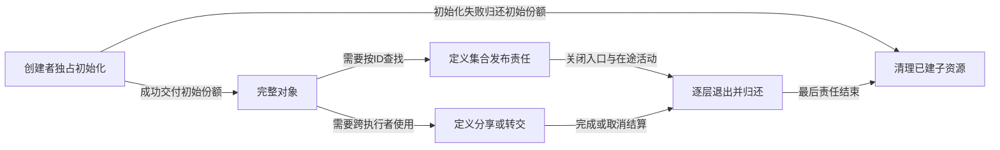
```mermaid
flowchart LR
    A[创建者独占初始化] -->|成功交付初始份额| B[完整对象]
    A -->|初始化失败归还初始份额| F[清理已建子资源]
    B -->|需要按ID查找| C[定义集合发布责任]
    B -->|需要跨执行者使用| D[定义分享或转交]
    C -->|关闭入口与在途活动| E[逐层退出并归还]
    D -->|完成或取消结算| E
    E -->|最后责任结束| F
```

模板按场景组织；同一场景中仍要选择具体条件。拥有型与非拥有型索引、共享与转交、普通RCU与锁保护，都有前面章节的完整实例可对照。本章会说明选择理由和改动位置，不能把某一模板提升为所有对象的固定规则。

## 13.2\_模板命名约定

名字让调用者提前形成预期，注释和实现负责兑现预期。已有子系统名称应遵守其公开契约，不必为加一个get后缀而改造整个接口。本章的自有接口采用下列词汇：

| 名称 | 希望读者读出的动作 | 必须在契约中补齐的条件 |
| --- | --- | --- |
| alloc/create | 创建并交付初始份额 | 返回的是半初始化内部对象还是完整可用对象；NULL或错误指针的规则 |
| get | 为独立责任增加一份 | 输入已有有效地址与正计数保证；不是任意指针测试 |
| get_unless_zero | 在有效地址期限内尝试取得 | 允许观察零值时如何拒绝，false不交付份额 |
| put | 消费调用者当前拥有的一份 | 是否允许NULL，是否可能成为最后归还及其上下文 |
| release | 接手最终清理责任 | 普通调用、接锁调用或延期清理，各自不同的退出条件 |
| lookup_get | 查找并返回拥有型对象 | 锁/RCU窗口、正计数条件、失败表示以及是否仅作业务状态快照 |
| publish/unpublish | 建立或撤下可查找关系 | 是否另取集合份额、转交初始份额，或采用非拥有索引 |
| enqueue_get | 为接收方保留额外一份 | 拒绝后的候选回滚；调用者原份额不变 |
| enqueue_take | 转交调用者的一份 | 是只在成功时消费，还是每种返回都消费；必须明确写出 |
| borrow | 在指定期限内临时使用 | 谁保持存储、期限终点是什么；可以同步使用，也可以由管理者等待异步借用退出 |

例如“take只在成功时消费”和“submit_or_discard无论成功失败都消费”都能形成正确协议，但调用方失败分支必须不同。不要从返回负数就自动补put，也不要把所有borrow解释成“绝不能交给另一个执行者”。上一章已经说明，是否跨函数或跨线程不直接决定是否需要独立份额。

发布与撤下尤其不能只靠名字猜：list_add不增加kref，list_del也不减少kref；若采用拥有型表，必须在发布动作旁写出那一份来自哪里。remove可能只消费集合份额，也可能额外结束管理者责任，后面模板须逐项说明。

## 13.3\_基础对象模板\_alloc\_init\_get\_put\_release

先建立一个有编号的对象，两个本地责任槽位轮流使用它。没有全局查找、没有线程或中断并发；这一限制让我们能够先把创建成功与创建失败都走到底，再增加发布机制。

### 13.3.1\_模板一\_最小\_kref\_对象模板

最小对象只需业务数据和ref，不需要为了“像驱动”而放一个没有定义归属的priv指针。下面是类型骨架，完整可构建程序在下一小节：

```c
struct template_object {
    struct kref ref;
    int id; /* 创建时赋值，交付以后本例保持不变。 */
};
```

创建者分配外壳并init，得到一份。若observer需要独立使用，就在creator仍持有份额时get；然后creator可以归还，observer仍能读id，最后observer归还触发release。这里没有“release对象还活着所以再用一会”的阶段；回调返回前后是否实际free由清理协议决定，原拥有者不能据此延长访问。

| 时点 | creator槽位 | observer槽位 | 存储与清理 |
| --- | --- | --- | --- |
| M0 分配失败 | 无份额 | 无份额 | 返回失败，不调用put |
| M1 创建成功 | 初始一份 | 无份额 | 尚无共享入口 |
| M2 分享 | 保留一份 | 新增一份 | 两个槽位可以独立结束 |
| M3 创建者退出 | 已归还 | 保留一份 | observer可继续读取 |
| M4 观察者退出 | 无份额 | 最后一份已归还 | 同步release释放外壳 |

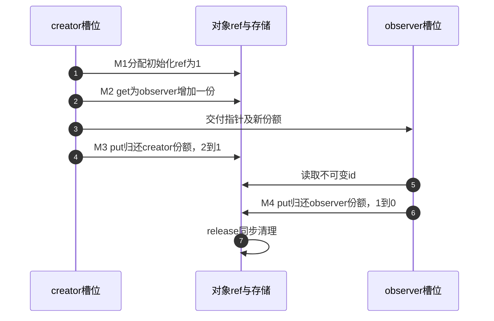
```mermaid
sequenceDiagram
    autonumber
    participant C as creator槽位
    participant O as 对象ref与存储
    participant R as observer槽位
    C->>O: M1分配初始化ref为1
    C->>O: M2 get为observer增加一份
    C->>R: 交付指针及新份额
    C->>O: M3 put归还creator份额，2到1
    R->>O: 读取不可变id
    R->>O: M4 put归还observer份额，1到0
    O->>O: release同步清理
```

普通get包装只统一类型和回调约定，不能为悬空输入补出合法期限。put包装是否接受NULL也由本层约定；下一例故意要求非空的有效拥有型对象，使错误指针和空指针必须在调用处处理。将本地creator置NULL只是结束本地槽位的使用，并不会清除其他别名。

最小模板没有子资源，所以回调只free外壳。接下来加一个独立缓冲区，观察“外壳已经建好，内部准备却失败”的分支如何沿相同责任规则清理。

### 13.3.2\_模板二\_alloc/init/get/put/release\_分层模板

外部调用者应只看到完整对象或明确失败；内部创建路径却要经过多个阶段。这里选择三个私有帮助函数：object_alloc建立外壳与初始份额，object_prepare准备缓冲区，object_create统一成功交付和错误编码。prepare只在创建者独占、尚未发布时调用一次，不是对象重置接口。

把分配与准备拆开是为了说明阶段与失败责任，不是要求所有小对象都拆出一组函数。如果一个create函数内已经能清楚表达这些分支，合写同样成立。也不必为每个半初始化状态新增布尔量：本例buffer初始为NULL，成功才持有分配，NULL本身就能表达“无需回收缓冲区”。

下面是完整模块，材料为[note_kref_create.c](../../../../labs/kernel/object_lifetime/materials/note_kref_create.c)。fail_stage只模拟确定的失败位置，让我们无需耗尽系统内存也能重复观察回滚；真实kzalloc/kstrdup返回NULL仍走相同失败出口。

```c
// SPDX-License-Identifier: GPL-2.0
#include <linux/err.h>
#include <linux/kref.h>
#include <linux/module.h>
#include <linux/slab.h>

struct template_object {
    struct kref ref;
    int id;
    char *buffer;
};
static int fail_stage;
module_param(fail_stage, int, 0444);
MODULE_PARM_DESC(fail_stage, "模拟失败阶段：0正常，1外壳，2缓冲区，3业务校验");
static unsigned int release_calls;

static void object_release(struct kref *ref)
{
    struct template_object *obj = container_of(ref, struct template_object, ref);
    kfree(obj->buffer); /* NULL表示该子资源尚未建立。 */
    ++release_calls; /* 记录保存在对象外，不在free后读取对象。 */
    kfree(obj);
}

static void object_put(struct template_object *obj)
{
    /* 只接受持有一份的有效对象，不接受NULL或ERR_PTR。 */
    kref_put(&obj->ref, object_release);
}

static struct template_object *object_get(struct template_object *obj)
{
    /* 调用者已有一份，新增的一份可交给另一责任槽位。 */
    kref_get(&obj->ref);
    return obj;
}

static struct template_object *object_alloc(int id)
{
    struct template_object *obj;
    if (fail_stage == 1)
        return NULL; /* 在取得任何分配前模拟失败。 */
    obj = kzalloc(sizeof(*obj), GFP_KERNEL);
    if (!obj)
        return NULL;
    kref_init(&obj->ref);
    obj->id = id;
    return obj; /* 仅交给内部创建路径，尚不能发布给业务用户。 */
}

static int object_prepare(struct template_object *obj)
{
    /* 前提：创建者独占、尚未发布、只调用一次。 */
    if (fail_stage == 2)
        return -ENOMEM;
    obj->buffer = kstrdup("ready", GFP_KERNEL);
    if (!obj->buffer)
        return -ENOMEM;
    if (fail_stage == 3)
        return -EINVAL; /* 已有子资源时模拟业务校验失败。 */
    return 0;
}

static struct template_object *object_create(int id)
{
    struct template_object *obj = object_alloc(id);
    int ret;
    if (!obj)
        return ERR_PTR(-ENOMEM);
    ret = object_prepare(obj);
    if (ret) {
        object_put(obj); /* 唯一回滚入口，处理半初始化对象。 */
        return ERR_PTR(ret);
    }
    return obj; /* 成功交付完整对象及初始一份；不负责发布。 */
}

static int __init note_template_init(void)
{
    struct template_object *creator, *observer;
    if (fail_stage < 0 || fail_stage > 3)
        return -EINVAL;
    creator = object_create(7);
    if (IS_ERR(creator)) {
        pr_info("note_template: stage=%d error=%ld releases=%u\n",
                fail_stage, PTR_ERR(creator), release_calls);
        return PTR_ERR(creator); /* 无对象交付，调用者不能再put。 */
    }
    observer = object_get(creator);
    object_put(creator);
    creator = NULL;
    pr_info("note_template: id=%d buffer=%s releases=%u\n",
            observer->id, observer->buffer, release_calls);
    object_put(observer);
    observer = NULL;
    pr_info("note_template: finished releases=%u\n", release_calls);
    return 0;
}

static void __exit note_template_exit(void)
{
    /* 使用均在init同步结束，无外部入口、异步工作或卸载等待。 */
}
module_init(note_template_init);
module_exit(note_template_exit);
MODULE_LICENSE("GPL");
MODULE_DESCRIPTION("分层创建与统一失败回滚模板");
```

程序把release_calls放在模块静态存储里，因而对象回收后还可以报告结果。由于所有操作都在模块初始化中同步完成，这个计数不需要跨线程原子更新；若改成并发服务，这个前提随即失效，不能原样复用。

#### (1)\_沿失败阶段检查资源与份额

| 阶段 | 已建立状态 | 返回给外部调用者 | 内部清理责任 |
| --- | --- | --- | --- |
| C0 外壳分配前或分配失败 | 无对象 | ERR_PTR(-ENOMEM) | 没有份额可put |
| C1 外壳成功、缓冲区失败 | 初始一份，buffer为NULL | ERR_PTR(-ENOMEM) | create归还初始一份，release只回收外壳 |
| C2 缓冲区成功、业务校验失败 | 初始一份，buffer有效 | ERR_PTR(-EINVAL) | 同一release先回收buffer，再回收外壳 |
| C3 创建成功 | 完整对象，初始一份 | 有效指针 | 调用者接手，随后按M2～M4分享和归还 |

object_create失败时，内部已经消费初始份额，外部得到的是错误值，不是待清理对象。IS_ERR分支只能取错误码返回，不能再object_put。内部alloc用NULL、对外create用ERR_PTR是明确的层次转换；若直接把NULL当作创建成功返回，IS_ERR(NULL)并不会替你发现这个设计错误。

本例选择统一release回滚，要求它认识所有可到达的部分初始化状态。不能再在object_create中手动kfree(buffer)却留下旧指针，再put进入同一个release；这会回收两次。若以后资源要求先停止硬件、睡眠等待或特殊解绑，必须重新安排管理者退出与最终回调，而不是仅按“逆序free”往这里添加操作。

#### (2)\_构建\_预测和观察

先按[外部模块构建入口](../../../../engineering/build/kernel_modules/大纲.md)准备与目标运行内核匹配的配置、头文件和工具链。在Linux构建环境中从仓库根目录执行以下命令；KERNEL_BUILD须指向已准备的内核构建树，交叉构建时按构建章设置ARCH和CROSS_COMPILE：

```bash
make -C "$KERNEL_BUILD" M="$PWD/labs/kernel/object_lifetime/materials" modules
```

将生成的note_kref_create.ko送到匹配内核的实验环境，再从模块所在目录分别观察。普通模式成功装入后要卸载，才能重新使用相同模块名；失败模式返回错误，模块未成功装入，不应紧接着假定它已在系统中。

```bash
sudo insmod ./note_kref_create.ko fail_stage=0
sudo dmesg | tail -n 12
sudo rmmod note_kref_create
sudo insmod ./note_kref_create.ko fail_stage=2
sudo dmesg | tail -n 12
```

预期普通模式先打印id=7、buffer=ready、releases=0，因为observer还持有一份；归还observer后打印finished releases=1。失败阶段1尚无对象，releases为0；阶段2和3都会进入release一次，分别表示空缓冲区清理和完整缓冲区清理。insmod错误文字可能随工具和系统不同，以模块打印的阶段、错误码与清理次数核对因果。

配套宿主检查通过八个用例：正常周期、三个模拟失败、两个真实分配返回NULL替身、两个非法参数。使用固定普通引用函数，分配/模块注册/错误指针等环境为明确替身，不是Linux装卸测试。ARM前端检查通过，所用354份头文件中的342份非生成源码相对NXP固定提交无差异；本轮没有目标链接、装卸或真实并发结果。上面的命令供目标实验执行，不作为已经运行过的记录。

#### (3)\_小修改与下一步

先预测把observer的get删除会怎样：creator归还初始一份后对象已清理，observer只是旧地址；这不是“仍有一个指针所以计数应当为1”。不要在内核中执行这个错误变体，可用P12离线账本验证责任断点。

再把业务校验失败移到buffer分配以前，清理回调仍应执行一次，但只回收外壳；这说明“调用release一次”和“释放了哪些资源”不是同一个观察指标。最后考虑新增第二块缓冲区：它的初始状态、成功赋值点和部分失败清理必须一起更新，不能只在成功路径增加一次分配。

至此创建函数能交付一份完整对象，失败也没有遗留责任。下一节要让其他调用者按ID找到它：此时必须决定集合接手初始份额还是另外取得一份，并解决发布重复、查找与撤下的并发窗口。

------

## 13.4\_lookup\_集合模板\_list\_hash\_xarray

### 13.4.1\_模板三\_list\_+\_mutex\_+\_kref\_lookup\_模板

这是最常见的非 RCU 模型。

对象：

```c
struct my_obj {
	struct kref ref;
	struct list_head node;

	struct mutex lock;
	bool dying;

	int id;
};

static LIST_HEAD(my_obj_list);
static DEFINE_MUTEX(my_obj_list_lock);
```

release：

```c
static void my_obj_release(struct kref *ref)
{
	struct my_obj *obj = container_of(ref, struct my_obj, ref);

	WARN_ON(!list_empty(&obj->node));

	kfree(obj);
}
```

alloc：

```c
static struct my_obj *my_obj_alloc(int id)
{
	struct my_obj *obj;

	obj = kzalloc(sizeof(*obj), GFP_KERNEL);
	if (!obj)
		return NULL;

	kref_init(&obj->ref);
	INIT_LIST_HEAD(&obj->node);
	mutex_init(&obj->lock);

	obj->id = id;
	obj->dying = false;

	return obj;
}
```

publish：

```c
static void my_obj_publish(struct my_obj *obj)
{
	mutex_lock(&my_obj_list_lock);
	list_add_tail(&obj->node, &my_obj_list);
	mutex_unlock(&my_obj_list_lock);
}
```

lookup + get：

```c
static struct my_obj *my_obj_lookup_get(int id)
{
	struct my_obj *obj;

	mutex_lock(&my_obj_list_lock);

	list_for_each_entry(obj, &my_obj_list, node) {
		if (obj->id != id)
			continue;

		kref_get(&obj->ref);
		mutex_unlock(&my_obj_list_lock);

		return obj;
	}

	mutex_unlock(&my_obj_list_lock);
	return NULL;
}
```

如果 remove 后要禁止新用户进入，需要加入 `dying` 检查。

```c
static struct my_obj *my_obj_lookup_get_live(int id)
{
	struct my_obj *obj;

	mutex_lock(&my_obj_list_lock);

	list_for_each_entry(obj, &my_obj_list, node) {
		if (obj->id != id)
			continue;

		mutex_lock(&obj->lock);
		if (obj->dying) {
			mutex_unlock(&obj->lock);
			mutex_unlock(&my_obj_list_lock);
			return NULL;
		}

		kref_get(&obj->ref);

		mutex_unlock(&obj->lock);
		mutex_unlock(&my_obj_list_lock);

		return obj;
	}

	mutex_unlock(&my_obj_list_lock);
	return NULL;
}
```

使用：

```c
static int my_obj_use_by_id(int id)
{
	struct my_obj *obj;
	int ret;

	obj = my_obj_lookup_get_live(id);
	if (!obj)
		return -ENOENT;

	ret = do_something(obj);

	my_obj_put(obj);
	return ret;
}
```

remove：

```c
static void my_obj_remove(struct my_obj *obj)
{
	mutex_lock(&my_obj_list_lock);

	mutex_lock(&obj->lock);
	obj->dying = true;
	mutex_unlock(&obj->lock);

	list_del_init(&obj->node);

	mutex_unlock(&my_obj_list_lock);

	my_obj_put(obj);
}
```

生命周期图：

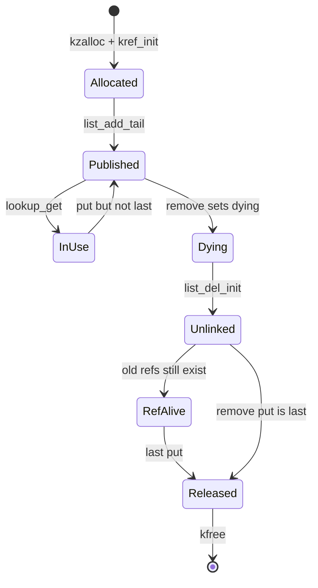
```mermaid
stateDiagram-v2
    [*] --> Allocated: kzalloc + kref_init
    Allocated --> Published: list_add_tail
    Published --> InUse: lookup_get
    InUse --> Published: put but not last
    Published --> Dying: remove sets dying
    Dying --> Unlinked: list_del_init
    Unlinked --> RefAlive: old refs still exist
    RefAlive --> Released: last put
    Unlinked --> Released: remove put is last
    Released --> [*]: kfree
```

关键规则：

```text
list_lock 保护集合关系；
obj->lock 保护 dying/state；
kref 保护离开锁后的对象生命周期；
release 只在对象已经脱链后 kfree。
```

------

### 13.4.2\_模板四\_hash/list\_+\_spinlock\_+\_kref\_lookup\_模板

如果对象在原子上下文或中断相关路径使用，可能需要 `spinlock_t`。

对象：

```c
#define MY_OBJ_HASH_BITS 6
#define MY_OBJ_HASH_SIZE (1 << MY_OBJ_HASH_BITS)

struct my_obj {
	struct kref ref;
	struct hlist_node node;

	spinlock_t lock;
	bool dying;

	u32 id;
};

static struct hlist_head my_obj_table[MY_OBJ_HASH_SIZE];
static DEFINE_SPINLOCK(my_obj_table_lock);
```

初始化 hash table：

```c
static void my_obj_table_init(void)
{
	int i;

	for (i = 0; i < MY_OBJ_HASH_SIZE; i++)
		INIT_HLIST_HEAD(&my_obj_table[i]);
}
```

hash 函数：

```c
static unsigned int my_obj_hash(u32 id)
{
	return hash_32(id, MY_OBJ_HASH_BITS);
}
```

publish：

```c
static void my_obj_publish(struct my_obj *obj)
{
	unsigned long flags;
	unsigned int h = my_obj_hash(obj->id);

	spin_lock_irqsave(&my_obj_table_lock, flags);
	hlist_add_head(&obj->node, &my_obj_table[h]);
	spin_unlock_irqrestore(&my_obj_table_lock, flags);
}
```

lookup + get：

```c
static struct my_obj *my_obj_lookup_get(u32 id)
{
	struct my_obj *obj;
	unsigned long flags;
	unsigned int h = my_obj_hash(id);

	spin_lock_irqsave(&my_obj_table_lock, flags);

	hlist_for_each_entry(obj, &my_obj_table[h], node) {
		if (obj->id != id)
			continue;

		spin_lock(&obj->lock);
		if (obj->dying) {
			spin_unlock(&obj->lock);
			spin_unlock_irqrestore(&my_obj_table_lock, flags);
			return NULL;
		}

		kref_get(&obj->ref);

		spin_unlock(&obj->lock);
		spin_unlock_irqrestore(&my_obj_table_lock, flags);

		return obj;
	}

	spin_unlock_irqrestore(&my_obj_table_lock, flags);
	return NULL;
}
```

remove：

```c
static void my_obj_remove(struct my_obj *obj)
{
	unsigned long flags;

	spin_lock_irqsave(&my_obj_table_lock, flags);

	spin_lock(&obj->lock);
	obj->dying = true;
	spin_unlock(&obj->lock);

	hlist_del_init(&obj->node);

	spin_unlock_irqrestore(&my_obj_table_lock, flags);

	my_obj_put(obj);
}
```

release：

```c
static void my_obj_release(struct kref *ref)
{
	struct my_obj *obj = container_of(ref, struct my_obj, ref);

	WARN_ON(!hlist_unhashed(&obj->node));

	kfree(obj);
}
```

注意：

```text
spinlock 版本要求 release 不能睡眠；
如果 release 需要睡眠，最后 put 不能发生在 spinlock/irq 上下文；
或者 release 需要转 workqueue。
```

锁顺序建议固定：

```text
先拿 table_lock；
再拿 obj->lock；
不要反过来。
```

锁顺序图：

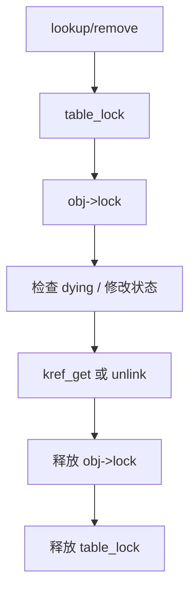
```mermaid
flowchart TD
    A["lookup/remove"] --> B["table_lock"]
    B --> C["obj->lock"]
    C --> D["检查 dying / 修改状态"]
    D --> E["kref_get 或 unlink"]
    E --> F["释放 obj->lock"]
    F --> G["释放 table_lock"]
```

------

### 13.4.3\_模板五\_xarray\_+\_kref\_lookup\_模板

如果对象按整数 ID 管理，可以使用 xarray。

这里给一个保守模板：

```text
使用外部 mutex 保护 xarray 修改和 lookup + get 窗口。
```

对象：

```c
#include <linux/xarray.h>

struct my_obj {
	struct kref ref;

	struct mutex lock;
	bool dying;

	u32 id;
};

static DEFINE_XARRAY(my_obj_xa);
static DEFINE_MUTEX(my_obj_xa_lock);
```

publish：

```c
static int my_obj_publish(struct my_obj *obj)
{
	int ret;

	mutex_lock(&my_obj_xa_lock);
	ret = xa_insert(&my_obj_xa, obj->id, obj, GFP_KERNEL);
	mutex_unlock(&my_obj_xa_lock);

	return ret;
}
```

lookup + get：

```c
static struct my_obj *my_obj_lookup_get(u32 id)
{
	struct my_obj *obj;

	mutex_lock(&my_obj_xa_lock);

	obj = xa_load(&my_obj_xa, id);
	if (!obj)
		goto out_unlock;

	mutex_lock(&obj->lock);
	if (obj->dying) {
		mutex_unlock(&obj->lock);
		obj = NULL;
		goto out_unlock;
	}

	kref_get(&obj->ref);
	mutex_unlock(&obj->lock);

out_unlock:
	mutex_unlock(&my_obj_xa_lock);
	return obj;
}
```

remove：

```c
static void my_obj_remove(struct my_obj *obj)
{
	mutex_lock(&my_obj_xa_lock);

	mutex_lock(&obj->lock);
	obj->dying = true;
	mutex_unlock(&obj->lock);

	xa_erase(&my_obj_xa, obj->id);

	mutex_unlock(&my_obj_xa_lock);

	my_obj_put(obj);
}
```

release：

```c
static void my_obj_release(struct kref *ref)
{
	struct my_obj *obj = container_of(ref, struct my_obj, ref);

	kfree(obj);
}
```

这里没有在 release 里 `xa_erase()`，因为采用的是：

```text
remove 取消发布；
release 只做最终释放。
```

所有权表：

| 持有者        | get 来源              | put 位置          |
| ------------- | --------------------- | ----------------- |
| 创建者/发布者 | `kref_init()`         | `my_obj_remove()` |
| lookup 用户   | `my_obj_lookup_get()` | 使用结束          |
| 异步路径      | handoff 前 get        | 异步完成          |

注意：

```text
xa_load 只是拿到指针；
不能离开 xa_lock 后再 get；
必须在同一保护窗口里完成 lookup + get。
```

流程图：

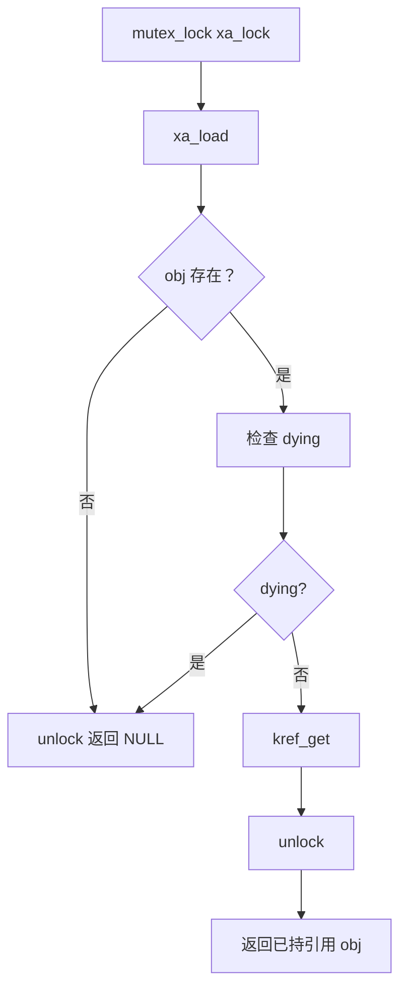
```mermaid
flowchart TD
    A["mutex_lock xa_lock"] --> B["xa_load"]
    B --> C{"obj 存在？"}
    C -- "否" --> D["unlock 返回 NULL"]
    C -- "是" --> E["检查 dying"]
    E --> F{"dying?"}
    F -- "是" --> D
    F -- "否" --> G["kref_get"]
    G --> H["unlock"]
    H --> I["返回已持引用 obj"]
```

------

## 13.5\_handoff\_异步模板\_work\_timer\_completion\_错误回滚

### 13.5.1\_模板六\_workqueue\_handoff\_模板

workqueue 是 kref 最常见的 handoff 场景之一。

对象：

```c
struct my_obj {
	struct kref ref;
	struct work_struct work;

	spinlock_t lock;
	bool work_pending;
	bool dying;
};
```

初始化：

```c
static struct my_obj *my_obj_alloc(void)
{
	struct my_obj *obj;

	obj = kzalloc(sizeof(*obj), GFP_KERNEL);
	if (!obj)
		return NULL;

	kref_init(&obj->ref);
	INIT_WORK(&obj->work, my_obj_workfn);
	spin_lock_init(&obj->lock);

	obj->work_pending = false;
	obj->dying = false;

	return obj;
}
```

#### (1)\_模型\_A\_每次成功投递\_work\_work\_持有一份引用

```c
static int my_obj_schedule_work(struct my_obj *obj)
{
	unsigned long flags;
	bool queue;

	spin_lock_irqsave(&obj->lock, flags);

	if (obj->dying || obj->work_pending) {
		spin_unlock_irqrestore(&obj->lock, flags);
		return -EBUSY;
	}

	obj->work_pending = true;
	kref_get(&obj->ref);

	spin_unlock_irqrestore(&obj->lock, flags);

	queue = schedule_work(&obj->work);
	if (!queue) {
		/*
		 * 理论上如果 work_pending 自己维护正确，
		 * 这里不应该失败。
		 *
		 * 但为了模板完整，失败要回滚引用和状态。
		 */
		spin_lock_irqsave(&obj->lock, flags);
		obj->work_pending = false;
		spin_unlock_irqrestore(&obj->lock, flags);

		my_obj_put(obj);
		return -EBUSY;
	}

	return 0;
}
```

work 回调：

```c
static void my_obj_workfn(struct work_struct *work)
{
	struct my_obj *obj = container_of(work, struct my_obj, work);

	do_work(obj);

	spin_lock_irq(&obj->lock);
	obj->work_pending = false;
	spin_unlock_irq(&obj->lock);

	my_obj_put(obj);
}
```

这个模型的所有权：

| 持有者 | get                          | put         |
| ------ | ---------------------------- | ----------- |
| work   | schedule 成功前 `kref_get()` | workfn 结束 |

#### (2)\_模型\_B\_调用者当前引用\_handoff\_给\_work

这种模型更危险，但有时很清楚。

```c
/*
 * 成功后，work 接管调用者当前引用。
 * 调用者不能再访问 obj，也不能再 put。
 */
static int my_obj_schedule_work_take(struct my_obj *obj)
{
	if (!schedule_work(&obj->work))
		return -EBUSY;

	return 0;
}
```

work 回调：

```c
static void my_obj_workfn(struct work_struct *work)
{
	struct my_obj *obj = container_of(work, struct my_obj, work);

	do_work(obj);

	my_obj_put(obj);
}
```

调用者：

```c
obj = my_obj_lookup_get(id);
if (!obj)
	return -ENOENT;

ret = my_obj_schedule_work_take(obj);
if (ret) {
	/*
	 * 失败时 work 没有接管引用；
	 * 当前路径仍然负责 put。
	 */
	my_obj_put(obj);
	return ret;
}

/*
 * 成功后不能访问 obj。
 */
return 0;
```

handoff 图：

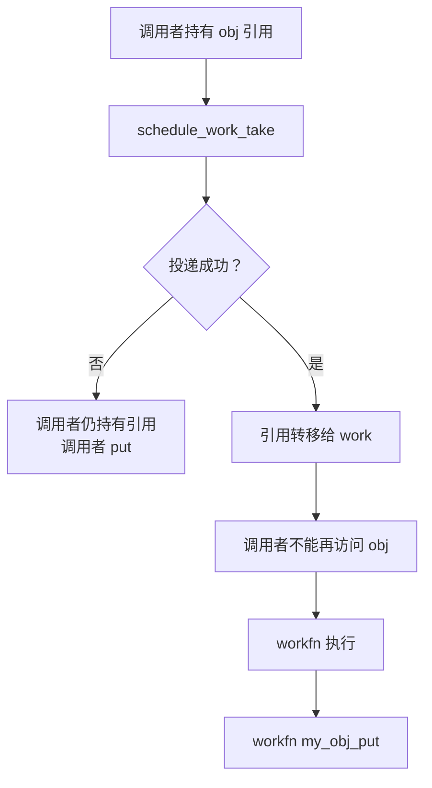
```mermaid
flowchart TD
    A["调用者持有 obj 引用"] --> B["schedule_work_take"]
    B --> C{"投递成功？"}
    C -- "否" --> D["调用者仍持有引用<br/>调用者 put"]
    C -- "是" --> E["引用转移给 work"]
    E --> F["调用者不能再访问 obj"]
    F --> G["workfn 执行"]
    G --> H["workfn my_obj_put"]
```

建议：

```text
普通代码优先用模型 A；
只有所有权转移非常明确时，才用模型 B。
```

------

### 13.5.2\_模板七\_timer\_handoff\_模板

本模板的 timer_pending 是对象自己的票据标志，不等于内核 timer_pending() 的快照：所有启动者必须经过同一 lock 和 dying/timer_pending 检查，移除者保留初始份额直到同步删除返回；不允许绕过此协议的改期或重启。回调清标志后仍凭自己的那一份执行，不能把标志为假读成回调已退出。[P06 定时器责任模型](P06_release_回调与复杂销毁模式.md#6.7.3_release_和_timer_的收尾关系)比较重复改期与最终 shutdown；本模板不能直接用作 timer/work 相互重启的通用关闭方案。

timer 回调通常不能睡眠。

对象：

```c
struct my_obj {
	struct kref ref;
	struct timer_list timer;

	spinlock_t lock;
	bool timer_pending;
	bool dying;
};
```

初始化：

```c
timer_setup(&obj->timer, my_obj_timerfn, 0);
```

启动 timer：

```c
static int my_obj_start_timer(struct my_obj *obj, unsigned long expires)
{
	unsigned long flags;

	spin_lock_irqsave(&obj->lock, flags);

	if (obj->dying || obj->timer_pending) {
		spin_unlock_irqrestore(&obj->lock, flags);
		return -EBUSY;
	}

	obj->timer_pending = true;
	kref_get(&obj->ref);

	mod_timer(&obj->timer, expires);

	spin_unlock_irqrestore(&obj->lock, flags);

	return 0;
}
```

timer 回调：

```c
static void my_obj_timerfn(struct timer_list *t)
{
	struct my_obj *obj = from_timer(obj, t, timer);

	spin_lock(&obj->lock);
	obj->timer_pending = false;
	spin_unlock(&obj->lock);

	handle_timeout(obj);

	my_obj_put(obj);
}
```

remove 时取消 timer：

```c
static void my_obj_remove(struct my_obj *obj)
{
	spin_lock_irq(&obj->lock);
	obj->dying = true;
	spin_unlock_irq(&obj->lock);

	if (del_timer_sync(&obj->timer)) {
		/*
		 * timer 成功删除，说明 timerfn 不会再为这次 pending 执行；
		 * 之前给 timer 的引用需要在 remove 路径归还。
		 */
		spin_lock_irq(&obj->lock);
		obj->timer_pending = false;
		spin_unlock_irq(&obj->lock);

		my_obj_put(obj);
	}

	my_obj_put(obj);
}
```

注意：

```text
在已阻止重启且票据逐次归属明确的前提下，同步删除返回值帮助确定 pending 票据由谁归还；不能只凭返回值从任意 timer 历史推算引用。
```

典型规则：

```text
启动 timer 成功：
    timer 持有引用。

timerfn 执行：
    timerfn 末尾 put。

remove 成功 del_timer_sync：
    timerfn 不会执行，remove 负责 put timer 引用。
```

流程图：

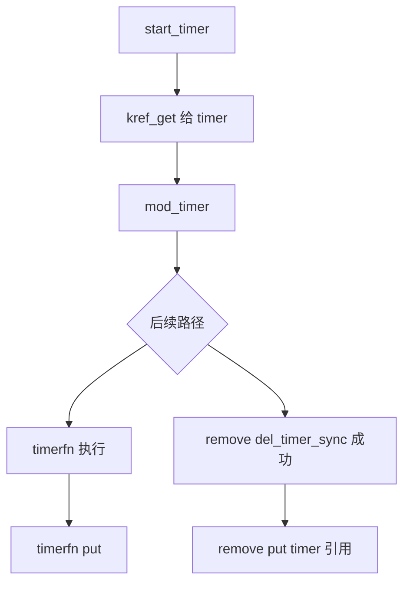
```mermaid
flowchart TD
    A["start_timer"] --> B["kref_get 给 timer"]
    B --> C["mod_timer"]
    C --> D{"后续路径"}
    D --> E["timerfn 执行"]
    E --> F["timerfn put"]
    D --> G["remove del_timer_sync 成功"]
    G --> H["remove put timer 引用"]
```

------

### 13.5.3\_模板八\_completion\_/\_wait\_用户持有模板

有些对象会被用户等待完成。

对象：

```c
struct my_request {
	struct kref ref;
	struct completion done;

	struct mutex lock;
	int status;
	bool completed;
};
```

创建：

```c
static struct my_request *my_request_alloc(void)
{
	struct my_request *req;

	req = kzalloc(sizeof(*req), GFP_KERNEL);
	if (!req)
		return NULL;

	kref_init(&req->ref);
	init_completion(&req->done);
	mutex_init(&req->lock);

	req->completed = false;
	req->status = 0;

	return req;
}
```

waiter 获取引用：

```c
static int my_request_wait(struct my_request *req)
{
	int status;

	kref_get(&req->ref);

	wait_for_completion(&req->done);

	mutex_lock(&req->lock);
	status = req->status;
	mutex_unlock(&req->lock);

	my_request_put(req);

	return status;
}
```

完成路径：

```c
static void my_request_complete(struct my_request *req, int status)
{
	mutex_lock(&req->lock);
	req->status = status;
	req->completed = true;
	mutex_unlock(&req->lock);

	complete_all(&req->done);
}
```

最后 put：

```c
static void my_request_release(struct kref *ref)
{
	struct my_request *req = container_of(ref, struct my_request, ref);

	kfree(req);
}

static void my_request_put(struct my_request *req)
{
	kref_put(&req->ref, my_request_release);
}
```

注意：

```text
completion 只解决等待唤醒；
不自动保护 req 生命周期；
等待者如果要在等待后访问 req，必须持有引用。
```

关系图：

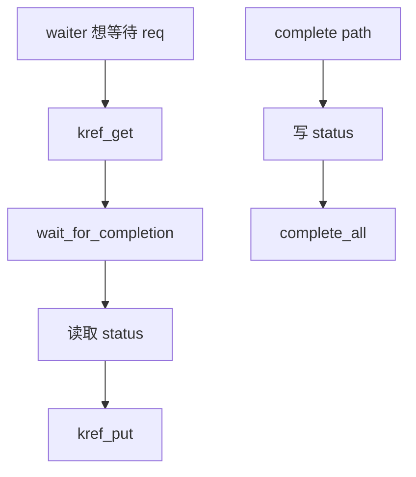
```mermaid
flowchart TD
    A["waiter 想等待 req"] --> B["kref_get"]
    B --> C["wait_for_completion"]
    C --> D["读取 status"]
    D --> E["kref_put"]

    F["complete path"] --> G["写 status"]
    G --> H["complete_all"]
```

------

### 13.5.4\_模板九\_error\_path\_回滚模板

错误路径最容易漏 put 或多 put。

建议按阶段写 label。

对象创建流程：

```c
static struct my_obj *my_obj_create_full(int id)
{
	struct my_obj *obj;
	int ret;

	obj = my_obj_alloc(id);
	if (!obj)
		return ERR_PTR(-ENOMEM);

	ret = my_obj_init_buffer(obj);
	if (ret)
		goto err_put;

	ret = my_obj_init_hw(obj);
	if (ret)
		goto err_free_buffer;

	ret = my_obj_publish(obj);
	if (ret)
		goto err_cleanup_hw;

	return obj;

err_cleanup_hw:
	my_obj_cleanup_hw(obj);

err_free_buffer:
	my_obj_free_buffer(obj);

err_put:
	my_obj_put(obj);

	return ERR_PTR(ret);
}
```

这里有一个原则：

```text
谁初始化，谁回滚；
最后统一 put 初始引用。
```

如果子资源统一在 release 中释放，也可以简化：

```c
static struct my_obj *my_obj_create_full(int id)
{
	struct my_obj *obj;
	int ret;

	obj = my_obj_alloc(id);
	if (!obj)
		return ERR_PTR(-ENOMEM);

	ret = my_obj_init_buffer(obj);
	if (ret)
		goto err_put;

	ret = my_obj_init_hw(obj);
	if (ret)
		goto err_put;

	ret = my_obj_publish(obj);
	if (ret)
		goto err_put;

	return obj;

err_put:
	my_obj_put(obj);
	return ERR_PTR(ret);
}
```

但是这要求 release 能正确处理部分初始化状态。

例如：

```c
static void my_obj_release(struct kref *ref)
{
	struct my_obj *obj = container_of(ref, struct my_obj, ref);

	if (obj->hw_inited)
		my_obj_cleanup_hw(obj);

	kfree(obj->buffer);
	kfree(obj);
}
```

不建议混合两种风格。

#### (1)\_风格\_A\_错误路径逐级回滚

优点：

```text
每个失败点释放已经初始化的资源；
release 只处理完整对象最终释放。
```

缺点：

```text
错误标签较多。
```

#### (2)\_风格\_B\_release\_统一处理

优点：

```text
错误路径简单，失败就 put。
```

缺点：

```text
release 必须能处理半初始化对象；
需要 inited 标志。
```

对比图：

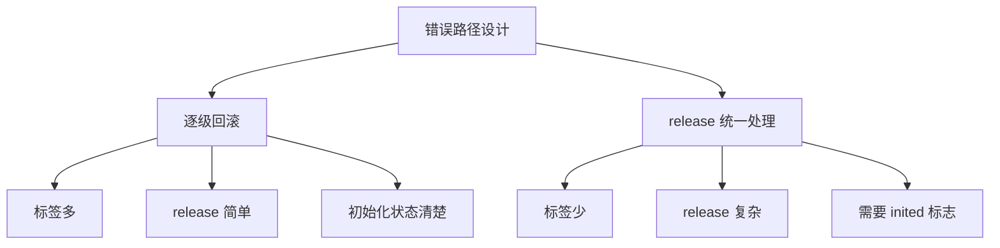
```mermaid
flowchart TD
    A["错误路径设计"] --> B["逐级回滚"]
    A --> C["release 统一处理"]

    B --> B1["标签多"]
    B --> B2["release 简单"]
    B --> B3["初始化状态清楚"]

    C --> C1["标签少"]
    C --> C2["release 复杂"]
    C --> C3["需要 inited 标志"]
```

建议：

```text
小对象可以 release 统一处理；
复杂对象优先逐级回滚；
不要两种风格混在一起。
```

------

## 13.6\_删除和弱引用模板\_remove\_RCU\_缓存指针

### 13.6.1\_模板十\_remove\_/\_unlink\_/\_drain\_/\_release\_模板

这是驱动里最重要的模板之一。

remove 不是简单：

```c
list_del();
kref_put();
```

真实 remove 通常要分阶段：

```text
1. 标记 dying，阻止新用户进入。
2. 从 lookup 结构取消发布。
3. 停止新请求提交。
4. 取消 timer/work/callback。
5. drain 已有异步路径。
6. 停止硬件或底层资源。
7. put 发布引用。
8. 最后 release 释放对象本体。
```

对象：

```c
struct my_obj {
	struct kref ref;
	struct list_head node;

	struct mutex lock;
	bool dying;

	struct work_struct work;
	struct timer_list timer;
	bool work_pending;
	bool timer_pending;

	void *buffer;
};
```

remove 模板：

以下流程依赖所有异步入口已被 dying 协议关闭；timer 若与 work 相互重启，必须先采用[P06 最终关闭顺序](P06_release_回调与复杂销毁模式.md#6.7.4_release_不应该负责模糊的_timer_语义)解决重新启动，再结合实际持票/借用模型结算责任。timer_pending 诊断本身不证明回调退出。

```c
static void my_obj_remove(struct my_obj *obj)
{
	/*
	 * 1. 阻止新业务进入。
	 */
	mutex_lock(&obj->lock);
	obj->dying = true;
	mutex_unlock(&obj->lock);

	/*
	 * 2. 从 lookup 集合取消发布。
	 */
	mutex_lock(&my_obj_list_lock);
	if (!list_empty(&obj->node))
		list_del_init(&obj->node);
	mutex_unlock(&my_obj_list_lock);

	/*
	 * 3. 取消 timer。
	 * 如果 timer 被成功删除，归还 timer 持有的引用。
	 */
	if (del_timer_sync(&obj->timer)) {
		mutex_lock(&obj->lock);
		obj->timer_pending = false;
		mutex_unlock(&obj->lock);

		my_obj_put(obj);
	}

	/*
	 * 4. drain work。
	 * 这里是否需要 put，取决于你的 work 引用归属模型。
	 */
	cancel_work_sync(&obj->work);

	/*
	 * 5. 停止硬件 / 阻止新 IO / drain 队列。
	 */
	my_obj_stop_io(obj);
	my_obj_drain_queue(obj);

	/*
	 * 6. 释放发布者持有的初始引用。
	 */
	my_obj_put(obj);
}
```

release：

```c
static void my_obj_release(struct kref *ref)
{
	struct my_obj *obj = container_of(ref, struct my_obj, ref);

	WARN_ON(!list_empty(&obj->node));
	WARN_ON(timer_pending(&obj->timer));

	kfree(obj->buffer);
	kfree(obj);
}
```

remove 流程图：

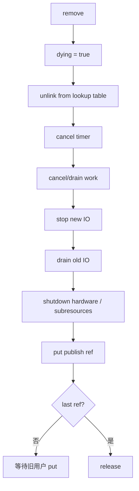
```mermaid
flowchart TD
    A["remove"] --> B["dying = true"]
    B --> C["unlink from lookup table"]
    C --> D["cancel timer"]
    D --> E["cancel/drain work"]
    E --> F["stop new IO"]
    F --> G["drain old IO"]
    G --> H["shutdown hardware / subresources"]
    H --> I["put publish ref"]
    I --> J{"last ref?"}
    J -- "否" --> K["等待旧用户 put"]
    J -- "是" --> L["release"]
```

注意：

```text
kref 只保证 obj 内存存在；
remove 还必须保证业务资源不会被旧用户错误访问。
```

所以旧用户路径应该检查：

```c
mutex_lock(&obj->lock);
if (obj->dying) {
	mutex_unlock(&obj->lock);
	return -ENODEV;
}
mutex_unlock(&obj->lock);
```

------

### 13.6.2\_模板十一\_RCU\_lookup\_+\_kref\_get\_unless\_zero\_+\_kfree\_rcu

对象：

```c
struct my_obj {
	struct kref ref;
	struct rcu_head rcu;
	struct list_head node;

	spinlock_t lock;
	bool dying;

	int id;
};

static LIST_HEAD(my_obj_list);
static DEFINE_SPINLOCK(my_obj_list_lock);
```

release：

```c
static void my_obj_release(struct kref *ref)
{
	struct my_obj *obj = container_of(ref, struct my_obj, ref);

	kfree_rcu(obj, rcu);
}
```

publish：

```c
static void my_obj_publish(struct my_obj *obj)
{
	spin_lock(&my_obj_list_lock);
	list_add_rcu(&obj->node, &my_obj_list);
	spin_unlock(&my_obj_list_lock);
}
```

lookup + get：

```c
static struct my_obj *my_obj_lookup_get_rcu(int id)
{
	struct my_obj *obj;
	struct my_obj *found = NULL;

	rcu_read_lock();

	list_for_each_entry_rcu(obj, &my_obj_list, node) {
		if (obj->id != id)
			continue;

		if (!kref_get_unless_zero(&obj->ref))
			break;

		spin_lock(&obj->lock);
		if (obj->dying) {
			spin_unlock(&obj->lock);
			rcu_read_unlock();

			my_obj_put(obj);
			return NULL;
		}
		spin_unlock(&obj->lock);

		found = obj;
		break;
	}

	rcu_read_unlock();

	return found;
}
```

remove：

```c
static void my_obj_remove(struct my_obj *obj)
{
	spin_lock(&obj->lock);
	obj->dying = true;
	spin_unlock(&obj->lock);

	spin_lock(&my_obj_list_lock);
	list_del_rcu(&obj->node);
	spin_unlock(&my_obj_list_lock);

	my_obj_put(obj);
}
```

使用：

```c
static int my_obj_use_rcu(int id)
{
	struct my_obj *obj;
	int ret;

	obj = my_obj_lookup_get_rcu(id);
	if (!obj)
		return -ENOENT;

	ret = do_something(obj);

	my_obj_put(obj);
	return ret;
}
```

RCU 模板图：

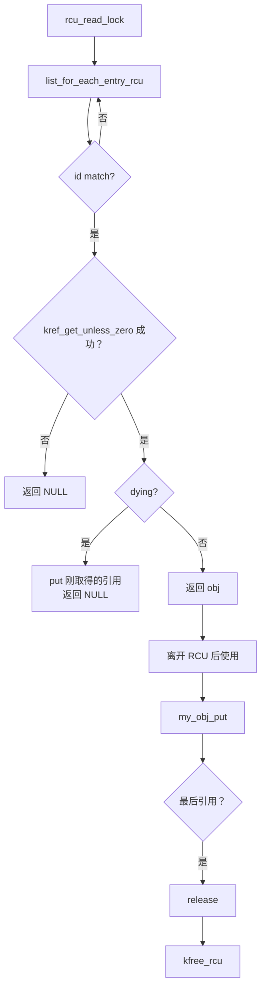
```mermaid
flowchart TD
    A["rcu_read_lock"] --> B["list_for_each_entry_rcu"]
    B --> C{"id match?"}
    C -- "否" --> B
    C -- "是" --> D{"kref_get_unless_zero 成功？"}
    D -- "否" --> E["返回 NULL"]
    D -- "是" --> F{"dying?"}
    F -- "是" --> G["put 刚取得的引用<br/>返回 NULL"]
    F -- "否" --> H["返回 obj"]
    H --> I["离开 RCU 后使用"]
    I --> J["my_obj_put"]
    J --> K{"最后引用？"}
    K -- "是" --> L["release"]
    L --> M["kfree_rcu"]
```

关键规则：

```text
RCU 保护 lookup 到 get_unless_zero 的窗口；
kref 保护离开 RCU 后的生命周期；
dying 保护逻辑可用性；
kfree_rcu 保护最终内存释放。
```

------

### 13.6.3\_模板十二\_弱引用缓存指针模板

有时对象会被缓存成弱引用。

例如：

```c
struct my_holder {
	struct my_obj __rcu *cached;
};
```

注意：

```text
弱引用指针不拥有对象；
不能直接使用；
必须转换成强引用。
```

获取强引用：

```c
static struct my_obj *my_holder_get_cached(struct my_holder *holder)
{
	struct my_obj *obj;

	rcu_read_lock();

	obj = rcu_dereference(holder->cached);
	if (obj && !kref_get_unless_zero(&obj->ref))
		obj = NULL;

	rcu_read_unlock();

	return obj;
}
```

更新缓存：

```c
static void my_holder_set_cached(struct my_holder *holder,
				 struct my_obj *obj)
{
	rcu_assign_pointer(holder->cached, obj);
}
```

清除缓存：

```c
static void my_holder_clear_cached(struct my_holder *holder)
{
	rcu_assign_pointer(holder->cached, NULL);
}
```

使用：

```c
obj = my_holder_get_cached(holder);
if (!obj)
	return -ENOENT;

ret = do_something(obj);

my_obj_put(obj);
```

错误写法：

```c
obj = rcu_dereference(holder->cached);
do_something(obj);   /* 错误：没有长期引用 */
```

弱引用转换图：

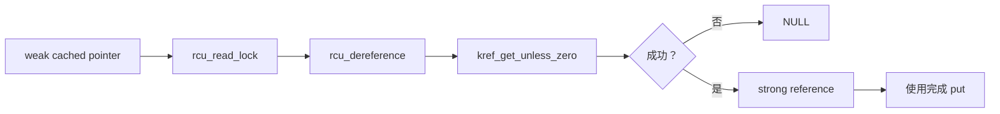
```mermaid
flowchart LR
    A["weak cached pointer"] --> B["rcu_read_lock"]
    B --> C["rcu_dereference"]
    C --> D["kref_get_unless_zero"]
    D --> E{"成功？"}
    E -- "否" --> F["NULL"]
    E -- "是" --> G["strong reference"]
    G --> H["使用完成 put"]
```

------

## 13.7\_分层持有模板\_父子对象\_file\_包装函数\_状态机

### 13.7.1\_模板十三\_父子对象引用模板

有些对象有父子关系。

例如：

```c
struct my_parent {
	struct kref ref;
	struct mutex lock;
	bool dying;

	struct list_head child_list;
};

struct my_child {
	struct kref ref;
	struct my_parent *parent;
	struct list_head node;
};
```

这里必须定义：

```text
child 是否持有 parent 引用？
parent 是否持有 child 引用？
remove parent 时如何处理 child？
child release 时能否访问 parent？
```

一种清晰模型是：

```text
child 创建成功后，child 持有 parent 引用；
child release 时 put parent；
parent 的 child_list 只是集合关系；
parent remove 时阻止新 child 创建，并 drain 旧 child。
```

parent get/put：

```c
static void my_parent_release(struct kref *ref)
{
	struct my_parent *parent = container_of(ref, struct my_parent, ref);

	kfree(parent);
}

static void my_parent_get(struct my_parent *parent)
{
	kref_get(&parent->ref);
}

static void my_parent_put(struct my_parent *parent)
{
	kref_put(&parent->ref, my_parent_release);
}
```

child release：

```c
static void my_child_release(struct kref *ref)
{
	struct my_child *child = container_of(ref, struct my_child, ref);
	struct my_parent *parent = child->parent;

	kfree(child);

	my_parent_put(parent);
}
```

child 创建：

```c
static struct my_child *my_child_create(struct my_parent *parent)
{
	struct my_child *child;

	mutex_lock(&parent->lock);
	if (parent->dying) {
		mutex_unlock(&parent->lock);
		return ERR_PTR(-ENODEV);
	}

	my_parent_get(parent);
	mutex_unlock(&parent->lock);

	child = kzalloc(sizeof(*child), GFP_KERNEL);
	if (!child) {
		my_parent_put(parent);
		return ERR_PTR(-ENOMEM);
	}

	kref_init(&child->ref);
	child->parent = parent;
	INIT_LIST_HEAD(&child->node);

	mutex_lock(&parent->lock);
	if (parent->dying) {
		mutex_unlock(&parent->lock);
		my_child_put(child);
		return ERR_PTR(-ENODEV);
	}

	list_add_tail(&child->node, &parent->child_list);
	mutex_unlock(&parent->lock);

	return child;
}
```

注意这里有一个竞态点：

```text
parent 可能在 child 分配期间进入 dying。
```

所以需要二次检查。

更简单的工程做法是：

```text
在 parent->lock 下完成 parent get 和 child 加入；
如果分配可能睡眠，则先分配 child，再加锁检查 dying。
```

更推荐的写法：

```c
static struct my_child *my_child_create(struct my_parent *parent)
{
	struct my_child *child;

	child = kzalloc(sizeof(*child), GFP_KERNEL);
	if (!child)
		return ERR_PTR(-ENOMEM);

	kref_init(&child->ref);
	INIT_LIST_HEAD(&child->node);

	mutex_lock(&parent->lock);
	if (parent->dying) {
		mutex_unlock(&parent->lock);
		kfree(child);
		return ERR_PTR(-ENODEV);
	}

	my_parent_get(parent);
	child->parent = parent;
	list_add_tail(&child->node, &parent->child_list);

	mutex_unlock(&parent->lock);

	return child;
}
```

child remove：

```c
static void my_child_remove(struct my_child *child)
{
	struct my_parent *parent = child->parent;

	mutex_lock(&parent->lock);
	if (!list_empty(&child->node))
		list_del_init(&child->node);
	mutex_unlock(&parent->lock);

	my_child_put(child);
}
```

父子引用图：

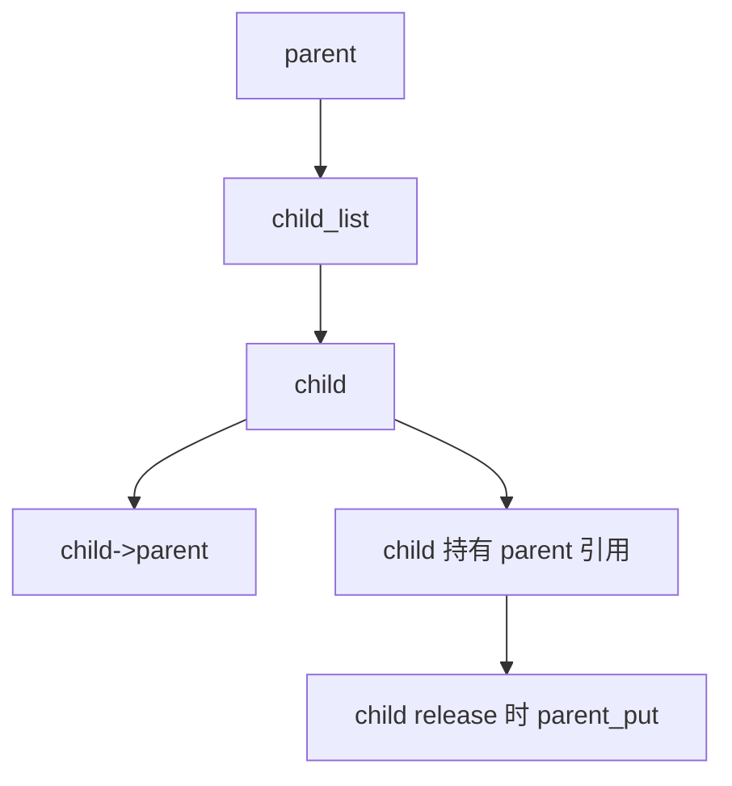
```mermaid
flowchart TD
    A["parent"] --> B["child_list"]
    B --> C["child"]
    C --> D["child->parent"]
    C --> E["child 持有 parent 引用"]
    E --> F["child release 时 parent_put"]
```

关键规则：

```text
如果 child release 里要访问 parent，child 必须持有 parent 引用；
如果 parent remove 要等待 child 消失，需要 drain child；
list 关系不是生命周期引用。
```

------

### 13.7.2\_模板十四\_file->private\_data\_持有引用

字符设备、misc 设备中很常见。

对象：

```c
struct my_obj {
	struct kref ref;
	struct mutex lock;
	bool dying;
	int id;
};
```

open：

```c
static int my_fops_open(struct inode *inode, struct file *file)
{
	struct my_obj *obj;

	obj = my_obj_lookup_get(iminor(inode));
	if (!obj)
		return -ENODEV;

	file->private_data = obj;
	return 0;
}
```

release：

```c
static int my_fops_release(struct inode *inode, struct file *file)
{
	struct my_obj *obj = file->private_data;

	file->private_data = NULL;

	if (obj)
		my_obj_put(obj);

	return 0;
}
```

read/write/ioctl：

```c
static long my_fops_ioctl(struct file *file,
			  unsigned int cmd,
			  unsigned long arg)
{
	struct my_obj *obj = file->private_data;
	int ret;

	if (!obj)
		return -ENODEV;

	mutex_lock(&obj->lock);
	if (obj->dying) {
		mutex_unlock(&obj->lock);
		return -ENODEV;
	}
	mutex_unlock(&obj->lock);

	ret = my_obj_ioctl(obj, cmd, arg);

	return ret;
}
```

这里的规则：

```text
open 成功：
    file 持有 obj 引用。

release：
    file 释放 obj 引用。

read/write/ioctl：
    可以使用 file->private_data，因为 file 持有引用；
    但仍要检查 dying/state；
    字段访问仍要加锁。
```

流程图：

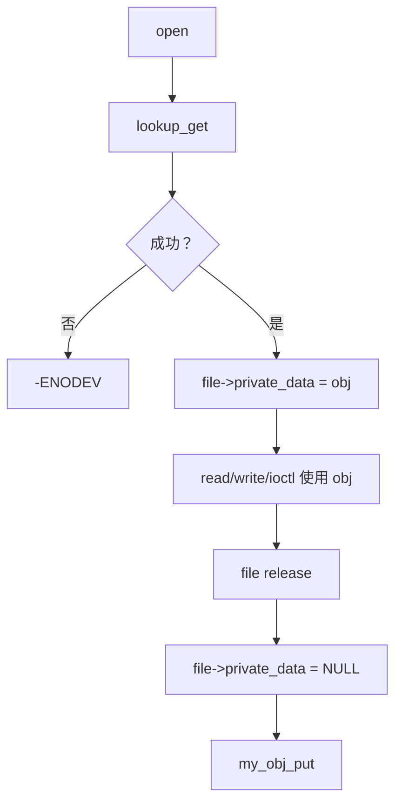
```mermaid
flowchart TD
    A["open"] --> B["lookup_get"]
    B --> C{"成功？"}
    C -- "否" --> D["-ENODEV"]
    C -- "是" --> E["file->private_data = obj"]
    E --> F["read/write/ioctl 使用 obj"]
    F --> G["file release"]
    G --> H["file->private_data = NULL"]
    H --> I["my_obj_put"]
```

错误写法：

```c
file->private_data = obj;   /* 但 open 没有 get */
```

这会导致：

```text
file 持有裸指针；
remove 后 file 操作可能 UAF。
```

------

### 13.7.3\_模板十五\_引用包装函数统一入口

工程里建议不要到处直接写：

```c
kref_get(&obj->ref);
kref_put(&obj->ref, my_obj_release);
```

而是包装：

```c
static inline struct my_obj *my_obj_get(struct my_obj *obj)
{
	kref_get(&obj->ref);
	return obj;
}

static inline void my_obj_put(struct my_obj *obj)
{
	if (obj)
		kref_put(&obj->ref, my_obj_release);
}
```

好处：

```text
1. get/put 统一命名。
2. release 函数不散落。
3. 方便加调试日志。
4. 方便后续改成 trace/ref tracker。
5. 调用点更容易读出对象语义。
```

调试版本：

```c
static inline struct my_obj *my_obj_get_dbg(struct my_obj *obj,
					    const char *why)
{
	pr_debug("my_obj_get obj=%p why=%s caller=%pS\n",
		 obj, why, __builtin_return_address(0));

	kref_get(&obj->ref);
	return obj;
}

static inline void my_obj_put_dbg(struct my_obj *obj,
				  const char *why)
{
	if (!obj)
		return;

	pr_debug("my_obj_put obj=%p why=%s caller=%pS\n",
		 obj, why, __builtin_return_address(0));

	kref_put(&obj->ref, my_obj_release);
}
```

宏：

```c
#define my_obj_get(obj) my_obj_get_dbg((obj), __func__)
#define my_obj_put(obj) my_obj_put_dbg((obj), __func__)
```

注意：

```text
调试宏只用于开发排查；
正式代码是否保留要看子系统风格。
```

------

### 13.7.4\_模板十六\_对象状态机\_+\_kref\_模板

kref 只保护生命周期，不保护对象状态。

建议给复杂对象加状态机。

```c
enum my_obj_state {
	MY_OBJ_NEW = 0,
	MY_OBJ_LIVE,
	MY_OBJ_DYING,
	MY_OBJ_DEAD,
};

struct my_obj {
	struct kref ref;
	struct mutex lock;
	enum my_obj_state state;
	struct list_head node;
};
```

状态切换：

```c
static bool my_obj_try_enter(struct my_obj *obj)
{
	bool ok = false;

	mutex_lock(&obj->lock);
	if (obj->state == MY_OBJ_LIVE)
		ok = true;
	mutex_unlock(&obj->lock);

	return ok;
}
```

lookup + get + state：

```c
static struct my_obj *my_obj_lookup_get_live(int id)
{
	struct my_obj *obj;

	mutex_lock(&my_obj_list_lock);

	obj = my_obj_find_locked(id);
	if (!obj)
		goto out_unlock;

	mutex_lock(&obj->lock);
	if (obj->state != MY_OBJ_LIVE) {
		mutex_unlock(&obj->lock);
		obj = NULL;
		goto out_unlock;
	}

	kref_get(&obj->ref);
	mutex_unlock(&obj->lock);

out_unlock:
	mutex_unlock(&my_obj_list_lock);
	return obj;
}
```

remove：

```c
static void my_obj_remove(struct my_obj *obj)
{
	mutex_lock(&obj->lock);
	if (obj->state != MY_OBJ_LIVE) {
		mutex_unlock(&obj->lock);
		return;
	}

	obj->state = MY_OBJ_DYING;
	mutex_unlock(&obj->lock);

	mutex_lock(&my_obj_list_lock);
	list_del_init(&obj->node);
	mutex_unlock(&my_obj_list_lock);

	my_obj_put(obj);
}
```

release：

```c
static void my_obj_release(struct kref *ref)
{
	struct my_obj *obj = container_of(ref, struct my_obj, ref);

	mutex_lock(&obj->lock);
	obj->state = MY_OBJ_DEAD;
	mutex_unlock(&obj->lock);

	WARN_ON(!list_empty(&obj->node));

	kfree(obj);
}
```

状态图：

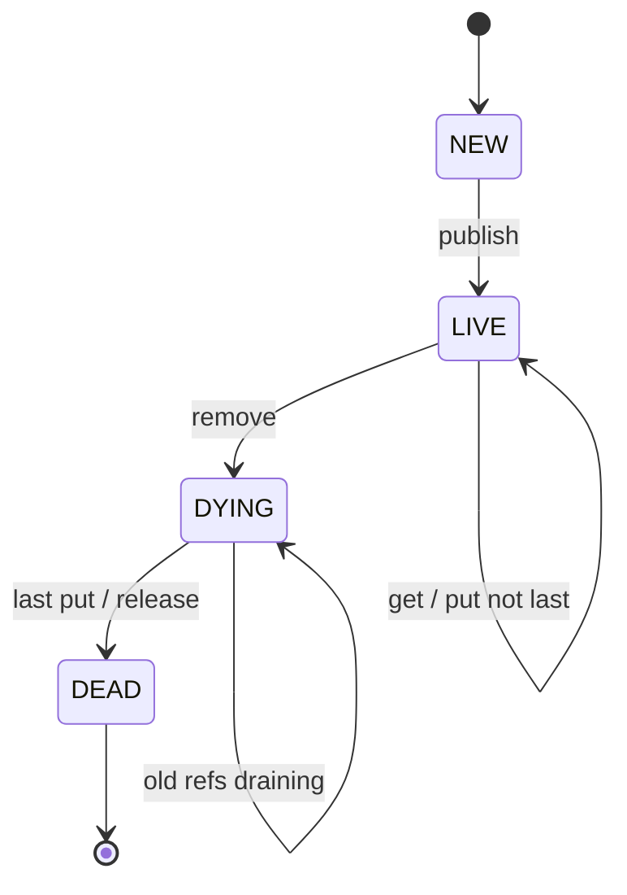
```mermaid
stateDiagram-v2
    [*] --> NEW
    NEW --> LIVE: publish
    LIVE --> DYING: remove
    DYING --> DEAD: last put / release
    DEAD --> [*]

    LIVE --> LIVE: get / put not last
    DYING --> DYING: old refs draining
```

注意：

```text
state 解决逻辑可用性；
kref 解决内存生命周期；
list 解决 lookup 可见性；
lock 解决状态并发修改。
```

------

## 13.8\_约定和收尾模板\_注释\_borrow\_release\_退出\_断言

### 13.8.1\_模板十七\_引用归属注释模板

复杂函数必须在注释里写清引用归属。

#### (1)\_get\_型函数注释

```c
/*
 * my_obj_lookup_get - find object by id and return a referenced object
 *
 * On success:
 *   returns obj with one kref held by caller.
 *
 * On failure:
 *   returns NULL and caller owns no reference.
 *
 * Caller must call my_obj_put() on success.
 */
static struct my_obj *my_obj_lookup_get(int id);
```

#### (2)\_take\_型函数注释

```c
/*
 * my_obj_enqueue_take - enqueue object and transfer caller's reference
 *
 * On success:
 *   queue owns caller's reference.
 *   caller must not touch obj after this function returns 0.
 *
 * On failure:
 *   caller still owns the reference and must put it.
 */
static int my_obj_enqueue_take(struct my_queue *q, struct my_obj *obj);
```

#### (3)\_get\_型\_enqueue\_注释

```c
/*
 * my_obj_enqueue_get - enqueue object with an extra queue reference
 *
 * On success:
 *   queue holds a new reference.
 *   caller still owns its original reference.
 *
 * On failure:
 *   no new reference is kept.
 *   caller still owns its original reference.
 */
static int my_obj_enqueue_get(struct my_queue *q, struct my_obj *obj);
```

#### (4)\_borrow\_型函数注释

```c
/*
 * my_obj_peek_borrow - return a borrowed object pointer
 *
 * Returned pointer is valid only while caller holds my_obj_list_lock.
 * Caller must not store it.
 * Caller must not use it after unlocking.
 * Caller must not put it.
 */
static struct my_obj *my_obj_peek_borrow(int id);
```

注释模板的目的：

```text
让调用者知道：
成功时引用归谁；
失败时引用归谁；
是否需要 put；
是否还能访问对象；
是否只是借用指针。
```

------

### 13.8.2\_模板十八\_borrow\_指针模板

有些函数只在锁内借用指针，不增加引用。

```c
/*
 * Caller must hold my_obj_list_lock.
 * Returned pointer is borrowed and valid only under the lock.
 */
static struct my_obj *my_obj_find_locked(int id)
{
	struct my_obj *obj;

	list_for_each_entry(obj, &my_obj_list, node) {
		if (obj->id == id)
			return obj;
	}

	return NULL;
}
```

调用：

```c
mutex_lock(&my_obj_list_lock);

obj = my_obj_find_locked(id);
if (obj)
	ret = read_field_under_lock(obj);

mutex_unlock(&my_obj_list_lock);
```

不能这样：

```c
mutex_lock(&my_obj_list_lock);
obj = my_obj_find_locked(id);
mutex_unlock(&my_obj_list_lock);

do_something(obj);   /* 错误：borrow 指针离开锁后失效 */
```

如果要离开锁使用：

```c
mutex_lock(&my_obj_list_lock);

obj = my_obj_find_locked(id);
if (obj)
	my_obj_get(obj);

mutex_unlock(&my_obj_list_lock);

if (!obj)
	return -ENOENT;

do_something(obj);

my_obj_put(obj);
```

borrow 到 strong ref 的转换图：

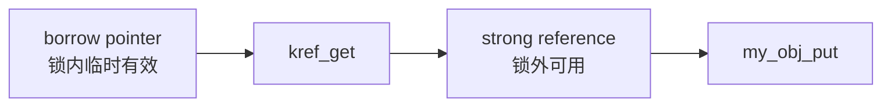
```mermaid
flowchart LR
    A["borrow pointer<br/>锁内临时有效"] --> B["kref_get"]
    B --> C["strong reference<br/>锁外可用"]
    C --> D["my_obj_put"]
```

------

### 13.8.3\_模板十九\_release\_中资源释放顺序

release 里释放资源建议按反初始化顺序。

初始化：

```c
ret = init_a(obj);
if (ret)
	goto err_put;

ret = init_b(obj);
if (ret)
	goto err_cleanup_a;

ret = init_c(obj);
if (ret)
	goto err_cleanup_b;
```

release：

```c
static void my_obj_release(struct kref *ref)
{
	struct my_obj *obj = container_of(ref, struct my_obj, ref);

	cleanup_c(obj);
	cleanup_b(obj);
	cleanup_a(obj);

	kfree(obj);
}
```

如果有子资源：

```c
struct my_obj {
	struct kref ref;

	void *buffer;
	struct workqueue_struct *wq;
	struct my_subobj *sub;
};
```

release：

```c
static void my_obj_release(struct kref *ref)
{
	struct my_obj *obj = container_of(ref, struct my_obj, ref);

	if (obj->wq)
		destroy_workqueue(obj->wq);

	if (obj->sub)
		my_subobj_put(obj->sub);

	kfree(obj->buffer);
	kfree(obj);
}
```

注意：

```text
release 不能释放仍可能被异步路径访问的资源；
必须先 drain work/timer/callback；
如果 RCU 读者可能访问子资源，子资源也要延迟释放。
```

释放顺序图：

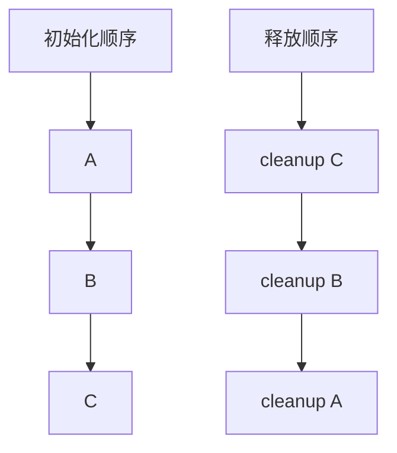
```mermaid
flowchart TD
    A["初始化顺序"] --> B["A"]
    B --> C["B"]
    C --> D["C"]

    E["释放顺序"] --> F["cleanup C"]
    F --> G["cleanup B"]
    G --> H["cleanup A"]
```

------

### 13.8.4\_模板二十\_模块退出时清理所有对象

模块退出时要清理全局集合。

```c
static void my_obj_destroy_all(void)
{
	struct my_obj *obj, *tmp;
	LIST_HEAD(to_free);

	mutex_lock(&my_obj_list_lock);

	list_for_each_entry_safe(obj, tmp, &my_obj_list, node) {
		mutex_lock(&obj->lock);
		obj->dying = true;
		mutex_unlock(&obj->lock);

		list_del_init(&obj->node);
		list_add_tail(&obj->node, &to_free);
	}

	mutex_unlock(&my_obj_list_lock);

	list_for_each_entry_safe(obj, tmp, &to_free, node) {
		list_del_init(&obj->node);

		my_obj_stop(obj);
		my_obj_put(obj);
	}
}
```

注意：

```text
不要在持全局锁时做可能睡眠的 stop/drain；
先把对象从全局表摘到临时表；
释放锁后逐个 stop/put。
```

流程图：

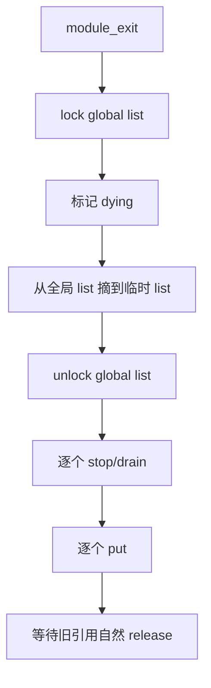
```mermaid
flowchart TD
    A["module_exit"] --> B["lock global list"]
    B --> C["标记 dying"]
    C --> D["从全局 list 摘到临时 list"]
    D --> E["unlock global list"]
    E --> F["逐个 stop/drain"]
    F --> G["逐个 put"]
    G --> H["等待旧引用自然 release"]
```

如果需要等待所有对象释放，必须有额外同步机制，例如：

```text
completion；
refcount 追踪；
模块引用；
flush_workqueue；
drain 队列；
等待活动计数归零。
```

kref 本身没有提供“等待所有对象 release”的通用接口。

------

### 13.8.5\_模板二十一\_禁止新用户进入的统一检查

很多路径都要检查对象是否 dying。

可以包装：

```c
static bool my_obj_is_live_locked(struct my_obj *obj)
{
	lockdep_assert_held(&obj->lock);

	return !obj->dying;
}
```

进入业务路径：

```c
static int my_obj_enter(struct my_obj *obj)
{
	int ret = 0;

	mutex_lock(&obj->lock);
	if (!my_obj_is_live_locked(obj))
		ret = -ENODEV;
	mutex_unlock(&obj->lock);

	return ret;
}
```

使用：

```c
ret = my_obj_enter(obj);
if (ret)
	return ret;

ret = do_something(obj);
```

但是注意：

```text
my_obj_enter 只是状态检查；
它不增加引用；
调用者必须已经持有引用。
```

如果你需要“检查 live 并取得引用”，应该放在 lookup_get 中完成。

------

### 13.8.6\_模板二十二\_调试断言模板

release 中断言：

```c
static void my_obj_release(struct kref *ref)
{
	struct my_obj *obj = container_of(ref, struct my_obj, ref);

	WARN_ON(!list_empty(&obj->node));
	WARN_ON(timer_pending(&obj->timer));
	WARN_ON(work_pending(&obj->work));

	kfree(obj);
}
```

lookup 中断言：

```c
static struct my_obj *my_obj_find_locked(int id)
{
	lockdep_assert_held(&my_obj_list_lock);

	...
}
```

状态访问断言：

```c
static void my_obj_set_state_locked(struct my_obj *obj, int state)
{
	lockdep_assert_held(&obj->lock);

	obj->state = state;
}
```

put 后防误用：

```c
my_obj_put(obj);
obj = NULL;
```

这不能消除所有 bug，但可以减少当前函数后续误访问：

```c
my_obj_put(obj);
obj = NULL;

return ret;
```

------

## 13.9\_本章模板总表

| 场景            | 推荐模板                                       |
| --------------- | ---------------------------------------------- |
| 最小对象        | `kref_init/get/put/release`                    |
| 复杂初始化      | `alloc + init + publish + put`                 |
| list 查找       | `list_lock 内 lookup + kref_get`               |
| hash 查找       | `hash_lock 内 lookup + kref_get`               |
| xarray 查找     | `xa_lock/mutex 内 xa_load + kref_get`          |
| RCU 查找        | `rcu_read_lock + kref_get_unless_zero`         |
| work handoff    | 投递成功前 get，workfn 末尾 put                |
| timer handoff   | start timer get，timerfn 或 del_timer_sync put |
| file 私有数据   | open lookup_get，release put                   |
| completion 等待 | waiter get，wait 后 put                        |
| remove          | dying + unlink + drain + put                   |
| release         | 最后销毁，不重新发布                           |
| 父子对象        | child 持 parent 引用                           |
| weak pointer    | RCU + get_unless_zero 转强引用                 |
| 错误路径        | 按阶段回滚或 release 统一处理                  |
| 调试            | get/put 日志 + release WARN                    |

------

## 13.10\_本章审查清单

写完一个 kref 对象后，按下面清单检查：

```text
1. struct kref 是否嵌入在业务对象内部？
2. alloc 成功后是否 kref_init？
3. kref_init 是否只执行一次？
4. get/put 是否有统一包装函数？
5. release 是否能通过 container_of 找回对象？
6. release 是否只做销毁，不重新发布？
7. 对象是否有全局 lookup 入口？
8. lookup + get 是否在同一锁/RCU 窗口内完成？
9. 如果使用 RCU，是否使用 kref_get_unless_zero？
10. get_unless_zero 返回值是否检查？
11. 是否有 dying/state 阻止新用户进入？
12. remove 是否先 dying，再 unlink？
13. remove 是否 drain work/timer/callback？
14. 异步路径是否持有自己的引用？
15. handoff 成功失败时引用归属是否写清楚？
16. file->private_data 是否持有引用？
17. put 后是否还有访问 obj？
18. release 前对象是否已经从集合脱链？
19. RCU 对象是否使用 kfree_rcu/call_rcu？
20. 字段访问是否有锁/原子/状态机保护？
```

------

## 13.11\_本章小结

本章不是讲新概念，而是把 kref 写成工程结构。

最小模板是：

```c
struct my_obj {
	struct kref ref;
};

kref_init(&obj->ref);
kref_get(&obj->ref);
kref_put(&obj->ref, my_obj_release);
```

但真实工程里，更常见的是：

```text
alloc/init/publish；
lookup/get/use/put；
handoff/drain；
remove/unlink；
release/free。
```

最终工程模型应该是：

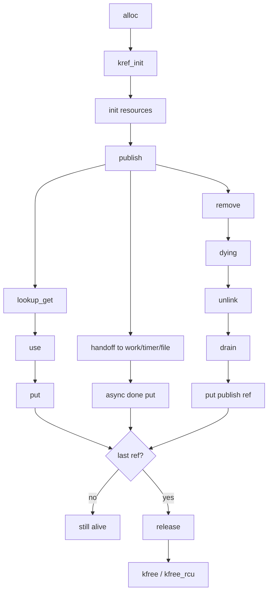
```mermaid
flowchart TD
    A["alloc"] --> B["kref_init"]
    B --> C["init resources"]
    C --> D["publish"]
    D --> E["lookup_get"]
    E --> F["use"]
    F --> G["put"]

    D --> H["handoff to work/timer/file"]
    H --> I["async done put"]

    D --> J["remove"]
    J --> K["dying"]
    K --> L["unlink"]
    L --> M["drain"]
    M --> N["put publish ref"]

    G --> O{"last ref?"}
    I --> O
    N --> O
    O -- "no" --> P["still alive"]
    O -- "yes" --> Q["release"]
    Q --> R["kfree / kfree_rcu"]
```

一句话总结：

```text
kref 工程模板不是 refcount++ / refcount-- 模板；
而是对象发布、查找、持有、转移、撤销、释放的完整生命周期模板。
```

------

专题导航：[kref 引用计数机制章节大纲](大纲.md)。

上一篇：[典型错误模式与调试线索](P12_典型错误模式与调试线索.md#12.10.3_本章小结)。

下一篇：[源码阅读实验](P14_源码阅读实验.md)。
