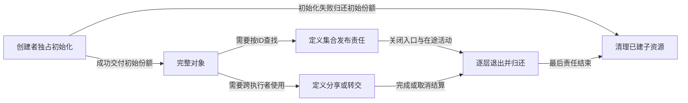
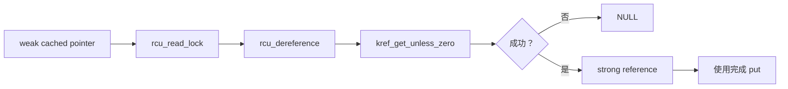
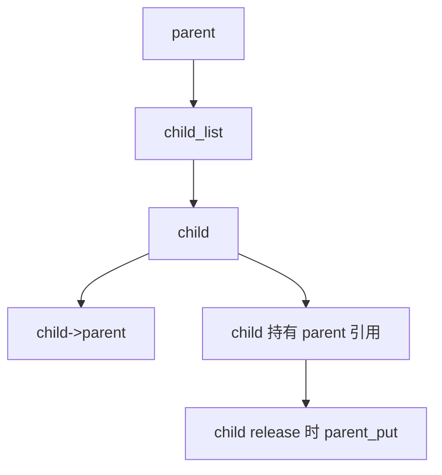
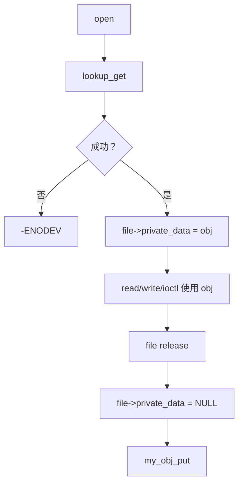
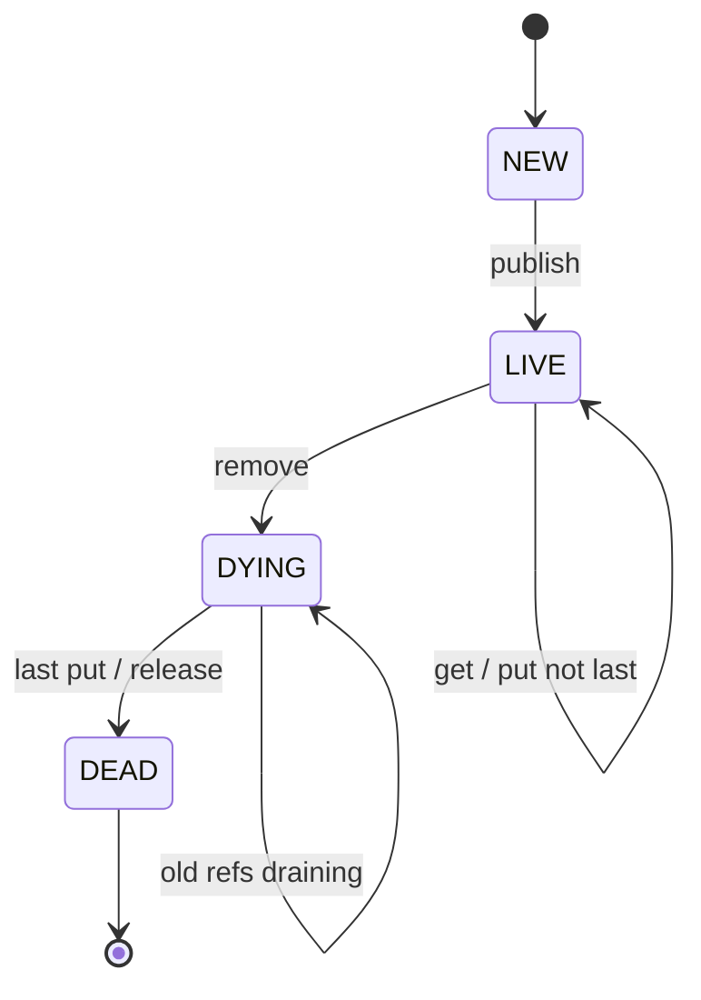
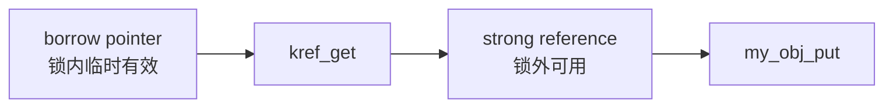
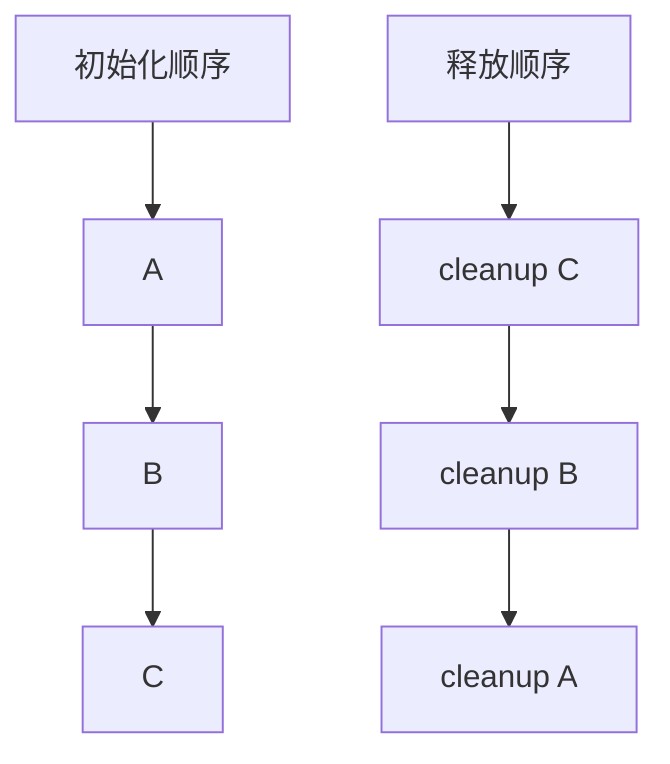
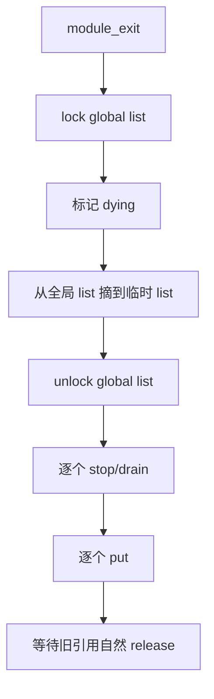
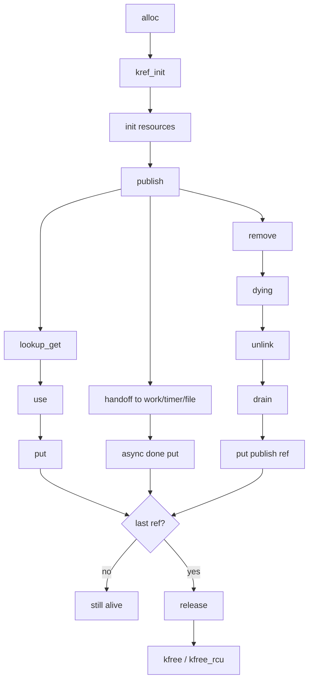

# 第13章\_工程模板

## 13.1\_本章导读\_把规则落成可复制模板

上一章已经能从一次错误访问倒推责任缺口。本章反过来：假设要给驱动增加一个请求对象，怎样从一张责任表写出可以复用的创建、交付、查找和退出代码？目标是复用已经证明的协议。只复制相同的结构体和函数名，缺少一次失败回滚，仍会得到与模板外观相同的bug。

先限定对象范围。这里的私有对象由本层定义分配和最终清理，例如request、session、job或buffer的外壳。若存储已经归设备模型管理，应采用get_device/put_device或相应框架接口；不能把内部kref换成自己的release。私有会话可以通过一份桥接引用持有设备，但须维持P11已经建立的分配边界。

每组模板回答三个问题：输入时调用者有什么资格，成功与失败分别把责任留给谁，退出时怎样阻止仍需使用的状态被提前清理。先从没有共享入口的同步对象开始；随后才为查找加入集合责任，为异步加入交付和取消，为退出加入关闭与等待。不能一开始给每个对象都塞上mutex、dying、work和rcu_head，再希望字段自行组成协议。


```mermaid
flowchart LR
    A[创建者独占初始化] -->|成功交付初始份额| B[完整对象]
    A -->|初始化失败归还初始份额| F[清理已建子资源]
    B -->|需要按ID查找| C[定义集合发布责任]
    B -->|需要跨执行者使用| D[定义分享或转交]
    C -->|关闭入口与在途活动| E[逐层退出并归还]
    D -->|完成或取消结算| E
    E -->|最后责任结束| F
```

模板按场景组织；同一场景中仍要选择具体条件。拥有型与非拥有型索引、共享与转交、普通RCU与锁保护，都有前面章节的完整实例可对照。本章会说明选择理由和改动位置，不能把某一模板提升为所有对象的固定规则。

## 13.2\_模板命名约定

模板名称只表达预期，输入资格、成功与失败后的责任、可用上下文由契约兑现。按[创建模板的命名约定](P16_对象创建与失败清理模板.md#16.1_模板命名约定)逐项确认alloc/create、get、put、take、borrow和publish的边界，再进入完整创建过程。

## 13.3\_基础对象模板\_alloc\_init\_get\_put\_release

从[最小对象与分层创建](P16_对象创建与失败清理模板.md#16.2_基础对象模板_alloc_init_get_put_release)开始，追踪创建者和observer的份额，分别观察外壳分配、缓冲区准备和业务校验失败。该篇保留完整C模块、运行步骤、预期结果、验证边界及练习。

## 13.4\_lookup\_集合模板\_list\_hash\_xarray

创建函数交付初始份额以后，其他调用者若需按ID查找，就必须定义集合自身的责任。按同一拥有型模型依次改变索引和执行上下文，避免把不同容器或锁的名字当作引用保证。

| 阅读单元 | 解决的问题 | 接给下一步的条件 |
| --- | --- | --- |
| [拥有型链表](P17_拥有型链表工程模板.md#17.1_拥有型链表的发布与撤下) | 表份额、重复发布/撤下、关闭与旧读者 | 明白成员、业务状态及份额可以同时变化 |
| [拥有型哈希与IRQ](P18_拥有型哈希与IRQ工程模板.md#18.1_拥有型哈希与IRQ上下文) | 同ID冲突、桶碰撞、本地IRQ与单锁/双锁 | 不把哈希、spinlock和生命周期混成同一保证 |
| [XArray身份与删除](P19_XArray身份与删除工程模板.md#19.1_整数索引与期待对象删除) | 公开与已持锁入口、编号复用及期待对象删除 | 确定移除者消费的是哪一个对象的成员份额 |

四个独立模板保留完整正文和代码，按“创建 → 链表 → 哈希 → XArray”读完后回到13.5，继续讨论跨执行者交付。P13承担工程入口和后续模板的衔接，章节文件号不要求在本分支按数值连续跳转。

------

## 13.5\_handoff\_异步模板\_work\_timer\_completion\_错误回滚

集合已经明确取回成员份额的路径。异步交付还要确定提交返回以前对方能否执行、失败时责任归谁，以及关闭是否真正覆盖了全部投递。先比较工作队列两种份额，再进入定时器、完成事件和失败回滚。

### 13.5.1\_模板六\_workqueue\_handoff\_模板

[工作交付与关闭工程模板](P20_工作交付与关闭工程模板.md#20.1_先选择分享还是转交)用同一个完整请求比较分享与转交，说明worker先于提交返回完成也可以合法；随后用迟到投递反例和管理者等待模型闭合关门、实际排队、取消与代码退出。不要把对象引用当作队列或硬件仍有效的保证，也不要把借用worker和独立拥有worker的put规则混用。

------

### 13.5.2\_模板七\_timer\_handoff\_模板

定时器的私有票据与内核pending仍需分开，管理者保持初始份额到同步关闭之后；这些原有条件保留并在[P21完整定时器模板](P21_定时器交付与同步关闭模板.md#21.1_先把排队状态与对象责任分开)落实为可构建模块。正文按T0～T5比较执行者归还、取消者接管和最终管理者归还，拒绝重复启动，避免把改期错误地算成新增回调。

[P21关闭与复用选择](P21_定时器交付与同步关闭模板.md#21.4_怎样选择改期和最终关闭协议)继续解释原del_timer_sync与本版本timer_delete_sync的关系，以及为什么一次请求的最终退出采用shutdown。周期借用与timer/work相互重启仍链接P06权威推导，不能直接套用单次票据。

------

### 13.5.3\_模板八\_completion\_/\_wait\_用户持有模板

完整[P22完成事件与等待者模板](P22_完成事件与等待者工程模板.md#22.1_等待之前先取得合法对象)先明确参数有效性，再区分结果发布、工作退出与对象回收。复用已讲清的完整请求模块，比较及时完成、超时取消与迟到完成，不把入口get当作裸指针变安全的手续。

原模板的complete_all与completed状态转入[P22多等待者与单次结果契约](P22_完成事件与等待者工程模板.md#22.4_扩展到多个等待者之前)：广播不产生引用，完成标志必须参与单次发布判断，复用必须等旧参与者退出。等待者也可以在有证明的管理者期限内借用，不必机械地每次wait都get。

------

### 13.5.4\_模板九\_error\_path\_回滚模板

[P23分阶段回滚](P23_分阶段失败与资源回滚模板.md#23.1_先列出失败时已经成立的责任)保留逐级清理与最后release两种思路，按具体资源责任纠正“复杂对象只能逐级”和“混用一定错误”的绝对化。完整C程序比较正常及五个失败点，明确半初始化、指针清空、依赖顺序与发布份额，十二条路径可直接运行。

回滚前先区分尚未发布和已经有外部可见性：失败没有交付给当前调用者，不等于其他参与者从未看到对象。[P23内核映射](P23_分阶段失败与资源回滚模板.md#23.4_把模型映射回实际内核模板)复用P16完整模块，并把清理上下文、旧读者与硬件排空留给各自真实协议。下面继续退出组合。

------

## 13.6\_删除和弱引用模板\_remove\_RCU\_缓存指针

### 13.6.1\_模板十\_remove\_/\_unlink\_/\_drain\_/\_release\_模板

[P24删除入口与排空](P24_删除入口与活动排空工程模板.md#24.1_关闭业务不等于回收所有对象)用完整管理者模块落实关门、锁外等待、队列销毁和份额归还。对象仍有引用不等于旧用户还能使用硬件或队列；只有把检查与实际操作/登记置于同一保护窗口，关闭者才有依据等待。

[发布责任与扩展](P24_删除入口与活动排空工程模板.md#24.4_增加发布入口时先分清两份责任)保留原remove/unlink/drain/release的分层任务，明确集合份额和管理者份额分别来自何处，重复撤下只消费实际移走的一份。timer/work互启沿P06既有最终关闭协议；真实硬件需自己的停止和排空证据，不能用未实现helper或WARN补足。

------

### 13.6.2\_模板十一\_RCU\_lookup\_+\_kref\_get\_unless\_zero\_+\_kfree\_rcu

[P25完整RCU工程模板](P25_RCU查找与业务关闭工程模板.md#25.1_同一对象上有三组独立状态)明确发布额外持表份额、撤下立即归还、最后put延迟存储回收的具体协议。旧读者在匹配的读区内条件取得，离开后仍须通过业务门；重复摘链与重复发布分别由显式状态约束。

[P25回收与代码期限](P25_RCU查找与业务关闭工程模板.md#25.4_归零以后还要保留什么)继续解释原kfree_rcu承担的延迟存储任务，完整实例以call_rcu自定义回调记录回收，并在来源结束后等待模块回调退出。地址保护、正计数、业务许可、子资源与代码寿命各有边界，不能由一个helper推出全部保证。

------

### 13.6.3\_模板十二\_弱引用缓存指针模板

有时对象会被缓存成弱引用。

例如：

```c
struct my_holder {
	struct my_obj __rcu *cached;
};
```

注意：

```text
弱引用指针不拥有对象；
不能直接使用；
必须转换成强引用。
```

获取强引用：

```c
static struct my_obj *my_holder_get_cached(struct my_holder *holder)
{
	struct my_obj *obj;

	rcu_read_lock();

	obj = rcu_dereference(holder->cached);
	if (obj && !kref_get_unless_zero(&obj->ref))
		obj = NULL;

	rcu_read_unlock();

	return obj;
}
```

更新缓存：

```c
static void my_holder_set_cached(struct my_holder *holder,
				 struct my_obj *obj)
{
	rcu_assign_pointer(holder->cached, obj);
}
```

清除缓存：

```c
static void my_holder_clear_cached(struct my_holder *holder)
{
	rcu_assign_pointer(holder->cached, NULL);
}
```

使用：

```c
obj = my_holder_get_cached(holder);
if (!obj)
	return -ENOENT;

ret = do_something(obj);

my_obj_put(obj);
```

错误写法：

```c
obj = rcu_dereference(holder->cached);
do_something(obj);   /* 错误：没有长期引用 */
```

弱引用转换图：


```mermaid
flowchart LR
    A["weak cached pointer"] --> B["rcu_read_lock"]
    B --> C["rcu_dereference"]
    C --> D["kref_get_unless_zero"]
    D --> E{"成功？"}
    E -- "否" --> F["NULL"]
    E -- "是" --> G["strong reference"]
    G --> H["使用完成 put"]
```

------

## 13.7\_分层持有模板\_父子对象\_file\_包装函数\_状态机

### 13.7.1\_模板十三\_父子对象引用模板

有些对象有父子关系。

例如：

```c
struct my_parent {
	struct kref ref;
	struct mutex lock;
	bool dying;

	struct list_head child_list;
};

struct my_child {
	struct kref ref;
	struct my_parent *parent;
	struct list_head node;
};
```

这里必须定义：

```text
child 是否持有 parent 引用？
parent 是否持有 child 引用？
remove parent 时如何处理 child？
child release 时能否访问 parent？
```

一种清晰模型是：

```text
child 创建成功后，child 持有 parent 引用；
child release 时 put parent；
parent 的 child_list 只是集合关系；
parent remove 时阻止新 child 创建，并 drain 旧 child。
```

parent get/put：

```c
static void my_parent_release(struct kref *ref)
{
	struct my_parent *parent = container_of(ref, struct my_parent, ref);

	kfree(parent);
}

static void my_parent_get(struct my_parent *parent)
{
	kref_get(&parent->ref);
}

static void my_parent_put(struct my_parent *parent)
{
	kref_put(&parent->ref, my_parent_release);
}
```

child release：

```c
static void my_child_release(struct kref *ref)
{
	struct my_child *child = container_of(ref, struct my_child, ref);
	struct my_parent *parent = child->parent;

	kfree(child);

	my_parent_put(parent);
}
```

child 创建：

```c
static struct my_child *my_child_create(struct my_parent *parent)
{
	struct my_child *child;

	mutex_lock(&parent->lock);
	if (parent->dying) {
		mutex_unlock(&parent->lock);
		return ERR_PTR(-ENODEV);
	}

	my_parent_get(parent);
	mutex_unlock(&parent->lock);

	child = kzalloc(sizeof(*child), GFP_KERNEL);
	if (!child) {
		my_parent_put(parent);
		return ERR_PTR(-ENOMEM);
	}

	kref_init(&child->ref);
	child->parent = parent;
	INIT_LIST_HEAD(&child->node);

	mutex_lock(&parent->lock);
	if (parent->dying) {
		mutex_unlock(&parent->lock);
		my_child_put(child);
		return ERR_PTR(-ENODEV);
	}

	list_add_tail(&child->node, &parent->child_list);
	mutex_unlock(&parent->lock);

	return child;
}
```

注意这里有一个竞态点：

```text
parent 可能在 child 分配期间进入 dying。
```

所以需要二次检查。

更简单的工程做法是：

```text
在 parent->lock 下完成 parent get 和 child 加入；
如果分配可能睡眠，则先分配 child，再加锁检查 dying。
```

更推荐的写法：

```c
static struct my_child *my_child_create(struct my_parent *parent)
{
	struct my_child *child;

	child = kzalloc(sizeof(*child), GFP_KERNEL);
	if (!child)
		return ERR_PTR(-ENOMEM);

	kref_init(&child->ref);
	INIT_LIST_HEAD(&child->node);

	mutex_lock(&parent->lock);
	if (parent->dying) {
		mutex_unlock(&parent->lock);
		kfree(child);
		return ERR_PTR(-ENODEV);
	}

	my_parent_get(parent);
	child->parent = parent;
	list_add_tail(&child->node, &parent->child_list);

	mutex_unlock(&parent->lock);

	return child;
}
```

child remove：

```c
static void my_child_remove(struct my_child *child)
{
	struct my_parent *parent = child->parent;

	mutex_lock(&parent->lock);
	if (!list_empty(&child->node))
		list_del_init(&child->node);
	mutex_unlock(&parent->lock);

	my_child_put(child);
}
```

父子引用图：


```mermaid
flowchart TD
    A["parent"] --> B["child_list"]
    B --> C["child"]
    C --> D["child->parent"]
    C --> E["child 持有 parent 引用"]
    E --> F["child release 时 parent_put"]
```

关键规则：

```text
如果 child release 里要访问 parent，child 必须持有 parent 引用；
如果 parent remove 要等待 child 消失，需要 drain child；
list 关系不是生命周期引用。
```

------

### 13.7.2\_模板十四\_file->private\_data\_持有引用

字符设备、misc 设备中很常见。

对象：

```c
struct my_obj {
	struct kref ref;
	struct mutex lock;
	bool dying;
	int id;
};
```

open：

```c
static int my_fops_open(struct inode *inode, struct file *file)
{
	struct my_obj *obj;

	obj = my_obj_lookup_get(iminor(inode));
	if (!obj)
		return -ENODEV;

	file->private_data = obj;
	return 0;
}
```

release：

```c
static int my_fops_release(struct inode *inode, struct file *file)
{
	struct my_obj *obj = file->private_data;

	file->private_data = NULL;

	if (obj)
		my_obj_put(obj);

	return 0;
}
```

read/write/ioctl：

```c
static long my_fops_ioctl(struct file *file,
			  unsigned int cmd,
			  unsigned long arg)
{
	struct my_obj *obj = file->private_data;
	int ret;

	if (!obj)
		return -ENODEV;

	mutex_lock(&obj->lock);
	if (obj->dying) {
		mutex_unlock(&obj->lock);
		return -ENODEV;
	}
	mutex_unlock(&obj->lock);

	ret = my_obj_ioctl(obj, cmd, arg);

	return ret;
}
```

这里的规则：

```text
open 成功：
    file 持有 obj 引用。

release：
    file 释放 obj 引用。

read/write/ioctl：
    可以使用 file->private_data，因为 file 持有引用；
    但仍要检查 dying/state；
    字段访问仍要加锁。
```

流程图：


```mermaid
flowchart TD
    A["open"] --> B["lookup_get"]
    B --> C{"成功？"}
    C -- "否" --> D["-ENODEV"]
    C -- "是" --> E["file->private_data = obj"]
    E --> F["read/write/ioctl 使用 obj"]
    F --> G["file release"]
    G --> H["file->private_data = NULL"]
    H --> I["my_obj_put"]
```

错误写法：

```c
file->private_data = obj;   /* 但 open 没有 get */
```

这会导致：

```text
file 持有裸指针；
remove 后 file 操作可能 UAF。
```

------

### 13.7.3\_模板十五\_引用包装函数统一入口

工程里建议不要到处直接写：

```c
kref_get(&obj->ref);
kref_put(&obj->ref, my_obj_release);
```

而是包装：

```c
static inline struct my_obj *my_obj_get(struct my_obj *obj)
{
	kref_get(&obj->ref);
	return obj;
}

static inline void my_obj_put(struct my_obj *obj)
{
	if (obj)
		kref_put(&obj->ref, my_obj_release);
}
```

好处：

```text
1. get/put 统一命名。
2. release 函数不散落。
3. 方便加调试日志。
4. 方便后续改成 trace/ref tracker。
5. 调用点更容易读出对象语义。
```

调试版本：

```c
static inline struct my_obj *my_obj_get_dbg(struct my_obj *obj,
					    const char *why)
{
	pr_debug("my_obj_get obj=%p why=%s caller=%pS\n",
		 obj, why, __builtin_return_address(0));

	kref_get(&obj->ref);
	return obj;
}

static inline void my_obj_put_dbg(struct my_obj *obj,
				  const char *why)
{
	if (!obj)
		return;

	pr_debug("my_obj_put obj=%p why=%s caller=%pS\n",
		 obj, why, __builtin_return_address(0));

	kref_put(&obj->ref, my_obj_release);
}
```

宏：

```c
#define my_obj_get(obj) my_obj_get_dbg((obj), __func__)
#define my_obj_put(obj) my_obj_put_dbg((obj), __func__)
```

注意：

```text
调试宏只用于开发排查；
正式代码是否保留要看子系统风格。
```

------

### 13.7.4\_模板十六\_对象状态机\_+\_kref\_模板

kref 只保护生命周期，不保护对象状态。

建议给复杂对象加状态机。

```c
enum my_obj_state {
	MY_OBJ_NEW = 0,
	MY_OBJ_LIVE,
	MY_OBJ_DYING,
	MY_OBJ_DEAD,
};

struct my_obj {
	struct kref ref;
	struct mutex lock;
	enum my_obj_state state;
	struct list_head node;
};
```

状态切换：

```c
static bool my_obj_try_enter(struct my_obj *obj)
{
	bool ok = false;

	mutex_lock(&obj->lock);
	if (obj->state == MY_OBJ_LIVE)
		ok = true;
	mutex_unlock(&obj->lock);

	return ok;
}
```

lookup + get + state：

```c
static struct my_obj *my_obj_lookup_get_live(int id)
{
	struct my_obj *obj;

	mutex_lock(&my_obj_list_lock);

	obj = my_obj_find_locked(id);
	if (!obj)
		goto out_unlock;

	mutex_lock(&obj->lock);
	if (obj->state != MY_OBJ_LIVE) {
		mutex_unlock(&obj->lock);
		obj = NULL;
		goto out_unlock;
	}

	kref_get(&obj->ref);
	mutex_unlock(&obj->lock);

out_unlock:
	mutex_unlock(&my_obj_list_lock);
	return obj;
}
```

remove：

```c
static void my_obj_remove(struct my_obj *obj)
{
	mutex_lock(&obj->lock);
	if (obj->state != MY_OBJ_LIVE) {
		mutex_unlock(&obj->lock);
		return;
	}

	obj->state = MY_OBJ_DYING;
	mutex_unlock(&obj->lock);

	mutex_lock(&my_obj_list_lock);
	list_del_init(&obj->node);
	mutex_unlock(&my_obj_list_lock);

	my_obj_put(obj);
}
```

release：

```c
static void my_obj_release(struct kref *ref)
{
	struct my_obj *obj = container_of(ref, struct my_obj, ref);

	mutex_lock(&obj->lock);
	obj->state = MY_OBJ_DEAD;
	mutex_unlock(&obj->lock);

	WARN_ON(!list_empty(&obj->node));

	kfree(obj);
}
```

状态图：


```mermaid
stateDiagram-v2
    [*] --> NEW
    NEW --> LIVE: publish
    LIVE --> DYING: remove
    DYING --> DEAD: last put / release
    DEAD --> [*]

    LIVE --> LIVE: get / put not last
    DYING --> DYING: old refs draining
```

注意：

```text
state 解决逻辑可用性；
kref 解决内存生命周期；
list 解决 lookup 可见性；
lock 解决状态并发修改。
```

------

## 13.8\_约定和收尾模板\_注释\_borrow\_release\_退出\_断言

### 13.8.1\_模板十七\_引用归属注释模板

复杂函数必须在注释里写清引用归属。

#### (1)\_get\_型函数注释

```c
/*
 * my_obj_lookup_get - find object by id and return a referenced object
 *
 * On success:
 *   returns obj with one kref held by caller.
 *
 * On failure:
 *   returns NULL and caller owns no reference.
 *
 * Caller must call my_obj_put() on success.
 */
static struct my_obj *my_obj_lookup_get(int id);
```

#### (2)\_take\_型函数注释

```c
/*
 * my_obj_enqueue_take - enqueue object and transfer caller's reference
 *
 * On success:
 *   queue owns caller's reference.
 *   caller must not touch obj after this function returns 0.
 *
 * On failure:
 *   caller still owns the reference and must put it.
 */
static int my_obj_enqueue_take(struct my_queue *q, struct my_obj *obj);
```

#### (3)\_get\_型\_enqueue\_注释

```c
/*
 * my_obj_enqueue_get - enqueue object with an extra queue reference
 *
 * On success:
 *   queue holds a new reference.
 *   caller still owns its original reference.
 *
 * On failure:
 *   no new reference is kept.
 *   caller still owns its original reference.
 */
static int my_obj_enqueue_get(struct my_queue *q, struct my_obj *obj);
```

#### (4)\_borrow\_型函数注释

```c
/*
 * my_obj_peek_borrow - return a borrowed object pointer
 *
 * Returned pointer is valid only while caller holds my_obj_list_lock.
 * Caller must not store it.
 * Caller must not use it after unlocking.
 * Caller must not put it.
 */
static struct my_obj *my_obj_peek_borrow(int id);
```

注释模板的目的：

```text
让调用者知道：
成功时引用归谁；
失败时引用归谁；
是否需要 put；
是否还能访问对象；
是否只是借用指针。
```

------

### 13.8.2\_模板十八\_borrow\_指针模板

有些函数只在锁内借用指针，不增加引用。

```c
/*
 * Caller must hold my_obj_list_lock.
 * Returned pointer is borrowed and valid only under the lock.
 */
static struct my_obj *my_obj_find_locked(int id)
{
	struct my_obj *obj;

	list_for_each_entry(obj, &my_obj_list, node) {
		if (obj->id == id)
			return obj;
	}

	return NULL;
}
```

调用：

```c
mutex_lock(&my_obj_list_lock);

obj = my_obj_find_locked(id);
if (obj)
	ret = read_field_under_lock(obj);

mutex_unlock(&my_obj_list_lock);
```

不能这样：

```c
mutex_lock(&my_obj_list_lock);
obj = my_obj_find_locked(id);
mutex_unlock(&my_obj_list_lock);

do_something(obj);   /* 错误：borrow 指针离开锁后失效 */
```

如果要离开锁使用：

```c
mutex_lock(&my_obj_list_lock);

obj = my_obj_find_locked(id);
if (obj)
	my_obj_get(obj);

mutex_unlock(&my_obj_list_lock);

if (!obj)
	return -ENOENT;

do_something(obj);

my_obj_put(obj);
```

borrow 到 strong ref 的转换图：


```mermaid
flowchart LR
    A["borrow pointer<br/>锁内临时有效"] --> B["kref_get"]
    B --> C["strong reference<br/>锁外可用"]
    C --> D["my_obj_put"]
```

------

### 13.8.3\_模板十九\_release\_中资源释放顺序

release 里释放资源建议按反初始化顺序。

初始化：

```c
ret = init_a(obj);
if (ret)
	goto err_put;

ret = init_b(obj);
if (ret)
	goto err_cleanup_a;

ret = init_c(obj);
if (ret)
	goto err_cleanup_b;
```

release：

```c
static void my_obj_release(struct kref *ref)
{
	struct my_obj *obj = container_of(ref, struct my_obj, ref);

	cleanup_c(obj);
	cleanup_b(obj);
	cleanup_a(obj);

	kfree(obj);
}
```

如果有子资源：

```c
struct my_obj {
	struct kref ref;

	void *buffer;
	struct workqueue_struct *wq;
	struct my_subobj *sub;
};
```

release：

```c
static void my_obj_release(struct kref *ref)
{
	struct my_obj *obj = container_of(ref, struct my_obj, ref);

	if (obj->wq)
		destroy_workqueue(obj->wq);

	if (obj->sub)
		my_subobj_put(obj->sub);

	kfree(obj->buffer);
	kfree(obj);
}
```

注意：

```text
release 不能释放仍可能被异步路径访问的资源；
必须先 drain work/timer/callback；
如果 RCU 读者可能访问子资源，子资源也要延迟释放。
```

释放顺序图：


```mermaid
flowchart TD
    A["初始化顺序"] --> B["A"]
    B --> C["B"]
    C --> D["C"]

    E["释放顺序"] --> F["cleanup C"]
    F --> G["cleanup B"]
    G --> H["cleanup A"]
```

------

### 13.8.4\_模板二十\_模块退出时清理所有对象

模块退出时要清理全局集合。

```c
static void my_obj_destroy_all(void)
{
	struct my_obj *obj, *tmp;
	LIST_HEAD(to_free);

	mutex_lock(&my_obj_list_lock);

	list_for_each_entry_safe(obj, tmp, &my_obj_list, node) {
		mutex_lock(&obj->lock);
		obj->dying = true;
		mutex_unlock(&obj->lock);

		list_del_init(&obj->node);
		list_add_tail(&obj->node, &to_free);
	}

	mutex_unlock(&my_obj_list_lock);

	list_for_each_entry_safe(obj, tmp, &to_free, node) {
		list_del_init(&obj->node);

		my_obj_stop(obj);
		my_obj_put(obj);
	}
}
```

注意：

```text
不要在持全局锁时做可能睡眠的 stop/drain；
先把对象从全局表摘到临时表；
释放锁后逐个 stop/put。
```

流程图：


```mermaid
flowchart TD
    A["module_exit"] --> B["lock global list"]
    B --> C["标记 dying"]
    C --> D["从全局 list 摘到临时 list"]
    D --> E["unlock global list"]
    E --> F["逐个 stop/drain"]
    F --> G["逐个 put"]
    G --> H["等待旧引用自然 release"]
```

如果需要等待所有对象释放，必须有额外同步机制，例如：

```text
completion；
refcount 追踪；
模块引用；
flush_workqueue；
drain 队列；
等待活动计数归零。
```

kref 本身没有提供“等待所有对象 release”的通用接口。

------

### 13.8.5\_模板二十一\_禁止新用户进入的统一检查

很多路径都要检查对象是否 dying。

可以包装：

```c
static bool my_obj_is_live_locked(struct my_obj *obj)
{
	lockdep_assert_held(&obj->lock);

	return !obj->dying;
}
```

进入业务路径：

```c
static int my_obj_enter(struct my_obj *obj)
{
	int ret = 0;

	mutex_lock(&obj->lock);
	if (!my_obj_is_live_locked(obj))
		ret = -ENODEV;
	mutex_unlock(&obj->lock);

	return ret;
}
```

使用：

```c
ret = my_obj_enter(obj);
if (ret)
	return ret;

ret = do_something(obj);
```

但是注意：

```text
my_obj_enter 只是状态检查；
它不增加引用；
调用者必须已经持有引用。
```

如果你需要“检查 live 并取得引用”，应该放在 lookup_get 中完成。

------

### 13.8.6\_模板二十二\_调试断言模板

release 中断言：

```c
static void my_obj_release(struct kref *ref)
{
	struct my_obj *obj = container_of(ref, struct my_obj, ref);

	WARN_ON(!list_empty(&obj->node));
	WARN_ON(timer_pending(&obj->timer));
	WARN_ON(work_pending(&obj->work));

	kfree(obj);
}
```

lookup 中断言：

```c
static struct my_obj *my_obj_find_locked(int id)
{
	lockdep_assert_held(&my_obj_list_lock);

	...
}
```

状态访问断言：

```c
static void my_obj_set_state_locked(struct my_obj *obj, int state)
{
	lockdep_assert_held(&obj->lock);

	obj->state = state;
}
```

put 后防误用：

```c
my_obj_put(obj);
obj = NULL;
```

这不能消除所有 bug，但可以减少当前函数后续误访问：

```c
my_obj_put(obj);
obj = NULL;

return ret;
```

------

## 13.9\_本章模板总表

| 场景            | 推荐模板                                       |
| --------------- | ---------------------------------------------- |
| 最小对象        | `kref_init/get/put/release`                    |
| 复杂初始化      | `alloc + init + publish + put`                 |
| list 查找       | `list_lock 内 lookup + kref_get`               |
| hash 查找       | `hash_lock 内 lookup + kref_get`               |
| xarray 查找     | `xa_lock/mutex 内 xa_load + kref_get`          |
| RCU 查找        | `rcu_read_lock + kref_get_unless_zero`         |
| work handoff    | 投递成功前 get，workfn 末尾 put                |
| timer handoff   | start timer get，timerfn 或 del_timer_sync put |
| file 私有数据   | open lookup_get，release put                   |
| completion 等待 | waiter get，wait 后 put                        |
| remove          | dying + unlink + drain + put                   |
| release         | 最后销毁，不重新发布                           |
| 父子对象        | child 持 parent 引用                           |
| weak pointer    | RCU + get_unless_zero 转强引用                 |
| 错误路径        | 按阶段回滚或 release 统一处理                  |
| 调试            | get/put 日志 + release WARN                    |

------

## 13.10\_本章审查清单

写完一个 kref 对象后，按下面清单检查：

```text
1. struct kref 是否嵌入在业务对象内部？
2. alloc 成功后是否 kref_init？
3. kref_init 是否只执行一次？
4. get/put 是否有统一包装函数？
5. release 是否能通过 container_of 找回对象？
6. release 是否只做销毁，不重新发布？
7. 对象是否有全局 lookup 入口？
8. lookup + get 是否在同一锁/RCU 窗口内完成？
9. 如果使用 RCU，是否使用 kref_get_unless_zero？
10. get_unless_zero 返回值是否检查？
11. 是否有 dying/state 阻止新用户进入？
12. remove 是否先 dying，再 unlink？
13. remove 是否 drain work/timer/callback？
14. 异步路径是否持有自己的引用？
15. handoff 成功失败时引用归属是否写清楚？
16. file->private_data 是否持有引用？
17. put 后是否还有访问 obj？
18. release 前对象是否已经从集合脱链？
19. RCU 对象是否使用 kfree_rcu/call_rcu？
20. 字段访问是否有锁/原子/状态机保护？
```

------

## 13.11\_本章小结

本章不是讲新概念，而是把 kref 写成工程结构。

最小模板是：

```c
struct my_obj {
	struct kref ref;
};

kref_init(&obj->ref);
kref_get(&obj->ref);
kref_put(&obj->ref, my_obj_release);
```

但真实工程里，更常见的是：

```text
alloc/init/publish；
lookup/get/use/put；
handoff/drain；
remove/unlink；
release/free。
```

最终工程模型应该是：


```mermaid
flowchart TD
    A["alloc"] --> B["kref_init"]
    B --> C["init resources"]
    C --> D["publish"]
    D --> E["lookup_get"]
    E --> F["use"]
    F --> G["put"]

    D --> H["handoff to work/timer/file"]
    H --> I["async done put"]

    D --> J["remove"]
    J --> K["dying"]
    K --> L["unlink"]
    L --> M["drain"]
    M --> N["put publish ref"]

    G --> O{"last ref?"}
    I --> O
    N --> O
    O -- "no" --> P["still alive"]
    O -- "yes" --> Q["release"]
    Q --> R["kfree / kfree_rcu"]
```

一句话总结：

```text
kref 工程模板不是 refcount++ / refcount-- 模板；
而是对象发布、查找、持有、转移、撤销、释放的完整生命周期模板。
```

------

专题导航：[kref 引用计数机制章节大纲](大纲.md)。

上一篇：[典型错误模式与调试线索](P12_典型错误模式与调试线索.md#12.10.3_本章小结)。

下一篇：[源码阅读实验](P14_源码阅读实验.md)。
