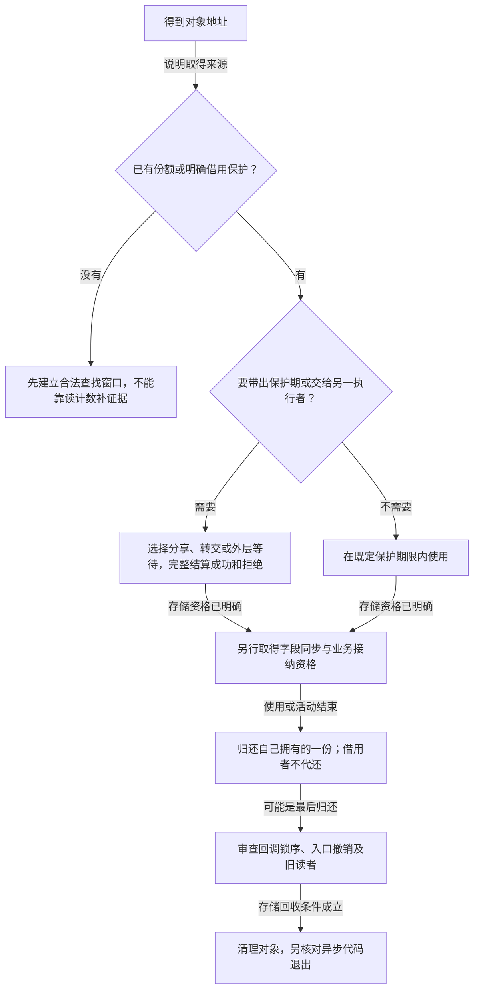

# 第14章\_源码阅读实验

## 14.1\_本章导读\_用实验验证生命周期边界

工程模板已经把创建、交付、查找、业务关闭与最终清理分开。本章把这些结论变成可观察问题：先预测谁拥有哪一份，再执行适用实验，最后沿固定源码解释结果。一次输出正确只证明被执行的路径，不自动证明所有调度、配置和错误出口都安全。

本章保留从基础、错误、lookup与handoff、RCU与工具、API误用到状态和父子关系的实验顺序。不要为后面的实验提前在最小对象里加入所有字段；每个完整单元只引入当前要观察的参与者和状态。

| 阅读阶段 | 要观察的问题 | 入口 |
| --- | --- | --- |
| 基础引用与源码 | 初始一份、追加、最后put的同步回调与局部返回值 | [P32完整基础实验](P32_基础引用与源码对照实验.md#32.1_先分清读哪份源码和运行哪个内核) |
| 错误责任 | 少get与少put分别破坏什么，错误如何变成证据 | [14.4引用错误](#14.4_引用错误实验_少_get_少_put) |
| 取得与交付 | 首次地址保护、条件取得、队列成功与失败 | [14.5查找与交付](#14.5_lookup_与_handoff_实验_从裸指针转成引用) |
| 旧读者与工具 | RCU回收期限，以及检查器配置和覆盖边界 | [14.6 RCU与诊断](#14.6_RCU_与调试工具实验_KASAN_KCSAN_lockdep) |
| 接口与状态 | 多put、计数快照、索引退出、业务关闭和父子桥接 | [14.7接口误用](#14.7_API_误用和_remove_实验_多_put_kref_read_未脱链)、[14.8状态关系](#14.8_状态和父子关系实验_生命周期不等于业务可用) |

核心提问不只是“日志有没有打印release”。还要说明get以前谁保住地址，最后put以后剩下哪种访问资格，异步使用由独立份额还是外层等待保护，旧RCU读者仍会访问哪些字节，检查器没有告警时哪些条件尚未被证明。两个顺序责任槽位也不能被记录成两线程并发实验。

涉及故意无保护访问、错误归还或泄漏的后续单元，只应在明确隔离的适用实验环境里选择执行，不能把它们和基础正确路径混成默认装入流程。先通过责任图或有界模型识别错误，再决定是否需要实际内核诊断；没有执行的故障注入不能填写为“观察到告警”。

## 14.2\_实验准备\_建议的最小模块骨架

[P32源码与运行身份](P32_基础引用与源码对照实验.md#32.1_先分清读哪份源码和运行哪个内核)先核对官方固定提交，再区分源码目录、内核构建树和运行镜像。[完整最小模块](P32_基础引用与源码对照实验.md#32.2_完整模块中只有两类存储)已经包含结构体、初始化、回调、模块入口和退出，不再要求手工拼接多个重复定义的片段。

材料Makefile登记真实模块；[构建与观察](P32_基础引用与源码对照实验.md#32.3_构建并观察一份与两份模式)说明匹配目标的构建命令、加载顺序与预期日志。工作树里的实验提交不替代官方证据，ARM前端通过也不等于目标装卸完成。

## 14.3\_基础生命周期实验\_init\_get\_put\_release

实验1和实验2共用note_kref_basics.c，仅改变holders参数。两者都在同一个初始化线程中按确定顺序执行，先排除并发噪声，把引用动作与回调位置看清楚。

### 14.3.1\_实验\_1\_最小\_kref\_对象

holders=1时，创建者把初始份额交给第一个槽位，最后put在返回前同步调用本例release并free。沿[P32一份模式](P32_基础引用与源码对照实验.md#32.3_构建并观察一份与两份模式)先写出日志顺序，再解释为何归还后的记录只读取局部返回值和对象外的统计。

### 14.3.2\_实验\_2\_两个路径持有同一对象

holders=2时，在原保护仍有效时先get，再为第二槽保存地址。第一个put返回0且不触发release；第二个返回1。完整阶段与源码对应见[P32返回值预测](P32_基础引用与源码对照实验.md#32.2.1_把返回值也放入预测)和[源码对照](P32_基础引用与源码对照实验.md#32.4_沿源码解释日志插入的位置)。指针赋值不建立份额，最后回调也不由某个特定变量名决定。

------

## 14.4\_引用错误实验\_少\_get\_少\_put

从[P33缺失与未归还责任实验](P33_缺失引用与未归还责任实验.md#33.1_先确定删除的是哪一份)先构造可重复事件轨迹，再对照已完成的真实工作模块。顺序责任检查器没有执行实际UAF、泄漏或KASAN；输出必须按证据层级解释。

### 14.4.1\_实验\_3\_故意少\_get\_观察异步\_UAF\_风险

[第一个非法动作](P33_缺失引用与未归还责任实验.md#33.3_实验三从第一个非法动作定位)比较分享缺份额、worker提前使用和正确转交。msleep只延迟时间，不构成同步；回调或框架都可能在错误释放后首先访问对象。修复还须核对提交失败和模块退出，不能一律要求异步额外get。

### 14.4.2\_实验\_4\_故意少\_put\_观察泄漏

[业务结束与剩余责任](P33_缺失引用与未归还责任实验.md#33.4_实验四先说明业务已经结束)区分leftover、still_open和incomplete。只有记录完整、被审查周期已结束且确有未结算份额时，才有本模型的漏归还证据；没有release日志不能单独证明永久泄漏。补put也必须属于该路径实际拥有的份额。

------

## 14.5\_lookup\_与\_handoff\_实验\_从裸指针转成引用

先在[P34查找窗口实验](P34_查找窗口与条件取得实验.md#34.1_先确定表是否拥有引用)取得有来源的独立份额，再沿实验7交给工作队列。地址有效、计数取得、业务接纳和异步交付各有证明条件。

### 14.5.1\_实验\_5\_list\_+\_mutex\_+\_lookup\_+\_kref\_get

[拥有型链表实验](P34_查找窗口与条件取得实验.md#34.2_实验五观察拥有型链表)使用已闭环的note_kref_table：发布另取表份额、锁内首次取得、撤下只归还本次移出的份额，失败与重复调用各自保留责任。随后沿[提前解锁反例](P34_查找窗口与条件取得实验.md#34.3_把第一次取得移出锁会发生什么)定位失效地址窗口，不执行真实悬空访问。

### 14.5.2\_实验\_6\_lookup\_改成\_kref\_get\_unless\_zero

[条件取得实验](P34_查找窗口与条件取得实验.md#34.4_实验六先制造真正的零值窗口)先改变索引所有权和清理顺序，再比较零值、正值、归零抢先与正数干扰。条件失败不交付份额，成功不代表业务仍可用；四条C11轨迹只模拟有效存储上的计数比较，不执行内核回收或真实并发。

------

### 14.5.3\_实验\_7\_workqueue\_handoff\_成功/失败路径

[P35工作交付实验](P35_工作交付与关闭窗口实验.md#35.1_候选份额不等于已经交付)用六条C账本轨迹和两个完整内核模块，分别观察分享、转交、拒绝、取消与提前完成。成功交付不要求创建者先put，拒绝只回滚本次未交出的候选；管理者借用模型的worker没有独立份额可put。

[关闭窗口](P35_工作交付与关闭窗口实验.md#35.4_让关闭发生在检查与排队之间)进一步修复原片段检查后先解锁、再投递的缺口：实际投递必须和关门排序，随后锁外等待。私有pending、Linux队列位与对象ref不是同一状态，引用不能自动保住已退出的队列或代码。

------

## 14.6\_RCU\_与调试工具实验\_KASAN\_KCSAN\_lockdep

先用退休顺序解释回收条件，再分别核对动态检查器的支持、配置、路径与实际结果。模型断言不是内核报告，未告警也不能替代对象协议证明。

### 14.6.1\_实验\_8\_RCU\_lookup\_+\_kfree\_rcu

[P36退休顺序实验](P36_RCU查找与退休顺序实验.md#36.1_归零与旧读者退出是两份证据)复用完整四路径C模型与note_kref_rcu：区分入口撤下、计数归零、旧读者退出及回调完成。发布明确另持表份额，重复撤下不多put；成功取得之后再在普通读区外进入业务mutex。

[最后回收的条件](P36_RCU查找与退休顺序实验.md#36.5_直接free与等待回调的适用条件)比较立即归还表份额后延迟free，以及保留退休份额跨过GP的不同协议。旧临时读者仍可能访问时不能直接free；相关GP与所有长期份额都已结束时，不能再机械禁止release直接回收。四模型/八模块组是本次宿主证据，目标步骤尚未运行。

------

### 14.6.2\_实验\_9\_KASAN\_观察\_UAF

[P37 KASAN实验](P37_KASAN释放后访问实验.md#37.1_先建立检查器证据的前提)提供默认正确、显式故障的完整模块，比较最后put前保存独立整数与put后重新读取对象字段。固定Generic配置、ARM与ARM64模式支持、模块来源、首错限制和panic策略先于报告解释；READ_ONCE不恢复存储期限。

宿主只验证正确/分配失败/禁用时拒绝，故意UAF未执行；当前非KASAN配置ARM前端通过，不等于已启用检测或取得目标告警。正文提供目标步骤与预期定位，实际报告必须来自对应运行记录。

------

### 14.6.3\_实验\_10\_KCSAN\_观察字段竞争

[P38字段更新实验](P38_字段更新与KCSAN实验.md#38.1_两个有效使用者怎样丢掉一次更新)先用完整C++双线程对照区分互斥、原子读改写与拆开的原子访问；第三种没有语言层面数据竞争，仍可确定地丢更新，不能把它冒充KCSAN报告。

完整内核模块为两个独立work分别取得份额，比较mutex、atomic_inc及显式故障分支，补齐分配和第二次提交失败时的放行/等待/归还。原kthread片段实际上没有每线程get，管理者借用必须靠完整等待证明；msleep不建立该证明。固定KCSAN与KASAN互斥，当前ARM未具备该检测选择，真实竞争模式尚未执行。

------

### 14.6.4\_实验\_11\_lockdep\_观察锁顺序

[P39最后归还实验](P39_最后归还与Lockdep实验.md#39.1_先把一条隐含依赖画出来)把原A到B/B到A片段与release中的隐含取得组合成完整模块。三种模式分别在A外最后归还、在A内故意最后归还、在A内非最后归还，随后都走独立的B到A路径；通过历史顺序发现潜在环，不安排真实双任务互等。

正文分开引用、功能锁、当前任务影子、全局历史与检查器生命状态，并按S0至S4对应同一运行周期。固定PROVE_LOCKING配置关系、请求先于实际取得的检查事件、报告后的停检以及失败清理均已展开；十四组宿主协议与ARM前端通过，实际Lockdep报告尚未执行。

------

## 14.7\_API\_误用和\_remove\_实验\_多\_put\_kref\_read\_未脱链

[P40完整C对照](P40_多归还与失效窗口实验.md#40.1_计数为正仍可能归还了别人的份额)把三个窗口放在同一模型中，分别追踪拥有者份额、总数、存储期限和公开入口；模型不实际访问已释放内存。

### 14.7.1\_实验\_12\_refcount\_warning\_观察多\_put

重复归还可以在总数仍为正时消费别人的最后份额，无需触发数值下溢。固定普通引用函数对照确认这种差别；另一个保留栈存储的零后减少对照才用于观察异常收敛，不能冒充真实UAF结果。

### 14.7.2\_实验\_13\_kref\_read\_不能判断对象有效

[S0至S4窗口](P40_多归还与失效窗口实验.md#40.3_快照与查找资格沿同一周期变化)先保证第一次读取合法，再说明局部旧正数为何不能保护下一次访问；debug、日志和统计同样需要有效地址前提。

### 14.7.3\_实验\_14\_release\_前未脱链

[摘链与断言](P40_多归还与失效窗口实验.md#40.4_摘链断言只能诊断既有协议)区分拥有型表先摘除再归还、非拥有索引可在release内受锁摘除，以及RCU旧读者仍需等待。WARN_ON不是修复，不自动锁表或阻止随后的kfree；保留并重验完整note_kref_table模块。

------

## 14.8\_状态和父子关系实验\_生命周期不等于业务可用

前面的实验已经把“可找到”和“仍有存储”分开。现在旧用户确实有一份合法引用，关闭者却准备撤销业务资源；另一个对象还要在最终清理中访问父对象。两者都不能只看本对象的计数，需要把保护对象和允许动作明确写出来。

### 14.8.1\_实验\_15\_remove\_后旧用户仍持有引用

先回收原短操作模型的有效结论：使用者持有对象份额，在同一mutex内检查dying并完成整个resource访问；关闭者取得同一mutex，设置dying并撤销该资源。若使用者先得到锁，操作先完成；若关闭者先得到锁，使用者看到关闭状态并返回错误。旧引用保持对象外壳，并不让已撤销资源重新可用。

关键是 **检查和整个短操作没有分开**。如果只是检查dying后解锁，再启动硬件，关闭者可能在中间取得锁并撤销资源。引用仍在、检查也曾成功，两项事实仍然不足。原remove片段归还“发布引用”的前提还包括真实入口已经停止或摘除；只置状态并put不能代替维护集合可见性。

用[P30完整状态模型](P30_状态观察与活动接纳模板.md#30.3_用C程序检查十种完整路径)继续实验，源码与编译命令都在该单元正文。它沿同一S0至S6周期区分state、registry、active、token、drained与refs：锁外继续的业务必须先登记活动，关门后旧token仍可完成，只有普通reader引用的人不能新开活动。这里“关闭后不能新开始”和“已经接纳的活动允许结束”并不矛盾。

从仓库根目录重跑可复现的顺序模型：

```bash
cc -std=c11 -Wall -Wextra -Werror -O2 labs/kernel/object_lifetime/materials/state_ownership.c -o /tmp/state_ownership
/tmp/state_ownership
```

先预测第3、4、5条路径。第3条已登记活动尚在，所以close不能宣布排空；第4条只有旧普通引用，没有活动，close可以宣布排空但不能据此释放外壳；第5条有两个活动，第一个finish只能把active从2减到1。实际十条路径已在宿主执行通过，模型没有Linux锁、唤醒、硬件或真实线程。

把第3条的request_use放在close之后仍合法，是因为它消费此前取得的活动资格，关闭者尚未越过排空阶段。不要额外添加“一旦state不是LIVE，所有旧活动都必须立刻停止”来改坏该契约。若业务选择取消旧活动，需要另有取消请求、执行者响应及完成汇聚，本例没有实现那套协议。

练习：让begin检查LIVE后先返回，稍后才增加active。在两步之间插入close，指出关闭者为什么会误报drained。修复应覆盖检查到登记的整个窗口；只把active变成原子整数不能填补窗口。

### 14.8.2\_实验\_16\_父子对象引用关系

原child创建片段的核心是：创建者已有合法parent保护，成功建立child时取得一份父引用；child最终清理先保存parent地址，释放child后再put parent。保存地址之所以可用，是因为桥接份额仍在，不能反过来认为保存指针就会延长父存储期限。

沿[P27完整父子模块](P27_父子桥接与非拥有链表模板.md#27.3_完整父子模块)运行note_kref_parent。该单元已经给出完整代码、构建和目标装卸步骤；本章不再保留缺少父对象创建与失败路径的第二套片段。父的children是非拥有索引，child_detach只摘链，不消费child份额；最终child_release负责兜住未显式摘链的路径，再归还父桥接。

按P27的P0至P5阶段，在执行前写出三项预测：第二个用户get child是否再次get parent？管理者关门并put parent后，parent_free是否已变为1？第一个用户put child以后，另一个用户能否开始新的业务？答案依次为“不另增加父桥接”“仍为0”“不能新开始，但child和parent存储仍有效”。每个child实例合计持一份父桥接，不是每个child计数单位再配一份。

完整模块的预期日志是before=0、after=-ESHUTDOWN、completed=1、parent_free=0，最终children=1、parents=1。本批重编重跑八组宿主协议通过，涵盖父/子分配失败、关门前后创建、重复摘链、额外child拥有者及最终清理；它使用顺序锁替身，没有新目标装卸或真实线程竞争记录。

最后一个child_put会进入取得parent.gate的清理，所以不能持这把gate等待child释放，也不能在持gate时执行可能归零的child_put。这与[P39隐含锁依赖](P39_最后归还与Lockdep实验.md#39.1_先把一条隐含依赖画出来)正好接上。指针关系、索引关系、业务关闭与拥有关系须分别审查；若改成父也拥有child，还要显式打破引用环。

练习：删除child_release中的自动摘链，正常演示的显式detach可能仍让程序通过；找出“未先detach就最后put”的路径为何暴露残留节点。再把每个get child都改成get parent，检查只有一次最终parent_put会漏掉几份。

## 14.9\_实验记录和代码组织

做完一个场景后，先把结果写成可追溯记录，再决定是否进入下一场景。前面使用过顺序模型、真实线程和内核模块，记录必须保留这种区别；否则同一句“通过”会掩盖完全不同的覆盖范围。

### 14.9.1\_实验记录模板

记录的作用是让下一位读者能复现你的判断，不能用预期现象代填观察结果。至少保留下列彼此独立的信息：

| 项目 | 具体填写什么 |
| --- | --- |
| 身份与边界 | 材料名/版本；固定源码提交；宿主模型或运行内核；配置、编译器和检查器生命状态 |
| 预测 | 哪个拥有者消费哪一份，哪一步可能成为最后归还，期望哪些状态保持或变化 |
| 操作与输入 | 实际执行的命令、参数、失败注入点及完整性条件 |
| 观察 | 原始输出、返回值、报告或明确的“未执行”；不得用预测替代 |
| 推断 | 结果支持哪条有限结论；哪些并发、故障或硬件边界没有覆盖 |
| 恢复 | 资源是否已结束，模块是否加载成功及已卸载，检查器是否停检，是否需要恢复实验环境 |

例如少get实验的真实宿主记录可以写成：

```text
材料：ownership_audit.c，完整CREATE/DROP_CREATOR/USE_WORK轨迹。
预测：本模型要求独立拥有；USE_WORK没有份额，应判invalid_owner。
实际：宿主C程序返回invalid_owner，断言通过。
结论：这条完整轨迹违反模型责任契约。
未执行：真实异步回调、内核UAF、KASAN检测；没有实际告警日志。
适用边界：若设计选择转交或外层管理者等待，需要换成对应责任轨迹。
```

它保留了少get会导致提前回收风险的认识，却没有虚构“KASAN已报use-after-free”。故障报告真的出现时，再加入对应内核、配置、第一次报告和恢复结果。一次没有release日志也要同时记录业务是否结束、日志是否完整，不能直接写永久泄漏。

### 14.9.2\_实验代码组织建议

现在材料已经按真实程序分开：普通C/C++模型直接编译执行，内核模块由[labs材料Makefile](../../../../labs/kernel/object_lifetime/materials/Makefile)登记。不要再调用未实现的experiment_1_minimal等函数拼出一个想象中的kref_lab.ko；每个正文单元展示与材料一致的完整程序。

同一模块只有确实共享一个实验问题时才用参数选择路径。基础模块的holders、字段模块的mode与锁顺序模块的mode含义不同，应按对应章节传入；只读参数在装载时固定选择。正确控制路径先运行，故意错误路径单独选择，并确认相应检测器配置和运行状态。KASAN与KCSAN在当前固定版本的配置互斥，不能把“方便一起打开”写成构建步骤。

一个故障可能关闭检查器或导致panic，后续没有报告未必意味着修复；先恢复有效的测试条件。卸载只适用于已成功加载且系统仍能继续执行的情况。对象引用、队列排空、回调代码退出分别检查，不能因参数只选择一个场景就宣称这些退出条件自动满足。

## 14.10\_本章实验总表

下表是问题与可执行单元的映射，状态和具体证据在各单元的实验记录中解释，不把“已有程序”视作“所有目标运行完成”。

| 实验 | 完整单元 | 已建立的判别方法 |
| --- | --- | --- |
| 1 最小对象 | [P32](P32_基础引用与源码对照实验.md#32.2_完整模块中只有两类存储) | 初始份额与同步最后回调 |
| 2 两个持有者 | [P32](P32_基础引用与源码对照实验.md#32.2.1_把返回值也放入预测) | 指针槽位与引用单位分别计数 |
| 3 少get | [P33](P33_缺失引用与未归还责任实验.md#33.3_实验三从第一个非法动作定位) | 分享缺份额与正确转交不是同一轨迹 |
| 4 少put | [P33](P33_缺失引用与未归还责任实验.md#33.4_实验四先说明业务已经结束) | 剩余责任、业务未结束与记录不完整分开 |
| 5 表内查找 | [P34](P34_查找窗口与条件取得实验.md#34.2_实验五观察拥有型链表) | 地址窗口内取得，撤下消费表份额 |
| 6 条件取得 | [P34](P34_查找窗口与条件取得实验.md#34.4_实验六先制造真正的零值窗口) | 有效地址、正数与业务资格分别证明 |
| 7 工作交付 | [P35](P35_工作交付与关闭窗口实验.md#35.1_候选份额不等于已经交付) | 分享、转交、拒绝与借用的不同责任 |
| 8 RCU退休 | [P36](P36_RCU查找与退休顺序实验.md#36.1_归零与旧读者退出是两份证据) | 归零、旧读者退出与回调完成分别计时 |
| 9 KASAN | [P37](P37_KASAN释放后访问实验.md#37.1_先建立检查器证据的前提) | 配置与实际报告决定证据范围 |
| 10 KCSAN | [P38](P38_字段更新与KCSAN实验.md#38.1_两个有效使用者怎样丢掉一次更新) | 保活不保证字段复合更新不可分割 |
| 11 Lockdep | [P39](P39_最后归还与Lockdep实验.md#39.1_先把一条隐含依赖画出来) | 最后回调的锁也属于调用路径 |
| 12 多put | [P40](P40_多归还与失效窗口实验.md#40.1_计数为正仍可能归还了别人的份额) | 责任重复可能没有数值告警 |
| 13 kref_read | [P40](P40_多归还与失效窗口实验.md#40.3_快照与查找资格沿同一周期变化) | 读取快照不新增存储资格 |
| 14 未摘链 | [P40](P40_多归还与失效窗口实验.md#40.4_摘链断言只能诊断既有协议) | 断言不修复入口失效协议 |
| 15 旧用户 | [P30完整模型](P30_状态观察与活动接纳模板.md#30.3_用C程序检查十种完整路径) | 旧普通引用与已接纳活动不同 |
| 16 父子桥接 | [P27完整模块](P27_父子桥接与非拥有链表模板.md#27.3_完整父子模块) | 父桥接按child实例拥有，不按裸指针复制 |

## 14.11\_本章最终检查问题

用自己的运行记录回答以下问题；答不完整时返回对应实验补预测和交错过程，不要只背一句“引用很重要”。

1. put后若没有另一份独立保护，为什么不能打印obj->id？只有局部副本或对象外记录还可观察；若确有另一合法份额，必须明确它的持有者和期限。
2. 工作交付选分享、转交还是管理者借用？成功与失败分别消费哪一份？queue_work返回false不能让你归还已经属于前次工作的份额。
3. 关闭后没有release日志时，怎样排除业务未结束和日志缺失？什么时候才有漏归还证据？
4. 为什么多put可能没有underflow，反而正常触发过早release？数值与责任分别在哪一层维护？
5. 首次get前谁保住地址？若退出锁或RCU窗口后已有另一份长期保护，能否与没有保护的裸指针混称为同一种错误？
6. RCU对象什么时候可以直接回收？必须分别证明哪些长期引用和旧读者已经结束，而不是只看release函数名？
7. 旧用户有引用但没有活动token时，关闭后还能做什么？拥有父桥接是否也保证硬件未退出？
8. get_device与私有kref分别引用什么对象、由谁最后释放？为什么不能把一个体系的取得交给另一个体系的put配对？

最后一题回到[对象体系边界](P11_kref_refcount_t_kobject_的边界.md)，其余题目在本章实验总表中都有对应的完整路径。

## 14.12\_本章小结

实验已经提供从责任图到可运行C/C++对照、完整模块和固定源码的学习路径。宿主顺序夹具、真实C++线程、ARM前端与目标内核诊断是不同证据层；本章没有声称全部目标故障已经执行。最终判断仍要回答“我凭什么继续访问”“谁结束这份资格”“入口与旧活动怎样退出”。



下一章把这些解释能力用于最终验收：给出一个陌生对象协议，能够找出缺口、构造反例、选择修复并说清验证仍有哪些边界。

专题导航：[kref引用计数机制章节大纲](大纲.md#1.15_源码阅读实验)。

上一篇：[工程模板](P13_工程模板.md)。

下一篇：[最终验收标准](P15_最终验收标准.md)。
