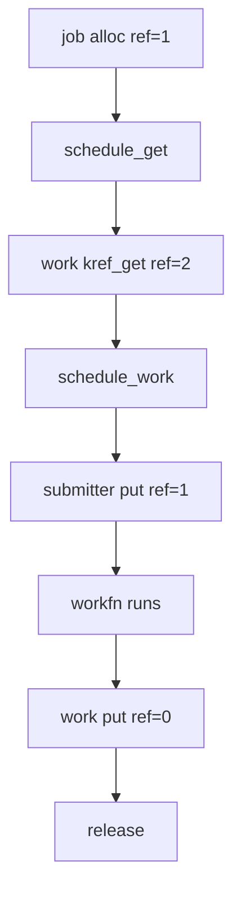
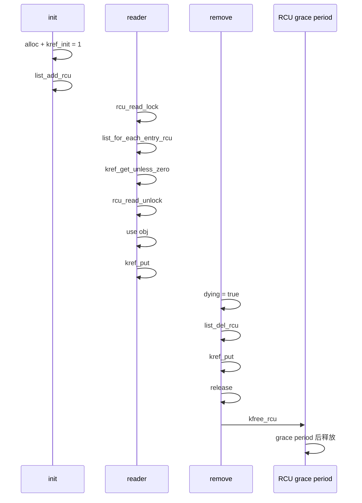
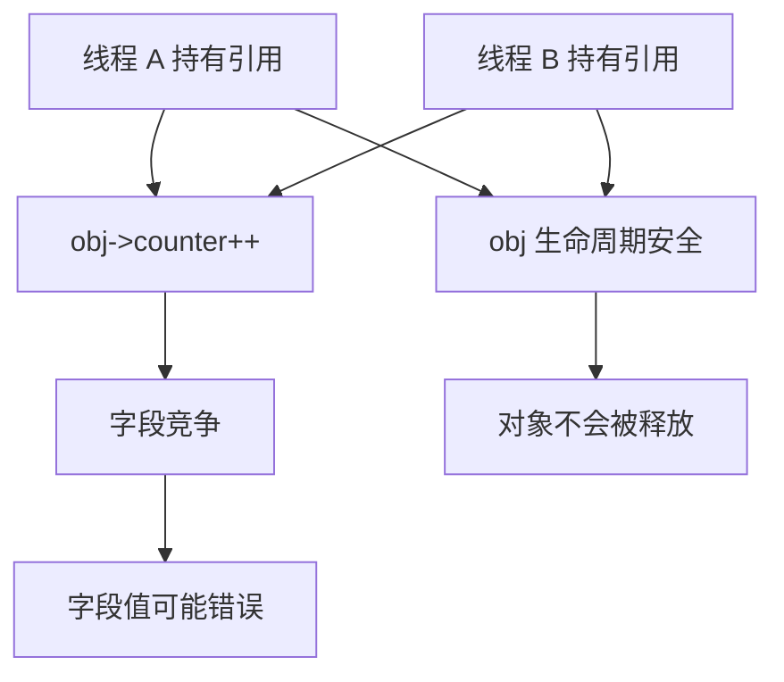
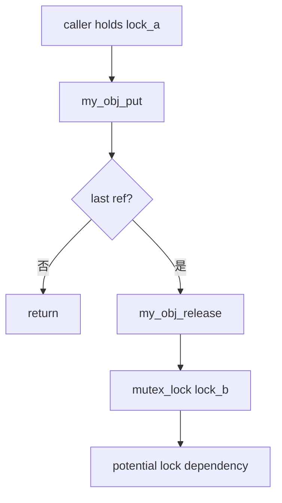
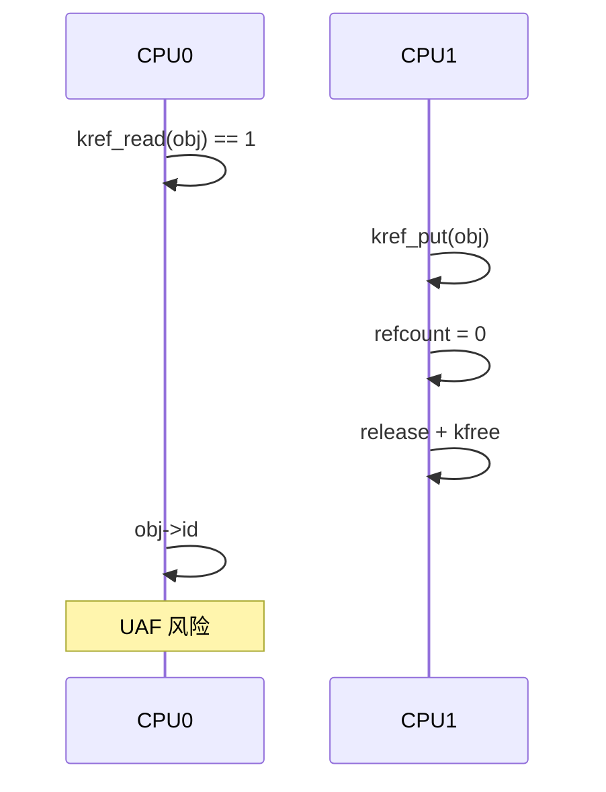
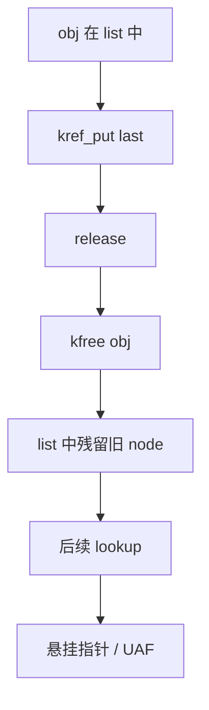
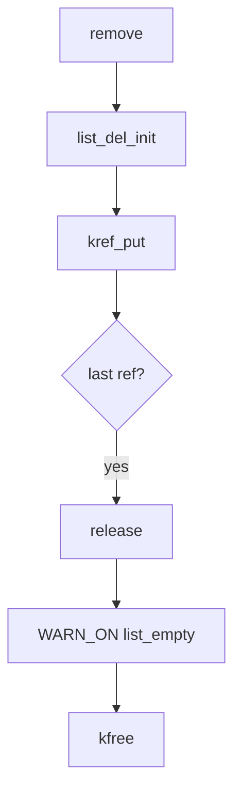
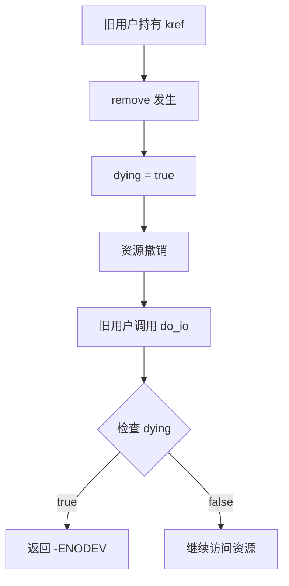
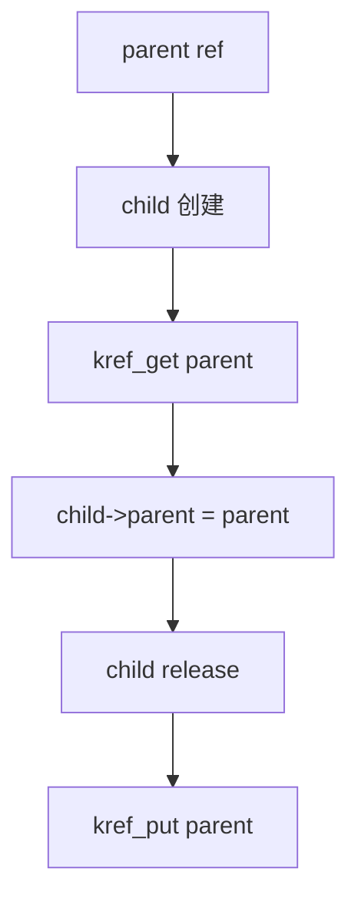
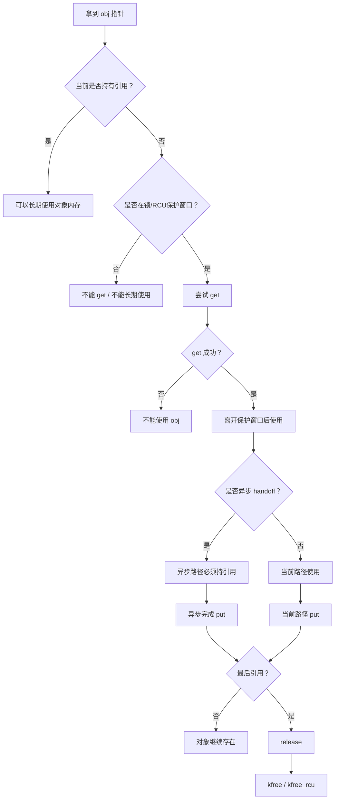

# 第14章\_源码阅读实验

## 14.1\_本章导读\_用实验验证生命周期边界

工程模板已经把创建、交付、查找、业务关闭与最终清理分开。本章把这些结论变成可观察问题：先预测谁拥有哪一份，再执行适用实验，最后沿固定源码解释结果。一次输出正确只证明被执行的路径，不自动证明所有调度、配置和错误出口都安全。

本章保留从基础、错误、lookup与handoff、RCU与工具、API误用到状态和父子关系的实验顺序。不要为后面的实验提前在最小对象里加入所有字段；每个完整单元只引入当前要观察的参与者和状态。

| 阅读阶段 | 要观察的问题 | 入口 |
| --- | --- | --- |
| 基础引用与源码 | 初始一份、追加、最后put的同步回调与局部返回值 | [P32完整基础实验](P32_基础引用与源码对照实验.md#32.1_先分清读哪份源码和运行哪个内核) |
| 错误责任 | 少get与少put分别破坏什么，错误如何变成证据 | [14.4引用错误](#14.4_引用错误实验_少_get_少_put) |
| 取得与交付 | 首次地址保护、条件取得、队列成功与失败 | [14.5查找与交付](#14.5_lookup_与_handoff_实验_从裸指针转成引用) |
| 旧读者与工具 | RCU回收期限，以及检查器配置和覆盖边界 | [14.6 RCU与诊断](#14.6_RCU_与调试工具实验_KASAN_KCSAN_lockdep) |
| 接口与状态 | 多put、计数快照、索引退出、业务关闭和父子桥接 | [14.7接口误用](#14.7_API_误用和_remove_实验_多_put_kref_read_未脱链)、[14.8状态关系](#14.8_状态和父子关系实验_生命周期不等于业务可用) |

核心提问不只是“日志有没有打印release”。还要说明get以前谁保住地址，最后put以后剩下哪种访问资格，异步使用由独立份额还是外层等待保护，旧RCU读者仍会访问哪些字节，检查器没有告警时哪些条件尚未被证明。两个顺序责任槽位也不能被记录成两线程并发实验。

涉及故意无保护访问、错误归还或泄漏的后续单元，只应在明确隔离的适用实验环境里选择执行，不能把它们和基础正确路径混成默认装入流程。先通过责任图或有界模型识别错误，再决定是否需要实际内核诊断；没有执行的故障注入不能填写为“观察到告警”。

## 14.2\_实验准备\_建议的最小模块骨架

[P32源码与运行身份](P32_基础引用与源码对照实验.md#32.1_先分清读哪份源码和运行哪个内核)先核对官方固定提交，再区分源码目录、内核构建树和运行镜像。[完整最小模块](P32_基础引用与源码对照实验.md#32.2_完整模块中只有两类存储)已经包含结构体、初始化、回调、模块入口和退出，不再要求手工拼接多个重复定义的片段。

材料Makefile登记真实模块；[构建与观察](P32_基础引用与源码对照实验.md#32.3_构建并观察一份与两份模式)说明匹配目标的构建命令、加载顺序与预期日志。工作树里的实验提交不替代官方证据，ARM前端通过也不等于目标装卸完成。

## 14.3\_基础生命周期实验\_init\_get\_put\_release

实验1和实验2共用note_kref_basics.c，仅改变holders参数。两者都在同一个初始化线程中按确定顺序执行，先排除并发噪声，把引用动作与回调位置看清楚。

### 14.3.1\_实验\_1\_最小\_kref\_对象

holders=1时，创建者把初始份额交给第一个槽位，最后put在返回前同步调用本例release并free。沿[P32一份模式](P32_基础引用与源码对照实验.md#32.3_构建并观察一份与两份模式)先写出日志顺序，再解释为何归还后的记录只读取局部返回值和对象外的统计。

### 14.3.2\_实验\_2\_两个路径持有同一对象

holders=2时，在原保护仍有效时先get，再为第二槽保存地址。第一个put返回0且不触发release；第二个返回1。完整阶段与源码对应见[P32返回值预测](P32_基础引用与源码对照实验.md#32.2.1_把返回值也放入预测)和[源码对照](P32_基础引用与源码对照实验.md#32.4_沿源码解释日志插入的位置)。指针赋值不建立份额，最后回调也不由某个特定变量名决定。

------

## 14.4\_引用错误实验\_少\_get\_少\_put

从[P33缺失与未归还责任实验](P33_缺失引用与未归还责任实验.md#33.1_先确定删除的是哪一份)先构造可重复事件轨迹，再对照已完成的真实工作模块。顺序责任检查器没有执行实际UAF、泄漏或KASAN；输出必须按证据层级解释。

### 14.4.1\_实验\_3\_故意少\_get\_观察异步\_UAF\_风险

[第一个非法动作](P33_缺失引用与未归还责任实验.md#33.3_实验三从第一个非法动作定位)比较分享缺份额、worker提前使用和正确转交。msleep只延迟时间，不构成同步；回调或框架都可能在错误释放后首先访问对象。修复还须核对提交失败和模块退出，不能一律要求异步额外get。

### 14.4.2\_实验\_4\_故意少\_put\_观察泄漏

[业务结束与剩余责任](P33_缺失引用与未归还责任实验.md#33.4_实验四先说明业务已经结束)区分leftover、still_open和incomplete。只有记录完整、被审查周期已结束且确有未结算份额时，才有本模型的漏归还证据；没有release日志不能单独证明永久泄漏。补put也必须属于该路径实际拥有的份额。

------

## 14.5\_lookup\_与\_handoff\_实验\_从裸指针转成引用

先在[P34查找窗口实验](P34_查找窗口与条件取得实验.md#34.1_先确定表是否拥有引用)取得有来源的独立份额，再沿实验7交给工作队列。地址有效、计数取得、业务接纳和异步交付各有证明条件。

### 14.5.1\_实验\_5\_list\_+\_mutex\_+\_lookup\_+\_kref\_get

[拥有型链表实验](P34_查找窗口与条件取得实验.md#34.2_实验五观察拥有型链表)使用已闭环的note_kref_table：发布另取表份额、锁内首次取得、撤下只归还本次移出的份额，失败与重复调用各自保留责任。随后沿[提前解锁反例](P34_查找窗口与条件取得实验.md#34.3_把第一次取得移出锁会发生什么)定位失效地址窗口，不执行真实悬空访问。

### 14.5.2\_实验\_6\_lookup\_改成\_kref\_get\_unless\_zero

[条件取得实验](P34_查找窗口与条件取得实验.md#34.4_实验六先制造真正的零值窗口)先改变索引所有权和清理顺序，再比较零值、正值、归零抢先与正数干扰。条件失败不交付份额，成功不代表业务仍可用；四条C11轨迹只模拟有效存储上的计数比较，不执行内核回收或真实并发。

------

### 14.5.3\_实验\_7\_workqueue\_handoff\_成功/失败路径

#### (1)\_实验目标

验证 handoff 中最重要的问题：

```text
投递成功时引用归谁？
投递失败时引用归谁？
```

#### (2)\_对象定义

```c
struct my_job {
	struct kref ref;
	struct work_struct work;
	spinlock_t lock;
	bool pending;
	bool dying;
	int id;
};
```

release：

```c
static void my_job_release(struct kref *ref)
{
	struct my_job *job = container_of(ref, struct my_job, ref);

	pr_info("my_job_release: job=%p id=%d\n", job, job->id);

	kfree(job);
}
```

put：

```c
static void my_job_put(struct my_job *job, const char *why)
{
	pr_info("JOB PUT job=%p id=%d why=%s\n", job, job->id, why);

	kref_put(&job->ref, my_job_release);
}
```

workfn：

```c
static void my_job_workfn(struct work_struct *work)
{
	struct my_job *job;

	job = container_of(work, struct my_job, work);

	pr_info("job workfn start job=%p id=%d\n", job, job->id);

	msleep(100);

	spin_lock_irq(&job->lock);
	job->pending = false;
	spin_unlock_irq(&job->lock);

	pr_info("job workfn done job=%p id=%d\n", job, job->id);

	my_job_put(job, "work done");
}
```

alloc：

```c
static struct my_job *my_job_alloc(int id)
{
	struct my_job *job;

	job = kzalloc(sizeof(*job), GFP_KERNEL);
	if (!job)
		return NULL;

	kref_init(&job->ref);
	INIT_WORK(&job->work, my_job_workfn);
	spin_lock_init(&job->lock);

	job->id = id;
	job->pending = false;
	job->dying = false;

	return job;
}
```

#### (3)\_正确\_handoff\_work\_额外\_get

```c
static int my_job_schedule_get(struct my_job *job)
{
	unsigned long flags;
	bool queued;

	spin_lock_irqsave(&job->lock, flags);

	if (job->dying || job->pending) {
		spin_unlock_irqrestore(&job->lock, flags);
		return -EBUSY;
	}

	job->pending = true;
	kref_get(&job->ref);

	spin_unlock_irqrestore(&job->lock, flags);

	queued = schedule_work(&job->work);
	if (!queued) {
		spin_lock_irqsave(&job->lock, flags);
		job->pending = false;
		spin_unlock_irqrestore(&job->lock, flags);

		my_job_put(job, "schedule failed rollback");
		return -EBUSY;
	}

	return 0;
}
```

实验：

```c
static void experiment_7_workqueue_handoff(void)
{
	struct my_job *job;
	int ret;

	pr_info("=== experiment 7: workqueue handoff ===\n");

	job = my_job_alloc(7);
	if (!job)
		return;

	ret = my_job_schedule_get(job);
	if (ret)
		pr_info("schedule failed ret=%d\n", ret);

	my_job_put(job, "submitter done");
}
```

#### (4)\_期望引用变化

```text
alloc:
    ref = 1

schedule_get:
    ref = 2，work 持有一份

submitter put:
    ref = 1

workfn done:
    ref = 0，release
```

流程图：



#### (5)\_实验结论

workqueue handoff 要写清楚：

```text
work 是否持有引用；
schedule_work 返回 false 时是否需要回滚；
workfn 末尾是否 put；
submitter 成功投递后是否还能访问对象。
```

------

## 14.6\_RCU\_与调试工具实验\_KASAN\_KCSAN\_lockdep

### 14.6.1\_实验\_8\_RCU\_lookup\_+\_kfree\_rcu

#### (1)\_实验目标

验证第 10 章模型：

```text
RCU 保护 lookup 窗口；
kref_get_unless_zero() 把临时指针转换成长期引用；
release 中不能直接 kfree RCU 可见对象；
应使用 kfree_rcu() 或 call_rcu()。
```

#### (2)\_对象定义

```c
struct my_rcu_obj {
	struct kref ref;
	struct rcu_head rcu;
	struct list_head node;

	spinlock_t lock;
	bool dying;

	int id;
};

static LIST_HEAD(my_rcu_list);
static DEFINE_SPINLOCK(my_rcu_list_lock);
```

release：

```c
static void my_rcu_obj_release(struct kref *ref)
{
	struct my_rcu_obj *obj;

	obj = container_of(ref, struct my_rcu_obj, ref);

	pr_info("my_rcu_obj_release: obj=%p id=%d\n", obj, obj->id);

	kfree_rcu(obj, rcu);
}
```

put：

```c
static void my_rcu_obj_put(struct my_rcu_obj *obj, const char *why)
{
	pr_info("RCU PUT obj=%p id=%d why=%s\n", obj, obj->id, why);

	kref_put(&obj->ref, my_rcu_obj_release);
}
```

alloc：

```c
static struct my_rcu_obj *my_rcu_obj_alloc(int id)
{
	struct my_rcu_obj *obj;

	obj = kzalloc(sizeof(*obj), GFP_KERNEL);
	if (!obj)
		return NULL;

	kref_init(&obj->ref);
	INIT_LIST_HEAD(&obj->node);
	spin_lock_init(&obj->lock);

	obj->id = id;
	obj->dying = false;

	return obj;
}
```

publish：

```c
static void my_rcu_obj_publish(struct my_rcu_obj *obj)
{
	spin_lock(&my_rcu_list_lock);
	list_add_rcu(&obj->node, &my_rcu_list);
	spin_unlock(&my_rcu_list_lock);

	pr_info("RCU publish obj=%p id=%d\n", obj, obj->id);
}
```

lookup + get：

```c
static struct my_rcu_obj *my_rcu_obj_lookup_get(int id)
{
	struct my_rcu_obj *obj;
	struct my_rcu_obj *found = NULL;

	rcu_read_lock();

	list_for_each_entry_rcu(obj, &my_rcu_list, node) {
		if (obj->id != id)
			continue;

		if (!kref_get_unless_zero(&obj->ref))
			break;

		spin_lock(&obj->lock);
		if (obj->dying) {
			spin_unlock(&obj->lock);
			rcu_read_unlock();

			my_rcu_obj_put(obj, "dying rollback");
			return NULL;
		}
		spin_unlock(&obj->lock);

		found = obj;
		break;
	}

	rcu_read_unlock();

	return found;
}
```

remove：

```c
static void my_rcu_obj_remove(struct my_rcu_obj *obj)
{
	spin_lock(&obj->lock);
	obj->dying = true;
	spin_unlock(&obj->lock);

	spin_lock(&my_rcu_list_lock);
	list_del_rcu(&obj->node);
	spin_unlock(&my_rcu_list_lock);

	my_rcu_obj_put(obj, "remove publish ref");
}
```

实验：

```c
static void experiment_8_rcu_lookup(void)
{
	struct my_rcu_obj *obj;
	struct my_rcu_obj *found;

	pr_info("=== experiment 8: RCU lookup ===\n");

	obj = my_rcu_obj_alloc(8);
	if (!obj)
		return;

	my_rcu_obj_publish(obj);

	found = my_rcu_obj_lookup_get(8);
	if (found) {
		pr_info("RCU lookup success obj=%p id=%d\n", found, found->id);
		my_rcu_obj_put(found, "lookup user done");
	}

	my_rcu_obj_remove(obj);
}
```

#### (3)\_期望结论

引用变化：

```text
alloc:
    ref = 1，发布引用

lookup_get:
    ref = 2，lookup 用户引用

lookup user put:
    ref = 1

remove:
    list_del_rcu
    ref = 0
    release
    kfree_rcu
```

时序图：



#### (4)\_错误对照\_release\_中直接\_kfree

错误代码：

```c
static void my_rcu_obj_release_bad(struct kref *ref)
{
	struct my_rcu_obj *obj;

	obj = container_of(ref, struct my_rcu_obj, ref);

	kfree(obj);   /* 错误：旧 RCU 读者可能仍在临界区 */
}
```

错误点：

```text
最后一个长期引用归零，不等于覆盖取消发布前潜在 RCU 旧读者的宽限期已经完成。
```

正确结论：

```text
RCU 可见对象的内存释放必须撑过 grace period。
```

------

### 14.6.2\_实验\_9\_KASAN\_观察\_UAF

#### (1)\_实验目标

用 KASAN 观察：

```text
少 get；
put 后访问；
release 后访问；
异步路径访问已释放对象。
```

#### (2)\_建议内核配置

测试内核建议打开：

```bash
CONFIG_KASAN=y
CONFIG_KASAN_GENERIC=y
CONFIG_STACKTRACE=y
CONFIG_SLUB_DEBUG=y
```

如果是较新架构，也可能使用：

```bash
CONFIG_KASAN_SW_TAGS=y
CONFIG_KASAN_HW_TAGS=y
```

具体取决于架构和内核配置能力。

#### (3)\_故意\_put\_后访问

```c
static void experiment_9_kasan_put_after_use(void)
{
	struct my_obj *obj;
	int id;

	pr_info("=== experiment 9: KASAN put-after-use ===\n");

	obj = my_obj_alloc(9);
	if (!obj)
		return;

	id = obj->id;

	my_obj_put(obj, "trigger release");

	/*
	 * 故意错误：
	 * 如果上面 put 触发 release，这里访问 obj->id 就是 UAF。
	 */
	pr_info("bad access after put: obj=%p id=%d saved_id=%d\n",
		obj, obj->id, id);
}
```

#### (4)\_期望现象

如果 KASAN 生效，可能看到类似：

```text
BUG: KASAN: use-after-free in ...
Read of size ...
Call Trace:
  experiment_9_kasan_put_after_use
  ...
Freed by task ...
Allocated by task ...
```

#### (5)\_实验结论

这个实验验证：

```text
put 后不能访问对象；
即使只是打印字段，也可能 UAF；
需要的字段必须在 put 前保存。
```

正确写法：

```c
id = obj->id;

my_obj_put(obj, "done");

pr_info("obj id=%d released/ref dropped\n", id);
```

------

### 14.6.3\_实验\_10\_KCSAN\_观察字段竞争

#### (1)\_实验目标

验证：

```text
kref 保护对象生命周期；
不保护字段互斥。
```

#### (2)\_扩展对象

```c
struct my_race_obj {
	struct kref ref;
	int counter;
};
```

两个线程同时修改：

```c
static int race_thread_fn(void *data)
{
	struct my_race_obj *obj = data;
	int i;

	for (i = 0; i < 100000 && !kthread_should_stop(); i++)
		obj->counter++;

	return 0;
}
```

实验入口：

```c
static void experiment_10_kcsan_race(void)
{
	struct my_race_obj *obj;
	struct task_struct *t1;
	struct task_struct *t2;

	pr_info("=== experiment 10: KCSAN data race ===\n");

	obj = kzalloc(sizeof(*obj), GFP_KERNEL);
	if (!obj)
		return;

	kref_init(&obj->ref);
	obj->counter = 0;

	t1 = kthread_run(race_thread_fn, obj, "kref_race_1");
	t2 = kthread_run(race_thread_fn, obj, "kref_race_2");

	msleep(1000);

	if (!IS_ERR(t1))
		kthread_stop(t1);
	if (!IS_ERR(t2))
		kthread_stop(t2);

	pr_info("counter=%d\n", obj->counter);

	kfree(obj);
}
```

#### (3)\_期望现象

如果 KCSAN 打开，可能报告 data race。

#### (4)\_正确修复

加锁：

```c
struct my_race_obj {
	struct kref ref;
	spinlock_t lock;
	int counter;
};
```

修改：

```c
spin_lock(&obj->lock);
obj->counter++;
spin_unlock(&obj->lock);
```

或者使用原子变量：

```c
atomic_t counter;
```

修改：

```c
atomic_inc(&obj->counter);
```

#### (5)\_实验结论

```text
两个线程都持有对象引用；
对象不会被释放；
但 obj->counter 仍然会发生字段竞争。
```

这说明：

```text
kref 不是锁。
```

图示：



------

### 14.6.4\_实验\_11\_lockdep\_观察锁顺序

#### (1)\_实验目标

验证：

```text
kref 与锁组合时，锁顺序必须固定；
release 中拿锁可能引入死锁。
```

#### (2)\_建议内核配置

```bash
CONFIG_LOCKDEP=y
CONFIG_PROVE_LOCKING=y
CONFIG_DEBUG_MUTEXES=y
CONFIG_DEBUG_SPINLOCK=y
```

#### (3)\_错误模型

假设两个锁：

```c
static DEFINE_MUTEX(lock_a);
static DEFINE_MUTEX(lock_b);
```

路径 1：

```c
mutex_lock(&lock_a);
mutex_lock(&lock_b);
...
mutex_unlock(&lock_b);
mutex_unlock(&lock_a);
```

路径 2：

```c
mutex_lock(&lock_b);
mutex_lock(&lock_a);
...
mutex_unlock(&lock_a);
mutex_unlock(&lock_b);
```

lockdep 可能报告锁依赖反转。

#### (4)\_和\_kref\_的关系

kref 相关的危险点是：

```text
最后一个 kref_put 会同步进入 release；
release 如果拿锁，就等于 kref_put 调用点隐式拿了这把锁。
```

例如：

```c
static void my_obj_release(struct kref *ref)
{
	struct my_obj *obj = container_of(ref, struct my_obj, ref);

	mutex_lock(&global_lock);
	...
	mutex_unlock(&global_lock);

	kfree(obj);
}
```

那么所有调用：

```c
my_obj_put(obj);
```

的路径，都可能在最后一个 put 时进入：

```text
mutex_lock(&global_lock)
```

所以要审查：

```text
my_obj_put() 调用点当前持有哪些锁？
release 里面又拿哪些锁？
锁顺序是否和其他路径冲突？
```

#### (5)\_实验结论

```text
kref_put() 表面上只是 put；
但最后一个 put 会进入 release；
release 中的锁也属于 kref_put 调用路径的锁依赖。
```

图示：



------

## 14.7\_API\_误用和\_remove\_实验\_多\_put\_kref\_read\_未脱链

### 14.7.1\_实验\_12\_refcount\_warning\_观察多\_put

#### (1)\_实验目标

验证：

```text
多 put 可能触发 refcount underflow / warning；
也可能导致提前 release 和 UAF。
```

#### (2)\_错误实验代码

```c
static void experiment_12_double_put_bad(void)
{
	struct my_obj *obj;

	pr_info("=== experiment 12: double put bad ===\n");

	obj = my_obj_alloc(12);
	if (!obj)
		return;

	my_obj_put(obj, "first put");

	/*
	 * 故意错误：
	 * first put 已经可能释放 obj。
	 */
	my_obj_put(obj, "second put");
}
```

#### (3)\_可能现象

可能出现：

```text
release 后继续访问；
KASAN UAF；
refcount warning；
直接崩溃；
或者因为内存复用导致表现不稳定。
```

#### (4)\_实验结论

多 put 的根因：

```text
同一份引用被释放了两次。
```

正确方式不是“判断 refcount 是否大于 0 再 put”。

错误修复：

```c
if (kref_read(&obj->ref) > 0)
	my_obj_put(obj, "maybe put");
```

这是错误思路。

正确修复是：

```text
审查引用归属；
确保一份 get 只对应一份 put；
handoff 成功失败路径写清楚。
```

------

### 14.7.2\_实验\_13\_kref\_read\_不能判断对象有效

#### (1)\_实验目标

验证：

```text
kref_read() 只是读一个瞬间值；
不能作为对象有效性判断。
```

#### (2)\_错误代码

```c
static void experiment_13_kref_read_bad(struct my_obj *obj)
{
	if (kref_read(&obj->ref) > 0) {
		/*
		 * 错误：
		 * 这里不能说明当前路径持有引用。
		 */
		pr_info("obj seems alive id=%d\n", obj->id);
	}
}
```

#### (3)\_并发窗口



#### (4)\_实验结论

`kref_read()` 可以用于：

```text
debug；
日志；
统计；
WARN 辅助。
```

不能用于：

```text
判断对象是否可访问；
判断是否可以 get；
判断是否可以返回 obj；
判断对象是否业务可用。
```

真正要使用对象，必须：

```text
当前已经持有引用；
或者在锁/RCU 保护下成功 get。
```

------

### 14.7.3\_实验\_14\_release\_前未脱链

#### (1)\_实验目标

验证：

```text
对象 release 时如果仍挂在全局集合中，后续 lookup 会得到悬挂指针。
```

#### (2)\_错误\_release

```c
static void my_list_obj_release_bad(struct kref *ref)
{
	struct my_list_obj *obj;

	obj = container_of(ref, struct my_list_obj, ref);

	/*
	 * 错误：
	 * 没有 list_del_init。
	 * 如果 obj 还在 my_list 中，全局 list 会残留悬挂指针。
	 */
	kfree(obj);
}
```

#### (3)\_正确断言

```c
static void my_list_obj_release(struct kref *ref)
{
	struct my_list_obj *obj;

	obj = container_of(ref, struct my_list_obj, ref);

	WARN_ON(!list_empty(&obj->node));

	kfree(obj);
}
```

#### (4)\_实验结论

release 前必须明确：

```text
对象是否已经从 list/hash/xarray/idr 中取消发布；
对象是否仍然能被 lookup 找到；
对象是否仍然挂在 timer/work/callback 中。
```

图示：



正确模型：



------

## 14.8\_状态和父子关系实验\_生命周期不等于业务可用

### 14.8.1\_实验\_15\_remove\_后旧用户仍持有引用

#### (1)\_实验目标

验证：

```text
remove 后，对象内存可能还活着；
但业务资源可能已经不可用；
旧用户必须检查 dying/state。
```

#### (2)\_对象

```c
struct my_state_obj {
	struct kref ref;
	struct mutex lock;
	bool dying;
	int id;
	int resource;
};
```

业务使用：

```c
static int my_state_obj_do_io(struct my_state_obj *obj)
{
	int ret = 0;

	mutex_lock(&obj->lock);
	if (obj->dying) {
		mutex_unlock(&obj->lock);
		return -ENODEV;
	}

	/*
	 * 这里才允许访问业务资源。
	 */
	pr_info("do io resource=%d\n", obj->resource);

	mutex_unlock(&obj->lock);

	return ret;
}
```

remove：

```c
static void my_state_obj_remove(struct my_state_obj *obj)
{
	mutex_lock(&obj->lock);
	obj->dying = true;
	obj->resource = -1;
	mutex_unlock(&obj->lock);

	/*
	 * 释放发布引用。
	 * 旧用户可能还持有引用，但业务入口会看到 dying。
	 */
	kref_put(&obj->ref, my_state_obj_release);
}
```

#### (3)\_实验结论

```text
kref 只能保证 obj 这个内存对象还没释放；
不能保证 obj 背后的硬件、buffer、DMA、队列仍然可用。
```

所以要区分：

```text
生命周期有效；
业务状态可用；
资源仍然可用。
```

图示：



------

### 14.8.2\_实验\_16\_父子对象引用关系

#### (1)\_实验目标

验证：

```text
child 如果 release 中要访问 parent，就必须持有 parent 引用。
```

#### (2)\_对象

```c
struct my_parent {
	struct kref ref;
	int id;
};

struct my_child {
	struct kref ref;
	struct my_parent *parent;
	int id;
};
```

parent release：

```c
static void my_parent_release(struct kref *ref)
{
	struct my_parent *parent;

	parent = container_of(ref, struct my_parent, ref);

	pr_info("parent release id=%d\n", parent->id);

	kfree(parent);
}
```

child release：

```c
static void my_child_release(struct kref *ref)
{
	struct my_child *child;
	struct my_parent *parent;

	child = container_of(ref, struct my_child, ref);
	parent = child->parent;

	pr_info("child release id=%d parent=%p\n", child->id, parent);

	kfree(child);

	kref_put(&parent->ref, my_parent_release);
}
```

child 创建时 get parent：

```c
static struct my_child *my_child_alloc(struct my_parent *parent, int id)
{
	struct my_child *child;

	child = kzalloc(sizeof(*child), GFP_KERNEL);
	if (!child)
		return NULL;

	kref_init(&child->ref);

	kref_get(&parent->ref);
	child->parent = parent;
	child->id = id;

	return child;
}
```

#### (3)\_引用图



#### (4)\_实验结论

如果对象之间有指针关系，必须区分：

```text
普通指针关系；
引用持有关系；
集合归属关系；
父子生命周期关系。
```

一句话：

```text
child->parent 只是指针；
child 是否保护 parent，要看 child 创建时有没有 get parent。
```

------

## 14.9\_实验记录和代码组织

### 14.9.1\_实验记录模板

每个实验建议记录下面内容：

```text
实验名称：
    例如：workqueue handoff 缺少 get

实验目标：
    验证异步路径必须持有引用。

关键代码：
    schedule_work 前是否 get；
    workfn 末尾是否 put。

预期日志：
    get/put/release 顺序。

实际现象：
    是否 release 过早；
    是否 KASAN 报 UAF；
    是否 release 未发生。

结论：
    对应哪条 kref 规则。
```

示例：

```text
实验名称：
    实验 3：workqueue 少 get

预期错误：
    submitter put 后 release；
    workfn 后访问已释放对象。

观察结果：
    KASAN 报 use-after-free。

结论：
    异步路径保存 obj 指针前必须 get；
    workfn 结束必须 put。
```

------

### 14.9.2\_实验代码组织建议

建议不要把所有实验一次性打开。

可以用模块参数选择实验：

```c
static int test_id;
module_param(test_id, int, 0644);
MODULE_PARM_DESC(test_id, "kref lab test id");
```

入口：

```c
static int __init kref_lab_init(void)
{
	pr_info("kref_lab init test_id=%d\n", test_id);

	switch (test_id) {
	case 1:
		experiment_1_minimal();
		break;
	case 2:
		experiment_2_two_refs();
		break;
	case 3:
		experiment_3_missing_get_good();
		break;
	case 4:
		experiment_4_missing_put_bad();
		break;
	case 5:
		experiment_5_lookup_good();
		break;
	case 8:
		experiment_8_rcu_lookup();
		break;
	default:
		pr_info("no experiment selected\n");
		break;
	}

	return 0;
}
```

加载指定实验：

```bash
sudo insmod kref_lab.ko test_id=1
sudo rmmod kref_lab
```

这样做的好处：

```text
每次只跑一个实验；
日志干净；
故意错误实验不会互相干扰；
方便开关 KASAN/KCSAN/lockdep 观察。
```

------

## 14.10\_本章实验总表

| 实验                        | 验证点                 | 预期结论                       |
| --------------------------- | ---------------------- | ------------------------------ |
| 实验 1：最小 kref 对象      | init/put/release       | 最后 put 同步触发 release      |
| 实验 2：两个路径持有对象    | 多引用                 | 最后一个 put 才释放            |
| 实验 3：少 get              | 异步 UAF               | 异步路径必须 get               |
| 实验 4：少 put              | 泄漏                   | 每个 get 必须 put              |
| 实验 5：list + mutex lookup | 锁内 get               | 锁外使用必须持引用             |
| 实验 6：get_unless_zero     | 非 0 才 get            | 不证明指针有效                 |
| 实验 7：workqueue handoff   | 引用转移               | 成功/失败路径要定义归属        |
| 实验 8：RCU lookup          | RCU + kref             | RCU 保护 lookup，kref 保护后续 |
| 实验 9：KASAN               | UAF                    | put 后访问会暴露               |
| 实验 10：KCSAN              | 字段竞争               | kref 不是锁                    |
| 实验 11：lockdep            | 锁顺序                 | release 中拿锁也算调用路径     |
| 实验 12：多 put             | underflow/UAF          | 一份引用只能 put 一次          |
| 实验 13：kref_read          | 读计数不等于持引用     | 不能用来判断对象有效           |
| 实验 14：release 未脱链     | 悬挂指针               | release 前必须取消发布         |
| 实验 15：remove 后旧用户    | 生命周期和业务状态分离 | 旧用户要检查 dying/state       |
| 实验 16：父子引用           | 子对象保护父对象       | 指针不等于引用                 |

------

## 14.11\_本章最终检查问题

做完实验后，至少应该能回答：

```text
1. 为什么 kref_put() 后不能打印 obj->id？
2. 为什么 schedule_work() 前要给 work 一份引用？
3. 如果 schedule_work() 失败，刚 get 的引用归谁？
4. 为什么少 put 不一定立刻崩溃，而是泄漏？
5. 为什么多 put 可能不是 underflow，而是提前 UAF？
6. 为什么 list 查到 obj 后不能锁外裸用？
7. 为什么 kref_get_unless_zero() 不能放在 rcu_read_unlock() 之后？
8. 为什么 RCU release 里不能直接 kfree？
9. 为什么对象还有 kref 引用，不代表硬件资源仍然可用？
10. 为什么 get_device() 和私有 kref 不能混用？
```

如果这些问题答不上来，说明还没有真正掌握 kref。

------

## 14.12\_本章小结

本章通过实验验证了前面所有核心规则。

最重要的实验结论是：

```text
kref_init() 创建初始引用；
kref_get() 增加长期持有者；
kref_put() 释放当前持有者；
最后一个 put 同步进入 release；
put 后不能访问对象；
异步路径必须持有自己的引用；
lookup + get 必须在锁或 RCU 保护窗口内完成；
kref_get_unless_zero() 不证明指针有效；
RCU 对象释放必须撑过 grace period；
kref 不保护字段互斥；
kref 不保护业务资源可用性。
```

最终实验主线可以画成这样：



一句话总结：

```text
源码阅读实验的目的不是证明 refcount 会加减；
而是证明对象所有权、lookup 窗口、handoff 归属和 release 边界是否真的清楚。
```

------

专题导航：[kref 引用计数机制章节大纲](大纲.md)。

上一篇：[工程模板](P13_工程模板.md)。

下一篇：[最终验收标准](P15_最终验收标准.md)。
