# 第15章_最终验收标准

## 15.1_本章导读_最终验收看所有权协议

本章是整个 `kref 引用计数机制` 的收束章节。

前面章节已经覆盖：

```text
第 1 章：问题域和边界
第 2 章：源码入口和结构模型
第 3 章：生命周期状态机
第 4 章：三条核心规则
第 5 章：基础 API
第 6 章：release 回调
第 7 章：handoff 所有权转移
第 8 章：lookup 场景
第 9 章：kref 与锁
第 10 章：kref 与 RCU
第 11 章：kref、refcount_t、kobject、device 边界
第 12 章：典型错误模式
第 13 章：工程模板
第 14 章：源码阅读实验
```

所以第 15 章不再引入新知识点。

本章只回答一个问题：

```text
学完 kref 后，到底怎样才算真正掌握？
```

本章的验收标准不是：

```text
会写 kref_get();
会写 kref_put();
知道 refcount 会加减。
```

而是：

```text
能判断一个对象是否需要 kref；
能设计引用归属；
能审查 lookup + get 是否安全；
能区分生命周期、字段互斥、业务状态；
能处理 handoff、remove、release、RCU；
能定位 UAF、泄漏、多 put、复活对象等问题。
```

最终目标是：

```text
看到一个对象生命周期问题时，
不是先问 refcount 是多少，
而是先问谁持有对象、谁负责释放、对象从哪里还能被找到。
```

整体能力图：

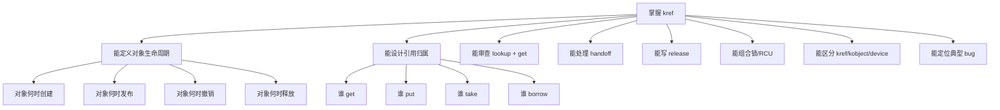

一句话：

```text
kref 的最终验收，不是会不会调用 API，
而是能不能把对象所有权协议讲清楚。
```

------

## 15.2_验收主线

整个 kref 学习最后必须回到这几个 P0 问题：

```text
谁持有对象？
谁负责 get？
谁负责 put？
对象从哪里可被查到？
get 前由什么机制证明对象有效？
put 后还有没有资格访问对象？
最后一个 put 时如何 release？
对象内存什么时候真正释放？
```

这些问题答不清，就不能说掌握 kref。

对应关系如下：

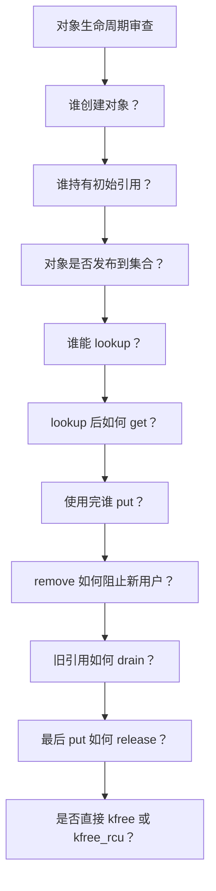

P0 判断标准：

```text
如果一个设计不能回答这些问题，
它不是“还没完善”，
而是生命周期协议还没有成立。
```

------

## 15.3_核心概念验收_生命周期_指针和引用

### 15.3.1_验收一_能说清_kref_保护什么_不保护什么

必须能立即回答：

```text
kref 保护对象内存生命周期。
```

也就是：

```text
只要当前路径成功持有 kref 引用，
对象本体不能被 release/free。
```

但是 kref 不保护：

```text
1. 对象字段并发访问。
2. 对象是否还在 list/hash/xarray 中。
3. 对象是否还允许新业务进入。
4. 对象背后的硬件是否还可用。
5. 对象是否已经 remove。
6. lookup 得到的裸指针是否有效。
7. RCU 读者是否全部退出。
8. device/class/bus 的完整生命周期。
```

验收问答：

```text
问：两个线程都 kref_get 了同一个对象，是否可以同时修改 obj->state？

答：不能仅凭 kref 判断。
kref 只保证 obj 内存不释放；
obj->state 是否能并发修改，需要锁、原子变量或状态机保护。
```

图示：

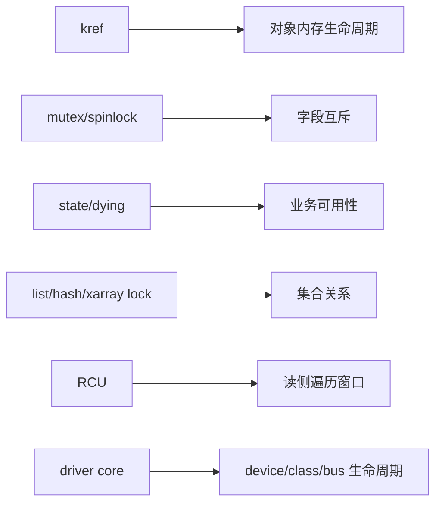

必须避免下面这种错误表达：

```text
kref 保护对象安全。
```

更准确的表达是：

```text
kref 只保护对象生命周期中的内存存在性；
对象访问安全还需要锁、RCU、状态机和框架规则共同保证。
```

------

### 15.3.2_验收二_能解释为什么有指针不等于有引用

必须能说清楚：

```text
指针只是地址；
引用是生命周期所有权。
```

错误理解：

```text
我拿到了 obj 指针，所以 obj 就能用。
```

正确理解：

```text
我拿到了 obj 指针，只说明我知道一个地址；
除非当前路径已经持有引用，
或者正在锁/RCU 保护窗口内，
否则不能证明这个地址仍然属于活对象。
```

验收代码：

```c
obj = find_obj(id);

do_something(obj);    /* 是否安全？ */
```

必须能回答：

```text
不能直接判断。
要先问 find_obj(id) 返回的是强引用，还是借用指针。
```

如果 `find_obj()` 的契约是：

```text
返回已持引用对象。
```

那调用者用完必须 put。

如果 `find_obj()` 的契约是：

```text
返回锁内借用指针。
```

那离开锁后不能使用。

如果没有契约，这个 API 就是不合格的。

图示：

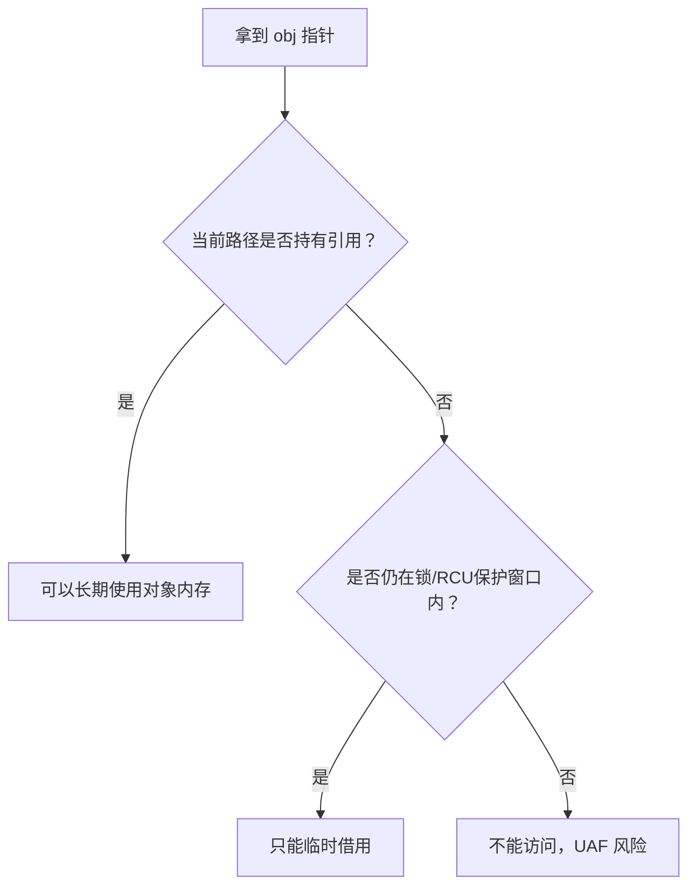

验收标准：

```text
能把 pointer、borrow、strong reference 三者分开。
```

------

### 15.3.3_验收三_能解释为什么_kref_init_初始值是_1

必须能回答：

```text
kref_init() 初始化的是对象的第一份引用。
```

这份引用通常归：

```text
创建者；
发布者；
当前初始化路径；
拥有这个对象的初始上下文。
```

不是：

```text
初始值为 1 是因为对象天然有一个用户。
```

而是：

```text
对象刚创建完成后，必须至少有一个明确持有者；
否则对象刚创建就没有生命周期归属。
```

典型流程：

```c
obj = kzalloc(sizeof(*obj), GFP_KERNEL);
if (!obj)
	return NULL;

kref_init(&obj->ref);

/*
 * 当前路径持有初始引用。
 */
```

验收问题：

```text
如果 my_obj_create() 成功返回 obj，这份初始引用归谁？
```

合格回答：

```text
归调用者。
调用者必须在不再使用时 my_obj_put()。
```

如果对象会被发布到全局表，也必须说清：

```text
发布后，是全局表持有初始引用，
还是调用者仍然持有初始引用，
还是 create/publish 发生了 handoff。
```

图示：

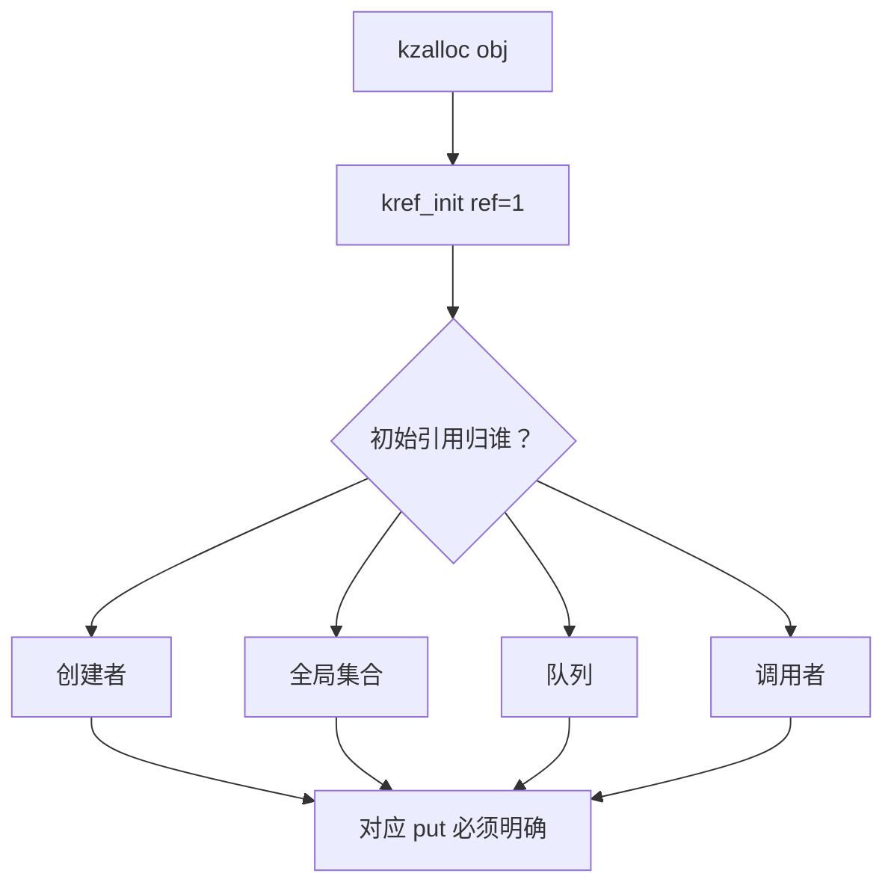

验收标准：

```text
看到 kref_init()，能立即说出初始引用归属。
```

------

### 15.3.4_验收四_能解释为什么_get_前必须证明对象有效

必须能说清楚：

```text
kref_get() 的前提是 obj->ref 本身所在内存仍然有效。
```

错误代码：

```c
obj = lookup_obj(id);
kref_get(&obj->ref);
```

不能直接说它对，也不能直接说它错。

必须先问：

```text
lookup_obj(id) 有没有保护？
返回的是强引用还是裸指针？
lookup 和 get 是否在同一个保护窗口内？
```

mutex/list 正确模型：

```c
mutex_lock(&obj_list_lock);

obj = find_obj_locked(id);
if (obj)
	kref_get(&obj->ref);

mutex_unlock(&obj_list_lock);
```

RCU 正确模型：

```c
rcu_read_lock();

obj = find_obj_rcu(id);
if (obj && !kref_get_unless_zero(&obj->ref))
	obj = NULL;

rcu_read_unlock();
```

错误模型：

```c
rcu_read_lock();
obj = find_obj_rcu(id);
rcu_read_unlock();

if (obj)
	kref_get_unless_zero(&obj->ref);  /* 错误 */
```

原因：

```text
rcu_read_unlock() 之后，obj 指针本身已经失去 RCU 保护。
```

验收图：

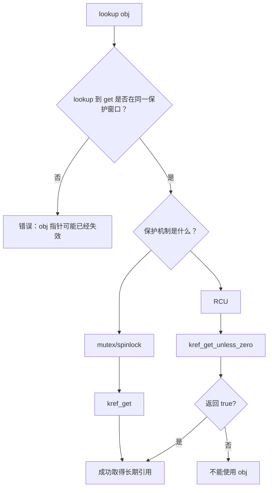

验收标准：

```text
能把“get 前对象有效性证明”说成独立步骤。
```

------

### 15.3.5_验收五_能解释为什么_put_后不能继续访问对象

必须能回答：

```text
kref_put() 可能触发最后一个引用归零；
如果归零，release 会同步执行；
release 可能 kfree 对象；
所以 put 后当前路径不能再访问 obj。
```

错误代码：

```c
kref_put(&obj->ref, my_obj_release);

pr_info("obj id=%d\n", obj->id);   /* 错误 */
```

正确代码：

```c
int id = obj->id;

kref_put(&obj->ref, my_obj_release);

pr_info("obj id=%d\n", id);
```

如果字段需要锁保护：

```c
int id;

mutex_lock(&obj->lock);
id = obj->id;
mutex_unlock(&obj->lock);

kref_put(&obj->ref, my_obj_release);

pr_info("obj id=%d\n", id);
```

put 时序：

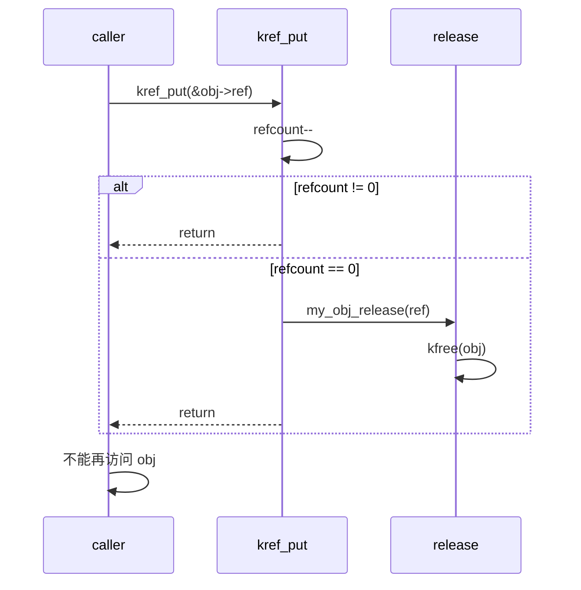

验收标准：

```text
看到 put 后还有 obj->field，必须立刻警觉。
```

------

### 15.3.6_验收六_能解释_release_为什么拿到_struct_kref_*

裸 kref release 的典型形式：

```c
static void my_obj_release(struct kref *ref)
{
	struct my_obj *obj = container_of(ref, struct my_obj, ref);

	kfree(obj);
}
```

必须能解释：

```text
kref 是嵌入在业务对象内部的成员；
kref_put() 只知道 struct kref *；
release 通过 container_of 找回外层业务对象；
然后释放整个业务对象。
```

必须能区分：

```text
kref release:
    参数是 struct kref *

kobject release:
    参数是 struct kobject *

device release:
    参数是 struct device *
```

对比：

```c
static void my_obj_release(struct kref *ref)
{
	struct my_obj *obj = container_of(ref, struct my_obj, ref);
	kfree(obj);
}

static void my_kobj_release(struct kobject *kobj)
{
	struct my_obj *obj = container_of(kobj, struct my_obj, kobj);
	kfree(obj);
}

static void my_dev_release(struct device *dev)
{
	struct my_device *mdev = container_of(dev, struct my_device, dev);
	kfree(mdev);
}
```

图示：

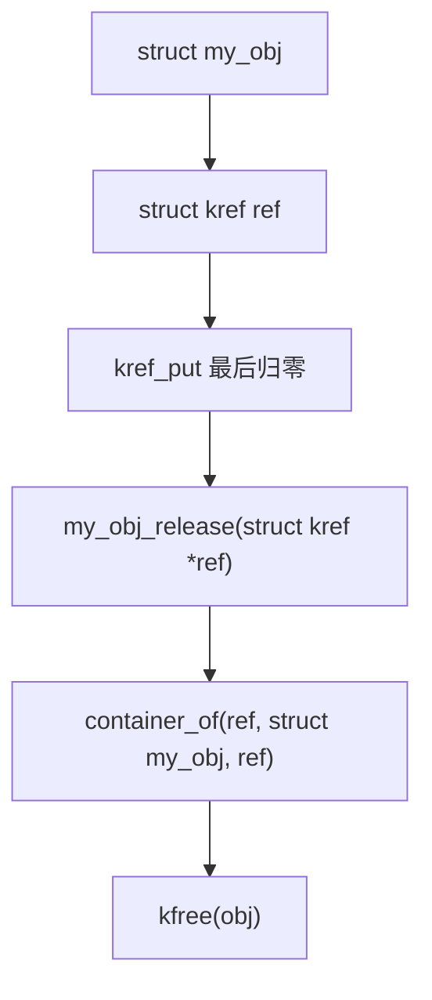

验收标准：

```text
能说明 release 参数为什么不是 void *obj；
能说明 container_of 在 release 中的作用；
能区分 kref/kobject/device release。
```

------

## 15.4_使用场景验收_handoff_lookup_锁和_RCU

### 15.4.1_验收七_能设计_handoff_成功和失败路径

handoff 是 kref 工程里最容易出错的部分。

必须能区分三种模型：

```text
get 模型：
    被调用者新增一份引用。

take 模型：
    被调用者接管调用者当前引用。

borrow 模型：
    被调用者只临时使用，不长期保存。
```

#### (1)_get_模型验收

```c
/*
 * 成功时队列新增引用；
 * 失败时不新增引用；
 * 调用者始终保留自己的引用。
 */
static int my_obj_enqueue_get(struct queue *q, struct my_obj *obj)
{
	int ret;

	kref_get(&obj->ref);

	ret = queue_push(q, obj);
	if (ret) {
		kref_put(&obj->ref, my_obj_release);
		return ret;
	}

	return 0;
}
```

必须能说清：

```text
成功：
    队列持有一份新引用；
    调用者仍持有原引用。

失败：
    函数内部 put 回滚；
    调用者仍持有原引用。
```

#### (2)_take_模型验收

```c
/*
 * 成功时队列接管调用者当前引用；
 * 失败时调用者仍然持有引用。
 */
static int my_obj_enqueue_take(struct queue *q, struct my_obj *obj)
{
	int ret;

	ret = queue_push(q, obj);
	if (ret)
		return ret;

	return 0;
}
```

必须能说清：

```text
成功：
    调用者不能再访问 obj；
    调用者不能再 put obj；
    队列负责最终 put。

失败：
    队列没有接管；
    调用者仍然负责 put。
```

handoff 验收图：

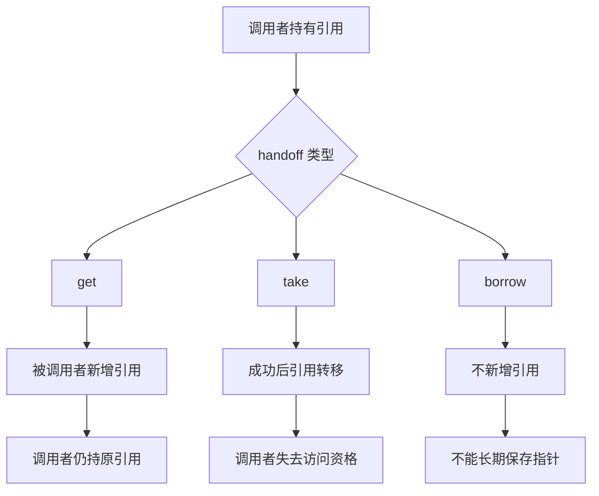

验收标准：

```text
任何 handoff 函数都必须能回答：
成功时引用归谁？
失败时引用归谁？
调用者返回后还能不能访问 obj？
```

------

### 15.4.2_验收八_能设计_lookup_+_get

lookup 场景必须分清三种指针：

```text
裸指针：
    只是地址，没有生命周期保证。

借用指针：
    在锁/RCU 临界区内暂时有效。

强引用指针：
    当前路径持有 kref，可以离开保护窗口继续使用。
```

mutex/list 模板：

```c
static struct my_obj *my_obj_lookup_get(int id)
{
	struct my_obj *obj;

	mutex_lock(&my_obj_list_lock);

	list_for_each_entry(obj, &my_obj_list, node) {
		if (obj->id != id)
			continue;

		kref_get(&obj->ref);
		mutex_unlock(&my_obj_list_lock);
		return obj;
	}

	mutex_unlock(&my_obj_list_lock);
	return NULL;
}
```

RCU 模板：

```c
static struct my_obj *my_obj_lookup_get_rcu(int id)
{
	struct my_obj *obj;
	struct my_obj *found = NULL;

	rcu_read_lock();

	list_for_each_entry_rcu(obj, &my_obj_list, node) {
		if (obj->id != id)
			continue;

		if (!kref_get_unless_zero(&obj->ref))
			break;

		found = obj;
		break;
	}

	rcu_read_unlock();

	return found;
}
```

带 dying 检查模板：

```c
if (!kref_get_unless_zero(&obj->ref))
	return NULL;

spin_lock(&obj->lock);
if (obj->dying) {
	spin_unlock(&obj->lock);
	kref_put(&obj->ref, my_obj_release);
	return NULL;
}
spin_unlock(&obj->lock);
```

验收图：

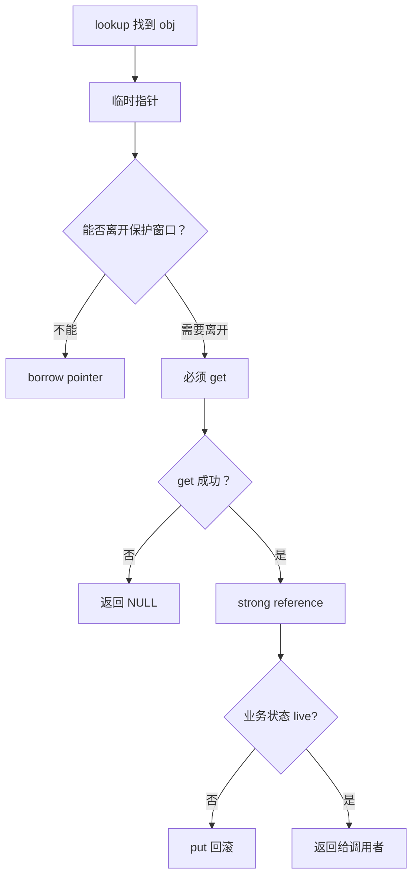

验收标准：

```text
能写出 list + mutex + kref lookup；
能写出 RCU + kref_get_unless_zero lookup；
能解释 get_unless_zero 为什么仍需要锁或 RCU。
```

------

### 15.4.3_验收九_能组合_kref_和锁

必须能说清：

```text
kref 保护生命周期；
锁保护字段和集合关系。
```

典型对象：

```c
struct my_obj {
	struct kref ref;
	struct list_head node;

	struct mutex lock;
	bool dying;
	int state;
};
```

集合锁：

```text
my_obj_list_lock：
    保护对象是否在全局 list 中。
```

对象锁：

```text
obj->lock：
    保护 dying/state 等对象内部字段。
```

kref：

```text
obj->ref：
    保护对象内存生命周期。
```

remove 模板：

```c
static void my_obj_remove(struct my_obj *obj)
{
	mutex_lock(&my_obj_list_lock);

	mutex_lock(&obj->lock);
	obj->dying = true;
	mutex_unlock(&obj->lock);

	list_del_init(&obj->node);

	mutex_unlock(&my_obj_list_lock);

	my_obj_put(obj);
}
```

验收重点：

```text
1. get 前锁保护 lookup。
2. 锁外使用必须持有引用。
3. put 后不能访问字段。
4. remove 先阻止新用户，再 unlink。
5. release 前对象不应仍在集合中。
6. release 中拿锁要审查死锁和睡眠上下文。
```

图示：

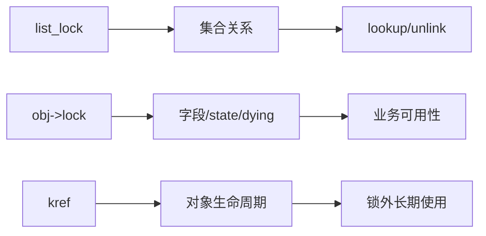

验收标准：

```text
能把“锁保护什么”和“kref 保护什么”分开说。
```

------

### 15.4.4_验收十_能组合_kref_和_RCU

必须能回答：

```text
RCU 让你安全地看到对象；
kref 让你安全地带走对象。
```

RCU lookup 模板：

```c
rcu_read_lock();

obj = find_obj_rcu(id);
if (obj && !kref_get_unless_zero(&obj->ref))
	obj = NULL;

rcu_read_unlock();
```

remove 模板：

```c
list_del_rcu(&obj->node);
kref_put(&obj->ref, my_obj_release);
```

release 模板：

```c
static void my_obj_release(struct kref *ref)
{
	struct my_obj *obj = container_of(ref, struct my_obj, ref);

	kfree_rcu(obj, rcu);
}
```

必须能解释：

```text
1. RCU 不自动增加引用。
2. RCU 只保护读侧临界区内的临时解引用。
3. kref_get_unless_zero() 必须在 RCU 临界区内。
4. get_unless_zero 失败后不能使用 obj。
5. list_del_rcu 后旧读者仍可能看到对象。
6. release 中不能直接 kfree RCU 可见对象。
7. struct kref 所在内存必须撑过 grace period。
```

RCU 验收图：

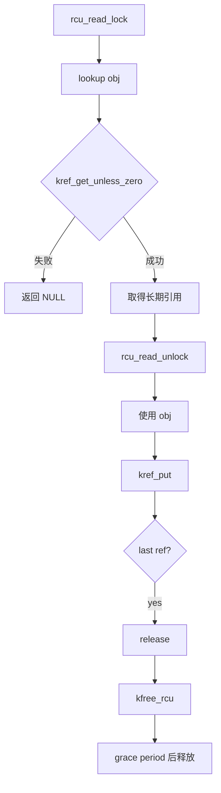

验收标准：

```text
能解释为什么 RCU lookup 中不能裸 kref_get；
能解释为什么 release 中要 kfree_rcu/call_rcu。
```

------

## 15.5_边界和错误验收_框架对象_错误模式和所有权表

### 15.5.1_验收十一_能区分_kref_refcount_t_kobject_device

必须能画出层次：

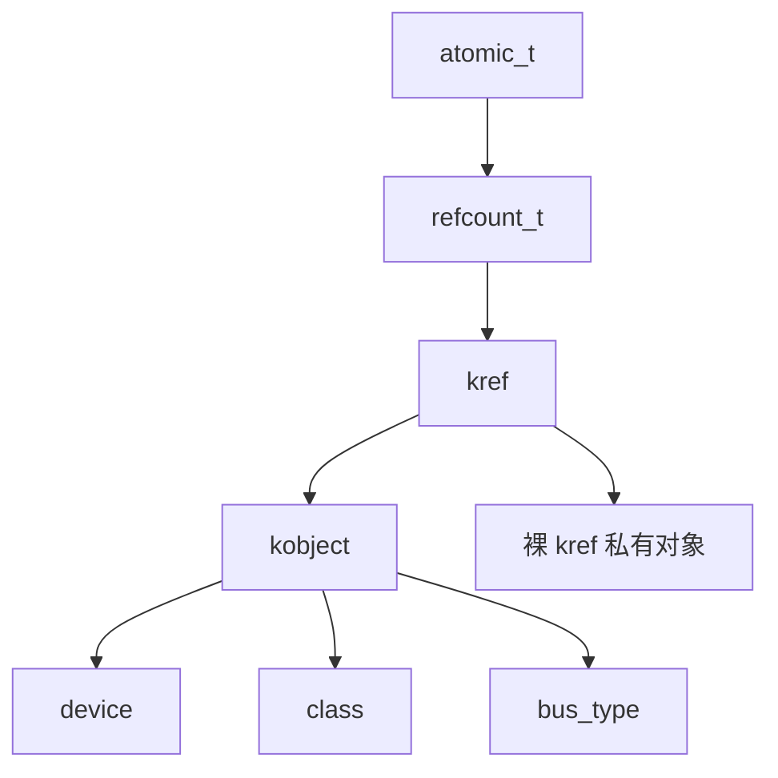

必须能回答：

| 对象                 | 应该使用什么                                |
| -------------------- | ------------------------------------------- |
| 自定义私有对象       | `struct kref`                               |
| 底层引用计数原语     | `refcount_t`                                |
| kobject 对象         | `kobject_get()` / `kobject_put()`           |
| device 对象          | `get_device()` / `put_device()`             |
| driver core 注册设备 | `device_register()` / `device_unregister()` |
| class/bus            | 对应 driver core API                        |

错误做法：

```c
kref_get(&dev->kobj.kref);
```

正确做法：

```c
get_device(dev);
```

必须能解释：

```text
device 不是裸 kref 的 my_obj；
device 是 driver core 的设备对象；
它的生命周期协议已经由 driver core 封装。
```

验收标准：

```text
不会为了“引用计数”强行引入 kobject；
不会手动操作 struct device 内部 kref；
能分清私有 kref 和 device 引用。
```

------

### 15.5.2_验收十二_能识别典型错误模式

看到下面代码，必须能快速判断问题。

#### (1)_少_get

```c
obj->work_obj = obj;
schedule_work(&obj->work);
kref_put(&obj->ref, my_obj_release);
```

判断：

```text
work 保存了 obj 指针，但没有自己的引用。
异步执行时可能 UAF。
```

#### (2)_少_put

```c
obj = my_obj_lookup_get(id);
file->private_data = obj;

/* release 中没有 put */
```

判断：

```text
file 持有引用但不释放，对象泄漏。
```

#### (3)_多_put

```c
kref_put(&obj->ref, my_obj_release);
kref_put(&obj->ref, my_obj_release);
```

判断：

```text
同一份引用释放两次，可能提前 release 或 underflow。
```

#### (4)_put_后访问

```c
my_obj_put(obj);
pr_info("%d\n", obj->id);
```

判断：

```text
put 可能触发 release，后续访问 UAF。
```

#### (5)_lookup_后无保护_get

```c
obj = find_obj(id);
kref_get(&obj->ref);
```

判断：

```text
如果 find_obj 没有返回强引用，也没有锁/RCU保护，就是错误。
```

#### (6)_get_unless_zero_不检查返回值

```c
kref_get_unless_zero(&obj->ref);
return obj;
```

判断：

```text
如果返回 false，当前路径没有引用。
必须检查返回值。
```

#### (7)_release_里重新发布

```c
static void my_obj_release(struct kref *ref)
{
	list_add(&obj->node, &global_list);
	kref_init(&obj->ref);
}
```

判断：

```text
严重错误：release 中复活对象。
```

#### (8)_release_未脱链

```c
static void my_obj_release(struct kref *ref)
{
	kfree(obj);
}
```

如果对象仍在全局表中，判断：

```text
全局结构留下悬挂指针。
```

#### (9)_kref_当锁

```c
kref_get(&obj->ref);
obj->state++;
kref_put(&obj->ref, release);
```

判断：

```text
kref 不保护字段互斥，state 仍可能数据竞争。
```

#### (10)_重复_kref_init

```c
kref_init(&obj->ref);  /* reset 路径 */
```

判断：

```text
破坏已有引用关系，严重错误。
```

错误模式图：

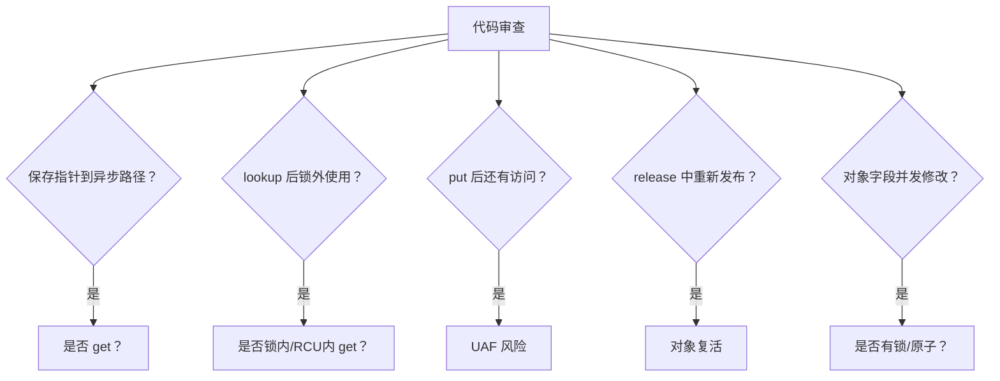

验收标准：

```text
能从代码形态直接识别典型生命周期错误。
```

------

### 15.5.3_验收十三_能写对象所有权表

任何复杂对象都必须能写表。

例如：

```c
struct my_request {
	struct kref ref;
	struct list_head node;
	struct work_struct timeout_work;
	struct completion done;
	int status;
};
```

合格所有权表：

| 持有者       | 什么时候获得引用     | 什么时候释放引用               | 备注                     |
| ------------ | -------------------- | ------------------------------ | ------------------------ |
| 创建者       | `kref_init()`        | submit 成功 handoff 或失败路径 | 初始引用                 |
| 请求队列     | enqueue 成功         | dequeue                        | 队列持有期间对象不能释放 |
| timeout work | schedule 成功前 get  | workfn 结束                    | 异步路径                 |
| 用户等待者   | lookup 成功后 get    | wait 返回后                    | file/ioctl 等路径        |
| 硬件完成路径 | 从队列取出并确认有效 | 完成处理后                     | 中断或线程上下文         |

不合格表：

```text
大家用完就 put。
```

原因：

```text
没有说明谁是“大家”；
没有说明什么时候 get；
没有说明失败路径；
没有说明 handoff 后归属；
没有说明 remove 时如何 drain。
```

所有权表图：

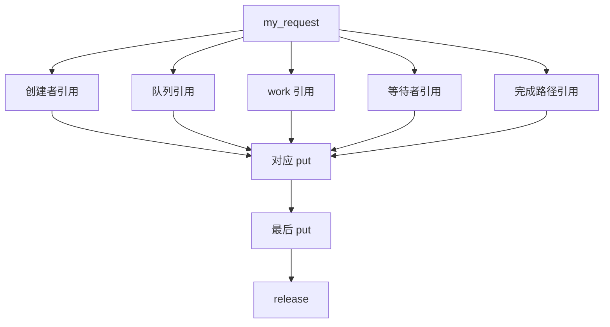

验收标准：

```text
能为任何 kref 对象写出“持有者/get/put/备注”表。
```

------

## 15.6_工程审查验收_remove_release_代码审查和定位

### 15.6.1_验收十四_能写_remove/unlink/drain/release_流程

合格 remove 流程必须分阶段：

```text
1. 设置 dying，阻止新业务用户进入。
2. 从 lookup 结构中取消发布。
3. 停止新请求提交。
4. 取消或 drain work/timer/callback。
5. 停止硬件或底层资源。
6. put 发布引用。
7. 等旧引用自然收敛。
8. 最后 release。
```

流程图：

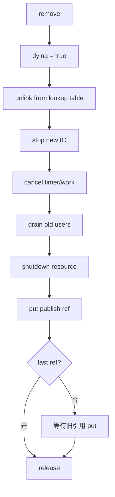

必须能解释：

```text
unlink 不等于没有引用；
没有引用不等于 RCU 内存可立即释放；
kref 保护对象本体，不保护硬件资源仍然可用。
```

验收标准：

```text
能把 remove 和 release 拆开；
能说明旧引用如何退出；
能说明新用户如何被阻止。
```

------

### 15.6.2_验收十五_能判断_release_是否合格

合格 release 必须满足：

```text
1. 只在最后一个 put 时执行。
2. 能通过 container_of 找回外层对象。
3. 不重新发布对象。
4. 不重新 kref_init。
5. 不把对象交给新持有者。
6. 释放子资源顺序清楚。
7. 不提前释放 RCU 读者可能访问的内存。
8. 不在错误上下文中睡眠。
9. 对象应已经从全局集合取消发布。
10. 最后释放对象内存。
```

普通 release：

```c
static void my_obj_release(struct kref *ref)
{
	struct my_obj *obj = container_of(ref, struct my_obj, ref);

	WARN_ON(!list_empty(&obj->node));

	kfree(obj->buffer);
	kfree(obj);
}
```

RCU release：

```c
static void my_obj_release(struct kref *ref)
{
	struct my_obj *obj = container_of(ref, struct my_obj, ref);

	kfree_rcu(obj, rcu);
}
```

异步 release work：

```c
static void my_obj_release(struct kref *ref)
{
	struct my_obj *obj = container_of(ref, struct my_obj, ref);

	INIT_WORK(&obj->release_work, my_obj_release_workfn);
	schedule_work(&obj->release_work);
}
```

但必须能说明：

```text
obj 内存必须撑到 release_workfn 执行完；
真正 kfree 必须在 release_workfn 中；
不能在 schedule_work 后立刻 kfree。
```

release 验收图：

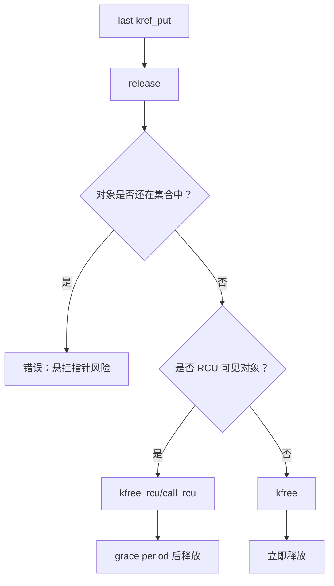

验收标准：

```text
能审查 release 的上下文、资源顺序、RCU 延迟和脱链状态。
```

------

### 15.6.3_验收十六_能完成代码审查

看到下面对象：

```c
struct my_obj {
	struct kref ref;
	struct list_head node;
	struct mutex lock;
	bool dying;
	struct work_struct work;
	int state;
};
```

必须能提出审查问题：

```text
1. kref_init 在哪里？
2. 初始引用归谁？
3. node 加入哪个集合？
4. 集合由哪把锁保护？
5. lookup 是否在锁内 get？
6. work 投递前是否 get？
7. workfn 结束是否 put？
8. remove 是否设置 dying？
9. remove 是否 list_del_init？
10. remove 是否 cancel_work_sync？
11. release 是否检查 node 已脱链？
12. state 是否由 obj->lock 保护？
13. put 后是否还有访问？
14. 是否存在重复 kref_init？
15. 是否存在 get_unless_zero 返回值未检查？
```

代码审查流程：

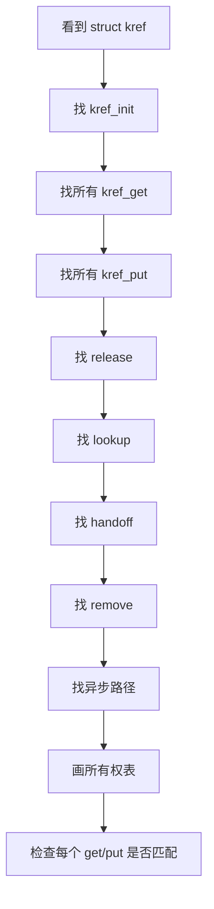

验收标准：

```text
能从对象定义反推出所有生命周期路径。
```

------

### 15.6.4_验收十七_能完成故障定位

#### (1)_UAF_定位

看到 KASAN UAF，必须问：

```text
1. 访问点是否在 put 后？
2. 异步路径是否缺少 get？
3. lookup 返回的是裸指针还是强引用？
4. remove 是否提前释放子资源？
5. RCU 对象是否直接 kfree？
```

#### (2)_泄漏定位

看到对象不 release，必须问：

```text
1. 哪条 get 没有 put？
2. open/file 是否 release put？
3. work/timer 是否完成后 put？
4. enqueue 后 dequeue 是否 put？
5. 错误路径是否漏 put？
```

#### (3)_underflow_定位

看到 refcount underflow，必须问：

```text
1. 是否同一错误路径重复 put？
2. handoff 成功后调用者是否又 put？
3. release 后是否还有路径 put？
4. timer/work cancel 路径是否和回调都 put？
```

#### (4)_字段竞争定位

看到 KCSAN data race，必须问：

```text
1. 这个字段是否由锁保护？
2. 是否错误认为持有 kref 就能修改字段？
3. 是否需要 READ_ONCE/WRITE_ONCE？
4. 是否需要 atomic_t？
5. 是否需要状态机锁？
```

故障定位图：

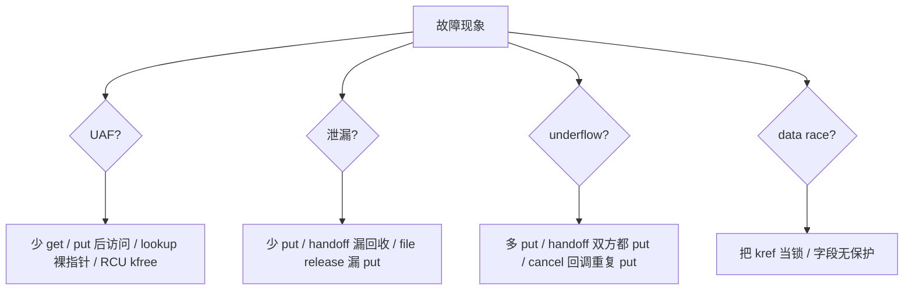

验收标准：

```text
能根据现象反推可能的生命周期错误类型。
```

------

### 15.6.5_验收十八_能区分四个_安全

很多错误来自把不同安全混在一起。

必须能区分：

| 安全类型         | 由谁保证                              |
| ---------------- | ------------------------------------- |
| 指针临时可解引用 | 锁 / RCU                              |
| 对象生命周期存在 | kref                                  |
| 对象业务上可用   | state / dying                         |
| 字段访问一致     | mutex / spinlock / atomic / READ_ONCE |

图示：

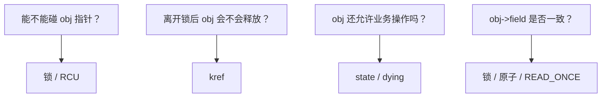

错误表达：

```text
这个对象是安全的。
```

正确表达：

```text
这个对象在当前 RCU 临界区内可以临时解引用；
当前路径还没有长期引用；
如果要离开 RCU，需要 get_unless_zero 成功；
即使 get 成功，也要检查 dying；
字段访问还要拿 obj->lock。
```

验收标准：

```text
能把“安全”拆成临时指针安全、生命周期安全、业务状态安全、字段并发安全。
```

------

## 15.7_最终问答清单

学完后必须能快速回答下面问题。

### 15.7.1_kref_保护的是什么

```text
保护对象内存生命周期。
成功持有引用期间，对象本体不能被 release/free。
```

### 15.7.2_kref_不保护什么

```text
不保护字段互斥；
不保护对象是否在集合中；
不保护业务状态；
不保护硬件资源；
不保护 lookup 裸指针；
不替代 RCU；
不替代 driver core。
```

### 15.7.3_为什么有指针不等于有引用

```text
指针只是地址；
引用是生命周期所有权。
没有引用的指针只能在锁/RCU保护窗口内临时借用。
```

### 15.7.4_为什么_kref_init_初始值是_1

```text
对象创建后必须有第一份明确持有者。
这份初始引用通常归创建者或发布者。
```

### 15.7.5_为什么_kref_get_前必须证明对象有效

```text
因为 kref_get 要访问 obj->ref；
如果 obj 已经释放，连 ref 字段本身都是悬挂内存。
```

### 15.7.6_为什么_put_后不能继续访问对象

```text
因为 put 可能是最后一个引用；
最后一个 put 会同步调用 release；
release 可能 kfree 对象。
```

### 15.7.7_release_为什么拿到_struct_kref_*

```text
因为 kref 嵌入在业务对象内部；
kref_put 只知道 kref 指针；
release 用 container_of 找回外层对象。
```

### 15.7.8_lookup_+_get_为什么必须有锁或_RCU

```text
因为 lookup 得到的只是临时指针；
在 get 成功前，必须有人保证这个指针指向的内存仍然有效。
```

### 15.7.9_kref_get_unless_zero()_解决什么

```text
解决 refcount 非 0 时才加引用；
避免从 0 复活对象。
```

### 15.7.10_kref_get_unless_zero()_不解决什么

```text
不证明 obj 指针有效；
不证明 obj 仍在集合中；
不证明 obj 业务可用；
不保护字段互斥。
```

### 15.7.11_handoff_成功和失败时引用归谁

```text
必须由函数契约定义。
get 模型、take 模型、borrow 模型不能混用。
```

### 15.7.12_kref_和_mutex_的边界是什么

```text
kref 保护生命周期；
mutex 保护字段和集合关系。
```

### 15.7.13_kref_和_RCU_的边界是什么

```text
RCU 保护读侧 lookup 窗口；
kref 保护取得引用后的长期生命周期。
```

### 15.7.14_kref_和_kobject_的边界是什么

```text
kref 是生命周期引用计数封装；
kobject 是带名字、层级、sysfs、ktype、kset 的内核对象模型。
```

### 15.7.15_kref_和_device_的边界是什么

```text
裸 kref 用于私有对象；
struct device 是 driver core 对象；
device 引用用 get_device/put_device。
```

------

## 15.8_最终代码模板验收

最终应该能独立写出下面这种模板。

```c
struct my_obj {
	struct kref ref;
	struct list_head node;

	struct mutex lock;
	bool dying;

	int id;
};

static LIST_HEAD(my_obj_list);
static DEFINE_MUTEX(my_obj_list_lock);

static void my_obj_release(struct kref *ref)
{
	struct my_obj *obj = container_of(ref, struct my_obj, ref);

	WARN_ON(!list_empty(&obj->node));

	kfree(obj);
}

static struct my_obj *my_obj_alloc(int id)
{
	struct my_obj *obj;

	obj = kzalloc(sizeof(*obj), GFP_KERNEL);
	if (!obj)
		return NULL;

	kref_init(&obj->ref);
	INIT_LIST_HEAD(&obj->node);
	mutex_init(&obj->lock);

	obj->id = id;
	obj->dying = false;

	return obj;
}

static void my_obj_get(struct my_obj *obj)
{
	kref_get(&obj->ref);
}

static void my_obj_put(struct my_obj *obj)
{
	kref_put(&obj->ref, my_obj_release);
}

static void my_obj_publish(struct my_obj *obj)
{
	mutex_lock(&my_obj_list_lock);
	list_add_tail(&obj->node, &my_obj_list);
	mutex_unlock(&my_obj_list_lock);
}

static struct my_obj *my_obj_lookup_get(int id)
{
	struct my_obj *obj;

	mutex_lock(&my_obj_list_lock);

	list_for_each_entry(obj, &my_obj_list, node) {
		if (obj->id != id)
			continue;

		mutex_lock(&obj->lock);
		if (obj->dying) {
			mutex_unlock(&obj->lock);
			mutex_unlock(&my_obj_list_lock);
			return NULL;
		}

		my_obj_get(obj);

		mutex_unlock(&obj->lock);
		mutex_unlock(&my_obj_list_lock);

		return obj;
	}

	mutex_unlock(&my_obj_list_lock);
	return NULL;
}

static void my_obj_remove(struct my_obj *obj)
{
	mutex_lock(&my_obj_list_lock);

	mutex_lock(&obj->lock);
	obj->dying = true;
	mutex_unlock(&obj->lock);

	list_del_init(&obj->node);

	mutex_unlock(&my_obj_list_lock);

	my_obj_put(obj);
}
```

必须能解释这段代码里的每个点：

```text
为什么 kref_init 是 1；
为什么 publish 后对象可被 lookup；
为什么 lookup_get 要在锁内 get；
为什么要检查 dying；
为什么 remove 先 dying 再 list_del_init；
为什么 release 中 WARN_ON list_empty；
为什么 put 后不能访问 obj。
```

------

## 15.9_最终_Mermaid_总图

整个 kref 学习可以压缩成这张图：

```mermaid
flowchart TD
    A["对象创建"] --> B["kref_init<br/>初始引用"]
    B --> C["初始化字段和资源"]
    C --> D["发布到集合<br/>list/hash/xarray/RCU"]

    D --> E["lookup"]
    E --> F{"当前是否在保护窗口？"}
    F -- "否" --> G["不能 get<br/>不能长期使用"]
    F -- "是" --> H{"保护类型"}

    H --> I["mutex/spinlock"]
    H --> J["RCU"]

    I --> K["kref_get"]
    J --> L["kref_get_unless_zero"]

    L --> M{"成功？"}
    M -- "否" --> N["返回 NULL"]
    M -- "是" --> O["取得长期引用"]
    K --> O

    O --> P{"dying/state 是否允许？"}
    P -- "否" --> Q["put 回滚<br/>返回错误"]
    P -- "是" --> R["业务使用"]

    R --> S{"是否 handoff？"}
    S -- "否" --> T["当前路径 put"]
    S -- "是" --> U["定义 get/take/borrow"]
    U --> V["异步路径完成 put"]

    D --> W["remove"]
    W --> X["dying = true"]
    X --> Y["unlink from lookup"]
    Y --> Z["drain work/timer/callback"]
    Z --> AA["put 发布引用"]

    T --> AB{"最后引用？"}
    V --> AB
    AA --> AB
    Q --> AB

    AB -- "否" --> AC["对象继续存在"]
    AB -- "是" --> AD["release"]

    AD --> AE{"是否 RCU 可见对象？"}
    AE -- "否" --> AF["kfree"]
    AE -- "是" --> AG["kfree_rcu/call_rcu"]
    AG --> AH["grace period 后释放"]
```

这张图里的每条边都应该能解释。

如果不能解释某条边，说明对应章节还没有掌握。

------

## 15.10_最终评分标准

可以按 5 个等级自测。

### 15.10.1_L0_只会_API

表现：

```text
知道 kref_init/get/put；
知道 release；
但不知道 lookup/handoff/remove 怎么设计。
```

评价：

```text
不能独立写工程代码。
```

### 15.10.2_L1_知道基本生命周期

表现：

```text
知道 get/put 成对；
知道最后 put release；
知道 put 后不能访问。
```

缺口：

```text
lookup、异步、RCU、锁组合容易错。
```

### 15.10.3_L2_能写普通私有对象

表现：

```text
能写 alloc/get/put/release；
能写 list + mutex lookup；
能写 remove/unlink。
```

缺口：

```text
复杂 handoff、timer/work、RCU 仍需要审查。
```

### 15.10.4_L3_能处理并发生命周期

表现：

```text
能处理 lookup + get；
能处理 work/timer handoff；
能处理 remove + drain；
能区分 kref 和锁；
能定位少 get/少 put/多 put。
```

评价：

```text
能用于普通驱动私有对象。
```

### 15.10.5_L4_能处理_RCU_和框架边界

表现：

```text
能写 RCU + kref_get_unless_zero；
能解释 kfree_rcu；
能区分 kref/refcount_t/kobject/device；
不会手动操作 device 内部 kref。
```

评价：

```text
具备内核子系统对象生命周期设计能力。
```

### 15.10.6_L5_能做代码评审和故障定位

表现：

```text
能从对象定义反推生命周期；
能画引用所有权表；
能审查所有 get/put/handoff/remove/release；
能根据 KASAN/KCSAN/lockdep/refcount warning 定位问题；
能给出修复方案。
```

评价：

```text
真正掌握 kref。
```

等级图：

```mermaid
flowchart LR
    L0["L0<br/>只会 API"] --> L1["L1<br/>基本生命周期"]
    L1 --> L2["L2<br/>普通私有对象"]
    L2 --> L3["L3<br/>并发生命周期"]
    L3 --> L4["L4<br/>RCU/框架边界"]
    L4 --> L5["L5<br/>代码评审/故障定位"]
```

------

## 15.11_最终结论

学完 kref 后，不能把它理解成：

```text
refcount++;
refcount--;
```

而要理解成：

```text
对象所有权协议。
```

最终掌握标准是：

```text
你能为一个对象回答：
谁创建它；
谁发布它；
谁能查到它；
谁能持有它；
谁能转交它；
谁能撤销它；
谁负责释放它；
谁不能再碰它。
```

最终核心句：

```text
kref 不是计数器 API；
kref 是 Linux 内核中描述对象生命周期所有权的底层工具。
```

再压缩成一句：

```text
会用 kref，不是会加一减一；
而是能把对象从创建、发布、查找、持有、转移、撤销到最终释放的所有权边界讲清楚。
```
