# 第15章\_最终验收标准

## 15.1\_本章导读\_最终验收看所有权协议

前面的源码、工程模板和实验已经给出许多正确路径。现在换一个任务：接手一段陌生驱动，工作回调偶尔访问失效对象。增加一个get以后不再复现，是否就能通过评审？还不能。你需要说出它补给谁、失败时谁归还、退出时谁等待，以及原故障为什么消失；否则可能把提前回收换成关闭后永久不释放。

本章按“解释已有协议—补全场景契约—审查退出与诊断证据”验收。它不要求凭记忆背所有实现细节，而要求能够回到已学习的完整程序，作出预测、指出反例并界定修复。P01至P12建立机制与边界，P13组织工程单元，P14组织实验单元；实际展开的P16至P40也属于这些阅读路线，不是另一套引用规则。

本章使用已学程序作为考题，不另造一个只为打分而存在的对象框架。基础题沿[P32完整模块](P32_基础引用与源码对照实验.md#32.2_完整模块中只有两类存储)，应用题回到P13/P14相应单元。可以先遮住解释作答，再用代码、责任图和运行记录修正答案。最终目标是：看到地址、调用和返回值时，能说明谁拥有资格、资格持续多久、谁在何处结束它。

## 15.2\_验收主线

拿一张纸为对象画出创建者、索引、工作者和关闭者。先标明实线表示拥有份额，虚线表示地址关系；同一个箭头不能一会儿表示索引、一会儿又被当成引用。随后沿一个完整周期回答下列问题：

| 周期位置 | 需要解释的事实 | 用什么反例检验 |
| --- | --- | --- |
| 创建 | 初始一份交给谁，发布失败仍归谁 | 尚未发布就失败，是否仍能正常清理 |
| 首次取得 | 查到地址到get之间由谁保护，计数是否保证非零 | 最后归还者先归零、正等待摘链锁 |
| 使用与交付 | 分享、转交或借用，字段与业务另受什么保护 | worker先完成，或提交被拒绝 |
| 关闭 | 谁阻止新增，谁摘除入口，哪些旧活动必须等待 | 旧普通引用尚在但没有活动，是否应无限等待 |
| 最后归还 | 哪条路径可能进入release，继承哪些锁与上下文 | 最后份额落到另一位使用者或失败出口 |
| 回收与退出 | 地址、硬件资源、队列和回调代码各何时可结束 | 对象已经释放但回调尾部还在执行 |

这些问题无法回答时，先把缺少的契约记下来。例如“remove会处理”不是答案，要继续指出remove设置了哪个共享状态、谁读取它、怎样获知旧活动结束。相反，若同步调用期间由外层保活、返回前全部完成，借用也可以成立，不必为了画满实线而给每个临时变量增加计数。

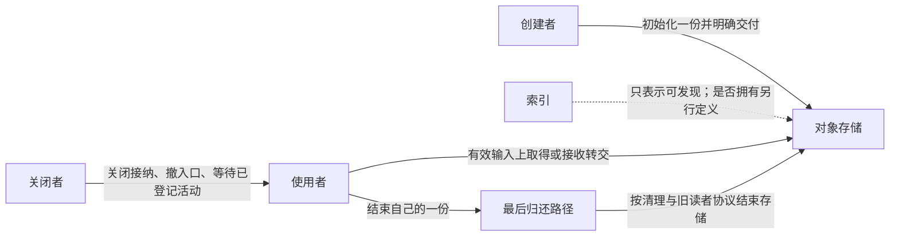
```mermaid
flowchart LR
    C["创建者"] -->|"初始化一份并明确交付"| O["对象存储"]
    T["索引"] -.->|"只表示可发现；是否拥有另行定义"| O
    U["使用者"] -->|"有效输入上取得或接收转交"| O
    M["关闭者"] -->|"关闭接纳、撤入口、等待已登记活动"| U
    U -->|"结束自己的一份"| F["最后归还路径"]
    F -->|"按清理与旧读者协议结束存储"| O
```

这张图检查角色与责任，不替代具体场景的状态机。工作交付、RCU退休和父子桥接已有不同阶段；验收时选择对应阶段串起完整周期，不把它们硬合成一种remove顺序。

## 15.3\_核心概念验收\_生命周期\_指针和引用

先用六道基础题检查自己的解释是否包含前提。每题都要给出“什么成立、什么没有随之成立、改变哪个条件会改变答案”，再进入后面的组合场景。

### 15.3.1\_验收一\_能说清\_kref\_保护什么\_不保护什么

考题：两个执行者分别持有同一对象的一份，是否可以同时修改obj->state？回答需要先肯定已有价值：在其引用协议正确的条件下，两位执行者的合法份额共同阻止对象提前最终清理；然后指出剩余缺口：这不让state的两次读改写自动串行，也不说明当前业务仍开放。

[P38字段实验](P38_字段更新与KCSAN实验.md#38.1_两个有效使用者怎样丢掉一次更新)已经给出具体反例：即使每次原子读取与写入都合法，两人仍可覆盖同一次更新。多字段约束还需要共同协议，不能看到“原子”就省去推导。

逐项核对保护对象：字段互斥由选定的锁或原子协议承担；list/hash/XArray成员关系由集合协议承担；state/dying只有被接纳和退出路径共同遵守才控制业务；硬件、buffer或队列能否使用要看资源退出；RCU旧读者和driver core对象体系也有各自规则。kref没有自动承担这些职责。

合格答案应落到对象本体的存储资格，并明确假设所有路径遵守该引用协议。不能让一个错误分支直接kfree，然后仍以“我调用过get”证明绝对安全；原语不会阻止绕过协议的手动释放。

### 15.3.2\_验收二\_能解释为什么有指针不等于有引用

考题：find_obj(id)返回地址后，调用者马上do_something(obj)。先不要只凭函数名判对错，查看返回契约：

| 返回契约 | 调用者得到什么 | 使用结束时做什么 |
| --- | --- | --- |
| 已取得的一份 | 独立存储资格，仍需业务和字段协议 | 归还这一份 |
| 指定锁内的借用 | 在该锁保护及删除协议成立期间的临时资格 | 不代还份额；离开窗口前完成使用或另行取得 |
| 同步外层调用借用 | 外层保证对象直到本次调用结束 | 不把地址保存到超出约定期限的异步路径 |
| 只给地址、没有期限约定 | 缺少可审查的使用资格 | 补查接口契约，不能据地址自行推断 |

前面的锁/RCU只是常见保护方式，不是所有借用的定义。反过来，随便拿一把锁也不会保护对象：删除者必须遵循与该锁对应的释放协议。能把pointer、borrow和独立拥有份额分别说明，才有资格继续分析get放在哪里。

### 15.3.3\_验收三\_能解释为什么\_kref\_init\_初始值是\_1

考题：创建成功返回以后，哪一条路径必须put初始份额？kref_init建立第一份，不是因为硬件天然附带一位用户。创建接口若约定返回拥有者，初始份额交给调用者；若内部已经把份额转交索引再返回借用，责任就不同，必须从契约判断，不能从create这个名字推断。

用note_kref_basics.c作答：创建者把初始份额放到slots[0]；holders=2时在保护仍在的条件下另get，才给slots[1]一份。两次指针赋值没有自增含义，creator置NULL也没有减计数含义。holders=1和2各是谁触发最后回调？哪一步以后已经不能用那个槽位代表有效资格？

若接着发布到全局表，应在三种选择中说明实际是哪一种：初始份额转交表；调用者保留初始份额并另给表一份；表只登记、不拥有。队列同理。失败发生在交付前后，责任归属可能不同；尚未发布的初始化失败也有合法清理，不要求先经历LIVE和DYING。

### 15.3.4\_验收四\_能解释为什么\_get\_前必须证明对象有效

考题：把lookup与get放进同一mutex区间，是否一定能普通kref_get？还差一个条件：这套保护首先必须保证ref所在存储仍在，其次普通get需要正计数前提。拥有型表由表份额维持成员正数，常可在锁内普通get；非拥有索引却可能保留“已经归零、清理者等待此锁”的对象地址，这时地址有效而计数为零。

[P34条件取得实验](P34_查找窗口与条件取得实验.md#34.4_实验六先制造真正的零值窗口)正是验收用的反例。不能套用“mutex就get、RCU就get_unless_zero”的二分表；选择取决于索引是否拥有、归零与摘除顺序以及地址保护，而不是锁的名字。

常见RCU路径在读区内发现地址并条件取得，成功才带出一份，失败不交付；前提是更新和回收协议确实覆盖这个临时读者。如果只是退出读区，手里留下裸地址，再条件get，就可能先读到失效ref。若另有明确的长期保护，必须把它画出，不能与无保护路径混为一谈。

这里有两个独立判据：**地址还能被访问**，以及 **计数允许按选定接口取得**。kref_get_unless_zero拒绝零值，但仍要先访问ref，因此它不能反向证明输入地址安全。

### 15.3.5\_验收五\_能解释为什么\_put\_后不能继续访问对象

考题：调用put后打印obj->id，为什么值得立即检查？put消费当前拥有的一份，可能把最后一份减到零并同步进入release，回调可能释放整个对象。若当前路径没有另一个独立有效保护，后续访问便没有资格；即使put返回0，其他持有者也可能马上结束，返回值不是给自己的新份额。

若确实同时拥有两份，归还一份以后还能在另一份期限内使用。验收要求说明这第二份的来源和归还点，不能把“put后永远不能出现这个变量”当成纯语法规则。工程上清空已消费的责任槽位，有助于防止把旧别名误当成另一份。

调试输出可以在put前复制id，再打印独立整数；若id可并发变化，复制时还要遵循字段锁。复制一个指针不是复制它指向的数据，浅拷贝含指针结构也不能自动延长所指对象期限。完整正确与故障对照见[P37](P37_KASAN释放后访问实验.md#37.3_完整模块只改变最后一次读取的位置)。

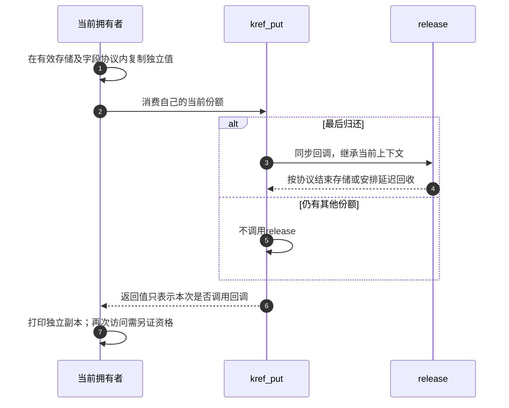
```mermaid
sequenceDiagram
    autonumber
    participant C as 当前拥有者
    participant K as kref_put
    participant R as release
    C->>C: 在有效存储及字段协议内复制独立值
    C->>K: 消费自己的当前份额
    alt 最后归还
        K->>R: 同步回调，继承当前上下文
        R-->>K: 按协议结束存储或安排延迟回收
    else 仍有其他份额
        K->>K: 不调用release
    end
    K-->>C: 返回值只表示本次是否调用回调
    C->>C: 打印独立副本；再次访问需另证资格
```

### 15.3.6\_验收六\_能解释\_release\_为什么拿到\_struct\_kref\_*

考题：为什么基础模块回调参数是struct kref *，却最终释放整个basic_object？计数成员嵌入业务对象，kref_put持有的接口类型只认识该成员；回调知道外层真实类型，通过container_of(ref, struct basic_object, ref)从成员地址找回外壳。类型和成员必须对应真实嵌入关系，container_of不是验证任意指针的机制。

| 回调体系 | 入口参数 | 找回业务外壳所用的成员 |
| --- | --- | --- |
| 私有kref release | struct kref * | 外壳里的kref成员 |
| kobject类型release | struct kobject * | 外壳里的kobject成员 |
| device release | struct device * | 外壳里的device成员 |

参数不同来自各自框架的接口职责，不是把void *换个拼写。回调负责哪些附属资源、是否直接free、是否还要延迟回收，要继续查该体系和实际分配所有权；嵌入device后不能又用无关私有kref提前free同一外壳。边界沿[P11框架关系](P11_kref_refcount_t_kobject_的边界.md)复核。

完成六题后，重读P32模块中的basic_release和两槽循环，用实际变量说明创建、追加、消费、回调与最后一次合法访问。本批重跑该模块六组宿主协议，覆盖一份/两份、分配失败和非法参数；使用固定引用函数及顺序替身，没有新增目标装卸。后面的场景题再把这些判断带进交付、查找与关闭，不能仅凭这六组检查宣布整个工程安全。

## 15.4\_使用场景验收\_handoff\_lookup\_锁和\_RCU

基础六题明确以后，把同一对象放进队列和索引。此时最容易遗漏的不是某一个API，而是接口之间的空窗：候选份额何时交付，状态检查以后是否还有接纳资格，摘链以后谁仍能看到旧节点。以下四题要求拿成功、失败和抢先执行的路径互相验证。

### 15.4.1\_验收七\_能设计\_handoff\_成功和失败路径

考题：提交函数返回成功时，worker已经完成并释放对象，提交者还能做什么？先选择接口契约，再作答；不能假设worker一定等函数返回才开始。完整题目使用[P20同一请求的两种交付](P20_工作交付与关闭工程模板.md#20.2_用同一完整请求比较两种模式)和[P35实验](P35_工作交付与关闭窗口实验.md#35.1_候选份额不等于已经交付)，不依赖一个没有实现或约定的queue_push。

#### (1)\_get\_模型验收

分享模式先在输入保护下get一份候选，再尝试提交；接纳成功后该份由worker消费。拒绝只退回本次候选，调用者原份额仍在。接口契约“失败不新增引用”描述的是返回时的净结果，不是声称失败路径从未执行get。

在note_kref_work_modes.c里，即使worker抢先put了它的一份，创建者仍可合法归还原有份额，最后回调可能发生在任一方。若改成对同一个work重复投递，失败时也只能收回本次候选，不能代还前一次仍在执行的工作份额。正常模块只提交全新work一次，测试夹具注入的拒绝不能被记录为内核必然发生的调度。

#### (2)\_take\_模型验收

转交模式把现有一份交给接收者，不额外get。成功后创建者不再消费已转出的那份，也不能凭它再读对象；拒绝时没有交付，创建者仍负责这份。若另持有一份独立保护，剩余资格必须单独标明，不能与已转出的份额混算。

在同一完整模块里，transfer=true成功以后不再读取request，只有队列退出时的对象外计数。因此worker在提交函数返回前完成也不破坏该路径。失败则由创建者归还原份额并销毁未承接工作的队列。

第三种是借用：被调用者不新增份额，也不消费调用者的份额，必须在约定的保护期内结束访问。它不只包括同步函数；[P24管理者持有并等待](P24_删除入口与活动排空工程模板.md#24.3_完整管理者模块的资源分层)也可让异步worker借用，只要外层保持对象到所有活动退出，并保证停止新提交。借用不能保存到保护期之外，借用worker也不能照抄独立拥有模型的put。

验收时写出“原份额、候选、已接纳份额”的三栏去向，再把worker安排在提交者之前完成。如果答案只能解释提交者先结束的顺序，协议还没有验完。

### 15.4.2\_验收八\_能设计\_lookup\_+\_get

考题：lookup已经成功取得引用，并检查过dying=false，是否可以在返回后无条件开始业务？先承认它带出了一份存储资格，再找状态观察到业务开始之间的窗口。关闭者可能在这个窗口关门；若lookup没有同时登记活动，调用者开始业务时仍须执行真正的接纳协议。

拥有型表的完整路径见[P17](P17_拥有型链表工程模板.md#17.1_拥有型链表的发布与撤下)。table_lock保护集合，成员的表份额维持正数；查找在表锁内按固定顺序取得对象锁、确认LIVE、get，再离开窗口。返回的reader是一位独立拥有者，但之后table_request仍在对象锁内检查状态并完成整个短操作。一次lookup中的检查没有变成永久通行证。

RCU路径见[P25完整发布与撤下](P25_RCU查找与业务关闭工程模板.md#25.3_完整发布与撤下模块)：object_lookup只在读区内匹配稳定id并条件取得，失败不交付任何份额；成功退出读区以后，object_request才取得mutex并检查dying。本例普通RCU读区不承担可睡眠业务锁的范围，不能把旧片段中的状态锁未经上下文核对直接搬入读区。

若你选择“取得后再检查dying，关闭就put并返回失败”的接口，也要说明该检查和后续业务的关系、失败put是否可能进入可睡眠或再次取锁的release。仅仅补一个if并不能结束审查。锁、RCU或其他保护必须真正覆盖首次地址访问，get_unless_zero无法替无效地址补救。

验收产物应标出四个时刻：发现地址、成功取得、离开保护、业务接纳。普通get与条件get的选择由正计数保证决定，不能只看遍历代码用了哪个宏。

### 15.4.3\_验收九\_能组合\_kref\_和锁

考题：remove同时取得集合锁和对象锁，置dying、摘链、解锁再put；第二次remove能否直接重复？如果put消费的是表份额，第一次已经把它移出表，第二次就无权再次代还。原始“每次list_del_init后无条件put”的片段缺少消费条件，不因list_del_init本身可重复就变得正确。

在note_kref_table.c里，调用者全程另持一份；table_unpublish按table_lock再obj->lock排序，只在本次真的摘除节点时设置removed，然后在两锁之外归还那一份表引用。重复调用没有移出新份额，就没有对应put。P40也已说明release中的list_empty断言只诊断约定，不能充当自动修复。

| 状态落点 | 谁修改与读取 | 不负责的事项 |
| --- | --- | --- |
| 集合及node | table_lock下查找、发布、摘除 | 不自动互斥所有业务字段 |
| obj->state等字段 | obj->lock下检查与同步业务 | 单次状态检查不接纳锁外长活动 |
| obj->ref | 对应拥有者取得和归还 | 不代替索引可见性或关闭通知 |

这些锁及引用不是两套可任选其一的安全开关。首次地址需要集合释放协议，锁外长期访问需要自己的份额或明确外层借用；最后put要把release可能取得的锁计入调用顺序。释放回调若会睡眠，所有可能最后归还的路径都必须允许睡眠，不能只检查常走的主路径。

完整退出周期沿P17既有阶段理解：先建立初始与表份额，查找追加读者份额，关闭并摘除，消费表份额，最后旧拥有者结束。表的移除者用removed这个局部记录把“共享集合里确实摘下过”带到锁外，决定是否执行put；它不是另一个全局状态或引用。

练习：把removed判断删掉，在有旧reader保护的情况下重复调用unpublish。说明为什么这可能先消费reader的份额并正常归零，而非立即产生数值异常；再解释只加一个“kref_read大于0”的判断为何不补回责任。

### 15.4.4\_验收十\_能组合\_kref\_和\_RCU

考题：对象已经从RCU链表摘除，当前计数为零，为什么仍可能不能free？一个旧读者也许在摘除前取得了节点地址，正在到条件get之前的路上；它尚无长期份额，但读区内的临时访问仍受回收协议保护。长期引用与旧临时读者是两组独立条件。

选择本仓note_kref_rcu的安排：发布另给表一份；更新者还持自己的独立份额，覆盖撤下调用。更新锁下list_del_rcu保留旧遍历所需前向路径，锁外只消费表份额，更新者在撤下函数返回后才归还自己的一份；最后引用回调call_rcu，把实际free延后。完整流程沿[P36归零与退休顺序](P36_RCU查找与退休顺序实验.md#36.1_归零与旧读者退出是两份证据)，不把单行摘链当成已经等待所有旧读者。

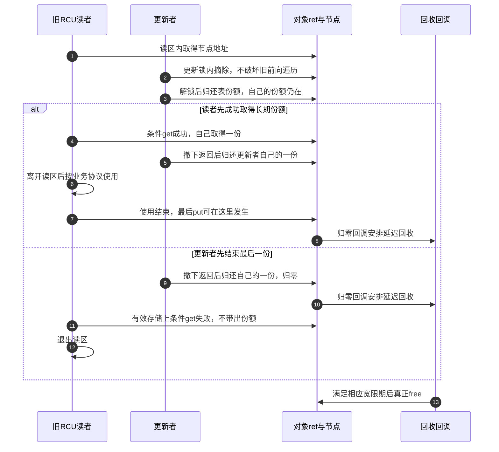
```mermaid
sequenceDiagram
    autonumber
    participant R as 旧RCU读者
    participant U as 更新者
    participant O as 对象ref与节点
    participant C as 回收回调
    R->>O: 读区内取得节点地址
    U->>O: 更新锁内摘除，不破坏旧前向遍历
    U->>O: 解锁后归还表份额，自己的份额仍在
    alt 读者先成功取得长期份额
        R->>O: 条件get成功，自己取得一份
        U->>O: 撤下返回后归还更新者自己的一份
        R->>R: 离开读区后按业务协议使用
        R->>O: 使用结束，最后put可在这里发生
        O->>C: 归零回调安排延迟回收
    else 更新者先结束最后一份
        U->>O: 撤下返回后归还自己的一份，归零
        O->>C: 归零回调安排延迟回收
        R->>O: 有效存储上条件get失败，不带出份额
        R->>R: 退出读区
    end
    C->>O: 满足相应宽限期后真正free
```

图示两种顺序的共同要求是“free前既无长期使用者，也不再有需要这些字节的旧临时读者”。失败分支中安排回调早于读者退出，真正free却不能越过该旧读者。回调完成还晚于被它覆盖的宽限期结束，模块卸载必须进一步确认不会再提交新回调且既有模块回调已经返回。图是假设新增并发读者后的协议审查，原模块初始化的顺序演示和宿主夹具不冒充实际发生了这两条并发轨迹。

另一种协议可保留退休份额跨过所需宽限期，再归还它，使后续最后release直接回收；前提是旧临时读者已被正确覆盖且不存在其他访问入口。因而不能把“所有RCU对象的release绝不能直接kfree”当作验收答案。普通get同样不是被RCU语法禁止，而是须证明正计数；若可能观察零，就需要条件取得并处理失败。

本批按当前材料重编重跑工作两模式十组、拥有型表六组、RCU模块八组宿主协议。固定引用辅助保留，锁、队列和RCU仍是受控顺序替身，没有新增目标装卸、真实并发、回调时延或ARM验证。合格解释不仅能画顺利路径，还应覆盖投递拒绝、重复撤下、条件取得失败和回收回调退出。
## 15.5\_边界和错误验收\_框架对象\_错误模式和所有权表

### 15.5.1\_验收十一\_能区分\_kref\_refcount\_t\_kobject\_device

必须能画出层次：

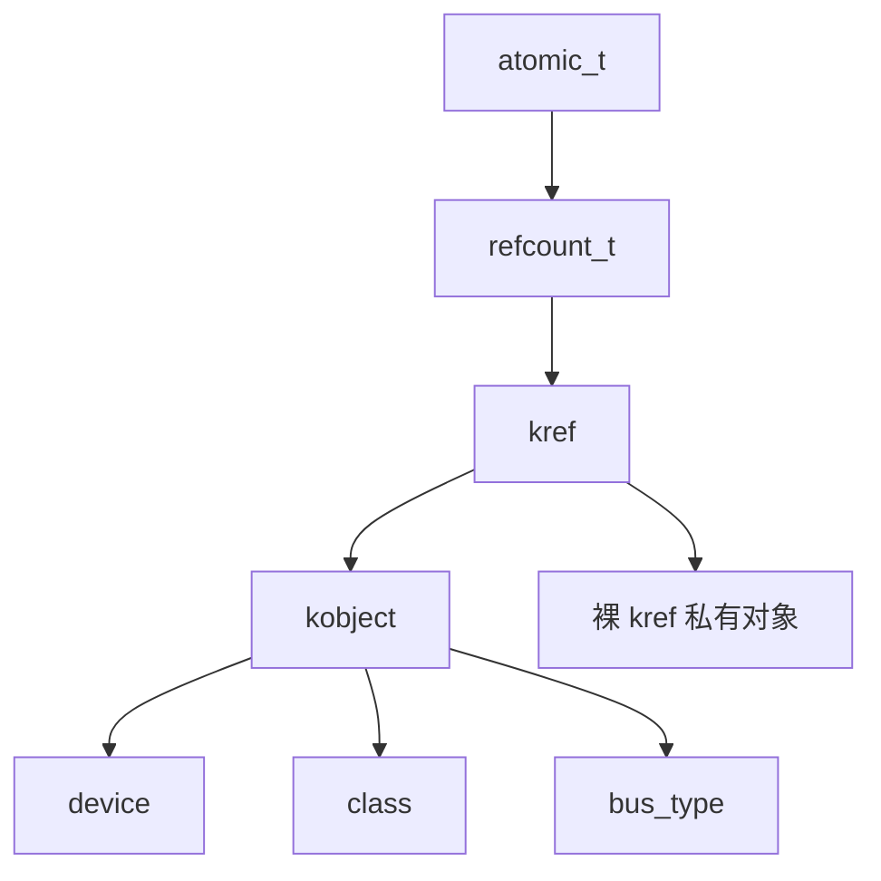
```mermaid
flowchart TD
    A["atomic_t"] --> B["refcount_t"]
    B --> C["kref"]
    C --> D["kobject"]
    D --> E["device"]
    D --> F["class"]
    D --> G["bus_type"]

    C --> H["裸 kref 私有对象"]
```

必须能回答：

| 对象                 | 应该使用什么                                |
| -------------------- | ------------------------------------------- |
| 自定义私有对象       | `struct kref`                               |
| 底层引用计数原语     | `refcount_t`                                |
| kobject 对象         | `kobject_get()` / `kobject_put()`           |
| device 对象          | `get_device()` / `put_device()`             |
| driver core 注册设备 | `device_register()` / `device_unregister()` |
| class/bus            | 对应 driver core API                        |

错误做法：

```c
kref_get(&dev->kobj.kref);
```

正确做法：

```c
get_device(dev);
```

必须能解释：

```text
device 不是裸 kref 的 my_obj；
device 是 driver core 的设备对象；
它的生命周期协议已经由 driver core 封装。
```

验收标准：

```text
不会为了“引用计数”强行引入 kobject；
不会手动操作 struct device 内部 kref；
能分清私有 kref 和 device 引用。
```

------

### 15.5.2\_验收十二\_能识别典型错误模式

看到下面代码，必须能快速判断问题。

#### (1)\_少\_get

```c
obj->work_obj = obj;
schedule_work(&obj->work);
kref_put(&obj->ref, my_obj_release);
```

判断：

```text
work 保存了 obj 指针，但没有自己的引用。
异步执行时可能 UAF。
```

#### (2)\_少\_put

```c
obj = my_obj_lookup_get(id);
file->private_data = obj;

/* release 中没有 put */
```

判断：

```text
file 持有引用但不释放，对象泄漏。
```

#### (3)\_多\_put

```c
kref_put(&obj->ref, my_obj_release);
kref_put(&obj->ref, my_obj_release);
```

判断：

```text
同一份引用释放两次，可能提前 release 或 underflow。
```

#### (4)\_put\_后访问

```c
my_obj_put(obj);
pr_info("%d\n", obj->id);
```

判断：

```text
put 可能触发 release，后续访问 UAF。
```

#### (5)\_lookup\_后无保护\_get

```c
obj = find_obj(id);
kref_get(&obj->ref);
```

判断：

```text
如果 find_obj 没有返回强引用，也没有锁/RCU保护，就是错误。
```

#### (6)\_get\_unless\_zero\_不检查返回值

```c
kref_get_unless_zero(&obj->ref);
return obj;
```

判断：

```text
如果返回 false，当前路径没有引用。
必须检查返回值。
```

#### (7)\_release\_里重新发布

```c
static void my_obj_release(struct kref *ref)
{
	list_add(&obj->node, &global_list);
	kref_init(&obj->ref);
}
```

判断：

```text
严重错误：release 中复活对象。
```

#### (8)\_release\_未脱链

```c
static void my_obj_release(struct kref *ref)
{
	kfree(obj);
}
```

如果对象仍在全局表中，判断：

```text
全局结构留下悬挂指针。
```

#### (9)\_kref\_当锁

```c
kref_get(&obj->ref);
obj->state++;
kref_put(&obj->ref, release);
```

判断：

```text
kref 不保护字段互斥，state 仍可能数据竞争。
```

#### (10)\_重复\_kref\_init

```c
kref_init(&obj->ref);  /* reset 路径 */
```

判断：

```text
破坏已有引用关系，严重错误。
```

错误模式图：

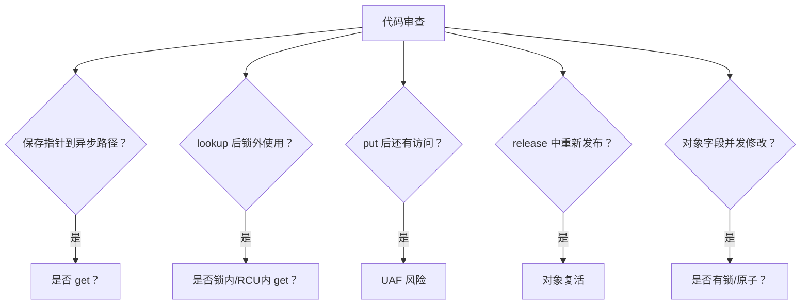
```mermaid
flowchart TD
    A["代码审查"] --> B{"保存指针到异步路径？"}
    B -- "是" --> C["是否 get？"]

    A --> D{"lookup 后锁外使用？"}
    D -- "是" --> E["是否锁内/RCU内 get？"]

    A --> F{"put 后还有访问？"}
    F -- "是" --> G["UAF 风险"]

    A --> H{"release 中重新发布？"}
    H -- "是" --> I["对象复活"]

    A --> J{"对象字段并发修改？"}
    J -- "是" --> K["是否有锁/原子？"]
```

验收标准：

```text
能从代码形态直接识别典型生命周期错误。
```

------

### 15.5.3\_验收十三\_能写对象所有权表

任何复杂对象都必须能写表。

例如：

```c
struct my_request {
	struct kref ref;
	struct list_head node;
	struct work_struct timeout_work;
	struct completion done;
	int status;
};
```

合格所有权表：

| 持有者       | 什么时候获得引用     | 什么时候释放引用               | 备注                     |
| ------------ | -------------------- | ------------------------------ | ------------------------ |
| 创建者       | `kref_init()`        | submit 成功 handoff 或失败路径 | 初始引用                 |
| 请求队列     | enqueue 成功         | dequeue                        | 队列持有期间对象不能释放 |
| timeout work | schedule 成功前 get  | workfn 结束                    | 异步路径                 |
| 用户等待者   | lookup 成功后 get    | wait 返回后                    | file/ioctl 等路径        |
| 硬件完成路径 | 从队列取出并确认有效 | 完成处理后                     | 中断或线程上下文         |

不合格表：

```text
大家用完就 put。
```

原因：

```text
没有说明谁是“大家”；
没有说明什么时候 get；
没有说明失败路径；
没有说明 handoff 后归属；
没有说明 remove 时如何 drain。
```

所有权表图：

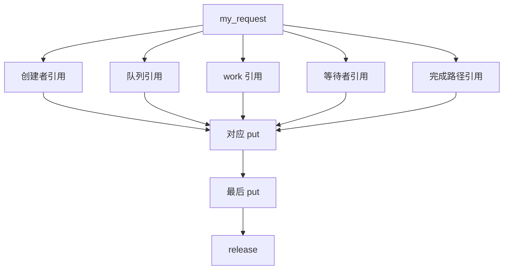
```mermaid
flowchart TD
    A["my_request"] --> B["创建者引用"]
    A --> C["队列引用"]
    A --> D["work 引用"]
    A --> E["等待者引用"]
    A --> F["完成路径引用"]

    B --> G["对应 put"]
    C --> G
    D --> G
    E --> G
    F --> G

    G --> H["最后 put"]
    H --> I["release"]
```

验收标准：

```text
能为任何 kref 对象写出“持有者/get/put/备注”表。
```

------

## 15.6\_工程审查验收\_remove\_release\_代码审查和定位

### 15.6.1\_验收十四\_能写\_remove/unlink/drain/release\_流程

合格 remove 流程必须分阶段：

```text
1. 设置 dying，阻止新业务用户进入。
2. 从 lookup 结构中取消发布。
3. 停止新请求提交。
4. 取消或 drain work/timer/callback。
5. 停止硬件或底层资源。
6. put 发布引用。
7. 等旧引用自然收敛。
8. 最后 release。
```

流程图：

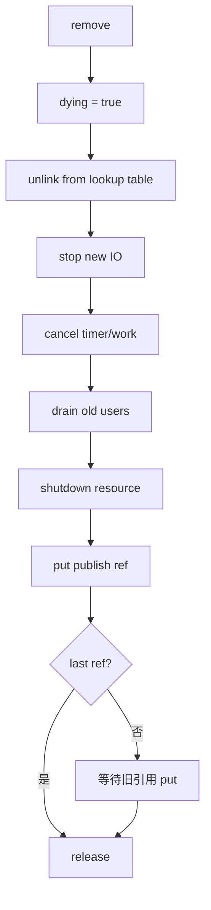
```mermaid
flowchart TD
    A["remove"] --> B["dying = true"]
    B --> C["unlink from lookup table"]
    C --> D["stop new IO"]
    D --> E["cancel timer/work"]
    E --> F["drain old users"]
    F --> G["shutdown resource"]
    G --> H["put publish ref"]
    H --> I{"last ref?"}
    I -- "否" --> J["等待旧引用 put"]
    I -- "是" --> K["release"]
    J --> K
```

必须能解释：

```text
unlink 不等于没有引用；
没有引用不等于 RCU 内存可立即释放；
kref 保护对象本体，不保护硬件资源仍然可用。
```

验收标准：

```text
能把 remove 和 release 拆开；
能说明旧引用如何退出；
能说明新用户如何被阻止。
```

------

### 15.6.2\_验收十五\_能判断\_release\_是否合格

合格 release 必须满足：

```text
1. 只在最后一个 put 时执行。
2. 能通过 container_of 找回外层对象。
3. 不重新发布对象。
4. 不重新 kref_init。
5. 不把对象交给新持有者。
6. 释放子资源顺序清楚。
7. 不提前释放 RCU 读者可能访问的内存。
8. 不在错误上下文中睡眠。
9. 对象应已经从全局集合取消发布。
10. 最后释放对象内存。
```

普通 release：

```c
static void my_obj_release(struct kref *ref)
{
	struct my_obj *obj = container_of(ref, struct my_obj, ref);

	WARN_ON(!list_empty(&obj->node));

	kfree(obj->buffer);
	kfree(obj);
}
```

RCU release：

```c
static void my_obj_release(struct kref *ref)
{
	struct my_obj *obj = container_of(ref, struct my_obj, ref);

	kfree_rcu(obj, rcu);
}
```

异步 release work：

```c
static void my_obj_release(struct kref *ref)
{
	struct my_obj *obj = container_of(ref, struct my_obj, ref);

	INIT_WORK(&obj->release_work, my_obj_release_workfn);
	schedule_work(&obj->release_work);
}
```

但必须能说明：

```text
obj 内存必须撑到 release_workfn 执行完；
真正 kfree 必须在 release_workfn 中；
不能在 schedule_work 后立刻 kfree。
```

release 验收图：

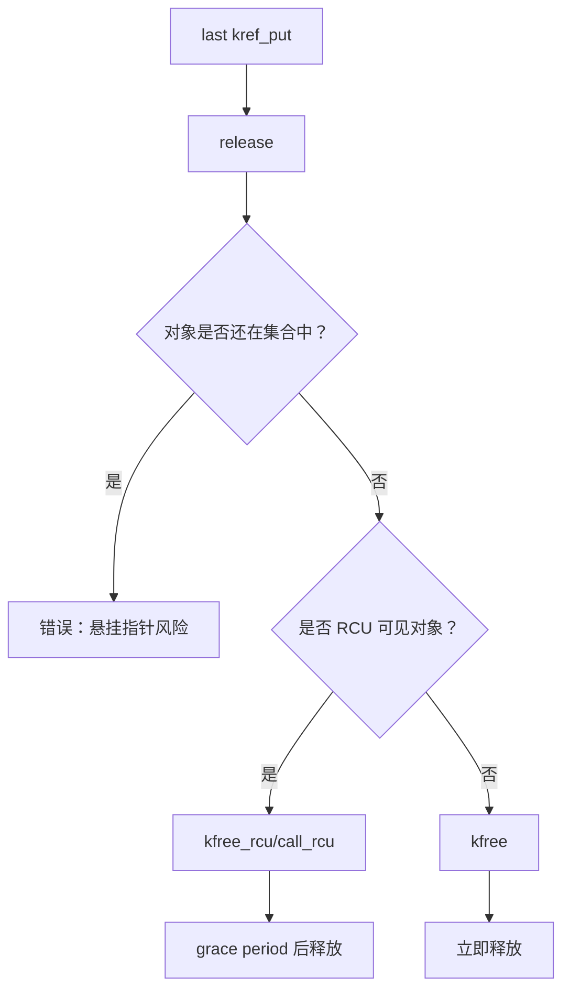
```mermaid
flowchart TD
    A["last kref_put"] --> B["release"]
    B --> C{"对象是否还在集合中？"}
    C -- "是" --> D["错误：悬挂指针风险"]
    C -- "否" --> E{"是否 RCU 可见对象？"}
    E -- "是" --> F["kfree_rcu/call_rcu"]
    E -- "否" --> G["kfree"]
    F --> H["grace period 后释放"]
    G --> I["立即释放"]
```

验收标准：

```text
能审查 release 的上下文、资源顺序、RCU 延迟和脱链状态。
```

------

### 15.6.3\_验收十六\_能完成代码审查

看到下面对象：

```c
struct my_obj {
	struct kref ref;
	struct list_head node;
	struct mutex lock;
	bool dying;
	struct work_struct work;
	int state;
};
```

必须能提出审查问题：

```text
1. kref_init 在哪里？
2. 初始引用归谁？
3. node 加入哪个集合？
4. 集合由哪把锁保护？
5. lookup 是否在锁内 get？
6. work 投递前是否 get？
7. workfn 结束是否 put？
8. remove 是否设置 dying？
9. remove 是否 list_del_init？
10. remove 是否 cancel_work_sync？
11. release 是否检查 node 已脱链？
12. state 是否由 obj->lock 保护？
13. put 后是否还有访问？
14. 是否存在重复 kref_init？
15. 是否存在 get_unless_zero 返回值未检查？
```

代码审查流程：

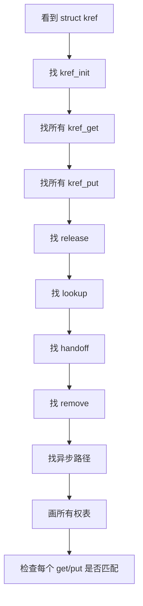
```mermaid
flowchart TD
    A["看到 struct kref"] --> B["找 kref_init"]
    B --> C["找所有 kref_get"]
    C --> D["找所有 kref_put"]
    D --> E["找 release"]
    E --> F["找 lookup"]
    F --> G["找 handoff"]
    G --> H["找 remove"]
    H --> I["找异步路径"]
    I --> J["画所有权表"]
    J --> K["检查每个 get/put 是否匹配"]
```

验收标准：

```text
能从对象定义反推出所有生命周期路径。
```

------

### 15.6.4\_验收十七\_能完成故障定位

#### (1)\_UAF\_定位

看到 KASAN UAF，必须问：

```text
1. 访问点是否在 put 后？
2. 异步路径是否缺少 get？
3. lookup 返回的是裸指针还是强引用？
4. remove 是否提前释放子资源？
5. RCU 对象是否直接 kfree？
```

#### (2)\_泄漏定位

看到对象不 release，必须问：

```text
1. 哪条 get 没有 put？
2. open/file 是否 release put？
3. work/timer 是否完成后 put？
4. enqueue 后 dequeue 是否 put？
5. 错误路径是否漏 put？
```

#### (3)\_underflow\_定位

看到 refcount underflow，必须问：

```text
1. 是否同一错误路径重复 put？
2. handoff 成功后调用者是否又 put？
3. release 后是否还有路径 put？
4. timer/work cancel 路径是否和回调都 put？
```

#### (4)\_字段竞争定位

看到 KCSAN data race，必须问：

```text
1. 这个字段是否由锁保护？
2. 是否错误认为持有 kref 就能修改字段？
3. 是否需要 READ_ONCE/WRITE_ONCE？
4. 是否需要 atomic_t？
5. 是否需要状态机锁？
```

故障定位图：

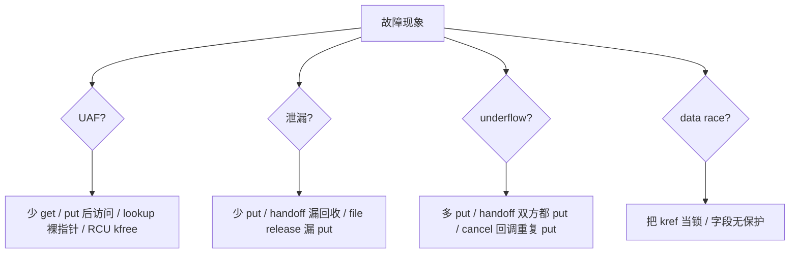
```mermaid
flowchart TD
    A["故障现象"] --> B{"UAF?"}
    A --> C{"泄漏?"}
    A --> D{"underflow?"}
    A --> E{"data race?"}

    B --> B1["少 get / put 后访问 / lookup 裸指针 / RCU kfree"]
    C --> C1["少 put / handoff 漏回收 / file release 漏 put"]
    D --> D1["多 put / handoff 双方都 put / cancel 回调重复 put"]
    E --> E1["把 kref 当锁 / 字段无保护"]
```

验收标准：

```text
能根据现象反推可能的生命周期错误类型。
```

------

### 15.6.5\_验收十八\_能区分四个\_安全

很多错误来自把不同安全混在一起。

必须能区分：

| 安全类型         | 由谁保证                              |
| ---------------- | ------------------------------------- |
| 指针临时可解引用 | 锁 / RCU                              |
| 对象生命周期存在 | kref                                  |
| 对象业务上可用   | state / dying                         |
| 字段访问一致     | mutex / spinlock / atomic / READ_ONCE |

图示：

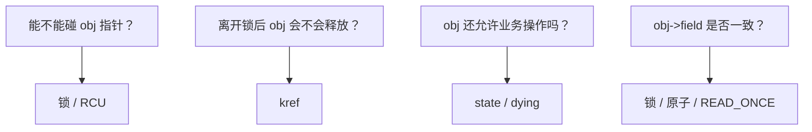
```mermaid
flowchart TD
    A["能不能碰 obj 指针？"] --> B["锁 / RCU"]
    C["离开锁后 obj 会不会释放？"] --> D["kref"]
    E["obj 还允许业务操作吗？"] --> F["state / dying"]
    G["obj->field 是否一致？"] --> H["锁 / 原子 / READ_ONCE"]
```

错误表达：

```text
这个对象是安全的。
```

正确表达：

```text
这个对象在当前 RCU 临界区内可以临时解引用；
当前路径还没有长期引用；
如果要离开 RCU，需要 get_unless_zero 成功；
即使 get 成功，也要检查 dying；
字段访问还要拿 obj->lock。
```

验收标准：

```text
能把“安全”拆成临时指针安全、生命周期安全、业务状态安全、字段并发安全。
```

------

## 15.7\_最终问答清单

学完后必须能快速回答下面问题。

### 15.7.1\_kref\_保护的是什么

```text
保护对象内存生命周期。
成功持有引用期间，对象本体不能被 release/free。
```

### 15.7.2\_kref\_不保护什么

```text
不保护字段互斥；
不保护对象是否在集合中；
不保护业务状态；
不保护硬件资源；
不保护 lookup 裸指针；
不替代 RCU；
不替代 driver core。
```

### 15.7.3\_为什么有指针不等于有引用

```text
指针只是地址；
引用是生命周期所有权。
没有引用的指针只能在锁/RCU保护窗口内临时借用。
```

### 15.7.4\_为什么\_kref\_init\_初始值是\_1

```text
对象创建后必须有第一份明确持有者。
这份初始引用通常归创建者或发布者。
```

### 15.7.5\_为什么\_kref\_get\_前必须证明对象有效

```text
因为 kref_get 要访问 obj->ref；
如果 obj 已经释放，连 ref 字段本身都是悬挂内存。
```

### 15.7.6\_为什么\_put\_后不能继续访问对象

```text
因为 put 可能是最后一个引用；
最后一个 put 会同步调用 release；
release 可能 kfree 对象。
```

### 15.7.7\_release\_为什么拿到\_struct\_kref\_*

```text
因为 kref 嵌入在业务对象内部；
kref_put 只知道 kref 指针；
release 用 container_of 找回外层对象。
```

### 15.7.8\_lookup\_+\_get\_为什么必须有锁或\_RCU

```text
因为 lookup 得到的只是临时指针；
在 get 成功前，必须有人保证这个指针指向的内存仍然有效。
```

### 15.7.9\_kref\_get\_unless\_zero()\_解决什么

```text
解决 refcount 非 0 时才加引用；
避免从 0 复活对象。
```

### 15.7.10\_kref\_get\_unless\_zero()\_不解决什么

```text
不证明 obj 指针有效；
不证明 obj 仍在集合中；
不证明 obj 业务可用；
不保护字段互斥。
```

### 15.7.11\_handoff\_成功和失败时引用归谁

```text
必须由函数契约定义。
get 模型、take 模型、borrow 模型不能混用。
```

### 15.7.12\_kref\_和\_mutex\_的边界是什么

```text
kref 保护生命周期；
mutex 保护字段和集合关系。
```

### 15.7.13\_kref\_和\_RCU\_的边界是什么

```text
RCU 保护读侧 lookup 窗口；
kref 保护取得引用后的长期生命周期。
```

### 15.7.14\_kref\_和\_kobject\_的边界是什么

```text
kref 是生命周期引用计数封装；
kobject 是带名字、层级、sysfs、ktype、kset 的内核对象模型。
```

### 15.7.15\_kref\_和\_device\_的边界是什么

```text
裸 kref 用于私有对象；
struct device 是 driver core 对象；
device 引用用 get_device/put_device。
```

------

## 15.8\_最终代码模板验收

最终应该能独立写出下面这种模板。

```c
struct my_obj {
	struct kref ref;
	struct list_head node;

	struct mutex lock;
	bool dying;

	int id;
};

static LIST_HEAD(my_obj_list);
static DEFINE_MUTEX(my_obj_list_lock);

static void my_obj_release(struct kref *ref)
{
	struct my_obj *obj = container_of(ref, struct my_obj, ref);

	WARN_ON(!list_empty(&obj->node));

	kfree(obj);
}

static struct my_obj *my_obj_alloc(int id)
{
	struct my_obj *obj;

	obj = kzalloc(sizeof(*obj), GFP_KERNEL);
	if (!obj)
		return NULL;

	kref_init(&obj->ref);
	INIT_LIST_HEAD(&obj->node);
	mutex_init(&obj->lock);

	obj->id = id;
	obj->dying = false;

	return obj;
}

static void my_obj_get(struct my_obj *obj)
{
	kref_get(&obj->ref);
}

static void my_obj_put(struct my_obj *obj)
{
	kref_put(&obj->ref, my_obj_release);
}

static void my_obj_publish(struct my_obj *obj)
{
	mutex_lock(&my_obj_list_lock);
	list_add_tail(&obj->node, &my_obj_list);
	mutex_unlock(&my_obj_list_lock);
}

static struct my_obj *my_obj_lookup_get(int id)
{
	struct my_obj *obj;

	mutex_lock(&my_obj_list_lock);

	list_for_each_entry(obj, &my_obj_list, node) {
		if (obj->id != id)
			continue;

		mutex_lock(&obj->lock);
		if (obj->dying) {
			mutex_unlock(&obj->lock);
			mutex_unlock(&my_obj_list_lock);
			return NULL;
		}

		my_obj_get(obj);

		mutex_unlock(&obj->lock);
		mutex_unlock(&my_obj_list_lock);

		return obj;
	}

	mutex_unlock(&my_obj_list_lock);
	return NULL;
}

static void my_obj_remove(struct my_obj *obj)
{
	mutex_lock(&my_obj_list_lock);

	mutex_lock(&obj->lock);
	obj->dying = true;
	mutex_unlock(&obj->lock);

	list_del_init(&obj->node);

	mutex_unlock(&my_obj_list_lock);

	my_obj_put(obj);
}
```

必须能解释这段代码里的每个点：

```text
为什么 kref_init 是 1；
为什么 publish 后对象可被 lookup；
为什么 lookup_get 要在锁内 get；
为什么要检查 dying；
为什么 remove 先 dying 再 list_del_init；
为什么 release 中 WARN_ON list_empty；
为什么 put 后不能访问 obj。
```

------

## 15.9\_最终\_Mermaid\_总图

整个 kref 学习可以压缩成这张图：

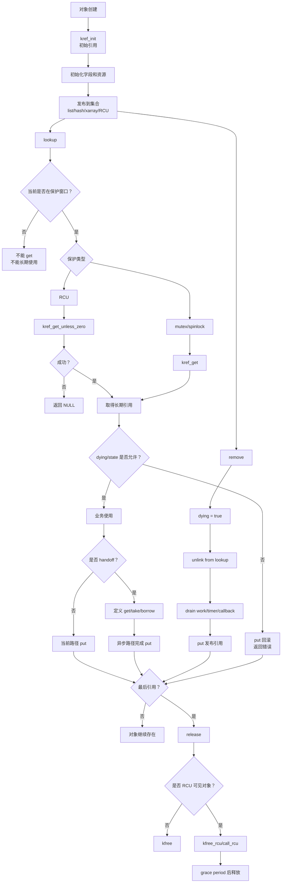
```mermaid
flowchart TD
    A["对象创建"] --> B["kref_init<br/>初始引用"]
    B --> C["初始化字段和资源"]
    C --> D["发布到集合<br/>list/hash/xarray/RCU"]

    D --> E["lookup"]
    E --> F{"当前是否在保护窗口？"}
    F -- "否" --> G["不能 get<br/>不能长期使用"]
    F -- "是" --> H{"保护类型"}

    H --> I["mutex/spinlock"]
    H --> J["RCU"]

    I --> K["kref_get"]
    J --> L["kref_get_unless_zero"]

    L --> M{"成功？"}
    M -- "否" --> N["返回 NULL"]
    M -- "是" --> O["取得长期引用"]
    K --> O

    O --> P{"dying/state 是否允许？"}
    P -- "否" --> Q["put 回滚<br/>返回错误"]
    P -- "是" --> R["业务使用"]

    R --> S{"是否 handoff？"}
    S -- "否" --> T["当前路径 put"]
    S -- "是" --> U["定义 get/take/borrow"]
    U --> V["异步路径完成 put"]

    D --> W["remove"]
    W --> X["dying = true"]
    X --> Y["unlink from lookup"]
    Y --> Z["drain work/timer/callback"]
    Z --> AA["put 发布引用"]

    T --> AB{"最后引用？"}
    V --> AB
    AA --> AB
    Q --> AB

    AB -- "否" --> AC["对象继续存在"]
    AB -- "是" --> AD["release"]

    AD --> AE{"是否 RCU 可见对象？"}
    AE -- "否" --> AF["kfree"]
    AE -- "是" --> AG["kfree_rcu/call_rcu"]
    AG --> AH["grace period 后释放"]
```

这张图里的每条边都应该能解释。

如果不能解释某条边，说明对应章节还没有掌握。

------

## 15.10\_最终评分标准

可以按 5 个等级自测。

### 15.10.1\_L0\_只会\_API

表现：

```text
知道 kref_init/get/put；
知道 release；
但不知道 lookup/handoff/remove 怎么设计。
```

评价：

```text
不能独立写工程代码。
```

### 15.10.2\_L1\_知道基本生命周期

表现：

```text
知道 get/put 成对；
知道最后 put release；
知道 put 后不能访问。
```

缺口：

```text
lookup、异步、RCU、锁组合容易错。
```

### 15.10.3\_L2\_能写普通私有对象

表现：

```text
能写 alloc/get/put/release；
能写 list + mutex lookup；
能写 remove/unlink。
```

缺口：

```text
复杂 handoff、timer/work、RCU 仍需要审查。
```

### 15.10.4\_L3\_能处理并发生命周期

表现：

```text
能处理 lookup + get；
能处理 work/timer handoff；
能处理 remove + drain；
能区分 kref 和锁；
能定位少 get/少 put/多 put。
```

评价：

```text
能用于普通驱动私有对象。
```

### 15.10.5\_L4\_能处理\_RCU\_和框架边界

表现：

```text
能写 RCU + kref_get_unless_zero；
能解释 kfree_rcu；
能区分 kref/refcount_t/kobject/device；
不会手动操作 device 内部 kref。
```

评价：

```text
具备内核子系统对象生命周期设计能力。
```

### 15.10.6\_L5\_能做代码评审和故障定位

表现：

```text
能从对象定义反推生命周期；
能画引用所有权表；
能审查所有 get/put/handoff/remove/release；
能根据 KASAN/KCSAN/lockdep/refcount warning 定位问题；
能给出修复方案。
```

评价：

```text
真正掌握 kref。
```

等级图：

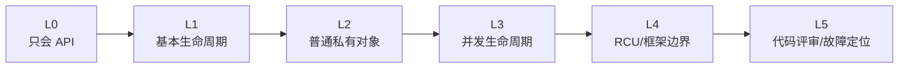
```mermaid
flowchart LR
    L0["L0<br/>只会 API"] --> L1["L1<br/>基本生命周期"]
    L1 --> L2["L2<br/>普通私有对象"]
    L2 --> L3["L3<br/>并发生命周期"]
    L3 --> L4["L4<br/>RCU/框架边界"]
    L4 --> L5["L5<br/>代码评审/故障定位"]
```

------

## 15.11\_最终结论

学完 kref 后，不能把它理解成：

```c
refcount++;
refcount--;
```

而要理解成：

```text
对象所有权协议。
```

最终掌握标准是：

```text
你能为一个对象回答：
谁创建它；
谁发布它；
谁能查到它；
谁能持有它；
谁能转交它；
谁能撤销它；
谁负责释放它；
谁不能再碰它。
```

最终核心句：

```text
kref 不是计数器 API；
kref 是 Linux 内核中描述对象生命周期所有权的底层工具。
```

再压缩成一句：

```text
会用 kref，不是会加一减一；
而是能把对象从创建、发布、查找、持有、转移、撤销到最终释放的所有权边界讲清楚。
```

------

专题导航：[kref 引用计数机制章节大纲](大纲.md)。

上一篇：[源码阅读实验](P14_源码阅读实验.md)。

下一篇：无，本篇是专题验收终点。
