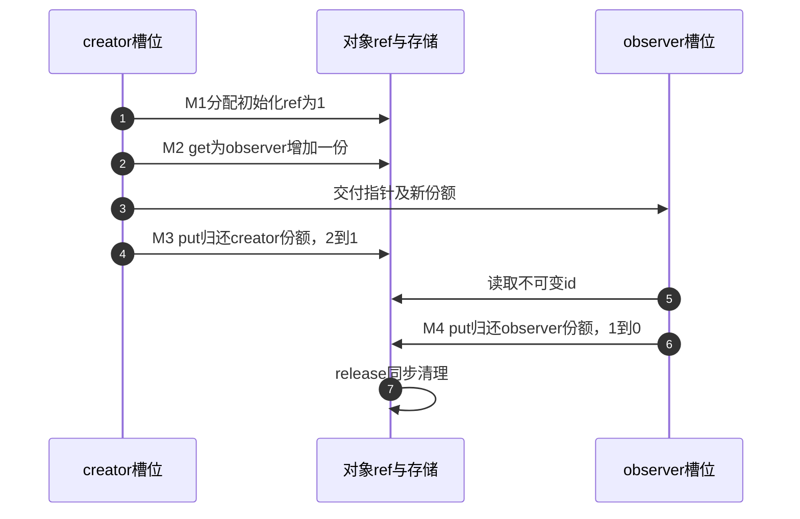

# 第16章\_对象创建与失败清理模板

本篇承接[P13工程模板入口](P13_工程模板.md#13.1_本章导读_把规则落成可复制模板)，先明确接口输入与返回责任，再用完整模块观察创建、分享和部分初始化回滚。完成后进入拥有型集合。

## 16.1\_模板命名约定

名字让调用者提前形成预期，注释和实现负责兑现预期。已有子系统名称应遵守其公开契约，不必为加一个get后缀而改造整个接口。本章的自有接口采用下列词汇：

| 名称 | 希望读者读出的动作 | 必须在契约中补齐的条件 |
| --- | --- | --- |
| alloc/create | 创建并交付初始份额 | 返回的是半初始化内部对象还是完整可用对象；NULL或错误指针的规则 |
| get | 为独立责任增加一份 | 输入已有有效地址与正计数保证；不是任意指针测试 |
| get_unless_zero | 在有效地址期限内尝试取得 | 允许观察零值时如何拒绝，false不交付份额 |
| put | 消费调用者当前拥有的一份 | 是否允许NULL，是否可能成为最后归还及其上下文 |
| release | 接手最终清理责任 | 普通调用、接锁调用或延期清理，各自不同的退出条件 |
| lookup_get | 查找并返回拥有型对象 | 锁/RCU窗口、正计数条件、失败表示以及是否仅作业务状态快照 |
| publish/unpublish | 建立或撤下可查找关系 | 是否另取集合份额、转交初始份额，或采用非拥有索引 |
| enqueue_get | 为接收方保留额外一份 | 拒绝后的候选回滚；调用者原份额不变 |
| enqueue_take | 转交调用者的一份 | 是只在成功时消费，还是每种返回都消费；必须明确写出 |
| borrow | 在指定期限内临时使用 | 谁保持存储、期限终点是什么；可以同步使用，也可以由管理者等待异步借用退出 |

例如“take只在成功时消费”和“submit_or_discard无论成功失败都消费”都能形成正确协议，但调用方失败分支必须不同。不要从返回负数就自动补put，也不要把所有borrow解释成“绝不能交给另一个执行者”。上一章已经说明，是否跨函数或跨线程不直接决定是否需要独立份额。

发布与撤下尤其不能只靠名字猜：list_add不增加kref，list_del也不减少kref；若采用拥有型表，必须在发布动作旁写出那一份来自哪里。remove可能只消费集合份额，也可能额外结束管理者责任，后面模板须逐项说明。

## 16.2\_基础对象模板\_alloc\_init\_get\_put\_release

先建立一个有编号的对象，两个本地责任槽位轮流使用它。没有全局查找、没有线程或中断并发；这一限制让我们能够先把创建成功与创建失败都走到底，再增加发布机制。

### 16.2.1\_模板一\_最小\_kref\_对象模板

最小对象只需业务数据和ref，不需要为了“像驱动”而放一个没有定义归属的priv指针。下面是类型骨架，完整可构建程序在下一小节：

```c
struct template_object {
    struct kref ref;
    int id; /* 创建时赋值，交付以后本例保持不变。 */
};
```

创建者分配外壳并init，得到一份。若observer需要独立使用，就在creator仍持有份额时get；然后creator可以归还，observer仍能读id，最后observer归还触发release。这里没有“release对象还活着所以再用一会”的阶段；回调返回前后是否实际free由清理协议决定，原拥有者不能据此延长访问。

| 时点 | creator槽位 | observer槽位 | 存储与清理 |
| --- | --- | --- | --- |
| M0 分配失败 | 无份额 | 无份额 | 返回失败，不调用put |
| M1 创建成功 | 初始一份 | 无份额 | 尚无共享入口 |
| M2 分享 | 保留一份 | 新增一份 | 两个槽位可以独立结束 |
| M3 创建者退出 | 已归还 | 保留一份 | observer可继续读取 |
| M4 观察者退出 | 无份额 | 最后一份已归还 | 同步release释放外壳 |



普通get包装只统一类型和回调约定，不能为悬空输入补出合法期限。put包装是否接受NULL也由本层约定；下一例故意要求非空的有效拥有型对象，使错误指针和空指针必须在调用处处理。将本地creator置NULL只是结束本地槽位的使用，并不会清除其他别名。

最小模板没有子资源，所以回调只free外壳。接下来加一个独立缓冲区，观察“外壳已经建好，内部准备却失败”的分支如何沿相同责任规则清理。

### 16.2.2\_模板二\_alloc/init/get/put/release\_分层模板

外部调用者应只看到完整对象或明确失败；内部创建路径却要经过多个阶段。这里选择三个私有帮助函数：object_alloc建立外壳与初始份额，object_prepare准备缓冲区，object_create统一成功交付和错误编码。prepare只在创建者独占、尚未发布时调用一次，不是对象重置接口。

把分配与准备拆开是为了说明阶段与失败责任，不是要求所有小对象都拆出一组函数。如果一个create函数内已经能清楚表达这些分支，合写同样成立。也不必为每个半初始化状态新增布尔量：本例buffer初始为NULL，成功才持有分配，NULL本身就能表达“无需回收缓冲区”。

下面是完整模块，材料为[note_kref_create.c](../../../../labs/kernel/object_lifetime/materials/note_kref_create.c)。fail_stage只模拟确定的失败位置，让我们无需耗尽系统内存也能重复观察回滚；真实kzalloc/kstrdup返回NULL仍走相同失败出口。

```c
// SPDX-License-Identifier: GPL-2.0
#include <linux/err.h>
#include <linux/kref.h>
#include <linux/module.h>
#include <linux/slab.h>

struct template_object {
    struct kref ref;
    int id;
    char *buffer;
};
static int fail_stage;
module_param(fail_stage, int, 0444);
MODULE_PARM_DESC(fail_stage, "模拟失败阶段：0正常，1外壳，2缓冲区，3业务校验");
static unsigned int release_calls;

static void object_release(struct kref *ref)
{
    struct template_object *obj = container_of(ref, struct template_object, ref);
    kfree(obj->buffer); /* NULL表示该子资源尚未建立。 */
    ++release_calls; /* 记录保存在对象外，不在free后读取对象。 */
    kfree(obj);
}

static void object_put(struct template_object *obj)
{
    /* 只接受持有一份的有效对象，不接受NULL或ERR_PTR。 */
    kref_put(&obj->ref, object_release);
}

static struct template_object *object_get(struct template_object *obj)
{
    /* 调用者已有一份，新增的一份可交给另一责任槽位。 */
    kref_get(&obj->ref);
    return obj;
}

static struct template_object *object_alloc(int id)
{
    struct template_object *obj;
    if (fail_stage == 1)
        return NULL; /* 在取得任何分配前模拟失败。 */
    obj = kzalloc(sizeof(*obj), GFP_KERNEL);
    if (!obj)
        return NULL;
    kref_init(&obj->ref);
    obj->id = id;
    return obj; /* 仅交给内部创建路径，尚不能发布给业务用户。 */
}

static int object_prepare(struct template_object *obj)
{
    /* 前提：创建者独占、尚未发布、只调用一次。 */
    if (fail_stage == 2)
        return -ENOMEM;
    obj->buffer = kstrdup("ready", GFP_KERNEL);
    if (!obj->buffer)
        return -ENOMEM;
    if (fail_stage == 3)
        return -EINVAL; /* 已有子资源时模拟业务校验失败。 */
    return 0;
}

static struct template_object *object_create(int id)
{
    struct template_object *obj = object_alloc(id);
    int ret;
    if (!obj)
        return ERR_PTR(-ENOMEM);
    ret = object_prepare(obj);
    if (ret) {
        object_put(obj); /* 唯一回滚入口，处理半初始化对象。 */
        return ERR_PTR(ret);
    }
    return obj; /* 成功交付完整对象及初始一份；不负责发布。 */
}

static int __init note_template_init(void)
{
    struct template_object *creator, *observer;
    if (fail_stage < 0 || fail_stage > 3)
        return -EINVAL;
    creator = object_create(7);
    if (IS_ERR(creator)) {
        pr_info("note_template: stage=%d error=%ld releases=%u\n",
                fail_stage, PTR_ERR(creator), release_calls);
        return PTR_ERR(creator); /* 无对象交付，调用者不能再put。 */
    }
    observer = object_get(creator);
    object_put(creator);
    creator = NULL;
    pr_info("note_template: id=%d buffer=%s releases=%u\n",
            observer->id, observer->buffer, release_calls);
    object_put(observer);
    observer = NULL;
    pr_info("note_template: finished releases=%u\n", release_calls);
    return 0;
}

static void __exit note_template_exit(void)
{
    /* 使用均在init同步结束，无外部入口、异步工作或卸载等待。 */
}
module_init(note_template_init);
module_exit(note_template_exit);
MODULE_LICENSE("GPL");
MODULE_DESCRIPTION("分层创建与统一失败回滚模板");
```

程序把release_calls放在模块静态存储里，因而对象回收后还可以报告结果。由于所有操作都在模块初始化中同步完成，这个计数不需要跨线程原子更新；若改成并发服务，这个前提随即失效，不能原样复用。

#### (1)\_沿失败阶段检查资源与份额

| 阶段 | 已建立状态 | 返回给外部调用者 | 内部清理责任 |
| --- | --- | --- | --- |
| C0 外壳分配前或分配失败 | 无对象 | ERR_PTR(-ENOMEM) | 没有份额可put |
| C1 外壳成功、缓冲区失败 | 初始一份，buffer为NULL | ERR_PTR(-ENOMEM) | create归还初始一份，release只回收外壳 |
| C2 缓冲区成功、业务校验失败 | 初始一份，buffer有效 | ERR_PTR(-EINVAL) | 同一release先回收buffer，再回收外壳 |
| C3 创建成功 | 完整对象，初始一份 | 有效指针 | 调用者接手，随后按M2～M4分享和归还 |

object_create失败时，内部已经消费初始份额，外部得到的是错误值，不是待清理对象。IS_ERR分支只能取错误码返回，不能再object_put。内部alloc用NULL、对外create用ERR_PTR是明确的层次转换；若直接把NULL当作创建成功返回，IS_ERR(NULL)并不会替你发现这个设计错误。

本例选择统一release回滚，要求它认识所有可到达的部分初始化状态。不能再在object_create中手动kfree(buffer)却留下旧指针，再put进入同一个release；这会回收两次。若以后资源要求先停止硬件、睡眠等待或特殊解绑，必须重新安排管理者退出与最终回调，而不是仅按“逆序free”往这里添加操作。

#### (2)\_构建\_预测和观察

先按[外部模块构建入口](../../../../engineering/build/kernel_modules/大纲.md)准备与目标运行内核匹配的配置、头文件和工具链。在Linux构建环境中从仓库根目录执行以下命令；KERNEL_BUILD须指向已准备的内核构建树，交叉构建时按构建章设置ARCH和CROSS_COMPILE：

```bash
make -C "$KERNEL_BUILD" M="$PWD/labs/kernel/object_lifetime/materials" modules
```

将生成的note_kref_create.ko送到匹配内核的实验环境，再从模块所在目录分别观察。普通模式成功装入后要卸载，才能重新使用相同模块名；失败模式返回错误，模块未成功装入，不应紧接着假定它已在系统中。

```bash
sudo insmod ./note_kref_create.ko fail_stage=0
sudo dmesg | tail -n 12
sudo rmmod note_kref_create
sudo insmod ./note_kref_create.ko fail_stage=2
sudo dmesg | tail -n 12
```

预期普通模式先打印id=7、buffer=ready、releases=0，因为observer还持有一份；归还observer后打印finished releases=1。失败阶段1尚无对象，releases为0；阶段2和3都会进入release一次，分别表示空缓冲区清理和完整缓冲区清理。insmod错误文字可能随工具和系统不同，以模块打印的阶段、错误码与清理次数核对因果。

配套宿主检查通过八个用例：正常周期、三个模拟失败、两个真实分配返回NULL替身、两个非法参数。使用固定普通引用函数，分配/模块注册/错误指针等环境为明确替身，不是Linux装卸测试。ARM前端检查通过，所用354份头文件中的342份非生成源码相对NXP固定提交无差异；本轮没有目标链接、装卸或真实并发结果。上面的命令供目标实验执行，不作为已经运行过的记录。

#### (3)\_小修改与下一步

先预测把observer的get删除会怎样：creator归还初始一份后对象已清理，observer只是旧地址；这不是“仍有一个指针所以计数应当为1”。不要在内核中执行这个错误变体，可用P12离线账本验证责任断点。

再把业务校验失败移到buffer分配以前，清理回调仍应执行一次，但只回收外壳；这说明“调用release一次”和“释放了哪些资源”不是同一个观察指标。最后考虑新增第二块缓冲区：它的初始状态、成功赋值点和部分失败清理必须一起更新，不能只在成功路径增加一次分配。

至此创建函数能交付一份完整对象，失败也没有遗留责任。下一节要让其他调用者按ID找到它：此时必须决定集合接手初始份额还是另外取得一份，并解决发布重复、查找与撤下的并发窗口。

------

专题导航：[kref引用计数机制大纲](大纲.md#1.14_工程模板)。

上一篇：[工程模板入口](P13_工程模板.md#13.1_本章导读_把规则落成可复制模板)。

下一篇：[拥有型链表工程模板](P17_拥有型链表工程模板.md#17.1_拥有型链表的发布与撤下)。
