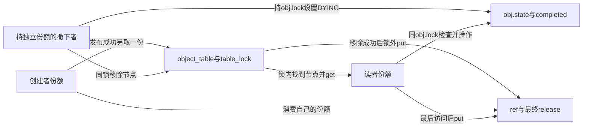

# 第17章\_拥有型链表工程模板

## 17.1\_拥有型链表的发布与撤下

本模板选择 **拥有型集合**：发布成功另给表一份，创建者仍保留原份额；查找成功再给读者一份。撤下只消费本次从表中取回的份额，不消费调用者为了执行撤下而保留的独立份额。这样创建者、表和查找者可以分别结束，且失败分支不需要猜“初始引用是不是已经交出去了”。

这是P09完整链表服务的工程复用。下面展示同一个[note_kref_table.c](../../../../labs/kernel/object_lifetime/materials/note_kref_table.c)，不另建一份同名实现。我们关注四个接口的输入、返回和退出条件；锁与引用如何各司其职的推导可回到[P09完整模型](P09_kref_与锁的组合.md#9.6.1_一个完整的锁_+_kref_对象模板)。

| 接口 | 输入资格 | 成功以后 | 失败或重复调用 |
| --- | --- | --- | --- |
| table_create | 当前可用GFP_KERNEL分配 | 返回NEW对象及初始一份 | NULL，无份额交付 |
| table_publish | 调用者已有一份，对象尚未发布且ID固定 | 表另持一份，调用者原份额不变 | 同一对象重复发布返回-EINVAL；同ID其他对象返回-EEXIST；不留表份额 |
| table_lookup | 给出ID，函数内部取得table_lock | 返回对象及读者新份额 | NULL，无需put |
| table_request | 调用者已有一份 | 锁内确认LIVE并同步完成一次统计更新 | 非LIVE返回-ESHUTDOWN，输出参数保持原值 |
| table_unpublish | 调用者独立持一份，且对象属于本表协议 | 关业务门、撤下节点、锁外归还表份额 | 已无成员关系则不再put；仍不消费调用者份额 |

### 17.1.1\_把状态位置接到一次完整周期

本对象不是“发布”和“被使用”来回切换的单一状态机。成员关系、NEW/LIVE/DYING业务状态及各方引用份额是几组共同约束的状态：对象可以仍为LIVE而同时有多个读者，也可以已DYING但仍有旧读者。先前模板把Published与InUse画成互斥状态，会掩盖这一点。



| 阶段 | 触发者与具体状态修改 | 后续读取者及保证 |
| --- | --- | --- |
| L0 独占创建 | 创建者设id、node自环、state=NEW、ref=1 | 对象尚不可由表查到 |
| L1 发布 | 同时持table_lock、obj.lock；确认NEW及ID不重复，再get表份额、置LIVE、加入object_table | 查找取得table_lock以后才能看到已完成发布 |
| L2 查找 | 持相同锁顺序，找到LIVE对象后get读者份额 | 返回后读者用自己的份额维持外壳 |
| L3 业务 | 读者只持obj.lock，检查LIVE并更新completed | 检查与本次同步操作在同一锁窗口内完成 |
| L4 撤下 | 拥有者持table_lock再持obj.lock，置DYING、list_del_init，记录removed=true | 以后查找找不到；旧读者的请求看见DYING而拒绝 |
| L5 结算 | 撤下者解开两把锁，只在removed为真时put表份额；其他拥有者各自put | 最后归还者清理，任何已释放内嵌锁都不再需要解锁 |

固定顺序是table_lock在外、obj.lock在内；普通业务只拿obj.lock，不再反向请求table_lock。查找锁内可普通get，是因为成员存在期间表份额尚未消费；不能仅用“已经拿了一把mutex”替代这个正计数证明。

### 17.1.2\_复用完整模块

```c
// SPDX-License-Identifier: GPL-2.0
#include <linux/errno.h>
#include <linux/kref.h>
#include <linux/list.h>
#include <linux/module.h>
#include <linux/mutex.h>
#include <linux/slab.h>

enum object_state { OBJECT_NEW, OBJECT_LIVE, OBJECT_DYING };
struct table_object {
    int id; /* 发布前固定；编号在当前表内唯一。 */
    struct list_head node; /* table_lock保护。 */
    struct mutex lock; /* 保护state与completed。 */
    enum object_state state;
    unsigned int completed;
    struct kref ref;
};
static LIST_HEAD(object_table);
static DEFINE_MUTEX(table_lock);
static unsigned int release_calls; /* 本模块无外部入口，初始化内顺序演示。 */

static void table_release(struct kref *ref)
{
    struct table_object *obj = container_of(ref, struct table_object, ref);
    WARN_ON(!list_empty(&obj->node));
    WARN_ON(obj->state == OBJECT_LIVE);
    ++release_calls;
    kfree(obj); /* 正常协议已无其他使用者，所有对象锁操作已经结束。 */
}

static void table_put(struct table_object *obj)
{
    if (obj)
        kref_put(&obj->ref, table_release);
}

static struct table_object *table_create(int id)
{
    struct table_object *obj = kzalloc(sizeof(*obj), GFP_KERNEL);
    if (!obj)
        return NULL;
    obj->id = id;
    INIT_LIST_HEAD(&obj->node);
    mutex_init(&obj->lock);
    obj->state = OBJECT_NEW;
    kref_init(&obj->ref);
    return obj;
}

/* 调用者持有一份；成功另给表一份，失败不消费。只发布一次。 */
static int table_publish(struct table_object *obj)
{
    struct table_object *candidate;
    int result = -EINVAL;
    mutex_lock(&table_lock);
    mutex_lock(&obj->lock);
    if (obj->state != OBJECT_NEW || !list_empty(&obj->node))
        goto out;
    list_for_each_entry(candidate, &object_table, node) {
        if (candidate->id == obj->id) {
            result = -EEXIST;
            goto out;
        }
    }
    kref_get(&obj->ref);
    obj->state = OBJECT_LIVE;
    list_add_tail(&obj->node, &object_table);
    result = 0;
out:
    mutex_unlock(&obj->lock);
    mutex_unlock(&table_lock);
    return result;
}

static struct table_object *table_lookup(int id)
{
    struct table_object *obj, *found = NULL;
    mutex_lock(&table_lock);
    list_for_each_entry(obj, &object_table, node) {
        if (obj->id != id)
            continue;
        mutex_lock(&obj->lock);
        if (obj->state == OBJECT_LIVE) {
            kref_get(&obj->ref);
            found = obj;
        }
        mutex_unlock(&obj->lock);
        break;
    }
    mutex_unlock(&table_lock);
    return found;
}

/* 仅同步增加计数；不启动硬件或异步工作。调用者持有一份。 */
static int table_request(struct table_object *obj, unsigned int *completed)
{
    int result = -ESHUTDOWN;
    mutex_lock(&obj->lock);
    if (obj->state == OBJECT_LIVE) {
        *completed = ++obj->completed;
        result = 0;
    }
    mutex_unlock(&obj->lock);
    return result;
}

/* 调用者独立持有一份；只归还本次取回的表份额，支持有效参数上重复调用。 */
static void table_unpublish(struct table_object *obj)
{
    bool removed = false;
    mutex_lock(&table_lock);
    mutex_lock(&obj->lock);
    if (!list_empty(&obj->node)) {
        obj->state = OBJECT_DYING;
        list_del_init(&obj->node);
        removed = true;
    }
    mutex_unlock(&obj->lock);
    mutex_unlock(&table_lock);
    if (removed)
        table_put(obj);
}

static int __init note_table_init(void)
{
    struct table_object *creator = table_create(7), *reader;
    unsigned int completed = 0;
    int result;
    if (!creator)
        return -ENOMEM;
    result = table_publish(creator);
    if (result) {
        table_put(creator);
        return result;
    }
    reader = table_lookup(7);
    if (!reader) {
        table_unpublish(creator);
        table_put(creator);
        return -ENOENT;
    }
    table_put(creator);
    result = table_request(reader, &completed);
    pr_info("note_table: before=%d completed=%u\n", result, completed);
    table_unpublish(reader);
    table_unpublish(reader);
    result = table_request(reader, &completed);
    pr_info("note_table: after=%d completed=%u\n", result, completed);
    table_put(reader);
    return 0;
}

static void __exit note_table_exit(void)
{
    pr_info("note_table: release=%u empty=%d\n", release_calls, list_empty(&object_table));
}

module_init(note_table_init);
module_exit(note_table_exit);
MODULE_LICENSE("GPL");
MODULE_DESCRIPTION("集合锁与对象锁配对的完整同步服务实验");
```

table_release中的两个WARN只验证本协议期望的“不在表中、不再LIVE”，不是回收前的自动修复。未发布的NEW对象也能正常最后释放，所以不能强制每个对象都先DYING。节点用普通list_del_init恢复自环，list_empty才是本模板有意义的成员检查；不能搬到保留旧next的RCU摘链协议中。

table_unpublish的removed在当前调用栈，记录这次调用是否真的取回表份额。必须在同一表锁内决定并修改成员关系，再在锁外据此put。若把put移出if，第二次撤下会误消费调用者那一份。反过来，只把obj赋NULL不能让第二个线程的旧地址安全；本例重复调用的前提始终是调用者另持有效份额。

### 17.1.3\_观察与验证成功和拒绝

材料已经登记到Makefile。按[创建模板的内核构建步骤](P16_对象创建与失败清理模板.md#%282%29_构建_预测和观察)生成模块，将它送到匹配运行内核后，在模块所在目录执行：

```bash
sudo insmod ./note_kref_table.ko
sudo dmesg | tail -n 12
sudo rmmod note_kref_table
sudo dmesg | tail -n 12
```

预期第一次请求成功，completed为1；撤下后请求返回-ESHUTDOWN，completed仍为1。卸载时应报告一次release、表为空。模块没有外部入口，所有使用在init内顺序完成；它展示的是责任周期，不是并发压力测试。上述目标装卸在本轮尚未执行。

先手工跟一次份额：创建为1，发布为2，lookup为3，创建者put后为2，第一次unpublish为1，第二次unpublish仍为1，读者put才为0。到最后一次put以前，读者始终有资格读取外壳，却在DYING后无权继续增加业务计数。这把存储和业务两个边界同时呈现出来。

已有六组宿主检查覆盖分配失败、完整周期、未发布对象撤下、重复发布与同ID冲突、多个对象及关闭后拒绝、撤下先于查找；使用固定普通引用函数和顺序锁/链表/分配替身。此前ARM前端通过，354份头中342份非生成源码与固定提交无差异。此次模块和夹具未改，冷读复核原断言与正文契约，不将既有顺序检查说成新增目标运行、真实竞争或调度验证。

### 17.1.4\_修改之前先判断协议是否还能成立

若希望撤下后重新发布，不能仅把DYING改回NEW：是否还有上一轮读者、ID能否复用、旧请求怎样辨认新业务周期，都需要重新设计。本模板明确采用一次发布周期，返回-EINVAL比默许跨代使用更清楚。

再考虑两个合法拥有者同时撤下。一个在锁内取回表份额，另一个看到自环不消费；二者最后还要分别归还自己原有的份额。请用L4/L5的顺序在纸上交错，并说明为何“两个removed都为true”不能成立。顺序宿主用例检查重复调用，不替代这一真实并发论证。

最后把同步统计替换成长时间I/O。若在obj.lock内检查完LIVE，解锁后才访问硬件，关闭可能在这段空隙撤销资源；此时必须延长合适的锁保护，或引入已解释的在途登记与排空。不能把现有table_request函数的短操作保证直接外推到异步设备服务。

链表模型现已闭合。下一模板改变索引和调用上下文为哈希与spinlock；变化不能只是在每个mutex前后机械替换函数名，分配、嵌套锁、IRQ以及可能最后回调也须一起审查。

------

专题导航：[kref引用计数机制大纲](大纲.md#1.14_工程模板)。

上一篇：[对象创建与失败清理模板](P16_对象创建与失败清理模板.md#16.1_模板命名约定)。

下一篇：[拥有型哈希与IRQ工程模板](P18_拥有型哈希与IRQ工程模板.md#18.1_拥有型哈希与IRQ上下文)。
