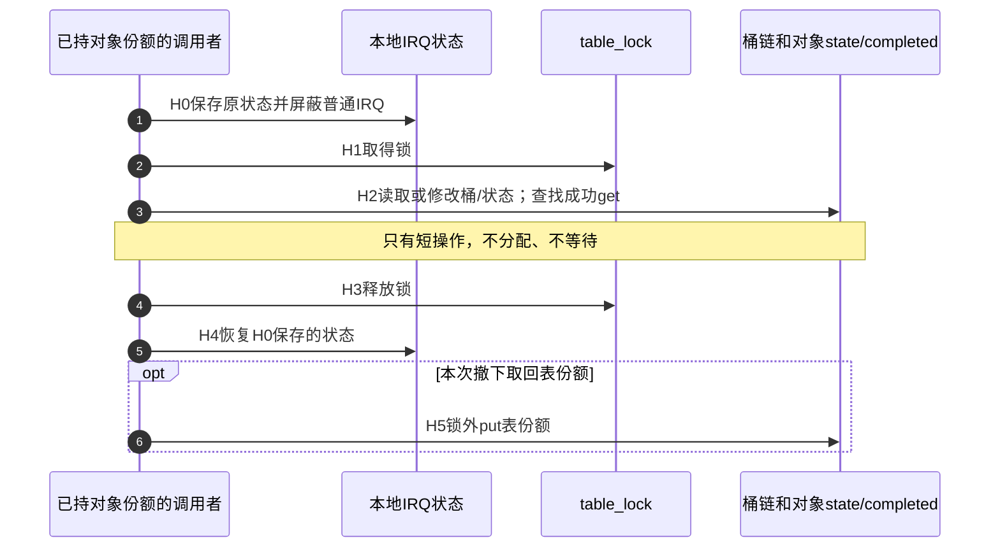

# 第18章\_拥有型哈希与IRQ工程模板

## 18.1\_拥有型哈希与IRQ上下文

链表模板已经解决“谁持有对象”，但查找仍要沿整条表比较ID。若对象按ID分桶，只需在选中的桶中逐个比较；不同ID仍可能落在同一桶，所以哈希结果不能代替相等判断。另一个独立约束是调用上下文：如果实际短操作要从普通IRQ路径进入，就不能把需要睡眠的mutex原样留在该路径。

这两个改变不是捆绑规则。只在进程上下文运行的哈希服务可以继续用mutex；链表也能受spinlock保护。下面选择当前ARM、非PREEMPT_RT配置下的短操作模型：对象创建用GFP_KERNEL、只在可睡眠上下文执行；发布、查找、统计和撤下的临界区不分配、不等待，不调用硬件服务。模块自身不注册IRQ，IRQ接口可用性仍需集成时验证。

### 18.1.1\_先选择状态位置和锁范围

本例用一把table_lock同时保护桶链、state和completed。这样关闭与短统计仍共用一个不可分开的检查/操作窗口，也避免在尚未需要并行更新时先增加第二层锁。代价同样明确：即使两个请求操作不同对象，它们也在这把锁上串行；哈希减少桶内遍历，并不会消除全局锁竞争。

如果实际工作负载需要不同对象并行更新，可以恢复“table_lock保护成员、obj.lock保护业务”的两层设计：lookup/remove先取得表锁，再取得对象锁；独立业务只取得对象锁，不反向取表锁。若同一对象锁也由IRQ路径使用，单独取得它的进程路径也须遵守相应的本地IRQ规则，不能只在嵌套取表锁时禁IRQ。增加每对象锁的理由应是缩小业务临界区的竞争范围，而不是结构体越多锁就越安全。

这里用spin_lock_irqsave保存进入前的IRQ状态并关闭本地普通IRQ，再用spin_unlock_irqrestore恢复保存值。若进程持锁时本地IRQ再次尝试同一锁，IRQ会等待被自己打断的执行者，后者却无法继续解锁；保存/屏蔽路径防止这种同CPU重入。若调用前本就已关IRQ，退出时应仍保持关闭，不能用无条件开启IRQ代替恢复。当前单CPU配置不提供多CPU竞争测试证据，但本地IRQ重入问题仍然存在；该接口也不能据此推广为NMI/FIQ或任意实时配置的安全保证。

固定包装及配置入口见[锁源码阅读索引](../../../../research/source_reading/locking/navigation/P01_Linux_6.12_锁源码总阅读索引.md)和[spin_lock到raw包装](../../../../research/source_reading/locking/source_explanations/include/linux/spinlock.h.md#1.4_spin_lock到raw包装)。该锁研究主线另有SMP配置，本模板编译边界按[本次基线核对](../../../../research/source_reading/linux/SOURCE_BASELINE.md#1.75_拥有型哈希模板的上下文边界)，不能静默混用两者的架构路径。



图中的引用计数由kref负责，IRQ保存和桶锁不替代引用。查找成功仍要在表份额保持的窗口内get；撤下仍只在真正移除节点的那次调用中消费表份额。H5执行普通put也不自动切换成可睡眠上下文：最后回调必须适合调用方实际环境。

### 18.1.2\_运行完整拥有型哈希模块

下面是[note_kref_hash.c](../../../../labs/kernel/object_lifetime/materials/note_kref_hash.c)。四个桶只是便于观察碰撞；id创建后固定，发布拒绝同ID重复，撤下后不再重新发布同一对象。state、节点和责任与上一模板采用同一生命周期，变化集中在索引和锁上下文。

```c
// SPDX-License-Identifier: GPL-2.0
#include <linux/atomic.h>
#include <linux/errno.h>
#include <linux/hash.h>
#include <linux/kref.h>
#include <linux/list.h>
#include <linux/module.h>
#include <linux/slab.h>
#include <linux/spinlock.h>

#define OBJECT_HASH_BITS 2
#define OBJECT_HASH_SIZE (1U << OBJECT_HASH_BITS)
enum hash_state { HASH_NEW, HASH_LIVE, HASH_DYING };
struct hash_object {
    struct kref ref;
    struct hlist_node node;
    u32 id; /* 创建后固定，不能在已发布时换桶。 */
    enum hash_state state;
    unsigned int completed;
};
static struct hlist_head object_table[OBJECT_HASH_SIZE];
/* 本例用同一锁保护桶、业务状态与短统计操作。 */
static DEFINE_SPINLOCK(table_lock);
static atomic_t release_calls = ATOMIC_INIT(0);

static void hash_release(struct kref *ref)
{
    struct hash_object *obj = container_of(ref, struct hash_object, ref);
    WARN_ON(!hlist_unhashed(&obj->node));
    WARN_ON(obj->state == HASH_LIVE);
    atomic_inc(&release_calls);
    kfree(obj); /* 无睡眠清理；此时不再持table_lock。 */
}
static void hash_put(struct hash_object *obj)
{
    if (obj)
        kref_put(&obj->ref, hash_release);
}
static struct hash_object *hash_create(u32 id)
{
    struct hash_object *obj = kzalloc(sizeof(*obj), GFP_KERNEL);
    if (!obj)
        return NULL;
    kref_init(&obj->ref);
    INIT_HLIST_NODE(&obj->node);
    obj->id = id;
    obj->state = HASH_NEW;
    return obj;
}
/* 输入已有一份；只发布一次，成功另给表一份，失败保留原份额。 */
static int hash_publish(struct hash_object *obj)
{
    struct hash_object *candidate;
    unsigned long flags;
    unsigned int bucket = hash_32(obj->id, OBJECT_HASH_BITS);
    int result = -EINVAL;
    spin_lock_irqsave(&table_lock, flags);
    if (obj->state != HASH_NEW || !hlist_unhashed(&obj->node))
        goto out;
    hlist_for_each_entry(candidate, &object_table[bucket], node) {
        if (candidate->id == obj->id) {
            result = -EEXIST;
            goto out;
        }
    }
    kref_get(&obj->ref);
    obj->state = HASH_LIVE;
    hlist_add_head(&obj->node, &object_table[bucket]);
    result = 0;
out:
    spin_unlock_irqrestore(&table_lock, flags);
    return result;
}
static struct hash_object *hash_lookup(u32 id)
{
    struct hash_object *obj, *found = NULL;
    unsigned long flags;
    unsigned int bucket = hash_32(id, OBJECT_HASH_BITS);
    spin_lock_irqsave(&table_lock, flags);
    hlist_for_each_entry(obj, &object_table[bucket], node) {
        if (obj->id == id && obj->state == HASH_LIVE) {
            kref_get(&obj->ref); /* 表份额保证可见对象仍为正计数。 */
            found = obj;
            break;
        }
    }
    spin_unlock_irqrestore(&table_lock, flags);
    return found;
}
static int hash_request(struct hash_object *obj, unsigned int *completed)
{
    unsigned long flags;
    int result = -ESHUTDOWN;
    spin_lock_irqsave(&table_lock, flags);
    if (obj->state == HASH_LIVE) {
        *completed = ++obj->completed;
        result = 0;
    }
    spin_unlock_irqrestore(&table_lock, flags);
    return result;
}
/* 调用者另有一份；重复撤下只在有效输入上成立。 */
static void hash_unpublish(struct hash_object *obj)
{
    unsigned long flags;
    bool removed = false;
    spin_lock_irqsave(&table_lock, flags);
    if (!hlist_unhashed(&obj->node)) {
        obj->state = HASH_DYING;
        hlist_del_init(&obj->node);
        removed = true;
    }
    spin_unlock_irqrestore(&table_lock, flags);
    if (removed)
        hash_put(obj);
}
static int __init note_hash_init(void)
{
    struct hash_object *creator, *reader;
    unsigned int completed = 0;
    int result;
    for (unsigned int i = 0; i < OBJECT_HASH_SIZE; ++i)
        INIT_HLIST_HEAD(&object_table[i]);
    creator = hash_create(7);
    if (!creator)
        return -ENOMEM;
    result = hash_publish(creator);
    if (result) {
        hash_put(creator);
        return result;
    }
    reader = hash_lookup(7);
    if (!reader) {
        hash_unpublish(creator);
        hash_put(creator);
        return -ENOENT;
    }
    hash_put(creator);
    result = hash_request(reader, &completed);
    pr_info("note_hash: before=%d completed=%u\n", result, completed);
    hash_unpublish(reader);
    hash_unpublish(reader);
    result = hash_request(reader, &completed);
    pr_info("note_hash: after=%d completed=%u\n", result, completed);
    hash_put(reader);
    return 0;
}
static void __exit note_hash_exit(void)
{
    /* 本模块没有外部IRQ或用户入口，全部使用在init内结束。 */
    pr_info("note_hash: release=%d\n", atomic_read(&release_calls));
}
module_init(note_hash_init);
module_exit(note_hash_exit);
MODULE_LICENSE("GPL");
MODULE_DESCRIPTION("拥有型哈希与IRQ保存锁模板");
```

release_calls使用atomic_t是对象外的诊断计数；它不参与回收决策，也不保护业务字段。hash_release只检查已经建立的不变量、记数和kfree，不等待、不重新取得table_lock。创建失败和未发布对象最后归还仍合法，因此HASH_NEW也可以直接清理。

按[创建模板的构建步骤](P16_对象创建与失败清理模板.md#%282%29_构建_预测和观察)生成模块，目标环境执行：

```bash
sudo insmod ./note_kref_hash.ko
sudo dmesg | tail -n 12
sudo rmmod note_kref_hash
sudo dmesg | tail -n 12
```

普通周期应先打印before=0、completed=1，撤下后打印after=-ESHUTDOWN对应的错误值且completed仍为1，最终release次数为1。重复撤下没有额外put。程序没有外部IRQ入口，以上输出只用于目标实验预测；本轮没有实际装卸记录。

七组宿主协议检查通过：分配失败、正常周期、未发布对象、重复对象/同ID拒绝、不同ID同桶及缺失查找、重复撤下/关闭后拒绝、进入时IRQ已关闭。检查使用固定普通引用函数；哈希、链表、锁、IRQ位和分配器是顺序替身，不能证明真实IRQ屏蔽、SMP锁行为或Linux内存顺序。ARM前端通过，354份头中的342份非生成源码与官方固定提交无差异，未执行目标链接或并发运行。

### 18.1.3\_用碰撞和退出反查模板

练习先选择两个不同ID，满足hash_32得到相同桶号，再预测同时发布以后能否各自查到。能：桶内仍比较完整id。若去掉比较，只返回桶里第一项，引用数可能仍完全配平，却把另一个对象交给调用者；生命周期正确不能替代业务身份正确。

再让两个有效拥有者分别尝试撤下同一对象。第一位在锁内置DYING并hlist_del_init，第二位看到unhashed而不消费表份额；各自最后仍需归还自己的拥有份额。若要在真实IRQ里触发这条路径，还必须确认所有可能最后put路径、外部中断来源的退出和回调代码寿命，不应直接把这个无外部入口的示例当成完整驱动。

对仍使用纯进程上下文、短链表已足够的服务，可以继续采用上一模板：没有必要为了“哈希加自旋锁更高级”增加关IRQ时间。若桶很长或业务临界区变长，先测量和定位查找、竞争及最长关IRQ区间，再决定扩桶、缩短临界区或拆锁；不能在持锁区塞入阻塞I/O。

下一模板用XArray管理整数ID。它还带有内部锁和可能分配的节点，不能仅把hlist_add替换为xa_insert并继续持同一类锁。

------

专题导航：[kref引用计数机制大纲](大纲.md#1.14_工程模板)。

上一篇：[拥有型链表工程模板](P17_拥有型链表工程模板.md#17.1_拥有型链表的发布与撤下)。

下一篇：[XArray身份与删除工程模板](P19_XArray身份与删除工程模板.md#19.1_整数索引与期待对象删除)。
