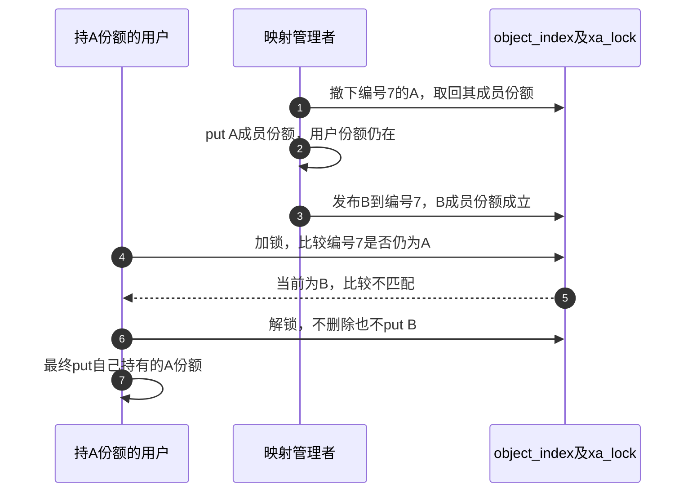

# 第19章\_XArray身份与删除工程模板

## 19.1\_整数索引与期待对象删除

XArray按整数索引保存条目，适合不想自行管理桶和碰撞链的对象表。但它的内部节点可能分配内存，API管理锁的方式也不相同。把前一模板的表锁照搬到所有xa调用外面，可能重复取得同一把锁，或把可睡眠分配放进不允许等待的窗口。

本节只存非空普通对象指针，ID在创建后不变，不使用xa_value、保留条目、多索引条目或IRQ入口。先采用P08已经建立的拥有型XArray：发布预留一份，成功归条目、失败退回；查找在xa_lock内取得；删除返回旧条目，解锁后归还其份额。这里没有业务关闭状态，旧拥有者可以继续读不可变ID；若要撤销硬件或禁止业务，还须组合单独的关闭协议。

### 19.1.1\_区分三个接口的锁窗口

| 操作 | 谁管理索引锁 | 份额在哪个时点取得或归还 |
| --- | --- | --- |
| xa_insert | 公开包装内部管理xa_lock，并按分配约束处理节点 | 发布前先预留；成功保留为成员份额，失败退回预留 |
| xa_load后get | 应用另持xa_lock覆盖这两个动作 | 表条目仍在、表份额仍正时get，之后才解锁 |
| xa_erase | 公开包装自己加/解锁，返回被移除的旧条目 | 返回以后消费旧条目份额；NULL表示没有可消费条目 |
| 已持xa_lock时删除 | 使用__xa_erase已持锁入口 | 当前锁窗口内决定和移除，解锁以后put |

xa_load内部的RCU窗口用于索引读取，函数返回以前就结束，且不会给业务对象自动get。应用的外层xa_lock排斥删除，使“读出地址—取得份额”之间仍有表份额保护。反过来，xa_insert和xa_erase已经自行锁定，不可再无条件套同一个xa_lock。固定证据由[整数索引模块](../../../../research/source_reading/kref/navigation/P06_整数索引与拥有型查找导读.md#6.2_把容器动作接到引用周期)进入，再看[插入包装](../../../../research/source_reading/kref/source_explanations/include/linux/xarray.h.md#1.1_插入包装自行管理锁)和[删除的两种入口](../../../../research/source_reading/kref/source_explanations/lib/xarray.c.md#1.2_删除包装与已持锁入口)。

外层mutex也可以形成另一种完整方案：所有发布、查找加get、删除都服从同一把外部mutex，查找和删除因此不能在两步之间交错。该mutex不同于XArray内部xa_lock；在允许睡眠的上下文下调用自行加锁的公开接口不等于递归取得同一锁。代价是新增一层串行约束，且任何绕过外部mutex的删除都会破坏证明。不能在一半调用点用外部mutex，另一半仅凭“XArray内部会加锁”就认为同一窗口仍成立。

### 19.1.2\_完整模块与成员份额

以下复用[note_kref_xarray.c](../../../../labs/kernel/object_lifetime/materials/note_kref_xarray.c)。它没有原模板含糊的“创建者/发布者共一份”，成功发布会增加独立成员份额，因此创建者随后立即put也不会使条目悬空。

```c
// SPDX-License-Identifier: GPL-2.0
#include <linux/errno.h>
#include <linux/kref.h>
#include <linux/module.h>
#include <linux/slab.h>
#include <linux/xarray.h>

struct indexed_object {
    unsigned long id; /* 发布前写入，之后不再改变。 */
    struct kref ref;
};
static DEFINE_XARRAY(object_index);
static unsigned int release_calls; /* 本实验初始化内顺序完成全部操作。 */

static void indexed_release(struct kref *ref)
{
    struct indexed_object *obj = container_of(ref, struct indexed_object, ref);
    ++release_calls;
    kfree(obj);
}

static void indexed_put(struct indexed_object *obj)
{
    if (obj)
        kref_put(&obj->ref, indexed_release);
}

static struct indexed_object *indexed_create(unsigned long id)
{
    struct indexed_object *obj = kzalloc(sizeof(*obj), GFP_KERNEL);
    if (!obj)
        return NULL;
    obj->id = id;
    kref_init(&obj->ref);
    return obj;
}

/* 调用者持有一份；成功让映射拥有新增份额，失败退回预留。 */
static int indexed_publish(struct indexed_object *obj)
{
    int result;
    kref_get(&obj->ref);
    result = xa_insert(&object_index, obj->id, obj, GFP_KERNEL);
    if (result)
        indexed_put(obj);
    return result;
}

static struct indexed_object *indexed_lookup(unsigned long id)
{
    struct indexed_object *obj;
    xa_lock(&object_index);
    obj = xa_load(&object_index, id);
    if (obj)
        kref_get(&obj->ref); /* 映射尚在，同一 xa_lock 排斥删除。 */
    xa_unlock(&object_index);
    return obj;
}

static void indexed_remove(unsigned long id)
{
    /* xa_erase 自行加锁；返回被摘下条目的份额，不再套一层 xa_lock。 */
    struct indexed_object *obj = xa_erase(&object_index, id);
    indexed_put(obj); /* 解锁以后归还；空映射不产生第二次归还。 */
}

static int __init note_index_init(void)
{
    struct indexed_object *creator = indexed_create(7), *reader;
    int result;
    if (!creator)
        return -ENOMEM;
    result = indexed_publish(creator);
    indexed_put(creator);
    if (result) {
        xa_destroy(&object_index); /* 清理索引内部节点，不代替对象 put。 */
        return result;
    }
    reader = indexed_lookup(7);
    indexed_remove(7);
    indexed_remove(7); /* 第二次查无条目，不再消耗引用。 */
    xa_destroy(&object_index); /* 本例映射已空，且没有外部入口。 */
    if (!reader)
        return -ENOENT;
    pr_info("note_index: detached reader id=%lu\n", reader->id);
    indexed_put(reader);
    return 0;
}

static void __exit note_index_exit(void)
{
    pr_info("note_index: release=%u\n", release_calls);
}

module_init(note_index_init);
module_exit(note_index_exit);
MODULE_LICENSE("GPL");
MODULE_DESCRIPTION("XArray拥有型查找与重复撤下实验");
```

请跟踪创建到撤下：create为1，publish预留为2；成功后creator归还为1，只剩映射；lookup成功变2；remove取回并归还映射份额变1；第二次remove返回NULL，读者仍为1；最后读者put才回收。这与哈希服务的基本拥有关系相同，XArray并没有提供额外的对象生命周期魔法。

xa_destroy用于索引结构退出，不逐个替你消费业务对象份额。本例在入口结束且映射已空以后调用它；不能把任意非空对象表交给xa_destroy就期待每个indexed_release被调用。

按[创建模板的构建步骤](P16_对象创建与失败清理模板.md#%282%29_构建_预测和观察)准备模块，在匹配内核环境观察：

```bash
sudo insmod ./note_kref_xarray.ko
sudo dmesg | tail -n 12
sudo rmmod note_kref_xarray
sudo dmesg | tail -n 12
```

预期条目已撤下后仍打印detached reader id=7，卸载日志release=1。它说明“索引不再可见”和“读者份额结束”可以分离；没有声称对象业务已经关闭或硬件仍有效。本轮未在目标内核装卸。

### 19.1.3\_编号复用时到底要删除谁

indexed_remove(id)的契约是删除 **该编号当前的条目**，没有要求它还是某个调用者先前看见的对象。假设用户持旧对象A，管理者已撤下A，又把新对象B发布到同一ID。此时用户调用indexed_remove(id)，会删除B；如果用户的真实意图是“只撤下A”，那么接口选择错了，即使每次put仍与被删除的条目配平。

要表达后一种意图，就在同一xa_lock窗口内比较当前条目与期待对象，再通过已持锁入口删除。比较后若先解锁、再调用xa_erase，替换仍可能发生在两者之间。

下面是对完整模块的一个 **可选接口**，输入者始终另持expected一份；它不是把所有按ID删除一律替换掉：

```c
/* 输入另持一份；只撤下当前仍指向该对象的条目，不消费输入份额。 */
static bool indexed_remove_same(struct indexed_object *expected)
{
    struct indexed_object *removed = NULL;
    bool matched;
    xa_lock(&object_index);
    if (xa_load(&object_index, expected->id) == expected)
        removed = __xa_erase(&object_index, expected->id);
    xa_unlock(&object_index);
    matched = removed != NULL;
    indexed_put(removed); /* 仅归还确实取回的成员份额。 */
    return matched;
}
```

比较时预期对象仍被调用者持有，所以它的地址不会在此期间回收并被新分配冒用。id不可变，读取不会与改ID竞争。若条目已经是B，函数返回false且不改B的映射或份额；若仍为A，函数返回true并只消费A的成员份额。调用者原有份额始终保留，随后由调用者自己结束。



普通模块六组宿主用例复核通过；可选包装新增三组检查匹配后删除并重复调用、同ID替换后保护B、空映射保留输入份额。使用固定普通引用链与xa_insert/xa_load/xa_erase外层函数，节点存储、__xa_erase下层行为、锁和RCU为顺序替身。包含可选包装的模块变体通过ARM前端，354份头中342份非生成源码与固定提交无差异；这些结果不证明真实XArray节点算法或并发时序，也没有目标链接装卸。

### 19.1.4\_选择适合调用者意图的契约

练习把上面的比较移到锁外，再列出“先读到A—另一方换成B—删除编号7”的三步。错误不是缺一次get：用户原本就持A，而删除针对的是另一个对象。修复须让身份判断与成员修改受同一窗口保护。

如果管理者本来就负责清空某编号的当前条目，按ID删除仍然适合；如果某个对象拥有者只想撤下自己，应采用期待对象比较；如果业务还要区分同一对象的多次发布代际，则仅比较地址也不够，需要明确的代际与发布协议。本节一次发布实例不凭空承诺处理所有复用方案。

三个集合模板至此共同回答：如何建立成员份额、怎样在定位窗口内取得，以及哪个动作取回被撤下的那一份。下一节加入工作、定时器和完成事件，要继续追踪责任究竟在提交者、容器、执行者还是取消者手中。

------

专题导航：[kref引用计数机制大纲](大纲.md#1.14_工程模板)。

上一篇：[拥有型哈希与IRQ工程模板](P18_拥有型哈希与IRQ工程模板.md#18.1_拥有型哈希与IRQ上下文)。

下一篇：[返回异步交付模板](P13_工程模板.md#13.5_handoff_异步模板_work_timer_completion_错误回滚)。
