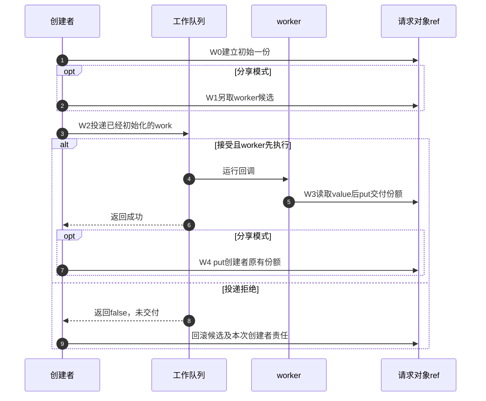
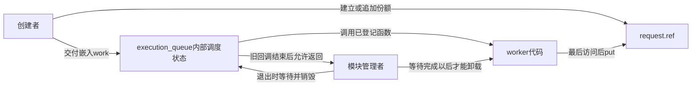
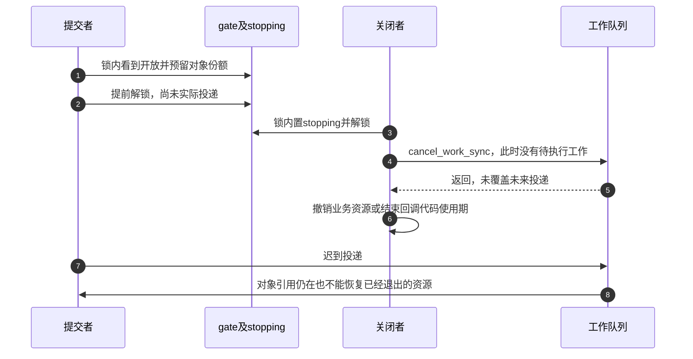

# 第20章\_工作交付与关闭工程模板

集合模板已经明确“谁取回成员份额”。现在把对象交给工作线程：投递函数返回以前，worker就可能开始甚至完成。调用者此后还能否访问，取决于交出去的是另取的一份还是自己的原份额；关闭时还须证明不会出现迟到投递。

## 20.1\_先选择分享还是转交

分享为worker另取一份，调用者保留原有资格；转交则让worker接手调用者的一份，计数不因交付增加。两者都能正确成立，不能把转交笼统称为“更危险”。选择取决于提交者成功后是否还需要独立使用，以及接口怎样规定失败。

| 时点 | 分享模式 | 本例成功时消费的转交模式 |
| --- | --- | --- |
| 创建 | 创建者一份 | 创建者一份 |
| 投递前 | 预留worker候选，合计两份 | 仍为原来一份 |
| 投递拒绝 | 候选归提交者回滚，原份额仍归创建者 | 原份额仍归创建者 |
| 投递接受 | 候选交给worker，创建者仍有一份 | 原份额交给worker，创建者不再消费 |
| worker结束 | worker归还自己的份额 | worker归还接过的同一份 |

“接受”是提交返回值所表示的交付结果，不是worker何时开始执行。如果转交成功，worker可以在提交者执行下一行前free对象；只要提交者不再读取对象，就没有问题。分享模式下，worker先put也不会伤害仍持份额的创建者，但其业务字段仍需单独遵守同步规则。



下面把三个不同的存储位置分开：request.ref记录对象份额，队列内部状态决定是否接收/执行work，模块管理者保证execution_queue及回调代码的退出顺序。对象引用不自动持有后两者。



## 20.2\_用同一完整请求比较两种模式

材料[note_kref_work_modes.c](../../../../labs/kernel/object_lifetime/materials/note_kref_work_modes.c)只创建一个请求、只投递一次，无外部生产者或重排。只读参数transfer决定采用哪种交付；两种模式共用同一个worker，worker始终只put一次。

```c
// SPDX-License-Identifier: GPL-2.0
#include <linux/errno.h>
#include <linux/kref.h>
#include <linux/module.h>
#include <linux/slab.h>
#include <linux/workqueue.h>

struct work_request {
    struct kref ref;
    struct work_struct work;
    int value;
};
static bool transfer;
module_param(transfer, bool, 0444);
MODULE_PARM_DESC(transfer, "false另取工作份额，true转交创建者份额");
static struct workqueue_struct *execution_queue;
static unsigned int release_calls;

static void request_release(struct kref *ref)
{
    struct work_request *request = container_of(ref, struct work_request, ref);
    ++release_calls;
    kfree(request);
}
static void request_put(struct work_request *request)
{
    kref_put(&request->ref, request_release);
}
static void request_worker(struct work_struct *work)
{
    struct work_request *request = container_of(work, struct work_request, work);
    pr_info("note_work_modes: value=%d\n", request->value);
    request_put(request); /* 只归还本次成功交付给worker的一份。 */
    /* 此后不能再访问request或嵌入其中的work。 */
}
static int __init note_modes_init(void)
{
    struct work_request *request;
    execution_queue = alloc_ordered_workqueue("note_modes", 0);
    if (!execution_queue)
        return -ENOMEM;
    request = kzalloc(sizeof(*request), GFP_KERNEL);
    if (!request) {
        destroy_workqueue(execution_queue);
        return -ENOMEM;
    }
    kref_init(&request->ref);
    INIT_WORK(&request->work, request_worker);
    request->value = 42;
    if (!transfer)
        kref_get(&request->ref); /* 分享模式先为worker准备独立一份。 */
    if (!queue_work(execution_queue, &request->work)) {
        /* 全新work仅投递一次；拒绝时没有向worker交付任何份额。 */
        if (!transfer)
            request_put(request); /* 退回分享模式的候选份额。 */
        request_put(request); /* 创建者仍需结算原有一份。 */
        destroy_workqueue(execution_queue);
        return -EIO;
    }
    if (!transfer)
        request_put(request); /* 分享成功后只结束创建者自己的责任。 */
    /* 转交成功时不再访问request，即使worker已经完成也没有问题。 */
    return 0;
}
static void __exit note_modes_exit(void)
{
    /* 无其他生产者或重排；等待唯一回调返回后才卸载代码。 */
    destroy_workqueue(execution_queue);
    pr_info("note_work_modes: transfer=%d releases=%u\n", transfer, release_calls);
}
module_init(note_modes_init);
module_exit(note_modes_exit);
MODULE_LICENSE("GPL");
MODULE_DESCRIPTION("同一工作请求的共享与转交对照");
```

queue_work拒绝时不会替本次调用消费候选。分享模式的拒绝分支有两份，所以依次归还候选和创建者；转交模式只有一份，所以只归还创建者。它们都通过同一个release回收。不能把“失败分支有两个put”脱离当前责任数就判成重复归还，也不能在转交成功后再照搬分享模式的put。

本例request只拥有自己的外壳；execution_queue由模块的初始化/退出管理，模块退出通过destroy_workqueue等待唯一工作结束。引用计数不会让队列或模块代码自动继续存在。release_calls在退出等待完成以后读取，这里的顺序条件不等于可用于任意并发统计。

按[P16构建步骤](P16_对象创建与失败清理模板.md#%282%29_构建_预测和观察)生成模块，在匹配内核运行环境比较：

```bash
sudo insmod ./note_kref_work_modes.ko transfer=0
sudo rmmod note_kref_work_modes
sudo insmod ./note_kref_work_modes.ko transfer=1
sudo rmmod note_kref_work_modes
sudo dmesg | tail -n 16
```

两种模式都应观察value=42和releases=1。回调打印可能早于insmod返回；这个顺序并不表示多执行了一次。宿主对两种模式各检查队列分配失败、对象分配失败、投递拒绝、延后执行、提交返回前已经执行，共十例通过。固定普通引用链保留，分配器和工作调度为显式替身；ARM前端354头中342份非生成源码无固定提交差异。目标链接装卸与真实并发未执行，命令是待运行步骤。

## 20.3\_对象份额不能填补关闭后的迟到投递

现在增加可以随时关闭的入口。原本常见的代码先持gate检查stopping、预留引用并置私有work_pending，再解锁，最后才schedule_work。多加的引用保住了对象，却没有把实际投递与关闭排序。



最后一条箭头表示错误交付的后果，不是工作队列会检查业务资源。修复要求检查关闭门和 **实际投递** 位于同一个受保护窗口，并覆盖全部生产者。关门取得同一把锁后，就能确定哪些投递已经发生；以后经过该入口的调用会拒绝。随后才能在锁外取消或等待，不能持worker也要取得的gate等待它退出。

已有[P06管理者等待完整模块](P06_release_回调与复杂销毁模式.md#6.2.2_运行一个由管理者等待借用退出的模块)采用这个边界：job.gate保护stopping和queue使用，owned_request在锁内检查并queue_work；owned_close持同锁关门，解锁后cancel，再destroy，最后归还管理者份额。worker借用管理者的存储期限，因而没有独立份额可put。

| 阶段 | 状态载体与写入者 | 下一路径如何得知 |
| --- | --- | --- |
| G0 接受 | 提交者持job.gate读取stopping，在同锁窗口内投递 | 关闭者必须等这个窗口结束才能取得gate |
| G1 关门 | 管理者锁内写stopping=true | 后续提交者持同锁读到拒绝，不再使用队列 |
| G2 等待 | 管理者在锁外cancel_work_sync | 工作队列的同步等待确保相关旧回调已退出 |
| G3 退出队列 | 管理者销毁队列并在gate内清queue | 旧对象拥有者仍先检查stopping，不能使用失效队列 |
| G4 结束借用期限 | 管理者put初始份额 | 其余真实拥有者只结束自己的份额；worker不另put |

这个完整借用模型与20.2的独立worker份额不同。不能拿借用模型的worker“不put”去拼分享模型，也不能看到取消返回true就替借用worker归还一份根本不存在的引用。

## 20.4\_重复投递与取消需要逐实例责任

Linux的PENDING表示工作队列内部状态，私有work_pending则可能是应用定义的“这一次责任尚未结束”。名字相似不代表边界相同：执行前PENDING可以清掉，回调仍在运行；同一work还可能在运行期间再次排队。若应用允许多次投递，就必须说明一次成功返回对应哪一份、合并或拒绝如何回滚、运行实例与待执行实例能否同时存在。

固定实现入口沿[工作队列源码索引](../../../../research/source_reading/workqueue/navigation/P01_Linux_6.12_工作队列源码总阅读索引.md#1.3_三条模块分支)进入，分别见[投递的pending与非重入](../../../../research/source_reading/workqueue/source_explanations/P02_Linux_6.12_工作队列投递与激活源码实现.md#2.4_queue_work选择pool并保持非重入)、[执行边界](../../../../research/source_reading/workqueue/source_explanations/P03_Linux_6.12_worker_flush与取消源码实现.md#3.3_worker_thread与process_one_work执行边界)和[同步取消](../../../../research/source_reading/workqueue/source_explanations/P03_Linux_6.12_worker_flush与取消源码实现.md#3.5_cancel_work_sync撤销与等待)。取消调用不替应用自动put；必须先停止竞争投递，再按应用责任区分执行者归还和取消者接管。

[P03工作票据实验](P03_kref_生命周期状态机.md#3.8.2_生命周期中的所有权表)的work_ticket.c已经比较接受、拒绝、执行、取消六条顺序轨迹。它只描述一次实例、管理者在取消期间仍有资格的模型，不能用一个cancel返回值推算任意重排历史。需要长期周期工作的场景，应先列出运行与pending两组责任以及停止重排的来源，再决定是否值得采用独立份额；管理者等待的借用模式有时更直接。

## 20.5\_预测与协议迁移

先修改20.2的思路：若转交成功后提交者还要读取value，应改成分享，或在交付前另保留自己的一份；不能先投递再get，因为worker可能已经释放对象。若只是想记录提交的值，可以在合法期限内复制独立标量，但它不能让之后的对象访问变得合法。

再比较两条拒绝路径：全新请求从未被worker接收，创建者应结束自身份额；已经有一次work待执行时，第二次提交为自己准备的候选被拒绝，只能回滚第二次候选，不能替第一次workerput。错误往往来自把这两种“queue_work返回false”当作同一个拥有状态。

最后把关闭者的cancel移到持gate的范围内。如果worker也需要gate，关闭者等worker，worker等gate，就没有任何一方能推进。引用计数再精确也不能解除这个等待环。因此选择交付模板时，要同时写出对象责任、业务关门、队列寿命和回调代码退出，而不是只在每个schedule前加get。

专题导航：[kref工程模板路线](大纲.md#1.14_工程模板)。

上一篇：[XArray身份与删除](P19_XArray身份与删除工程模板.md#19.1_整数索引与期待对象删除)。

下一篇：[返回定时器交付模板](P13_工程模板.md#13.5.2_模板七_timer_handoff_模板)。
