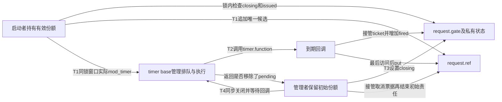
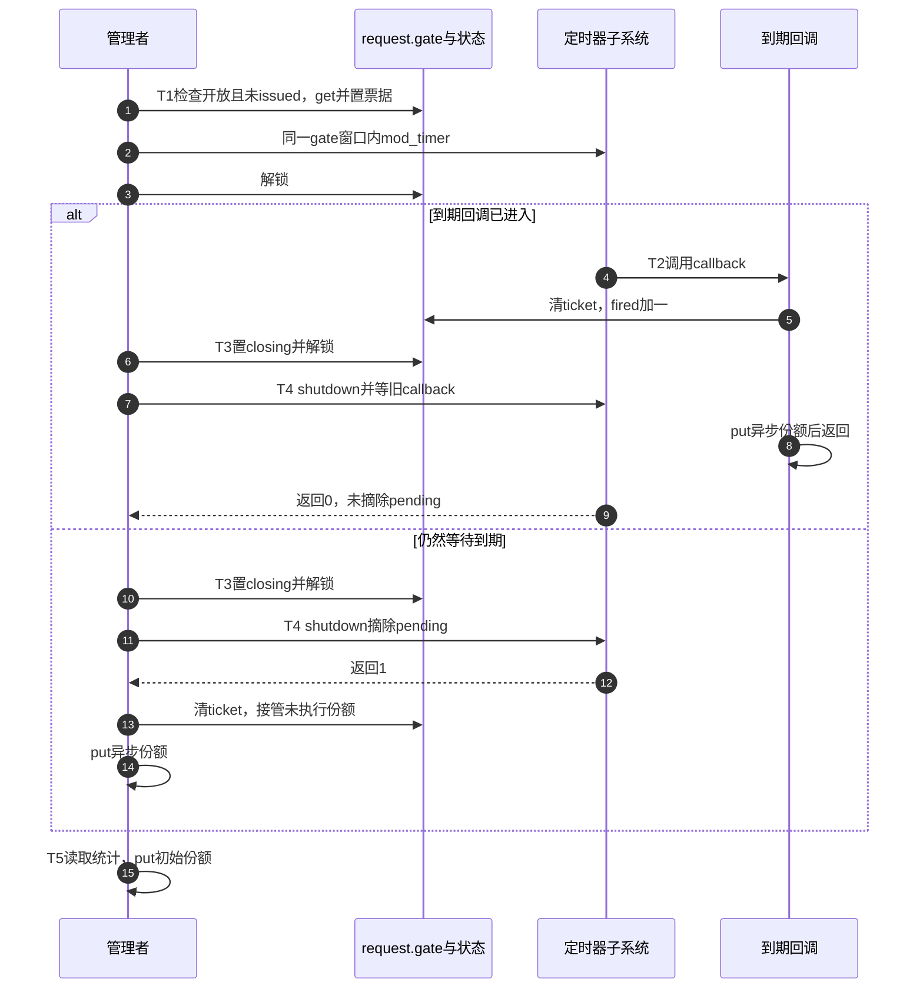

# 第21章\_定时器交付与同步关闭模板

工作交付已经说明：引用保留对象，关闭协议决定谁还能产生新活动。换成定时器后，这两项职责仍然存在，但“安排一次到期”不一定意味着“增加一次回调”。同一个timer反复mod_timer通常只是修改同一节点的到期要求；若每次改期都get，最后一次回调无法结算此前全部份额。

本章先把任务收窄为 **每个对象只接受一次到期请求**：可以正常触发，也可以提前关闭；不周期重启，不改期，不在回调中产生其他工作。沿这个边界完成一个模块，再判断哪些变化要求重新设计协议。周期改期与相互重启的既有推导保留在[P06定时器退出](P06_release_回调与复杂销毁模式.md#6.7.3_release_和_timer_的收尾关系)。

## 21.1\_先把排队状态与对象责任分开

创建者保留初始份额，成为本例管理者。接受启动时另取一份，交给将来的回调；如果管理者在回调执行前取消，改由管理者接管这份并归还。初始份额一直保留到同步关闭之后，所以取消者操作嵌入timer时不会因计数归零而失去地址。

原模板的私有timer_pending意图表达责任，却容易与内核timer_pending()混淆。本例改名ticket，并给它更窄的含义：“那份引用已经准备好，尚未被回调或取消者接管”。它是应用字段，不是内核定时器状态。回调把ticket清为false后仍要凭接过的一份执行到末尾；不能看见false就释放对象。

| 状态及存储位置 | 谁写、谁读 | 它能说明什么 |
| --- | --- | --- |
| request.ref | 管理者建立，启动者追加，回调或取消者归还 | 还存在多少对象拥有责任 |
| request.gate保护的closing | 管理者关门，所有启动者检查 | 新的请求能否经过本协议入口 |
| gate保护的issued | 第一次成功启动写true，此后启动者读取 | 此对象是否已经用过唯一启动机会；回调不复位 |
| gate保护的ticket | 启动者建立，回调或取消者清除 | 未接管的唯一异步份额；不表示回调已退出 |
| request.fired | 回调锁内增加；管理者同步关闭后读取 | 本例是否实际进入过回调 |
| timer.entry与base.running_timer | 内核定时器子系统管理 | 前者关联排队，后者记录运行；两者不是同一个状态 |

这些字段组成相互约束的多组状态，而不是一个“pending/finished”枚举。比如ticket=false、fired=1时回调可能刚更新统计，还没执行put；管理者必须依靠同步关闭等待回调返回，不能用应用字段猜测退出完成。



## 21.2\_沿同一次请求走到最终归还

先沿正常路径推演，再把提前关闭插在不同阶段。阶段号同时用于下面的程序和时序。

| 阶段 | 进入事件与状态变化 | 后续如何继续 |
| --- | --- | --- |
| T0 创建 | 管理者初始化ref=1、空闲timer及全false私有标志 | 管理者可启动或直接关闭 |
| T1 接受 | 启动者持gate检查，写issued和ticket，get，再在同锁内mod_timer | 关门必须排在实际安排之后；重复启动拒绝 |
| T2 执行 | 回调取得gate，清ticket、增加fired，解锁后put | 回调自己结算一份；初始份额仍保留 |
| T3 关门 | 管理者持gate置closing，再解锁 | 后来启动者看到关闭，不get、不安排 |
| T4 同步关闭 | 管理者在gate外调用timer_shutdown_sync | 摘除pending则接管票据；若回调已进入则等待其退出 |
| T5 结束管理 | 管理者读稳定统计，再put初始份额 | 没有其他拥有者，本例release恰好一次 |

为什么需要issued而不仅是ticket？ticket在T2就会变false。如果允许其他线程此时再次安排，它便可能建立第二份异步责任，而第一回调还在执行。那可以设计，但已超出“一个对象一次请求”的本例；issued保持true，使重复启动在回调前后都被拒绝。想开始另一笔业务就创建另一对象，责任容易审查，代价是额外分配。



返回0还有“根本没有启动过”或“回调早已结束”的情形。因此判断依据是本协议最多一次启动、回调必定归还且关门完整的前提，不是返回0天然代表某一种责任。返回1也只表示摘除了pending，不替应用做put。

## 21.3\_完整的一次到期模块

材料[note_kref_timer.c](../../../../labs/kernel/object_lifetime/materials/note_kref_timer.c)把T0～T5连起来。delay_ms是只读模块参数，默认等待60000毫秒，便于在触发前卸载；改为0可以观察尽快到期，但它不保证回调一定在insmod返回前执行。jiffies是内核时钟节拍计数，msecs_to_jiffies把参数换算为节拍，mod_timer接收的是绝对到期节拍。

程序沿用前几篇的分配、kref、模块注册和irqsave锁接口。新增的timer_setup为嵌入定时器绑定回调；from_timer根据嵌入成员找回对象。closing拒绝返回-ESHUTDOWN，重复启动返回-EALREADY，两者均不消费调用者份额。成功则仅新增一份定时器责任。

```c
// SPDX-License-Identifier: GPL-2.0
#include <linux/errno.h>
#include <linux/jiffies.h>
#include <linux/kref.h>
#include <linux/module.h>
#include <linux/slab.h>
#include <linux/spinlock.h>
#include <linux/timer.h>

struct deadline_request {
    struct kref ref;
    struct timer_list timer;
    spinlock_t gate;
    bool closing;
    bool issued;
    bool ticket;
    unsigned int fired;
};
static struct deadline_request *managed_request;
static unsigned int delay_ms = 60000;
module_param(delay_ms, uint, 0444);
MODULE_PARM_DESC(delay_ms, "一次到期的等待毫秒数；卸载时同步关闭");
static unsigned int release_calls;

static void deadline_release(struct kref *ref)
{
    struct deadline_request *request = container_of(ref, struct deadline_request, ref);
    ++release_calls;
    kfree(request);
}
static void deadline_put(struct deadline_request *request)
{
    kref_put(&request->ref, deadline_release);
}
static void deadline_expired(struct timer_list *timer)
{
    struct deadline_request *request = from_timer(request, timer, timer);
    unsigned long flags;
    spin_lock_irqsave(&request->gate, flags);
    request->ticket = false; /* 正在执行者接管原有票据，并非责任已经结束。 */
    ++request->fired;
    spin_unlock_irqrestore(&request->gate, flags);
    deadline_put(request); /* 回调最后一次访问后归还该份额。 */
}
/* 调用者已有一份；本协议每个对象最多接受一次启动，不允许改期或重初始化。 */
static int deadline_start(struct deadline_request *request, unsigned long expires)
{
    unsigned long flags;
    int result = 0;
    spin_lock_irqsave(&request->gate, flags);
    if (request->closing)
        result = -ESHUTDOWN;
    else if (request->issued)
        result = -EALREADY;
    else {
        request->issued = true;
        request->ticket = true;
        kref_get(&request->ref);
        /* 首次安排且尚未shutdown；返回零表示此前不pending，不是失败。 */
        mod_timer(&request->timer, expires);
    }
    spin_unlock_irqrestore(&request->gate, flags);
    return result;
}
/* 只有管理者调用，持有初始份额；顺序重复关闭允许，不能并发关闭。 */
static void deadline_close(struct deadline_request *request)
{
    unsigned long flags;
    spin_lock_irqsave(&request->gate, flags);
    request->closing = true;
    spin_unlock_irqrestore(&request->gate, flags);
    /* 必须在gate外等待，且从可执行同步退出的进程上下文调用。 */
    if (timer_shutdown_sync(&request->timer)) {
        spin_lock_irqsave(&request->gate, flags);
        request->ticket = false;
        spin_unlock_irqrestore(&request->gate, flags);
        deadline_put(request); /* 取消者接管未执行的唯一票据。 */
    }
    /* 初始份额仍归管理者；本函数不消费调用者份额。 */
}
static int __init note_deadline_init(void)
{
    managed_request = kzalloc(sizeof(*managed_request), GFP_KERNEL);
    if (!managed_request)
        return -ENOMEM;
    kref_init(&managed_request->ref);
    spin_lock_init(&managed_request->gate);
    timer_setup(&managed_request->timer, deadline_expired, 0);
    /* 全新对象的首次启动符合全部前提，不能被外部关闭者插入。 */
    deadline_start(managed_request, jiffies + msecs_to_jiffies(delay_ms));
    return 0;
}
static void __exit note_deadline_exit(void)
{
    deadline_close(managed_request);
    /* shutdown已等回调退出，且不再有生产者；这里读取稳定统计。 */
    pr_info("note_deadline: fired=%u ticket=%d\n",
            managed_request->fired, managed_request->ticket);
    deadline_put(managed_request);
    managed_request = NULL;
    pr_info("note_deadline: releases=%u\n", release_calls);
}
module_init(note_deadline_init);
module_exit(note_deadline_exit);
MODULE_LICENSE("GPL");
MODULE_DESCRIPTION("单次定时器份额的执行与关闭对照");
```

管理者是模块本身，只有初始化和退出访问managed_request；没有导出启动入口、外部生产者或回调重排。首次启动的前提由初始化顺序保证。若将deadline_start提供给别的线程，每个调用者还必须已有引用或受证明的地址保护，并保持这里所有检查与实际mod_timer的共同gate窗口。单有非空指针不满足前提。

deadline_close只结算被取消的异步份额，**不消费管理者份额**。这让管理者关闭后还能读取fired，再明确结束自己的一份。顺序重复close不会再次归还票据，但本例不支持两个关闭者并发进入；参数对象也必须一直有效。相比原模板把取消和初始put绑在同一个remove里，这个接口更容易区分“关闭操作是否重复”和“拥有责任是否重复消费”。

回调只更新计数并put，不睡眠、不访问硬件、不产生新工作。release只做kfree，可出现在这样的回调上下文；当前完整模块保留初始份额，实际最后put由退出管理者执行。不能由此推导任何对象的release都可以睡眠，或把同步关闭移入该timer回调。close也不能持gate等待：回调需要gate才能返回，会形成等待环。irqsave/irqrestore保留入口IRQ状态；同步关闭在进程退出路径执行，不意味着整段close可以从任意中断上下文调用。

按[P16构建说明](P16_对象创建与失败清理模板.md#%282%29_构建_预测和观察)生成模块后，在匹配内核中试两种顺序：

```bash
# 通常会在到期前关闭；若系统在两条命令之间停顿超过一分钟，也可能已经触发。
sudo insmod ./note_kref_timer.ko delay_ms=60000
sudo rmmod note_kref_timer
# 给尽快到期路径留出观察时间，实际是否触发仍以fired输出为准。
sudo insmod ./note_kref_timer.ko delay_ms=0
sleep 1
sudo rmmod note_kref_timer
sudo dmesg | tail -n 16
```

预测：取消路径fired=0，执行路径fired=1；两条路径退出时ticket=0、releases=1。sleep不是同步正确性的证明，真正的关闭保证来自shutdown；若第二次仍未触发，fired=0也是合法结果。先解释观察到了哪条责任路径，再谈运行快慢。

本批七组宿主协议检查覆盖分配失败、pending取消、先触发再关闭、关闭观察前显式推进回调、重复启动及IRQ状态恢复、关闭后拒绝、执行后拒绝再次启动，并检查顺序重复关闭不多put。固定普通引用链保留；定时器、锁、中断和分配为顺序替身，不证明真实等待或竞争。ARM前端通过，354份头中342份非生成源码与官方固定提交无差异。上述装卸命令、真实软中断、目标链接及并发退出尚未执行。

## 21.4\_怎样选择改期和最终关闭协议

本例使用timer_shutdown_sync，因为对象的定时器退出后不会复用。它会等待正在执行的回调，并让后续启动被丢弃，直到显式重新初始化。这项内核保证仍不能取代应用关门：若启动者关门后仍盲目get，mod_timer丢弃请求也不会替它put。先建立closing门，才能让应用份额与内核动作一致。

固定版本的入口从[kref源码总索引](../../../../research/source_reading/kref/navigation/P01_Linux_6.12_kref源码阅读索引.md#1.2_按问题进入已落地证据)进入[定时器模块导读](../../../../research/source_reading/kref/navigation/P05_定时器重启与退出导读.md#5.4_一次请求的独立份额与最终关闭)。[改期实现](../../../../research/source_reading/kref/source_explanations/kernel/time/timer.c.md#1.1_改期不等于追加一次回调)说明mod_timer的0/1表示此前pending情况，不能作为一般成功/失败码；[同步关闭实现](../../../../research/source_reading/kref/source_explanations/kernel/time/timer.c.md#1.2_等待执行与关闭重启)说明运行等待和function置空；[旧名包装](../../../../research/source_reading/kref/source_explanations/include/linux/timer.h.md#1.2_旧名转到同步删除)解释原模板del_timer_sync在本版本转到timer_delete_sync，新代码不必继续采用旧名。

如果只是暂停后还要再次启动，timer_delete_sync可以保留复用能力，但调用者必须另外禁止竞争重启，并重新定义下一周期的issued、票据与份额。若周期改期频繁、始终有一个管理者覆盖全部回调，P06的管理者借用模式通常更容易结算：改期不get，先shutdown等待全部借用结束再put管理者。它要求管理者期限够长，不能把裸对象随意交出去后提前离开。

若timer与work相互启动，单次票据不再足够。即使shutdown已关闭timer，一个已运行回调仍可能投递work；应先关闭外部生产者，shutdown timer，再排空派生工作，保留对象和代码到两边退出。不能把本例只有一个timer的exit照搬过去。代价来自需要同时维护两个活动系统的退出依赖，不来自把函数名换成另一个helper。

## 21.5\_从预测到修改

先回答一个具体问题：把deadline_expired中的ticket=false移到put之后会怎样？最后put可能释放对象，之后写ticket便是越过拥有期限。即使本例管理者使该路径暂时不会归零，也不应据此把通用回调改成归还后无保护访问；代码应把状态动作放在明确的合法期限内。

再把issued检查删除，只保留ticket。回调清ticket后，第二个启动者便可建立新票据，而旧回调仍未返回。此时“一个timer一个份额”的简写失效：至少要分别记录运行实例和pending实例；关闭返回值只帮助处理后者，旧回调仍要结算自己的责任。先画出两份并存的时间段，不能只把一个布尔变量改个名字就认为支持周期模式。

最后试着去掉get及回调put，改由管理者借用。这样的改法有可能正确，但也必须同时删去取消者替timer的put，并继续保留管理者到同步关闭结束。只删其中一处会漏份额或多归还。比较结果应是两套完整协议：独立份额适合交付责任需要单独追踪的对象；借用适合管理者能统一等待全部活动的对象。

本章已经能结算一次到期的接受、拒绝、执行与关闭。下一步加入等待完成的调用者：完成事件发布结果，并不自动归还等待者或生产者的份额。

专题导航：[kref工程模板路线](大纲.md#1.14_工程模板)。

上一篇：[工作交付与关闭](P20_工作交付与关闭工程模板.md#20.1_先选择分享还是转交)。

下一篇：[返回完成事件模板](P13_工程模板.md#13.5.3_模板八_completion_/_wait_用户持有模板)。
