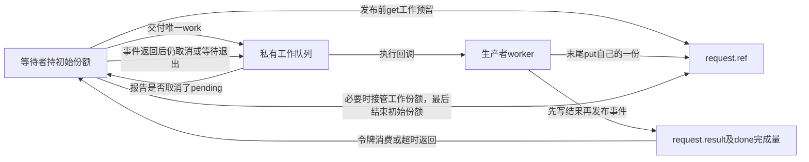
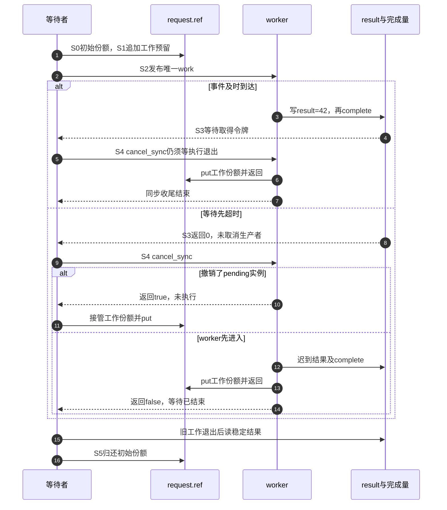

# 第22章\_完成事件与等待者工程模板

上一章处理到期执行或取消。现在调用者还要等待一份结果：生产者写入结果，通过completion通知等待者。通知解决“结果什么时候可读”，kref解决“读取所用的对象还在不在”，工作退出解决“生产者是否已经离开”。三项保证往往在不同时间成立。

本章沿[P07完成事件实例](P07_handoff_所有权转移模型.md#7.3.5_completion_场景里的引用归属)重新检查工程接口的输入、输出和扩展条件，使用同一完整材料。这里只支持一个等待者、一个生产者、一次结果发布；多等待者和重复使用放在已经理解单轮责任以后比较。

## 22.1\_等待之前先取得合法对象

原模板在my_request_wait入口直接kref_get，看起来给等待者加了保护，却没有说明参数从哪里来。如果调用者拿到的只是可能过期的裸指针，读取req->ref本身就可能无效。引用获取不能追溯性地修复进入函数之前的地址失效。

先选择输入契约。若调用者已经拥有一份，并在整个同步等待期间保留它，wait函数可以借用这份；没有必要为每次普通函数调用再get/put。若wait函数需要独立保存对象或跨越调用者结束的时刻，则应在合法输入窗口内取得自己的份额，并规定由哪条成功、超时或取消路径归还。若参数来自索引，必须先完成[P08查找取得窗口](P08_lookup_场景与_kref_get_unless_zero%28%29.md#8.3.1_正确模型一_mutex/list_lookup_+_kref_get%28%29)，再谈等待。

下面的完整模块选择第一种输入来源：等待者亲自创建请求，初始份额一直属于它。投递前另外给生产者预留一份。worker可以先结束，等待者仍有资格查看结果；等待者先超时，worker也仍有自己的资格访问对象。但这不表示等待者可以超时就卸载模块代码或销毁队列。

| 保存位置 | 本轮作用与读写者 | 不承担的保证 |
| --- | --- | --- |
| request.ref | 等待者建立初始份额，预留worker一份，各自结算 | 不发布业务结果，也不取消工作 |
| request.result | 唯一worker写42；等待者在同步收尾后读 | 初值0不能作为工作已结束的证据 |
| request.done.done及wait | complete发布令牌，wait等待或消费；完成量内部锁串行化 | 不增加或归还对象引用 |
| request.work及工作队列内部状态 | 投递、执行与cancel路径管理 | 完成事件不是worker返回事件 |



## 22.2\_一轮请求有两个不同的完成时刻

继续用P07的S0～S5，不因换成模板重新发明状态阶段：S0创建请求和队列，S1预留worker份额，S2发布唯一工作，S3等待事件或超时，S4同步收尾并结算工作份额，S5等待者归还初始份额。

S3可以先于worker尾部put，甚至先于complete函数返回；被唤醒线程不需要等生产者执行完剩下所有指令才能调度。因此“等到了事件”只能沿事件契约解释，不能把S4省掉后就卸载正在执行的代码。S3超时更弱：它只结束这次等待，不对worker发出取消命令。超时后紧接着就可能产生结果。



图中的等待线表示cancel_work_sync的职责，不意味着wait本身调用了cancel。这里能由cancel返回true确定待归还的那一份，是因为只有一次已接受的work，没有重排或竞争生产者。若模型允许重复提交，须先按[P20实例责任](P20_工作交付与关闭工程模板.md#20.4_重复投递与取消需要逐实例责任)重新建立对应关系。

## 22.3\_完整请求的执行与观察

下面完整保留[note_kref_completion.c](../../../../labs/kernel/object_lifetime/materials/note_kref_completion.c)。它在初始化函数中完成本轮请求，退出函数只打印外部release计数。每一步都能在S0～S5中定位：分配失败尚未交付；投递拒绝回滚预留与等待者两份；投递成功后无论等待结果怎样，都先执行S4，再进入S5。

```c
// SPDX-License-Identifier: GPL-2.0
#include <linux/completion.h>
#include <linux/errno.h>
#include <linux/kref.h>
#include <linux/module.h>
#include <linux/slab.h>
#include <linux/workqueue.h>

struct handoff_request {
    int result;
    struct kref ref;
    struct work_struct work;
    struct completion done;
};

static unsigned int release_calls;

static void handoff_release(struct kref *ref)
{
    struct handoff_request *request = container_of(ref, struct handoff_request, ref);
    ++release_calls; /* 最后归还安排在等待者，观察量位于对象之外。 */
    kfree(request);
}

static void handoff_worker(struct work_struct *work)
{
    struct handoff_request *request = container_of(work, struct handoff_request, work);
    request->result = 42;
    complete(&request->done); /* 发布结果事件，不交还对象引用。 */
    kref_put(&request->ref, handoff_release);
}

static int __init note_handoff_init(void)
{
    struct workqueue_struct *queue;
    struct handoff_request *request;
    unsigned long remaining;
    bool canceled;

    queue = alloc_ordered_workqueue("note_handoff", 0);
    if (!queue)
        return -ENOMEM;
    request = kzalloc(sizeof(*request), GFP_KERNEL);
    if (!request) {
        destroy_workqueue(queue);
        return -ENOMEM;
    }
    kref_init(&request->ref); /* 初始份额属于等待者。 */
    init_completion(&request->done);
    INIT_WORK(&request->work, handoff_worker);
    kref_get(&request->ref); /* 唯一工作实例在发布前预留一份。 */
    if (!queue_work(queue, &request->work)) {
        kref_put(&request->ref, handoff_release); /* 退回未接收的预留。 */
        kref_put(&request->ref, handoff_release); /* 结束等待者责任。 */
        destroy_workqueue(queue);
        return -EIO;
    }

    remaining = wait_for_completion_timeout(&request->done, 1);
    /* 一次投递，无重新排队；等待事件成功也不等于 worker 已返回。 */
    canceled = cancel_work_sync(&request->work);
    if (canceled)
        kref_put(&request->ref, handoff_release); /* 接管未执行实例的一份。 */
    destroy_workqueue(queue); /* 代码卸载前已无 worker 执行。 */
    pr_info("note_handoff: completed_in_time=%d canceled=%d result=%d\n",
            remaining != 0, canceled, request->result);
    kref_put(&request->ref, handoff_release); /* 最后放弃等待者的一份。 */
    return 0;
}

static void __exit note_handoff_exit(void)
{
    pr_info("note_handoff: release=%u\n", release_calls);
}

module_init(note_handoff_init);
module_exit(note_handoff_exit);
MODULE_LICENSE("GPL");
MODULE_DESCRIPTION("完成事件与异步对象引用分别退出的完整实验");
```

为什么不再添加原模板中的completed布尔量与mutex？这个模块只有一个生产者写一次result，发布后不再修改；等待者在同步收尾以后读取，既无其他写者，也不会与旧worker并发访问。额外的completed字段如果没人用来控制单次发布，就只是另一个可能被误读的快照。若增加并发写者或结果更新，应先设计串行化规则，再决定增加哪些状态和锁。

程序不把result=0当业务成功；它只是kzalloc留下的初值。cancel确实撤销了唯一工作时，result保持0。正式业务应给“已取消”“业务失败”“成功结果”分别定义返回协议，不能依靠一个恰好为零的字段猜测发生了哪条路径。

按[P16构建步骤](P16_对象创建与失败清理模板.md#%282%29_构建_预测和观察)生成模块后，在匹配内核中运行：

```bash
sudo insmod ./note_kref_completion.ko
sudo rmmod note_kref_completion
sudo dmesg | tail -n 12
```

等待参数1是一个jiffy，即一个内核节拍的等待预算，不是固定1毫秒。可见结果如下，三行都是合法执行：

| completed_in_time | canceled | result | 谁归还工作份额 |
| --- | --- | --- | --- |
| 1 | 0 | 42 | worker；完成令牌已被等待者取得 |
| 0 | 1 | 0 | 取消者；唯一pending工作没有执行 |
| 0 | 0 | 42 | worker；等待已超时，工作仍在收尾前执行 |

每种路径最终release=1。不是所有实际运行都能稳定触发所有分支；增加等待时间通常让及时完成更容易出现，但不是分支覆盖证明。已有七组宿主检查通过两项分配失败、拒绝发布、早完成、等待中完成、超时取消和迟到完成，且已有ARM前端核对；本批逐字复用程序和已审查的夹具，没有新行为，不重复声称执行了一次目标验证。真实等待、目标装卸、软硬件并发与内存序仍未运行。

## 22.4\_扩展到多个等待者之前

原模板使用complete_all，说明它想允许多个等待者，但没有给它们各自的输入资格和生产者的一次发布规则。complete与complete_all并非同一接口换个名字：普通完成令牌会被成功等待消费；广播完成在固定实现中进入饱和完成状态，后来的等待也可以通过，直到调用者安排重初始化。

固定证据先进入[等待与完成量总索引](../../../../research/source_reading/waiting_notification/navigation/P01_Linux_6.12_等待与完成量源码总阅读索引.md#1.5_建议阅读顺序)，再读[完成量状态所有权](../../../../research/source_reading/waiting_notification/navigation/P03_Linux_6.12_completion模块源码概念导读.md#3.2_状态所有权)。具体状态见[对象与初始化](../../../../research/source_reading/waiting_notification/source_explanations/P02_Linux_6.12_completion_c令牌与等待源码实现.md#2.3_completion对象与初始化)、[等待消费](../../../../research/source_reading/waiting_notification/source_explanations/P02_Linux_6.12_completion_c令牌与等待源码实现.md#2.4_do_wait_for_common等待与消费)和[广播完成](../../../../research/source_reading/waiting_notification/source_explanations/P02_Linux_6.12_completion_c令牌与等待源码实现.md#2.5_complete_all发布永久完成)。这些接口操作完成量，不知道request.ref由谁拥有。

若希望所有等待者读取同一份不可变结果，可以在发布前为每个独立等待者建立合法资格，生产者写一次结果后complete_all；每个等待者结束时归还自己的份额，生产者另结束自己的份额。若等待者只在管理者确定覆盖的窗口内借用，则无需机械地每人get，但必须证明管理者不会提前离开。广播本身不能替代这个证明。

同时只能有一次结果定稿。如果两个完成路径分别写status再complete_all，即使mutex让每次写入不发生数据竞争，先后醒来的等待者仍可能得到不同业务结果。若要求“第一结果决定本轮”，应在同一业务锁内检查尚未完成、写结果、置完成标志；失败的后到发布者不得改写该轮结果。发布者应一直持有资格到通知调用返回，等待者也必须已经安排好自己的地址期限。原模板的completed仅赋true而从未检查，并不具备这种单次发布保证。

重新开始下一轮还需要更强的条件：旧生产者不会再通知，旧等待者已经离开或明确切换了请求代次，旧结果不会被迟到读者误认成新结果。reinit_completion只重置完成状态，不等待这些参与者。对低频独立请求，直接创建新对象通常使代次、结果和责任天然分开，代价是分配；高频复用只有在这些成本确实重要并具备完整代次协议时才值得引入。

## 22.5\_用反例检查接口契约

先把完整程序的cancel_work_sync移到等待超时分支，及时完成分支直接destroy_workqueue。这个特定无重排例子中，destroy_workqueue仍会等待队列工作退出，因此仍存在S4；不能只按是否调用了cancel判对错。但若连销毁等待也删除，并立即允许代码卸载，completion并不保证worker已返回。应寻找实际提供退出保证的操作。

再把result读取移到超时返回之后、同步收尾之前。即使等待者仍有引用，worker也可能正在写result；“对象还在”不保证字段没有数据竞争。应等明确的结果发布成功，或像本例一样等生产者退出，再读取相应字段。

最后增加第二个waiter，仍只调用一次complete。一个普通完成令牌不能承诺两个waiter都得到成功事件；必须选择按次数发令牌，或根据“所有人观察同一最终结果”的业务语义采用广播。无论选择什么，增加等待者数量都不能凭空增加对象引用，也不能让其中一人替别人put。

现在可以给等待接口写出完整契约：输入如何有效、是否保留或消费调用者份额、结果发布几次、超时取消谁负责、生产者何时真正退出。下一单元把这些责任放入初始化失败与多阶段回滚，避免把goto标签数量当作正确性证明。

专题导航：[kref工程模板路线](大纲.md#1.14_工程模板)。

上一篇：[定时器交付与关闭](P21_定时器交付与同步关闭模板.md#21.1_先把排队状态与对象责任分开)。

下一篇：[返回错误路径回滚](P13_工程模板.md#13.5.4_模板九_error_path_回滚模板)。
