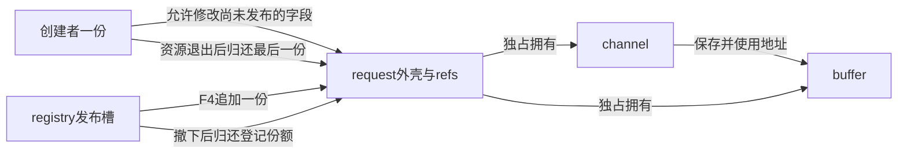
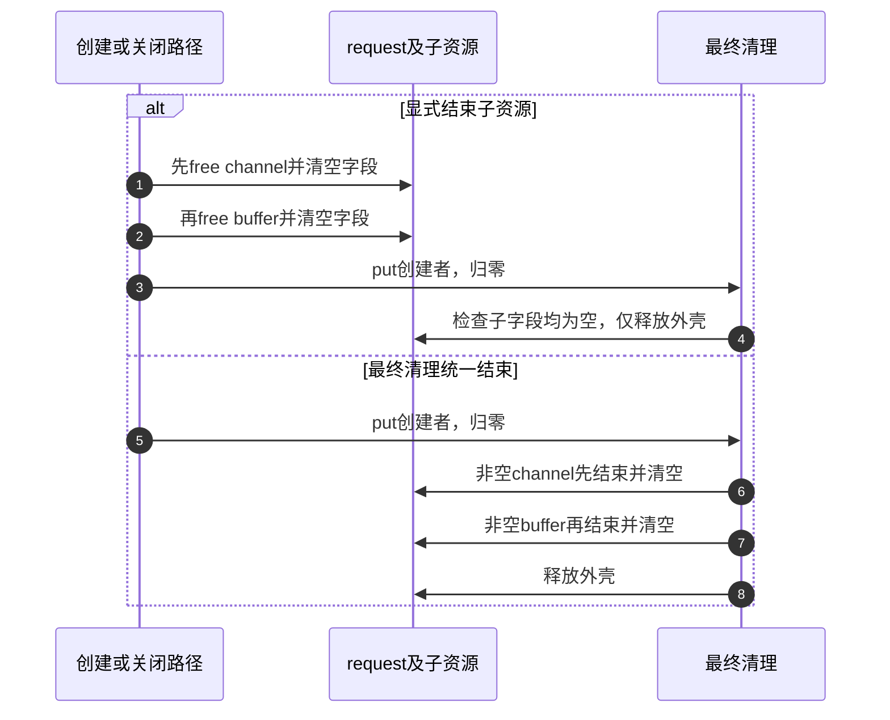

# 第23章\_分阶段失败与资源回滚模板

前几篇已经把创建者、集合、工作和等待者的一份责任分开。现在让初始化在中途失败：对象可能已经有缓冲区，还没有后续资源；也可能已经发布，但下一步启动没有成功。错误路径必须结束已经成立的责任，不能对尚未取得的资源清理，也不能把已经交付给别人的份额当作创建者的一份反复put。

原模板提出两种安排：错误标签逐级释放，或最后release统一处理半初始化对象。这两个思路都有价值，但选择依据应是资源依赖、清理上下文和责任转移，不能只按对象大小或标签数量决定。尤其不能在错误路径free(buffer)，又让最后release对同一非空buffer再free一次。

## 23.1\_先列出失败时已经成立的责任

先用一个有具体依赖的对象建立模型：request拥有一段buffer，channel保存指向这段buffer的指针，registry是额外持有一份引用的发布槽。channel只是本程序分配的C结构，不代表已经验证了任何硬件句柄或驱动API。我们能直接检查的是堆分配、责任数和清理顺序。

| 阶段 | 新建立的资源或责任 | 此时失败要结束什么 |
| --- | --- | --- |
| F0 尚未分配 | 无对象 | 返回失败，没有对象可put |
| F1 外壳建立 | 创建者一份；子指针均为NULL | 归还创建者，释放外壳 |
| F2 缓冲区建立 | 对象拥有buffer | 先结束buffer，再释放外壳 |
| F3 通道建立 | channel保存buffer地址 | 先结束channel，再buffer，再外壳 |
| F4 发布 | registry额外持有一份；创建者仍有一份 | 先撤下登记份额，再处理剩余资源和创建者 |
| F5 成功返回 | 调用者接过创建者的一份 | 正常关闭也须配对结束这些责任 |

F4是一个重要分界。未发布时，创建者可以证明自己独占半初始化状态；发布后，真实系统可能已经出现查找者和异步借用者。撤下只能阻止以后经该入口进入的人，不能让已有读者消失。本章顺序模型特意没有那些参与者，用于观察份额配对；实际驱动若在发布后继续可能失败的启动步骤，必须额外撤销可见性、关闭生产者并排空已进入的活动，才能结束它们会访问的资源。



因为channel依赖buffer，清理必须先让channel不再使用buffer，再释放buffer。这里恰好是初始化的逆序，但理由是依赖关系，不是“所有对象都必须把源码顺序倒过来”。比如设备可能需要在停止DMA之前保持中断处理可用来报告停止完成；另一设备可能必须先屏蔽新中断再等待旧处理退出。未给出硬件协议时不能用一个cleanup_hw名字虚构统一答案。

## 23.2\_显式清理与最终清理怎样配合

沿同一个F3失败点比较。方案A由错误路径先结束channel和buffer，再put创建者。方案B错误路径只put，最终清理依据非空字段结束子资源。两者都必须保证一项资源只被清理一次。



方案A不是“release永远只收到完整对象”。F1和F2失败时同样会通过put触发release；所以release必须与错误路径约定哪些字段可能尚未建立、已经结束，不能只为成功对象编写。也不一定需要额外inited标志：独占拥有的指针可以用NULL表达未取得或已归还；硬件使能、注册关系等无法由指针表达的状态才需要另外记录，并且只在操作实际成功后改变。

下面用同一个dispose_parts收束子资源，清理后清空指针。显式路径调用它后，最终清理仍能安全检查空字段。这是经过定义的分工，不是两边都以为自己拥有同一资源。清空字段也不是并发屏障；如果另一个线程早已复制了旧buffer地址，写NULL不能让那个读者失去访问能力。因此显式清理必须发生在读者已经退出的期限内。

## 23.3\_完整C程序比较十二条退出路径

材料[rollback_ownership.c](../../../../labs/kernel/object_lifetime/materials/rollback_ownership.c)直接使用C11和标准库。cleanup_policy枚举中，EXPLICIT_PARTS选择显式结束子资源，FINAL_PARTS选择最后归还时结束子资源。两种policy各运行正常关闭和五个失败阶段；refs是顺序责任账本，不实现Linux kref、原子或并发内存序。registry也只模拟一个拥有型槽，不是Linux注册API。

```c
// SPDX-License-Identifier: GPL-2.0
#include <assert.h>
#include <stdbool.h>
#include <stdio.h>
#include <stdlib.h>

/* 顺序教学模型：refs不是Linux原子kref，channel不是硬件句柄。 */
struct channel { char *buffer; };
struct request {
    unsigned int refs;
    char *buffer;
    struct channel *channel;
};
enum cleanup_policy { EXPLICIT_PARTS, FINAL_PARTS };
static struct request *registry;
static unsigned int objects, buffers, channels, releases;
static unsigned int tick, channel_end, buffer_end, object_end;

static void dispose_parts(struct request *request)
{
    if (request->channel) {
        assert(request->channel->buffer == request->buffer);
        free(request->channel);
        request->channel = NULL; /* 清空后不再把这项责任留给最终清理。 */
        --channels;
        channel_end = ++tick;
    }
    if (request->buffer) {
        free(request->buffer);
        request->buffer = NULL;
        --buffers;
        buffer_end = ++tick;
    }
}
static void request_get(struct request *request)
{
    assert(request && request->refs);
    ++request->refs;
}
static void request_put(struct request *request)
{
    assert(request && request->refs);
    if (--request->refs)
        return;
    assert(registry != request); /* 发布份额必须先被真正撤下。 */
    dispose_parts(request);
    ++releases;
    --objects;
    object_end = ++tick;
    free(request);
}
static void publish(struct request *request)
{
    assert(!registry && request->buffer && request->channel);
    request_get(request); /* 登记槽额外拥有一份，创建者仍保留原份额。 */
    registry = request;
}
static bool unpublish(struct request *request)
{
    /* 调用者始终有自己的有效份额；重复撤下不消费它。 */
    if (registry != request)
        return false;
    registry = NULL;
    request_put(request);
    return true;
}
static void finish_creator(struct request *request, enum cleanup_policy policy)
{
    unpublish(request);
    /* 本顺序模型没有查找者或异步借用者；现实系统必须另行证明排空。 */
    assert(request->refs == 1);
    if (policy == EXPLICIT_PARTS)
        dispose_parts(request);
    request_put(request); /* 最后清理仍检查空字段，不会重复free。 */
}
static struct request *create_request(unsigned int fail_stage,
                                      enum cleanup_policy policy)
{
    struct request *request;
    if (fail_stage == 1)
        return NULL;
    request = calloc(1, sizeof(*request));
    if (!request)
        return NULL;
    ++objects;
    request->refs = 1;
    if (fail_stage == 2)
        goto fail;
    request->buffer = malloc(16);
    if (!request->buffer)
        goto fail;
    ++buffers;
    if (fail_stage == 3)
        goto fail;
    request->channel = malloc(sizeof(*request->channel));
    if (!request->channel)
        goto fail;
    request->channel->buffer = request->buffer;
    ++channels;
    if (fail_stage == 4)
        goto fail;
    publish(request);
    if (fail_stage == 5)
        goto fail; /* 槽已经可见，先撤下其份额，再归还创建者。 */
    return request;
fail:
    finish_creator(request, policy);
    return NULL; /* 失败没有向调用者交付可put的对象。 */
}
int main(void)
{
    for (unsigned int policy = EXPLICIT_PARTS; policy <= FINAL_PARTS; ++policy) {
        for (unsigned int stage = 0; stage <= 5; ++stage) {
            struct request *request;
            assert(!registry && !objects && !buffers && !channels);
            releases = tick = channel_end = buffer_end = object_end = 0;
            request = create_request(stage, (enum cleanup_policy)policy);
            if (stage == 0) {
                assert(request && registry == request && request->refs == 2);
                assert(unpublish(request));
                assert(!unpublish(request) && request->refs == 1);
                finish_creator(request, (enum cleanup_policy)policy);
            } else {
                assert(!request);
            }
            assert(!registry && !objects && !buffers && !channels);
            assert(releases == (stage == 1 ? 0u : 1u));
            if (channel_end)
                assert(buffer_end && channel_end < buffer_end);
            if (buffer_end)
                assert(buffer_end < object_end);
            printf("policy=%u stage=%u releases=%u cleanup=%u/%u/%u\n",
                   policy, stage, releases, channel_end, buffer_end, object_end);
        }
    }
    puts("12 rollback paths passed");
    return 0;
}
```

fail_stage=1在外壳分配前失败；2在buffer前；3在channel前；4在发布前；5在已经发布后。0表示成功创建再正常关闭。计数器objects、buffers和channels记录未归还的分配，releases记录外壳最终清理次数；cleanup三列记录channel、buffer、外壳结束的顺序号，0表示该项从未建立。

```bash
cc -std=c11 -Wall -Wextra -Werror -O2 \
  labs/kernel/object_lifetime/materials/rollback_ownership.c \
  -o /tmp/rollback_ownership
/tmp/rollback_ownership
```

先预测两行：stage=3时buffer已经取得，channel还没建立，应看到cleanup=0/1/2；stage=5时登记份额已建立，必须先撤下，所以最后仍然只release一次，cleanup=1/2/3。两个policy应给出相同最终结果，而清理发生在哪一层不同。

本批宿主C11严格警告构建通过，十二条路径全部通过断言，所有分配和登记归零，依赖顺序成立。真实malloc失败也有返回路径，但本次覆盖是显式阶段故障注入，不是操作系统内存耗尽测试。程序没有线程、内核对象、真实硬件或异步回调，不拿这些结果证明驱动关闭竞争正确。

最后观察main里连续两次unpublish：第一次确实移走槽，归还槽的一份；第二次只返回false，创建者仍有同一份。若为了“确保清干净”每次都put，第二次就会错误消费创建者责任，随后finish_creator再访问对象便越过寿命。

## 23.4\_把模型映射回实际内核模板

[P16完整创建模块](P16_对象创建与失败清理模板.md#16.2.2_模板二_alloc/init/get/put/release_分层模板)已经采用统一最后清理：buffer默认为NULL，失败只put创建者，object_release对NULL或已取得buffer分别处理。它没有发布入口、硬件或异步访问者，因此可以把半初始化回滚集中在那里。这个已经成立的模块保持原样；本章不为了增加第二种风格而改写它。

如果硬件停止、工作队列销毁或其他退出步骤需要特定进程上下文，不能因为release统一处理“代码短”就把这些操作搬进可能由任意最后持有者触发的回调。应在有明确上下文的关闭流程中完成那些步骤，保留对象和必要资源到活动排空，再让release处理剩余外壳或可在相应上下文释放的部分。反过来，若子资源只能在全部读者放弃后释放，提前显式free就不成立，应把其责任保留到最终阶段或用独立生命周期管理。

| 需要回答的约束 | 倾向的安排 | 必须保留的条件 |
| --- | --- | --- |
| 未发布，子资源可在最后put上下文释放 | 最后清理统一处理 | 每个部分初始化状态都有明确表示 |
| 清理需要可睡眠上下文或等待异步活动 | 关闭者先完成相关退出 | 不持回调所需锁等待；保留访问期限 |
| 旧拥有者关闭后仍可读某些字段 | 延后这些字段资源的清理 | 外壳引用与子资源期限相匹配 |
| 已发布后发生失败 | 先撤下真实发布责任并排空受影响活动 | 不把一个错误返回误写成“没人看见过” |

真实发布函数也有两种失败契约：失败时完全未发布，或内部已经发生可见动作并自行回滚。调用者必须核对公开契约和实际实现，不能看到非零返回便无条件unpublish，也不能忽略可能仍活跃的异步步骤。本模型publish不失败，stage=5是下一阶段失败；刻意分开这两种情况，避免拿故障注入标签给真实API编造行为。

普通kref源码只负责归还时是否调用清理，先从[源码总索引](../../../../research/source_reading/kref/navigation/P01_Linux_6.12_kref源码阅读索引.md#1.2_按问题进入已落地证据)进入[创建与清理责任导读](../../../../research/source_reading/kref/navigation/P02_普通引用与归零回调导读.md#2.23_分阶段失败的清理责任)，再核对[初始份额](../../../../research/source_reading/kref/source_explanations/include/linux/kref.h.md#1.2_建立初始引用)和[最后归还](../../../../research/source_reading/kref/source_explanations/include/linux/kref.h.md#1.4_最后归还调用清理)。buffer、channel、硬件、登记份额都不是kref自动识别的资源。

## 23.5\_修改一处再解释后果

第一步删掉dispose_parts中free后的清空字段。方案B只调用一次时可能仍正常，方案A随后进入最终清理会把旧地址再释放一次。错误根源是已经归还的资源仍被记录为当前拥有，不能用“测试某一policy通过”掩盖另一条路径。

第二步删掉finish_creator里的unpublish，只保留put创建者。stage=5时登记槽仍拥有一份，计数不会归零；返回失败并不自动移除已发布对象。失败调用者没有收到对象，也就没有资格替隐藏的登记份额收尾。必须在发布协议所在层结束这项责任。

第三步给模型增加真正的并发查找者，取得对象后继续使用buffer。此时不能沿用refs==1断言作为排空实现，也不能在有旧使用者时直接dispose_parts。需要先决定允许他们在关闭后做什么：若只能归还，必须有操作进入/退出协议排空旧访问；若仍可读取buffer，buffer就要跟随这些份额继续存在。下一单元进入remove、unlink、drain与release的组合，继续回答这个尚未解决的问题。

专题导航：[kref工程模板路线](大纲.md#1.14_工程模板)。

上一篇：[完成事件与等待者](P22_完成事件与等待者工程模板.md#22.1_等待之前先取得合法对象)。

下一篇：[删除入口与活动排空](P24_删除入口与活动排空工程模板.md#24.1_关闭业务不等于回收所有对象)。
