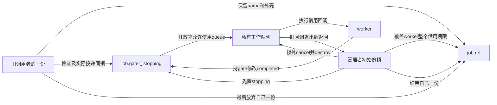
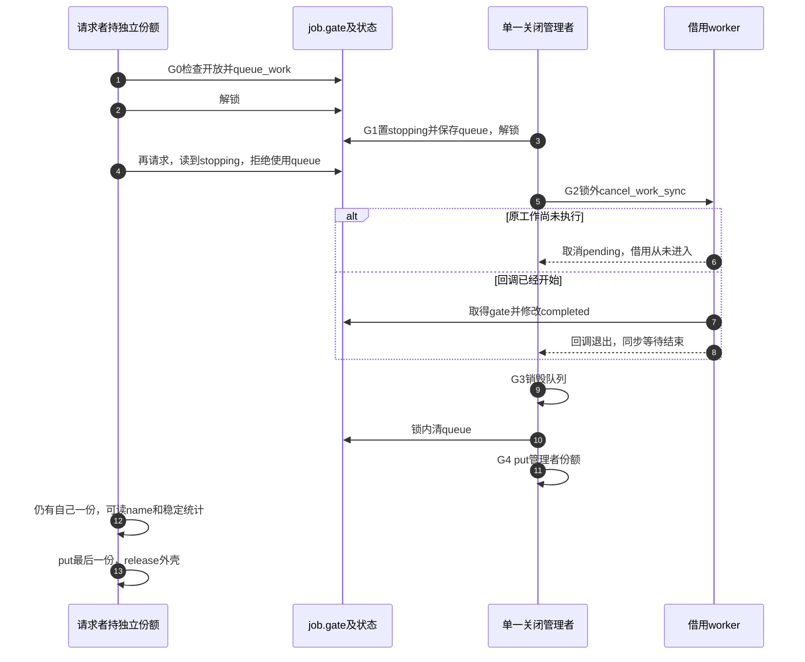

# 第24章\_删除入口与活动排空工程模板

上一章已经看到：发布以后失败，不能只把创建者的一份put掉就离开。正常删除同样如此。对象可能有公开入口、正在执行的业务、排队的回调和持引用的旧用户；这些参与者结束的时刻不同。remove应说明它关闭哪一层、等待哪些活动、归还谁的一份，而不是用一串函数名代替退出证明。

本章先回访一个完整、边界清楚的管理者模块：关门后等待借用worker，销毁队列，归还管理者份额；旧用户还可以读保留下来的名字，随后归还自己的份额。接着增加查找入口和硬件时，逐项指出必须增加的证明，不把未实现的stop_io或drain_queue写成已经存在的通用接口。

## 24.1\_关闭业务不等于回收所有对象

原模板先检查dying、解锁，再让旧用户继续操作。若操作使用硬件或队列，在检查与使用之间，关闭者完全可能取得锁、置dying、销毁资源。用户的kref仍保留外壳，却无法把已经销毁的队列或关闭的硬件恢复出来。问题不是少读了一次布尔值，而是“取得业务许可到结束使用”的区间没有受到保护。

短操作可以把检查和整个资源使用放在同一锁窗口，关闭者取得同锁时就知道旧操作已经退出；已有[P09同步服务](P09_kref_与锁的组合.md#9.2.1_kref_和锁分别保护什么)展示这种安排。若操作需要长期阻塞或等待回调，就不能无条件持锁到结束；必须在锁内登记在途活动，锁外执行，结束时注销并通知等待者，关闭者关门后等待在途数归零。对象引用和在途数解决的是两个问题，不能拿“还有几个kref”替代业务排空条件。

对工作队列，下面的完整模块采用另一种具体兑现：检查stopping和实际queue_work同在gate内；close取得同锁关门以后，未来调用不会再使用queue，已经接受的工作则由cancel_work_sync等待或取消。旧调用者仍保留对象，但只允许看到关闭拒绝以及读取明确保留的字段。

| 资源或状态 | 关闭期间谁负责 | 什么时候才能结束 |
| --- | --- | --- |
| job.gate、stopping、queue字段 | 管理者写stopping，所有请求者持同锁检查；管理者最后清queue | gate和状态跟外壳走，不能先销毁 |
| 私有工作队列 | 管理者拥有 | 先阻止所有生产者，再等旧工作，最后destroy |
| worker借用job的期限 | 管理者初始份额覆盖 | cancel返回且不再有重排来源 |
| job.name与外壳 | 对象的最终清理负责 | 旧用户也放弃份额后 |
| job.completed | worker持gate更新 | 关闭等待以后才作为稳定统计读取 |



## 24.2\_沿同一个关闭周期检查状态

沿[P20管理者模式](P20_工作交付与关闭工程模板.md#20.3_对象份额不能填补关闭后的迟到投递)的G0～G4继续。G0请求者在gate内检查并实际投递；G1管理者持gate写stopping；G2管理者锁外同步取消或等待；G3销毁队列并在gate内清queue；G4归还管理者的一份，之后旧调用者决定外壳何时最终归零。



无论取消返回true还是false，worker都没有独立份额可put。它只是借用。不能把P20分享模式或P21单次定时器中的“取消者接管票据”移植到这里，否则就会误消费管理者或旧调用者的份额。

同样不能把close当成任意次数可调用的幂等接口：本例它消耗管理者初始份额，只由同一个管理者调用一次。一个已经持有普通用户份额的人，并未因此取得消费管理者份额的权利。如果需要多个线程等待同一次关闭，应另设关闭完成事件和管理者选举/串行化协议；后来者看见stopping便返回，不证明第一个关闭者已经完成G2～G4。

## 24.3\_完整管理者模块的资源分层

完整材料[note_kref_owned_work.c](../../../../labs/kernel/object_lifetime/materials/note_kref_owned_work.c)已经在P06建立，这里保留程序，换到删除模板的角度核对各项退出保证。name在release中释放，queue在close中销毁，正是同一对象内两个不同期限。没有外部导出入口、硬件或timer，运行实例不会自行重排；材料也不承诺每个已接受请求必定执行，关闭可以取消pending请求。

```c
// SPDX-License-Identifier: GPL-2.0
#include <linux/errno.h>
#include <linux/kref.h>
#include <linux/module.h>
#include <linux/mutex.h>
#include <linux/slab.h>
#include <linux/workqueue.h>

struct owned_job {
    char *name;
    struct kref ref;
    struct mutex gate;
    struct work_struct work;
    struct workqueue_struct *queue;
    bool stopping;
    unsigned int completed;
};

static unsigned int release_calls; /* 本模块的初始化过程串行读取统计。 */

static void owned_release(struct kref *ref)
{
    struct owned_job *job = container_of(ref, struct owned_job, ref);
    ++release_calls;
    kfree(job->name);
    kfree(job);
}

static void owned_put(struct owned_job *job)
{
    kref_put(&job->ref, owned_release);
}

static void owned_worker(struct work_struct *work)
{
    struct owned_job *job = container_of(work, struct owned_job, work);
    /* 借用由管理者保持到 cancel 返回；worker 没有自己的一份可 put。 */
    mutex_lock(&job->gate);
    ++job->completed;
    mutex_unlock(&job->gate);
}

static struct owned_job *owned_create(void)
{
    struct owned_job *job = kzalloc(sizeof(*job), GFP_KERNEL);
    if (!job)
        return NULL;
    job->name = kstrdup("managed-work", GFP_KERNEL);
    if (!job->name)
        goto free_job;
    job->queue = alloc_ordered_workqueue("note_owned", 0);
    if (!job->queue)
        goto free_name;
    mutex_init(&job->gate);
    INIT_WORK(&job->work, owned_worker);
    kref_init(&job->ref); /* 所有资源就绪后，才建立管理者的初始份额。 */
    return job;

free_name:
    kfree(job->name);
free_job:
    kfree(job);
    return NULL;
}

/* 调用者持独立引用。停止检查与实际排队必须处于同一个锁窗口。 */
static int owned_request(struct owned_job *job)
{
    int result;
    mutex_lock(&job->gate);
    if (job->stopping)
        result = -ESHUTDOWN;
    else
        result = queue_work(job->queue, &job->work) ? 0 : -EBUSY;
    mutex_unlock(&job->gate);
    return result;
}

/* 仅管理者调用一次；消耗初始份额。必须可睡眠且不能从本 work 调用。 */
static void owned_close(struct owned_job *job)
{
    struct workqueue_struct *queue;
    mutex_lock(&job->gate);
    job->stopping = true;
    queue = job->queue;
    mutex_unlock(&job->gate);

    /* 先关入口，再在锁外等 worker；无重排和其他生产者。 */
    cancel_work_sync(&job->work);
    destroy_workqueue(queue);
    mutex_lock(&job->gate);
    job->queue = NULL;
    mutex_unlock(&job->gate);
    owned_put(job); /* 此后关闭者不再访问 job。 */
}

static int __init note_owned_init(void)
{
    struct owned_job *job = owned_create();
    int submitted, after_close;
    if (!job)
        return -ENOMEM;

    kref_get(&job->ref); /* 模拟一个调用者，关闭后仍须归还这一份。 */
    submitted = owned_request(job);
    owned_close(job); /* 此后只凭调用者份额保留对象。 */
    after_close = owned_request(job);
    /* 已无 worker 写 completed；调用者的一份保护 name 和外壳。 */
    pr_info("note_owned: %s submit=%d closed=%d completed=%u\n",
            job->name, submitted, after_close, job->completed);
    owned_put(job);
    return submitted ? submitted : after_close == -ESHUTDOWN ? 0 : -EIO;
}

static void __exit note_owned_exit(void)
{
    pr_info("note_owned: release=%u\n", release_calls);
}

module_init(note_owned_init);
module_exit(note_owned_exit);
MODULE_LICENSE("GPL");
MODULE_DESCRIPTION("管理者保活并等待借用工作退出的完整实验");
```

创建失败也没有混淆：owned_create在name和queue都就绪以后才kref_init，因此早期失败用独占分配回滚；建立管理者份额并交付之后，按close和put协议退出。这与P23“先建立引用再由release处理部分初始化”同样可以成立，关键是阶段分界清楚，不能对尚未kref_init的对象随意put。

owned_request收到关闭时，先检查stopping再触碰queue。因此在G3销毁队列到锁内清queue之间，字段里虽然暂存旧地址，后来请求也不会解引用它；这个安全性依赖所有入口遵守同一检查顺序，不能把裸queue返回给调用者长期保存。

按[P16构建步骤](P16_对象创建与失败清理模板.md#%282%29_构建_预测和观察)生成模块，在匹配内核中观察：

```bash
sudo insmod ./note_kref_owned_work.ko
sudo rmmod note_kref_owned_work
sudo dmesg | tail -n 12
```

预测输出submit=0，closed=-ESHUTDOWN，name仍为managed-work，completed可能为0或1，release=1。completed=0表示pending被取消，不表示泄漏；name还能读取，是因为旧调用者的一份保留了对应资源，不是因为关闭函数“通常不会太快释放”。

本批逐字复核完整程序和既有九组宿主夹具：三处分配失败、两种模块执行顺序、两种关闭窗口、连续工作和管理者最后退出。材料无行为变化，已有ARM前端354头/342非生成源码固定差异检查保持；本批不重跑、不将历史记录称为新的目标实测。真实线程阻塞、目标链接装卸、ARM内存序和硬件仍未验证。

## 24.4\_增加发布入口时先分清两份责任

原remove片段从list摘链后无条件put“发布者初始引用”，但此前没有说明发布究竟转交了初始份额，还是另外get了一份。先选一种契约：若像[P09单槽服务](P09_kref_与锁的组合.md#9.2.1_kref_和锁分别保护什么)转交初始份额，撤下者接管同一份；若像[P17拥有型链表](P17_拥有型链表工程模板.md#17.1_拥有型链表的发布与撤下)追加集合份额，撤下只消费集合的一份，管理者仍须单独结束自己的一份。两者不能只因都叫publish就混用。

在P24管理者模块上增加拥有型索引，管理者需要另外保留初始份额覆盖关闭，而索引可额外持一份覆盖可见期。一个合理的组合要明确：谁持管理者份额调用close，谁实际移除条目并拿走集合份额，已取得的用户进入业务时怎样检查门，哪些资源在close返回前结束，哪些随旧用户继续存在。P17已经给出重复撤下的removed判定：只有真正移除才归还集合份额；list_del_init本身不替你判断管理者是否还拥有另一份。

关业务门与摘入口的相对顺序取决于承诺的截止点。先关门后摘入口，间隙中的查找可能取得对象，但业务入口会拒绝；先摘入口后关门，旧用户在业务门关闭前可能仍执行一个操作。两种方案都必须准确声明“从哪个时刻起不再接受业务”，并在相应资源销毁前排空旧活动，不能把摘链瞬间偷换成所有活动停止。

## 24.5\_增加硬件和其他异步来源时

原流程在取消timer/work之后才写“阻止新IO”。如果IO完成或中断还能投递work，刚完成的cancel就会被后来的投递越过。必须先枚举全部生产者及其关闭路径：用户请求、定时器、工作回调、中断、硬件完成、其他注册回调。不是每项都需要出现在每个对象里；不存在的来源不要为了模板外观添加字段。

在本例，G1同锁关闭全部实际queue_work入口，所以G2的等待是有效的。若加入timer/work相互启动，沿[P06最终关闭](P06_release_回调与复杂销毁模式.md#6.7.4_release_不应该负责模糊的_timer_语义)先停外部生产者、最终shutdown timer，再排空派生work，并保持对象到两个系统都结束。若加入硬件，先根据实际中断、DMA及设备停止协议确定源头停止和在途操作结束的顺序；本章没有核对一块具体设备，不能给出虚构的通用stop_io实现。

对脱锁执行的业务，可以用下列状态约束审查实现：入口在同一gate内检查关闭门并登记active，退出路径在最后资源访问后减少active，关闭者置门后等待active归零，最后一个退出者通过等待原语通知它。关闭检查、登记与等待条件要按相同协议串行化，避免关门看见零以后又出现迟到登记。这里active不是引用数：对象可能仍有十个不再访问硬件的用户，也可能只有一个管理者引用却借用了多条活动。具体实现与其等待条件须另行验证，不能把这组约束当作已经运行的硬件排空程序。

固定工作退出证据从[工作队列总索引](../../../../research/source_reading/workqueue/navigation/P01_Linux_6.12_工作队列源码总阅读索引.md#1.6_建议阅读顺序)进入[取消模块](../../../../research/source_reading/workqueue/navigation/P04_Linux_6.12_flush取消与生命周期模块源码概念导读.md#4.4_cancel调用链)，再核对[同步取消实现](../../../../research/source_reading/workqueue/source_explanations/P03_Linux_6.12_worker_flush与取消源码实现.md#3.5_cancel_work_sync撤销与等待)。kref组合从[本专题源码索引](../../../../research/source_reading/kref/navigation/P01_Linux_6.12_kref源码阅读索引.md#1.2_按问题进入已落地证据)进入[借用退出导读](../../../../research/source_reading/kref/navigation/P02_普通引用与归零回调导读.md#2.11_借用退出与最后归还)，不重复工作队列函数体。

## 24.6\_检查一个关闭方案是否成立

先把owned_close最后的put移到cancel之前。当前模块还恰好有用户份额时可能暂不归零；换成没有用户的合法场景，管理者一放弃，对象和嵌入work便可能被释放，同步取消将使用失效地址。管理者必须把自己的责任覆盖到最后一次借用退出。

再把owned_request改成持gate检查、解锁、queue_work。G1可以落在这两步之间，关闭者等待到一个暂时空的队列并销毁它，迟到请求随后使用失效queue。保留job引用也无济于事。正确保护窗口必须覆盖实际提交动作。

最后在release中加WARN_ON(timer_pending(...))或WARN_ON(!list_empty(...))，能否替代退出？不能。观察无pending不说明回调没运行，WARN也通常继续执行；没有一个断言替你关门、摘链或等待。断言只能检查已经定义且在该时点有意义的不变量，不能充当漏掉的同步步骤。

现在可以分别解释入口、业务活动、异步执行、子资源和外壳的退出。下一单元加入RCU查找的地址保护窗口，还要核对旧读者看见的节点在什么时候才能回收。

专题导航：[kref工程模板路线](大纲.md#1.14_工程模板)。

上一篇：[分阶段失败与回滚](P23_分阶段失败与资源回滚模板.md#23.1_先列出失败时已经成立的责任)。

下一篇：[返回RCU查找模板](P13_工程模板.md#13.6.2_模板十一_RCU_lookup_+_kref_get_unless_zero_+_kfree_rcu)。
