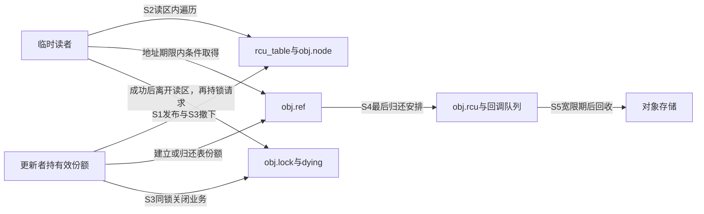
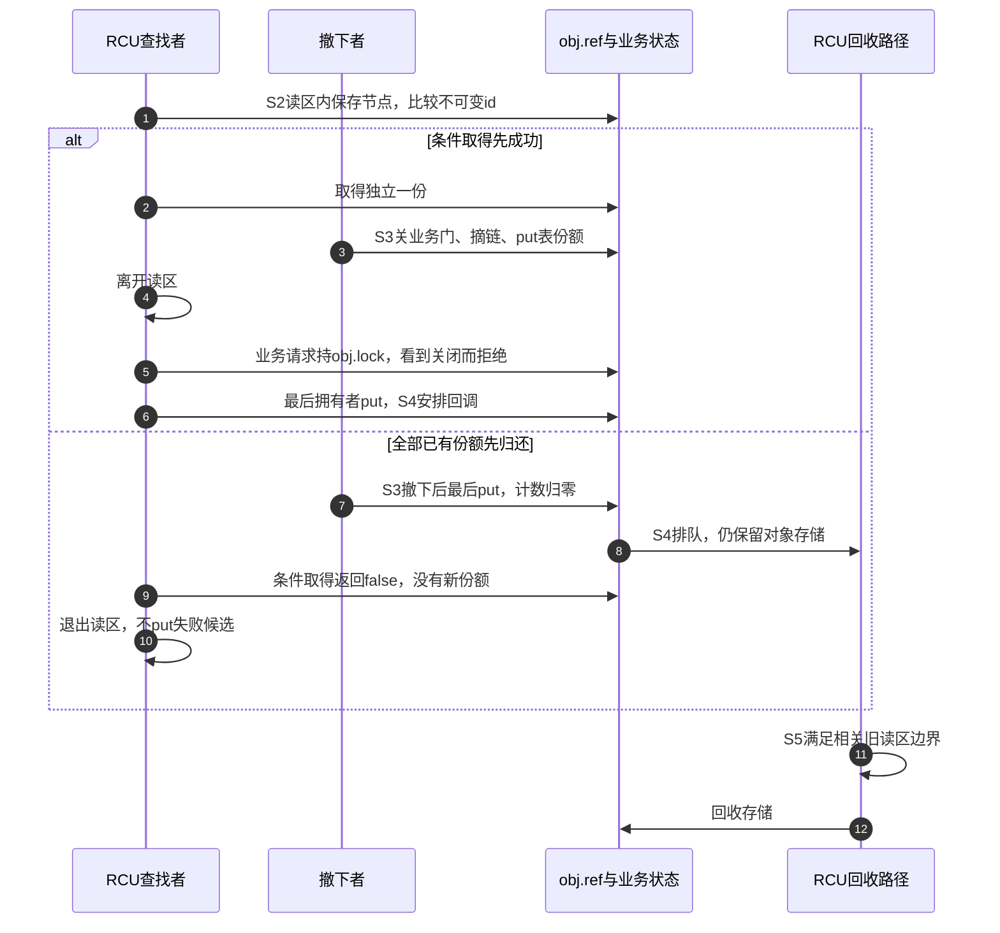

# 第25章\_RCU查找与业务关闭工程模板

删除模板已经区分入口、业务和外壳。若查找不再持集合锁，读者可能在入口撤下以前保存了节点地址，直到撤下以后才尝试取得引用。对象的存储期限必须覆盖这段临时访问，取得成功后才能靠新份额离开读区。

这里沿P10已经建立的“先归零、再等待宽限期”协议组织工程模板：发布额外建立表份额，撤下立即归还这份，最后put安排RCU延迟回收。因此旧读者可能看见仍可访问却已经零计数的对象，条件取得才有必要。不能由此推广成“使用RCU就只能get_unless_zero”；若退休份额一直保留到相关宽限期后，正计数来源又不同。

## 25.1\_同一对象上有三组独立状态

原模板有dying和链表节点，却没有写明publish是否持有一份，以及remove到底归还谁的一份。完整模块把这些责任明确落到状态上：linked表示当前是否发布，ever_published表示是否曾经使用过这个节点身份，dying表示业务关闭。三者都不是引用数的别名。

| 存储位置 | 谁写、谁读 | 解决的缺口 |
| --- | --- | --- |
| rcu_table和obj.node | 更新者持update_lock发布或摘链；读者在RCU读区遍历 | 定位地址；摘链不抹掉旧读者本地指针 |
| linked、ever_published | 更新者持update_lock检查和修改 | 防止重复摘链归还、重复插入仍可能被旧读者使用的节点 |
| obj.ref | 创建者、表和成功读者按份额增加/归还 | 允许取得成功者离开读区继续持有外壳 |
| obj.id | 发布前初始化，以后不变 | 临时读者在取得引用前有权用于查找匹配 |
| obj.lock、dying、completed | 业务请求与关闭者持对象锁串行化 | 检查关闭与整个同步操作处于同一窗口 |
| obj.rcu及回调队列 | 最后put安排回调，RCU后端在所需边界后执行 | 保留旧临时读者仍需访问的存储 |



业务检查不放进lookup的承诺。lookup返回有引用对象以后，关闭可以立即发生；调用者必须在实际object_request中重新经过业务门。原模板在lookup中检查一次dying，解锁后调用未定义do_something，不能证明后续资源访问仍被允许。

## 25.2\_取得成功与失败各走哪条时间线

保持P10的S0～S5：私有创建、发布、读者取得、撤下、归零、宽限期后回收。S2与S3可以交错；它们不是所有线程共同依次执行的线性程序。



条件失败不是“先取得一份又退回”，因此不能在false分支put。成功也不是“对象还在表里”或“业务保持开放”；它只按当前协议建立对象的一份。失败分支仍能读取计数，是因为回收协议保证地址到读区结束仍有效，不是因为get_unless_zero能检测任意野指针。

## 25.3\_完整发布与撤下模块

完整[note_kref_rcu.c](../../../../labs/kernel/object_lifetime/materials/note_kref_rcu.c)沿用P10已讲清的程序。发布成功另外get表份额，失败保留调用者份额；unpublish要求调用者另持一份，只有确实摘下才put表份额，重复撤下不会多消费。业务mutex只在普通RCU读区以外取得。

```c
// SPDX-License-Identifier: GPL-2.0
#include <linux/errno.h>
#include <linux/kref.h>
#include <linux/module.h>
#include <linux/mutex.h>
#include <linux/rculist.h>
#include <linux/slab.h>

struct rcu_object {
    struct kref ref;
    struct rcu_head rcu;
    struct list_head node;
    struct mutex lock; /* 保护dying与completed；读区外使用。 */
    int id; /* 发布前固定，旧读者可以在读区内比较。 */
    bool linked, ever_published; /* 仅由update_lock保护。 */
    bool dying;
    unsigned int completed;
};
static LIST_HEAD(rcu_table);
static DEFINE_MUTEX(update_lock);
static atomic_t free_calls = ATOMIC_INIT(0);

static void object_rcu_free(struct rcu_head *head)
{
    struct rcu_object *obj = container_of(head, struct rcu_object, rcu);
    atomic_inc(&free_calls);
    kfree(obj); /* 回调不睡眠；旧临时读者已经越过所需边界。 */
}

static void object_release(struct kref *ref)
{
    struct rcu_object *obj = container_of(ref, struct rcu_object, ref);
    WARN_ON(obj->linked);
    call_rcu(&obj->rcu, object_rcu_free); /* 私有失败对象也走同一回收出口。 */
}

static void object_put(struct rcu_object *obj)
{
    if (obj)
        kref_put(&obj->ref, object_release);
}

static struct rcu_object *object_create(int id)
{
    struct rcu_object *obj = kzalloc(sizeof(*obj), GFP_KERNEL);
    if (!obj)
        return NULL;
    obj->id = id;
    obj->dying = true; /* 私有对象尚不接纳请求。 */
    INIT_LIST_HEAD(&obj->node);
    mutex_init(&obj->lock);
    kref_init(&obj->ref);
    return obj;
}

/* 调用者保留自己的份额；成功另外建立表份额，失败不消费。 */
static int object_publish(struct rcu_object *obj)
{
    struct rcu_object *candidate;
    int result = -EINVAL;
    mutex_lock(&update_lock);
    if (obj->ever_published)
        goto out;
    list_for_each_entry(candidate, &rcu_table, node) {
        if (candidate->id == obj->id) {
            result = -EEXIST;
            goto out;
        }
    }
    mutex_lock(&obj->lock);
    obj->dying = false;
    kref_get(&obj->ref);
    obj->linked = obj->ever_published = true;
    list_add_rcu(&obj->node, &rcu_table);
    mutex_unlock(&obj->lock);
    result = 0;
out:
    mutex_unlock(&update_lock);
    return result;
}

/* 只取得存储的长期份额；不承诺后续业务请求仍会被接纳。 */
static struct rcu_object *object_lookup(int id)
{
    struct rcu_object *obj, *found = NULL;
    rcu_read_lock();
    list_for_each_entry_rcu(obj, &rcu_table, node) {
        if (obj->id == id) {
            if (kref_get_unless_zero(&obj->ref))
                found = obj;
            break;
        }
    }
    rcu_read_unlock();
    return found;
}

static int object_request(struct rcu_object *obj, unsigned int *completed)
{
    int result = -ESHUTDOWN;
    mutex_lock(&obj->lock); /* 调用者持有引用，且已经离开普通RCU读区。 */
    if (!obj->dying) {
        *completed = ++obj->completed;
        result = 0;
    }
    mutex_unlock(&obj->lock);
    return result;
}

/* 调用者另持一份；先update_lock再对象锁，只有本次摘下才归还表份额。 */
static void object_unpublish(struct rcu_object *obj)
{
    bool removed = false;
    mutex_lock(&update_lock);
    mutex_lock(&obj->lock);
    if (obj->linked) {
        obj->dying = true;
        list_del_rcu(&obj->node); /* 不清空next，旧读者可能仍沿它遍历。 */
        obj->linked = false;
        removed = true;
    }
    mutex_unlock(&obj->lock);
    mutex_unlock(&update_lock);
    if (removed)
        object_put(obj);
}

static int __init note_rcu_init(void)
{
    struct rcu_object *creator = object_create(7), *reader;
    unsigned int completed = 0;
    int result;
    if (!creator)
        return -ENOMEM;
    result = object_publish(creator);
    if (result) {
        object_put(creator);
        rcu_barrier(); /* 初始化失败也不能留下指向本模块代码的回调。 */
        return result;
    }
    reader = object_lookup(7);
    if (!reader) {
        object_unpublish(creator);
        object_put(creator);
        rcu_barrier();
        return -ENOENT;
    }
    object_put(creator);
    result = object_request(reader, &completed);
    pr_info("note_rcu: before=%d completed=%u\n", result, completed);
    object_unpublish(reader);
    object_unpublish(reader);
    result = object_request(reader, &completed);
    pr_info("note_rcu: after=%d completed=%u\n", result, completed);
    object_put(reader);
    return 0;
}

static void __exit note_rcu_exit(void)
{
    /* 本演示无外部入口，初始化已停止所有来源并归还全部份额。 */
    rcu_barrier();
    pr_info("note_rcu: free=%d empty=%d\n", atomic_read(&free_calls), list_empty(&rcu_table));
}
module_init(note_rcu_init);
module_exit(note_rcu_exit);
MODULE_LICENSE("GPL");
MODULE_DESCRIPTION("RCU临时读取转长期引用与模块回调退出实验");
```

ever_published使同一个对象不被重新插回表。它不禁止以后新分配的另一对象使用同一个id；旧读者持有的是旧对象，不会因为整数相同自动变成新对象。若业务需要“此id此刻仍指向我”这种更强语义，要增加版本或身份比较，不可从RCU引用取得推导。

list_del_rcu保留旧节点的前向路径，不能替换为会把next重置为自己的普通list_del_init后，继续让旧读者按原遍历规则前进。linked另作更新者的成员标志，避免用节点是否自环推断是否需要再次摘链。

object_request把dying检查和completed增加放在同一mutex内，故关闭与同步业务有明确顺序。若将completed增加换成脱锁硬件IO，这个证明就不再成立，必须回到P24的在途登记与资源排空；RCU并不补上那个业务空窗。

按[P16构建步骤](P16_对象创建与失败清理模板.md#%282%29_构建_预测和观察)生成模块后，在匹配内核运行环境观察：

```bash
sudo insmod ./note_kref_rcu.ko
sudo rmmod note_kref_rcu
sudo dmesg | tail -n 12
```

预测第一次request返回0并使completed=1；连续两次unpublish后，旧reader仍有自己的一份，但第二次request返回-ESHUTDOWN。退出等待回调后free=1、empty=1。这里“仍有reader”与“表已经空”同时成立，正好说明成员资格和拥有份额不是同一件事。

已有八组宿主检查覆盖分配失败、完整运行、发布冲突与重复撤下、归零后条件失败、读者先取得、未找到、旧next连续性及业务过滤；程序与既有夹具逐字核对后保留。本批没有运行行为变化，未重跑既有宿主或ARM检查。原ARM前端355头/343非生成源码固定差异证据保持；真实RCU调度、目标装卸、硬件并发及内存序未执行。

## 25.4\_归零以后还要保留什么

原模板使用kfree_rcu表示最终存储延迟释放，这个任务仍然成立。完整模块使用call_rcu加自定义object_rcu_free，是为了在回调里先更新对象外的回收计数，再kfree；不会在free后读对象。两者的接口形态不同，但都不能提前释放旧临时读者在宽限期内仍会访问的存储。

若增加char指针，须逐项决定地址资格：临时读者在取得引用前是否读取它指向的内容？如果会，子分配也要覆盖那些旧读区；仅延迟外壳不够。如果必须成功取得对象份额以后才读，且子资源跟该份额一起保持，那么最后归还后的清理又可以采用对应期限。不能用“所有子资源一律同GP”或“外壳已延迟所以随便free子资源”替代访问者分析。

自定义回调还使用模块代码。停止所有回调来源并归还份额之后，模块退出用rcu_barrier等待已排队回调完成；只调用synchronize_rcu不能承诺那些回调函数都已经返回。初始化失败若已经调用object_put安排了回调，同样不能在返回失败后留下指向即将卸载代码的函数指针。代码里的两个失败出口因此也有barrier。

源码从[kref总阅读索引](../../../../research/source_reading/kref/navigation/P01_Linux_6.12_kref源码阅读索引.md#1.2_按问题进入已落地证据)进入[旧节点到回调导读](../../../../research/source_reading/kref/navigation/P03_条件取得与查找窗口导读.md#3.7_从旧节点继续到最终回调)。具体条件取得见[有效地址上的条件取得](../../../../research/source_reading/kref/source_explanations/include/linux/kref.h.md#1.7_有效地址上的条件取得)，节点摘除见[保留旧前向路径](../../../../research/source_reading/kref/source_explanations/include/linux/rculist.h.md#1.1_摘链后保留旧读者的前向路径)。后端从[RCU源码总索引](../../../../research/source_reading/rcu/navigation/P01_Linux_6.12_RCU源码总阅读索引.md#1.2_先建立源码分类坐标)选择当前Tiny或其他配置分支；不能把本模块组合验证当成所有后端的实际运行测试。

## 25.5\_用已有结论判断模板变化

把发布时的get删除，却保持创建者在发布后put、撤下时再put。表不再拥有单独一份，创建者结束可能使可见对象先归零，随后撤下又消费不存在的表份额。若想采用非拥有索引，必须同时重建最后归还如何撤销入口、如何阻止新读取及延迟回收的整套协议，不能只删一个get。

把lookup成功理解为业务许可，随后不加锁直接更新completed。引用仍在并不禁止并发更新者，也不与dying串行化；应该通过已定义的业务函数完成操作。若只是读取发布后不再变化的id，输入资格和字段不变性则已经足够，不必为这个场景额外发明业务操作计数。

最后比较另一种退休安排：撤下后保留表份额到相关宽限期完成，旧读者在读区里可以由它证明正计数。此时普通get可能符合协议，但需要重新说明那份退休引用由谁、何时归还，不能仅把helper替换了却保留本例立即put的顺序。

本章的入口会在归零前撤下，回收又等待旧读者。下一单元检查一个更容易漏掉的入口：不持有对象份额的缓存槽。如果它一直保存旧地址，后来的读区究竟还能凭什么访问？

专题导航：[kref工程模板路线](大纲.md#1.14_工程模板)。

上一篇：[删除入口与排空](P24_删除入口与活动排空工程模板.md#24.1_关闭业务不等于回收所有对象)。

下一篇：[返回弱缓存模板](P13_工程模板.md#13.6.3_模板十二_弱引用缓存指针模板)。
