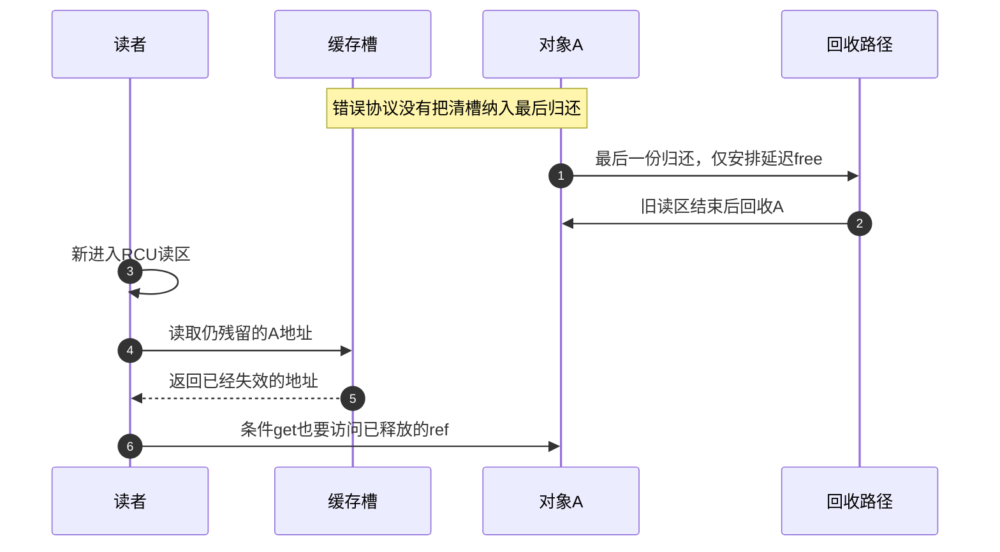
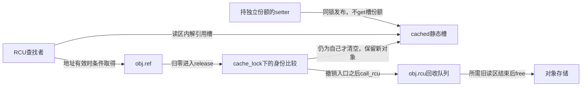
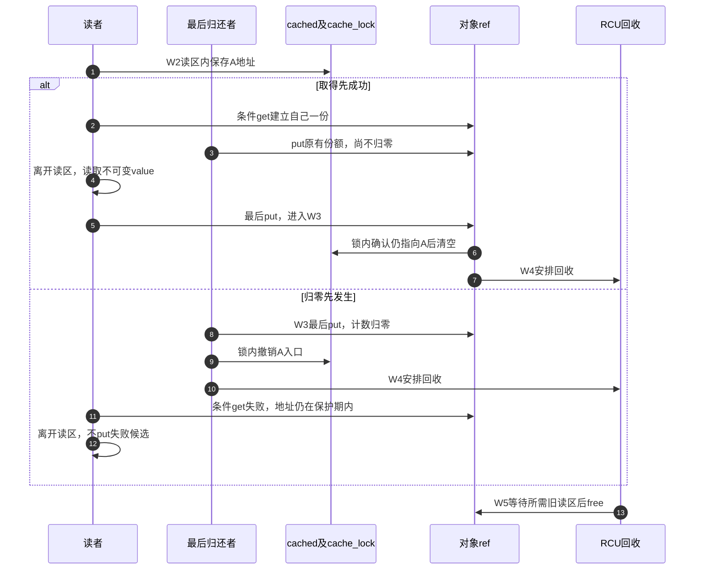

# 第26章\_弱缓存撤销与RCU回收模板

上一章的拥有型表会为成员保持一份引用。现在需要一个不延长对象拥有期限的缓存：有对象时可尝试取得，没有对象时允许查找失败。这样的缓存槽不get，也没有一份可put，却仍然保存一个可被后来读者找到的地址。**不拥有对象，不等于可以不管理入口何时失效。**

原模板只有rcu_dereference加get_unless_zero，以及互不关联的set/clear函数。它缺少最关键的约束：清除缓存必须先于相应回收宽限期，且要覆盖所有能再次发布旧对象的路径。否则一个在对象释放以后才开始的读区，仍能读到槽里残留的旧地址；条件取得读取的就是已经失效的ref。

## 26.1\_新读区为什么救不了旧缓存

沿错误顺序走一遍：缓存保存A，但不持有引用；A最后一份归还，release仅安排延迟free；相关旧读者都退出后A被回收；缓存仍指向A；新读者此时才rcu_read_lock并读槽。这个读者不属于此前回收所等的旧读者，内存早已不存在。RCU不会把已释放对象重新找回来。

因此需要把“所有发现入口撤销”放进对象的退出协议。可以由明确的管理者先清所有槽、停止再发布，再归还其保持的份额；也可以像下面这样，把单个弱槽的撤销放进最终release，在安排回收之前完成。选择后一种必须保证release能够找到每个弱入口，本例只有一个静态槽，不能自动扩展为任意数量的未知持有者。



错误图用于定位缺口，不是可运行的故意越界实验。修复也不能只是加一句“稍后会clear”：必须说明谁负责clear，与setter怎样排序，以及在什么条件下可以确定不再出现旧值。

## 26.2\_一个可以兑现的单槽协议

定义一个模块静态cached槽，用cache_lock串行化所有写入及最后清除。cache_set的非NULL输入必须由调用者已有一份保护；它不消费这份，也不给槽另取一份。最后归还进入cached_release，持同锁检查槽是否仍指向自己；若是，清空；若已经换成B，就保留B。随后才call_rcu延迟回收A。

为什么输入必须已有一份？如果setter确实拥有A，A就不可能同时正常归零；若只从旧裸指针尝试重新缓存A，则这条证明失效。不能在cache_set内部读一下计数快照就接纳任意地址。

| 状态位置 | 谁读写 | 所有权及期限 |
| --- | --- | --- |
| 静态cached槽 | setter和最后归还者持cache_lock写；查找者用rcu_dereference读 | 不拥有对象；模块寿命覆盖槽本身 |
| cache_lock | 全部缓存写入路径 | 保证旧A清理不会覆盖新B发布 |
| obj.ref | 创建者和取得成功者按份额操作 | 缓存不参与计数；零值不能复活 |
| obj.value | 发布前固定，成功取得者读取 | 不存在发布后并发写入 |
| obj.rcu | release在入口撤销之后安排回调 | 对象地址延迟到相关旧读者结束 |



这组协议不包含业务关闭门，因为唯一载荷value发布后只读。取得成功允许读value，但不保证对象此刻仍是缓存中的最新值。若需要“读到当前配置版本”，还应按业务要求定义版本和重查，不能把对象保活当成最新性。

## 26.3\_从缓存到最后回收的完整周期

W0创建初始份额；W1持有效份额发布弱槽，计数不变；W2读者在读区内尝试取得；W3最后put使计数归零，并在cache_lock下撤销仍指向自己的槽；W4安排RCU回收；W5回调执行后释放存储。W2可以与W3交错，取得失败的一方没有新责任可put。



如果缓存早已替换为B，W3的身份比较不会清B；A的旧读者仍由A自己的回收宽限期保护。若缓存只是显式清空，clear也不put，因为槽没有份额；A可以继续由真正的拥有者使用和最终归还。

## 26.4\_完整内核模块

材料[note_kref_weak_cache.c](../../../../labs/kernel/object_lifetime/materials/note_kref_weak_cache.c)只有一个静态槽，全部调用发生在模块初始化演示中，没有外部生产者。初始化以value=42创建对象、取得reader份额、清空缓存仍继续读取、凭reader份额再次缓存，最后归还自动清槽。退出等自定义回调完成后才允许卸载代码。

```c
// SPDX-License-Identifier: GPL-2.0
#include <linux/errno.h>
#include <linux/kref.h>
#include <linux/module.h>
#include <linux/rcupdate.h>
#include <linux/slab.h>
#include <linux/spinlock.h>

struct cached_object {
    struct kref ref;
    struct rcu_head rcu;
    int value; /* 发布前固定，取得对象后只读。 */
};
static struct cached_object __rcu *cached;
static DEFINE_SPINLOCK(cache_lock);
static atomic_t free_calls = ATOMIC_INIT(0);

static void cached_free(struct rcu_head *head)
{
    struct cached_object *obj = container_of(head, struct cached_object, rcu);
    atomic_inc(&free_calls);
    kfree(obj);
}
static void cached_release(struct kref *ref)
{
    struct cached_object *obj = container_of(ref, struct cached_object, ref);
    unsigned long flags;
    spin_lock_irqsave(&cache_lock, flags);
    /* 只撤销指向自己的槽，不能抹掉并发替换进去的另一个对象。 */
    if (rcu_access_pointer(cached) == obj)
        rcu_assign_pointer(cached, NULL);
    spin_unlock_irqrestore(&cache_lock, flags);
    call_rcu(&obj->rcu, cached_free); /* 撤销入口后，才开始延迟回收。 */
}
static void cached_put(struct cached_object *obj)
{
    kref_put(&obj->ref, cached_release);
}
static struct cached_object *cached_create(int value)
{
    struct cached_object *obj = kzalloc(sizeof(*obj), GFP_KERNEL);
    if (!obj)
        return NULL;
    kref_init(&obj->ref);
    obj->value = value;
    return obj;
}
/* 非NULL参数必须由调用者持有一份；槽不取得引用，也不消费参数份额。 */
static void cache_set(struct cached_object *obj)
{
    unsigned long flags;
    spin_lock_irqsave(&cache_lock, flags);
    rcu_assign_pointer(cached, obj);
    spin_unlock_irqrestore(&cache_lock, flags);
}
static struct cached_object *cache_get(void)
{
    struct cached_object *obj;
    rcu_read_lock();
    obj = rcu_dereference(cached);
    if (obj && !kref_get_unless_zero(&obj->ref))
        obj = NULL;
    rcu_read_unlock();
    return obj; /* 成功交付一份，失败不交付。 */
}
static int __init note_cache_init(void)
{
    struct cached_object *creator = cached_create(42), *reader;
    if (!creator)
        return -ENOMEM;
    cache_set(creator);
    reader = cache_get();
    if (!reader) {
        cached_put(creator);
        rcu_barrier();
        return -ENOENT;
    }
    cached_put(creator);
    cache_set(NULL); /* 清缓存不put；槽从未拥有一份。 */
    pr_info("note_cache: value=%d\n", reader->value);
    cache_set(reader); /* 当前有独立份额，允许再次缓存同一有效对象。 */
    cached_put(reader); /* 最后一份归还，release先清槽再安排回收。 */
    pr_info("note_cache: empty=%d\n", rcu_access_pointer(cached) == NULL);
    return 0;
}
static void __exit note_cache_exit(void)
{
    /* 无外部入口；init已归还全部份额，来源停止后等模块回调退出。 */
    rcu_barrier();
    pr_info("note_cache: free=%d\n", atomic_read(&free_calls));
}
module_init(note_cache_init);
module_exit(note_cache_exit);
MODULE_LICENSE("GPL");
MODULE_DESCRIPTION("单个弱缓存槽在最后归还时撤销并延迟回收");
```

rcu_access_pointer在release中只用于比较槽保存的地址，不通过它访问旧对象字段；更新者之间已经由cache_lock串行化。查找路径需要实际使用对象ref，故采用读区内rcu_dereference并在离开前条件取得。两者服务于不同任务，不能把纯地址观察复制成无保护的对象访问。

按[P16构建步骤](P16_对象创建与失败清理模板.md#%282%29_构建_预测和观察)生成模块后，在匹配内核中运行：

```bash
sudo insmod ./note_kref_weak_cache.ko
sudo rmmod note_kref_weak_cache
sudo dmesg | tail -n 12
```

预计value=42、empty=1、free=1。清缓存并未改变reader的一份，所以value仍可读取；最后归还同步撤销入口，所以初始化最后能观察empty；真正free及其计数在RCU回调中，退出先barrier再观察。

本批九组宿主检查覆盖分配失败、完整周期、空槽、归零先发生、取得先成功、替换后旧对象退出、清空再发布、IRQ状态保持和旧回调不影响新槽；固定普通/条件引用链保留，锁、RCU回调成熟条件及分配是顺序替身。ARM前端通过，头文件身份核对见工作记录。真实RCU调度、并发发布、目标链接装卸和硬件内存序未执行，以上命令为待运行步骤。

## 26.5\_扩展槽数量或持有者之前

原结构my_holder把cached放进另一个动态对象里，还多了一项地址期限：在读取holder->cached以前，holder自身必须有效。保护目标obj的RCU协议不自动保留holder。必须先持有holder或通过它自己的保护入口进入，才能读取其中的缓存槽；只有目标get成功并不补偿此前对holder的非法访问。

若一个对象被很多holder弱缓存，最后归还必须能撤销全部相关入口，或者由管理者保证它们已经撤销，再开始回收。需要选择能完整登记这些反向关系的机制、各holder的寿命、统一的写入/失效排序以及锁顺序。本例只有一个已知静态槽，不能把cached_release的一个比较当成多缓存问题已经解决。使用独立且寿命更长的控制块或其他查找机制也是另一套设计，普通kref并不会自动附带这样的弱引用控制块。

是否必须转换成长期引用也取决于使用方式。若一段只读访问全部发生在匹配RCU读区内，且对象字段按该回收协议保留、不需要睡眠或逃逸，可以只借用临时地址；一旦需要带出读区，就要在仍有效的窗口取得独立份额。本模块只展示后者，不能把“所有弱缓存读取必须get”当成普遍定律。

固定源码从[kref总索引](../../../../research/source_reading/kref/navigation/P01_Linux_6.12_kref源码阅读索引.md#1.2_按问题进入已落地证据)进入[弱入口撤销导读](../../../../research/source_reading/kref/navigation/P03_条件取得与查找窗口导读.md#3.12_单个弱缓存槽的撤销与回收)，条件接口直达[有效地址上的条件取得](../../../../research/source_reading/kref/source_explanations/include/linux/kref.h.md#1.7_有效地址上的条件取得)。RCU入口及后端沿[RCU源码总索引](../../../../research/source_reading/rcu/navigation/P01_Linux_6.12_RCU源码总阅读索引.md#1.2_先建立源码分类坐标)阅读。这里的cache_set/cache_get/cached_release是应用协议，不是上游新增弱引用API。

## 26.6\_用三处改动检验边界

第一处，删除release里的清槽。正常归零和free仍可能发生，但下一次查找将沿缓存读取已释放地址。只看free=1不能证明正确退出；入口撤销也是必须验证的不变量。

第二处，不判断cached是否仍为自己就无条件清空。安排A被替换为B，再让A最后归还，A会把B的缓存误删。即使没有内存越界，也破坏新对象的可见性；身份比较是协议的一部分。

第三处，让cache_set内部get、替换时put旧值。这可以构成另一种拥有型缓存，但已经改变“缓存不延长对象拥有期限”的目标。需要重新处理替换后的旧份额、临时读者和回收顺序，不能一边给缓存加引用、一边仍宣称最后外部归还必然自动清槽。

现在弱缓存的发布、临时读取、取得、失效与回收形成同一条闭环。下一步进入父子对象：当一个对象真正拥有另一个对象的一份时，最后清理还要把关系两端的期限配对。

专题导航：[kref工程模板路线](大纲.md#1.14_工程模板)。

上一篇：[RCU查找与业务关闭](P25_RCU查找与业务关闭工程模板.md#25.1_同一对象上有三组独立状态)。

下一篇：[父子桥接与非拥有链表](P27_父子桥接与非拥有链表模板.md#27.1_一条关系对应几份引用)。
