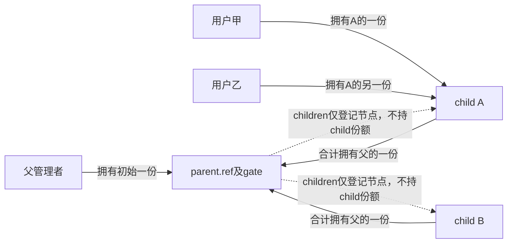
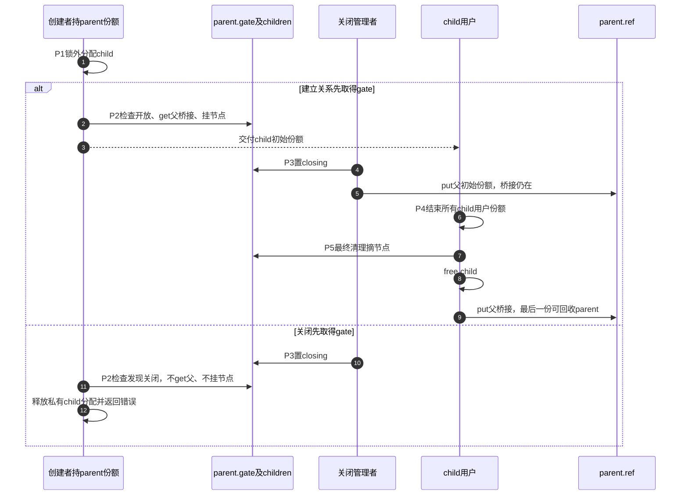

# 第27章\_父子桥接与非拥有链表模板

弱缓存不拥有目标，所以必须单独撤销入口。父子关系可以选择另一种安排：每个子对象真正拥有父对象的一份，让子对象使用父锁、共享状态并执行最后清理时，父存储始终有效。父对象中的children链表则只登记子对象，不额外拥有它们。关系方向和引用方向要分别画出来。

原模板已经提出“子对象持父引用”，但子对象直接free时没有从父链表摘除；链表里可能因此留下指向已释放存储的节点。另一个child_remove又在每次调用时无条件put，重复摘链容易被误解成可以重复归还。本章把摘链与归还分成两个契约，并在最终清理中补齐必需的摘链。

## 27.1\_一条关系对应几份引用

选一个可以直接运行的模型。parent拥有关闭门、mutex和非拥有children链表；child拥有自己的计数、链表节点以及指向parent的桥接份额。child的每个用户持child份额，而不是每个用户都再次给parent加一份。只要child还没有最终清理，它所拥有的那一份父引用就覆盖所有合法child用户对parent的访问。

| 责任或关系 | 谁建立 | 谁结束 |
| --- | --- | --- |
| parent初始份额 | parent_create交给管理者 | 管理者parent_put |
| 每个child的父桥接份额 | child成功建立关系时get parent | child最终清理在摘链、free child后put parent |
| child初始份额 | child_create交给调用者 | 该调用者child_put |
| 额外child用户份额 | 已有合法输入时get child | 对应用户child_put |
| parent.children中的节点 | child建立时挂接 | child_detach或最终child_release摘除，不消费引用 |



图中虚线是索引关系，不能用它证明child计数为正。parent可以在children已经为空时继续存在，因为尚未释放的child可能早已显式摘链、仍持父桥接；反过来，parent正常归零时不应再有child桥接份额，所有child节点也应已经摘除。两个时刻并不互为简单等价。

## 27.2\_创建窗口先证明父地址有效

child_create会在锁外分配child。整个调用期间，调用者必须已有parent份额；否则它在分配结束后读取parent->gate时就可能面对失效地址。锁内检查closing只能决定是否允许建立新关系，不能修复此前父地址失效。

分配完成后，持parent.gate一次性检查closing、增加父桥接份额、初始化child引用并挂入children。关闭者也持同一gate置closing，因此关系建立与关门有明确顺序：建立先完成，child成为旧对象；关门先完成，创建拒绝并释放尚未交付的私有分配。锁外分配减少持锁时间，不是因为mutex内一律禁止可睡眠分配；是否适合在锁内分配，还要考虑延迟、回收路径与其他锁依赖。

使用一组统一阶段检查整个周期：P0创建父初始份额；P1准备child私有分配；P2锁内建立父桥接和子节点；P3管理者关门并可结束自己的一份；P4旧child用户逐个归还或先摘链；P5最后child归还触发摘链、释放child、归还父桥接，最后一个桥接结束时parent才可能回收。



图中把创建与关闭画成不同角色；若实际由不同线程并发调用，双方都须在各自操作期间持有或按明确协议借用有效parent，不能让管理者先归还唯一保护份额再等待创建者访问。

两次检查也可能设计正确，例如先检查以避免不必要分配、分配后再复核；但第一次检查到最终发布之间仍需父地址保护，且必须配对所有预取份额。本例选择一次最终检查，减少中间责任，而不宣称所有双检查方案都错误。

## 27.3\_完整父子模块

材料[note_kref_parent.c](../../../../labs/kernel/object_lifetime/materials/note_kref_parent.c)使用普通mutex串行化关系和短业务操作，所有调用都在可睡眠的进程路径。parent_close只关闭创建和本例同步业务，不等待全部child对象销毁，也不消费管理者份额。child_detach只摘索引，不关闭业务，不归还调用者份额；最终child_release保证没有人显式摘链时也会在free之前完成摘链。

```c
// SPDX-License-Identifier: GPL-2.0
#include <linux/err.h>
#include <linux/kref.h>
#include <linux/list.h>
#include <linux/module.h>
#include <linux/mutex.h>
#include <linux/slab.h>

struct parent_object {
    struct kref ref;
    struct mutex gate;
    struct list_head children; /* 非拥有索引，不为child增加一份。 */
    bool closing;
};
struct child_object {
    struct kref ref;
    struct parent_object *parent; /* 每个child合计持有parent的一份。 */
    struct list_head node;
    unsigned int completed;
};
static unsigned int parent_releases, child_releases;

static void parent_release(struct kref *ref)
{
    struct parent_object *parent = container_of(ref, struct parent_object, ref);
    WARN_ON(!list_empty(&parent->children));
    ++parent_releases;
    kfree(parent);
}
static void parent_put(struct parent_object *parent)
{
    kref_put(&parent->ref, parent_release);
}
static struct parent_object *parent_create(void)
{
    struct parent_object *parent = kzalloc(sizeof(*parent), GFP_KERNEL);
    if (!parent)
        return NULL;
    kref_init(&parent->ref);
    mutex_init(&parent->gate);
    INIT_LIST_HEAD(&parent->children);
    return parent;
}
/* 调用者持有child；只改索引，不消费child或parent的任何份额。 */
static void child_detach(struct child_object *child)
{
    struct parent_object *parent = child->parent;
    mutex_lock(&parent->gate);
    if (!list_empty(&child->node))
        list_del_init(&child->node);
    mutex_unlock(&parent->gate);
}
static void child_release(struct kref *ref)
{
    struct child_object *child = container_of(ref, struct child_object, ref);
    struct parent_object *parent = child->parent;
    /* 内部最终清理可以在零计数时操作自己的存储，父桥接份额仍然存在。 */
    child_detach(child);
    ++child_releases;
    kfree(child);
    parent_put(parent); /* 此后不能再访问child或parent。 */
}
static void child_put(struct child_object *child)
{
    kref_put(&child->ref, child_release);
}
/* 调用者已有parent份额，覆盖锁外分配；只在锁内最终检查后建立桥接并发布。 */
static struct child_object *child_create(struct parent_object *parent)
{
    struct child_object *child = kzalloc(sizeof(*child), GFP_KERNEL);
    if (!child)
        return ERR_PTR(-ENOMEM);
    INIT_LIST_HEAD(&child->node);
    mutex_lock(&parent->gate);
    if (parent->closing) {
        mutex_unlock(&parent->gate);
        kfree(child); /* 尚未建立child引用协议和父桥接，只回滚私有分配。 */
        return ERR_PTR(-ESHUTDOWN);
    }
    kref_get(&parent->ref);
    child->parent = parent;
    kref_init(&child->ref);
    list_add_tail(&child->node, &parent->children);
    mutex_unlock(&parent->gate);
    return child;
}
static int child_request(struct child_object *child)
{
    struct parent_object *parent = child->parent;
    int result = -ESHUTDOWN;
    mutex_lock(&parent->gate);
    if (!parent->closing) {
        ++child->completed;
        result = 0;
    }
    mutex_unlock(&parent->gate);
    return result;
}
/* 仅关闭创建与本例同步业务，不等待所有child消失，不消费调用者份额。 */
static void parent_close(struct parent_object *parent)
{
    mutex_lock(&parent->gate);
    parent->closing = true;
    mutex_unlock(&parent->gate);
}
static int __init note_parent_init(void)
{
    struct parent_object *parent = parent_create();
    struct child_object *child;
    int before, after;
    if (!parent)
        return -ENOMEM;
    child = child_create(parent);
    if (IS_ERR(child)) {
        parent_put(parent);
        return PTR_ERR(child);
    }
    kref_get(&child->ref); /* 第二个child拥有者，不另给parent加一份。 */
    before = child_request(child);
    parent_close(parent);
    parent_put(parent); /* 结束管理者，child的桥接仍保留父对象。 */
    child_detach(child);
    child_detach(child); /* 重复摘链不归还任何调用者份额。 */
    child_put(child); /* 第一个child拥有者结束，另一个仍持有。 */
    after = child_request(child);
    pr_info("note_parent: before=%d after=%d completed=%u parent_free=%u\n",
            before, after, child->completed, parent_releases);
    child_put(child); /* child最终清理后，父桥接份额才归还。 */
    return 0;
}
static void __exit note_parent_exit(void)
{
    /* 无外部入口或异步回调，init已经结束全部责任。 */
    pr_info("note_parent: children=%u parents=%u\n", child_releases, parent_releases);
}
module_init(note_parent_init);
module_exit(note_parent_exit);
MODULE_LICENSE("GPL");
MODULE_DESCRIPTION("子对象桥接父份额与非拥有链表的完整退出实验");
```

最后child_put可能调用child_release，而child_release还要取得父mutex。因此不能持parent.gate执行可能归零的child_put，否则同一清理会再次申请这把锁。即使把mutex换成spinlock，重复取同锁也不会变正确；调用上下文和锁顺序需要一起审查。本例不允许把这些最后归还路径搬到硬中断。

child_release先保存parent地址，摘链后free child，再put parent。这段访问合法的原因是父桥接份额仍保留到最后一步；它不是“保存一份裸指针就自动安全”。parent_put之后不再访问parent，child的字段也不能在free后继续读取。

按[P16构建步骤](P16_对象创建与失败清理模板.md#%282%29_构建_预测和观察)生成模块后，在匹配内核中运行：

```bash
sudo insmod ./note_kref_parent.ko
sudo rmmod note_kref_parent
sudo dmesg | tail -n 12
```

预测第一次业务返回0、completed=1；父关门后业务返回-ESHUTDOWN。打印这一行时parent_free=0：父管理者虽然已经put，child的桥接仍保留父对象。最后child拥有者放弃以后，退出日志children=1、parents=1。增加第二个child拥有者没有给父对象多加桥接，所以不会遗留父引用。

本批八组宿主检查覆盖父/子分配失败、完整模块、先关门后创建、分配期间关门、附着节点的最终释放、两个child及额外child拥有者、重复摘链与关闭拒绝。固定普通引用和既有链表删除辅助保留，锁、插入和分配为顺序替身；ARM前端354头中342非生成源码与官方固定提交无差异。目标装卸、真实分配竞争、线程阻塞和硬件内存序未执行。

## 27.4\_非拥有索引不是取得child的凭据

本例children用于维护关系，不提供对外lookup。若以后要遍历并带走一个child，不能仅因持有父锁就无条件get child。child最后put可以先把计数减到零，再进入child_release等待父锁；遍历者此时虽然能在父锁保护下看到尚未摘除、尚未free的节点，计数却可能已经为零。

在保持当前“最后清理同锁摘链并释放”协议时，受锁保护的地址可以支持条件取得：成功后带走一份，失败则不消费候选；这是[P09非拥有索引窗口](P09_kref_与锁的组合.md#9.4.5_kref_put_mutex%28%29_的典型模式)讨论的地址/正计数分离问题，但不能直接混用它的最后减少锁交接方式。若改变父集合为拥有型，成员正计数来源和撤下责任又会改变，需完整选择一套协议。

原child_remove每次摘链后put，在“每次调用都明确消费调用者一份”的接口契约下可以成立，但它不是无条件可重复调用的删除接口。这里把child_detach设计成不消费，调用者随后独立child_put；重复detach不会吞掉别人的责任。一个用户可以选择显式摘链后继续持有child，最终清理仍保证桥接结束。

## 27.5\_父关闭究竟要等待什么

parent_close在同一gate下设置closing，所有child_request的检查与整个completed更新也在该锁下。因此它返回时，此前开始的这种短操作已经完成，后来的操作会被拒绝。它并不承诺所有child引用都消失。父管理者可以先归还自己的一份，让父外壳由旧child的桥接继续保留，这正是本例输出parent_free=0的原因。

如果父对象还拥有必须在驱动remove时结束的硬件活动，就要先关闭那些活动来源并排空业务；不能等同于把所有child强行put掉。child引用可能由文件、线程或异步对象拥有，父管理者无权代还。需要等待全部child生命周期时，也必须有登记/完成通知，并在不持child_release所需父锁的条件下等待；还要证明等待者没有自己扣住阻止条件成立的最后child份额。

若父集合也持有child份额，而每个child又持有parent份额，就形成引用环：外部管理者退出后，两边都因对方仍持有而无法自然归零。这样的拥有型关系需要独立的关闭动作先撤下父集合的child份额，再让child最终归还父桥接；不能指望parent_release开始以后再打破一个使它永远无法开始的环。本例使用非拥有链表，避免了这个自动回收环，代价是必须在child最后清理中维护节点失效和取得窗口。

源码从[kref总阅读索引](../../../../research/source_reading/kref/navigation/P01_Linux_6.12_kref源码阅读索引.md#1.2_按问题进入已落地证据)进入[父子桥接导读](../../../../research/source_reading/kref/navigation/P02_普通引用与归零回调导读.md#2.24_父子桥接与非拥有节点)，分别核对[独立份额增加](../../../../research/source_reading/kref/source_explanations/include/linux/kref.h.md#1.3_为独立使用追加引用)与[最后归还](../../../../research/source_reading/kref/source_explanations/include/linux/kref.h.md#1.4_最后归还调用清理)。parent/child关系是应用定义的，kref既不自动摘链，也不自动检测引用环。

## 27.6\_按责任图修改程序

先删掉child_release里的child_detach。显式摘链的正常演示仍可能通过，但未显式摘链就最后put的合法路径会留下悬空节点。测试必须覆盖最终清理的默认职责，不能只覆盖调用者已经代做全部准备的情况。

再让每次get child都get parent，却仍只在child_release里put parent一次。两个child用户就可能留下多余父份额，因为桥接按child实例拥有，而不是按child计数的每个单位拥有。若确实要每个用户独立持父引用，应另行定义每个用户结束时的对应put，不能混合两种计数单位。

最后让child_detach同时设置整个parent.closing。一个子对象离开索引就会关闭所有兄弟对象的业务，这已经改变接口含义。应先判断要结束的是索引可见性、单个child业务，还是整棵关系的接纳能力，再选择相应状态，不能只因字段放在父结构里就把所有生命周期动作合并。

父子桥接现在覆盖创建、失败、关门、摘链和最终回收。下一单元把持有者换成struct file，继续核对一个打开文件实例究竟拥有哪一份，以及open失败和最终release怎样配对。

专题导航：[kref工程模板路线](大纲.md#1.14_工程模板)。

上一篇：[弱缓存撤销与回收](P26_弱缓存撤销与RCU回收模板.md#26.1_新读区为什么救不了旧缓存)。

下一篇：[文件实例与私有对象持有](P28_文件实例与私有对象持有模板.md#28.1_计数单位是文件实例)。
