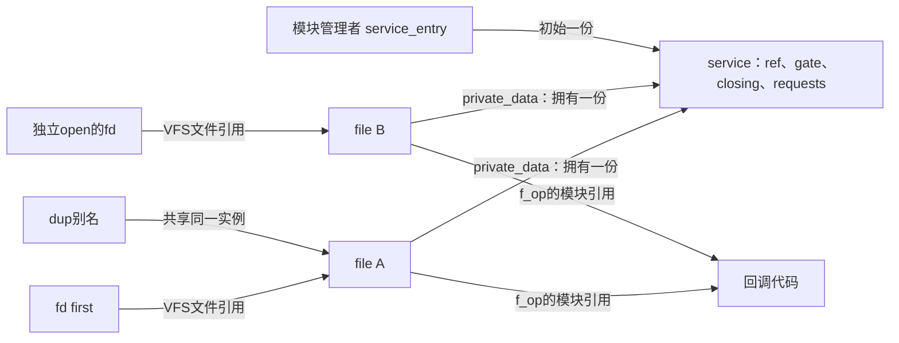
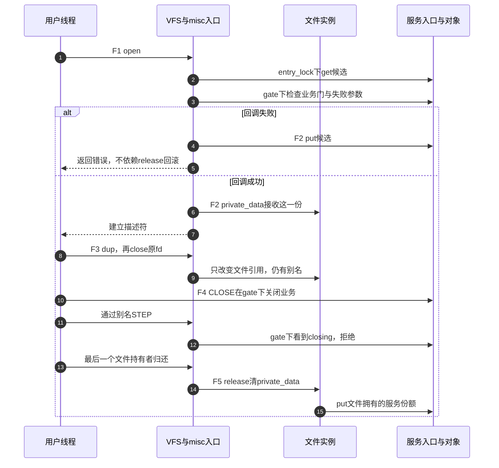

# 第28章\_文件实例与私有对象持有模板

上一章让一个child实例持有parent一份，无论child后来有多少用户，这条桥接都只增加一次。现在把child换成虚拟文件系统（Virtual File System，VFS）管理的struct file：一次独立打开的文件实例拥有服务对象一份，复制文件描述符并不复制这份对象责任。

本章沿用已经建立的kref取得、转交和最后归还，只引入文件实例这一种持有者。先区分用户态的fd数字、内核文件实例与驱动服务对象，再做一个可以独立打开两次的misc设备。它只维护内存中的计数和业务关闭门，不操作真实硬件。文件操作表的背景可以回顾[文件操作与打开寿命导读](../../../../research/source_reading/character_device/navigation/P03_文件操作与打开寿命导读.md#3.1_打开对象由谁持有)。

## 28.1\_计数单位是文件实例

假设服务已经由模块管理者创建，初始引用为1。第一次open从服务入口取得候选份额；驱动回调成功后，这一份交给新file，以file->private_data保存地址。第二次独立open重复该过程，因此服务计数变为3。此时两个文件实例各有自己的最终release责任。

现在对第一个fd执行dup。新的数字入口仍指向同一个file，VFS增加的是file自身的引用，不会再调用驱动open，服务计数仍为3。关掉原fd只撤销一个入口；别名还在，驱动release不能执行。只有该file的最后一个持有者离开，VFS才最终调用release，由它归还服务对象的一份。

所以private_data不是带自动管理功能的智能指针。赋值只保存地址，真正的拥有责任来自open阶段已经完成的取得或转交。本例向既有共享服务get一份；另一种合法设计是在open中新建专属对象，把它的初始份额直接交给file，便不需要先额外get再马上put。还有受外部生命周期严格保护的借用方案，但必须证明所有文件访问都处在该保护内。判断标准是责任来源，不是看到open里没有get就判错。



实验定义两个不带参数的命令：NOTE_FILE_STEP完成一次短操作，NOTE_FILE_CLOSE关闭业务接纳。下文简称STEP和CLOSE，它们只是本例命令名。

这里有三组正交状态：VFS管理file持有者，kref管理服务存储的持有者，service.gate保护业务接纳与requests。file还活着，并不能推出closing为false；closing变为true，也不要求立刻销毁所有file。

| 阶段 | 触发与状态地址 | 写入者、后续读取者及退出条件 |
| --- | --- | --- |
| F0 | 创建service，ref=1，写service_entry | 模块管理者保留初始份额，misc注册发布文件入口 |
| F1 | driver open在entry_lock下读取service_entry并get | 局部候选份额先保活地址，随后在service.gate下检查closing与失败注入 |
| F2 | 成功写file->private_data；失败归还候选 | 成功把一份转交file；回调返回失败时private_data仍为空，不能等release代还 |
| F3 | dup或独立open改变不同计数；ioctl读取private_data | VFS保护回调期间file有效；业务检查与完整短操作都在service.gate下 |
| F4 | CLOSE命令写closing=true | 后续STEP和新open检查同一锁下状态，旧file仍持有对象 |
| F5 | file最终release清private_data并put | 每个成功回调交付的文件实例归还一次，不按每次close归还 |
| F6 | 正常模块卸载撤销misc入口，再归还管理者份额 | 本例由fops.owner阻止仍有打开file时卸载，最终回调释放服务 |

## 28.2\_把取得与失败放在同一个回调里

misc是内核提供的简单字符设备注册层，本例通过misc_register发布/dev/note_kref_file。它在调用服务open之前，已经把file的操作表换成service_fops，并把private_data设为miscdevice地址。那个地址用于入口分派，不是我们服务对象的拥有份额，因此服务回调先清空它，再建立自己的契约。

下面是完整模块[note_kref_file.c](../../../../labs/kernel/object_lifetime/materials/note_kref_file.c)。gate是一把可睡眠的互斥锁，保护很短的内存操作；entry_lock只协调入口指针与候选取得，不在持锁期间调用misc注册或注销。两把锁不嵌套，避免把misc自己的入口锁顺序带进对象锁协议。DEFINE_MUTEX在静态存储处初始化互斥锁，ATOMIC_INIT初始化并发释放次数的计数；MODULE_PARM_DESC说明fail_open参数用途。分配与模块注册宏沿用前面的完整模块，GFP_KERNEL要求可睡眠的分配上下文。

回调用负错误码区分失败：ENODEV表示没有服务入口，ESHUTDOWN表示业务已关闭，EIO用于本例主动注入的打开失败，ENOTTY表示不支持该命令。它们对应不同责任出口，不能把未知命令也解释为对象已经消失。

```c
// SPDX-License-Identifier: GPL-2.0
#include <linux/errno.h>
#include <linux/fs.h>
#include <linux/kref.h>
#include <linux/miscdevice.h>
#include <linux/module.h>
#include <linux/mutex.h>
#include <linux/slab.h>
#include "note_kref_file_protocol.h"

struct file_service {
    struct kref ref;
    struct mutex gate;
    bool closing;
    unsigned int requests;
};
static DEFINE_MUTEX(entry_lock);
static struct file_service *service_entry; /* 模块管理者持有初始份额。 */
static bool fail_open;
module_param(fail_open, bool, 0444);
MODULE_PARM_DESC(fail_open, "在open取得候选引用后模拟失败");
static atomic_t file_releases = ATOMIC_INIT(0);
static unsigned int object_releases;

static void service_release(struct kref *ref)
{
    struct file_service *service = container_of(ref, struct file_service, ref);
    ++object_releases;
    kfree(service);
}
static void service_put(struct file_service *service)
{
    kref_put(&service->ref, service_release);
}
static int service_open_file(struct inode *inode, struct file *file)
{
    struct file_service *service;
    int result = 0;
    (void)inode;
    /* misc入口原先放的是静态miscdevice地址，不是本服务的一份引用。 */
    file->private_data = NULL;
    mutex_lock(&entry_lock);
    service = service_entry;
    if (service)
        kref_get(&service->ref); /* 管理者份额在锁内保证地址和正计数。 */
    mutex_unlock(&entry_lock);
    if (!service)
        return -ENODEV;
    mutex_lock(&service->gate);
    if (service->closing)
        result = -ESHUTDOWN;
    else if (fail_open)
        result = -EIO;
    mutex_unlock(&service->gate);
    if (result) {
        service_put(service); /* open失败自行回滚，不等文件release替我们做。 */
        return result;
    }
    file->private_data = service; /* 向本次成功struct file交付候选份额。 */
    return 0;
}
static int service_release_file(struct inode *inode, struct file *file)
{
    struct file_service *service = file->private_data;
    (void)inode;
    file->private_data = NULL;
    atomic_inc(&file_releases);
    service_put(service); /* 一次成功打开实例的最终release，恰好归还一份。 */
    return 0;
}
static long service_ioctl(struct file *file, unsigned int command, unsigned long arg)
{
    struct file_service *service = file->private_data;
    long result = 0;
    (void)arg;
    mutex_lock(&service->gate);
    switch (command) {
    case NOTE_FILE_STEP:
        if (service->closing)
            result = -ESHUTDOWN;
        else
            ++service->requests; /* 检查与本例完整短操作处在同一锁窗口。 */
        break;
    case NOTE_FILE_CLOSE:
        service->closing = true; /* 关业务门，不消费文件或管理者份额。 */
        break;
    default:
        result = -ENOTTY;
        break;
    }
    mutex_unlock(&service->gate);
    return result;
}
static const struct file_operations service_fops = {
    .owner = THIS_MODULE,
    .open = service_open_file,
    .release = service_release_file,
    .unlocked_ioctl = service_ioctl,
    .compat_ioctl = service_ioctl, /* 命令没有指针或依赖字长的结构参数。 */
};
static struct miscdevice service_device = {
    .minor = MISC_DYNAMIC_MINOR,
    .name = "note_kref_file",
    .fops = &service_fops,
    .mode = 0600,
};
static int __init note_file_init(void)
{
    int result;
    struct file_service *service = kzalloc(sizeof(*service), GFP_KERNEL);
    if (!service)
        return -ENOMEM;
    kref_init(&service->ref);
    mutex_init(&service->gate);
    service_entry = service;
    result = misc_register(&service_device);
    if (result) {
        service_entry = NULL;
        service_put(service);
    }
    return result;
}
static void __exit note_file_exit(void)
{
    struct file_service *service;
    /* 正常模块卸载由fops.owner阻止存在打开文件时进入；不模拟热拔插。 */
    misc_deregister(&service_device);
    mutex_lock(&entry_lock);
    service = service_entry;
    service_entry = NULL;
    mutex_unlock(&entry_lock);
    pr_info("note_file: file_releases=%d requests=%u\n",
            atomic_read(&file_releases), service->requests);
    service_put(service);
    pr_info("note_file: object_releases=%u\n", object_releases);
}
module_init(note_file_init);
module_exit(note_file_exit);
MODULE_LICENSE("GPL");
MODULE_DESCRIPTION("文件实例持有对象份额与open失败回滚实验");
```

取得候选后，即使另一个线程马上关掉业务门，候选仍保证service地址可访问。在gate内观察到closing便put并返回-ESHUTDOWN；没有关闭且没有注入失败，才把份额交给file。这个成功判断并不预订永久业务权限：open离开gate后、返回用户态前，另一个已有文件也可能关闭业务。因此每次ioctl仍须检查，不能把“open曾成功”当作设备永远在线的证明。

STEP的检查与requests自增没有分开解锁。假如检查后先解锁，关闭者可能已经返回，旧操作却继续操作设备。当前程序把完整短操作包含在锁内，所以CLOSE取得锁时，此前持锁的STEP已经结束。若实际操作会异步提交、等待硬件或长期睡眠，应另建活动登记与排空协议；不能直接把这个短临界区示例外推为驱动remove实现。



### 28.2.1\_哪一种失败需要自己回滚

上图的失败指 **驱动open回调自己返回错误**。VFS此时还没有把文件标记为成功打开，不能假定未来会为这个回调调用release。局部已经取得的引用、分配的缓冲区或登记的回调，都必须在返回错误前按建立顺序的依赖关系回滚。

但一次用户态open系统调用失败，还可能发生在驱动回调已经成功之后。固定6.12.20的do_dentry_open在回调成功后设置FMODE_OPENED，后续还可能拒绝不支持的O_DIRECT打开；这一类路径会按已打开文件清理，最终release仍需要接住之前交付的责任。因此不能写成“只要open系统调用失败，就绝不调用release”，也不能让用户是否拿到fd决定内核回调是否需要回滚。

沿[字符设备源码总索引](../../../../research/source_reading/character_device/navigation/P01_Linux_6.12_字符设备源码阅读索引.md#1.1_版本和阅读边界)进入[打开回调失败与交付边界](../../../../research/source_reading/character_device/source_explanations/fs/open.c.md#1.3_打开回调失败与交付边界)，核对FMODE_OPENED的写入点。misc操作表与模块引用的交接见[misc打开与注销](../../../../research/source_reading/driver_entries/source_explanations/P01_对象创建与misc分派.md#1.3_misc打开与注销的交接)。

## 28.3\_让两个打开实例和一个别名同时出现

内核与用户程序共享以下头文件[note_kref_file_protocol.h](../../../../labs/kernel/object_lifetime/materials/note_kref_file_protocol.h)。_IO为没有数据载荷的ioctl命令编码；本例只用类型字符和命令号，不传递用户指针，也没有32/64位布局不同的结构。compat_ioctl才可以复用同一回调，不能把这个安排套到包含指针或long字段的命令上。

```c
#ifndef NOTE_KREF_FILE_PROTOCOL_H
#define NOTE_KREF_FILE_PROTOCOL_H
#ifdef __KERNEL__
#include <linux/ioctl.h>
#else
#include <sys/ioctl.h>
#endif
/* 两个命令均无指针参数：一次短业务操作，或关闭所有后续业务接纳。 */
#define NOTE_FILE_STEP _IO('K', 0x10)
#define NOTE_FILE_CLOSE _IO('K', 0x11)
#endif
```

下面是完整Linux用户态程序[file_ownership_probe.c](../../../../labs/kernel/object_lifetime/materials/file_ownership_probe.c)。先预测：执行到close_one(&first)后，alias是否还能完成STEP？最终模块日志会记录两次还是三次file_releases？

```c
/* Linux用户态：两个独立open各持一份，dup只共享已有文件实例。 */
#include <errno.h>
#include <fcntl.h>
#include <stdio.h>
#include <unistd.h>
#include "note_kref_file_protocol.h"

static int close_one(int *fd)
{
    int owned = *fd;
    *fd = -1; /* Linux close错误也不对可能复用的号码盲目重试。 */
    if (owned >= 0 && close(owned) < 0) {
        perror("close");
        return 0;
    }
    return 1;
}
int main(void)
{
    int first = -1, alias = -1, separate = -1, rejected = -1, result = 1;
    first = open("/dev/note_kref_file", O_RDWR);
    if (first < 0) { perror("open first"); goto out; }
    alias = dup(first);
    if (alias < 0) { perror("dup"); goto out; }
    separate = open("/dev/note_kref_file", O_RDWR);
    if (separate < 0) { perror("open separate"); goto out; }
    if (!close_one(&first)) goto out;
    if (ioctl(alias, NOTE_FILE_STEP, 0) < 0) { perror("step alias"); goto out; }
    if (ioctl(separate, NOTE_FILE_CLOSE, 0) < 0) { perror("close business"); goto out; }
    errno = 0;
    if (ioctl(alias, NOTE_FILE_STEP, 0) != -1 || errno != ESHUTDOWN) {
        fputs("关闭后仍接纳业务或返回了其他错误\n", stderr);
        goto out;
    }
    errno = 0;
    rejected = open("/dev/note_kref_file", O_RDWR);
    if (rejected >= 0 || errno != ESHUTDOWN) {
        fputs("关闭后open没有按契约拒绝\n", stderr);
        goto out;
    }
    puts("共享文件仍有效，业务门关闭后拒绝请求和新open");
    result = 0;
out:
    if (!close_one(&first)) result = 1;
    if (!close_one(&alias)) result = 1;
    if (!close_one(&separate)) result = 1;
    if (!close_one(&rejected)) result = 1;
    return result;
}
```

答案是alias仍可完成STEP，最终只有两次文件release。first与alias指向同一个file，separate指向另一个file；CLOSE关闭的是共享service的业务门，所以alias后续请求也会被拒绝。第三次open在取得候选之后看到关闭状态，立刻归还候选，不增加成功文件的release次数。

### 28.3.1\_构建与观察

模块构建沿[P16的环境与命令](P16_对象创建与失败清理模板.md#%282%29_构建_预测和观察)，在匹配运行内核的构建环境中执行。Makefile已经登记note_kref_file.o；先确认没有同名模块和先前实验遗留的打开文件。在材料目录编译Linux用户程序并运行：

```bash
cc -std=c11 -Wall -Wextra -Werror -O2 file_ownership_probe.c -o /tmp/file_ownership_probe
sudo insmod ./note_kref_file.ko
sudo /tmp/file_ownership_probe
sudo rmmod note_kref_file
sudo dmesg | tail -n 20
```

程序成功退出时应打印共享文件仍有效、关闭后拒绝新业务的提示。卸载日志应包含file_releases=2 requests=1以及object_releases=1。这里的值只针对没有其他进程打开该设备的本次实验；设备权限设为0600，所以用sudo运行。若环境不自动创建设备节点，先按字符设备基础实验检查devtmpfs与设备注册，不能把“路径不存在”当成引用协议失败。

再装载fail_open=1，让驱动在取得候选份额后主动失败：

```bash
sudo insmod ./note_kref_file.ko fail_open=1
sudo /tmp/file_ownership_probe
sudo rmmod note_kref_file
sudo dmesg | tail -n 20
```

这次探测程序应在第一次open处报Input/output error并返回非零；这是有意的失败实验。卸载应显示file_releases=0 requests=0与object_releases=1。没有文件release，并不表示丢了一份；恰恰是open错误路径已经归还了候选。不要为得到“全绿退出码”删掉这个失败注入，也不要在模块仍有使用者时强制卸载。

本批实际完成的是八组宿主C协议检查与ARM前端编译。宿主检查拼入本模块和探测程序，固定kref普通引用链保留，VFS文件引用、系统调用、锁、misc注册与分配由明确的顺序替身提供。它覆盖分配/注册失败、空入口、取得后失败、完整探测、别名与未知命令、重复关门与兼容回调、两个独立文件，不能证明真实VFS、模块装卸或并发调度。ARM读取450个头文件，437个非生成头相对官方固定提交无差异；目标链接装卸、真实Linux探测与硬件没有在本批执行。

## 28.4\_文件代码与对象存储分别保活

fops.owner=THIS_MODULE保护的是回调所属模块的代码寿命；service.ref保护的是堆上服务对象的存储。二者都需要，不能互相替代。持有service的一份，不会自动阻止模块卸载；模块代码仍在，也不会自动延长一个已经被错误put到零的service存储。

本例正常卸载时，不允许仍有打开文件：misc_open取得的操作表模块引用直到文件最终清理才归还。因此模块exit可以撤销入口后结束管理者份额。它没有演示设备热拔插：真实驱动可能在模块代码仍被文件使用时执行设备remove，旧file继续存在而硬件已经离线，那时必须按[P24关闭与排空](P24_删除入口与活动排空工程模板.md#24.1_关闭业务不等于回收所有对象)处理业务资格、硬件活动与外壳寿命。

同样，release不等于“某个用户调用close”。VMA、另一个描述符以及框架临时引用都可能推迟最终清理。本例没有mmap等接口，仍应保留这个契约边界。固定版本close系统调用在最后引用分支走同步__fput_sync，通用fput则可能安排任务工作，具体分支见[关闭系统调用实现](../../../../research/source_reading/character_device/source_explanations/fs/open.c.md#1.2_close系统调用的同步清理)。

kref本身没有文件概念。从[kref源码总索引](../../../../research/source_reading/kref/navigation/P01_Linux_6.12_kref源码阅读索引.md#1.2_按问题进入已落地证据)进入[文件份额导读](../../../../research/source_reading/kref/navigation/P02_普通引用与归零回调导读.md#2.25_文件实例的候选与交付)，可分别核对[普通取得](../../../../research/source_reading/kref/source_explanations/include/linux/kref.h.md#1.3_为独立使用追加引用)和[最后归还](../../../../research/source_reading/kref/source_explanations/include/linux/kref.h.md#1.4_最后归还调用清理)。文件框架与驱动共同实现了配对，单独一个private_data赋值并不完成配对。

## 28.5\_改一条路径再重新画责任图

第一题，把关闭业务命令提前到dup之前。dup能否成功，与新的独立open能否成功是否必须相同？在本例协议中，dup仍由VFS复制已有文件引用，不调用服务open；新open则会被service.closing拒绝。业务门控制驱动接纳，不自动撤销已有文件实例。

第二题，在成功open后再分配一块属于file的缓冲区，并让这一步可能失败。先画出候选对象份额与缓冲区分别何时建立，再给出每个失败出口的回滚动作。若驱动回调尚未成功返回，不能把半成品交给release收拾；若准备成功，则release需要同时结束这两个有依赖的资源。

第三题，让STEP解锁后再访问硬件，CLOSE同时释放硬件句柄。服务引用即使从不归零，也挡不住硬件资源退出后的访问。应选择锁内完成全部短操作，或用独立活动计数登记、关门与等待，而不是盲目再get一份服务引用。

本章把候选取得、失败回滚、成功交付与最终归还接成了闭环。下一单元讨论如何封装这些操作，让调用者能从接口名字和注释识别责任，同时避免调试包装制造新的生命周期错误。

专题导航：[kref工程模板路线](大纲.md#1.14_工程模板)。

上一篇：[父子桥接与非拥有链表](P27_父子桥接与非拥有链表模板.md#27.1_一条关系对应几份引用)。

下一篇：[返回get与put封装](P13_工程模板.md#13.7.3_模板十五_引用包装函数统一入口)。
