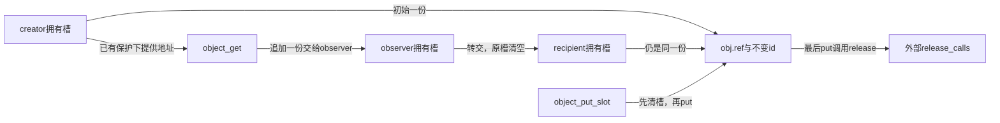
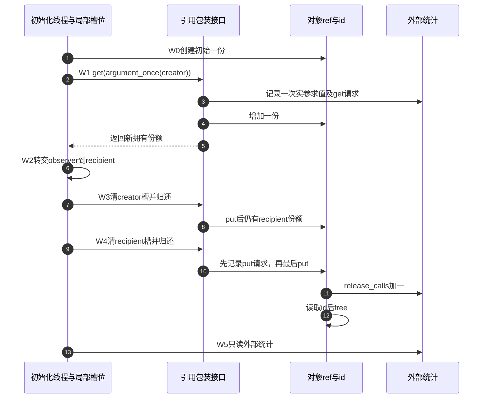

# 第29章\_引用封装与调试责任模板

上一章把一次成功打开交付给file的一份，与最终release对应起来。写进实际工程以后，调用者最好不必每次都记住结构体内kref的成员名和释放回调。对象专用的get、put和交付接口可以把这些细节集中起来，也让审查者沿名字看出责任方向。

但包装函数只组织约定，不创造访问资格。把一个悬空地址交给object_get，和直接对它调用kref_get同样错误；在put以后补一条读取obj->id的日志，反而可能使调试版本先发生越界访问。本章用一个没有外部入口的同步模块观察包装、转交、清空槽位和日志，继续使用已经建立的普通引用契约。

## 29.1\_接口先交代谁拥有哪一份

先把每个包装函数当成一份小合同。object_get要求调用者已经有有效地址和正计数依据，成功路径追加一份，由返回值的接收者负责。object_put消费调用者已有的一份，可能同步触发最终清理。object_put_slot接受一个存放拥有型指针的局部槽位，先把槽位清空，再归还原份额；空槽无需归还。

这里的“槽位”就是一个明确承担责任的指针变量，或者有独立同步保护的字段，并不是kref内核对象。相同地址放进两个变量，只有两份实际引用时才能把两个变量都看作拥有型槽位。单纯复制一个指针再分别put，不会因为两个变量名字不同就自动合法。

| 操作 | 输入条件 | 返回后责任 |
| --- | --- | --- |
| object_create | 创建参数合法 | 成功交付初始一份，失败返回ERR_PTR而没有对象 |
| object_get | 地址有效且计数有正数保护 | 新增一份，原持有者的一份仍在 |
| object_put | 当前调用者恰好有一份可归还 | 这份已结束；可能触发最终回收 |
| object_put_slot | 槽位本身可访问，内容为空或拥有一份 | 先清空槽位，非空时归还一次 |
| recipient = observer; observer = NULL | observer确实拥有一份且此处独占两个变量 | 转交已有责任，不改变计数 |

NULL与ERR_PTR要分开处理。NULL可以被某个明确声明的“可空归还”接口当作没有责任；ERR_PTR编码的是错误，不是对象，也不是一份可归还的引用。仅写if(obj)不会滤掉错误指针。本例工厂返回ERR_PTR，所以创建者先IS_ERR分支返回，不能直接交给可空的put_slot。统一封装的价值首先是把这类条件说清，而不是把所有输入都悄悄忽略掉。



## 29.2\_完整程序把日志放在安全位置

下面的[note_kref_api.c](../../../../labs/kernel/object_lifetime/materials/note_kref_api.c)在模块初始化中完成所有动作，没有线程共享槽位。trace_events参数控制事件日志；引用动作始终执行。get_requests和put_requests是操作请求次数，release_calls记录进入最终清理，argument_calls用于检验宏参数求值次数，全部保存在对象以外。

object_get与object_put宏只是给函数附上调用位置。__func__是当前函数名，__LINE__是源文件行号；obj实参在宏展开中只出现一次。argument_once返回借用地址并增加计数，本身不get，用它作为宏实参就能观察是否发生重复求值。创建、模块参数与错误指针等基础写法沿用[P16创建模板](P16_对象创建与失败清理模板.md#16.2.2_模板二_alloc/init/get/put/release_分层模板)。

```c
// SPDX-License-Identifier: GPL-2.0
#include <linux/err.h>
#include <linux/kref.h>
#include <linux/module.h>
#include <linux/slab.h>

struct api_object {
    struct kref ref;
    unsigned int id; /* 初始化后不变，拥有引用时可读取。 */
};
static bool trace_events = true;
module_param(trace_events, bool, 0444);
MODULE_PARM_DESC(trace_events, "打印引用操作请求，不改变引用动作");
static unsigned int get_requests, put_requests, release_calls, argument_calls;

static void object_release(struct kref *ref)
{
    struct api_object *obj = container_of(ref, struct api_object, ref);
    ++release_calls;
    if (trace_events)
        pr_info("note_api: release id=%u\n", obj->id);
    kfree(obj); /* 最后一次对象字段读取已经结束。 */
}
/* 输入须有合法地址和正计数保护；返回值代表新增的一份。 */
static struct api_object *object_get_at(struct api_object *obj,
                                      const char *function, unsigned int line)
{
    ++get_requests;
    if (trace_events)
        pr_info("note_api: get request id=%u at %s:%u\n", obj->id, function, line);
    kref_get(&obj->ref);
    return obj;
}
/* 归还调用者的一份；不接受NULL、错误指针或借用份额。 */
static void object_put_at(struct api_object *obj,
                          const char *function, unsigned int line)
{
    ++put_requests;
    if (trace_events)
        pr_info("note_api: put request id=%u at %s:%u\n", obj->id, function, line);
    kref_put(&obj->ref, object_release);
    /* 此后不读取obj；统计放在外部静态存储中。 */
}
#define object_get(obj) object_get_at((obj), __func__, __LINE__)
#define object_put(obj) object_put_at((obj), __func__, __LINE__)

/* 接受空的责任槽位；非空必须恰好拥有一份，不能放ERR_PTR。 */
static void object_put_slot(struct api_object **slot)
{
    struct api_object *owned = *slot;
    *slot = NULL; /* 先撤销本地责任记录，再触发可能的最终清理。 */
    if (owned)
        object_put(owned);
}
static struct api_object *object_create(unsigned int id)
{
    struct api_object *obj = kzalloc(sizeof(*obj), GFP_KERNEL);
    if (!obj)
        return ERR_PTR(-ENOMEM);
    kref_init(&obj->ref);
    obj->id = id;
    return obj;
}
/* 仅用于观察宏参数求值次数，返回借用地址，不增加责任。 */
static struct api_object *argument_once(struct api_object *obj)
{
    ++argument_calls;
    return obj;
}
static int __init note_api_init(void)
{
    struct api_object *creator, *observer = NULL, *recipient = NULL;
    creator = object_create(7);
    if (IS_ERR(creator))
        return PTR_ERR(creator); /* 工厂没有交付对象，不调用put_slot。 */
    observer = object_get(argument_once(creator));
    recipient = observer; /* 显式转交：引用计数不变。 */
    observer = NULL;
    object_put_slot(&observer); /* 空槽没有一份可还。 */
    object_put_slot(&creator);
    pr_info("note_api: recipient id=%u release_calls=%u\n", recipient->id, release_calls);
    object_put_slot(&recipient);
    object_put_slot(&recipient); /* 同一局部槽已为空，不是再次归还旧份额。 */
    pr_info("note_api: get_requests=%u put_requests=%u releases=%u argument_calls=%u\n",
            get_requests, put_requests, release_calls, argument_calls);
    return 0;
}
static void __exit note_api_exit(void)
{
    /* 所有动作均在init同步完成，无外部入口、共享槽位或异步来源。 */
}
module_init(note_api_init);
module_exit(note_api_exit);
MODULE_LICENSE("GPL");
MODULE_DESCRIPTION("引用封装、单次求值与清空责任槽位实验");
```

把程序运行过程分成同一组阶段，后面的日志也据此解释：

| 阶段 | 写入和读者 | 当前责任与后续条件 |
| --- | --- | --- |
| W0 | object_create写ref=1和不变id | creator持初始一份；失败没有交付 |
| W1 | argument_once计次，object_get_at记录请求并调用get | creator和observer各一份；实参只求值一次 |
| W2 | 初始化线程把observer写入recipient并清空observer | 原份额换主人，ref仍为2；空槽归还没有动作 |
| W3 | put_slot清creator再put | recipient仍保活对象，release_calls仍为0 |
| W4 | put_slot清recipient再put，release读取id后free | 最后一份结束，外部release_calls变为1 |
| W5 | 初始化线程读取外部统计 | 不再读取对象；重复处理空recipient无动作 |



注意object_put_slot里的宏记录的是object_put_slot这个函数中的行号，因为那里才是宏展开点。它没有自动记录是谁调用了put_slot。若排查需要外层责任位置，应给槽位接口也显式传入位置或原因，不能把一条间接调用日志说成完整调用链。

原有调试模板用__builtin_return_address(0)取得返回地址，再用内核%pS格式输出符号。这个办法保留为可选诊断线索，但返回位置与源代码责任槽位不是同一身份；采用内联、优化或改变包装层时，应核对实际构建和体系结构约定。当前模块选显式函数名/行号，使这个教学问题无需依赖栈回溯，真实子系统需要统一追踪时再选择其现有trace或ref tracker接口。

## 29.3\_先预测再切换事件输出

W2只转交，不get也不put；W3保留recipient；W4最后释放。因此正常程序应得到get_requests=1、put_requests=2、releases=1、argument_calls=1。两个空槽调用与重复处理已经清空的recipient都不增加put_requests。若只数变量赋值次数或宏调用语法出现次数，就会得到错误的预测。

按[P16构建环境](P16_对象创建与失败清理模板.md#%282%29_构建_预测和观察)生成模块，Makefile已登记note_kref_api.o。以下命令要求匹配运行内核的模块文件：

```bash
sudo insmod ./note_kref_api.ko trace_events=1
sudo rmmod note_kref_api
sudo dmesg | tail -n 20
sudo insmod ./note_kref_api.ko trace_events=0
sudo rmmod note_kref_api
sudo dmesg | tail -n 20
```

第一次可以看到get请求、两次put请求及release事件；第二次关闭这些事件，仍保留recipient观察和最终统计。两次装载各自重新初始化静态统计，最终四个数字应一致。若关闭日志会少get一次，说明拥有动作被错误地放进日志条件；如果开启日志才崩溃，应先检查日志读取是否越过最后put，不能先认定是打印速度改变了硬件时序。

本批实际执行六组宿主C协议：两种日志设置的完整路径、两种设置的分配失败、重复空槽、两个独立拥有槽。保留固定普通引用实现，分配与原子操作为顺序替身，验证两种设置输出条数与责任计数、只求值一次及零泄漏。ARM前端读取354个头，其中342个非生成源码头与官方dfaf2136无差异。未执行目标链接装卸、动态调试开关、真实并发记录或硬件内存序。

## 29.4\_日志能证明什么

本例日志明确写request，因为打印发生在引用操作之前。它证明执行到了这个包装点，不能证明后续操作已经完成，更不能在非法输入或refcount饱和时虚构一份可用责任。release日志在真正的最终回调内部、释放存储以前打印，才对应“进入最终清理”；即便如此，也不能被推广为所有延后回调和外部资源都已经退出。

若必须在put返回后记录完成，应先复制不依赖对象存储的标量，例如本次生命周期编号，再归还，最后只打印那份副本。复制char *name仍可能指向即将释放的对象内部，不能代替复制字符串内容。读取当前refcount也不形成新的保护，不能先put再看是否归零来决定能否继续访问。

本例id恒为7且只创建一个对象，足以解释局部顺序。长时间运行的驱动会复用地址，也可能复用业务编号；要关联跨线程日志，应另有生命周期标识、责任槽位、事件种类与丢失记录的检测。静态请求计数在本例由一个线程写，不是可直接搬到并发驱动的无锁统计。实际并发日志还可能限流、关闭、丢失或以不同顺序输出；[P12原因标签与证据边界](P12_典型错误模式与调试线索.md#12.9.2_调试方法二_给_get/put_加原因标签)继续解释这些问题。

源码沿[kref总阅读索引](../../../../research/source_reading/kref/navigation/P01_Linux_6.12_kref源码阅读索引.md#1.2_按问题进入已落地证据)进入[封装接口导读](../../../../research/source_reading/kref/navigation/P02_普通引用与归零回调导读.md#2.26_封装不改变原语前提)，再核对[普通取得](../../../../research/source_reading/kref/source_explanations/include/linux/kref.h.md#1.3_为独立使用追加引用)和[最后归还](../../../../research/source_reading/kref/source_explanations/include/linux/kref.h.md#1.4_最后归还调用清理)。包装函数能固定回调、集中注释和观测点，kref原语仍不验证调用者是否真正拥有对应份额。

## 29.5\_封装没有替你同步共享槽位

object_put_slot先清空，再执行put，适合这里的独占局部变量。它不包含原子交换或锁，也没有向其他线程广播“对象消失”。两个线程同时访问同一个槽位仍可能读到相同旧指针并各put一次；需要共享责任转移时，应在真实协议中用锁或适用的原子操作取得唯一消费权，并证明访问存储本身仍有效。

同样，清空creator不清空其他别名。一个借用指针不会因为拥有槽归零而自动变成NULL；若借用范围已经结束，继续解引用仍是错误。反过来，recipient仍有独立份额时，结束creator也不应强制清空recipient。接口的目标是精确结束一份责任，不是扫描并销毁所有看起来相同的地址。

第一题，把宏写成先打印(obj)->id再调用object_get_at(obj,...)，并保留argument_once实参。预测argument_calls会变成多少；再设计一个取队列元素的实参，解释重复求值为什么可能不只是多一条日志。修复应让参数只传入一次，由普通函数完成记录和动作。

第二题，删掉observer=NULL但保留recipient=observer与两个槽位的清理。画出W2后的变量与真实份额，指出哪一个变量只是重复别名。不要通过加一个无来由的get让测试数字好看，应先决定这里究竟是转交还是分享。

第三题，把工厂改成失败返回NULL，同时保持当前IS_ERR判断。错误分支会被跳过，下一步便拿不到合法地址。变更错误约定必须同步全部调用方和失败检查，不能只换工厂的return形式。

封装现在让输入前提、成功责任、失败责任和日志位置都可见。下一单元继续检查状态机：即使调用接口已经正确，观察到LIVE以后还能否在解锁后开始任意业务，仍需要单独证明。

专题导航：[kref工程模板路线](大纲.md#1.14_工程模板)。

上一篇：[文件实例与私有对象持有](P28_文件实例与私有对象持有模板.md#28.1_计数单位是文件实例)。

下一篇：[状态观察与活动接纳](P30_状态观察与活动接纳模板.md#30.1_LIVE不是一张永久通行证)。
