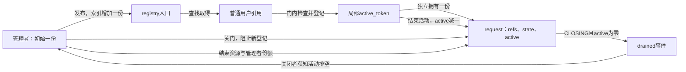
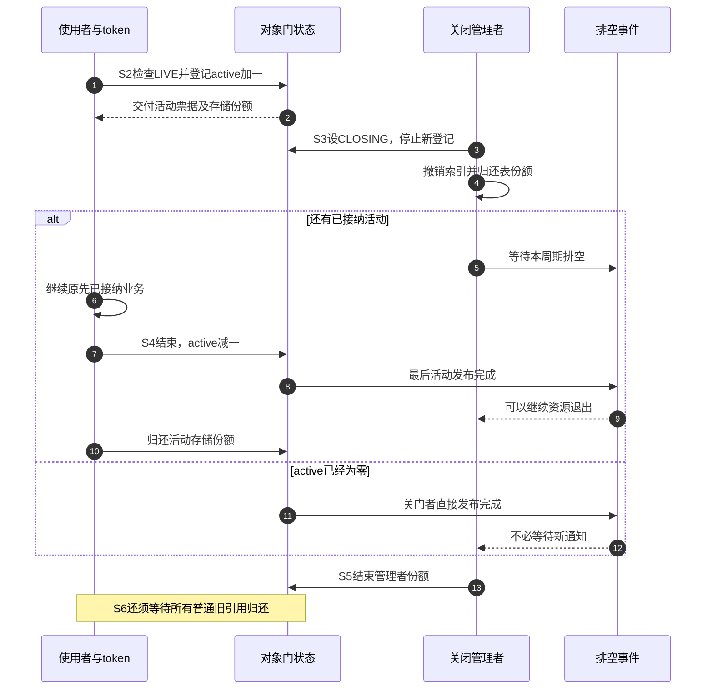

# 第30章\_状态观察与活动接纳模板

上一章的包装接口让每份责任有了明确入口。现在考虑一个看起来很谨慎的使用者：先取得对象引用，锁住状态，确认LIVE，解锁，然后访问设备。关闭者也锁住状态，把LIVE改为CLOSING，再释放设备资源。两个线程都用了锁，引用也没有丢，为什么仍然可能访问已经退出的硬件？

缺的是 **业务接纳与结束的协议**。状态检查只回答过去那个锁窗口里是否可用；引用只保证对象存储。检查后解锁既没有完成整个操作，也没有告诉关闭者“我已经被接纳，请等我完成”。本章把这个缺口转成可运行的C模型，再分别映射到短操作的锁内完成和长操作的活动登记。

## 30.1\_LIVE不是一张永久通行证

先按时间排列旧方案。使用者在t0看见LIVE并解锁；关闭者在t1取得锁，写CLOSING，然后结束硬件资源；使用者在t2才开始业务。t0和t1的锁保护都是真实的，仍没有任何状态记录t0到t2之间还有一个待执行操作。即使对象引用很多，关闭者也不能从计数判断哪些用户正在访问硬件，哪些只是保存名称、等待结果或准备退出。

短操作可以把检查与整个字段访问放在同一个互斥区。关闭者取得同一锁时，先前的短操作已经结束，后来者看到关闭状态后拒绝。[P28文件模块](P28_文件实例与私有对象持有模板.md#28.2_把取得与失败放在同一个回调里)的STEP正是这种安排，它不需要额外active字段。

若业务要在解锁后继续，例如等待硬件、跨函数处理或交给另一个执行者，就要把“被接纳”存成关闭者可见的状态。在同一门锁里检查LIVE并增加active，完成后在同一协议下减少active；关闭者先关门阻止新增，再等待已经登记的active归零。这里active表示活动数量，不是引用数量。每个活动还需要自己的存储期限：本例为活动另取一份，也可以在其他设计中由管理者保持对象直到活动排空，但不能混用归还规则。

| 状态组 | 回答的问题 | 本例承载位置 |
| --- | --- | --- |
| 对象引用 | 谁还需要对象存储 | request.refs，顺序教学计数 |
| 业务状态 | 是否接纳新的活动 | request.state，NEW/LIVE/CLOSING |
| 索引可见性 | 新调用者还能在哪里发现对象 | 全局registry单槽，非空时拥有一份 |
| 活动登记 | 关闭前接纳的操作是否结束 | request.active与各使用者的active_token |
| 排空事件 | 等待者何时可以继续资源退出 | request.drained与notifications，模型中的事件记录 |

这是多组正交状态，不应硬塞成一条“NEW→LIVE→DYING→DEAD即可解释一切”的枚举。CLOSING可以同时伴随索引未撤、活动未完、旧引用仍在；drained为真也可能仍有很多只持存储的用户。

## 30.2\_同一个关闭周期有哪几步

本例只允许一次发布和一次关闭周期，不重新启用。NEW表示尚未发布，LIVE允许登记活动，CLOSING拒绝新活动。原模板中的DYING在这里命名为CLOSING，强调正在执行关闭协议，并不表示存储已经不可访问。对象free后的终点用外部releases计数观察，不要求在已释放存储里继续保留一个可查询的DEAD值。



| 阶段 | 进入事件与状态修改 | 谁写、谁读、何时退出 |
| --- | --- | --- |
| S0 | 创建NEW，refs=1，active=0 | 创建者独占，失败可直接归还初始份额 |
| S1 | 发布时追加索引份额、设LIVE并写registry | 查找者在一致的索引/状态协议下发现并取得普通份额 |
| S2 | begin检查LIVE，增加active、取得活动份额、写token | 局部用户将活动公开登记；关闭者此后必须计入它 |
| S3 | close设CLOSING；unpublish撤registry并归还索引份额 | 拒绝新的查找/活动，原token仍可使用直到finish |
| S4 | finish清token、active减一；最后活动报告drained | 分散活动的结束汇聚为关闭条件，再归还各自活动份额 |
| S5 | 关闭者确认drained，完成外部资源退出并归还自己的份额 | 普通旧用户仍可持存储，但不能重新begin |
| S6 | 所有存储份额最后归还 | 最终回调回收外壳；不必由关闭者执行 |

S3没有活动时直接发布drained，不需要等一位不存在的执行者来通知。反之，S4还剩一个活动就不能发布完成。事件是“一次关闭周期内所有已接纳活动结束”，不是“某个任意操作结束过一次”，所以一个使用者完成不能替所有兄弟使用者作证。



图中的事件实现要由目标系统提供。下面的C模型只把drained写成共享结果，不实现阻塞或唤醒；映射到Linux时，必须同时解释写入、完成通知、等待资格与回调退出，不能把模型中的一个bool赋值当成唤醒原语。

## 30.3\_用C程序检查十种完整路径

[state_ownership.c](../../../../labs/kernel/object_lifetime/materials/state_ownership.c)是独立C11顺序模型，不是内核模块，refs不是原子kref。每个函数调用被视为一个已经串行化的协议步骤，main用不同顺序暴露错误认识；它不能直接多线程运行。active_token是使用者手里的活动票据，只有begin成功才取得，finish消费一次。报告函数只在首次满足关闭且active为零时记录一次通知。

```c
// SPDX-License-Identifier: GPL-2.0
#include <assert.h>
#include <stdbool.h>
#include <stdio.h>
#include <stdlib.h>

/* 顺序协议模型：每次函数调用代表一个已串行化步骤，不实现线程或Linux锁。 */
enum object_state { OBJECT_NEW, OBJECT_LIVE, OBJECT_CLOSING };
struct request {
    unsigned int refs, active, completed, notifications;
    enum object_state state;
    bool drained;
};
struct active_token { struct request *object; };
static struct request *registry; /* 拥有型单槽，非空时持有一份。 */
static unsigned int live_objects, releases;

static struct request *request_create(bool fail)
{
    if (fail)
        return NULL; /* 显式注入分配失败。 */
    struct request *obj = calloc(1, sizeof(*obj));
    if (!obj)
        return NULL;
    obj->refs = 1;
    obj->state = OBJECT_NEW;
    ++live_objects;
    return obj;
}
static void request_get(struct request *obj)
{
    assert(obj && obj->refs);
    ++obj->refs;
}
static void request_put(struct request *obj)
{
    assert(obj && obj->refs);
    if (--obj->refs)
        return;
    assert(registry != obj && obj->active == 0);
    --live_objects;
    ++releases;
    free(obj); /* NEW的初始化失败也允许直接最终回收。 */
}
static bool request_publish(struct request *obj)
{
    assert(obj && obj->refs);
    if (registry || obj->state != OBJECT_NEW)
        return false;
    request_get(obj);
    obj->state = OBJECT_LIVE;
    registry = obj;
    return true;
}
static struct request *request_lookup_get(void)
{
    if (!registry || registry->state != OBJECT_LIVE)
        return NULL;
    request_get(registry);
    return registry;
}
static bool request_unpublish(struct request *obj)
{
    if (registry != obj)
        return false;
    registry = NULL;
    request_put(obj); /* 只在实际移除时消费登记份额。 */
    return true;
}
static bool request_begin(struct request *obj, struct active_token *token)
{
    assert(obj && obj->refs && token->object == NULL);
    if (obj->state != OBJECT_LIVE)
        return false;
    ++obj->active;
    request_get(obj); /* 这次活动除登记外，还独立拥有存储份额。 */
    token->object = obj;
    return true;
}
static void report_drained(struct request *obj)
{
    if (obj->state == OBJECT_CLOSING && obj->active == 0 && !obj->drained) {
        obj->drained = true;
        ++obj->notifications; /* 模拟一次关闭事件发布，不是实际唤醒原语。 */
    }
}
static void request_close(struct request *obj)
{
    assert(obj && obj->refs);
    obj->state = OBJECT_CLOSING;
    report_drained(obj);
}
static void request_use(struct active_token *token)
{
    assert(token->object && token->object->active);
    ++token->object->completed; /* 关门前接纳的活动可以继续，关闭者须等它结束。 */
}
static void request_finish(struct active_token *token)
{
    struct request *obj = token->object;
    assert(obj && obj->active);
    token->object = NULL;
    --obj->active;
    report_drained(obj);
    request_put(obj); /* 此后不再访问obj；这是活动份额的归还。 */
}
static void reset_case(void)
{
    assert(!registry && !live_objects);
    releases = 0;
}
int main(void)
{
    struct request *owner, *reader, *other;
    struct active_token first = { NULL }, second = { NULL };

    reset_case(); /* 1：分配失败没有对象或责任。 */
    assert(request_create(true) == NULL && releases == 0);
    reset_case(); /* 2：未发布的NEW可以直接结束。 */
    owner = request_create(false); assert(owner);
    request_put(owner); assert(releases == 1);
    reset_case(); /* 3：完整关闭，旧活动结束才报告排空。 */
    owner = request_create(false); assert(owner && request_publish(owner));
    reader = request_lookup_get(); assert(reader == owner);
    assert(request_begin(reader, &first));
    request_close(owner); assert(!owner->drained && registry == owner);
    assert(request_lookup_get() == NULL && !request_begin(reader, &second));
    assert(request_unpublish(owner) && !request_unpublish(owner));
    request_use(&first); request_finish(&first);
    assert(owner->drained && owner->notifications == 1 && owner->refs == 2);
    request_put(reader); request_put(owner); assert(releases == 1);
    reset_case(); /* 4：只有旧引用、没有活动，关门立即报告排空。 */
    owner = request_create(false); assert(owner && request_publish(owner));
    reader = request_lookup_get(); request_close(owner);
    assert(owner->drained && !request_begin(reader, &first));
    request_unpublish(owner); request_put(owner);
    assert(releases == 0); request_put(reader); assert(releases == 1);
    reset_case(); /* 5：多活动汇聚，第一次结束不能提前完成。 */
    owner = request_create(false); assert(owner && request_publish(owner));
    assert(request_begin(owner, &first) && request_begin(owner, &second));
    request_close(owner); request_unpublish(owner); request_finish(&first);
    assert(!owner->drained && owner->active == 1);
    request_finish(&second); assert(owner->drained && owner->notifications == 1);
    request_put(owner);
    reset_case(); /* 6：重复关闭只发布一次事件。 */
    owner = request_create(false); assert(owner && request_publish(owner));
    request_close(owner); request_close(owner);
    assert(owner->notifications == 1); request_unpublish(owner); request_put(owner);
    reset_case(); /* 7：关闭后的NEW不再允许发布。 */
    owner = request_create(false); assert(owner); request_close(owner);
    assert(!request_publish(owner)); request_put(owner);
    reset_case(); /* 8：占用槽位时第二对象发布失败，不产生表份额。 */
    owner = request_create(false); other = request_create(false);
    assert(owner && other && request_publish(owner) && !request_publish(other));
    assert(other->refs == 1 && other->state == OBJECT_NEW); request_put(other);
    request_close(owner); request_unpublish(owner); request_put(owner); assert(releases == 2);
    reset_case(); /* 9：LIVE快照不能作为后续业务的进入票据。 */
    owner = request_create(false); assert(owner && request_publish(owner));
    bool was_live = owner->state == OBJECT_LIVE;
    request_close(owner); assert(was_live && owner->drained);
    assert(!request_begin(owner, &first));
    request_unpublish(owner); request_put(owner);
    reset_case(); /* 10：最后一个活动也可以成为最终回收者。 */
    owner = request_create(false); assert(owner && request_publish(owner));
    assert(request_begin(owner, &first)); request_close(owner); request_unpublish(owner);
    request_put(owner); assert(releases == 0);
    request_use(&first); request_finish(&first); assert(releases == 1 && !first.object);
    reset_case();
    puts("10 state/ownership paths passed; no threads or Linux synchronization simulated");
    return 0;
}
```

第三条路径在close后仍能看到registry指向对象，但lookup拒绝CLOSING；随后才撤销索引。已经取得token的活动仍能调用use，因为关闭者尚未越过排空阶段。普通reader只有引用时却不能再次begin。这个差别就是“存储资格”与“已接纳活动资格”的区别。

第九条路径保留was_live=true，再让关闭者关门并报告排空。旧快照仍为真，但新的begin会失败。程序没有真正执行越界硬件访问；它用两个仍有效的状态值展示旧快照为何不能作为执行资格，避免用未定义行为的结果来“证明”错误。

第十条路径让管理者先结束自己的存储份额，只留下活动份额，最后finish成为最终回收者。这是存储协议测试，不是允许真实module_exit带着未退出工作线程返回：代码寿命与回调尾部退出还需独立等待。

### 30.3.1\_编译与预测

在材料目录运行，下列命令只创建临时宿主程序，不需要加载模块或设备：

```bash
cc -std=c11 -Wall -Wextra -Werror -O2 state_ownership.c -o /tmp/state_ownership
/tmp/state_ownership
```

程序应打印10条状态/责任路径通过的汇总。运行前先回答三个问题：第三条路径第一次close时drained为什么为false？第四条路径仍有reader，为什么drained已经为true？第二条路径未进入LIVE或CLOSING，为什么可以直接free？答案分别来自活动尚未结束、引用不等于活动、未发布的初始化对象也有合法失败清理。

本批已经用宿主C11严格编译并执行十条路径，覆盖创建失败、NEW直接回收、完整关闭、只剩普通引用、多活动汇聚、重复关闭、关闭后拒绝发布、槽位冲突、过期快照及活动最后回收。没有执行Linux锁、完成事件、线程调度或硬件，本模型也不新增ARM编译结论。

## 30.4\_映射到Linux时补上真实通信

短业务继续使用P28 gate内检查与完整操作即可。长业务若采用活动登记，state、active和“是否已经发布本周期排空”必须由同一门锁或等价协议保护；begin不能解锁后才增加active，否则关闭者可能在这段空窗观察到零并先释放资源。各使用者token在本地保存，active的写入才使局部活动变成关闭者可观察的共享事实。

索引还需要自己的地址保护。可以规定查找按“索引锁→对象门锁”顺序取得存储份额并检查状态；关闭时先在门锁内关门，释放门锁，再取得索引锁撤下。不要一边同时持索引锁等门锁，另一边同时持门锁等索引锁。拥有型表保证成员计数为正，才允许在该窗口普通get；非拥有型表要重新处理零计数等待摘链的窗口，不能照搬这个条件。

报告排空通常可以用一次关闭周期的完成事件承接：关门时active已经为零，由关门者发布；否则由最后一个finish发布。等待者本身仍要持对象或由外层保证其存储，等待时不能持有finish需要取得的门锁。多个关闭等待者还要选择能唤醒全部等待者的协议，不能让普通completion的一枚令牌只被第一个等待者消费。完成事件、complete_all和旧代次复用的边界见[P22等待模板](P22_完成事件与等待者工程模板.md#22.1_等待之前先取得合法对象)。

若完成通知发在最后活动函数返回前，等待者获知的是“受登记保护的业务已结束”，不自动证明回调栈已经退出。还需销毁队列或使用相应同步退出接口来保证代码、队列和回调尾部安全；[P24关闭与排空](P24_删除入口与活动排空工程模板.md#24.1_关闭业务不等于回收所有对象)已经用完整工作模块说明这些层次。本模型notifications只表示一次事件发布，没有真正实现wait或唤醒。

state也不必由所有release强制写成DEAD。在最后引用回调中写调试状态可以帮助观察，但不能让无引用者靠读取该字段判断地址是否有效。未发布NEW失败直接释放、最后活动执行最终回调、非拥有索引在回调里摘链，都可能使“一律先DYING再到release”的断言失效。release若取得mutex，还要逐一检查所有可能最后put的上下文和锁序，不能在原子上下文中照搬可睡眠清理。

固定源码边界沿[kref总阅读索引](../../../../research/source_reading/kref/navigation/P01_Linux_6.12_kref源码阅读索引.md#1.2_按问题进入已落地证据)进入[业务接纳导读](../../../../research/source_reading/kref/navigation/P02_普通引用与归零回调导读.md#2.27_业务状态与引用原语的分工)。kref只兑现[普通引用增加](../../../../research/source_reading/kref/source_explanations/include/linux/kref.h.md#1.3_为独立使用追加引用)与[最后归还回调](../../../../research/source_reading/kref/source_explanations/include/linux/kref.h.md#1.4_最后归还调用清理)，不会自动维护state、索引、active或完成事件。

## 30.5\_改变关闭协议前先找反例

第一题，把begin拆成“检查LIVE”和“增加active”两个可交错步骤，在它们中间插入close。先预测drained的值，再指出关闭者与使用者各自会误以为什么已成立。修复位置是检查与登记的共同串行化窗口，不是单纯把active换成原子整数。

第二题，保留两个活动，但在任意finish中直接设置drained=true。第五条路径会在哪条断言失败？完成事件汇聚的是全部旧活动的结束证据，不能用第一次完成冒充最后一次完成。

第三题，允许CLOSING重新回到LIVE，却不重置drained，也不区分旧token与新token。上一周期的完成可能使下一次关闭直接越过等待。一次性关闭是本例的重要前提；需要重用时，必须重新设计代次、旧活动退出、事件重置和发布顺序，不能只新增一条状态图箭头。

状态图现在能够与实际拥有责任、活动登记和关闭通知对齐。下一单元整理接口注释、借用、释放依赖与模块退出，让这些条件在工程交付时也能被调用者看见。

专题导航：[kref工程模板路线](大纲.md#1.14_工程模板)。

上一篇：[引用封装与调试责任](P29_引用封装与调试责任模板.md#29.1_接口先交代谁拥有哪一份)。

下一篇：[返回约定与收尾模板](P13_工程模板.md#13.8_约定和收尾模板_注释_borrow_release_退出_断言)。
