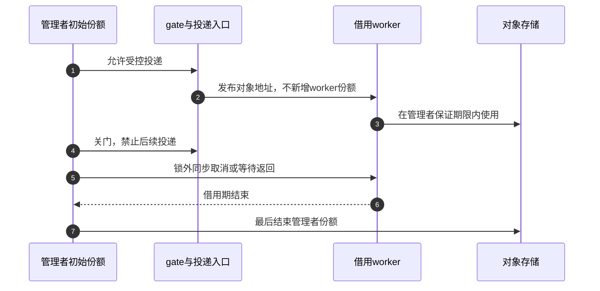
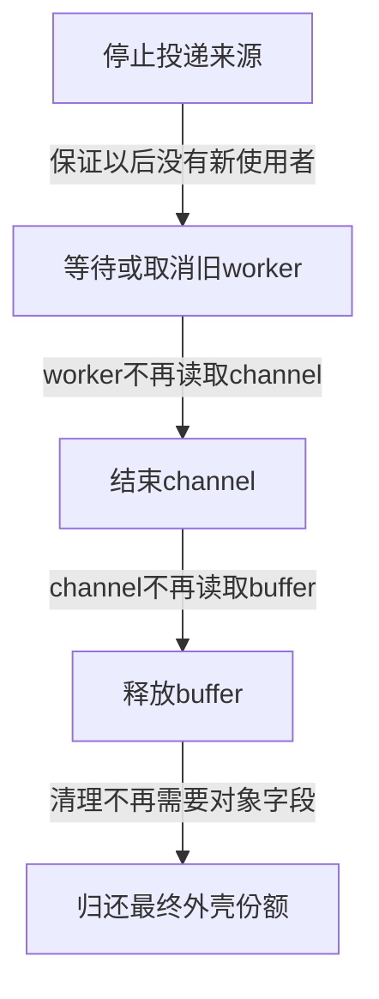

# 第31章\_接口契约与退出审查模板

P16～P30已经把创建、查找、交付、关闭和最后清理落实为完整程序。本篇作为工程查询页，帮助你把这些协议写进接口注释，并在提交驱动时检查退出依赖。它不引入一套新的统一对象框架：先选择与你的场景一致的完整模板，再用这里的问题核对调用方是否真正具备前提。

查询顺序仍有因果关系。接口先说明取得和交付责任；借用注明有效期限；退出先停来源、结束依赖，最后归还对应份额；断言只能观察已经建立的保证。不能把一句“release会清理”写进所有接口，随后把初始化失败、工作线程退出和硬件停机都推给最后一个put。

## 31.1\_把成功和失败分别写进注释

下面是四种接口契约的中文写法。声明用于展示注释格式，不是材料目录新增的可链接接口；对应实现分别沿[P17拥有型查找](P17_拥有型链表工程模板.md#17.1_拥有型链表的发布与撤下)、[P20分享与转交](P20_工作交付与关闭工程模板.md#20.1_先选择分享还是转交)及本篇借用条件选择。函数名是提示，真正约定必须与实现一致。

### 31.1.1\_取得型接口

```c
/*
 * object_lookup_get：按编号查找并交付一份对象引用。
 * 成功：返回对象，调用者拥有新增的一份，最终必须object_put。
 * 失败：返回NULL，没有交付对象，也没有一份需要调用者回滚。
 * 取得窗口由实现内部的索引锁保护；不保证返回后业务仍为LIVE。
 * 返回值不能与另一接口的ERR_PTR失败约定混用。
 */
static struct my_object *object_lookup_get(int id);
```

“返回一份”必须能在实现里找到来源：新增get、转交表份额或交付初始份额都可以，但必须选择一种。只有找到地址、解锁以后才get不满足这个契约。这里还要区别存储资格与业务资格：lookup_get_live可以保证当时状态，解锁后的操作仍按[P30活动接纳](P30_状态观察与活动接纳模板.md#30.1_LIVE不是一张永久通行证)处理。

### 31.1.2\_转交型接口

```c
/*
 * object_enqueue_take：尝试把调用者当前拥有的一份交给队列。
 * 输入：obj有效，调用者确实拥有将要转交的一份；队列自身仍可用。
 * 成功返回0：该份额归接收者，接收者可能已执行并归还。
 * 调用者不能再凭这份已转交责任访问或put对象。
 * 失败返回负错误码：没有发生交付，原份额仍归调用者。
 * 若调用者还独立拥有另一份，另一份的访问资格须单独证明。
 */
static int object_enqueue_take(struct my_queue *queue, struct my_object *obj);
```

转交的时点必须早于接收者可能使用对象的时点，不能等提交函数返回以后才给对方补get。这里选择“失败不消费”的契约；另一个接口可以合法选择“调用即消费”，但那时所有失败分支和调用方都要一起改变，不能让名字take代替说明。

### 31.1.3\_分享型接口

```c
/*
 * object_enqueue_get：为接收者准备独立份额，调用者仍保留原份额。
 * 输入：调用者已有对象保护，队列的接纳协议允许尝试提交。
 * 成功返回0：接收者获得新增的一份，调用者仍须结算自己的一份。
 * 失败：候选新增份额由本函数回滚，调用者的原份额保持不变。
 * 不允许把同一份同时标成“调用者仍有”与“接收者也有”。
 */
static int object_enqueue_get(struct my_queue *queue, struct my_object *obj);
```

在[P20完整工作模块](P20_工作交付与关闭工程模板.md#20.1_先选择分享还是转交)中，分享模式拒绝提交时会归还候选，再结束创建者自己的份额；转交模式失败只有创建者份额可还。把两种路径的put数量机械复制到一起，会出现多还或漏还。

### 31.1.4\_借用型接口

```c
/*
 * object_peek_locked：在拥有型表锁保护内返回借用地址。
 * 调用者已持有table_lock，表成员自身持有目标的一份。
 * 返回NULL表示没有匹配成员；非空返回值不新增调用者份额。
 * 地址只在该锁保护区内有效，不保存给锁外或异步使用，不put。
 * 若需独立使用，必须在仍有地址与正计数依据时完成取得。
 */
static struct my_object *object_peek_locked(int id);
```

这段注释特意写“拥有型表”。如果成员不持引用，最后一个用户可能已经把计数降到零，只因release等待表锁而暂未摘节点；此时锁内看到节点不等于可普通get。[P27非拥有链表](P27_父子桥接与非拥有链表模板.md#27.1_一条关系对应几份引用)与[P26弱缓存](P26_弱缓存撤销与RCU回收模板.md#26.1_新读区为什么救不了旧缓存)分别处理这些差异。

## 31.2\_借用期限可以由什么保护

锁内借用最容易观察：持锁找到对象、完成字段操作、解锁，从未建立独立引用，所以没有put。但锁还必须同时保护这段字段访问所依赖的状态，不能因为它能阻止节点删除，就推出所有字段都不变。

需要锁外独立使用时，可以在锁内依据表份额get，再解锁；之后按自己的份额访问，最终put。顺序必须是“地址保护仍在→取得独立份额→退出原保护”，不能先失去原保护再补一次引用。取得只保活存储，业务接纳继续使用对象门锁或活动登记。

借用也不只限于同步函数。管理者可以保留初始份额，发布工作以后停止新投递，等待所有借用worker返回，最后才归还初始份额。[P24完整管理者模块](P24_删除入口与活动排空工程模板.md#24.3_完整管理者模块的资源分层)的owned_worker便没有自己的份额，结束时不能put；它的保护范围是管理者等待覆盖的整个回调期限，而不是某个局部互斥区。



这个设计的代价是关闭者必须真正等到全部借用者结束；worker不能逃逸到一个未登记的定时器或回调，再让管理者误以为等待已完成。采用独立worker份额则允许对象存储由worker保留更久，但仍不会自动保活队列、硬件或模块代码。选择应围绕实际等待能力与责任交付，而不是认定“异步必然get”或“借用更快”。

## 31.3\_释放顺序跟随依赖关系

“反初始化顺序”是常见结果，背后的理由是资源依赖。若channel保存buffer地址，channel清理还会读取buffer，就必须先结束channel再free buffer。若worker仍会使用channel，则必须先禁止新的worker并等旧worker退出，然后结束channel。最外层对象最后free，因为其他清理步骤还需要从它取出指针、锁或状态。



把初始化顺序倒过来不能自动处理所有情况。某个回调可能在初始化后期注册，却在注销过程中仍使用早期资源；另一个资源根本未初始化成功。错误路径要记录哪些责任已经建立，清理函数是否接受NULL或半初始化状态，以及资源是否已被另一分支消费。[P23十二条完整C路径](P23_分阶段失败与资源回滚模板.md#23.3_完整C程序比较十二条退出路径)分别演示显式清理与最终回调清理，不要求两种风格互斥，却要求同一非空资源只消费一次。

原模板把destroy_workqueue放进release，容易漏掉最后put由谁执行。如果最后put出现在该队列自己的worker里，release等待队列全部退出，而当前worker又要等release返回，便形成自等。正确分层通常是管理者关闭来源并在外部销毁队列，release只处理最后用户允许它结束的存储；不能看到对象里有queue指针就把destroy_workqueue塞进统一析构。


RCU对象还要看旧读者访问哪些字节。若旧读者能读外壳中的next指针和子资源，延迟free外壳却立即释放子资源仍可能留下悬空访问；若子资源只由已取得强引用且通过业务门的路径使用，它的退出期限可以不同。沿[P25归零后的保留范围](P25_RCU查找与业务关闭工程模板.md#25.4_归零以后还要保留什么)列出实际读路径，再安排回收，不按结构体嵌套位置猜期限。

## 31.4\_批量退出先收回哪些责任

从全局表一次摘出所有对象，可以缩短全局锁持有时间，但不意味着对象已经退出。一个可靠的批量方案至少要说明下列阶段；这是已有单对象退出协议的组合，不是新增未实现的destroy_all接口：

| 阶段 | 必须建立的事实 | 仍然不能推出的结论 |
| --- | --- | --- |
| E0停止来源 | 不再创建、发布、提交新任务；已有入口调用也受接纳协议约束 | 已有回调已经返回 |
| E1撤下集合 | 在索引锁内将可见成员撤下，并把对应表份额交给关闭者 | 外部用户份额归关闭者所有 |
| E2结束业务 | 在不持被等待路径所需锁的条件下关闭并排空活动 | 全部对象引用都消失 |
| E3归还私有份额 | 每个实际撤下成员恰好消费一份原表责任 | 其他引用不会稍后调用模块代码 |
| E4等待代码使用者退出 | 相应工作、定时器、文件和RCU回调均满足模块退出契约 | 任意一种等待接口能覆盖所有来源 |

如果把对象节点搬到一个私有临时链表，原表份额只是换了拥有者，不能在搬运时put一次、遍历临时表时又put一次。还要证明这条node此时不再被任何其他读者遍历；普通锁表可以在同锁协议下完成交接，RCU旧读者仍沿旧链接访问时不能随便重用同一个node。必要时采用独立关闭记录或等待相应读者期限，不能直接把list_for_each_entry_safe当成并发保护。

原注释“不要在全局锁内做可能睡眠的stop”也应按实际锁和依赖解释。mutex本身允许睡眠；真正需要排除的是被等待者也要取得该锁、锁顺序成环，以及全局锁被长时间占用阻塞无关对象。若是spinlock等原子上下文，则睡眠本身已经违规。把关闭移到锁外的同时，必须把对象份额保留下来，不能只搬出一个没有保护的裸地址。

模块退出尤其不能在“让旧引用自然归零”的愿望中返回。普通kref没有为模块代码加引用；旧用户稍后put时可能进入已卸载的release。应以框架模块引用阻止过早卸载，或在退出前确实停止入口、等完活动及最后清理。P28的fops.owner与P20外部销毁执行队列分别是不同的具体保证，不能互换。

对RCU回调，等待宽限期与等待已登记回调执行完也不是同一件事。包含本模块回调代码时，先停止所有还能提交这些回调的来源，再使用对应回调排空机制；只调用synchronize_rcu不能概括成“所有回调已经返回”。[P25模块退出边界](P25_RCU查找与业务关闭工程模板.md#25.4_归零以后还要保留什么)与既有源码证据保持这一分工。

## 31.5\_断言记录协议结果

| 检查点 | 可提供的局部证据 | 不能替代的协议 |
| --- | --- | --- |
| lockdep_assert_held | 检查调用路径是否符合持锁约定，受配置和检查器有效性约束 | 不会替调用者取得锁 |
| list_empty | 当前节点是否符合本协议的拓扑要求 | 不证明没有旧读者，不适用于要求release自己摘链的同一断言 |
| timer_pending为false | 该采样时刻没有定时器排队状态 | 不证明回调没有正在执行，也不阻止再启动 |
| work_pending为false | 该采样时刻没有PENDING位 | 不证明worker已经返回，更不禁止迟到投递 |
| WARN_ON | 报告观测到的不变量违背，受实际执行与配置影响 | 不会排空、修复、取得引用或让后续free变安全 |
| put后把局部变量设NULL | 减少这个局部槽的误用机会 | 不消除其他别名，也不提供跨线程同步 |

因此release里的WARN_ON应检查你已通过退出协议建立的事实。若某条不变量真的失败，随后无条件free可能进一步产生错误；告警不是继续访问的许可证。也不能为了“断言总能通过”而删除业务关闭或同步等待，只留下pending采样。

对象最终回收通常没有其他合法用户，但回调自身仍可能需要父对象、索引锁或资源句柄。按实际责任图决定这些状态何时结束。P27的child_release负责摘非拥有节点后再归还父桥接，便不能照搬拥有型表“进入release前必须为空”的断言。

源码从[kref总阅读索引](../../../../research/source_reading/kref/navigation/P01_Linux_6.12_kref源码阅读索引.md#1.2_按问题进入已落地证据)进入[契约与退出导读](../../../../research/source_reading/kref/navigation/P02_普通引用与归零回调导读.md#2.28_契约与退出不能由断言代替)，继续按需要查看已有工作、定时器和完成事件证据。此页复用前面已经验证的材料，没有新增可编译内核实现，也不增加目标装卸或真实并发的验证结论。

## 31.6\_用一个已有模块完成交付审查

重新打开[P24完整管理者模块](P24_删除入口与活动排空工程模板.md#24.3_完整管理者模块的资源分层)，先不改代码，用中文给owned_create、owned_request、owned_close与owned_worker分别写出输入责任、成功责任、失败责任和可调用上下文。对照源文件会发现：create成功给管理者初始一份，request的调用者另有保护，close只允许管理者调用一次并消费初始份额，worker只有借用期限。

然后画出两个反例。其一，在owned_close设置stopping以前执行cancel_work_sync，稍后一个请求仍能排队；取消曾经返回，并不能保护未来投递。其二，在持gate时等待worker，而worker本身也要取得gate；双方无法推进。修复必须改变关闭顺序和锁窗口，增加一条WARN_ON没有作用。

最后比较[P23回滚程序](P23_分阶段失败与资源回滚模板.md#23.3_完整C程序比较十二条退出路径)与[P27父子桥接](P27_父子桥接与非拥有链表模板.md#27.1_一条关系对应几份引用)：一个因channel依赖buffer而先结束channel，另一个因child清理需要父锁而最后才put parent。两者都遵循依赖关系，却不要求结构体字段按固定顺序声明或按分配时间机械倒排。

这组查询问题的答案应落在现有代码、状态地址和退出接口上。回到P13的总表时，按具体前提选择模板，再进入P14的源码阅读实验核对真实实现；不要把某一行口诀当成所有对象的共同析构顺序。

专题导航：[kref工程模板路线](大纲.md#1.14_工程模板)。

上一篇：[状态观察与活动接纳](P30_状态观察与活动接纳模板.md#30.1_LIVE不是一张永久通行证)。

下一篇：[返回工程模板总表](P13_工程模板.md#13.9_本章模板总表)。
