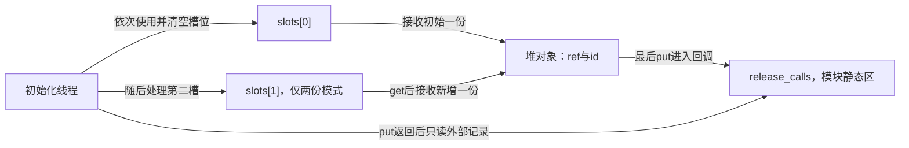
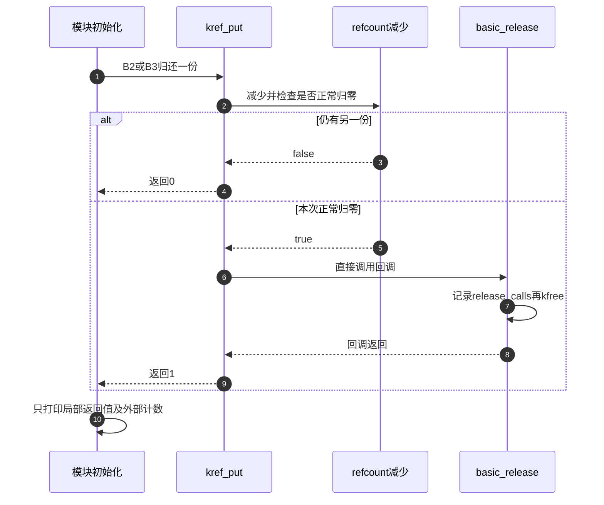

# 第32章\_基础引用与源码对照实验

工程模板已经说明一份责任何时建立、交付和结束。现在暂时拿掉队列、设备和查找表，只保留一个堆对象，用最少的观察点把预测、执行与固定版本源码对起来。实验一保留初始一份，实验二增加第二份；两种模式使用同一完整程序，改变的只有持有者数量。

这不是一次新的机制推导，也不是并发压力测试。两个持有者在同一模块初始化线程中顺序执行，目的是先确定每个动作的意义。等这条基础轨迹与源码一致以后，再回到P14后续单元加入真正的异步、竞争和失败诊断。

## 32.1\_先分清读哪份源码和运行哪个内核

仓库的源码解释固定于NXP官方linux-imx提交dfaf2136deb2af2e60b994421281ba42f1c087e0，标签lf-6.12.20-2.0.0，版本6.12.20。访问目录只是工作环境，分支lf-6.12.y可以继续前进，本地实验提交也不自动成为教材证据。

在Linux shell中，用环境变量KERNEL_SRC保存已确认的源码树路径。HEAD表示该工作树当前提交，标签解引用定位发布提交；下面的git命令只读核对，不切换或修改源码：

```bash
: "${KERNEL_SRC:?请先设置已确认的Linux源码树}"
baseline=dfaf2136deb2af2e60b994421281ba42f1c087e0
git -C "$KERNEL_SRC" remote get-url origin
git -C "$KERNEL_SRC" branch --show-current
git -C "$KERNEL_SRC" rev-parse HEAD
git -C "$KERNEL_SRC" rev-parse 'lf-6.12.20-2.0.0^{}'
git -C "$KERNEL_SRC" show "${baseline}:Makefile" | sed -n '1,8p'
```

远端应指向nxp-imx/linux-imx；HTTPS与SSH访问形式可以不同，但项目身份必须一致。标签解引用应得到上述固定提交。HEAD不同并不要求你切换、重置或修改实验树：读取固定证据使用git show，构建与运行则另行记录所选提交和配置，不把两者静默混成一个版本。

源码身份也不等于运行身份。uname -r描述当前运行内核，模块构建树可能是为另一个目标准备的。先按[模块构建与部署](../../../../engineering/build/kernel_modules/大纲.md#1.1_四章怎样连起来)确认KERNEL_BUILD、目标配置、工具链与运行环境匹配；交叉构建时使用相应ARCH和CROSS_COMPILE。不能在宿主Linux上找到一个build目录，就假定编译出的模块属于开发板。

本次源码核对保留了这一差别：官方标签仍解引用到固定提交，本地HEAD包含实验提交；ARM工作树配置启用TINY_RCU和PREEMPT_NONE且未启用SMP，但这不是虚拟机当前运行镜像的证明。本章基础模块不依赖RCU功能，配置记录仍用于约束后续实验。

## 32.2\_完整模块中只有两类存储

堆上的basic_object保存ref与初始化后不再改变的id；模块静态区的release_calls保存回调进入次数。把观察记录放在对象外，才能在最后put返回后继续查看结果，而不去读取已经free的对象。

局部slots数组的每个非空元素代表一个独立拥有者。creator只在建立这些份额时作为辅助变量；两份模式下必须先get，再给第二槽保存地址。数组赋值本身不会增加引用。holders是只读模块参数，只允许1或2，其他值在分配之前返回-EINVAL。



下面是完整[note_kref_basics.c](../../../../labs/kernel/object_lifetime/materials/note_kref_basics.c)，无需再拼接缺失的alloc、get、put或module_init片段。kref_read只在本例未发布、当前线程仍持引用时观察计数，不承担有效性判断。

```c
// SPDX-License-Identifier: GPL-2.0
#include <linux/kref.h>
#include <linux/module.h>
#include <linux/slab.h>

struct basic_object {
    struct kref ref;
    unsigned int id;
};
static unsigned int holders = 1;
module_param(holders, uint, 0444);
MODULE_PARM_DESC(holders, "顺序模拟的独立持有者数量：1或2");
static unsigned int release_calls;

static void basic_release(struct kref *ref)
{
    struct basic_object *obj = container_of(ref, struct basic_object, ref);
    pr_info("note_basics: release id=%u\n", obj->id);
    ++release_calls; /* 记录放在对象外，归还以后只读此计数。 */
    kfree(obj);
}
static int __init note_basics_init(void)
{
    struct basic_object *slots[2] = { NULL, NULL };
    struct basic_object *creator;
    unsigned int index;

    if (holders < 1 || holders > 2)
        return -EINVAL;
    creator = kzalloc(sizeof(*creator), GFP_KERNEL);
    if (!creator)
        return -ENOMEM;
    kref_init(&creator->ref);
    creator->id = 7;
    slots[0] = creator; /* 初始份额交给第一个责任槽位。 */
    pr_info("note_basics: initialized ref=%u\n", kref_read(&creator->ref));
    if (holders == 2) {
        kref_get(&creator->ref); /* 原份额有效时，为第二个持有者追加一份。 */
        slots[1] = creator;
        pr_info("note_basics: shared ref=%u\n", kref_read(&creator->ref));
    }
    creator = NULL; /* 辅助别名不再参与后续访问。 */
    for (index = 0; index < holders; ++index) {
        struct basic_object *owned = slots[index];
        int final;
        slots[index] = NULL;
        pr_info("note_basics: holder=%u use id=%u\n", index + 1, owned->id);
        final = kref_put(&owned->ref, basic_release);
        /* 最后put也不再读取owned，只使用局部返回值和外部记录。 */
        pr_info("note_basics: holder=%u put_final=%d releases=%u\n",
                index + 1, final, release_calls);
    }
    return 0;
}
static void __exit note_basics_exit(void)
{
    /* 两个槽位在init同步结束，不代表两个线程。没有异步或外部入口。 */
    pr_info("note_basics: unloaded releases=%u\n", release_calls);
}
module_init(note_basics_init);
module_exit(note_basics_exit);
MODULE_LICENSE("GPL");
MODULE_DESCRIPTION("一份与两份引用的完整基础观察实验");
```

### 32.2.1\_把返回值也放入预测

在固定版本中，kref_put返回1表示本次调用了release，返回0表示没有进入该回调。这个返回值能在归还后读，因为它已经是局部标量；obj->ref和obj->id仍位于对象里，不能为了“确认归零”继续读它们。

这里的release直接kfree，因此回调返回时本例堆存储已经释放。一般release也可以安排延后回收，届时put返回1只表示这个回调已经被调用，不能外推成所有资源、RCU期限和外部代码都已退出。

| 阶段 | holders=1 | holders=2 | 可读取的依据 |
| --- | --- | --- | --- |
| B0初始化 | 初始一份给slots[0] | 同左 | 初始化线程独占 |
| B1建立第二份 | 跳过 | get使计数从1到2，再写slots[1] | 原份额尚未结束 |
| B2第一槽归还 | 最后put，release_calls变1 | 非最后put，release_calls仍0 | put前拥有该份额，put后只看外部结果 |
| B3第二槽归还 | 没有第二槽 | 最后put，release_calls变1 | 第二槽独立拥有一份 |
| B4模块卸载 | 仅打印外部次数 | 同左 | 本例无外部入口或异步回调 |

## 32.3\_构建并观察一份与两份模式

材料Makefile已登记note_kref_basics.o。在仓库根目录、匹配目标的构建环境中生成外部模块：

```bash
: "${KERNEL_BUILD:?请先设置匹配目标的内核构建树}"
make -C "$KERNEL_BUILD" M="$PWD/labs/kernel/object_lifetime/materials" modules
```

这条命令按材料Makefile构建已登记的模块；如果其他材料报配置或接口错误，先根据构建日志定位，不能把未生成目标.ko当成运行阶段失败。也可以在独立实验目录只放本章C文件与下面这一行Makefile，再按构建专题执行相同外部模块流程：

```makefile
obj-m += note_kref_basics.o
```

把生成的note_kref_basics.ko送到匹配内核的实验环境。在模块所在目录先运行一份模式，观察并卸载后再运行两份模式：

```bash
sudo insmod ./note_kref_basics.ko holders=1
sudo dmesg | tail -n 12
sudo rmmod note_kref_basics
sudo insmod ./note_kref_basics.ko holders=2
sudo dmesg | tail -n 16
sudo rmmod note_kref_basics
```

一份模式的关键顺序应为：

```text
note_basics: initialized ref=1
note_basics: holder=1 use id=7
note_basics: release id=7
note_basics: holder=1 put_final=1 releases=1
```

两份模式则应为：

```text
note_basics: initialized ref=1
note_basics: shared ref=2
note_basics: holder=1 use id=7
note_basics: holder=1 put_final=0 releases=0
note_basics: holder=2 use id=7
note_basics: release id=7
note_basics: holder=2 put_final=1 releases=1
```

这两段是预期结果，本批宿主替身执行也观察到相同顺序；不是伪装成目标dmesg的实机记录。模块卸载另打印unloaded releases=1，因为所有对象使用都已经在初始化中同步结束。日志时间戳和前后其他模块输出可能不同，核对的是本模块事件和责任关系。

再尝试holders=0，初始化应返回-EINVAL且不分配对象；装入失败的模块无需再rmmod。真实分配失败返回-ENOMEM，既没有对象交付，也没有release可调用。不能以“没有release日志”直接判断泄漏，应先看初始责任是否建立。

## 32.4\_沿源码解释日志插入的位置

从[kref源码总索引](../../../../research/source_reading/kref/navigation/P01_Linux_6.12_kref源码阅读索引.md#1.2_按问题进入已落地证据)进入[普通引用模块](../../../../research/source_reading/kref/navigation/P02_普通引用与归零回调导读.md#2.2_把S0到S5落到状态地址)，先找本例的B0～B3各对应哪条路径，再看唯一实现标题：

| 观察问题 | 固定源码入口 | 应在纸上写出的结论 |
| --- | --- | --- |
| 为什么初始读值为1 | [kref_init](../../../../research/source_reading/kref/source_explanations/include/linux/kref.h.md#1.2_建立初始引用) | 初始化写入初始责任，分配器本身没有替你建立它 |
| 第二槽怎样得到独立份额 | [kref_get](../../../../research/source_reading/kref/source_explanations/include/linux/kref.h.md#1.3_为独立使用追加引用) | 新增计数发生在旧保护仍有效时，保存指针不是计数动作 |
| 为什么release日志在最后put结果以前 | [kref_put](../../../../research/source_reading/kref/source_explanations/include/linux/kref.h.md#1.4_最后归还调用清理) | 归零分支在put内部同步调用回调，随后才返回1 |
| 哪个旧值选择归零分支 | [refcount增减](../../../../research/source_reading/kref/source_explanations/include/linux/refcount.h.md#1.3_旧值决定归零与异常分支) | 减少前的正数旧值与减量决定正常归零，异常另行收敛 |



如果只在include/linux/kref.h看到一个包装调用就停止，尚不能解释归零与异常饱和的分支。反过来，追到原子指令也不会自动证明业务层每份责任归谁。源码与实验之间要双向对照：应用责任表解释为什么调用，固定实现解释这次合法调用怎样推进。

## 32.5\_记录本批证据与下一步问题

本批实际完成六条宿主协议路径：一份、两份、两种持有数下的分配失败，以及0和3两个非法参数。宿主程序拼入实际模块和固定版本普通引用链，分配与原子操作由明确的顺序替身提供；正常日志顺序与上表一致，最终释放恰好一次，没有遗留分配。

ARM前端编译通过，读取354个头，342个非生成头与官方固定提交比较无差异。生成头仍来自工作树配置，前端通过不等于已经生成、链接或加载目标模块。本批未执行目标装卸、真实dmesg采集、两个线程并发或硬件内存序测试。

修改练习从不会执行悬空访问的问题开始：把holders改成非法值，解释为何没有release；把第二槽改成明确转交而非分享，重新安排第一个槽的清空与归还；把最终回调改成只计次而不free时，说明为什么“put_final=1”不能再证明存储已回收。不要只修改最后一行期望数字，而要先画出新的责任归属。

最后画出“保留slots[1]赋值却删除get”的错误轨迹，但不要把它作为普通内核运行练习：第一次put将结束唯一份额，第二次访问没有保护。后续故障单元会继续区分责任模型发现错误、动态检查器实际捕获错误，以及未告警能够提供的有限证据。

专题导航：[kref实验路线](大纲.md#1.15_源码阅读实验)。

上一篇：[实验总入口](P14_源码阅读实验.md#14.1_本章导读_用实验验证生命周期边界)。

下一篇：[引用错误实验](P14_源码阅读实验.md#14.4_引用错误实验_少_get_少_put)。
