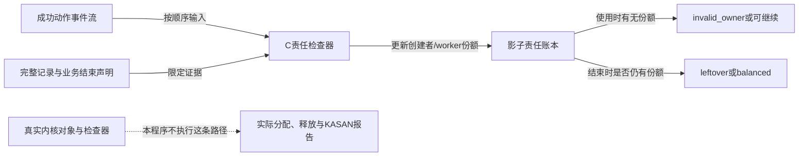
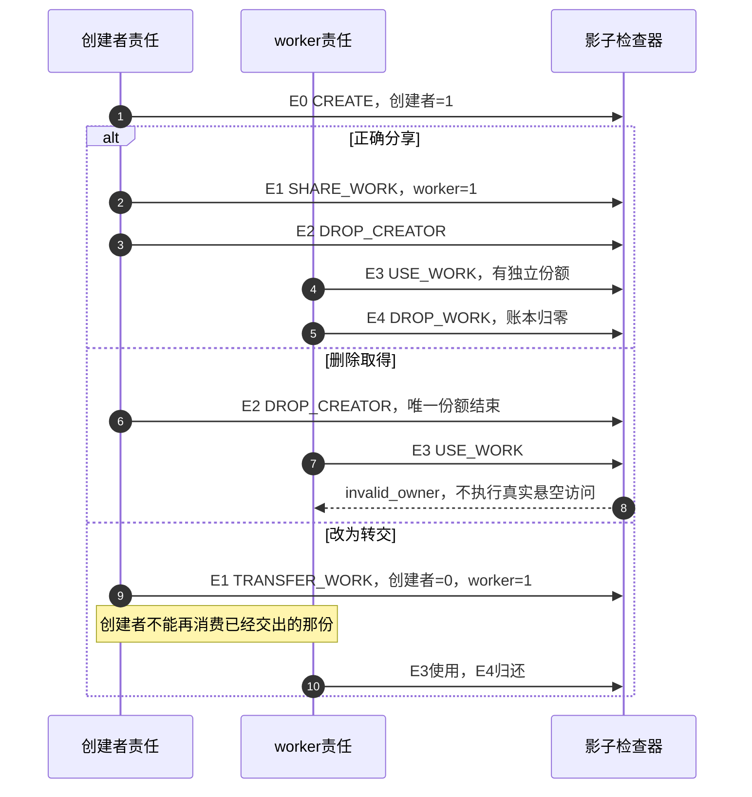

# 第33章\_缺失引用与未归还责任实验

基础实验已经说明最后put会同步进入回调。现在删除一次取得，或者遗漏一次归还，再观察责任链在哪里断开。本章先操作明确的事件轨迹，随后对照真实工作模块；责任检查器不会释放真实对象，也不会制造内核UAF，因此它的结论不能写成“KASAN已经捕获错误”。

本单元复用P12已经建立的C责任检查器，阅读任务从认识诊断方法变成自己构造反例并解释结果。它只处理创建者和工作者的独立份额或显式转交，不建模管理者等待覆盖的借用；其他协议不能硬套它的判定。

## 33.1\_先确定删除的是哪一份

设创建者初始拥有一份，准备把任务交给worker。选择分享协议时，先为worker取得另一份，再让接收者使用；创建者和worker最终各归还自己的一份。若删除那次get却保留两端put，计数便不再对应真实责任。创建者先归还会提前清理；worker先归还也可能消费创建者本来要保留的一份。错误不依赖某个固定线程获胜。

如果选择转交，创建者可以不另get，但必须交出自己的份额，并且不再归还或凭该份额使用对象。因此“异步代码前没写get”不是完整判据。还要看是否转交，或是否由管理者保留引用并同步等待整个借用期。错误是 **接收者的使用期限没有合法来源**，不是某个函数名没有出现。

少put则发生在另一端：份额已经合法建立，但其拥有者结束后没有消费它。在本实验声明业务已结束、记录完整的条件下，可以识别剩余责任；若worker仍在运行，或者日志缺了一段，就不能把暂时的正计数直接称为永久泄漏。



图中虚线刻意标出本实验的边界。真实内核计数、分配器状态和动态检查器的元数据并没有被这个离线程序读取；它只对你提供的事件及前提作出判断。

## 33.2\_完整程序与六条基本轨迹

事件种类沿用[P12责任账本](P12_典型错误模式与调试线索.md#12.2.1_调试工具先导)：CREATE建立初始责任，SHARE_WORK为worker取得一份，TRANSFER_WORK转交原份额，DROP_CREATOR和DROP_WORK消费对应责任，USE_WORK表示worker尝试使用。complete声明输入记录完整，closed声明被审查的业务周期已经结束；它们是外部证据条件，检查器不能自行证明。

完整程序仍是[ownership_audit.c](../../../../labs/kernel/object_lifetime/materials/ownership_audit.c)，本批没有改变其实现或原六条输入。它在固定长度的轨迹上使用普通C计数，没有线程、内核kref或实际对象分配。

```c
// SPDX-License-Identifier: MIT
#include <assert.h>
#include <stdbool.h>
#include <stddef.h>
#include <stdio.h>

enum event_kind {
    CREATE, SHARE_WORK, TRANSFER_WORK, DROP_CREATOR, DROP_WORK, USE_WORK
};
enum verdict { BALANCED, INVALID_OWNER, LEFTOVER, INCOMPLETE, STILL_OPEN };

/* 离线责任账本，不实现内核计数，也不实际释放或访问悬空内存。 */
static enum verdict audit(const enum event_kind *events, size_t count,
                          bool complete, bool closed)
{
    unsigned int creator = 0, worker = 0;
    bool created = false;
    if (!complete)
        return INCOMPLETE; /* 记录缺失时不能把缺少get判为真实少get。 */
    for (size_t i = 0; i < count; ++i) {
        switch (events[i]) {
        case CREATE:
            if (created)
                return INVALID_OWNER;
            created = true;
            creator = 1;
            break;
        case SHARE_WORK:
            if (!creator)
                return INVALID_OWNER;
            ++worker; /* 约定：创建者持份额时为工作者新取一份。 */
            break;
        case TRANSFER_WORK:
            if (!creator)
                return INVALID_OWNER;
            --creator;
            ++worker; /* 转交不增加总份额。 */
            break;
        case DROP_CREATOR:
            if (!creator)
                return INVALID_OWNER;
            --creator;
            break;
        case DROP_WORK:
            if (!worker)
                return INVALID_OWNER;
            --worker;
            break;
        case USE_WORK:
            if (!worker)
                return INVALID_OWNER;
            break;
        default:
            return INCOMPLETE;
        }
    }
    if (!created)
        return INCOMPLETE;
    if (!closed)
        return STILL_OPEN; /* 业务未结束时，有份额不等于泄漏。 */
    return creator || worker ? LEFTOVER : BALANCED;
}

int main(void)
{
    static const enum event_kind shared[] = {
        CREATE, SHARE_WORK, DROP_CREATOR, USE_WORK, DROP_WORK
    };
    static const enum event_kind missing_get[] = {
        CREATE, DROP_CREATOR, USE_WORK
    };
    static const enum event_kind duplicate_put[] = {
        CREATE, TRANSFER_WORK, DROP_CREATOR, USE_WORK, DROP_WORK
    };
    static const enum event_kind missing_put[] = {
        CREATE, SHARE_WORK, DROP_CREATOR, USE_WORK
    };
    static const struct {
        const char *name;
        const enum event_kind *events;
        size_t count;
        bool complete, closed;
        enum verdict expected;
    } cases[] = {
        {"shared", shared, 5, true, true, BALANCED},
        {"missing_get", missing_get, 3, true, true, INVALID_OWNER},
        {"transfer_then_put", duplicate_put, 5, true, true, INVALID_OWNER},
        {"missing_put", missing_put, 4, true, true, LEFTOVER},
        {"dropped_records", shared, 5, false, true, INCOMPLETE},
        {"active_worker", missing_put, 4, true, false, STILL_OPEN}
    };
    static const char *const names[] = {
        "balanced", "invalid_owner", "leftover", "incomplete", "still_open"
    };
    for (size_t i = 0; i < sizeof(cases) / sizeof(cases[0]); ++i) {
        enum verdict result = audit(cases[i].events, cases[i].count,
                                    cases[i].complete, cases[i].closed);
        assert(result == cases[i].expected);
        printf("%s: %s\n", cases[i].name, names[result]);
    }
    return 0;
}
```

先预测missing_get和missing_put的不同，再在材料目录编译运行：

```bash
cc -std=c11 -Wall -Wextra -Werror -O2 ownership_audit.c -o /tmp/ownership_audit
/tmp/ownership_audit
```

输出应为：

```text
shared: balanced
missing_get: invalid_owner
transfer_then_put: invalid_owner
missing_put: leftover
dropped_records: incomplete
active_worker: still_open
```

balanced只表示给定完整、已关闭轨迹在本模型下配平；它没有验证字段锁、实际排队、对象地址来源或硬件退出。invalid_owner说明当前动作找不到所需责任，不必等到最后总数才发现问题。leftover则要求先接受complete与closed这两个前提，才能解释成被审查周期结束后的未归还份额。

## 33.3\_实验三从第一个非法动作定位

把分享路径分为E0创建、E1为worker取得、E2创建者归还、E3 worker使用、E4 worker归还。正常顺序的账本依次为(1,0)、(1,1)、(0,1)、(0,1)、(0,0)，括号两项分别代表创建者与worker责任。

删除E1以后，E2把唯一份额结束，E3没有worker份额可用。检查器在E3返回invalid_owner，不执行真实free后的访问。映射到原来的堆对象和嵌入work时，危险还不只在obj->id：把尚可能被工作队列处理的work_struct一并free，框架也可能先访问失效存储，不能把报错行预先限定在你的打印语句。



接着让worker更早执行。在missing_get轨迹里把USE_WORK移到DROP_CREATOR前面，仍会得到invalid_owner：当前模型要求worker独立持有，创建者碰巧还没退出不等于已经承诺覆盖整个借用期。这个判定本身不证明此时已经发生物理UAF，它定位的是协议缺口；真实程序是否立即访问到已释放内存，取决于随后怎样交错。

原片段在worker里msleep(100)只是延迟一个时段，不是交付或退出同步。它不能保证worker、创建者与卸载路径的唯一顺序，也不能靠“多运行几次没崩”证明引用正确。先用事件顺序暴露责任缺口，真实并发诊断再另外记录调度、配置和实际访问栈。

## 33.4\_实验四先说明业务已经结束

missing_put保留E1并删除E4。worker使用时确有份额，所以不会因USE_WORK立即判错；但在closed=true的区间结束时，worker栏仍为1，结论为leftover。同一条轨迹把closed改为false，程序返回still_open，因为还可能有未来合法归还。

把complete改为false会先得到incomplete，不能靠日志里没出现get或put，就断言真实程序漏了它。实际诊断应核对所有退出分支、限流和未启用的记录点，以及业务是否真的停止产生新活动。看见“没有release日志”还可能是回调未到、日志丢失或统计放错位置；必须回到实际持有者和结束条件。

修复也不是在函数结尾任意多加一个put。先定位未归还的份额属于谁、成功还是失败路径建立的、能否仍被异步使用，再安排唯一消费者。如果份额早已转交给队列，创建者补put可能把“泄漏怀疑”改成真实过早回收。对象计数只知道整数，不能替你辨认还错了哪一份。

## 33.5\_回到真实工作模块核对三件事

[P20完整工作模块](P20_工作交付与关闭工程模板.md#20.1_先选择分享还是转交)提供实际内核对照：transfer=false先取得worker候选份额，拒绝投递时回滚候选，成功后创建者只结束自己的份额；transfer=true成功时交出初始份额，创建者不再访问对象，失败时仍保留责任并归还。

对照时先核对 **队列接纳结果**。schedule_work或queue_work的调用行为不是SHARE_WORK事件本身；影子检查器也不跟踪PENDING、取消或重复投递。候选get成功、队列接受成功、接收者使用是不同事件，不能在原始日志里随便用一个“queued”字符串替换三者。

再核对 **队列与模块代码寿命**。P20在没有其他来源或重排的条件下，从模块退出路径销毁执行队列，等待唯一回调返回。原片段只有schedule_work，空的module_exit并没有证明工作回调代码仍在；如果把这条问题混进少get实验，报错可能来自代码退出而不只是对象引用。

最后核对 **借用方案的前提**。P24的[完整管理者借用模块](P24_删除入口与活动排空工程模板.md#24.3_完整管理者模块的资源分层)由管理者保持初始份额，关门后同步等worker，再结束存储。worker不get也不put可以合法，但这种协议不在本章双拥有者检查器内，不能把它的轨迹输入后看到invalid_owner就给实际模块判错。

源码由[kref总阅读索引](../../../../research/source_reading/kref/navigation/P01_Linux_6.12_kref源码阅读索引.md#1.2_按问题进入已落地证据)进入[故障轨迹导读](../../../../research/source_reading/kref/navigation/P02_普通引用与归零回调导读.md#2.30_错误轨迹与实际引用的证据层次)，再核对[正常最后归还](../../../../research/source_reading/kref/source_explanations/include/linux/kref.h.md#1.4_最后归还调用清理)。原语的正常减法不检查当前调用者是否真的拥有那一份；缺份额的错误也可能以正常归零结束，不一定先给出refcount告警。

## 33.6\_保留结论的证据层级

本批重新编译并运行上述六条原轨迹，另在同一audit实现上检查五条扩展输入：正确转交、worker较早访问但无份额、worker较早完成的正确分享、候选份额回滚，以及少get形状但记录不完整。合计十一条宿主C轨迹通过。候选回滚轨迹只验证账本消费，不验证真实排队是否被拒绝。

真实工作模块及其已有验证记录保持不变，本批未新执行ARM、目标装卸、真实线程竞争、内核故障注入或KASAN。这里也没有制造真实内存泄漏。后续工具单元需要另行确认检查器配置、体系结构支持、接入点、是否仍有效和目标路径是否被执行；不能把这十一条顺序结果改写为动态检查器已经捕获错误。

练习一，把正确分享中的DROP_WORK移到DROP_CREATOR前面，预测仍应balanced，再解释为什么实际原子引用不需要创建者永远最后退出。练习二，在转交成功后多插入DROP_CREATOR，指出最早非法事件，而不是只看末尾数值。练习三，给missing_put补上一次DROP_WORK，但把closed仍设false；解释局部配平和业务周期已经关闭为何是两个不同前提。

这两组实验已经分别定位了使用前没有责任、结束后留有责任。下一步把地址来源换成可并发删除的索引，继续检查“找到地址”与“取得独立引用”之间的窗口。

专题导航：[kref实验路线](大纲.md#1.15_源码阅读实验)。

上一篇：[基础引用与源码对照](P32_基础引用与源码对照实验.md#32.1_先分清读哪份源码和运行哪个内核)。

下一篇：[查找窗口与条件取得实验](P34_查找窗口与条件取得实验.md#34.1_先确定表是否拥有引用)。
