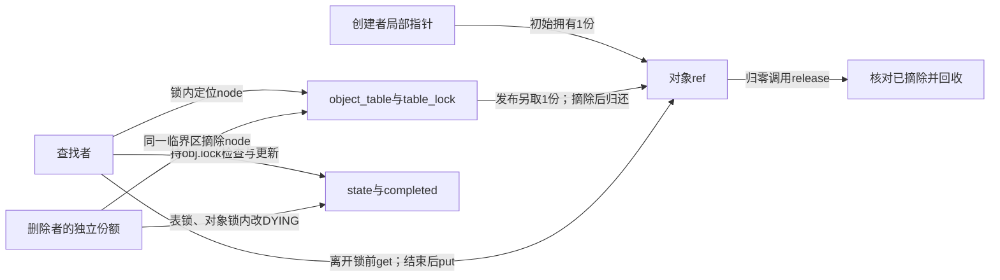
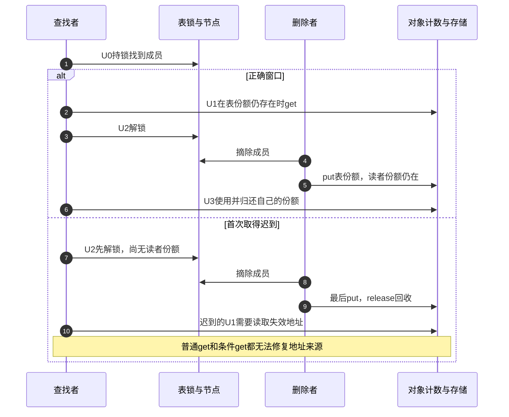

# 第34章\_查找窗口与条件取得实验

上一章从事件账本识别缺少引用和未归还责任，但那里的接收者已经知道对象来自哪里。现在把起点换成一个允许删除的注册表：请求者按编号找到对象，准备离开查找锁后使用。关键问题是，查找返回的地址依据什么活到第一次get？

本章完成原实验5、6。先用已有完整链表模块观察“表自己拥有一份”的协议，再以完整C程序观察“地址仍有效，计数却可能归零”的条件增加。两者不是简单把get替换为get_unless_zero；需要一起审查的是发布、撤下和最后清理的顺序。

## 34.1\_先确定表是否拥有引用

设服务对象编号为7，创建者保留初始份额。发布成功时，表另取一份；查找者在table_lock内找到成员，并取得读者份额后才解锁。删除者必须取得同一把table_lock才能摘除成员，摘除以后再归还表份额。所以查找者持锁且成员仍在时，表份额尚未被消费，普通get所需的正计数前提成立。

这里同时存在三组状态：链表节点表示可达性，ref保存尚未归还的份额数，state表示业务是否接纳请求。state沿用模板的三个枚举值：NEW为新建未发布，LIVE为正在服务，DYING为停止接纳。它们互相关联，但不是一个整数的三种读法。table_lock保护节点，obj.lock保护state和completed；涉及两者的路径按表锁、对象锁顺序进入。completed只是同步完成次数，不能承担对象保活。



将这次查找分成U0定位、U1取得、U2解锁、U3使用。这些U编号只表示本章查找者的动作。对照[P12查找诊断](P12_典型错误模式与调试线索.md#12.4.1_错误五_lookup_后无保护_get)：其错误轨迹Q0合并了这里的U0与提前U2，Q1/Q2是本章删除分支，Q3是这里迟到的U1。由此可见，U0到U1之间不能失去地址保护；U1成功以后才建立独立份额。图中的锁与份额有各自截止点，不能把U0读到非空指针当作U1已经完成。

## 34.2\_实验五观察拥有型链表

使用[P17完整链表模块](P17_拥有型链表工程模板.md#17.1_拥有型链表的发布与撤下)及其唯一材料[note_kref_table.c](../../../../labs/kernel/object_lifetime/materials/note_kref_table.c)。这个模块已包含创建、发布、重号失败、查找、同步请求、重复撤下及清理；本章不维护第二个改名副本。它在模块初始化中顺序演示协议，并没有创建两个竞争线程。

读代码前先填写这张责任表。数字来自当前模块的顺序执行；真实并发中不能用无保护的计数快照代替这些责任证明。

| 事件 | 创建者份额 | 表份额 | 读者份额 | 可达与业务状态 |
| --- | --- | --- | --- | --- |
| table_create成功 | 1 | 0 | 0 | 未发布，NEW |
| table_publish成功 | 1 | 1 | 0 | 在表中，LIVE |
| table_lookup成功 | 1 | 1 | 1 | U1已经完成 |
| 创建者put | 0 | 1 | 1 | 读者仍可请求 |
| 首次table_unpublish | 0 | 0 | 1 | 摘除，DYING |
| 读者再次请求 | 0 | 0 | 1 | 存储有效，业务拒绝 |
| 读者put | 0 | 0 | 0 | release一次 |

发布失败不消费创建者份额：重复发布原对象返回EINVAL，另一个对象使用相同编号返回EEXIST，失败者仍由创建者归还。删除函数也不凭调用次数消费引用，只有本次确实摘除了节点才归还表份额。第二次撤下必须以仍有效的参数调用；“重复撤下不多put”不意味着可以把已释放地址再传进去。

构建与运行环境先按[P32源码和运行身份](P32_基础引用与源码对照实验.md#32.1_先分清读哪份源码和运行哪个内核)确认。在仓库根目录，对匹配目标配置的已准备构建目录执行：

```bash
make -C "$KERNEL_BUILD" M="$PWD/labs/kernel/object_lifetime/materials" modules
sudo insmod labs/kernel/object_lifetime/materials/note_kref_table.ko
sudo rmmod note_kref_table
sudo dmesg | tail -n 30
```

只检查本次装卸新增的note_table日志。预期before=0且completed=1；撤下后的after为负ESHUTDOWN，completed仍为1；卸载记录release=1和empty=1。后一次请求读得出拒绝结果，是因为读者还持有自己的份额，而不是DYING自动保住对象。具体errno数值不承担跨平台教学结论。

上面是目标操作步骤与预期，不是本次实际装卸记录。本批重新运行的是宿主夹具：分配失败、完整正常周期、未发布对象归还、重复发布/重号、多对象查找及重复撤下、撤下后找不到，共六组。夹具保留实际模块和固定引用函数，锁、分配、原子与部分链表操作使用顺序替身，不能证明真实锁竞争或线程调度。

## 34.3\_把第一次取得移出锁会发生什么

现在只做纸上改动：U0找到对象后先执行U2解锁，最后才尝试U1。创建者已归还自己的份额，表是当前唯一拥有者。删除者摘除并归还表份额后，对象可能已经free；查找者再打印id、读取计数或调用条件增加，都需要访问已经失效的存储。



这个错误不能通过把kref_get改成kref_get_unless_zero修复。后者必须先读取ref成员，才知道是不是零；它没有查询分配器来判断任意地址是否还有效。我们不在宿主程序中执行这段真实悬空访问，避免把不可控未定义行为当作稳定的实验输出。

“锁外必须另有引用”也应限定协议。本实验没有覆盖锁外借用期限的管理者，所以查找返回契约要求独立份额；若另一个管理者持有引用并等待完整借用期，锁外借用也可以成立。那需要[P24管理者协议](P24_删除入口与活动排空工程模板.md#24.3_完整管理者模块的资源分层)的额外证明，不能只靠创建者碰巧还没退出。

## 34.4\_实验六先制造真正的零值窗口

在上述拥有型表中，仅把普通get改为条件get，健康且满足前提的路径应成功。要研究失败，应换成不同协议：索引本身不持有份额；最后put可在查找锁外把计数减到零；release再取得同一把锁，摘除节点并回收。

此时查找者持锁可以阻止release完成清理，却不能阻止另一拥有者先归零。顺序为：查找者找到节点，最后持有者归零并在release里等锁，查找者在有效地址上条件尝试得到失败，查找者解锁，清理者获锁摘除并回收。普通get不能从零复活这个对象，失败路径也没有新增份额可put。

这一协议来自固定NXP Linux 6.12.20的Documentation/core-api/kref.rst。经[kref源码总索引](../../../../research/source_reading/kref/navigation/P01_Linux_6.12_kref源码阅读索引.md#1.2_按问题进入已落地证据)，进入[条件取得模块的S2a到S2d](../../../../research/source_reading/kref/navigation/P03_条件取得与查找窗口导读.md#3.2_从观察到自己持有)：U0对应S2a地址保护，U1对应S2b观察、S2c比较、S2d返回，U2结束保护；成功后U3才使用新份额。原语的唯一讲解是[有效地址上的条件取得](../../../../research/source_reading/kref/source_explanations/include/linux/kref.h.md#1.7_有效地址上的条件取得)。

实验程序复用[conditional_take.c](../../../../labs/kernel/object_lifetime/materials/conditional_take.c)。它把计数保存在main仍在作用域内的atomic_uint对象里，明确保证地址有效；不实现链表、mutex或释放。干扰种类用interference枚举表示：NONE保持原值，DROP_LAST模拟最后归还写成0，ADD_OWNER模拟另一持有者先把1改成2。第一次观察与比较之间人为插入干扰，观察比较失败后old是否被更新，并据新值重试。这是C11顺序干扰模型，没有真实第二线程，也不模拟内核异常饱和；UINT_MAX断言只限制无符号加一的模型输入。

```c
#include <assert.h>
#include <limits.h>
#include <stdbool.h>
#include <stdatomic.h>
#include <stdio.h>

enum interference { NONE, DROP_LAST, ADD_OWNER };

/* refs 本身始终在有效存储中；这里只模拟零/正数，不模拟内核饱和。 */
static bool try_take(atomic_uint *refs, enum interference event,
                     unsigned int *attempts)
{
    unsigned int old = atomic_load_explicit(refs, memory_order_relaxed);
    *attempts = 0;
    while (old != 0) {
        assert(old < UINT_MAX);
        if (*attempts == 0 && event != NONE) {
            /* 在第一次观察与比较之间，显式安排另一条路径先改变计数。 */
            atomic_store_explicit(refs, event == DROP_LAST ? 0u : 2u,
                                  memory_order_relaxed);
        }
        ++*attempts;
        if (atomic_compare_exchange_strong_explicit(refs, &old, old + 1,
                memory_order_relaxed, memory_order_relaxed))
            return true;
        /* 比较失败已把 old 更新为当前值，下一轮必须重新检查它是否为零。 */
    }
    return false;
}

int main(void)
{
    const unsigned int initial[] = {0, 1, 1, 1};
    const enum interference events[] = {NONE, NONE, DROP_LAST, ADD_OWNER};
    const unsigned int expected_count[] = {0, 2, 0, 3};
    const unsigned int expected_attempts[] = {0, 1, 1, 2};
    const bool expected_result[] = {false, true, false, true};
    for (unsigned int path = 0; path < 4; ++path) {
        atomic_uint refs;
        atomic_init(&refs, initial[path]);
        unsigned int attempts;
        bool taken = try_take(&refs, events[path], &attempts);
        unsigned int count = atomic_load_explicit(&refs, memory_order_relaxed);
        assert(taken == expected_result[path]);
        assert(count == expected_count[path]);
        assert(attempts == expected_attempts[path]);
        printf("path=%u taken=%u count=%u attempts=%u\n",
               path, taken ? 1u : 0u, count, attempts);
    }
    return 0;
}
```

在材料目录运行：

```bash
cc -std=c11 -Wall -Wextra -Werror -O2 conditional_take.c -o /tmp/conditional_take
/tmp/conditional_take
```

四条输出分别是：

```text
path=0 taken=0 count=0 attempts=0
path=1 taken=1 count=2 attempts=1
path=2 taken=0 count=0 attempts=1
path=3 taken=1 count=3 attempts=2
```

path=2第一次读到1，却不能据此承诺成功：归零先发生，比较失败将old改成0，下一轮退出。path=3同样有比较失败，但新值为2，所以第二次比较成功写成3。不能把“比较失败”与“条件取得失败”当成同一个结果。成功路径的计数只是本轮局部模型状态；程序退出作用域结束存储，不涉及堆对象泄漏判断。

## 34.5\_解释结果时保留四个问题

每次查找依次回答：地址由谁保护到U1结束？在该期限里是否保证正计数？成功后新增份额归谁消费？业务状态由什么锁和接纳动作约束？条件增加只处理第二、第三项的一部分，既不证明成员仍在表内，也不检查dying。若接口承诺过滤DYING，就要保留对应同步检查；把API换了却删除状态判断，会同时改变业务契约。

本批四条C11路径、六组实际表模块宿主夹具，以及固定条件函数六个分支和kref包装两个结果重新通过。固定函数另检查异常饱和，不能把它的异常非零返回当作健康成功；顺序模型故意只处理正常零/正数。既有模块、C材料和源码实现未改，未新执行ARM前端、目标装卸、真实并发、内存序或动态故障检查。

练习一，在表协议中删除发布时额外get，保留创建者与表各自put，指出哪一份失去来源；修复可以恢复分享，或明确改成初始份额转交，但不能两端都归还原份额。练习二，把条件模型path=2的干扰改为ADD_OWNER，预测返回、最终计数和尝试次数。练习三，说明为什么条件取得成功后仍可能在table_request里得到ESHUTDOWN，并列出存储有效与业务可用分别由谁保证。

现在已能证明首次取得必须落在合法地址期限内，并依据正计数证明选择普通或条件增加。下一步把取得的份额交给工作队列，继续追踪接纳失败、提前执行和关闭窗口；查找成功不会自动完成那次交付。

专题导航：[实验阅读路线](大纲.md#1.15_源码阅读实验)。

上一篇：[缺失引用与未归还责任](P33_缺失引用与未归还责任实验.md#33.1_先确定删除的是哪一份)。

下一篇：[工作交付与关闭窗口](P35_工作交付与关闭窗口实验.md#35.1_候选份额不等于已经交付)。
