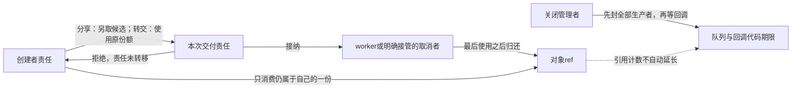
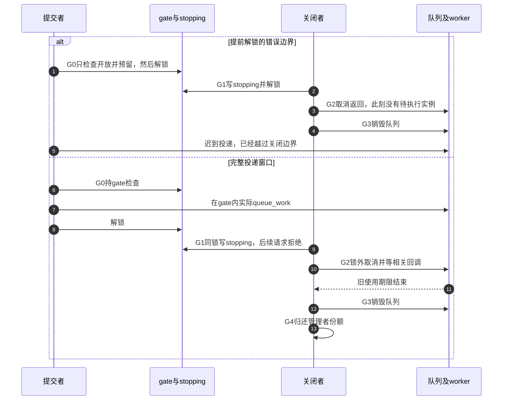

# 第35章\_工作交付与关闭窗口实验

查找实验已经取得有合法来源的一份。现在提交者要让工作线程在稍后使用对象：谁保留原份额，谁接受新责任，拒绝时又由谁归还？原实验7只画出了创建者先put、worker后执行的一条顺序；本章先改变执行顺序，再加入取消和关闭，观察哪些结论仍成立。

实验分三步：用C账本选择一次工作实例的归还者，用完整内核模块比较分享与转交，最后用管理者模块观察停止投递与排空的边界。模型有确定输出，真实模块另有目标运行前提；二者的验证记录分开保存。

## 35.1\_候选份额不等于已经交付

分享协议中，创建者已经有一份，投递前另get一份作为候选。队列接纳后，worker负责消费候选；队列拒绝本次提交时，候选仍归提交者回滚。创建者的原份额是另一项责任，不能因看到false就替一个先前已接纳的worker归还。

采用转交协议时，可以把原份额交给worker而不另get，但成功后的创建者不能再消费或凭它访问对象。worker可以在queue_work返回以前完成并free对象，因此“提交函数还没返回”不是创建者保活条件。需要继续使用时应保留独立份额；只需记录输入值时，可以在交付前复制独立标量。



图中的责任转移是应用契约，队列里没有一张替应用自动put的表。业务对象的ref、work内部调度状态和管理者维护的关闭状态，是三个不同存储位置。把它们都称为pending会遮住接纳与归还的边界。

## 35.2\_用完整C账本比较六种结局

复用[work_ticket.c](../../../../labs/kernel/object_lifetime/materials/work_ticket.c)。book是对象外的影子账本，refs必须等于creator与ticket两项责任之和；releases记录模型归零次数，不执行实际free。state只表示本次工作实例：IDLE尚未预留，RESERVED已经预留，PENDING已接纳待执行，RUNNING正在执行，DONE已完成，CANCELED已取消，REJECTED提交被拒绝。这些枚举不是Linux工作队列位图。

reserve、submit、start_work、finish_work、取消者接管分别对应[P03所有权表](P03_kref_生命周期状态机.md#3.8.2_生命周期中的所有权表)中的预留、发布、使用、归还与失败/取消责任；取消期间creator仍为真是本模型的调用资格。cancel_sync_model遇到RUNNING时直接调用finish_work，显式模拟“等待到执行结束”，没有真实阻塞或第二线程。

```c
#include <assert.h>
#include <stdbool.h>
#include <stdio.h>

enum work_state {
    IDLE,       /* 尚未预留 */
    RESERVED,   /* 已预留，尚未交付 */
    PENDING,    /* 接收成功，等待执行 */
    RUNNING,    /* 执行者正在使用 */
    DONE,       /* 执行结束，已归还工作份额 */
    CANCELED,   /* 待执行实例被取消，取消者接管归还 */
    REJECTED   /* 提交拒绝，预留已经收回 */
};
struct ledger {
    unsigned int refs;
    bool creator;
    bool ticket;
    enum work_state state;
    unsigned int runs;
    unsigned int releases;
};

/* 外部观察账本，不是真实 work_struct，也不分配或释放业务对象。 */
static void check(const struct ledger *book)
{
    assert(book->refs == (book->creator ? 1u : 0u) + (book->ticket ? 1u : 0u));
    assert(book->releases == (book->refs ? 0u : 1u));
}

static void put_one(struct ledger *book, bool *owner)
{
    assert(*owner && book->refs);
    *owner = false;
    if (--book->refs == 0)
        ++book->releases;
    check(book);
}

static void reserve(struct ledger *book)
{
    assert(book->creator && !book->ticket && book->state == IDLE);
    book->ticket = true;
    ++book->refs;
    book->state = RESERVED;
    check(book);
}

static void submit(struct ledger *book, bool accept)
{
    assert(book->state == RESERVED && book->ticket);
    book->state = accept ? PENDING : REJECTED;
    if (!accept)
        put_one(book, &book->ticket); /* 提交者收回本次未交出的预留。 */
}

static void start_work(struct ledger *book)
{
    assert(book->state == PENDING && book->ticket);
    book->state = RUNNING;
    ++book->runs;
}

static void finish_work(struct ledger *book)
{
    assert(book->state == RUNNING);
    book->state = DONE;
    put_one(book, &book->ticket); /* 执行者归还这一实例的责任。 */
}

static bool cancel_sync_model(struct ledger *book)
{
    assert(book->creator); /* 管理者在取消过程中保留自己的份额。 */
    if (book->state == PENDING) {
        book->state = CANCELED;
        return true; /* 待执行实例被取消；函数本身不代替调用者 put。 */
    }
    if (book->state == RUNNING)
        finish_work(book); /* 显式安排执行者结束，代替真实等待。 */
    return false;
}

int main(void)
{
    for (unsigned int path = 0; path < 6; ++path) {
        struct ledger book = { .refs = 1, .creator = true, .state = IDLE };
        reserve(&book);
        submit(&book, path != 0);
        bool canceled = false;
        if (path == 4) {
            put_one(&book, &book.creator); /* 创建者先退出，之后不再取消。 */
            start_work(&book);
            finish_work(&book);
        } else if (path == 5) {
            start_work(&book);
            finish_work(&book);
            put_one(&book, &book.creator);
        } else {
            if (path == 2 || path == 3)
                start_work(&book);
            if (path == 2)
                finish_work(&book);
            canceled = cancel_sync_model(&book);
            if (canceled)
                put_one(&book, &book.ticket); /* 只接管明确取消的那一实例。 */
            put_one(&book, &book.creator);
        }
        assert(canceled == (path == 1));
        assert(book.runs == (path >= 2 ? 1u : 0u));
        assert(book.releases == 1 && book.refs == 0);
        printf("path=%u canceled=%u runs=%u releases=%u\n",
               path, canceled ? 1u : 0u, book.runs, book.releases);
    }
    return 0;
}
```

先预测六条路径是否都会归零，在材料目录运行：

```bash
cc -std=c11 -Wall -Wextra -Werror -O2 work_ticket.c -o /tmp/work_ticket
/tmp/work_ticket
```

输出与解释应逐行对应：

| path | canceled | runs | releases | 哪条路径消费工作份额 |
| --- | --- | --- | --- | --- |
| 0 | 0 | 0 | 1 | 提交拒绝，submit回滚候选 |
| 1 | 1 | 0 | 1 | 待执行被取消，取消者接管 |
| 2 | 0 | 1 | 1 | worker已完成，取消者不再put |
| 3 | 0 | 1 | 1 | 同步取消模型安排运行者完成，由worker put |
| 4 | 0 | 1 | 1 | 创建者先退出，worker最后归还 |
| 5 | 0 | 1 | 1 | worker先完成，创建者最后归还 |

每行实际打印`path=... canceled=... runs=... releases=...`。path=2与path=3有相同的最终数值，却经历不同的时间过程，因此末尾计数不能证明“调用取消时没有工作运行”。path=4不再调用取消：创建者已经交出自己最后的访问资格，不能继续拿旧地址去管理work。

这六条轨迹限定一次实例、不重排。若同一个work运行中又被排队，运行实例与待执行实例可能同时有责任，不能把此处一个ticket布尔值直接扩展成通用协议。应先回到[P20逐实例责任](P20_工作交付与关闭工程模板.md#20.4_重复投递与取消需要逐实例责任)列清每次接纳和消费。

## 35.3\_用同一内核请求比较分享与转交

完整程序[note_kref_work_modes.c](../../../../labs/kernel/object_lifetime/materials/note_kref_work_modes.c)以及[P20逐句讲解](P20_工作交付与关闭工程模板.md#20.2_用同一完整请求比较两种模式)保持不变。它创建私有队列、分配并初始化value=42的请求，只投递一次；worker打印值并归还交付份额，退出函数销毁队列，等待回调返回后才允许代码退出。队列分配或对象分配失败也有清理出口。

先预测transfer=0与transfer=1各有几次put，再按[P32目标准备](P32_基础引用与源码对照实验.md#32.1_先分清读哪份源码和运行哪个内核)建立匹配的构建与运行环境。从仓库根目录执行：

```bash
make -C "$KERNEL_BUILD" M="$PWD/labs/kernel/object_lifetime/materials" modules
sudo insmod labs/kernel/object_lifetime/materials/note_kref_work_modes.ko transfer=0
sudo rmmod note_kref_work_modes
sudo insmod labs/kernel/object_lifetime/materials/note_kref_work_modes.ko transfer=1
sudo rmmod note_kref_work_modes
sudo dmesg | tail -n 24
```

两种模式都预期value=42、releases=1，但成功路径中分享有创建者和worker两个put，转交只有worker一个。worker可能先打印，输出顺序不能被解释为额外回调。日志里的release计数由模块在等待完成后读取，不是任意并发统计方式。

这个新work只投递一次，正常路径不会靠反复运行自然覆盖“已经pending所以返回false”。本批宿主夹具显式注入队列拒绝，用于检查清理分支，不把它说成真实内核已拒绝全新work。两种模式各检查队列分配失败、对象分配失败、拒绝、延后执行、返回前已完成，共十例；队列和分配器是替身，真实模块装卸本次未执行。

| 当前调用的结果 | 分享模式 | 转交模式 |
| --- | --- | --- |
| 拒绝本次全新请求 | 回滚候选，再归还创建者原份额 | 原份额尚未转移，由创建者归还 |
| 接纳，worker晚完成 | 创建者可先put，worker以后put | 创建者不再访问，worker最后put |
| 接纳，worker先完成 | worker先put，创建者仍有原份额 | worker可以已free，创建者只依据返回值结束 |

如果换成对已经pending的work再次提交，拒绝分支仅收回本次额外候选；先前实例的份额仍归原协议消费者。不能把表中“本次全新请求结束创建者”的清理动作无条件复制进任何重复提交函数。

## 35.4\_让关闭发生在检查与排队之间

原片段先在job.lock内检查dying、置私有pending并get，解锁后才schedule_work。新引用能保住外壳，却不能阻止关闭者在实际投递前完成取消，随后销毁队列、子资源或结束回调代码期限。msleep(100)也不会关闭这个窗口，它只是把worker延后，不决定提交者与关闭者的顺序。

下面沿[P20关闭阶段G0到G4](P20_工作交付与关闭工程模板.md#20.3_对象份额不能填补关闭后的迟到投递)比较。同一组阶段中，G0应包括实际投递，G1关门，G2等工作，G3退出队列，G4结束管理者份额。



用[note_kref_owned_work.c](../../../../labs/kernel/object_lifetime/materials/note_kref_owned_work.c)观察正确关闭。这个[P24完整管理者模块](P24_删除入口与活动排空工程模板.md#24.3_完整管理者模块的资源分层)故意采用另一种协议：worker借用管理者保持到cancel返回的期限，没有独立份额可put。调用者另持一份，关闭后还能读到ESHUTDOWN；它保留的是对象，不是已销毁的队列。

目标装卸步骤为：

```bash
sudo insmod labs/kernel/object_lifetime/materials/note_kref_owned_work.ko
sudo rmmod note_kref_owned_work
sudo dmesg | tail -n 16
```

预期submit=0、closed为负ESHUTDOWN、release=1；completed可能是0，也可能是1，取决于待执行被取消还是worker已经执行。两种结果都能正确结束借用期，不应把“没有执行到业务”误判为漏put。把cancel移到持gate区间会导致关闭者等worker、worker等gate的死锁，不能为了关门把整个等待也包进同一把锁。

## 35.5\_回到固定实现与验证边界

工作队列内部PENDING位可以在回调执行前清除，私有pending=false也可能只表示应用允许下一次提交；二者都不能单独证明旧回调已经返回。kref只负责实际份额，不读取这些状态。经[kref源码总索引](../../../../research/source_reading/kref/navigation/P01_Linux_6.12_kref源码阅读索引.md#1.2_按问题进入已落地证据)核对[最后归还](../../../../research/source_reading/kref/source_explanations/include/linux/kref.h.md#1.4_最后归还调用清理)，经[工作队列总索引](../../../../research/source_reading/workqueue/navigation/P01_Linux_6.12_工作队列源码总阅读索引.md#1.3_三条模块分支)核对[cancel的条件](../../../../research/source_reading/workqueue/navigation/P04_Linux_6.12_flush取消与生命周期模块源码概念导读.md#4.4_cancel调用链)及[执行边界](../../../../research/source_reading/workqueue/source_explanations/P03_Linux_6.12_worker_flush与取消源码实现.md#3.3_worker_thread与process_one_work执行边界)。不在本章重复上游函数体。

本批重新运行六条C账本轨迹、分享/转交十例及管理者九组宿主夹具，共25条或组检查。管理者覆盖三处分配失败、执行/取消两种顺序、关门期间请求被拒、重复执行和管理者最后退出；替身检查锁顺序与责任数，没有真实worker并发。三个材料及固定源码未改，没有新增ARM、目标链接装卸、动态检查或硬件结果。

练习一，删除分享模式拒绝分支的候选put，指出哪一条宿主场景首先留下对象。练习二，在转交成功后打印request->value，选择“worker在提交返回前完成”场景，解释为什么该打印缺少资格；不要通过真实悬空访问来验证。练习三，把管理者worker改成无条件put，说明它会消费谁的一份。练习四，设计一个timer也能投递的扩展，在调用cancel以前列出必须关闭的全部生产者；仅关闭用户入口并不足够。

交付实验现在能够分别结算接纳、拒绝、取消和提前完成，也能指出对象引用无法替代的关闭窗口。下一步回到RCU查找：旧读者尚未取得引用时，地址存储由另一套延后回收协议保护，不能套用本章队列等待的结论。

专题导航：[实验阅读路线](大纲.md#1.15_源码阅读实验)。

上一篇：[查找窗口与条件取得](P34_查找窗口与条件取得实验.md#34.1_先确定表是否拥有引用)。

下一篇：[RCU查找与退休顺序](P36_RCU查找与退休顺序实验.md#36.1_归零与旧读者退出是两份证据)。
