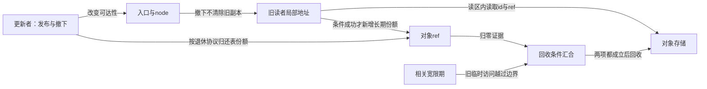
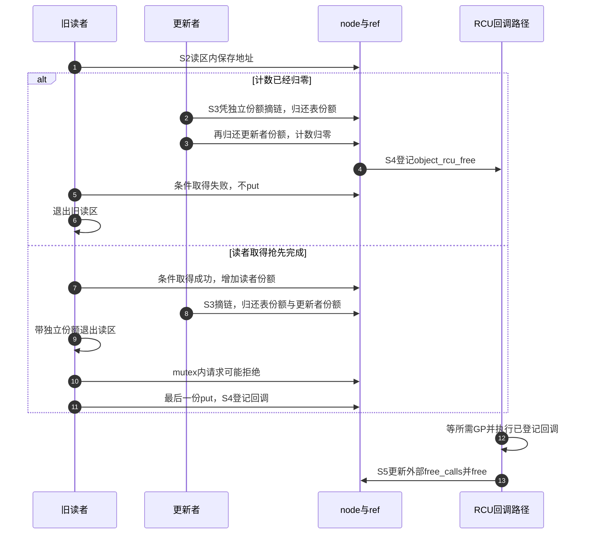

# 第36章\_RCU查找与退休顺序实验

工作交付实验给每次接纳安排了责任。RCU查找还有一个更早的阶段：读者已保存对象地址，却尚未取得长期引用，更新者就撤下入口并归还表份额。这时谁保证读者还能访问ref成员？

原实验8用kfree_rcu推迟外壳释放，方向正确，但顺序示例没有实际交错，也没有明确发布时初始份额的归属。本章沿[P25完整协议](P25_RCU查找与业务关闭工程模板.md#25.1_同一对象上有三组独立状态)先区分临时读者与长期拥有者，再通过四条C模型轨迹比较两种退休顺序。RCU（Read-Copy Update，读、复制、更新）的读区在这里保护一次临时访问期限，不自动生成kref份额。

## 36.1\_归零与旧读者退出是两份证据

对象有三个相关但独立的状态轴：入口是否仍发布，是否还有长期份额，旧临时读者是否已经越过回收边界。撤下入口使新查找不能再从该入口获得它，却不会清除旧读者保存在寄存器或栈里的地址。最后put只结算长期份额，不统计尚未取得引用的临时读者。

因此，旧读者仍可能访问的存储必须同时等到两件事：所有长期份额已经结束，相关RCU宽限期已经覆盖那些旧访问。宽限期简称GP（Grace Period），不是固定延时；sleep一段时间不能替代其完成证明。物理回收以后也不能拿旧地址进入一个新读区来恢复访问资格。



沿[P25的S0到S5](P25_RCU查找与业务关闭工程模板.md#25.2_取得成功与失败各走哪条时间线)：S0创建、S1发布、S2读者尝试取得、S3撤下、S4引用归零、S5回收。S2与S3可以交错；后面的两种退休策略改变GP与S4的相对顺序，不把所有参与者强行放进同一条直线。

## 36.2\_先预测四条路径

策略ZERO_THEN_GP在S3撤下后立即归还表份额，S4归零时提出延后回收请求，满足GP后才S5回收。若读者取得抢先，它保留一份；若全部已有份额先归还，旧读者虽然仍能读ref，条件取得会失败。失败不交付新份额，读者只退出读区，不做put。

策略GP_THEN_PUT在撤下后继续保留那份退休引用，直到覆盖旧读者的GP完成再归还。因此这批旧读者在读区内还能由退休份额证明正计数。即使随后GP完成，已成功取得的长期读者仍可能继续使用，直到它也put才能最终回收。这里等待GP的人不能先把唯一退休份额丢掉。

| 退休策略 | 谁先执行 | 条件取得结果 | 打印时refs | 打印时alive |
| --- | --- | --- | --- | --- |
| ZERO_THEN_GP | 读者先取得，再撤下 | 成功 | 1 | 真 |
| ZERO_THEN_GP | 撤下先归还最后表份额 | 失败 | 0 | 真 |
| GP_THEN_PUT | 读者先取得，再撤下 | 成功 | 2 | 真 |
| GP_THEN_PUT | 撤下先发生，退休份额仍在 | 成功 | 2 | 真 |

第二行最值得观察：refs=0与alive=true同时成立。计数归零不要求存储已free；反过来，存储仍在也不允许普通get把零复活。第三、四行保留正数的依据来自退休协议，不能推广成“只要在RCU读区就能普通get”。

## 36.3\_运行完整的退休顺序模型

[rcu_take_window.c](../../../../labs/kernel/object_lifetime/materials/rcu_take_window.c)是已有完整C11程序。object_model保存在run_case的自动存储中，字段是观察者账本：published记录入口，in_read记录一个旧读者，reader_owns与publish_owns记录份额，gp_done记录本次边界完成，free_pending记录待回收请求，alive和两个calls字段记录模型结果。reclaim只修改账本，不执行真实free。

finish_gp在in_read仍为真时拒绝完成；ZERO_THEN_GP还要求先有归零回收请求。函数成功时把“GP完成和本模型回收动作”接在一起，这个简化不表示真实RCU在GP结束瞬间已执行所有回调。模型没有CPU、调度、内存屏障，也不验证底层RCU实现。

```c
#include <assert.h>
#include <stdbool.h>
#include <stdio.h>

/* 观察者账本；字段不是 Linux RCU 或 kref 的内部实现。 */
enum retire_order { ZERO_THEN_GP, GP_THEN_PUT };
struct object_model {
    enum retire_order order;
    unsigned int refs;
    bool published, in_read, reader_owns, publish_owns;
    bool gp_done, free_pending, alive;
    unsigned int release_calls, free_calls;
};

static void reclaim(struct object_model *obj)
{
    assert(obj->alive && obj->refs == 0 && obj->gp_done && !obj->in_read);
    obj->alive = false;
    ++obj->free_calls;
}

static void drop_ref(struct object_model *obj)
{
    assert(obj->alive && obj->refs > 0);
    if (--obj->refs != 0)
        return;
    ++obj->release_calls;
    if (obj->order == ZERO_THEN_GP)
        obj->free_pending = true; /* 最后归还只提出延迟回收请求。 */
    else
        reclaim(obj); /* 发布份额跨过 GP，因此现在允许直接回收。 */
}

static void unpublish(struct object_model *obj)
{
    assert(obj->published && obj->publish_owns);
    obj->published = false;
    if (obj->order == ZERO_THEN_GP) {
        obj->publish_owns = false;
        drop_ref(obj);
    }
}

static bool try_take(struct object_model *obj)
{
    assert(obj->alive && obj->in_read && !obj->reader_owns);
    if (obj->refs == 0)
        return false;
    ++obj->refs;
    obj->reader_owns = true;
    return true;
}

static bool finish_gp(struct object_model *obj)
{
    assert(!obj->published);
    if (obj->in_read)
        return false; /* 旧读者尚在，模拟器不能宣布本次 GP 完成。 */
    if (obj->order == ZERO_THEN_GP && !obj->free_pending)
        return false; /* 本模型此时尚未由 release 排出回收请求。 */
    obj->gp_done = true;
    if (obj->order == GP_THEN_PUT) {
        assert(obj->publish_owns);
        obj->publish_owns = false;
        drop_ref(obj);
    } else {
        obj->free_pending = false;
        reclaim(obj);
    }
    return true;
}

static void reader_put(struct object_model *obj)
{
    assert(obj->reader_owns && !obj->in_read);
    obj->reader_owns = false;
    drop_ref(obj);
}

static void run_case(enum retire_order order, bool reader_first)
{
    struct object_model obj = {
        .order = order, .refs = 1, .published = true,
        .in_read = true, .publish_owns = true, .alive = true
    }; /* S1：入口已有一份，读者已在读区中保存旧地址。 */
    bool taken;
    if (reader_first) {
        taken = try_take(&obj);
        unpublish(&obj);
    } else {
        unpublish(&obj);
        taken = try_take(&obj);
    }
    assert(taken == (reader_first || order == GP_THEN_PUT));
    assert(obj.alive && !finish_gp(&obj));
    printf("%s %s: taken=%d refs=%u alive=%d\n",
           order == ZERO_THEN_GP ? "zero_then_gp" : "gp_then_put",
           reader_first ? "reader_first" : "remove_first", taken, obj.refs, obj.alive);
    obj.in_read = false; /* 模拟旧读者退出，不会自动归还长期份额。 */
    if (order == GP_THEN_PUT) {
        assert(finish_gp(&obj));
        assert(obj.alive && obj.reader_owns && obj.refs == 1);
        reader_put(&obj); /* GP 已完，长期使用者现在才退出。 */
    } else {
        if (taken)
            reader_put(&obj);
        assert(finish_gp(&obj));
    }
    assert(!obj.alive && !obj.publish_owns && !obj.reader_owns);
    assert(obj.release_calls == 1 && obj.free_calls == 1);
}

int main(void)
{
    run_case(ZERO_THEN_GP, true);
    run_case(ZERO_THEN_GP, false);
    run_case(GP_THEN_PUT, true);
    run_case(GP_THEN_PUT, false);
    puts("four ownership orders passed");
    return 0;
}
```

在材料目录编译运行：

```bash
cc -std=c11 -Wall -Wextra -Werror -O2 rcu_take_window.c -o /tmp/rcu_take_window
/tmp/rcu_take_window
```

预期输出为：

```text
zero_then_gp reader_first: taken=1 refs=1 alive=1
zero_then_gp remove_first: taken=0 refs=0 alive=1
gp_then_put reader_first: taken=1 refs=2 alive=1
gp_then_put remove_first: taken=1 refs=2 alive=1
four ownership orders passed
```

每次打印以后才让旧读者退出读区，再推进剩余动作；程序断言最终release_calls=1、free_calls=1，两份责任标记都清除。读区退出不会自动归还成功读者的长期份额，reader_put是独立步骤。读者若一直不退出，模型就不能宣布GP完成；这是安全条件，不是模型已经证明真实系统最终一定取得进展。

## 36.4\_将模型映射到完整内核模块

真实材料[note_kref_rcu.c](../../../../labs/kernel/object_lifetime/materials/note_kref_rcu.c)选择第一种策略。创建者初始一份，发布另get表份额；update_lock保护入口、linked和ever_published，后两者分别防止重复摘链消费、旧节点尚可能被读者使用时重新发布。它们不等价于业务dying，也不等价于计数。

lookup在读区内比较发布后不变的id，条件取得成功后退出读区。object_request随后才在对象mutex内检查dying并增加completed；普通读区里不等待这把可睡眠锁。关闭后的reader仍可以拥有外壳，但请求被拒绝。若接口还要提供“仅返回当前开放对象”的过滤，要回滚本次成功取得的那份，不能改成让条件原语检查dying；过滤本身也只说明检查瞬间。



图中更新者在object_unpublish期间保留独立份额，返回后再归还；C模型省略了这项中间责任，只演示退休份额与读者的竞争。不能把模型的一份初值直接套成实际模块每一步的计数。完整模块与业务检查已在[P25程序讲解](P25_RCU查找与业务关闭工程模板.md#25.3_完整发布与撤下模块)逐句说明；本实验用它核对前述两份证据，不维护另一套publish/remove片段。

按[P32运行身份](P32_基础引用与源码对照实验.md#32.1_先分清读哪份源码和运行哪个内核)准备匹配构建，在仓库根目录执行：

```bash
make -C "$KERNEL_BUILD" M="$PWD/labs/kernel/object_lifetime/materials" modules
sudo insmod labs/kernel/object_lifetime/materials/note_kref_rcu.ko
sudo rmmod note_kref_rcu
sudo dmesg | tail -n 16
```

预期首次request成功、completed=1；重复撤下不多put，之后请求为负ESHUTDOWN而completed不变；退出等待回调后free=1、empty=1。本模块初始化是顺序场景，这组日志本身并未制造两个CPU的查找/删除竞争。本批目标步骤未运行；四路径模型和八组宿主模块检查另外记录。

## 36.5\_直接free与等待回调的适用条件

第一种策略在最后put时仍可能有旧临时读者，所以把release里的call_rcu换成直接kfree会过早回收。原片段的kfree_rcu同样用于推迟存储释放；完整模块使用自定义回调，是为了在回收前更新对象外统计。两种形式不能替代发布份额和入口撤销协议。

第二种策略已经把退休份额保留到GP后，最后归零又晚于所有长期份额结束；在没有其他未覆盖访问者且回收上下文适合的条件下，最后release可以直接free。因此应该审查“所需访问期限是否都已结束”，而不是规定所有RCU可见对象的release永远只能调用某个延后helper。

还有代码寿命。完整模块停止全部回调来源并归还份额后，通过rcu_barrier等待先前排入的自定义回调完成，初始化失败出口也要处理已经登记的回调。synchronize_rcu只保证相关读者越过边界，不能承诺所有回调函数已经返回；本模型finish_gp里的立即reclaim更不能拿来证明真实模块代码已可卸载。

经[kref源码总索引](../../../../research/source_reading/kref/navigation/P01_Linux_6.12_kref源码阅读索引.md#1.2_按问题进入已落地证据)进入[旧节点到最终回调](../../../../research/source_reading/kref/navigation/P03_条件取得与查找窗口导读.md#3.7_从旧节点继续到最终回调)，再核对[条件取得](../../../../research/source_reading/kref/source_explanations/include/linux/kref.h.md#1.7_有效地址上的条件取得)与[摘链保留前向路径](../../../../research/source_reading/kref/source_explanations/include/linux/rculist.h.md#1.1_摘链后保留旧读者的前向路径)。RCU后端由[源码总索引](../../../../research/source_reading/rcu/navigation/P01_Linux_6.12_RCU源码总阅读索引.md#1.2_先建立源码分类坐标)选择，不把当前Tiny配置泛化成所有实现。

本批四条C模型、八组模块宿主检查重跑通过，材料与上游实现未改。夹具显式插入读者/更新者动作，并用替身控制回调成熟；不是允许真实同一线程在普通RCU读区里睡眠取mutex。八组覆盖分配失败、正常周期、发布冲突/重复撤下、归零失败、读者先取得、未找到、旧next连续性和过滤回滚。未新执行ARM、真实RCU调度、内存序、目标装卸或动态检查。

练习一，把第二种策略在unpublish中也立即drop_ref，指出正计数证明消失的位置。练习二，在条件失败分支补一次reader_put，解释为什么它没有可归还的份额。练习三，给对象增加一块子分配，分别考虑读者在取得引用前、取得引用后才访问它的情形，确定该存储需要覆盖哪些期限；只延后外壳并不自动保护子分配。

本章能够比较两种退休协议的成本转移：前者允许早归零但必须延后回收，后者保留退休份额到GP以后。下一单元再讨论动态检查器能提供什么证据，不能把本章模型的断言通过写成实际内核已报告或排除了UAF。

专题导航：[实验阅读路线](大纲.md#1.15_源码阅读实验)。

上一篇：[工作交付与关闭窗口](P35_工作交付与关闭窗口实验.md#35.1_候选份额不等于已经交付)。

下一篇：[KASAN释放后访问实验](P37_KASAN释放后访问实验.md#37.1_先建立检查器证据的前提)。
