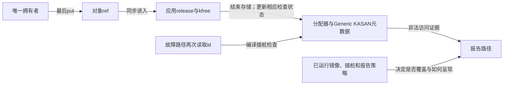
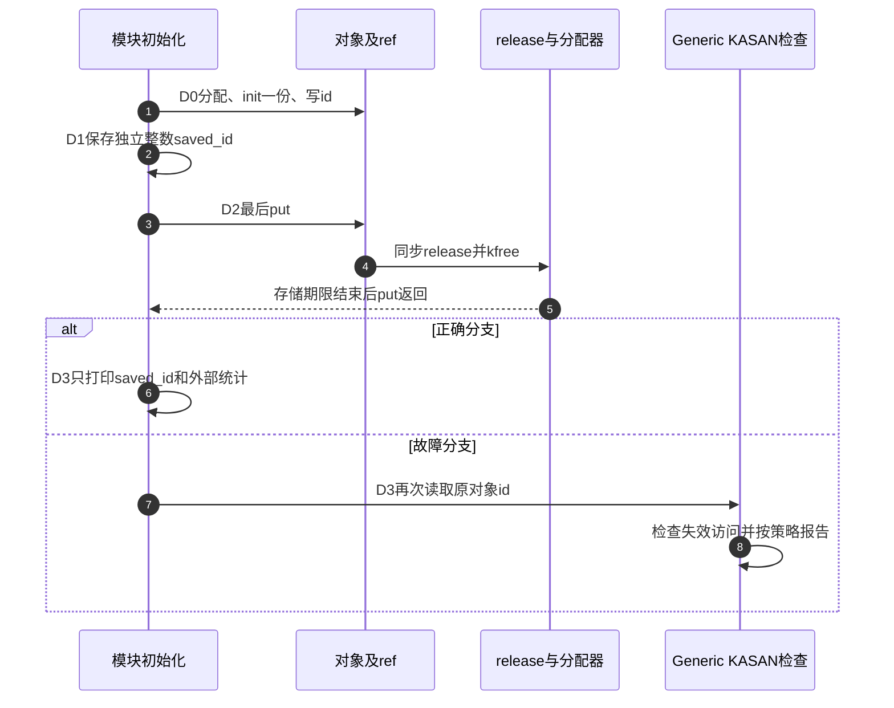

# 第37章\_KASAN释放后访问实验

RCU实验已说明为什么存储可能在归零后继续存在。本章换成最简单的直接回收对象：唯一份额被put，release立即kfree，随后再读id。这个现场不需要线程竞争，适合把“访问期限已经结束”和“诊断工具是否捕获访问”分开观察。

KASAN（Kernel Address Sanitizer，内核地址检查器）通过所选模式检查内存访问是否合法。它发现的是释放后访问（use-after-free，UAF）等后果，不替应用判断某个put到底消费了谁的一份。本章使用Generic模式的完整实验模块，正确路径默认开启，故障路径必须显式选择。

## 37.1\_先建立检查器证据的前提

这里有三组状态：对象ref及分配器的真实存储状态、KASAN用于判断访问合法性的元数据、当前报告策略。kref归零会同步调用应用release；release调用kfree以后，分配器和检查器按其实现更新状态。再访问已释放字段时，插桩检查可报告非法访问。kref本身既不保存KASAN元数据，也不会主动调用“KASAN检查此拥有者”的业务接口。



没有报告可能是故障路径没执行、运行了旧模块、内核或模块未按预期插桩、先前错误已经触发了报告限制，也可能是日志没有被保存。不能从一次无告警反推对象协议正确。正确路径仍需按拥有责任证明，故障路径仍需核对实际访问位置。

## 37.2\_选择当前平台支持的模式

固定NXP Linux 6.12.20提供Generic、软件标签、硬件标签三种选择；后两种只适用于ARM64对应能力，不能因处理器“较新”就在当前ARM配置里同时打开它们。本实验只讨论Generic，其架构能力、编译器支持和其他依赖须由Kconfig实际解析。

在单独的实验内核构建中选择如下结果，并重新生成匹配内核和外部模块。配置文本不是可以直接执行的Shell命令，也不是要求修改本仓库用来只读核对的外部源码树：

```text
CONFIG_KASAN=y
CONFIG_KASAN_GENERIC=y
CONFIG_STACKTRACE=y
```

软件模式还要选择OUTLINE或INLINE插桩形式：前者在访问点调用检查函数，后者把相应检查直接插入访问路径。它们调整代码布局与成本，不改变应用必须遵守的存储期限。STACKTRACE用于改善slab对象分配/释放栈；SLUB_DEBUG由该版本Generic配置选择，不是另一个等价的UAF检查器。不要只把几行追加到.config而忽略olddefconfig解析后是否仍保留。

从[kref源码总索引](../../../../research/source_reading/kref/navigation/P01_Linux_6.12_kref源码阅读索引.md#1.2_按问题进入已落地证据)进入[固定配置与报告导读](../../../../research/source_reading/kref/navigation/P07_引用错误的动态诊断导读.md#7.2_Generic模式的配置路径)，那里链接原始Kconfig与版本文档。当前只读核对的ARM工作树具备HAVE_ARCH_KASAN及编译器能力，但CONFIG_KASAN未启用；它不等于虚拟机正在运行的内核，也不能用于声称本次已经取得KASAN告警。

## 37.3\_完整模块只改变最后一次读取的位置

材料[note_kref_kasan.c](../../../../labs/kernel/object_lifetime/materials/note_kref_kasan.c)只分配一个对象，初始化id=9和一份引用，没有线程、队列或额外拥有者。正确分支在put前保存独立整数，put后只打印这个副本；故障分支在同一次最后put之后重新读取对象字段。

fault是装载时只读布尔参数，默认false。故障分支在未构建Generic KASAN时返回EOPNOTSUPP；这只是拒绝明显不满足前提的构建，不能证明运行时一定会报告。release_calls位于对象外，所以正确分支的统计不需要再访问已释放对象。

IS_ENABLED把构建配置是否启用转换为C条件；初始化处使用可睡眠分配标志GFP_KERNEL，分配失败返回ENOMEM（内存不足）。模块参数说明、登记及GPL许可沿用P32。READ_ONCE固定一次字段读取，不是保活接口；noinline保留独立函数边界，便于关联访问栈，实际符号和报告仍依赖构建。

```c
// SPDX-License-Identifier: GPL-2.0
#include <linux/errno.h>
#include <linux/kref.h>
#include <linux/module.h>
#include <linux/slab.h>

struct diagnostic_object {
    struct kref ref;
    int id;
};
static bool fault;
module_param(fault, bool, 0444);
MODULE_PARM_DESC(fault, "默认正确路径；true仅在Generic KASAN实验内核触发故意UAF");
static unsigned int release_calls;

static void diagnostic_release(struct kref *ref)
{
    struct diagnostic_object *obj = container_of(ref, struct diagnostic_object, ref);
    ++release_calls; /* 统计位于对象外，释放后不读对象。 */
    kfree(obj);
}

static noinline int observe_released_object(struct diagnostic_object *obj)
{
    /* 故意错误的实验点：READ_ONCE只要求读取，并不能恢复存储期限。 */
    return READ_ONCE(obj->id);
}

static int __init note_kasan_init(void)
{
    struct diagnostic_object *obj;
    int saved_id;
    /* 构建条件不满足时拒绝故障路径，避免将普通内核崩溃当成KASAN结果。 */
    if (fault && !IS_ENABLED(CONFIG_KASAN_GENERIC))
        return -EOPNOTSUPP;
    obj = kzalloc(sizeof(*obj), GFP_KERNEL);
    if (!obj)
        return -ENOMEM;
    kref_init(&obj->ref);
    obj->id = 9;
    saved_id = obj->id;
    kref_put(&obj->ref, diagnostic_release);
    if (fault)
        pr_info("note_kasan: invalid read=%d\n", observe_released_object(obj));
    else
        pr_info("note_kasan: saved=%d releases=%u\n", saved_id, release_calls);
    return 0;
}

static void __exit note_kasan_exit(void)
{
    /* 初始化中唯一对象已经归还；本例没有线程、队列或外部入口。 */
    pr_info("note_kasan: unloaded releases=%u\n", release_calls);
}
module_init(note_kasan_init);
module_exit(note_kasan_exit);
MODULE_LICENSE("GPL");
MODULE_DESCRIPTION("Generic KASAN下最后归还后的故意读取与标量副本对照");
```

故障分支的“invalid read”数值没有可依赖的含义。即使恰好仍打印9，也不能由此判断对象仍然存活，更不能把READ_ONCE当成绕过检查器的修复方法。



D0对应既有创建，D2对应[最后归还调用清理](../../../../research/source_reading/kref/source_explanations/include/linux/kref.h.md#1.4_最后归还调用清理)；D1、D3是本实验加入的访问位置。这个回调直接free，因此D2以后对象期限确实结束，不能把RCU延后回收模型的alive状态套进来。

## 37.4\_先运行正确对照再观察故障

按[P32运行身份](P32_基础引用与源码对照实验.md#32.1_先分清读哪份源码和运行哪个内核)记录源码提交、解析后的配置、实际启动内核与模块构建来源。使用可恢复的专用实验系统保存日志；此例故意访问已释放存储，运行策略可能在报告后panic，所以不能把后面的卸载命令当成必然会执行。

以下均为待执行的目标步骤。在仓库根目录，以实际启用Generic KASAN的匹配构建目录执行：

```bash
make -C "$KERNEL_BUILD" M="$PWD/labs/kernel/object_lifetime/materials" modules
sudo insmod labs/kernel/object_lifetime/materials/note_kref_kasan.ko fault=0
sudo rmmod note_kref_kasan
sudo dmesg | tail -n 24
```

正确路径预期saved=9、releases=1；它证明该次独立副本在归还后仍可用，不意味着任何指针副本都安全。如果保存的是指向对象内部字符串的指针，其所指存储期限并没有被复制。

确认新日志属于本次正确对照后，再在故障实验启动中选择：

```bash
sudo insmod labs/kernel/object_lifetime/materials/note_kref_kasan.ko fault=1
sudo dmesg | tail -n 100
```

预期检查位置是observe_released_object里的读取，可能出现`BUG: KASAN: use-after-free`及访问栈。具体栈帧、访问宽度和分配/释放历史由实际报告确认，本文没有粘贴伪造的运行报告。若系统继续运行且模块已成功装入，再执行`sudo rmmod note_kref_kasan`；若发生panic，则从恢复后的实验系统继续分析已保存日志，不再假定此前对象或模块状态。

固定文档说明，KASAN默认只报告第一次非法访问，并有panic_on_warn、kasan_multi_shot与kasan.fault等策略影响输出和退出。观察前记录它们的实际值和该次启动更早的告警，不能为了得到“第二次没报告”就宣布故障已修复。本章不自动更改运行系统的报告或panic策略。

## 37.5\_从报告回到责任原因

首先定位非法读取，而不是只看最后一行日志。其次确认释放栈是否经diagnostic_release，分配栈是否来自同一对象；栈记录缺失时记录缺失，不能补写推测值。然后回到D0～D3：只有一份且release直接free，所以D2已结束对象期限，D3再次取字段没有来源。

修复是在期限内完成读取、保留确实需要的独立份额，或者只保存独立值；不是随便把put后移直到报告消失。若问题来自异步使用，还要核对提交拒绝和关闭路径，不能靠本例的单线程修复替代P35协议。没有UAF也不等于字段没有数据竞争，后者留给下一实验。

本批宿主只运行正确、分配失败及禁用Generic时拒绝故障的五条组合路径，使用固定引用函数与分配替身；故意UAF分支没有执行。ARM前端在当前未启用KASAN的配置下通过，354个头中342份非生成源码与固定提交无差异；它不证明启用KASAN后的插桩、链接或目标运行。尚无目标模块装卸、实际告警、动态检测覆盖或视觉验收结果。

练习一，将saved_id改成对象内部字段的地址，说明为什么“提前保存”仍不能保住所指存储。练习二，保留第二份引用并只归还第一份，判断同一个读字段动作是否仍属于本章确定的UAF现场；答题必须列出剩余份额。练习三，故障模式返回EOPNOTSUPP时，先查构建配置与模块来源，不把它解释成KASAN证明了没有错误。

专题导航：[实验阅读路线](大纲.md#1.15_源码阅读实验)。

上一篇：[RCU查找与退休顺序](P36_RCU查找与退休顺序实验.md#36.1_归零与旧读者退出是两份证据)。

下一篇：[字段更新与KCSAN实验](P38_字段更新与KCSAN实验.md#38.1_两个有效使用者怎样丢掉一次更新)。
