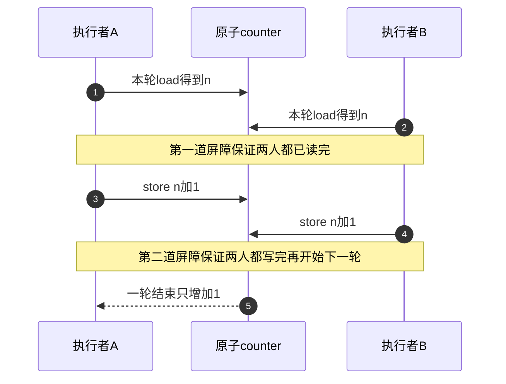
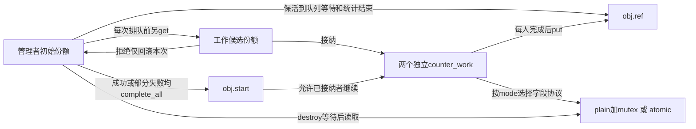

# 第38章\_字段更新与KCSAN实验

上一章解决“还能否访问这块存储”。现在对象被正确保活，两个执行者却同时更新counter。每人都能合法访问地址，不代表两次更新不会互相覆盖。先用没有未定义数据竞争的C++程序观察复合更新，再进入内核的故意竞争分支；两类结果不能混称为KCSAN告警。

KCSAN（Kernel Concurrency Sanitizer，内核并发检查器）通过编译插桩和观察点采样寻找冲突访问。它的采样、配置和接入边界独立于kref：对象引用保护存储期限，字段协议决定怎样读取和修改值。

## 38.1\_两个有效使用者怎样丢掉一次更新

设counter原值为0。执行者A读取0，B也读取0；A写回1，B随后也写回1。发生了两次“加一”的意图，最终值却只有1。整个过程中地址都可以保持有效，问题在于读取旧值和写入新值之间允许另一个更新插入。

若直接让两个C++线程无同步地修改普通整数，会形成语言层面的数据竞争，不能把某次跑出的数当成稳定模型。本章反例改用原子变量分别load和store，再用同步屏障安排两人都读完才写：每次访问合法，复合事务仍会丢更新。这是逻辑上的更新丢失，不是C++数据竞争，更不是我们已经运行KCSAN的证据。



修复可以用一把mutex覆盖整个读、改、写，或者对单个计数使用不可分割的fetch_add。若操作还要同时维持“计数与队列长度一致”之类多字段约束，给一个整数换成原子类型仍不够，必须定义组合协议。

## 38.2\_完整C++并发对照

[counter_updates.cpp](../../../../labs/kernel/object_lifetime/materials/counter_updates.cpp)采用C++20：shared_ptr副本使两个线程各有保活资格，管理者在join之后才读取结果；mutex、原子更新与两道barrier决定字段行为。start_gate是一道只打开一次的latch，先把线程创建失败与正常开始分开。第二个线程创建失败时，取消标志先置位，放行已创建线程并join，避免它永远等不到屏障同伴。

三个模式分别为locked（互斥更新）、atomic_rmw（原子读改写）和split_atomic（拆开的原子读与写）。rounds固定为1000，计数范围不会溢出；本例原子值只用于计数，relaxed顺序不被用来发布其他业务字段。

```cpp
#include <atomic>
#include <barrier>
#include <cassert>
#include <exception>
#include <iostream>
#include <latch>
#include <memory>
#include <mutex>
#include <thread>

enum class update_mode { locked, atomic_rmw, split_atomic };
struct counters {
    std::mutex lock;
    unsigned int plain = 0;
    std::atomic<unsigned int> atomic{0};
};

static void run_case(update_mode mode, const char *name)
{
    constexpr unsigned int rounds = 1000;
    auto state = std::make_shared<counters>();
    std::latch start_gate(1);
    std::barrier rendezvous(2);
    std::atomic<bool> canceled{false};
    std::thread workers[2];
    auto work = [&, state] {
        start_gate.wait();
        if (canceled.load())
            return;
        for (unsigned int step = 0; step < rounds; ++step) {
            if (mode == update_mode::locked) {
                std::lock_guard guard(state->lock);
                ++state->plain;
            } else if (mode == update_mode::atomic_rmw) {
                state->atomic.fetch_add(1, std::memory_order_relaxed);
            } else {
                // 单次访问均为原子，但读和写不是一个不可分割的更新。
                unsigned int old = state->atomic.load(std::memory_order_relaxed);
                rendezvous.arrive_and_wait(); // 两人都读完同一旧值才开始写。
                state->atomic.store(old + 1, std::memory_order_relaxed);
                rendezvous.arrive_and_wait(); // 两次写都完成后才进入下一轮。
            }
        }
    };
    try {
        for (auto &worker : workers)
            worker = std::thread(work);
    } catch (...) {
        // 创建第二个线程失败时，先取消并放行已创建者，避免它等不到同伴。
        canceled.store(true);
        start_gate.count_down();
        for (auto &worker : workers)
            if (worker.joinable())
                worker.join();
        throw;
    }
    start_gate.count_down();
    for (auto &worker : workers)
        worker.join();
    unsigned int actual = mode == update_mode::locked ? state->plain : state->atomic.load();
    unsigned int expected = mode == update_mode::split_atomic ? rounds : 2 * rounds;
    assert(actual == expected);
    std::cout << name << ": updates=" << 2 * rounds << " value=" << actual << '\n';
    // 管理者和线程的shared_ptr保住外壳，字段正确性仍由上述更新协议负责。
}

int main()
{
    try {
        run_case(update_mode::locked, "mutex");
        run_case(update_mode::atomic_rmw, "atomic_rmw");
        run_case(update_mode::split_atomic, "split_atomic");
    } catch (const std::exception &error) {
        std::cerr << "experiment failed: " << error.what() << '\n';
        return 1;
    }
}
```

在材料目录编译：

```bash
c++ -std=c++20 -Wall -Wextra -Werror -O2 -pthread counter_updates.cpp -o /tmp/counter_updates
/tmp/counter_updates
```

输出应为：

```text
mutex: updates=2000 value=2000
atomic_rmw: updates=2000 value=2000
split_atomic: updates=2000 value=1000
```

本批已经实际运行这三个双线程场景。第三行因为两道屏障固定了每轮顺序，所以不靠重复运行碰运气；它证明单次访问原子性与复合更新原子性不同。它没有执行kref、内核工作队列或动态竞争检测；shared_ptr也不自动锁住其所管理对象的字段。

## 38.3\_完整内核模块给每个工作者一份

原实验用kthread_run启动两个线程，管理者等它们结束后直接kfree，没有分别get。因此原文“两个线程都持有引用”的结论不符合代码；若完整退出保证管理者保活，实际是借用协议，还需要处理线程创建失败和可靠结束。msleep(1000)只是延迟，不保证两个线程已经完成，也不建立字段同步。

新的[note_kref_counter.c](../../../../labs/kernel/object_lifetime/materials/note_kref_counter.c)选用已学习的工作队列来闭合启动、部分失败和等待：两个独立work可由不同工作线程执行，每个接纳的work明确得到一份；管理者保留初始份额到队列销毁、统计完成。这里没有把一个work重复排两次，也不依赖kthread裸指针退出时序。



mode=0使用mutex，mode=1使用atomic_inc，mode=2故意无锁更新普通字段且只允许KCSAN构建。start completion负责释放已接纳者，不保证它们必定同时执行；WQ_UNBOUND允许跨CPU调度，max_active为2也不是实际重叠证据。cond_resched提供调度机会，不修复字段竞争。

入口用IS_ENABLED(CONFIG_KCSAN)检查构建配置。返回的负错误码分别表示参数非法（EINVAL）、当前构建不支持故障模式（EOPNOTSUPP）、分配失败（ENOMEM）和本例投递被拒绝（EIO）。其余分配、工作初始化和模块注册沿用前面已完成的模块。

```c
// SPDX-License-Identifier: GPL-2.0
#include <linux/atomic.h>
#include <linux/completion.h>
#include <linux/errno.h>
#include <linux/kref.h>
#include <linux/module.h>
#include <linux/mutex.h>
#include <linux/sched.h>
#include <linux/slab.h>
#include <linux/workqueue.h>

struct counter_object;
struct counter_work {
    struct work_struct work;
    struct counter_object *obj;
};
struct counter_object {
    struct kref ref;
    struct mutex lock;
    struct completion start;
    struct counter_work workers[2];
    unsigned int plain;
    atomic_t atomic;
};
static unsigned int mode;
module_param(mode, uint, 0444);
MODULE_PARM_DESC(mode, "0互斥更新，1原子增加，2仅在KCSAN构建中故意无锁竞争");
static unsigned int release_calls;

static void counter_release(struct kref *ref)
{
    struct counter_object *obj = container_of(ref, struct counter_object, ref);
    ++release_calls;
    kfree(obj);
}
static void counter_put(struct counter_object *obj)
{
    kref_put(&obj->ref, counter_release);
}
static void counter_worker(struct work_struct *work)
{
    struct counter_work *item = container_of(work, struct counter_work, work);
    struct counter_object *obj = item->obj;
    unsigned int step;
    wait_for_completion(&obj->start);
    for (step = 0; step < 100000; ++step) {
        if (mode == 0) {
            mutex_lock(&obj->lock);
            ++obj->plain;
            mutex_unlock(&obj->lock);
        } else if (mode == 1) {
            atomic_inc(&obj->atomic);
        } else {
            ++obj->plain; /* 故意的数据竞争，不以此结果推导正确计数。 */
        }
        if ((step & 255u) == 0)
            cond_resched(); /* 提供调度机会，不作为两执行者必定交错的证明。 */
    }
    counter_put(obj); /* 消费本次已接纳的工作份额。 */
}
static int __init note_counter_init(void)
{
    struct workqueue_struct *queue;
    struct counter_object *obj;
    unsigned int index, result_count;
    int result = 0;
    if (mode > 2)
        return -EINVAL;
    if (mode == 2 && !IS_ENABLED(CONFIG_KCSAN))
        return -EOPNOTSUPP;
    queue = alloc_workqueue("note_counter", WQ_UNBOUND, 2);
    if (!queue)
        return -ENOMEM;
    obj = kzalloc(sizeof(*obj), GFP_KERNEL);
    if (!obj) {
        destroy_workqueue(queue);
        return -ENOMEM;
    }
    kref_init(&obj->ref); /* 管理者一直持有到队列已销毁且统计结束。 */
    mutex_init(&obj->lock);
    init_completion(&obj->start);
    atomic_set(&obj->atomic, 0);
    for (index = 0; index < 2; ++index) {
        obj->workers[index].obj = obj;
        INIT_WORK(&obj->workers[index].work, counter_worker);
        kref_get(&obj->ref);
        if (!queue_work(queue, &obj->workers[index].work)) {
            counter_put(obj); /* 拒绝只收回本次候选，之前接纳者仍由worker归还。 */
            result = -EIO;
            break;
        }
    }
    complete_all(&obj->start); /* 成功或部分失败都先放行已接纳者，再等待。 */
    destroy_workqueue(queue);
    result_count = mode == 1 ? (unsigned int)atomic_read(&obj->atomic) : obj->plain;
    pr_info("note_counter: mode=%u result=%d count=%u\n", mode, result, result_count);
    counter_put(obj);
    return result;
}
static void __exit note_counter_exit(void)
{
    pr_info("note_counter: release=%u\n", release_calls);
}
module_init(note_counter_init);
module_exit(note_counter_exit);
MODULE_LICENSE("GPL");
MODULE_DESCRIPTION("对象份额与两工作线程字段更新的独立责任实验");
```

第二次queue_work被拒绝时，第一次已经接纳的worker仍有自己的份额。必须先complete_all，让它越过开始等待，再destroy_workqueue等它返回；如果先destroy再complete_all，会让管理者等待一个永远未被放行的worker。第二次候选则立即回滚，管理者最后消费初始份额。新work单次提交的拒绝在本批由宿主夹具注入，不冒充真实内核自然拒绝。

## 38.4\_单独准备KCSAN运行环境

固定Linux 6.12.20的KCSAN依赖HAVE_ARCH_KCSAN、支持的编译器、DEBUG_KERNEL，并且要求KASAN未启用。它不能直接沿用上一章启用了KASAN的配置。当前ARM源码配置没有KCSAN架构选择，不能手工强写配置就宣布支持；应在固定树支持的目标环境单独配置，并核对实际运行镜像。

版本入口从[kref总索引](../../../../research/source_reading/kref/navigation/P01_Linux_6.12_kref源码阅读索引.md#1.2_按问题进入已落地证据)进入[KCSAN配置与采样导读](../../../../research/source_reading/kref/navigation/P07_引用错误的动态诊断导读.md#7.5_KCSAN配置互斥与字段证据)。普通引用仍沿[最后归还唯一实现](../../../../research/source_reading/kref/source_explanations/include/linux/kref.h.md#1.4_最后归还调用清理)，对象保活不是竞争检测开关。

按[基础实验的源码与运行环境准备](P32_基础引用与源码对照实验.md#32.1_先分清读哪份源码和运行哪个内核)设置KERNEL_BUILD，并从仓库根目录执行以下命令。它指向与运行镜像匹配的已准备构建目录；先运行两条正确控制路径：

```bash
make -C "$KERNEL_BUILD" M="$PWD/labs/kernel/object_lifetime/materials" modules
sudo insmod labs/kernel/object_lifetime/materials/note_kref_counter.ko mode=0
sudo rmmod note_kref_counter
sudo insmod labs/kernel/object_lifetime/materials/note_kref_counter.ko mode=1
sudo rmmod note_kref_counter
sudo dmesg | tail -n 24
```

两次都预期result=0、count=200000、release=1。在已确认KCSAN启用、运行检查器有效且使用可恢复的实验环境时，再选择故障模式：

```bash
sudo insmod labs/kernel/object_lifetime/materials/note_kref_counter.ko mode=2
sudo dmesg | tail -n 100
```

mode=2的计数没有可依赖的正确值，也不保证一次运行就触发采样。即使打印200000，仍可能存在竞争。根据实际装载结果和系统是否继续运行决定卸载；本文没有执行该故障路径或保存目标报告。

报告若包含两条访问栈，应核对它们是否访问同一字段、哪些是读写、是否有至少一个写；也可能出现unknown origin报告，不能强行补出另一线程。未报告还要检查插桩、过滤、运行时是否关闭、采样及目标路径是否实际重叠。用data_race注解隐藏报告，或把counter++改成READ_ONCE/WRITE_ONCE组合，都不自动修复更新丢失。

## 38.5\_按证据层级验收

本批C++20三个真实双线程对照通过；线程创建异常清理已冷读，但未注入宿主线程创建失败。内核模块的十二组宿主协议检查覆盖两种正确模式下正常、队列分配失败、对象分配失败、第一次/第二次投递拒绝，以及非法mode和未启用时拒绝故障。夹具检查完成数、引用清理和开始放行顺序，锁、原子、completion和队列均为顺序替身；故意竞争模式没有运行。

ARM前端在当前无KCSAN配置下通过，354头中342份非生成源码与固定NXP提交无差异；初次严格宿主编译发现atomic_read与unsigned字段的条件表达式符号性不一致，已显式转换并重验。没有目标模块装卸、实际KCSAN报告、内核并发或硬件结论。两种正确协议的选择仍由业务字段约束决定，不能仅凭一次测试耗时排序。

练习一，将C++反例的load改成acquire、store改成release，解释为什么两次独立动作仍不是fetch_add。练习二，画出第二次排队失败时管理者、候选和已接纳worker的三份责任去向。练习三，在原kthread写法里坚持采用管理者借用，列出必须关闭的访问入口、全部成功创建者和等待完成点，不能继续称为每线程独立引用。

本章已把存储期限、单字段更新和动态采样分开。下一实验检查锁顺序：给字段加锁能够串行更新，却也可能因另一条路径按相反顺序取锁而无法继续。

专题导航：[实验阅读路线](大纲.md#1.15_源码阅读实验)。

上一篇：[KASAN释放后访问](P37_KASAN释放后访问实验.md#37.1_先建立检查器证据的前提)。

下一篇：[Lockdep锁顺序实验](P14_源码阅读实验.md#14.6.4_实验_11_lockdep_观察锁顺序)。
