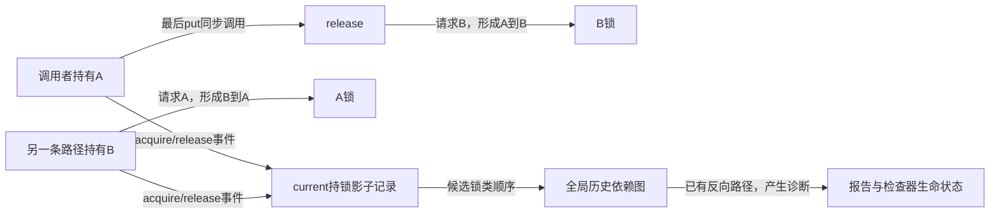
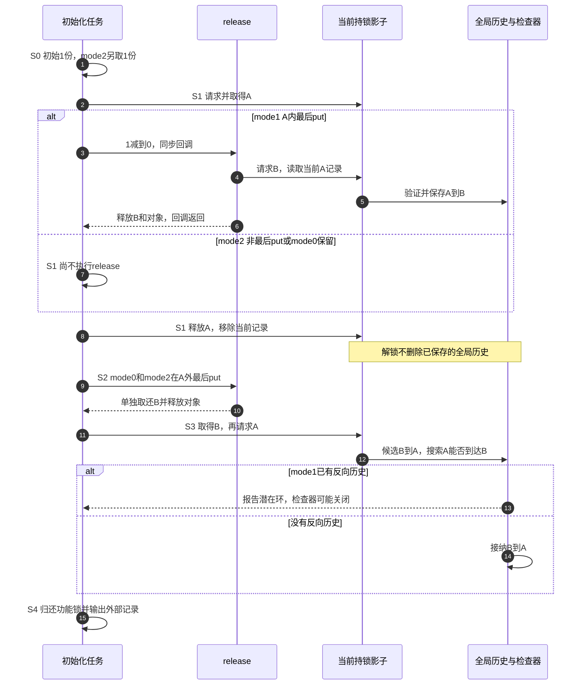

# 第39章\_最后归还与Lockdep实验

上一章给字段更新加锁，解决了两次修改互相覆盖的问题。现在调用者已经持有A锁，它执行一次put；对象恰好归零，释放回调又去取得B锁。代码表面只写了一次引用归还，执行路径却是“持有A时请求B”。若另一条路径持有B再请求A，两人就可能互等。

本章把这个隐含调用展开，并用完整模块比较三种归还位置。Lockdep是内核的锁依赖检查器；它能把不同时间看见的顺序联系起来，不要求实验先真的卡死。这里沿用普通mutex，回调在可睡眠的模块初始化上下文执行；中断和自旋锁上下文不能照搬。

## 39.1\_先把一条隐含依赖画出来

mutex串行化它保护的业务状态，kref决定何时同步调用release。这两项功能没有互相替代：增加引用不能解开锁环，按顺序取锁也不能补回漏掉的引用。

设release需要在B保护下修改清理统计。任务甲持有A并执行最后put，进入release时开始等待B。任务乙已经持有B，接着等待A；甲只有完成release才能继续释放A，乙只有取得A完成工作才能释放B。两把锁都发挥了互斥功能，组合起来却没有人能前进。这才是需要统一顺序的原因。



不过两种顺序也可能在一个任务里先后出现，中间所有锁都已释放。此时没有正在互等的两个任务，但历史已经给出潜在环。实验采用这种顺序，观察检查器如何记住已结束的路径；不创建两条线程去赌真正死锁。

修复本例可以把最后put移到A之外，因为本例A内没有任何必须和清理原子完成的业务动作。真实驱动不能机械移动：若A保护的是对象在集合中的可见性，应先在A内摘除入口、保留当前拥有份额，再解锁归还；若另有原子业务约束，就必须重新设计锁顺序或清理协议。单纯额外get只会推迟最后一次归还，不会让最后归还的上下文义务消失。

## 39.2\_三种模式共用一个完整模块

mode=0是默认正确路径：A内不归还，解锁后最后put。mode=1故意在A内最后put，使release形成A到B。mode=2先追加一份，在A内只消费其中一份，最后一份在A外归还。三种模式随后都执行B到A；第二种应成为待检测的反向依赖，其余两种并未经过A到B。

两把锁分别以DEFINE_MUTEX定义为静态对象，各有稳定身份；它们没有暴露给其他模块。mode只读，加载时选择后不会在中途变化。EINVAL表示模式非法，EOPNOTSUPP表示构建不支持故障实验，ENOMEM表示分配失败。IS_ENABLED(CONFIG_PROVE_LOCKING)只能检查编译配置，不能证明运行中的检查器仍然有效。

[note_kref_lock_order.c](../../../../labs/kernel/object_lifetime/materials/note_kref_lock_order.c)全文如下。release_calls放在对象外，最后put以后只观察它；不能为了验证释放而再读obj的字段。

```c
// SPDX-License-Identifier: GPL-2.0
#include <linux/errno.h>
#include <linux/kref.h>
#include <linux/module.h>
#include <linux/mutex.h>
#include <linux/slab.h>

struct lock_order_object {
    struct kref ref;
};
static DEFINE_MUTEX(lock_a);
static DEFINE_MUTEX(lock_b);
static unsigned int mode;
module_param(mode, uint, 0444);
MODULE_PARM_DESC(mode, "0在A外最后归还，1故意在A内最后归还，2在A内非最后归还");
static unsigned int release_calls;

static void lock_order_release(struct kref *ref)
{
    struct lock_order_object *obj = container_of(ref, struct lock_order_object, ref);
    mutex_lock(&lock_b); /* 最后put同步到达此处，继承调用者已有的持锁上下文。 */
    ++release_calls;
    mutex_unlock(&lock_b);
    kfree(obj);
}
static int __init note_lock_order_init(void)
{
    struct lock_order_object *obj;
    if (mode > 2)
        return -EINVAL;
    if (mode == 1 && !IS_ENABLED(CONFIG_PROVE_LOCKING))
        return -EOPNOTSUPP;
    obj = kzalloc(sizeof(*obj), GFP_KERNEL);
    if (!obj)
        return -ENOMEM;
    kref_init(&obj->ref);
    if (mode == 2)
        kref_get(&obj->ref); /* 另留一份，保证A内的这次put不是最后一次。 */
    mutex_lock(&lock_a);
    if (mode != 0)
        kref_put(&obj->ref, lock_order_release);
    mutex_unlock(&lock_a);
    if (mode != 1)
        kref_put(&obj->ref, lock_order_release);
    obj = NULL; /* 三种模式到这里都已释放，不再通过旧地址观察。 */

    /* 先前的锁都已归还；此路径检查历史顺序，不安排真实双任务互等。 */
    mutex_lock(&lock_b);
    mutex_lock(&lock_a);
    mutex_unlock(&lock_a);
    mutex_unlock(&lock_b);
    pr_info("note_lock_order: mode=%u release=%u\n", mode, release_calls);
    return 0;
}
static void __exit note_lock_order_exit(void)
{
    pr_info("note_lock_order: exit release=%u\n", release_calls);
}
module_init(note_lock_order_init);
module_exit(note_lock_order_exit);
MODULE_LICENSE("GPL");
MODULE_DESCRIPTION("最后引用回调与历史锁依赖的顺序实验");
```

mode=2并不让计数为2时的put“没做事”：它确实消费A内那位使用者的份额，只是未到零，因而不进入release。最后一份移到A外才释放对象。本例引用不存在并发变化；真实并发路径必须靠自己的有效份额与交接协议判断，不能以一次kref_read快照预言稍后的put是否最后。

## 39.3\_一次运行中四组状态怎样变化

这是引用、功能锁、检查器影子与历史共同组成的状态过程，不是一颗计数器。obj.ref保存引用数；lock_a和lock_b保存mutex功能状态。每个mutex内的dep_map向检查器提供身份，current->held_locks及深度保存当前任务的影子持锁记录；全局lock_class的locks_after/locks_before保留经过验证的历史边。debug_locks控制检查器是否还能够积累有效证据。

| 阶段 | 当前代码与引用责任 | 功能锁及检查状态 | 退出条件 |
| --- | --- | --- | --- |
| S0 准备 | 创建初始份额；mode=2另get一份 | A、B均空闲；本次尚未产生嵌套 | 分配成功，否则无资源返回 |
| S1 A内动作 | mode=1归零进入release；mode=2只从2减到1；mode=0保留1 | mode=1在A内请求B，检查器消费当前A记录，验证并保存A到B | 回调若发生则返回，随后释放A |
| S2 A外清理 | mode=0/2最后put并释放；mode=1已释放 | 正确模式只单独请求B，不生成A到B；所有模式结束时锁均空闲 | 对象已清理，旧地址不再访问 |
| S3 反向路径 | 已无对象份额，执行独立B到A | 先取得B，再请求A；mode=1的旧A到B使新候选闭环 | 无真实对手占锁；检查器可能报告并停检，功能路径仍需释放锁 |
| S4 返回和卸载 | 输出外部计数，不保留异步对象 | 功能锁均释放；当前持锁状态不等于全局历史，历史不会因unlock自动删边 | 正常返回；若报告导致panic，则按实验环境恢复 |

这里用“请求A”而不是“已持有A”描述S3检查点。固定版本的mutex慢路径在真正尝试取得之前上报mutex_acquire_nest，检查器中的acquire事件不能直接当成功能取得成功。若检查器在报告后失效，后续功能unlock仍要执行，影子状态也不能再当作完整证明。



检查器读取和更新这些状态发生在锁事件路径中；本例不用远端通知、轮询或等待另一个CPU汇报。不同任务留下的类依赖会汇入全局图，图的同步和容量处理由Lockdep负责。它付出了额外状态、事件检查和图搜索成本，所以不能由本例推出开启检测对性能没有影响。

## 39.4\_配置和报告必须连在一起核对

源码证据先从[kref源码总索引](../../../../research/source_reading/kref/navigation/P01_Linux_6.12_kref源码阅读索引.md#1.2_按问题进入已落地证据)进入[Lockdep源码总导读](../../../../research/source_reading/lockdep/navigation/P01_Linux_6.12_Lockdep源码导读.md#1.1_基线与阅读目标)。[归零回调实现](../../../../research/source_reading/kref/source_explanations/include/linux/kref.h.md#1.4_最后归还调用清理)兑现S1/S2的同步调用；[功能与检查路径](../../../../research/source_reading/lockdep/source_explanations/P02_Linux_6.12_Lockdep取得释放与持锁账本源码实现.md#2.6_功能路径与检查路径)解释请求和成功的时机，[新依赖验证](../../../../research/source_reading/lockdep/source_explanations/P03_Linux_6.12_Lockdep依赖图与规则引擎源码实现.md#3.4_check_prev_add新依赖验证)兑现S3。核心函数不在本章重复展开。

固定NXP Linux 6.12.20的PROVE_LOCKING依赖DEBUG_KERNEL和LOCK_DEBUGGING_SUPPORT，并选择LOCKDEP、DEBUG_LOCK_ALLOC、DEBUG_SPINLOCK等分支；非PREEMPT_RT时还选择DEBUG_MUTEXES等。原实验列出的四行CONFIG不是四条Shell命令，也不是任意架构都可以强写的开关。完整关系见[配置实现](../../../../research/source_reading/lockdep/source_explanations/P04_Linux_6.12_Lockdep查询注解与配置源码实现.md#4.5_PROVE_LOCKING_DEBUG_LOCK_ALLOC与LOCKDEP)。

按[P32准备匹配的构建与运行环境](P32_基础引用与源码对照实验.md#32.1_先分清读哪份源码和运行哪个内核)，从仓库根目录先构建并运行控制路径：

```bash
make -C "$KERNEL_BUILD" M="$PWD/labs/kernel/object_lifetime/materials" modules
sudo cat /proc/lockdep_stats
sudo insmod labs/kernel/object_lifetime/materials/note_kref_lock_order.ko mode=0
sudo rmmod note_kref_lock_order
sudo insmod labs/kernel/object_lifetime/materials/note_kref_lock_order.ko mode=2
sudo rmmod note_kref_lock_order
sudo dmesg | tail -n 40
sudo cat /proc/lockdep_stats
```

两个正常控制都应打印release=1，没有本例反向依赖。仍需核对配置、目标路径和检查器生命状态，不能把未报告直接写成锁顺序已证明。proc接口不存在时按[诊断模块导读](../../../../research/source_reading/lockdep/navigation/P04_Linux_6.12_Lockdep查询适配与诊断模块导读.md#4.5_配置与生命状态)检查构建条件；接口存在也要记录容量、debug_locks和此前报告。

在可恢复的实验内核中、确认检查器仍有效后单独运行故障模式：

```bash
sudo insmod labs/kernel/object_lifetime/materials/note_kref_lock_order.ko mode=1
sudo dmesg | tail -n 160
sudo cat /proc/lockdep_stats
```

报告应能对应S3正在请求A、当前已持有B和S1经过release留下的A到B历史。保存第一次报告的完整上下文，不只截取标题；若本次根本没经过最后put、原语未接入、此前已停检或容量耗尽，缺少报告没有证明力。报告后若系统仍运行且模块加载成功，才执行rmmod；panic配置可能使后续命令无法运行。重复故障测试前恢复干净有效的检查环境，不能直接把第二次没有报告当成修复。

## 39.5\_练习与证据边界

先不运行，预测mode=2在S1结束后的引用数、release次数和全局嵌套边，再与mode=1比较。接着把mode=2的额外get去掉，逐行检查后面的第二个put是否还有合法份额；此修改会同时破坏生命周期，不能把新故障仅解释为锁顺序。最后设想A保护集合入口，写出“摘除、解锁、归还”的责任转移，解释为什么当前拥有份额必须一直保留到解锁之后。

本批十四组宿主协议检查通过，覆盖检查配置开启和关闭时的三模式、分配失败、故障拒绝与非法参数。夹具中的mutex和两类历史图都是顺序替身；它核对本模块的引用、释放及顺序输入，不运行真正Lockdep规则引擎。ARM编译前端通过，354份头中342份非生成源码与固定提交无差异。没有目标模块链接装卸、真实Lockdep报告或死锁实验。检查通过不能把上面预期报告改写成已经观察到的事实。

现在已经能够解释：同一put接口为什么会因是否最后一份而经过不同锁路径，以及为何必须检查所有可能最后归还的调用上下文。下一组实验把这种“先区分责任与观测”的方法用于多put、计数快照和未摘链释放。

专题导航：[实验阅读路线](大纲.md#1.15_源码阅读实验)。

上一篇：[字段更新与KCSAN](P38_字段更新与KCSAN实验.md#38.1_两个有效使用者怎样丢掉一次更新)。

下一篇：[多归还与失效窗口](P40_多归还与失效窗口实验.md#40.1_计数为正仍可能归还了别人的份额)。
