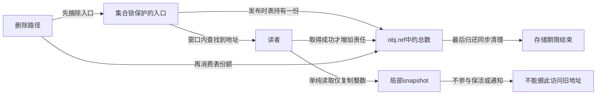
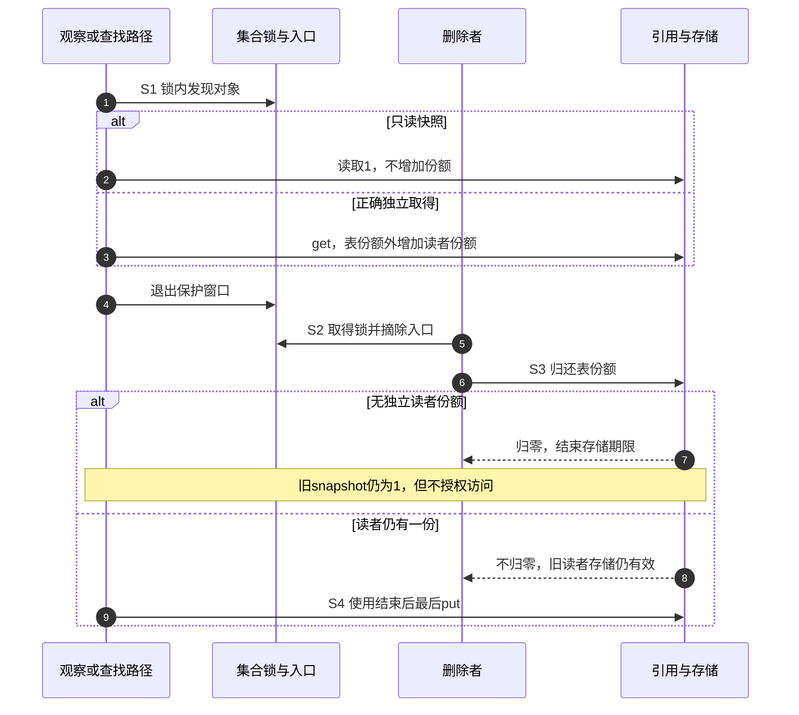

# 第40章\_多归还与失效窗口实验

上一章知道最后put可能进入更深的锁路径。接下来先问一个更早的问题：当前路径究竟有没有资格执行这次put？一个正计数不回答这个问题；一个刚读出的正快照，也不保证稍后仍能访问。我们把原实验12至14放到同一条时间线上，分开引用责任、地址保护和集合入口。

## 40.1\_计数为正仍可能归还了别人的份额

创建者和工作者各有一份，计数为2。创建者归还后还剩1，这是工作者的份额；创建者因重复清理又put一次，底层看到1减到0，于是正常调用release。数值没有下溢，工作者却失去了本应保护它的对象。

所以“多put会有refcount warning”只能描述部分异常分支，不能作为完整检测承诺。kref没有一张以调用者身份索引的拥有者表，它不知道两个put是否消费了同一份责任。修复要在创建、分享、转交、拒绝、取消和退出路径中找到重复消费，而不是加上“计数大于0才put”的判断。

另一种顺序是对象原来只有一份，第一次put已经kfree。第二次put连引用字段所在的地址都可能失效，在到达数值检测前就可能出现释放后访问、崩溃或复用后的任意表现；不能要求它稳定打印underflow。用kref_read预先判断会先读取同一块可疑存储，并没有为后面的访问提供保护。

## 40.2\_用完整C程序重放三个窗口

下面的[misuse_windows.c](../../../../labs/kernel/object_lifetime/materials/misuse_windows.c)是离线模型。shares保存两个具名拥有者的份额，refs是它们的总数，alive标记逻辑存储期限，published表示新查找还能否看到地址。模型的C结构一直留在main栈上，alive=false不执行free，因此可以安全检查“逻辑退休后还剩哪些入口”。

put_as首先核对拥有者的资格，NO_SHARE表示审计发现没有份额，直接拒绝；这比真实kref多了一份诊断账本，不能写成真实接口会替我们拦截。RETURNED表示还剩份额，RETIRED表示逻辑退休且未发布，PUBLISHED_AFTER_RETIRE表示对象已经退休但入口还保留地址。can_use_owned只检查本模型的独立拥有协议，不涵盖借用、业务状态或真实锁。

```c
// SPDX-License-Identifier: MIT
#include <assert.h>
#include <stdbool.h>
#include <stdio.h>

enum outcome { RETURNED, RETIRED, NO_SHARE, PUBLISHED_AFTER_RETIRE };
struct object_model {
    unsigned int shares[2]; /* 两个具名拥有者；地址别名不增加份额。 */
    unsigned int refs;
    bool alive, published;
};

static struct object_model create(unsigned int first, unsigned int second,
                                  bool published)
{
    return (struct object_model){{first, second}, first + second, true, published};
}
static enum outcome put_as(struct object_model *obj, unsigned int owner)
{
    assert(owner < 2);
    if (!obj->shares[owner])
        return NO_SHARE; /* 责任审计提前拒绝；真实kref不保存这张拥有者表。 */
    assert(obj->alive && obj->refs);
    --obj->shares[owner];
    if (--obj->refs)
        return RETURNED;
    obj->alive = false; /* 只标记逻辑退休，不释放C对象的实际存储。 */
    return obj->published ? PUBLISHED_AFTER_RETIRE : RETIRED;
}
static bool can_use_owned(const struct object_model *obj, unsigned int owner)
{
    assert(owner < 2);
    return obj->alive && obj->shares[owner] != 0;
}

int main(void)
{
    struct object_model shared = create(1, 1, false);
    assert(put_as(&shared, 0) == RETURNED);
    assert(shared.refs == 1 && can_use_owned(&shared, 1));
    assert(put_as(&shared, 0) == NO_SHARE);
    assert(shared.refs == 1); /* 数值为正，也不能替已归还者创造第二份。 */
    assert(put_as(&shared, 1) == RETIRED);
    puts("duplicate: positive count does not authorize another put");

    struct object_model observed = create(1, 0, false);
    // 在已有地址保护窗口内取快照；随后窗口结束，不把它带成一份引用。
    unsigned int snapshot = observed.refs;
    assert(put_as(&observed, 0) == RETIRED);
    assert(snapshot == 1 && !can_use_owned(&observed, 1));
    puts("snapshot: old positive value survives logical retirement");

    struct object_model bad_table = create(1, 0, true);
    // 槽0是表份额；错误路径先消费它，却让索引仍然可见。
    assert(put_as(&bad_table, 0) == PUBLISHED_AFTER_RETIRE);
    assert(bad_table.published && !bad_table.alive);
    puts("bad_table: retirement leaves a published address");

    struct object_model good_table = create(1, 0, true);
    good_table.published = false; /* 正确路径先在集合保护下摘除，再归还表份额。 */
    assert(put_as(&good_table, 0) == RETIRED);
    puts("good_table: unlink precedes returning the table share");

    struct object_model old_reader = create(1, 1, true);
    old_reader.published = false;
    assert(put_as(&old_reader, 0) == RETURNED);
    assert(!old_reader.published && can_use_owned(&old_reader, 1));
    assert(put_as(&old_reader, 1) == RETIRED);
    puts("old_reader: unpublished object remains owned until the reader returns");
    return 0;
}
```

在材料目录执行：

```bash
cc -std=c11 -Wall -Wextra -Werror -O2 misuse_windows.c -o /tmp/misuse_windows
/tmp/misuse_windows
```

五行输出依次说明：正数不授权重复归还；旧正快照不会随着对象退休自动消失；未摘除入口导致可见的旧地址；先摘除再归还表份额可以关门；摘除后旧读者的独立份额仍可维持存储。程序已经实际运行，所有断言通过。这里没有内核模块、真实并发、UAF或检测器报告。

## 40.3\_快照与查找资格沿同一周期变化

第二个场景特意假定第一次读计数时地址受保护。即使这个最初动作合法，离开保护窗口后另一位拥有者仍能最后put；本地snapshot整数保持1，并不会随着远端归还变成0。若连第一次读取时的地址保护都没有，错误发生得更早，不能先讨论快照值可信不可信。

| 阶段 | 引用与存储 | 集合及本地信息 | 谁能继续做什么 |
| --- | --- | --- | --- |
| S0 建立 | 拥有型表持1份，读者尚无份额 | 入口公开，尚无快照 | 集合协议允许在锁内查找 |
| S1 观察 | 裸观察不增加引用；正确查找会另get | 观察者保存snapshot=1；独立拥有者保存取得成功的责任 | 借用者只能在既定保护期内使用 |
| S2 关闭 | 删除者准备归还表份额 | 在集合锁内摘除，阻止新查找 | 旧读者若已get，责任不随摘除消失 |
| S3 归还 | 表份额消费；无其他份额则进入release | 局部旧快照仍可为1；错误分支入口也可能残留 | 裸观察者不能靠旧值继续访问 |
| S4 最后退出 | 正确旧读者最后put，才允许清理存储 | 集合入口已关闭，快照不参与存储管理 | 后续只观察独立记录，不解引用旧对象 |

S0至S4是对真实拥有型集合的统一分期，代码中的五个场景分别截取责任重复、裸快照、错误摘除和正确退出分支，不是假装五次执行同一个并发程序。第一段没有集合，第二段只展示S1到S3；最后三段分别展示集合关闭的反例和正例。





实际计数读取没有向所有保存过快照的任务发送“失效通知”。这种通知并未由某个隐藏接口替代；协议要求使用者始终保有份额，或始终处于明确的借用保护窗口。日志和统计同样必须先满足地址有效前提，不能因用途是debug就例外。

## 40.4\_摘链断言只能诊断既有协议

原实验在release中加入WARN_ON(!list_empty(&obj->node))后仍直接kfree。这能暴露本应已摘链却没有摘链的错误，不能修复它：WARN_ON不替调用者取得集合锁、不执行list_del_init，也不阻止后面的释放。在拥有型表协议里，表份额本来就应该一直维持到删除路径摘除之后；release负责检查该不变量，而不是临时补上删除步骤。

完整正确实现沿[P17拥有型链表](P17_拥有型链表工程模板.md#17.1_拥有型链表的发布与撤下)和[P34查找窗口实验](P34_查找窗口与条件取得实验.md#34.1_先确定表是否拥有引用)的note_kref_table.c。本批复核并重跑其六组宿主协议，表锁内摘除、锁外归还、旧用户份额及失败清理均保持原契约；未改已讲清的模块。那个模块的node经过INIT_LIST_HEAD和list_del_init，才可用list_empty作为“已脱链”的诊断，不能直接拿它检查XArray槽位或哈希桶。

非拥有索引的协议不同：可能在引用归零后的release中取得索引锁、删除弱入口，再允许存储回收；读者则在同一保护窗口内条件取得。因而应要求“入口和旧读者不再允许访问后才能回收存储”，不能把拥有型表的具体删除位置当成所有索引的规则。RCU链表还要等待旧读者结束，已经摘链不等于可以立即free，回顾[P36退休顺序](P36_RCU查找与退休顺序实验.md#36.1_归零与旧读者退出是两份证据)。

## 40.5\_把模型判断与源码检测对应起来

版本入口从[kref总索引](../../../../research/source_reading/kref/navigation/P01_Linux_6.12_kref源码阅读索引.md#1.2_按问题进入已落地证据)进入[归零与异常分支](../../../../research/source_reading/kref/source_explanations/include/linux/refcount.h.md#1.3_旧值决定归零与异常分支)：固定源码先取得减之前的old，old为1减1走合法归零，old已为0才走异常收敛。我们另用固定普通引用函数做三条宿主对照，底层原子为顺序替身：

| 输入安排 | 实际检查结果 | 能说明什么 |
| --- | --- | --- |
| 计数2连续减两次，把第二次视为重复消费同一拥有者 | release一次，无告警 | 原语不了解每份责任的归属 |
| ref保留在栈上，回调只记录不释放；归零后再put | 告警一次并饱和，不再次release | 地址仍有效时可以观察数值异常分支 |
| 在有效ref上读取1，再最后put | 旧局部值仍为1，实际ref已为0 | read没有新增份额，也不会追踪后续变化 |

第二条特意保留了实际C存储，所以不是“在已free对象上成功观测underflow”的证据；第三条同样不能推导真实kfree后还可以读ref。固定[异常收敛实现](../../../../research/source_reading/kref/source_explanations/lib/refcount.c.md#1.1_告警之前先收敛到饱和)和[计数读取实现](../../../../research/source_reading/kref/source_explanations/include/linux/kref.h.md#1.5_读取快照不新增责任)分别承担两个结论。已有宿主对照不替代KASAN目标测试，本批没有新增ARM构建或实际目标故障运行。

练习一，在第一条对照中画出“两份责任”和“两次数值减少”的差别，说明为什么只对齐总数不够。练习二，把模型的snapshot改为保存地址，解释这比保存整数还多了什么访问期限问题。练习三，把good_table改成先归还再摘除，标出错误最早在哪个阶段成立；再说明为什么在release中加一条WARN_ON不足以恢复正确性。

本章不以某条崩溃日志命名根因，而是先定位谁有权归还、谁保护地址、谁关闭入口。下一实验再问：入口关闭以后，仍然有份额的旧用户是否还能继续业务操作？

专题导航：[实验阅读路线](大纲.md#1.15_源码阅读实验)。

上一篇：[最后归还与Lockdep](P39_最后归还与Lockdep实验.md#39.1_先把一条隐含依赖画出来)。

下一篇：[旧用户与父子关系实验](P14_源码阅读实验.md#14.8_状态和父子关系实验_生命周期不等于业务可用)。
