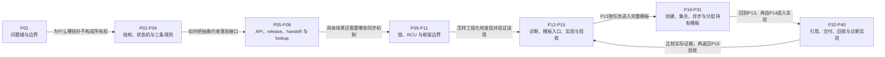

# 第1章\_kref\_引用计数机制章节大纲

本目录组织自定义对象的引用责任、Linux 接口及组合边界。

本专题保留既有章节的完整解释、代码、反例、实验与练习。工程模板中已经形成独立学习任务的创建、链表、哈希、XArray、工作、定时器、完成事件、回滚、删除、RCU、弱缓存、父子桥接、文件持有、引用封装、状态接纳与收尾契约单元分别编为P16～P31，由P13组织入口与返回路径；P14组织P32～P40的基础、窗口和诊断实验，再回到P15最终验收。正文保持唯一位置。



专题阶段与问题传递如下：

| 阶段 | 章节 | 前置结论 | 本阶段解决 | 留给下一阶段 |
| --- | --- | --- | --- | --- |
| 一：问题与基础模型 | P01～P04 | C 对象、指针与分配释放；P01 再引入 UAF | 对象生命期为什么需要所有权协议，kref 的结构、状态机和三条规则如何连成一体 | 规则如何落到完整 API 与工程路径 |
| 二：接口与所有权闭环 | P05～P08 | 已经能区分指针、引用和业务状态 | 初始化、get/put、release、handoff 与 lookup 保护窗口 | 不同同步机制怎样与 kref 组合 |
| 三：组合与框架边界 | P09～P11 | 已经能为单一对象闭合引用 | 锁、RCU、refcount_t、kobject 和 driver core 各自保护的状态 | 怎样将边界变成可复用、可审查的工程实现 |
| 四：工程化与验证 | P12～P15、P16～P31模板和P32～P40实验分支 | 已经掌握单机制与组合边界 | 错误分类、调试线索、工程模板、实验和最终验收 | 读者能否独立重建完整所有权协议 |

主线先读P01～P12；进入P13后，按创建P16 → 链表P17 → 哈希P18 → XArray P19阅读，再经P20工作交付、P21定时器、P22完成事件、P23失败回滚、P24删除排空、P25 RCU查找、P26弱缓存、P27父子桥接、P28文件持有、P29引用封装、P30状态接纳、P31收尾契约返回P13总表，再由P14阅读P32～P40，最后回到P15。下文与各篇末尾给出真实跳转入口，文件编号用于定位，不替代这里的依赖顺序。

## 1.1\_重构原则

本路线以“一个请求怎样被多个执行者安全使用”为贯穿问题。P01～P03先建立借用、独立持有、入口、业务与存储的区别；P04把它们变成责任规则，后续每章再用新的约束检验这些规则。已建立的概念会在具体场景中回顾，不能因前章出现过“锁”或“release”，就省去当前场景的保护条件和退出顺序。

| 已建立的结论 | 继续追问 | 承接章节 |
| --- | --- | --- |
| 指针的值不记录谁负责保持对象存活 | 地址从哪里来，第一次取得期间谁阻止回收 | P08查找，P09锁，P10 RCU |
| 归还消费当前责任 | 若继续访问，是否还有独立份额或有效借用期限 | P04规则，P07交付，P12错误分析 |
| 最后归还进入release | 清理能否睡眠、资源先后依赖什么、存储是否还要延迟回收 | P06回调，P09上下文，P10退休 |
| 引用保证的存储期限不等于业务许可 | 关闭后旧用户可以读取什么，已接纳活动怎样排空 | P03状态，P24删除，P30接纳 |
| 私有对象与框架对象有不同的管理入口 | 应调用哪一层接口，哪一个回调真正回收外壳 | P11框架，P15验收 |

通用正文建立因果模型与使用契约；[固定源码阅读索引](../../../../research/source_reading/kref/navigation/P01_Linux_6.12_kref源码阅读索引.md#1.2_按问题进入已落地证据)组织版本入口、状态落点与函数协作，具体实现再由各模块导读链接。两种阅读任务允许必要的背景回顾，不维护两份同版本函数体的逐句讲解。固定证据采用NXP Linux 6.12.20的dfaf2136提交，配置和实验层级以[基线](../../../../research/source_reading/linux/SOURCE_BASELINE.md)与各实验记录为准。

## 1.2\_kref\_要解决什么问题

正文：[kref要解决什么问题](P01_kref_要解决什么问题.md)。起点是C对象、指针与分配释放，不要求先知道内核引用接口。先比较同步借用和可能晚于调用者返回的异步工作，说明悬挂指针和释放后访问怎样形成，再引入独立持有责任。

[责任交接C模型](P01_kref_要解决什么问题.md#1.6.1_运行完整的责任交接模型)观察预留、接收、拒绝与归还；[一次工作交付模块](P01_kref_要解决什么问题.md#1.16.1_运行一次真实工作交付)把它落到发布前预留、回调退出和模块代码寿命。后半章逐一检验字段互斥、设备是否可操作、业务状态、查找窗口、计数快照和框架对象边界。

读完能说明为什么“手中还有地址”不足以允许访问，也能指出kref之外仍须证明什么。下一篇继续追踪：这些责任存在哪里，最终回调怎样从嵌入的计数成员找到完整对象？

## 1.3\_源码入口与结构定义

正文：[源码入口与结构定义](P02_源码入口与结构定义.md)。承接P01的责任模型，从`include/linux/kref.h`、`include/linux/refcount.h`进入结构层次；对照嵌入的`list_head`、`rb_node`，理解一个外壳为什么可以同时参与多种机制。

| 阅读入口 | 要建立的区别 |
| --- | --- |
| [回绕与饱和模型](P02_源码入口与结构定义.md#2.5.1_用八位模型观察回绕的代价) | 原子更新、引用契约与保守回收的代价 |
| [同一请求的ref/work地址](P02_源码入口与结构定义.md#2.9_container_of_是理解_kref_的关键) | 成员地址、完整外壳与回调类型；为何不能直接传kfree |
| [静态模块实验](P02_源码入口与结构定义.md#2.14.2_运行一个不释放静态内存的完整模块) | 初始化形式、存储期和归零回调 |
| [快照对照程序](P02_源码入口与结构定义.md#2.17.1_运行快照与持有的对照程序) | 观察到正数与实际拥有责任 |
| [完整对象模块](P02_源码入口与结构定义.md#2.19_标准自定义引用对象模板) | 外壳、附属资源和部分初始化失败 |
| [C++自动归还对照](P02_源码入口与结构定义.md#2.23.1_用完整程序观察自动归还) | 自动归还与手工责任，回调和多机制边界 |
| [单槽容器模块](P02_源码入口与结构定义.md#2.30.1_设计_A_容器持有引用) | 同锁发布、查找与撤下中的容器责任 |

普通init/get/put/read的关系在这里建立，具体函数实现沿固定源码索引阅读；编译属性与实际构建配置分别核对。下一篇把这些局部动作连成从创建到回收的完整过程，不把“计数到了零”当成所有状态都同时结束。

## 1.4\_kref\_生命周期状态机

正文：[kref生命周期状态机](P03_kref_生命周期状态机.md)。已知引用存储和接口作用以后，分别观察引用、索引入口、业务许可与实际存储期限；这些状态相互约束，却不是同一个数值的不同叫法。

[协议C模型](P03_kref_生命周期状态机.md#3.3.1_用C模型观察仍持有却被拒绝)说明仍持有却被业务拒绝的情形；[工作票据](P03_kref_生命周期状态机.md#%287%29_所有权表要补充失败路径和取消路径)把成功、失败、取消和交付放进同一责任表；[完整关闭模块](P03_kref_生命周期状态机.md#3.16_一个完整的生命周期模板)再连接初始化、份额扩散与收敛、发布撤下、已有用户和最终回调。

这里的release是归零清理入口；是否当场释放存储取决于完整回收协议。持有者也不能凭尚未归零就继续设备业务。下一篇从这一轮过程提炼三条规则，之后再分别追问交付、查找、锁与RCU如何补足真实运行约束。

## 1.5\_kref\_三条核心规则

正文：[kref三条核心规则](P04_kref_三条核心规则.md)。前置结论是P03的入口、业务许可、引用与存储分层。先用[借用与独立持有](P04_kref_三条核心规则.md#4.3_什么是_非临时拷贝指针)区分责任，再用[交付顺序](P04_kref_三条核心规则.md#4.4_为什么_before_很重要)解释预留为何必须先发生；归还与错误出口分别核对，最后比较[三种查找协议](P04_kref_三条核心规则.md#4.12_mutex/list_lookup_的最小模型)。

[完整责任槽程序](P04_kref_三条核心规则.md#4.16.1_传递给异步路径)用同一组borrow/share/move练习两种退出顺序与直接转交，查找则回到前章完整容器模块。能为每份责任指出建立者和归还者以后，下一篇检查API返回值与特殊分支。

## 1.6\_基础\_API\_源码逐行讲解

正文：[基础API源码逐行讲解](P05_基础_API_源码逐行讲解.md)。按前四章建立的规则核对`KREF_INIT(n)`、`kref_init()`、`kref_read()`、`kref_get()`、`kref_put()`、`kref_get_unless_zero()`、`kref_put_mutex()`与`kref_put_lock()`；每个接口都须说明输入前提、返回值和责任变化。

[条件取得C模型](P05_基础_API_源码逐行讲解.md#5.7.2_kref_get_unless_zero%28%29_的使用场景)观察读后变零、正数干扰、重试与返回边界；[锁组合完整模块](P05_基础_API_源码逐行讲解.md#5.8.2_kref_put_mutex%28%29_的典型用途)追踪先取锁后最终减少、慢路径重查与回调解锁。内存序结论按refcount契约与固定实现定位，不从“原子”二字推断所有字段已经同步。

[类型契约与章末回访](P05_基础_API_源码逐行讲解.md#5.10_API_封装模板)检查普通取得、条件取得和锁交接的不同前提。正文讲明调用选择，实现逐句说明由源码索引定位；下一篇处理回调内部资源和执行上下文。

## 1.7\_release\_回调与复杂销毁模式

正文：[release回调与复杂销毁模式](P06_release_回调与复杂销毁模式.md#6.1_本章主线)。先读[管理者等待借用退出的完整模块](P06_release_回调与复杂销毁模式.md#6.2.2_运行一个由管理者等待借用退出的模块)，把关闭入口、等待worker、归还引用和释放资源放进同一轮过程；再按[资源归属](P06_release_回调与复杂销毁模式.md#6.4.3_release_只释放对象_拥有_的资源)判断name、队列、借用指针和框架引用各由谁退出。

后续分别处理[可见性](P06_release_回调与复杂销毁模式.md#6.5_外部可见性_脱链应该由谁负责)、[执行上下文](P06_release_回调与复杂销毁模式.md#6.6_release_的执行上下文和锁语义)、[异步关系](P06_release_回调与复杂销毁模式.md#6.7_异步路径_work_timer_callback_的引用闭环)和[延迟存储回收](P06_release_回调与复杂销毁模式.md#6.8_RCU_边界_生命周期结束不等于内存立刻回收)。[定时器责任模型](P06_release_回调与复杂销毁模式.md#6.7.3_release_和_timer_的收尾关系)比较改期、普通删除与最终关闭，[RCU排序](P06_release_回调与复杂销毁模式.md#6.8.1_release_和_RCU_的边界)检查归零和存储回收为什么可能分离。

[章末回访](P06_release_回调与复杂销毁模式.md#6.10.2_一个复杂_release_示例)用完整程序检查资源依赖、命名与诊断。讨论对象是私有kref外壳，框架对象另在P11建立；下一篇追踪清理责任怎样通过接口转交给其他执行者。

## 1.8\_handoff\_所有权转移模型

正文：[handoff所有权转移模型](P07_handoff_所有权转移模型.md#7.1_本章定位)。先用[完整责任槽程序](P07_handoff_所有权转移模型.md#7.2.1_指针传递不等于引用转移)观察borrow、share与move，再比较[成功与拒绝](P07_handoff_所有权转移模型.md#7.2.5_take/consume_接管调用者当前引用)：接口转交的是指定的一份，发送者是否还可访问取决于剩余引用或有效借用窗口。

随后进入[真实异步场景](P07_handoff_所有权转移模型.md#7.3_典型_handoff_场景_异步路径_队列和回调)、[接口契约](P07_handoff_所有权转移模型.md#7.4_接口契约_成功_失败_命名和注释)与[完整请求模型](P07_handoff_所有权转移模型.md#7.6_完整模型_同一请求对象的两种设计)，核对重复提交、取消、超时、出队和完成。[完成事件模块](P07_handoff_所有权转移模型.md#7.3.5_completion_场景里的引用归属)比较早完成、超时取消与迟到完成，[双协议请求模块](P07_handoff_所有权转移模型.md#7.6.1_一个完整请求对象_handoff_示例)连接创建、入队、出队、工作交付和拒绝。

读完能够按接口契约画出一次交付的责任变化。接下来讨论lookup：没有交付者直接把受保护地址交到手上时，第一次取得由谁保护？

## 1.9\_lookup\_场景与\_kref\_get\_unless\_zero()

正文：[lookup场景与kref_get_unless_zero()](P08_lookup_场景与_kref_get_unless_zero%28%29.md#8.1_本章定位)。从容器里读到一个地址，并没有自动完成责任交接；先比较[指针、有效对象与引用](P08_lookup_场景与_kref_get_unless_zero%28%29.md#8.2_lookup_的基本边界_先分清指针_对象和引用)，再沿[锁与集合协议](P08_lookup_场景与_kref_get_unless_zero%28%29.md#8.3_基础保护模型_锁保护容器_kref_保护生命周期)追踪发布、取得和撤下。

[条件取得](P08_lookup_场景与_kref_get_unless_zero%28%29.md#8.4_kref_get_unless_zero%28%29_防复活_不防悬挂指针)只在合法地址上尝试非零增加；地址期限和正计数来源须分别证明。拥有型表的份额可以在临界区内证明正数，不拥有的索引则要按它与最终清理的协议另行判断。不能仅凭出现了mutex就选择普通get。

[哈希、XArray与IDR](P08_lookup_场景与_kref_get_unless_zero%28%29.md#8.5_常见容器_lookup_模板)改变索引方法，不免除这些前提；[返回契约](P08_lookup_场景与_kref_get_unless_zero%28%29.md#8.6_lookup_API_契约_返回裸指针还是返回引用)与[退出和业务边界](P08_lookup_场景与_kref_get_unless_zero%28%29.md#8.7_退出_状态和_RCU_边界)说明取得后还可以做什么。下一篇进一步区分锁分别保护的集合、字段和最后归还。

## 1.10\_kref\_与锁的组合

正文：[kref与锁的组合](P09_kref_与锁的组合.md#9.1_本章定位)。承接查找保护，先在[基本分工](P09_kref_与锁的组合.md#9.2_基本分工_kref_管生命周期_锁管一致性)中区分集合锁、对象字段锁与引用，再用[lookup、remove和状态](P09_kref_与锁的组合.md#9.3_lookup_remove_和状态_锁与_kref_的常规配合)组织完整运行周期。

[最后put的位置](P09_kref_与锁的组合.md#9.4_release_与锁_最后一个_put_发生在哪里)决定回调继承哪些锁与上下文；特殊put接口还包含最后减少、慢路径重查和解锁责任，不能从名称推断回调条件。[上下文与字段访问](P09_kref_与锁的组合.md#9.5_put_上下文和释放边界_锁内_锁外_软中断和字段访问)比较锁内/锁外、睡眠/原子路径以及是否另有访问资格。

[完整模板](P09_kref_与锁的组合.md#9.6_完整模板_锁_+_kref_对象的组织方式)和[错误审查](P09_kref_与锁的组合.md#9.7_错误模型_注释和检查清单)把锁顺序、字段保护与引用配对放在同一场景中。下一篇让读者不再等待同一集合锁，继续追问它的临时地址期限从哪里获得。

## 1.11\_kref\_与\_RCU

正文：[kref与RCU](P10_kref_与_RCU.md#10.1_本章导读_RCU_负责看到_kref_负责带走)。在已有锁查找模型上，先区分RCU临时读者和取得后离开读区的长期拥有者，再沿[查找路径](P10_kref_与_RCU.md#10.3_查找路径_从对象模型到_get_模板)说明地址、条件取得、业务锁与请求接纳的顺序。

[删除路径](P10_kref_与_RCU.md#10.4_删除路径_取消发布_引用归零与延迟释放)并列解释两种完整退休安排：一种最后归还后登记延迟回收，另一种让发布份额先跨过所需宽限期再归还。不能混用两者的直接free条件，也不能把撤下入口、旧读区结束、引用归零和回调完成看成同一事件。

[读侧约束](P10_kref_与_RCU.md#10.5_读侧约束_临界区_字段一致性和子资源)继续检查旧next、字段和附属资源；[完整工程模板](P10_kref_与_RCU.md#10.6_完整工程模板)回看停止回调来源与等待回调执行的代码寿命。RCU各实现的内部推进由独立RCU专题讲解；本篇形成组合协议以后，下一篇划清私有kref与框架生命周期的管理层次。

## 1.12\_kref\_refcount\_t\_kobject\_的边界

正文：[kref、refcount_t与kobject的边界](P11_kref_refcount_t_kobject_的边界.md#11.1_本章导读_先分清对象层次)。先沿[底层计数工具](P11_kref_refcount_t_kobject_的边界.md#11.2_底层计数工具_atomic_t_refcount_t_kref)比较原子更新、引用安全原语与归零回调封装，再由[kobject对象模型](P11_kref_refcount_t_kobject_的边界.md#11.3_kobject_边界_引用计数之外的对象模型)引入命名、层级和类型化释放。

[driver core](P11_kref_refcount_t_kobject_的边界.md#11.4_driver_core_边界_device_class_bus_不是裸_kref)分别建立device、class和bus的角色、内部管理与回调类型，不把它们画成C++继承链，也不把裸kref回调签名套给device_release或class_release。[分层对照](P11_kref_refcount_t_kobject_的边界.md#11.5_分层对照_裸_kref_driver_core_和私有引用)说明外壳引用、驱动私有对象和资源的期限可能分离。

[选择规则](P11_kref_refcount_t_kobject_的边界.md#11.7_选择规则)回答什么时候继续使用私有kref、什么时候遵循现有框架入口，不为计数需求额外引入完整kobject体系。接下来从错误症状反推哪一层责任或保护出了缺口。

## 1.13\_典型错误模式与调试线索

正文：[典型错误模式与调试线索](P12_典型错误模式与调试线索.md#12.1_本章导读_把错误模式归类排查)。在已经能画出正确协议之后，用责任轨迹诊断少get、少put、多put、无资格访问、交付/查找窗口、清理后残留入口、重新发布、重复初始化、字段竞争及框架层次错误。判断依据是实际拥有和保护条件，不是孤立代码里get与put的出现次数。

[工具入口](P12_典型错误模式与调试线索.md#12.2_调试入口_工具只能发现症状)区分KASAN、KCSAN、Lockdep和引用警告分别观察什么；[责任表与release断言](P12_典型错误模式与调试线索.md#12.9_调试方法_从所有权表到_release_断言)帮助定位最后一次合法交接。断言能暴露未脱链，不会自动修复链表；计数仍为正时的错还可能没有数值警告，未告警也不能代替路径覆盖与检查器有效性。

[汇总审查](P12_典型错误模式与调试线索.md#12.10_汇总审查_总表_流程和小结)把每个症状还原到参与者、状态位置与先后关系。下一阶段先选择符合输入前提的完整模板，再通过实验比较预测和实际证据。


## 1.14\_工程模板

入口：[P13工程模板](P13_工程模板.md#13.1_本章导读_把规则落成可复制模板)。模板先说明输入资格、成功与失败后的责任以及退出条件，再提供完整程序和可观察结果；不能以短函数名代替协议。

| 阅读顺序 | 本篇解决 | 下一篇需要的结论 |
| --- | --- | --- |
| [P16创建与失败清理](P16_对象创建与失败清理模板.md#16.1_模板命名约定) | 命名契约、初始份额、半初始化回滚 | 创建者可以交付一个完整对象 |
| [P17拥有型链表](P17_拥有型链表工程模板.md#17.1_拥有型链表的发布与撤下) | 表份额、重复发布/撤下和同步业务门 | 集合、业务及拥有者状态能够分别结束 |
| [P18拥有型哈希与IRQ](P18_拥有型哈希与IRQ工程模板.md#18.1_拥有型哈希与IRQ上下文) | 桶碰撞、单锁/双锁取舍、本地IRQ边界 | 索引方式和执行上下文不会替代引用协议 |
| [P19 XArray身份与删除](P19_XArray身份与删除工程模板.md#19.1_整数索引与期待对象删除) | 内部锁窗口、编号复用与期待对象移除 | 撤下者明确自己消费哪个条目的份额 |
| [P20工作交付与关闭](P20_工作交付与关闭工程模板.md#20.1_先选择分享还是转交) | 分享、转交、迟到投递与管理者等待 | 不把对象引用当作队列和代码寿命保证 |
| [P21定时器交付与关闭](P21_定时器交付与同步关闭模板.md#21.1_先把排队状态与对象责任分开) | 单次票据、执行或取消、改期与关闭边界 | 不把pending状态当作回调退出证明 |
| [P22完成事件与等待者](P22_完成事件与等待者工程模板.md#22.1_等待之前先取得合法对象) | 输入资格、超时、广播和单次结果契约 | 结果发布与生产者退出分别证明 |
| [P23分阶段失败与回滚](P23_分阶段失败与资源回滚模板.md#23.1_先列出失败时已经成立的责任) | 部分初始化、单一清理责任和发布后失败 | 按依赖结束资源并配对发布份额 |
| [P24删除入口与排空](P24_删除入口与活动排空工程模板.md#24.1_关闭业务不等于回收所有对象) | 业务门、借用等待、发布责任与资源期限 | 旧用户持有外壳不等于可继续访问资源 |
| [P25 RCU查找与业务关闭](P25_RCU查找与业务关闭工程模板.md#25.1_同一对象上有三组独立状态) | 条件取得、表份额、业务门和回调退出 | 地址期限与正计数来源分别说明 |
| [P26弱缓存撤销与回收](P26_弱缓存撤销与RCU回收模板.md#26.1_新读区为什么救不了旧缓存) | 不拥有的入口如何在回收前失效 | 条件取得仍须匹配完整地址保护协议 |
| [P27父子桥接与非拥有链表](P27_父子桥接与非拥有链表模板.md#27.1_一条关系对应几份引用) | 父桥接、子用户、最终摘链与关闭 | 每个对象实例与每份用户责任分别计数 |
| [P28文件实例与私有对象](P28_文件实例与私有对象持有模板.md#28.1_计数单位是文件实例) | open候选、dup与最终release | 区分文件、对象、代码三种寿命 |
| [P29引用封装与调试责任](P29_引用封装与调试责任模板.md#29.1_接口先交代谁拥有哪一份) | 输入前提、单次求值、清槽与日志 | 封装不能创造访问资格或同步共享状态 |
| [P30状态观察与活动接纳](P30_状态观察与活动接纳模板.md#30.1_LIVE不是一张永久通行证) | 存储、业务、索引、活动与通知 | 同一关闭周期内完成接纳和排空证明 |
| [P31接口契约与退出审查](P31_接口契约与退出审查模板.md#31.1_把成功和失败分别写进注释) | 中文契约、借用、资源依赖与代码退出 | 完整程序基础上的工程查询页 |
| [返回P13总表与审查](P13_工程模板.md#13.9_本章模板总表) | 按前提选择模板并核对责任 | 接入P14源码阅读实验 |

------

## 1.15\_源码阅读实验

从[P14实验总入口](P14_源码阅读实验.md#14.1_本章导读_用实验验证生命周期边界)先预测责任，再执行适用实验并回到固定源码。前两组是一份或两份责任的顺序观察，不是两个线程的并发测试。

| 阅读顺序 | 要验证的边界 |
| --- | --- |
| [P32基础引用与源码对照](P32_基础引用与源码对照实验.md#32.1_先分清读哪份源码和运行哪个内核) | 固定源码、构建/运行身份、完整模块、初始与最后归还 |
| [P33缺失与未归还责任](P33_缺失引用与未归还责任实验.md#33.1_先确定删除的是哪一份) | 可重复责任轨迹、转交反例、业务结束与真实工具边界 |
| [P34查找窗口与条件取得](P34_查找窗口与条件取得实验.md#34.1_先确定表是否拥有引用) | 表份额、首次取得期限与真正的零值窗口 |
| [P35工作交付与关闭窗口](P35_工作交付与关闭窗口实验.md#35.1_候选份额不等于已经交付) | 分享/转交、拒绝/取消、提前完成与停止实际投递 |
| [P36RCU查找与退休顺序](P36_RCU查找与退休顺序实验.md#36.1_归零与旧读者退出是两份证据) | 对照两种退休协议，分开归零、GP与回调完成 |
| [P37 KASAN释放后访问](P37_KASAN释放后访问实验.md#37.1_先建立检查器证据的前提) | 完整正确/故障对照、固定Generic支持与实际报告边界 |
| [P38字段更新与KCSAN](P38_字段更新与KCSAN实验.md#38.1_两个有效使用者怎样丢掉一次更新) | 真实C++并发对照、每工作份额与动态采样边界 |
| [P39最后归还与Lockdep](P39_最后归还与Lockdep实验.md#39.1_先把一条隐含依赖画出来) | 三种归还上下文、历史依赖与检查事件边界 |
| [P40多归还与失效窗口](P40_多归还与失效窗口实验.md#40.1_计数为正仍可能归还了别人的份额) | 责任与数值检测、快照失效、入口摘除和断言边界 |
| [状态和父子关系](P14_源码阅读实验.md#14.8_状态和父子关系实验_生命周期不等于业务可用) | 沿P30完整模型区分旧引用与活动，沿P27模块验证桥接与父关闭 |
| [记录与复盘](P14_源码阅读实验.md#14.9_实验记录和代码组织) | 区分预测、实际输出与未执行项，再用16项实验总表定位 |

实验结果要记录验证层级。宿主替身、ARM前端、目标装卸和真实并发各自只能支持相应结论，不能把预期日志写成已经捕获的目标输出。

------

## 1.16\_最终验收标准

正文：[最终验收标准](P15_最终验收标准.md#15.1_本章导读_最终验收看所有权协议)。

从基础六题、组合场景、框架与工程责任到[最终表模块验收](P15_最终验收标准.md#15.8_最终代码模板验收)，用实际程序和完整责任账本作答；L0至L5是六层练习定位，不是目标安全认证。

定位：[基础六题](P15_最终验收标准.md#15.3_核心概念验收_生命周期_指针和引用)要求解释保护对象、借用/拥有、初始份额、首次取得、归还后资格和回调外壳；以P32完整程序作答，再进入组合场景与工程验收。

学完后至少能回答：

```text
1. kref 保护的是什么，不保护的是什么？
2. 为什么有指针不等于有引用？
3. 为什么 kref_init 初始值是 1？
4. 为什么 kref_get 前必须证明对象有效？
5. 归还当前份额后若要再访问，必须另外证明哪种保护？
6. release 为什么拿到的是 struct kref *？
7. 首次get的地址和正计数前提分别由哪套协议证明？
8. kref_get_unless_zero() 解决什么，不解决什么？
9. handoff 成功和失败时引用归谁？
10. kref 和 mutex/RCU/kobject 的边界分别是什么？
```

[组合场景四题](P15_最终验收标准.md#15.4_使用场景验收_handoff_lookup_锁和_RCU)要求用真实工作、表与RCU材料检查成功/拒绝、提前完成、重复撤下和回调退出；业务接纳不能由lookup中的一次状态快照代替。

[框架与工程验收](P15_最终验收标准.md#15.5_边界和错误验收_框架对象_错误模式和所有权表)把对象体系、十类错误、角色表和退出依赖放在实际前提下判断，拒绝以固定API清单替代责任证明。

辅助查询可参照[Linux 6.12的kref接口文档](https://www.kernel.org/doc/html/v6.12/core-api/kref.html)；本仓库版本化结论仍回到[固定kref.h原文](../../../../research/source_reading/linux/include/linux/kref.h)及前述源码阅读索引。
