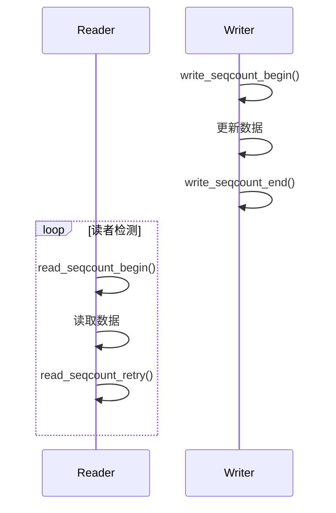
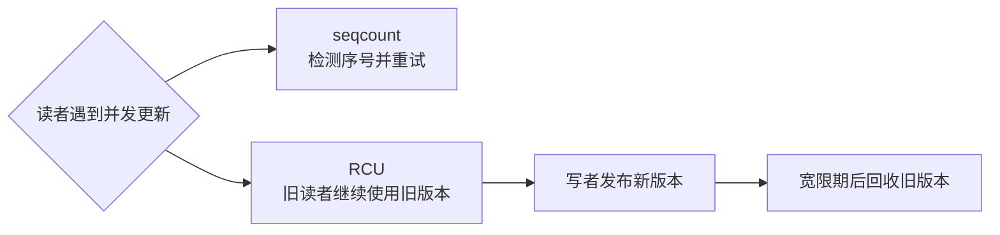

# 第5章\_读多写少路线\_seqcountseqlock\_与\_RCU

## 5.1\_读多写少路线\_seqcount/seqlock\_与\_RCU

------

### 5.1.1\_章节内容说明

在上一章中，我们介绍了锁的家族及其分工——从短临界区的自旋锁到可睡眠的互斥锁与信号量。
 然而，当系统进入“读多写少”场景（如状态监控、配置查询、设备表查找）时，传统锁会让大量读者相互阻塞，极大地浪费 CPU 并影响实时性。

本章讨论 Linux 针对该问题提出的两种代表性机制：

- **seqcount / seqlock**：适用于“读可以重试”的高频读场景；
- **RCU（Read-Copy-Update）**：适用于“读侧不能被打断”的场景。

两者共同构成了 Linux 并发控制中的“读多写少”路径。

------

### 5.1.2\_seqcount/seqlock\_读可重试的快照机制

#### (1)\_概念

**seqcount（sequence counter）**是一种单调递增的序列计数器，用于判断读操作是否与写操作重叠。
 **seqlock** 是在 seqcount 外加自旋锁的一种复合形式，用于保护写段。

> 原理：写者递增序号（奇数→偶数），读者检测到读前后序号不同则重读。

------

#### (2)\_解决了什么问题

- 避免读者阻塞写者：读者无锁读取；
- 保证一致性：通过序列号判断数据是否被修改；
- 写段可短暂锁住数据但不影响读性能。

------

#### (3)\_带来了什么新问题

| 问题类型             | 描述                                       |
| -------------------- | ------------------------------------------ |
| 读侧可能重试         | 不保证实时一致性                           |
| 写段必须极短         | 否则读者频繁重试                           |
| 不适合可睡环境       | 因为读侧不加锁                             |
| 无法用于复杂依赖关系 | 序列机制只检测“是否变化”，不解决“何时更新” |

------

#### (4)\_表\_5-1\_seqcount/seqlock\_特征

| 特征         | 值                           |
| ------------ | ---------------------------- |
| 读侧是否加锁 | 否                           |
| 写侧是否加锁 | 是（自旋）                   |
| 是否可睡     | 否                           |
| 典型场景     | 状态读取、时间戳、全局计数器 |
| 错误用法     | 在复杂结构或可睡函数中使用   |

------

#### (5)\_典型使用逻辑

```c
unsigned seq;
int val;

/* [INV] 读侧逻辑：检测一致性 */
do {
    seq = read_seqcount_begin(&s);
    val = shared_data;
} while (read_seqcount_retry(&s, seq));

/* [INV] 写侧逻辑：持锁更新 */
write_seqcount_begin(&s);
shared_data = new_value;
write_seqcount_end(&s);
```

------

#### (6)\_图\_5-1\_seqcount/seqlock\_读写时序



------

### 5.1.3\_RCU\_读无锁\_写延迟回收

本章只负责把 RCU 放在“读多写少机制”的坐标中，不在这里重复其硬件基础、通知机制和 API。完整推导从[为什么需要 RCU](../../rcu/P01_为什么需要_RCU.md)开始，阅读入口见[RCU 专题大纲](../../rcu/大纲.md)。

对比 seqcount 时只需先抓住这一差异：seqcount 允许读者发现冲突后重试；RCU 允许已经开始的旧读者继续使用旧版本，并将回收推迟到宽限期之后。



RCU 不提供写写互斥，不保证对象内部多个可变字段形成一致快照，也不授予离开读侧临界区后的长期所有权。这些机制边界和正确调用规则统一由 RCU 专题维护。

------

### 5.1.4\_seqcount\_与\_RCU\_的取舍

| 维度     | seqcount/seqlock | RCU                  |
| -------- | ---------------- | -------------------- |
| 读路径   | 无锁 + 可重试    | 无锁 + 无重试        |
| 写路径   | 短锁 + 原地更新  | 发布新状态 + 延迟回收旧状态 |
| 回收策略 | 不延迟           | 延迟（grace period） |
| 适用场景 | 状态快照、计数器 | 读多写少的数据结构   |
| 可睡性   | 否               | 否                   |
| 典型组合 | 与 spinlock 配合 | 与 kref/devres 配合  |

------

### 5.1.5\_混搭与边界

| 组合              | 结果   | 说明               |
| ----------------- | ------ | ------------------ |
| seqcount + 自旋锁 | ✅ 推荐 | 短锁保护写端       |
| RCU + 自旋锁      | ✅ 常用 | 写端需原子替换     |
| RCU + 互斥锁      | ✅ 常用 | mutex 串行化写者；不要持锁等待同一更新链依赖的 GP |
| seqcount + RCU    | ⚠️ 可组合 | 分别解决对象生命周期与对象内部快照时可以组合，但必须写清各自职责 |
| RCU + 引用计数    | ✅ 推荐 | 可安全延迟回收     |

------

### 5.1.6\_常见坑

| 标识   | 描述                                            |
| ------ | ----------------------------------------------- |
| [PIT1] | 在普通 RCU 读侧临界区内主动睡眠；若必须跨睡眠应使用 SRCU 或先取得独立引用 |
| [PIT2] | 取消发布后没有使用 `synchronize_rcu()`、`call_rcu()` 或 `kfree_rcu()` 等 GP 机制便释放旧对象 |
| [PIT3] | 使用 seqcount 时写段过长                        |
| [PIT4] | 读者未重试导致读到不一致数据                    |
| [PIT5] | 在多核环境下使用普通指针替换 RCU 对象           |
| [PIT6] | 忘记使用 `rcu_dereference()` 导致编译器乱序访问 |

------

### 5.1.7\_最小模板

```c
/* [INV] seqcount 用于短暂数据快照 */
do {
    seq = read_seqcount_begin(&counter);
    snapshot = data;
} while (read_seqcount_retry(&counter, seq));

/* [INV] RCU 用于结构指针替换 */
rcu_read_lock();
ptr = rcu_dereference(g_ptr);
process(ptr);
rcu_read_unlock();

new = alloc_new();
mutex_lock(&update_lock);
old = rcu_replace_pointer(g_ptr, new, lockdep_is_held(&update_lock));
mutex_unlock(&update_lock);
synchronize_rcu();  /* [CHECK] 等待调用前可能存在的旧读者跨过安全边界 */
free(old);
```

------

#### (1)\_表\_5-3\_核对表

| 核对项 [CHECK]                         | 说明                            |
| -------------------------------------- | ------------------------------- |
| 是否区分 seqcount 与 RCU 适用场景？    | seqcount 用于快照，RCU 用于结构 |
| 写者是否确保短临界区？                 | 否则 seqcount 重试过多          |
| 是否正确安排 GP 后回收？               | 按上下文选择同步等待或异步回调，否则存在悬挂指针风险 |
| 是否禁止可睡操作？                     | seqcount 读循环不能阻塞；普通 RCU 读侧不主动睡眠，跨睡眠用 SRCU |
| 是否保证读者使用 `rcu_dereference()`？ | 防止编译器乱序                  |

------

### 5.1.8\_小结

1. **seqcount/seqlock** 用于读重试式一致性快照；
2. **RCU** 用于无锁读与延迟回收的结构更新；
3. 两者的核心目标都是**在高读负载下维持一致性与低延迟**；
4. 它们代表 Linux 并发控制的“读多写少”路径，为内核表查找与驱动状态缓存奠定基础。

------

**下一章预告**
 第6章将讨论 **CPU↔设备的顺序与一致性**，包括 I/O 寄存器访问的顺序规则、DMA 一致性问题，以及 CPU 与外设之间的可见性与确认点设计。
