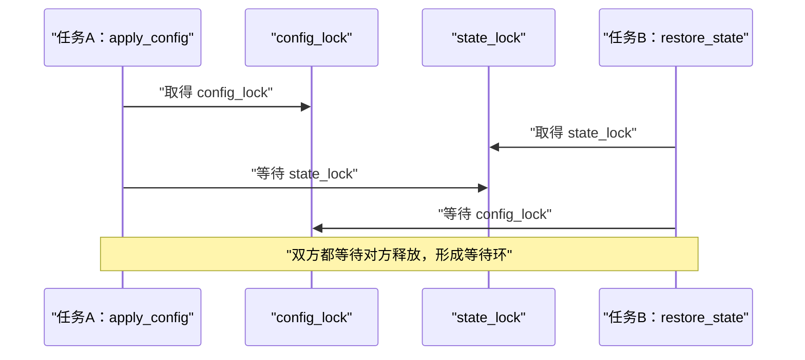
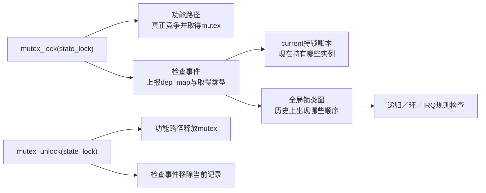

# 第1章\_为什么需要\_Lockdep

## 1.1\_单把锁正确不等于锁协议正确

mutex 能保证同一时刻只有一个持有者，spinlock 能让短临界区在不可睡眠路径中互斥。这些保证很重要，但它们只回答 **一次锁操作怎样运行**，并不自动回答整个模块是否始终遵守同一锁顺序。

假设设备同时有配置和状态两类共享数据：

```c
static DEFINE_MUTEX(config_lock);
static DEFINE_MUTEX(state_lock);

static void apply_config(void)
{
	mutex_lock(&config_lock);
	/* 根据配置更新状态。 */
	mutex_lock(&state_lock);
	mutex_unlock(&state_lock);
	mutex_unlock(&config_lock);
}

static void restore_state(void)
{
	mutex_lock(&state_lock);
	/* 根据当前状态恢复配置。 */
	mutex_lock(&config_lock);
	mutex_unlock(&config_lock);
	mutex_unlock(&state_lock);
}
```

每个 `mutex_lock()` 都可能完全正确地取得锁，每个 `mutex_unlock()` 也都与之配对，但两个任务交错时仍会停住：



错误不在某一把锁内部，而在两条调用路径共同形成的顺序协议：

```text
路径A观察到 config_lock → state_lock
路径B观察到 state_lock  → config_lock
两条顺序闭合成环
```

## 1.2\_为什么等待真实死锁再抓现场不够

真实死锁需要特定时间窗口：任务 A 必须在取得第一把锁以后停住，任务 B 又恰好取得另一把锁，二者再分别尝试第二把锁。测试可能运行数小时也没有命中这个交错，但代码中的两个顺序已经客观存在。

更有效的目标不是“等两个 CPU 真正卡住”，而是：

1. 观察每条简单路径发生过的锁取得顺序；
2. 把这些顺序跨任务、跨时间累积成图；
3. 每次加入新顺序时检查它是否闭合既有路径。

因此同一个任务依次执行 `apply_config()` 和 `restore_state()`，也足以给检查器提供两条组件链。图闭合以后，检查器可以报告 **潜在死锁**，不要求两个任务已经同时互等。

## 1.3\_为什么锁对象的owner字段不够

以 mutex 为例，功能实现可以在锁对象中保存当前 owner，以便判断锁是否空闲、处理等待或核对解锁者。但只看 owner 仍不能回答：

- 当前任务在取得 `state_lock` 以前还持有哪些锁；
- 几分钟前另一个任务曾经观察到什么锁顺序；
- 两把同类型对象锁是否应被视为同一锁类；
- 某锁类是否既在硬中断使用，又曾在硬中断开启时取得；
- 这次取得是独占、非递归读还是递归读。

若为回答“current 当前持有哪些锁”而扫描全内核锁对象，不仅没有一个完整、稳定的锁对象集合，访问方向也与主要问题相反。因此检查器需要按执行上下文保存当前账本，并另建跨时间的全局历史。

## 1.4\_Lockdep增加了什么

Lockdep 让标准锁原语在功能动作旁边上报检查事件：



这里有两条不能混写的因果链：

| 链 | 真正作用 | 检查关闭后的结果 |
| --- | --- | --- |
| 锁功能链 | 建立互斥、等待与内存顺序 | 仍由锁原语继续执行 |
| Lockdep 检查链 | 记录影子状态并验证锁协议 | 诊断能力消失，调用者义务不消失 |

因此 Lockdep 不是死锁恢复器。它不会替任务打破等待环，也不会替调用者选择正确锁序；它在已经执行到的简单路径基础上，尽早指出某种组合可能形成死锁。

## 1.5\_它首先要证明什么

贯穿场景给出四项基本证明义务：

1. **取得/释放配对：** 当前路径不能释放从未取得的锁，也不能在任务退出时遗留持锁记录；
2. **同类递归合法性：** 再次取得同一锁类时，取得类型和显式嵌套关系必须允许；
3. **顺序无环：** 新增 `A → B` 前，全局图中不能已经存在 `B → ... → A`；
4. **上下文一致：** 可能在 IRQ 中取得的锁，不能与 IRQ 开启区间中使用的锁形成可被中断重入的危险关系。

后续还会加入读写取得、trylock、自然层级、wait type 和虚拟锁域，但这些都是在上述问题已经出现以后增加的模型维度。

## 1.6\_本章结论

锁原语保证单次操作语义，Lockdep 验证跨调用路径的锁协议。它之所以必须维护影子状态，是因为“current 现在持有什么”和“历史上锁类怎样排序”分属不同时间尺度，单个锁对象的当前 owner 无法同时回答。

下一章将从锁事件流推导 Lockdep 的四类角色、三组状态轴和一个完整检查周期。

下一篇：[Lockdep 抽象模型与证明边界](P02_Lockdep_抽象模型与证明边界.md)。
