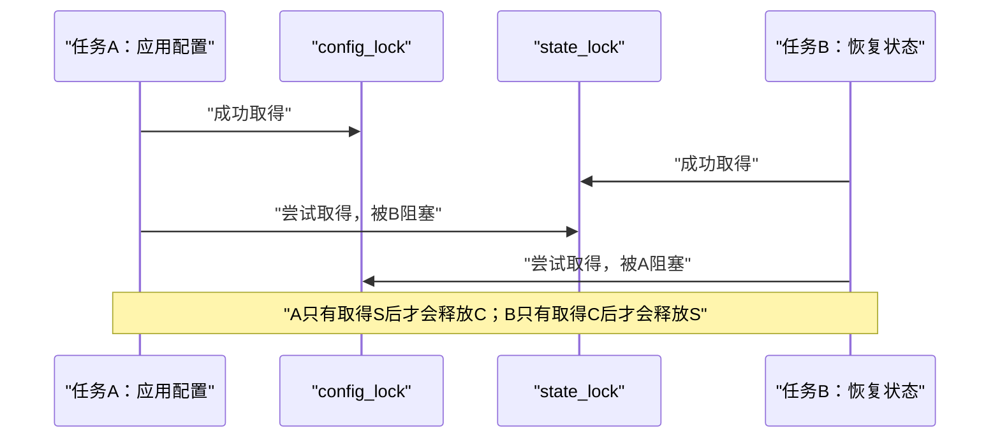
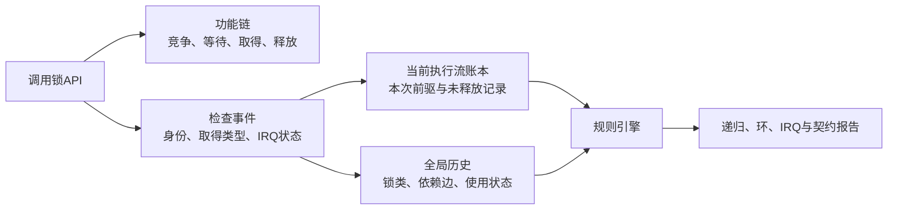

# 第1章\_为什么需要\_Lockdep

## 1.1\_单把锁正确不等于锁协议正确

先只讨论进程上下文中的两个 mutex。设备有两类必须分别保护的状态：配置由 `config_lock` 保护，运行状态由 `state_lock` 保护。两条业务路径分别从自己的主状态出发，再读取另一类状态：

```c
struct demo_device {
	struct mutex config_lock;
	struct mutex state_lock;
	int requested_mode;
	int active_mode;
};

static void demo_apply_config(struct demo_device *dev)
{
	mutex_lock(&dev->config_lock);
	/* 根据新配置更新运行状态。 */
	mutex_lock(&dev->state_lock);
	dev->active_mode = dev->requested_mode;
	mutex_unlock(&dev->state_lock);
	mutex_unlock(&dev->config_lock);
}

static void demo_restore_state(struct demo_device *dev)
{
	mutex_lock(&dev->state_lock);
	/* 根据硬件当前状态回填配置。 */
	mutex_lock(&dev->config_lock);
	dev->requested_mode = dev->active_mode;
	mutex_unlock(&dev->config_lock);
	mutex_unlock(&dev->state_lock);
}
```

这里没有“一个任务拿到单把锁以后又无缘无故申请同一把锁”。每条路径独立运行时都能完成；矛盾只在两个任务交错以后出现：



mutex 没有失效：它们正是因为忠实地阻止第二个持有者进入，才让两个任务都等下去。真正错误的是模块在两条路径中定义了互相矛盾的顺序：

```text
demo_apply_config()  建立 config_lock → state_lock
demo_restore_state() 建立 state_lock  → config_lock
两个局部顺序组合成全局等待环
```

### 1.1.1\_错误模型为何会推导出矛盾

常见错误模型是：“每个 `mutex_lock()` 都有对应 `mutex_unlock()`，所以没有锁问题。”它只检查了 **资源是否最终释放**，没有检查 **在等待下一把锁时仍占着什么资源**。

沿时间线推进一次就会得到矛盾：A 不能释放 `config_lock`，因为它还没取得 `state_lock`；B 不能释放 `state_lock`，因为它还没取得 `config_lock`。两边的 unlock 都写在源码里，却都没有机会执行。由此得到第一个可迁移结论：

> 锁正确性不仅是单次取得/释放配对，还包括所有可并发路径共同遵守的等待顺序协议。

## 1.2\_为什么等待真实死锁再抓现场不够

真实 ABBA 需要很窄的时序窗口。若 A 在 B 取得 `state_lock` 前已经完成，或者 B 在 A 取得 `config_lock` 前已经完成，两条错误路径都会在测试中“正常通过”。增加 CPU 和循环次数只能提高撞上窗口的概率，不能把概率测试变成结构证明。

但这个死锁由两个简单组件链组成：

```text
组件链1：在持有 config_lock 时尝试 state_lock
组件链2：在持有 state_lock 时尝试 config_lock
```

测试不必让它们同时发生。即使同一个测试线程先完整执行组件链 1，释放所有锁，再完整执行组件链 2，只要有地方跨时间保存第一条顺序，第二条出现时就能推出：

```text
历史已经知道 config_lock → state_lock
本次准备加入 state_lock → config_lock
加入后会闭合成环
```

这正是 Lockdep 比“卡住以后看任务栈”更早的一步：它把 **已经执行过的简单锁链** 组合起来，搜索尚未真实发生但由这些组件链允许的复杂交错。

## 1.3\_为什么锁对象的owner字段不够

mutex 的功能状态关心当前 owner 和等待者，自旋锁的功能状态关心锁字是否可取得。这些状态足以执行单把锁，却不能回答全局协议问题：

| 要回答的问题 | 只看当前锁对象为何不够 |
| --- | --- |
| current 在尝试 B 时还持有哪些锁 | 信息散落在其他锁对象中，锁对象本身没有 current 的完整等待前缀 |
| 几分钟前另一条路径建立过什么顺序 | owner 和等待者会随 unlock 消失，历史顺序不会保留 |
| 两个不同地址是否遵循同一协议 | 地址只能区分实例，不能说明它们是否属于同一类对象 |
| 同一锁类是否跨进程与 IRQ 使用 | 需要同时记录取得上下文与当时的 IRQ 开关状态 |
| 这次共享取得能否递归 | 需要知道独占、非递归读、递归读等阻塞类型 |

若反过来扫描全内核所有锁对象来寻找 current，也没有一个可安全枚举且覆盖所有原语的锁对象集合。更自然的方向是：每次锁事件都向 current 的检查账本写记录，同时把能够跨执行流复用的顺序写入全局历史。

## 1.4\_中断里的锁究竟是什么意思

“中断里不能等待”是对的，但这里的 **等待** 必须拆成两种：

- mutex、semaphore 的取得或 `wait_for_completion()` 可能让任务睡眠，hardirq 没有可调度的任务上下文，不能调用这些等待接口；
- 自旋锁竞争时不会睡眠，而是在 CPU 上忙等。在普通非 PREEMPT_RT 内核中，硬中断顶半部常用自旋锁保护极短的共享状态；要求在真正 hardirq 或特殊 RT 路径保持原始自旋语义时，还要按目标配置选择 `raw_spinlock_t`。

因此“IRQ 中取得锁”通常指 **取得适合该上下文的自旋锁**，绝不是说 IRQ 可以睡眠等 mutex。completion 也只解决事件通知：中断侧可以在适用场景调用 `complete()` 发出完成事件，但等待它的 `wait_for_completion()` 必须发生在可睡眠上下文；它不能替代对共享队列的一次原子更新。

考虑 `queue_lock` 同时保护进程提交路径和硬中断完成路径。下面的进程侧写法有问题：

```c
static void demo_submit(struct demo_device *dev)
{
	spin_lock(&dev->queue_lock); /* 本地硬中断仍可能进入。 */
	/* 更新与中断共享的短队列。 */
	spin_unlock(&dev->queue_lock);
}

static irqreturn_t demo_irq_handler(int irq, void *data)
{
	struct demo_device *dev = data;

	spin_lock(&dev->queue_lock);
	/* 取出硬件完成项并更新同一队列。 */
	spin_unlock(&dev->queue_lock);
	return IRQ_HANDLED;
}
```

若本 CPU 在 `demo_submit()` 持锁期间进入该硬中断，中断处理程序会忙等 `queue_lock`；被中断的进程只有恢复执行以后才能解锁，而 CPU 此刻又困在中断处理程序里。这里没有 IRQ 睡眠，也不需要第二个 CPU：**同一 CPU 的不可恢复抢占关系已经形成递归死锁。**

进程侧通常应屏蔽本地硬中断并恢复原状态：

```c
static void demo_submit(struct demo_device *dev)
{
	unsigned long flags;

	spin_lock_irqsave(&dev->queue_lock, flags);
	/* 更新与中断共享的短队列。 */
	spin_unlock_irqrestore(&dev->queue_lock, flags);
}
```

Lockdep 后续使用 hardirq-safe/unsafe 这组术语记录的正是这种 **实际使用历史**：曾在 hardirq 上下文取得，还是曾在 hardirq 开启时取得。它不是给锁贴一张“中断里可以随便用”的许可证。

## 1.5\_Lockdep增加了哪条检查链

Lockdep 让标准锁原语在功能动作旁边上报事件：



两条链的职责必须保持分离：

| 链 | 负责什么 | 检查关闭后怎样 |
| --- | --- | --- |
| 功能锁链 | 真正建立互斥、等待和相应内存顺序 | 继续运行 |
| Lockdep 检查链 | 记录影子事件并验证锁协议 | 诊断消失，业务义务仍存在 |

Lockdep 不会替任务打破已经发生的等待环，也不会自动选择正确锁序。它做的是在组件链进入历史时尽早给出反例。

## 1.6\_它首先要证明什么

由前面的两个场景可以自然推出四项基础义务：

1. **取得和释放要配对：** 当前执行流不能释放没有上报取得的实例，也不能遗留错误影子记录；
2. **同类递归必须有合法语义：** 普通 mutex 或独占锁不能被 current 再次取得，自然层级和递归读需要显式且真实的模型；
3. **新增等待顺序不能闭环：** 准备加入 `A → B` 时，历史中不能已经存在能够阻塞的 `B → ... → A`；
4. **执行上下文必须相容：** IRQ 中使用的自旋锁，不能与 IRQ 开启路径中的同类或依赖链形成不可恢复的中断反转。

后续的 key、subclass、读写类型、trylock、wait type 和虚拟锁域，都不是凭空罗列的特性；它们分别用于修正这四项朴素规则在真实内核条件下暴露出的缺口。

## 1.7\_本章结论

本章从两个完整场景得到三条结论：mutex ABBA 是跨路径锁序错误，不是“单锁自己锁自己”；中断不能睡眠等待，但可以在适用内核配置下用自旋锁保护短共享状态；只看功能锁当前状态既看不到 current 的完整等待前缀，也保留不了跨时间历史。

现在真正的问题变成：若从零设计一个验证器，哪些状态必须属于当前执行流，哪些状态必须全局保存，一次取得失败又该回滚哪一层？下一章从这些问题推导 Lockdep 的抽象模型。

下一篇：[Lockdep 抽象模型与证明边界](P02_Lockdep_抽象模型与证明边界.md)。
