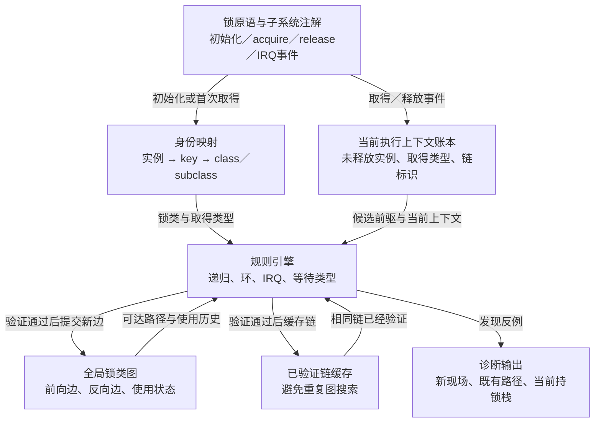
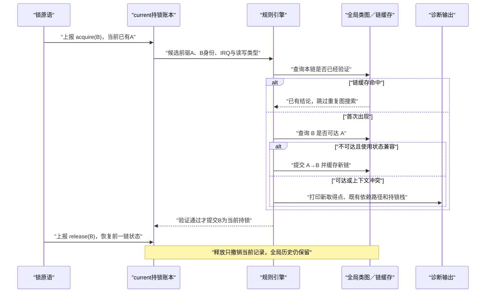

# 第2章\_Lockdep抽象模型与证明边界

## 2.1\_从事件流而不是字段名开始

上一章已经证明，检查器必须同时知道当前任务的持锁集合和跨时间累积的锁顺序。但此时还不能直接把 Lockdep 简化成“持锁数组加一张图”：锁实例需要先归类，IRQ 与读写方式会改变阻塞关系，重复链还需要避免反复做昂贵搜索。

先忽略 Linux 字段名，只保留四类角色：

| 角色 | 输入或状态 | 责任 |
| --- | --- | --- |
| 事件生产者 | 初始化、取得尝试、失败回滚、释放、IRQ 开关与上下文变化 | 在与功能路径约定的时点上报检查事件，不暗示功能动作已经成功 |
| 当前上下文账本 | 当前执行流尚未释放的锁记录 | 回答“现在持有什么”、为新取得生成候选前驱 |
| 全局知识库 | 锁类、使用状态、依赖边和已验证链 | 跨任务、跨时间保存能够复用的历史结论 |
| 规则与诊断者 | 新事件、局部账本和全局知识库 | 拒绝递归、环、IRQ 反转或非法等待上下文，并打印证据链 |

## 2.2\_三组正交状态轴

Lockdep 不是一个单一状态机，而是三组正交状态共同推进。

### 2.2.1\_轴A\_当前执行上下文状态

```text
未持锁
  → 取得A
  → 持有[A]
  → 取得B
  → 持有[A,B]
  → 释放B
  → 持有[A]
  → 释放A
  → 未持锁
```

这组状态是 **当前事实**。它必须随 acquire/release 及时变化，不能把已经释放的锁继续当作候选前驱。

### 2.2.2\_轴B\_锁类历史状态

锁类一旦被观察，就可能累积：

- 曾在进程、softirq、hardirq 或其他受支持上下文中取得；
- 取得时本地 IRQ 是否开启；
- 曾作为哪些锁的前驱或后继；
- 这些使用事实第一次出现在哪里。

这组状态是 **跨时间历史**。当前任务释放锁以后，依赖边不能随之删除，否则下一条独立路径无法与旧路径闭合成环。

### 2.2.3\_轴C\_验证器生命状态

检查器还具有自己的运行状态：

```text
可用
  → 正常记录与验证
  → 某条严重错误路径或容量耗尽调用停检
  → 停止继续证明，避免污染状态产生连锁误报
```

所以“内核编译了 Lockdep”不等于“此刻 Lockdep 仍在提供有效检查”。诊断时还必须核对检查器是否已经关闭。

## 2.3\_一个完整的S0到S6周期

以当前任务已经持有 A、准备取得 B 为例：

| 阶段 | 触发 | 当前账本 | 全局知识 | 退出条件 |
| --- | --- | --- | --- | --- |
| S0 身份就绪 | 锁初始化或首次使用 | 无变化 | 实例能够映射到稳定锁类 | B 的检查身份可解析 |
| S1 事件进入 | 功能原语报告取得 B | 仍为 `[A]` | 读取 B 的类别和取得类型 | 检查器可用且未递归进入自身 |
| S2 建立候选记录 | 为 B 组织当前取得信息 | 在尾部预留 B，但尚未提交深度 | 计算本链标识 | 上下文、深度和等待类型初检通过 |
| S3 规则验证 | 比较 B 与当前前驱 A | `[A] + 候选B` | 检查递归、`A → B` 是否闭环、IRQ 使用是否冲突 | 没有发现违规 |
| S4 历史提交 | 新链首次出现且验证通过 | 候选仍未成为正式栈顶 | 写入必要的依赖边与链缓存 | 全局结构更新完成 |
| S5 当前提交 | 取得检查事件被接受 | 影子账本正式变为 `[A,B]` | 保存新的链标识 | 功能原语随后或立即成功，或阻塞等待，或失败并进入回滚 |
| S6 释放或回滚 | 功能 unlock，或取得失败后报告 release | 从账本移除 B，恢复前一链状态 | 历史边保留 | 当前影子状态回到 `[A]` |

S4 与 S5 的次序很关键：必须先证明候选取得不会污染全局结论，再把它提交为检查器的当前影子状态。对阻塞锁而言，S5 可能早于功能锁真正成功；如果取得失败，必须用 S6 撤销影子记录。释放或回滚只撤销当前记录，不撤销已经观察到的历史依赖。

## 2.4\_角色与状态关系图



箭头表示真实状态流：锁原语不会直接“发现环”，它只产生事件；规则引擎同时读取局部账本和全局图才形成结论。

## 2.5\_端到端时序



## 2.6\_它能证明到哪里

对 **已经至少执行一次的简单锁链组件**，Lockdep 可以把它们组合起来搜索潜在等待环；复杂的多 CPU 交错不必原样发生。这是它比“只抓卡死现场”更强的地方。

但结论有明确前提：

1. 所有相关同步原语都正确上报事件；
2. 关键调用路径在检查启用且仍有效时实际执行过；
3. 实例到锁类的分类与真实协议一致；
4. 取得类型正确描述独占、非递归读或递归读；
5. 检查器自身状态、容量和链哈希假设没有失效。

Lockdep 不直接证明共享数据无竞争、不证明对象未 UAF、不证明内存屏障选择正确，也不证明一个从未执行到的错误分支安全。它验证的是 **已上报锁协议的动态组件闭包**。

## 2.7\_本章结论

Lockdep 由当前账本、全局类图、类使用状态和验证器生命状态共同构成。一次取得必须经历身份解析、候选建立、规则验证、历史提交和当前提交；一次释放只回退当前账本。下一章将解决 S0：不同锁地址怎样映射成能够长期用于全局推理的锁类。

上一篇：[为什么需要 Lockdep](P01_为什么需要_Lockdep.md)。

下一篇：[锁实例、锁类、key 与 subclass](P03_锁实例_锁类_key与subclass.md)。
