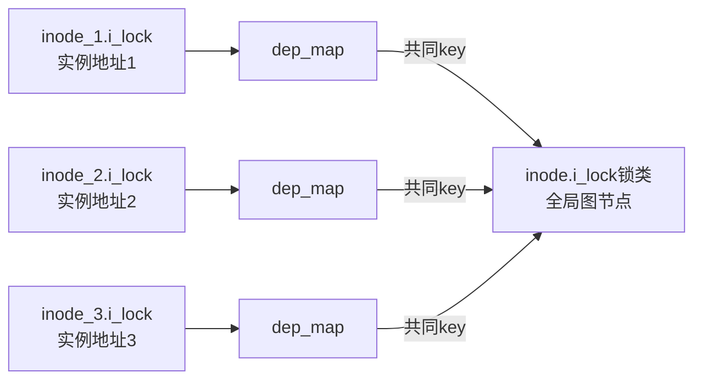

# 第3章\_锁实例\_锁类\_key与subclass

## 3.1\_为什么不能给每个地址建一个永久图节点

上一章的全局依赖图需要稳定节点，但一个内核结构可能有成千上万个实例：每个 inode、request、设备队列或哈希桶都可以包含自己的锁。若把每个锁地址都永久当作独立节点，图会迅速膨胀，而且测试只执行一个对象实例时，无法把结论推广到同类型对象。

Lockdep 因此区分四个概念：

| 概念 | 回答的问题 | 生命周期 |
| --- | --- | --- |
| 锁实例 | 当前代码操作的是哪一个具体锁对象 | 跟随具体对象 |
| `lockdep_map` | 该实例怎样向检查器暴露身份、名称和等待类型 | 通常嵌入锁实例 |
| 锁类 key | 哪些实例应共享同一套锁序规则 | 必须比动态实例更持久 |
| 锁类 / subclass | 全局图实际使用的节点及其层级变体 | 跨任务、跨时间保留历史 |

同一结构字段的许多动态实例通常属于同一锁类；同一实例在自然层级的不同位置取得时，则可能需要不同 subclass。

## 3.2\_实例和锁类不是一一对应



若任意 inode 路径曾出现 `i_lock → cache_lock`，这个顺序属于该锁类协议，而不是只属于当时那个 inode 地址。后续另一个 inode 实例以相反顺序参与时，仍应与旧边组合。

## 3.3\_key为什么必须持久

全局图保存的是历史关系。若动态对象释放以后，key 所在内存立即被复用为另一个无关对象，旧图节点就可能被错误解释成新锁类。正确原则是：

- 静态锁可以使用稳定的静态对象地址作为身份来源；
- 动态锁通常由初始化调用点中的静态 `lock_class_key` 归类；
- 真正动态分配的 key 必须先登记，释放 key 内存以前必须注销；
- 不能把生命周期短于全局依赖历史的临时地址随意当成 key。

进入版本化源码前，先按 [Lockdep 身份与事件接入模块导读](../../../../research/source_reading/lockdep/navigation/P02_Linux_6.12_Lockdep身份与事件接入模块导读.md#2.1_模块问题) 建立文件地图。Linux 6.12.20 的具体字段、静态/动态 key 分支和注册过程见 [`lock_class_key` 与 `lockdep_map` 身份结构](../../../../research/source_reading/lockdep/source_explanations/P05_Linux_6.12_Lockdep身份与锁类源码实现.md#5.2_lock_class_key与lockdep_map身份结构)及 [`register_lock_class()` 锁类注册](../../../../research/source_reading/lockdep/source_explanations/P05_Linux_6.12_Lockdep身份与锁类源码实现.md#5.4_register_lock_class锁类注册)。

## 3.4\_初始化调用点怎样形成锁类

常见运行时初始化宏在调用点声明一个静态 key，再把它交给底层初始化：

```c
static void init_channel(struct channel *ch)
{
	mutex_init(&ch->lock);
}
```

所有经过这个调用点初始化的 `ch->lock` 共享逻辑规则，因而通常共享锁类。这里必须区分两层结果：

```text
mutex初始化功能
    → owner／等待队列等功能状态复位

Lockdep身份初始化
    → dep_map关联名称、key和等待类型
    → 首次取得时查找或注册锁类
```

检查关闭不会取消 mutex 初始化，但会使 `dep_map` 为空结构或相关上报退化为空操作。具体配置分支见 [`lockdep_init_map_type()` 与关闭配置分支](../../../../research/source_reading/lockdep/source_explanations/P05_Linux_6.12_Lockdep身份与锁类源码实现.md#5.3_lockdep_init_map_type与关闭配置分支)。

## 3.5\_错误分类的两种后果

### 3.5.1\_错误合并\_把不同协议当成同一类

假设两个用途不同的锁恰好经同一错误 key 初始化：

```text
控制锁A：允许 A → B
数据锁A'：允许 B → A'
错误地把 A 与 A' 合并成同一锁类
```

全局图看到的是 `A类 → B → A类`，可能报告并不存在的循环。这是 **分类过宽** 导致的误报。

### 3.5.2\_错误拆分\_把同一协议分成多个类

反过来，若同一结构字段的每个实例被错误分成独立类，测试在实例 1 上观察到 `A1 → B`，又在实例 2 上观察到 `B → A2`，图中可能没有 `A1 == A2` 的关系，从而错过真实的同类协议环。这是 **分类过窄** 导致的漏报。

所以 `lockdep_set_class*()` 不是“消除告警”的工具。只有业务协议确实不同，才应该改变分类。

## 3.6\_subclass怎样表达自然层级

有些数据结构必须同时持有同一锁类的多个实例，例如父节点锁后再取子节点锁。朴素分类会把它看成同类递归：

```text
node.lock类 → node.lock类
```

若数据结构存在稳定的自然层级，可以用 `_nested()` 接口或显式 subclass 告诉 Lockdep：

```c
enum node_lock_level {
	NODE_LOCK_PARENT,
	NODE_LOCK_CHILD,
};

mutex_lock_nested(&child->lock, NODE_LOCK_CHILD);
```

此时检查器把同一基础类的不同层级作为子类参与验证。它表达的是“协议保证父先于子”，不是让两个锁真正获得额外互斥能力。

使用 subclass 前必须回答：

1. 层级是否由对象拓扑稳定决定，而不是运行时偶然顺序；
2. 所有调用路径是否使用一致层级；
3. 最大层级是否落在实现支持范围内；
4. 改成 `_nested()` 后是否可能把真实递归伪装成合法层级。

错误层级既可能制造误报，也可能压掉真告警。

## 3.7\_实例查询与类图推理的分工

`lockdep_is_held(&lock)` 查询的是 **当前任务是否持有指定实例对应的 `dep_map`**，不是“当前任务是否持有这个类中的任意实例”。而死锁闭包主要在锁类图上推理。二者需要同时存在：

- 实例身份避免把“持有 inode_1 的锁”误报为“持有 inode_2 的锁”；
- 类身份让不同 inode 实例共享锁序规则；
- subclass 只在真实层级需要时细分图节点；
- 当前账本同时保存实例和类索引，才能在查询与图验证之间转换。

## 3.8\_本章结论

Lockdep 的图节点是锁类，不是简单的锁地址；当前持锁查询仍需精确实例。key 决定实例怎样归类，subclass 只表达真实的自然嵌套层级。错误合并会误报，错误拆分会漏报，因此“修 Lockdep 告警”首先要核对分类是否符合业务协议，而不是直接更换 key 或添加 `_nested()`。

下一章将追踪一个已经完成身份映射的锁，观察 acquire 事件怎样同时改变当前账本、链缓存和全局依赖图。

上一篇：[Lockdep 抽象模型与证明边界](P02_Lockdep_抽象模型与证明边界.md)。

下一篇：[持锁账本、依赖图与状态闭环](P04_持锁账本_依赖图与状态闭环.md)。
