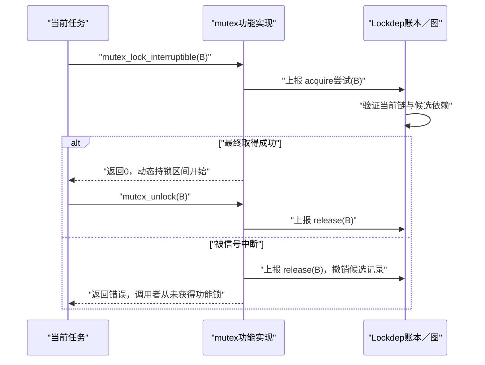

# 第4章\_持锁账本\_依赖图与状态闭环

## 4.1\_一次取得事件为什么要写两处状态

上一章已经给锁实例建立了检查身份。现在 current 持有 A 并尝试取得 B，Lockdep 必须完成两个不同时间尺度的动作：

1. 在当前执行上下文账本中记录 B，使后续查询和下一次取得知道“current 仍在 B 的动态持锁区间”；
2. 在全局锁类图中保留 `A → B`，使 A、B 都释放以后，另一条路径仍可与它组合。

把两处状态混成一张表会产生矛盾：若 release 删除所有记录，历史闭包无法成立；若历史图又被当作当前状态，`lockdep_is_held(B)` 会把过去持有误判为现在持有。

## 4.2\_当前账本保存的不是调用栈

当前账本按未释放的 acquire 事件组织，但它不是 C 调用栈，也不是 CPU 的栈回溯。它至少要携带：

- 具体 `lockdep_map` 实例；
- 对应锁类索引；
- 取得位置；
- 独占、非递归读或递归读类型；
- trylock、检查等级、IRQ 上下文和 IRQ 开关状态；
- 前一条链的标识，以便释放时回退；
- nested、pin 或引用式注解需要的附加状态。

同一个函数可以在调用栈中存在，却尚未取得锁；另一个被调函数虽然没有在源码词法范围内写出 `mutex_lock()`，执行时仍可能继承调用者的持锁区间：

```c
static void update_payload(struct device_state *state)
{
	lockdep_assert_held(&state->lock);
	/* 这里由上层调用者持锁。 */
}

static void update_device(struct device_state *state)
{
	mutex_lock(&state->lock);
	update_payload(state);
	mutex_unlock(&state->lock);
}
```

因此“在锁范围内”表示从功能取得成功以后到匹配释放以前的 **动态执行区间**，不是某个 C 代码块的词法作用域。

## 4.3\_取得尝试与功能取得成功的边界

Lockdep 关心等待关系，所以某些阻塞锁会在真正等待或取得以前上报 acquire 尝试。若可中断取得最终失败，失败路径再用 release 注解撤销候选持锁记录。对普通调用者而言，锁函数成功返回以后，账本才稳定表示“当前持有”；对源码阅读者而言，不能把 `lock_acquire()` 的调用点简单等同于底层原子操作已经成功。



这个边界解释了为什么 Lockdep 能验证潜在等待环，也解释了失败路径为什么不能遗漏注解回退。

## 4.4\_从账本产生候选依赖

current 已持有 `[A, B]`，现在取得 C。朴素做法可以添加：

```text
A → C
B → C
```

实现会结合 trylock、上下文边界和已有直接/间接关系筛选相关前驱，但核心不变量不变：**新锁是后继，当前尚未释放的相关锁是前驱**。

候选边不是“谁先执行过”的一般时间关系。只有在持有 A 的动态区间内尝试取得 B，才产生锁依赖 `A → B`；先释放 A、过一会再取得 B 不产生这条边。

## 4.5\_链键与缓存为什么存在

若每次取得 B 都从全局图重新搜索，调试内核会把高频锁路径变成昂贵的图算法。Lockdep 为当前锁链逐步计算链标识：

```text
初始链键
  → 混入A的类与取得类型
  → 混入B的类与取得类型
  → 混入C的类与取得类型
```

首次出现的链执行完整验证并进入缓存；以后相同链命中缓存，可以跳过重复依赖更新和图搜索。缓存消除的是 **已经验证过的重复工作**，不是取消当前账本更新。否则后续 `lockdep_is_held()` 和 release 都会失去依据。

这一版本的事件路径和账本协作先见 [Lockdep 身份与事件接入模块导读](../../../../research/source_reading/lockdep/navigation/P02_Linux_6.12_Lockdep身份与事件接入模块导读.md#2.5_阅读时必须区分的边界)。Linux 6.12.20 中 `held_lock`、任务字段、链键计算与 `validate_chain()` 的对应实现见 [`task_struct` 持锁账本与 `held_lock`](../../../../research/source_reading/lockdep/source_explanations/P06_Linux_6.12_Lockdep取得释放与持锁账本源码实现.md#6.2_task_struct持锁账本与held_lock) 和 [`__lock_acquire()` 取得状态提交](../../../../research/source_reading/lockdep/source_explanations/P06_Linux_6.12_Lockdep取得释放与持锁账本源码实现.md#6.4___lock_acquire取得状态提交)。

## 4.6\_释放为什么可能需要重建后半段

最常见的是后进先出：持有 `[A,B]` 时释放 B，只需恢复 B 保存的前一链键并缩短账本。但内核也存在合法的非栈顶释放模型。若从 `[A,B,C]` 中移除 B，剩余当前状态应是 `[A,C]`，链标识也必须重新计算。

```text
释放前：[A, B, C]
定位B并把深度退回B以前：[A]
按原取得属性重新加入C：[A, C]
释放后：B不再属于当前状态；历史依赖仍保留
```

这也是为什么 held record 要保存实例、类、取得类型、前一链键等信息，而不能只存一个“锁地址集合”。具体回退与重建见 [`__lock_release()` 释放与链回退](../../../../research/source_reading/lockdep/source_explanations/P06_Linux_6.12_Lockdep取得释放与持锁账本源码实现.md#6.5___lock_release释放与链回退)。

## 4.7\_trylock为什么不能像阻塞取得一样加边

失败的 trylock 不等待持有者；成功的 trylock 已经取得锁，但“可以按任意顺序尝试，失败就退回”的协议不一定形成阻塞等待边。Lockdep 仍需把成功取得放进当前账本，以便释放、断言和后续锁序检查，却不会把所有 trylock 顺序都当作普通阻塞依赖。

这并不意味着 trylock 自动安全：

- 成功以后再阻塞取得其他锁，仍可能形成依赖；
- 忽略失败返回或在重试循环中持有其他资源，仍可能造成活性问题；
- 用 trylock 标志伪装一个实际会等待的自定义原语，会破坏 Lockdep 的证明输入。

## 4.8\_一个状态周期的所有权表

| 状态 | 存储位置 | 写入者 | 读取者 | 何时失效 |
| --- | --- | --- | --- | --- |
| 当前持锁实例 | 当前执行上下文账本 | acquire/release 注解 | 新 acquire、查询、断言、诊断 | 匹配 release 或失败回退 |
| 当前链键 | 当前执行上下文 | acquire 提交、release 回退 | 链缓存查询、内部一致性检查 | 随当前持锁链变化 |
| 锁类使用状态 | 全局锁类对象 | 首次出现新上下文使用时 | IRQ/等待规则检查 | 通常保留至对应图数据被安全清理 |
| 依赖边 | 全局类图 | 新链首次验证通过后 | 环搜索、IRQ 传播、报告 | 不随一次 release 删除 |
| 已验证链 | 全局链缓存 | 新链验证完成时 | 后续相同链取得 | 容量/重置或安全回收边界 |

## 4.9\_本章结论

acquire/release 事件维护的是当前事实；锁类图与链缓存保存的是历史知识。阻塞取得可能在真正获得功能锁以前上报尝试，失败路径必须撤销；链缓存只跳过重复图验证，不能省略当前账本。下一章将给图边加入阻塞类型和 IRQ 使用状态，解释为什么“图中有环”仍需要精确的规则语义。

上一篇：[锁实例、锁类、key 与 subclass](P03_锁实例_锁类_key与subclass.md)。

下一篇：[递归、依赖环、IRQ 与读写规则](P05_递归_依赖环_IRQ与读写规则.md)。
