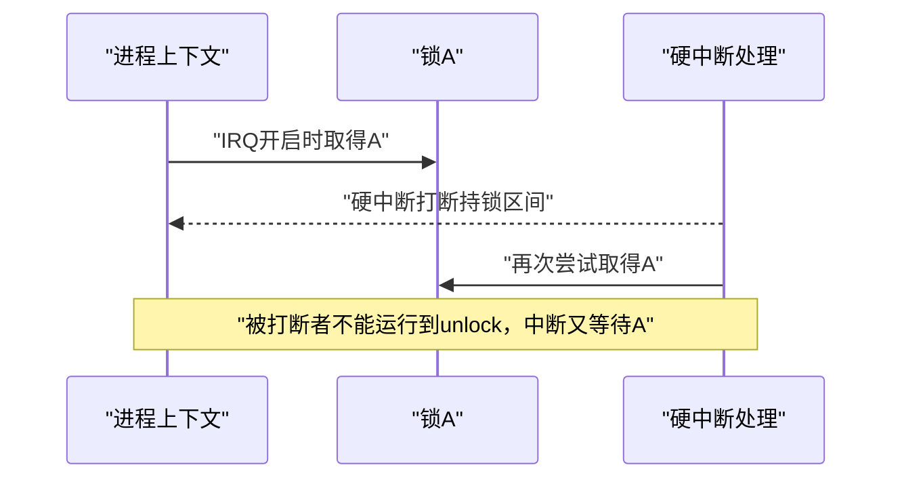

# 第5章\_递归\_依赖环\_IRQ与读写规则

## 5.1\_先检查同类递归

图搜索擅长发现 `A → B → ... → A`，但 current 再次取得已经持有的同一锁类可能不需要先新增图边。因此规则引擎先检查当前账本：

```text
current已持有A类
    +
准备再次取得A类
    → 普通独占或非递归读：可能自死锁
    → 递归读且阻塞语义允许：可以继续
    → 显式nest_lock／subclass：按已声明层级继续验证
```

不能看到“同一类”就一律判错，也不能看到 `_nested()` 就一律放行。取得类型和层级声明必须与真实阻塞协议一致。

## 5.2\_新增边以前为什么从后继搜索前驱

准备提交 `A → B` 时，若全局图已经存在 `B → ... → A`，新增边将闭合成环：


因此检查器以 B 为起点搜索能否到达 A。可以用广度优先搜索同时找到一条较短的解释路径，用于在告警中展示“新取得点”和“过去怎样建立反向链”。任意长度的环都服从同一不变量，不限于两把锁。

详细函数前，先用 [Lockdep 依赖图与规则引擎模块导读](../../../../research/source_reading/lockdep/navigation/P03_Linux_6.12_Lockdep依赖图与规则引擎模块导读.md#3.1_模块问题) 建立规则层次。Linux 6.12.20 的 `check_deadlock()`、`check_prev_add()` 和搜索入口见 [`check_deadlock()` 同类递归检查](../../../../research/source_reading/lockdep/source_explanations/P07_Linux_6.12_Lockdep依赖图与规则引擎源码实现.md#7.2_check_deadlock同类递归检查) 与 [`check_prev_add()` 新依赖验证](../../../../research/source_reading/lockdep/source_explanations/P07_Linux_6.12_Lockdep依赖图与规则引擎源码实现.md#7.4_check_prev_add新依赖验证)。

## 5.3\_IRQ为什么引入另一类隐含边

假设进程上下文在本地硬中断开启时取得锁 A。持锁期间，硬中断可以打断当前任务；若中断处理程序也取得 A，就会在同一 CPU 上递归等待：



因此同一锁类不能既被观察为：

- **hardirq-safe：** 曾在硬中断上下文中取得；
- **hardirq-unsafe：** 曾在本地硬中断开启时取得。

softirq 也有对应规则。这里的 safe/unsafe 不是锁对象的固有类型，而是 Lockdep 从实际使用事件累积出的 **锁类使用状态**。

## 5.4\_IRQ使用状态怎样沿依赖图传播

危险不限于同一把锁。假设硬中断能够取得 H，进程路径在 IRQ 开启时持有 U，并且全局图存在 `H → ... → U`。中断打断持有 U 的进程后，沿链等待 U，也会形成反转。

所以新增 `A → B` 时，规则引擎不仅检查直接两端，还检查：

1. A 的反向子图中是否存在 IRQ-safe 锁；
2. B 的正向子图中是否存在相应 IRQ-unsafe 锁；
3. 新边是否把这两类历史连接起来。

这条通信链不是“IRQ 主动通知图算法将来会死锁”。IRQ 开关跟踪和锁取得事件先写入使用状态；以后新增依赖或使用状态变化时，规则引擎再读取全局历史形成间接证明。

具体使用位写入与双向图搜索见 [`mark_usage()` 锁类上下文状态](../../../../research/source_reading/lockdep/source_explanations/P07_Linux_6.12_Lockdep依赖图与规则引擎源码实现.md#7.3_mark_usage锁类上下文状态)和 [`check_irq_usage()` IRQ依赖传播检查](../../../../research/source_reading/lockdep/source_explanations/P07_Linux_6.12_Lockdep依赖图与规则引擎源码实现.md#7.5_check_irq_usageIRQ依赖传播检查)。

## 5.5\_三类取得为何不能压成读和写两个布尔值

Lockdep 区分：

| 取得类型 | 典型含义 | 同类嵌套边界 |
| --- | --- | --- |
| 独占写 `W` | mutex、spinlock 或写锁 | 会阻塞其他写者和读者，普通递归危险 |
| 非递归读 `r` | 可能受等待写者阻塞的共享读 | 第二次读可能因写等待者而自死锁 |
| 递归读 `R` | 同实例读侧允许递归进入 | 读者之间不互相阻塞，但与写者仍可形成环 |

反例：任务 A 已持有读锁 X，任务 B 成为 X 的写等待者。若新的读取得会被写等待者阻塞，则 A 再次读 X 不能前进；若读原语允许递归读绕过等待写者，则这次嵌套可以继续。仅记录“read=true”不足以区分两者。

因此依赖边还要携带取得端的阻塞类型。并非图中任何形式环都必然死锁；只有环上的依赖类型能够形成阻塞闭包时才是强依赖环。

## 5.6\_wait type与可睡眠上下文

一把锁除了读写类型，还可能表达它等待时能否睡眠，以及持有后向内层施加什么等待限制。最直观的规则是：不可睡眠上下文不能向内取得会睡眠的锁；PREEMPT_RT 又会改变部分传统 spinlock 的等待实现和嵌套约束。

这类检查必须与“环检测”分开理解：

- 环检测证明多个锁等待关系可能闭合；
- wait-context 检查证明某个外层上下文不允许内层等待类型；
- `might_sleep()` 等上下文检查可能协同报告，但不是锁类图本身。

配置和实现变体会改变可执行检查分支，不能把某个版本的 wait type 字段直接写成所有内核的永恒 API 契约。

## 5.7\_常见误修

| 处理方式 | 为什么危险 | 正确核对 |
| --- | --- | --- |
| 看到环就给第二次取得加 `_nested()` | 可能把真实反向锁序伪装成层级 | 对象是否存在稳定且全路径一致的自然层级 |
| 给其中一把锁换独立 key | 可能把同一协议错误拆类，造成漏报 | 两组实例是否真的遵循不同锁序规则 |
| 把阻塞取得标成 trylock | 图不再记录真实等待依赖 | 失败是否立即返回且调用者正确退回 |
| 在告警处 `lockdep_off()` | 只遮蔽检查，不修复功能死锁 | 修正锁序、拆分临界区或重构所有权 |
| 认为 hardirq-safe 表示“可以随便在IRQ用” | safe 是已观察使用状态，仍需正确 irqsave 协议 | 同锁和依赖链是否从 IRQ-unsafe 路径隔离 |

## 5.8\_本章结论

Lockdep 的规则不是“发现任意有向环就报警”。它先处理同类递归，再按取得类型检查新边是否闭合强依赖路径，同时把 hardirq/softirq 使用状态沿图传播，并按等待上下文补充约束。下一章将使用这些已经可信的状态，把业务函数的隐含持锁前置条件变成可执行注解。

上一篇：[持锁账本、依赖图与状态闭环](P04_持锁账本_依赖图与状态闭环.md)。

下一篇：[查询、断言、pin 与自定义原语接入](P06_查询_断言_pin与自定义原语接入.md)。
