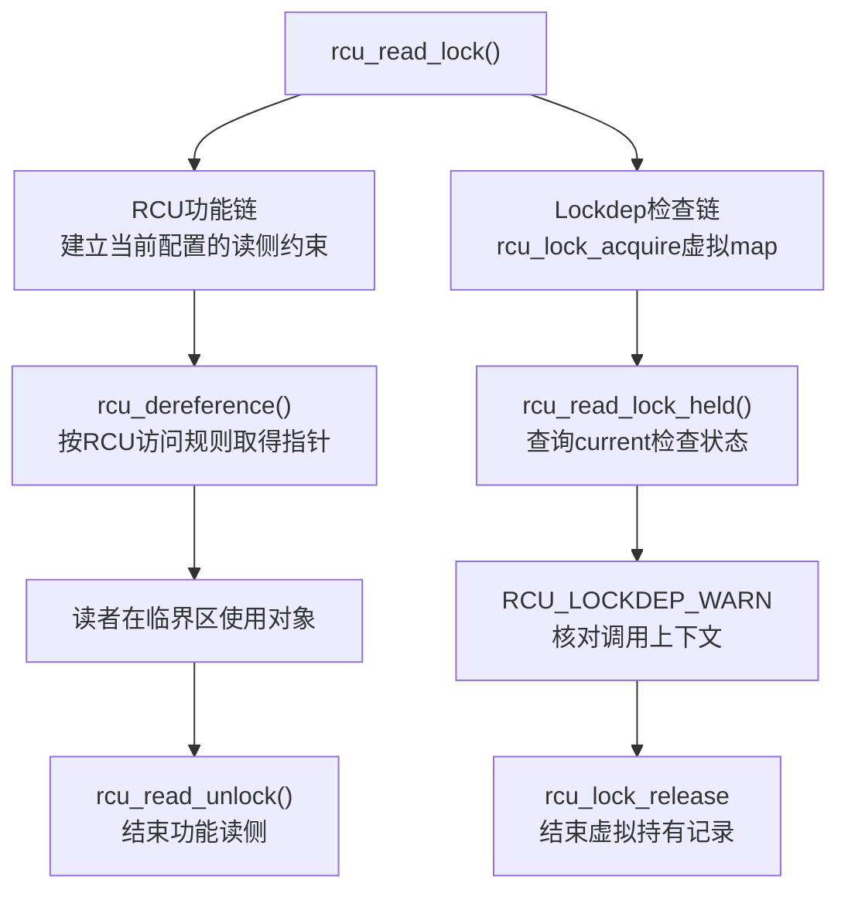

# 第7章\_RCU与子系统检查适配

## 7.1\_为什么无互斥读锁也需要检查身份

上一章说明，自定义同步域可以通过 `lockdep_map` 和 acquire/release 注解进入通用检查器。RCU 正是一个典型案例：`rcu_read_lock()` 不表示“独占拥有一把物理锁”，但很多 RCU 接口仍有动态上下文契约，例如 `rcu_dereference()` 应在认可的读侧范围或调用者声明的其他保护条件下使用。

RCU 因此建立虚拟 lockdep maps，把“current 进入/退出某种 RCU 读侧范围”上报成检查状态。这个映射只服务诊断，不把 RCU 读侧变成 mutex，也不改变宽限期如何等待旧读者。

## 7.2\_两条并行因果链

以普通读侧为例：



功能链承担读者定义、内存顺序和 GP 证明；检查链维护动态影子状态。关闭 `CONFIG_PROVE_RCU` 或 Lockdep 只移除相应诊断，不能让读者省略 `rcu_read_lock()`，也不能让更新者提前释放旧对象。

## 7.3\_保护条件c怎样连接业务锁

更新侧常见写法：

```c
mutex_lock(&state_lock);
old = rcu_replace_pointer(global_state, new,
			  lockdep_is_held(&state_lock));
mutex_unlock(&state_lock);
```

数据流是：

```text
mutex_lock(state_lock)
  → mutex功能路径真正建立更新者互斥
  → Lockdep把state_lock实例记入current持锁账本

lockdep_is_held(state_lock)
  → 查询current账本
  → 形成保护条件c

rcu_dereference_protected(..., c)
  → RCU_LOCKDEP_WARN检查c
  → protected取得和后续发布仍由RCU功能宏执行
```

`c` 是布尔保护理由，不是同步原语。写成常量 `1` 等于调用者无条件声明前置条件成立，只是放弃动态核对；它不会生成 mutex、屏障、GP 或引用计数。

## 7.4\_接口与检查点清单

这里横跨两个版本化源码专题：先用 [Lockdep 查询适配与诊断模块导读](../../../../research/source_reading/lockdep/navigation/P04_Linux_6.12_Lockdep查询适配与诊断模块导读.md#4.4_RCU适配链) 定位通用查询，再用 [Linux 6.12 Tree RCU 与 SRCU 源码导读](../../../../research/source_reading/rcu/navigation/P01_Linux_6.12_Tree_RCU_与_SRCU_源码导读.md#1.2_源码文件地图) 定位 RCU 虚拟 map 和检查封装。

| 接口或检查点 | 本场景作用 | 调用上下文 | 省略或误用后果 | 权威源码讲解 |
| --- | --- | --- | --- | --- |
| `lockdep_is_held(&state_lock)` | 把 current 的指定实例持锁状态转成条件 | 已经由功能锁建立保护以后 | 传常量会失去动态核对；查询不能建立互斥 | [`lock_is_held_type()` 当前持锁查询](../../../../research/source_reading/lockdep/source_explanations/P08_Linux_6.12_Lockdep查询注解与配置源码实现.md#8.2_lock_is_held_type当前持锁查询) |
| `rcu_lock_acquire()` / `rcu_lock_release()` | 把 RCU 读侧范围映射到虚拟 map | RCU 公共读侧封装内部 | 自定义业务代码不应重复伪造 RCU 读侧 | [RCU Lockdep 状态来源](../../../../research/source_reading/rcu/source_explanations/P05_Linux_6.12_RCU_公共接口与检查机制源码详解.md#5.6_RCU_Lockdep状态来源) |
| `RCU_LOCKDEP_WARN()` | 在动态检查可用时报告条件违例 | RCU 访问器或等待接口内部 | 关闭告警不改变功能契约；告警也不提供功能保证 | [`RCU_LOCKDEP_WARN()` 检查适配层](../../../../research/source_reading/rcu/source_explanations/P05_Linux_6.12_RCU_公共接口与检查机制源码详解.md#5.7_RCU_LOCKDEP_WARN检查适配层) |

Lockdep 核心实现属于本专题；RCU 虚拟 map 与 `RCU_LOCKDEP_WARN()` 的具体宏体仍在 RCU 源码专题唯一展开，避免为同一版本源码建立两个权威副本。

## 7.5\_为什么检查通过仍不能证明RCU生命周期

下面的函数可能通过类型和动态读侧检查，却仍然错误：

```c
static struct dev_state *bad_escape(void)
{
	struct dev_state *state;

	rcu_read_lock();
	state = rcu_dereference(global_state);
	rcu_read_unlock();
	return state; /* 裸指针逃离保护区，Lockdep不提供长期所有权。 */
}
```

Lockdep 只知道 RCU 虚拟 map 在取得时是否处于 current 的影子账本；它不知道返回值随后保存到哪里，也不知道对象何时取消发布和释放。完整生命周期仍要由 RCU GP、kref/refcount 或其他所有权协议证明。

RCU 场景中的类型、运行时条件和生命周期分工见 [RCU 类型语义、Sparse 与 Lockdep](../rcu/P26_RCU_类型语义_Sparse与Lockdep.md#26.1.6_三类检查不能互相替代)。

## 7.6\_虚拟锁域接入的通用模式

其他子系统若也想检查“进入某种逻辑保护域”，可以借鉴相同结构，但必须满足：

1. 逻辑域具有清楚的进入、退出和嵌套语义；
2. map 的取得类型忠实反映实际阻塞关系，虚拟递归读不能随意标成独占锁；
3. 所有入口和异常退出都成对上报；
4. 查询只用于诊断或条件声明，不参与功能分支正确性；
5. 文档明确区分虚拟检查身份和真实功能状态地址。

否则伪造的 map 会把错误输入送入全局图，既可能误报，也可能掩盖真实依赖。

## 7.7\_本章结论

RCU 没有另造一套完全独立的持锁检查器，而是把读侧域和业务保护条件接入 Lockdep。`lockdep_is_held()` 把指定业务锁的 current 状态变成布尔条件，`RCU_LOCKDEP_WARN()` 消费该条件；真正互斥、发布、GP 和回收仍由功能机制完成。下一章将把这套模型落到 Kconfig、告警文本和可执行覆盖策略。

上一篇：[查询、断言、pin 与自定义原语接入](P06_查询_断言_pin与自定义原语接入.md)。

下一篇：[配置、报告解读与验证方法](P08_配置_报告解读与验证方法.md)。
