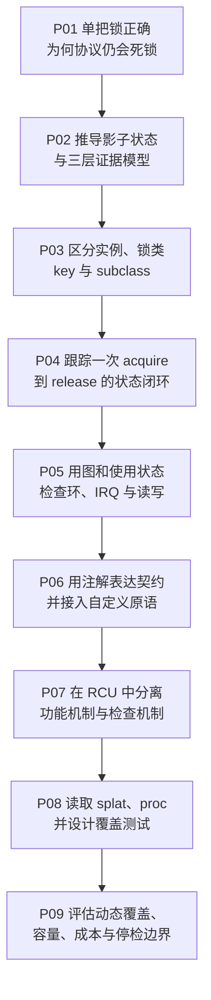

# 第1章\_Linux\_Lockdep专题大纲

## 1.1\_专题定位

Lockdep 不是 mutex、spinlock 或 rwsem 的替代品，也不负责让一次加锁真正成功。它接收锁原语上报的初始化、取得、释放和 IRQ 状态事件，维护一套 **影子锁状态**，再回答三类问题：

1. 当前执行上下文持有哪些锁，取得与释放是否配对；
2. 已观察到的锁类顺序能否组成递归、环或 IRQ 反转；
3. 调用点声明的“这里必须持锁”是否得到当前影子状态支持。

读完本专题，读者应能从一条 `mutex_lock()` 路径重建：锁实例怎样映射到锁类、`current` 的持锁账本怎样更新、候选依赖怎样进入全局图、图搜索为何能在真实死锁发生以前报警，以及 `lockdep_is_held()`、RCU 条件谓词和自定义注解分别能证明什么、不能证明什么。

## 1.2\_贯穿场景

专题持续使用两个控制路径：

```text
配置路径：config_lock → state_lock
恢复路径：state_lock  → config_lock
```

两条路径可以在一次单线程测试中先后执行，真实的双任务死锁不必已经发生。只要 Lockdep 已观察到两个方向的锁类依赖，它就能推出并发执行时存在等待环。后续再加入硬中断路径、同类对象层级、读锁和 RCU 条件，逐步检验这个朴素模型。

## 1.3\_因果阅读地图



## 1.4\_章节契约

1. [为什么需要 Lockdep](P01_为什么需要_Lockdep.md)
   - 前置结论：锁原语能够提供互斥或等待语义。
   - 本篇解决：单把锁本身工作正常时，多路径锁协议为何仍会形成死锁。
   - 新增模型：锁顺序是跨调用路径累积的协议，而不是单个锁对象的局部属性。
   - 后续缺口：由谁记录已经发生的顺序，怎样从局部顺序推出全局风险。
2. [Lockdep 抽象模型与证明边界](P02_Lockdep_抽象模型与证明边界.md)
   - 前置结论：必须同时观察当前持锁集合和跨时间的锁顺序。
   - 本篇解决：从事件流推导局部账本、全局锁类图、使用状态和诊断者四类角色。
   - 新增模型：S0～S6 检查周期与三组正交状态轴。
   - 后续缺口：锁地址、锁实例和锁类为什么不能等同。
3. [锁实例、锁类、key 与 subclass](P03_锁实例_锁类_key与subclass.md)
   - 前置结论：全局图不能为每个动态对象无限建点。
   - 本篇解决：实例怎样归类，错误合并或错误拆分为何造成误报或漏报。
   - 新增模型：持久 key、锁类、子类和自然层级。
   - 后续缺口：一次取得事件怎样同时更新当前账本与全局图。
4. [持锁账本、依赖图与状态闭环](P04_持锁账本_依赖图与状态闭环.md)
   - 前置结论：每个实例已经具有稳定的检查身份。
   - 本篇解决：acquire、chain cache、依赖校验、提交和 release 的先后关系。
   - 新增模型：`current` 持锁账本、链键和全局图之间的状态流。
   - 后续缺口：不是所有锁边都具有相同阻塞语义，IRQ 也会改变参与者集合。
5. [递归、依赖环、IRQ 与读写规则](P05_递归_依赖环_IRQ与读写规则.md)
   - 前置结论：普通互斥锁的 `A → B` 边已经能够建立。
   - 本篇解决：同类递归、任意长度环、IRQ safe/unsafe 和三类读写取得怎样统一判断。
   - 新增模型：锁类使用状态与带阻塞类型的依赖边。
   - 后续缺口：业务函数怎样把隐含持锁要求变成可执行契约。
6. [查询、断言、pin 与自定义原语接入](P06_查询_断言_pin与自定义原语接入.md)
   - 前置结论：Lockdep 已有可信的当前持锁账本。
   - 本篇解决：`lockdep_is_held()`、`lockdep_assert_*()`、pin 和 acquire/release 注解分别表达什么。
   - 新增模型：查询、断言和事件上报三种不同接口职责。
   - 后续缺口：一个子系统怎样把自身的保护条件接入这些检查，而不把检查当成功能算法。
7. [RCU 与子系统检查适配](P07_RCU与子系统检查适配.md)
   - 前置结论：检查状态来自同步原语主动上报，而非扫描锁对象。
   - 本篇解决：RCU 虚拟 lockdep map、保护条件 `c` 与 `RCU_LOCKDEP_WARN()` 的数据流。
   - 新增模型：功能链和检查链并行但不互相替代。
   - 后续缺口：怎样判断测试确实覆盖了需要的链并正确读取告警。
8. [配置、报告解读与验证方法](P08_配置_报告解读与验证方法.md)
   - 前置结论：动态检查只有在对应配置和执行路径实际启用时才有证据。
   - 本篇解决：配置矩阵、报告分段、`/proc/lockdep*` 和最小验证策略。
   - 新增模型：从告警现场反查新边、既有路径、持锁栈和分类身份。
   - 后续缺口：无告警是否足以证明正确，以及检查器失效后怎样识别。
9. [成本、覆盖边界与工程选择](P09_成本_覆盖边界与工程选择.md)
   - 前置结论：Lockdep 能对已观察组件链做闭包分析，但输入仍来自动态执行。
   - 本篇解决：运行成本、链缓存、容量耗尽、`debug_locks` 停检、误报/漏报和工具组合。
   - 输出结论：能够选择何时启用 Lockdep、怎样解释“未报警”，以及何时需要 KCSAN、KASAN、Sparse 或人工所有权证明。

## 1.5\_版本化源码入口

- **总阅读索引：** [Linux 6.12 Lockdep 源码导读](../../../../research/source_reading/lockdep/navigation/P01_Linux_6.12_Lockdep源码导读.md#1.1_基线与阅读目标)。
- **模块概念导读：** [身份与事件接入](../../../../research/source_reading/lockdep/navigation/P02_Linux_6.12_Lockdep身份与事件接入模块导读.md#2.1_模块问题)、[依赖图与规则引擎](../../../../research/source_reading/lockdep/navigation/P03_Linux_6.12_Lockdep依赖图与规则引擎模块导读.md#3.1_模块问题)、[查询适配与诊断](../../../../research/source_reading/lockdep/navigation/P04_Linux_6.12_Lockdep查询适配与诊断模块导读.md#4.1_模块问题)。
- **具体实现讲解：** [身份与锁类源码实现](../../../../research/source_reading/lockdep/source_explanations/P05_Linux_6.12_Lockdep身份与锁类源码实现.md#5.1_关联入口)、[取得释放与持锁账本源码实现](../../../../research/source_reading/lockdep/source_explanations/P06_Linux_6.12_Lockdep取得释放与持锁账本源码实现.md#6.1_关联入口)、[依赖图与规则引擎源码实现](../../../../research/source_reading/lockdep/source_explanations/P07_Linux_6.12_Lockdep依赖图与规则引擎源码实现.md#7.1_关联入口)、[查询注解与配置源码实现](../../../../research/source_reading/lockdep/source_explanations/P08_Linux_6.12_Lockdep查询注解与配置源码实现.md#8.1_关联入口)保存带中文 Doxygen 和行内注释的唯一实现展开；正文遇到具体宏或函数时直接跳到对应完整标题。

## 1.6\_与相邻专题的边界

- [锁机制专题](../locks/大纲.md)解释 mutex、spinlock、rwsem 等功能语义；Lockdep 只验证它们上报的协议事件。
- [RCU 专题](../rcu/大纲.md)解释发布、读侧、宽限期和回收；本专题只解释 RCU 怎样使用 Lockdep 状态检查调用条件。
- [内存顺序专题](../../memory_ordering/大纲.md)解释 acquire/release 与屏障；Lockdep 的 `lock_acquire()` 名称不等价于硬件 acquire memory ordering。
- 数据竞争、越界/UAF、类型和对象生命期分别需要 KCSAN、KASAN、Sparse 及业务所有权证明，不能由 Lockdep 一项替代。
