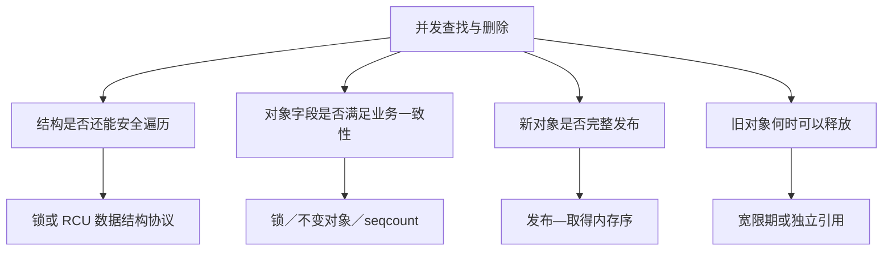
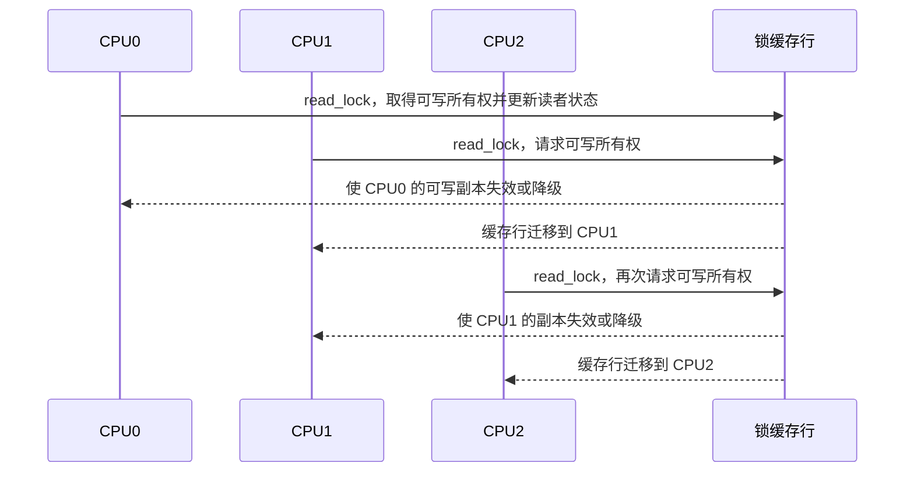
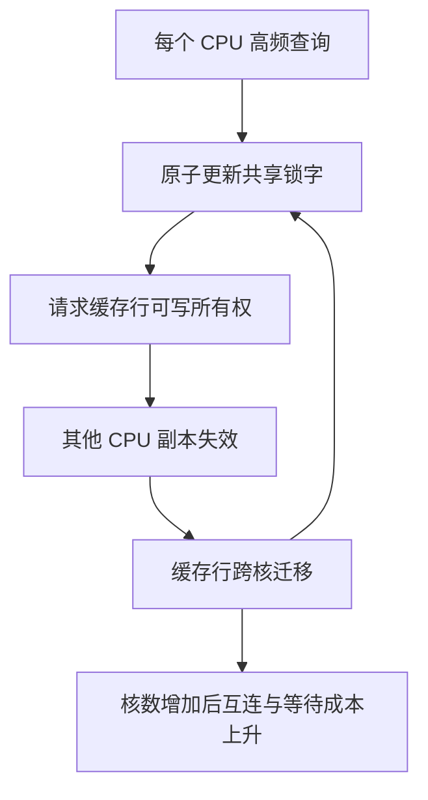
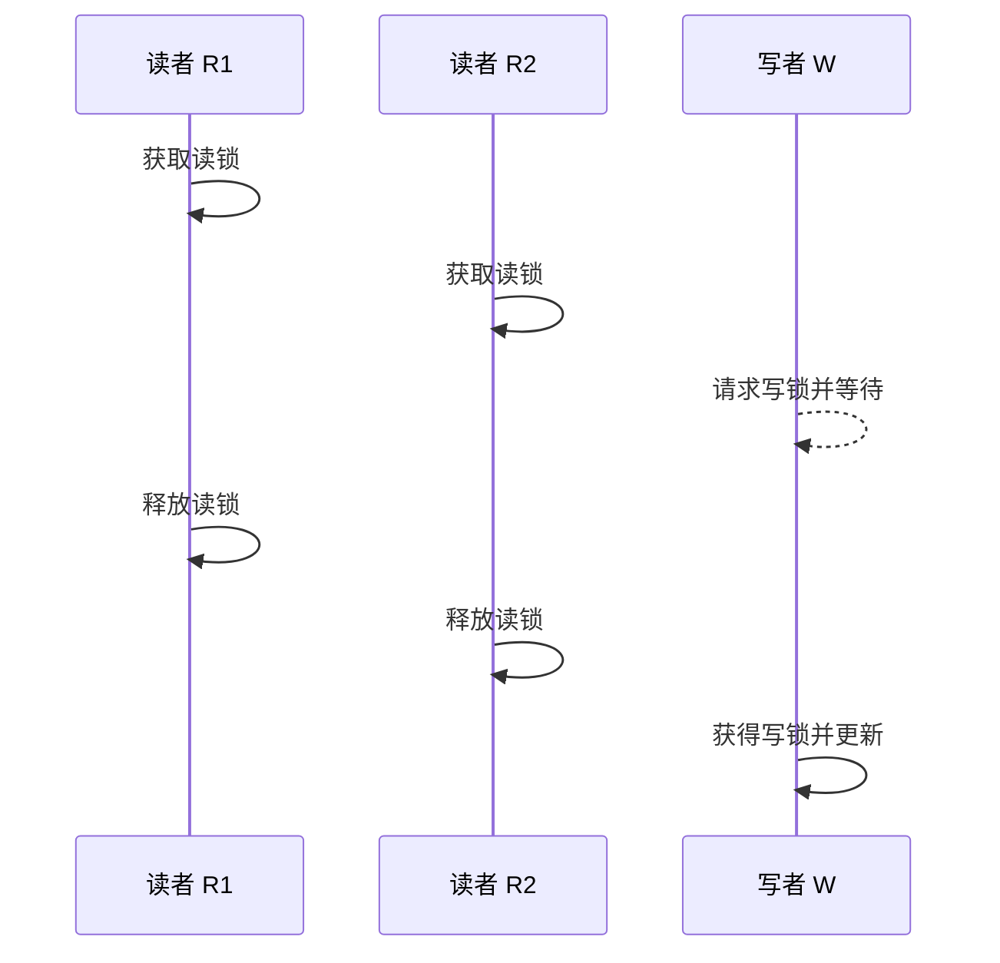
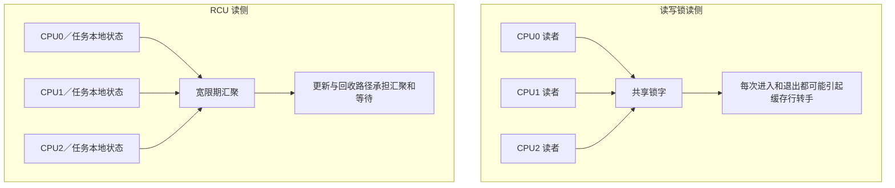
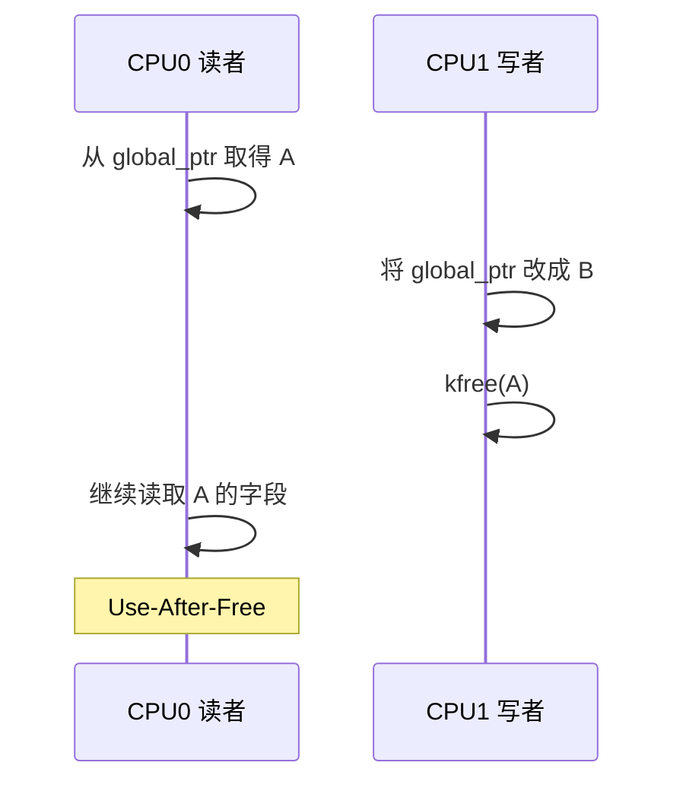
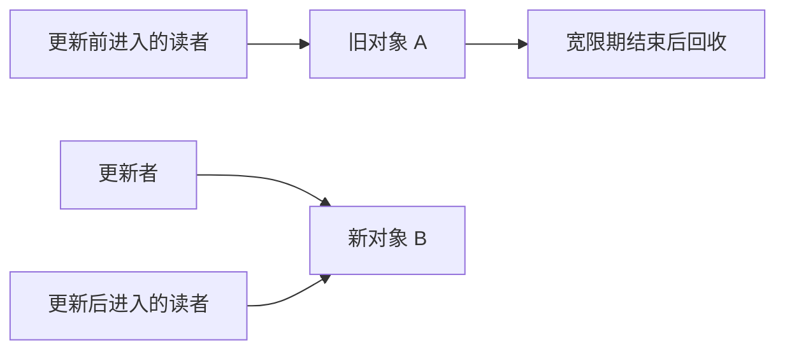
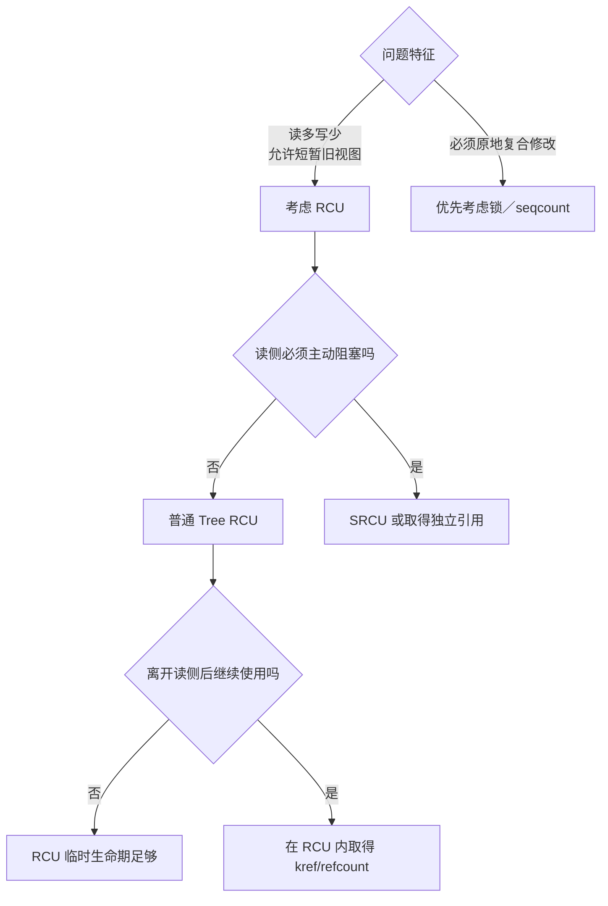
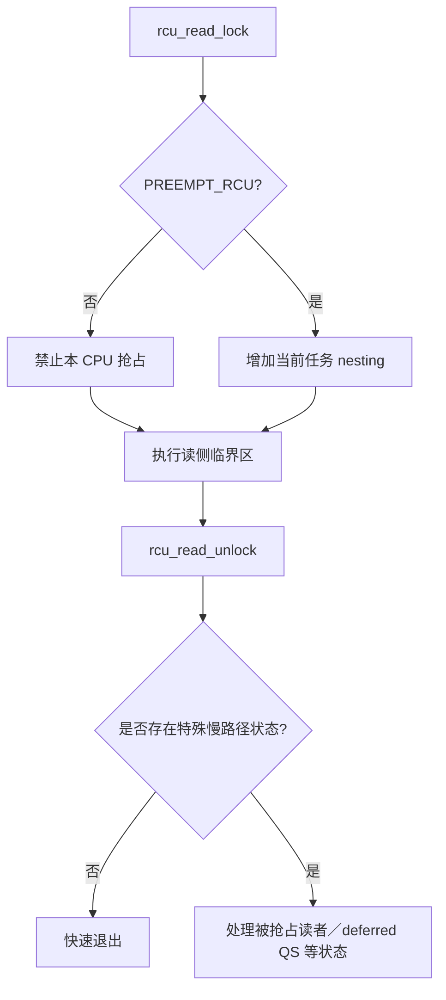
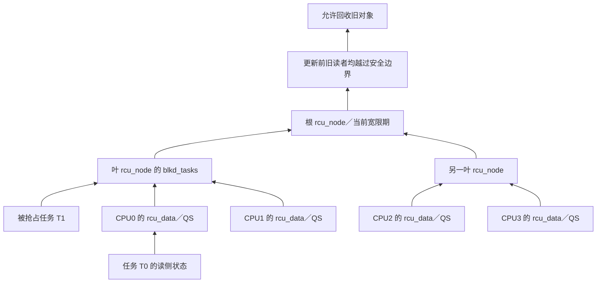

# 第1章\_为什么需要\_RCU

## 1.1\_先把问题说完整

假设内核维护一张设备表，读者按编号取得设备并读取状态，写者偶尔添加、替换或删除设备：

```text
CPU0：查找设备 7，并读取状态
CPU1：查找设备 12，并读取状态
CPU2：删除设备 7
```

这个例子看起来只是一次查表，实际同时包含四类正确性问题：

1. **结构完整性**：读者遍历链表或哈希桶时，写者能否同时改变指针连接？
2. **内容一致性**：读者看到的对象字段是否构成业务上允许的状态？
3. **发布顺序**：读者看到新对象指针时，对象初始化是否已经可见？
4. **对象生命期**：读者已经取得旧指针后，写者何时才可以释放旧对象？

这四个问题经常被一句“给它加锁”盖住。RCU 的价值只有在把它们重新拆开之后才会显现：RCU 主要改变的是**读者与更新者的并发方式，以及旧对象的回收时机**；它并不自动解决所有字段不变量，也不自动串行化多个写者。



## 1.2\_第一种办法\_用互斥锁把所有访问串行化

最直接的写法是让读者和写者都持有同一把 mutex：

```c
mutex_lock(&table_lock);
dev = lookup_device(id);
if (dev)
    use_device(dev);
mutex_unlock(&table_lock);
```

删除者也在锁内摘除并释放对象。只要所有访问都遵守同一规则，锁就能同时保护表结构和对象生命期：**删除者** 无法在 **读者** 使用对象时进入，**读者** 也无法在 **删除者** 修改结构时进入。

这个方案正确、直观，而且 **写多** 或 **临界区较复杂** 时往往就是合适选择。但它把所有读者也互相串行化了。若查询是网络收包、路径查找或系统调用中的高频路径，CPU 数量增加并不会带来相应读吞吐量；任何可能睡眠或执行较久的读者还会延长其他访问的等待时间。

所以问题不是“mutex 不好”，而是这里的负载可能具有特殊比例：

```text
读：每秒数百万次
写：几秒、几分钟甚至几小时一次
```

为极少发生的更新，让每个读者都付出互斥与排队代价，可能不合算。

## 1.3\_第二种办法\_读写锁允许读者并行

读写锁缓解了读者之间的逻辑互斥：多个读者可以同时持有读锁，写者取得写锁时再排斥所有读者。

```c
read_lock(&table_lock);
dev = lookup_device(id);
if (dev)
    use_device(dev);
read_unlock(&table_lock);
```

从语义上看，这已经很接近目标：读者可以同时进入，写者又很少，似乎不再存在竞争。问题在于，“允许多个读者同时持锁”只描述了**软件互斥规则**，不表示获取读锁时各 CPU 互不影响。要知道写者能否进入，锁必须保存“当前是否有写者、是否已有读者、读者是否全部退出”等共享状态；典型读写锁会把其中至少一部分编码在同一个锁字中。

### 1.3.1\_没有写者也会发生的竞争

先假设系统中根本没有写者，四个 CPU 只做查询：

```text
CPU0：read_lock() → 查表 → read_unlock()
CPU1：read_lock() → 查表 → read_unlock()
CPU2：read_lock() → 查表 → read_unlock()
CPU3：read_lock() → 查表 → read_unlock()
```

它们在业务数据上可能只读，但获取和释放读锁通常需要更新锁的共享状态，可以把关键动作近似理解为：

```text
read_lock()   ：原子地登记“多了一个读者”
read_unlock() ：原子地登记“少了一个读者”
```

这里的“原子”不仅要求单个 CPU 自己完成加减，还要求其他 CPU 和写者观察到一个全局一致的锁状态。于是，真正被反复写入的是**存放锁字的缓存行**。

### 1.3.2\_缓存行为什么会在核间乒乓

CPU 通常先在自己的 L1/L2 缓存中操作数据。多个 CPU 可以同时缓存同一锁字的只读副本，但某个 CPU 要原子修改它时，必须先通过缓存一致性协议取得这条缓存行的可写所有权，并使其他 CPU 中的副本失效。

假设锁缓存行最初归 CPU0 可写：



随后 CPU0 执行 `read_unlock()` 时又要修改同一个状态，只能重新请求所有权。缓存行便可能形成下面的往返：

```text
CPU0 → CPU1 → CPU2 → CPU3 → CPU0 → ……
       同一条锁缓存行不断转手
```

这就是这里所说的**缓存行乒乓**。它不是“两个读者不能同时进入临界区”，而是“两个读者为了证明自己可以同时进入，仍要轮流修改同一份记账状态”。业务层没有锁冲突，硬件层却存在共享写热点。

一次转手可能包含缓存失效、所有权请求、核间或片上互连通信以及原子读—改—写等待。锁和业务数据如果还发生伪共享，其他无关字段也会随整条缓存行一起迁移。CPU 越多、读临界区越短、获取频率越高，真正查表的工作越少，这些固定同步成本在总时间中的占比反而越高。



### 1.3.3\_为什么增加 CPU 可能不再增加读吞吐量

假设一次表查询本身只需几十纳秒。单核时，锁缓存行大概率留在本核，读锁成本并不显眼；当很多 CPU 同时执行相同热路径时，每个读者都在争取同一缓存行的写权限，访问开始受锁字转手速度限制。

这时会出现反直觉现象：

```text
增加 CPU
   ↓
增加并行读者
   ↓
同时增加对同一锁缓存行的原子修改
   ↓
缓存失效和核间通信增多
   ↓
吞吐量增长变慢、停滞，极端时甚至下降
```

因此，“没有写者等待”和“读路径可扩展”不是一回事。传统读写锁可能在功能上完全无竞争，却在缓存一致性层面产生竞争。[Linux 的 per-CPU 读写信号量文档](https://www.kernel.org/doc/html/next/locking/percpu-rw-semaphore.html)也把传统读写信号量的问题直接归因于多个核心读加锁时，包含信号量的缓存行在各核心 L1 缓存之间跳动。

### 1.3.4\_写者等待是另一项成本

写者还必须等待当前读者全部释放读锁，才能取得写锁并发布更新。也就是说，读写锁的核心策略仍是：

```text
写者想更新
    ↓
先阻止后续读者进入
    ↓
等待当前读者全部离开
    ↓
写者独占修改
```

读写锁没有错。它提供强而清楚的互斥语义；但如果读侧只想取得一个稳定的已发布版本，它可能让每一次读取都为罕见写入维护共享锁状态。



所以读写锁在这个场景中同时存在两类成本：

1. **没有写者时的读侧扩展性成本**：高频读者共同修改锁状态，导致锁缓存行乒乓。
2. **出现写者时的排斥成本**：写者必须阻止新读者并等待已有读者退出，读者与写者不能继续并行。

### 1.3.5\_RCU\_改变的不是锁实现细节\_而是成本归属

RCU 不再要求每个读者对同一个“全局读者计数”做原子增减。普通 Tree RCU 的读侧主要利用任务本地或 CPU 本地状态标记一个生命期区间，更新者发布新版本后，再由宽限期基础设施确认更新前的读者已经越过安全边界。



这个变化把成本从“每次高频读取都修改共享锁状态”，转移到“低频更新者复制、发布、等待并回收旧版本”。RCU 因而适合**读极多、写极少、读者可接受短暂旧版本、对象允许延迟回收**的场景。若更新频繁、必须原地修改、读者必须立即看到最新状态，或旧版本占用资源过大，RCU 转移过去的写侧和内存成本可能不值得。

换句话说，选择 RCU 不是因为“读写锁偶尔会慢”，而是因为负载已经满足下面的矛盾：

> 业务希望读者彼此独立，但传统读写锁仍迫使所有读者通过同一条共享缓存行登记；RCU 允许读者不再为罕见写者维护这份集中记账，把版本维护和等待成本交给更新路径。

## 1.4\_能否只原子替换指针

既然写入一个自然对齐的机器字指针通常不会撕裂，一个诱人的优化是复制并初始化新对象 B，然后直接把共享入口从 A 改为 B：

```text
替换前：global_ptr -> A
替换后：global_ptr -> B
```

这样写者似乎不必阻止读者：较早的读者取得 A，较晚的读者取得 B。可是“指针没有撕裂”只回答了读者取得 A 还是 B，没有回答两个更深的问题：

1. 读者看到 B 时，是否一定能看到写者此前对 B 的完整初始化？
2. A 从入口消失后，是否还有读者握着 A？

第一个问题属于发布—取得内存序；第二个问题属于对象生命期。普通赋值本身不足以证明这两件事。

## 1.5\_真正危险的是取消发布后的旧指针

考虑下面的合法交错。读者在写者替换入口之前取得了 A，但还没有使用完：



写者重新读取 `global_ptr` 时只会看到 B，这并不能证明其他 CPU 的寄存器、栈或局部变量里没有 A。对象从共享结构中**不可再取得**，与此前读者**不再使用**，是两个不同时间点：

```text
取消发布 A                         最后一个旧读者用完 A
     │                                      │
     ├──── A 不再分发给后来的读者 ──────────┤
     │       但既存读者仍可合法访问 A        │
     └──────────── 此区间不能释放 A ─────────┘
```

因此，RCU 要解决的核心问题不是“怎样写入一个指针”，而是：

> 对象从共享入口消失以后，怎样证明此前可能取得它的读者已经全部越过不再使用旧对象的安全边界？

## 1.6\_引用计数为什么不能直接替代这个证明

直觉上可以给 A 增加引用计数：读者取得 A 后加一，使用完减一，删除者等计数归零。但在“通过一个可并发删除的入口取得第一份引用”时会出现窗口：

```text
CPU0 读者                         CPU1 删除者
读取 global_ptr 得到 A
                                  摘除 A
                                  发现引用计数为 0
                                  释放 A
尝试 refcount_inc(A)  ← A 已释放
```

引用计数擅长回答“已经安全拥有引用以后，还有多少持有者”，却不能凭空保证“从可能消失的共享入口取得第一份引用”这一步安全。通常仍需要锁、RCU 或其他生命期协议保护这一步。

RCU 与 kref/refcount 因而不是互斥选项，常见组合反而是：

```text
在 RCU 读侧临界区内安全找到对象
        ↓
尝试取得独立引用
        ↓
退出 RCU 后凭引用继续长期使用
```

这也说明我们面对的不是单一“锁与无锁”选择，而是临时可访问生命期与长期所有权的分层问题。

## 1.7\_关键转折\_不赶走旧读者

传统互斥方案倾向于让写者先取得排他权，再原地修改或释放。RCU 换了一个方向：既然读操作远多于写操作，能否让写者承担复制与等待成本，让读者继续完成已经开始的工作？

```text
旧读者继续使用 A
写者准备并发布 B
新读者从共享入口取得 B
        ↓
系统中短暂同时存在 A、B 两个合法版本
        ↓
等待更新前潜在旧读者跨过安全边界
        ↓
最后释放 A
```



这里的核心交换是：

- 读者不必为了更新者停下来，也不必共同修改一把全局读锁的状态。
- 写者付出准备新版本、维护写写互斥和延迟回收的成本。
- 系统允许一段时间的新旧版本并存，读者不一定观察到绝对最新版本。

这才是 RCU 在读多写少场景中的优势来源，而不是“某几个 API 比锁快”。

## 1.8\_等待不是猜时间\_而是等待读者状态推进

如果只是 `delay(100)` 后释放 A，慢读者、抢占、CPU 离线或中断都可能使这个猜测失效。RCU 的宽限期不是固定延时。

普通 Tree RCU 也不维护下面这种逐对象映射：

```text
对象 A -> CPU0、任务 T3
对象 B -> CPU2
```

`rcu_read_lock()` 没有对象地址参数。RCU 采用更粗粒度但更便宜的证明：

```text
在本次宽限期开始前可能已经存在的 RCU 读侧临界区，
是否都已经跨过安全边界？
```

在 `PREEMPT_RCU` 下，读侧嵌套状态记录在任务中；若任务在临界区内被抢占，还会进入 `rcu_node` 的阻塞任务跟踪。在非抢占 RCU 下，临界区内禁止抢占，CPU 后续报告 quiescent state。RCU 子系统由此追踪哪些 CPU 或任务仍可能承载旧读者。

所以这里既不是“写者逐个询问谁读了 A”，也不是“完全没有通知”：

```text
不会通知：CPU0 正在读取地址 A
会通知：  这个 CPU／任务是否仍可能处于宽限期开始前的读侧临界区
```

具体状态怎样留下、由谁更新、如何汇聚，将在第四、第五章结合仓库中的 Linux 6.12.20 源码展开。

## 1.9\_RCU\_优势成立需要哪些前提

RCU 并非在所有并发场景中都优于锁。它特别适合同时满足以下条件的问题：

- 读取远多于更新，读路径的扩展性值得优先优化。
- 读者可以接受在短时间内观察旧版本，而不是必须与写者线性互斥。
- 对象可以通过替换指针或维护多个版本更新，而不是只能做复杂的原地修改。
- 内存允许旧版本延迟回收。
- 普通 RCU 读侧可以保持短小且不主动阻塞；否则应考虑 SRCU 或独立引用。

以下问题则通常仍需要其他机制：

| 需求 | RCU 是否单独解决 | 常见补充机制 |
| --- | --- | --- |
| 多个写者修改同一结构 | 否 | spinlock、mutex 或单写者规则 |
| 多字段必须形成原子业务快照 | 否 | 不变对象、锁或 seqcount |
| 离开读侧区间后长期持有对象 | 否 | kref/refcount |
| 条件不成立时睡眠并等待唤醒 | 否 | wait queue、completion 等 |
| 读侧必须跨越睡眠或 I/O | 普通 RCU 不适合 | SRCU，或先取得独立引用 |

RCU 的优势不是功能更多，而是它对问题做了更精确的分工：高频读者只承担很轻的临时访问协议，罕见写者承担发布、版本共存和延迟回收。



## 1.10\_所谓\_读无锁\_到底是什么意思

“读无锁”这个词很容易让人误以为同步成本已经消失。更准确的说法是：

> 普通 Tree RCU 用一套低成本、分布式的读侧状态与进展通知机制，替代传统共享读锁的集中记账与访问排斥。读者不在每次进入和退出时共同原子修改同一个全局读者计数，但仍然参加由任务状态、抢占状态、每 CPU 状态、静止状态观测和宽限期汇聚共同组成的生命周期协议。

RCU 文档中的“读无锁”因此应理解为：

- 读者不获取会与更新者形成互斥的传统共享读锁。
- 更新者发布新版本时，不必等待读者先退出。
- 旧读者和新读者可以同时观察不同版本。
- 高频读侧尽量避免对同一条全局共享缓存行执行原子读—改—写。

它不表示：

- `rcu_read_lock()` 在所有配置下都是空操作。
- 读侧没有任务状态、每 CPU 状态或通知机制。
- 指针读取不需要 `rcu_dereference()` 一类发布—取得契约。
- 对象内部字段自动变成一致快照。
- 离开读侧临界区后，裸指针仍然有效。

### 1.10.1\_它被什么替换\_低成本的分布式状态与通知机制

可以说 RCU 替换了传统读锁的作用，但替换者不是另一把隐藏的锁，而是一套**低成本、分布式的状态记录与进展通知机制**。如果只写“换了一种锁”，读者仍会自然想象系统中存在下面这种隐藏结构：

```text
global_rcu_reader_count
    ↑ 所有 CPU 在 rcu_read_lock() 时原子加一
    ↓ 所有 CPU 在 rcu_read_unlock() 时原子减一
```

这恰好又制造了上一节的共享缓存行乒乓，无法解释 RCU 的读侧扩展性。Linux 6.12.20 的普通 Tree RCU 并不是这样实现的。它也没有一把对应的 `rcu_write_lock()`：多个更新者之间的互斥仍需数据结构自己的 spinlock、mutex 或单写者规则完成。

判断它是不是“另一把锁”，关键要看读者是否排斥其他参与者：

| 问题 | 传统读写锁 | 普通 Tree RCU |
| --- | --- | --- |
| 读者进入后会阻止写者更新吗 | 会 | 不会 |
| 写者进入后会阻止新读者吗 | 会 | 不会 |
| 多个写者会自动互斥吗 | 会，由写锁保证 | 不会，另需更新锁 |
| 读者是否每次共同修改一个锁字 | 典型实现需要 | 快速路径刻意避免 |
| 旧对象能否立即释放 | 写者取得排他锁后可以 | 不能，必须等待旧读者跨过安全边界 |

所以，RCU 不是把“空间上的访问排斥”藏进另一把锁，而是把问题改写成“时间上的对象回收证明”：读侧用本地状态划出可能持有旧对象的区间，系统在后续调度、静止状态和特殊退出路径中产生进展通知，宽限期再汇聚这些通知。

这里的“通知”也不是每次 `rcu_read_lock()` 都向一个全局中心发送消息。普通快速路径优先只修改当前任务或当前 CPU 的状态；只有被抢占、经过静止状态、宽限期扫描或退出特殊路径等事件，才需要把“这个 CPU／任务已经或尚未跨过安全边界”的信息推进到共享 RCU 状态。

### 1.10.2\_读侧究竟记录了什么

读侧的具体动作取决于内核配置，不能笼统说成“每个 CPU 都对临界区做同步”。仓库保存的 Linux 6.12.20 源码给出了两条主要路径：

| 配置 | `rcu_read_lock()` 的主要动作 | 状态属于谁 |
| --- | --- | --- |
| `CONFIG_PREEMPT_RCU=y` | 增加 `current->rcu_read_lock_nesting` | 当前任务的 `task_struct`，即任务私有状态 |
| 非 `PREEMPT_RCU` | 调用 `preempt_disable()` | 当前 CPU 的抢占嵌套状态 |

`current->rcu_read_lock_nesting` 不是函数局部变量，但也不是所有进程或所有 CPU 共同修改的“全局读者数”。每个任务修改自己的嵌套深度，正常快速路径不会因此争用同一条全局锁缓存行。源码位置如下：

- [`include/linux/rcupdate.h`](../../../../research/source_reading/linux/include/linux/rcupdate.h)中的非抢占 `__rcu_read_lock()`/`__rcu_read_unlock()` 使用 `preempt_disable()`/`preempt_enable()`。
- [`kernel/rcu/tree_plugin.h`](../../../../research/source_reading/linux/kernel/rcu/tree_plugin.h)中的 PREEMPT_RCU 实现增减 `current->rcu_read_lock_nesting`；源码注释明确说明，读者发生阻塞时才更新共享状态。



编译器屏障、抢占控制和任务嵌套状态仍然有成本，所以“无锁”不等于“没有指令”。关键差别是这些动作通常落在当前任务或当前 CPU 上，而不是让所有读者反复取得同一共享缓存行的写所有权。

### 1.10.3\_宽限期怎样知道旧读者已经离开

读者没有更新全局计数，并不意味着回收者靠猜测。Tree RCU 使用低成本的本地记录和较低频的进展通知，形成保守的分层证明：

1. 非抢占读侧通过禁止抢占，保证临界区不会跨过调度静止点；CPU 后续发生上下文切换、进入用户态、进入 idle/EQS 或下线时，可以证明它已经离开此前的非抢占读侧区间。
2. PREEMPT_RCU 允许读者被抢占。如果任务在临界区内发生上下文切换，调度路径会把该任务挂入 `rcu_node->blkd_tasks`，即使原 CPU 已报告静止状态，`gp_tasks` 仍会阻止宽限期越过这个旧任务读者。
3. 每 CPU 的 `rcu_data` 保存本 CPU 对当前宽限期的观察和静止状态进展。
4. `rcu_node` 树用位图和阻塞任务状态逐层汇聚各 CPU/任务是否已经跨过安全边界，最终让根节点判断宽限期完成。



这里确实存在共享状态、内部自旋锁、内存序和跨 CPU 协调，但它们主要位于调度、静止状态报告、宽限期推进和回调处理等路径。它们没有被要求在每一次普通读侧进入和退出时形成“所有读者共同修改一个锁字”的瓶颈。

### 1.10.4\_成本没有消失\_而是被拆散并转移

因此，最不容易骗人的表述不是“RCU 完全无锁”，也不是“RCU 换了一把锁”，而是“RCU 用低成本、分布式的状态与通知机制替换共享读锁的集中记账和访问排斥”：

```text
读写锁：
    每个读者通过共享锁状态取得访问许可；
    写者通过排斥读者获得安全修改与回收时机。

RCU：
    读者用任务／CPU 本地状态标记可能持有旧版本的时间区间；
    更新者不排斥读者，负责发布新版本；
    RCU 子系统在慢路径和宽限期路径汇聚 CPU／任务进展；
    回收者等证明成立后才释放旧版本。
```

RCU 只是把高频读侧的集中争用，换成了更新侧复制、额外版本内存、宽限期等待以及 RCU 子系统的分布式记账与汇聚成本。读多写少时这笔交换通常有利；写入频繁、内存紧张、必须原地修改或必须立即回收时，它未必比锁合适。

更完整的配置差异、调度通知链和静止状态汇聚见[Tree RCU 读侧与静止状态](P04_Tree_RCU_读侧与静止状态.md)。

## 1.11\_先记住一条时间轴

第一次学习 RCU，不必立即记住所有 API 和数据结构。先抓住这一条时间轴：

```text
R1 进入读侧并可能取得 A
        ↓
写者完整初始化 B
        ↓
写者发布 B，A 从共享入口取消发布
        ↓
R2 后进入，只能从该入口取得 B
        ↓
RCU 等待更新前潜在旧读者跨过安全边界
        ↓
允许释放 A
```

其中最容易混淆的四句话是：

1. 发布 B，不自动解决多个写者之间的互斥。
2. 取消发布 A，不等于 A 已经无人使用。
3. 宽限期结束，不要求后来进入的新读者全部退出。
4. RCU 保护的是协议内的临时可访问生命期，不是永久对象所有权。

## 1.12\_接下来怎样把直觉变成机制

下一章将给这条时间轴上的动作正式命名：

- 什么是发布和取得。
- 什么是取消发布。
- 什么是宽限期。
- 同步等待与异步回调有什么区别。

此后再依次回答：硬件提供了什么、读者怎样留下状态、通知如何汇聚、为什么存在不同 RCU 种类，以及最终怎样正确调用 API。

下一篇：[RCU 核心概念与工作机制](P02_RCU_核心概念与工作机制.md)。
