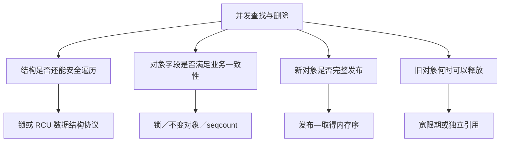
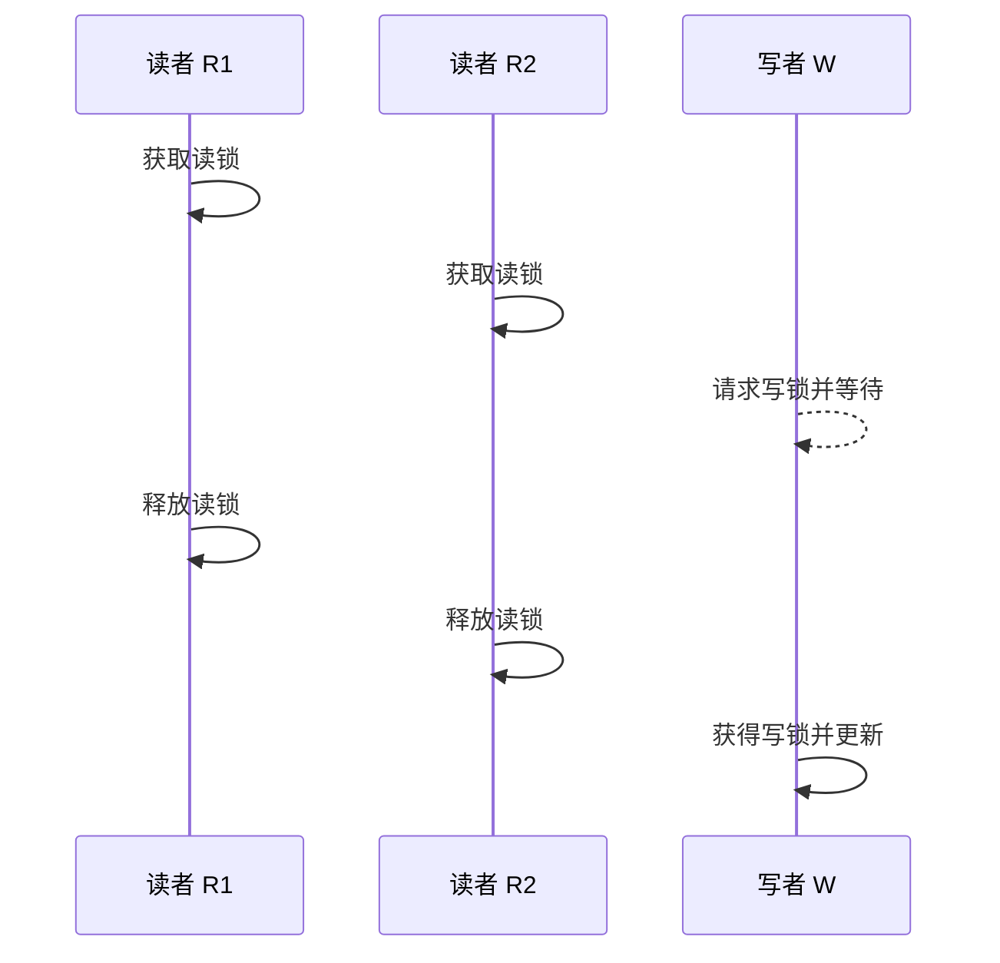
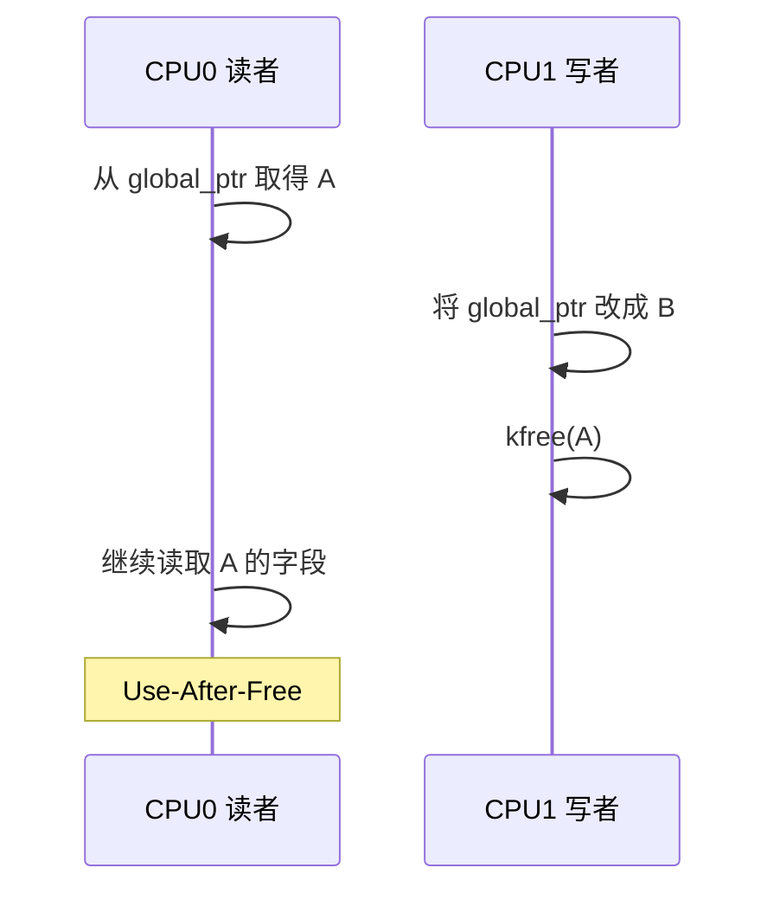
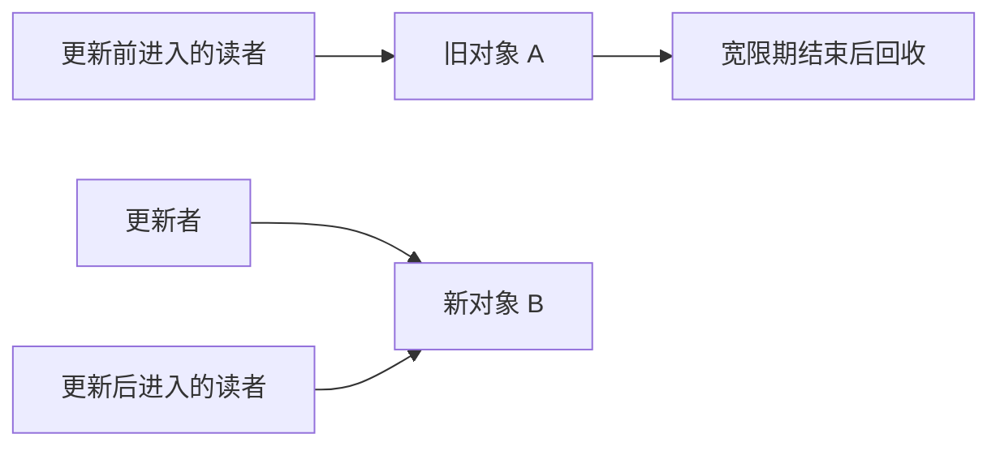
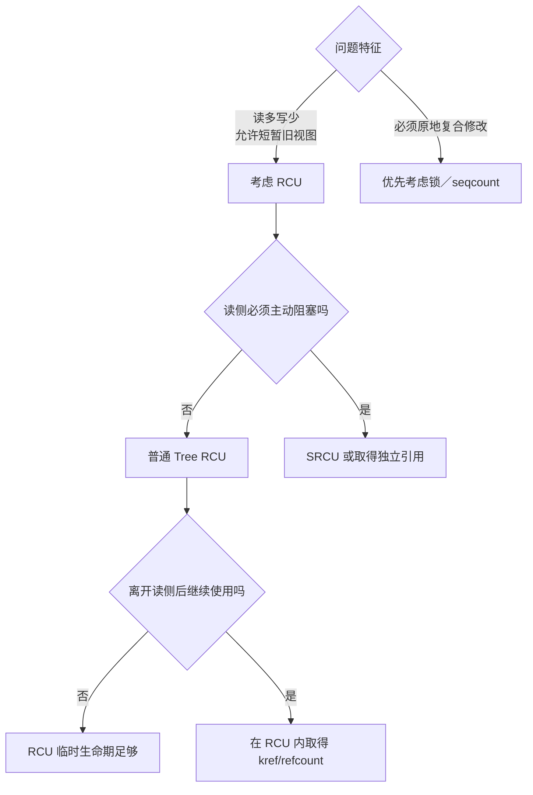

# 第1章\_为什么需要\_RCU

## 1.1\_先把问题说完整

假设内核维护一张设备表，读者按编号取得设备并读取状态，写者偶尔添加、替换或删除设备：

```text
CPU0：查找设备 7，并读取状态
CPU1：查找设备 12，并读取状态
CPU2：删除设备 7
```

这个例子看起来只是一次查表，实际同时包含四类正确性问题：

1. **结构完整性**：读者遍历链表或哈希桶时，写者能否同时改变指针连接？
2. **内容一致性**：读者看到的对象字段是否构成业务上允许的状态？
3. **发布顺序**：读者看到新对象指针时，对象初始化是否已经可见？
4. **对象生命期**：读者已经取得旧指针后，写者何时才可以释放旧对象？

这四个问题经常被一句“给它加锁”盖住。RCU 的价值只有在把它们重新拆开之后才会显现：RCU 主要改变的是**读者与更新者的并发方式，以及旧对象的回收时机**；它并不自动解决所有字段不变量，也不自动串行化多个写者。



## 1.2\_第一种办法\_用互斥锁把所有访问串行化

最直接的写法是让读者和写者都持有同一把 mutex：

```c
mutex_lock(&table_lock);
dev = lookup_device(id);
if (dev)
    use_device(dev);
mutex_unlock(&table_lock);
```

删除者也在锁内摘除并释放对象。只要所有访问都遵守同一规则，锁就能同时保护表结构和对象生命期：删除者无法在读者使用对象时进入，读者也无法在删除者修改结构时进入。

这个方案正确、直观，而且写多或临界区较复杂时往往就是合适选择。但它把所有读者也互相串行化了。若查询是网络收包、路径查找或系统调用中的高频路径，CPU 数量增加并不会带来相应读吞吐量；任何可能睡眠或执行较久的读者还会延长其他访问的等待时间。

所以问题不是“mutex 不好”，而是这里的负载可能具有特殊比例：

```text
读：每秒数百万次
写：几秒、几分钟甚至几小时一次
```

为极少发生的更新，让每个读者都付出互斥与排队代价，可能不合算。

## 1.3\_第二种办法\_读写锁允许读者并行

读写锁缓解了读者之间的逻辑互斥：多个读者可以同时持有读锁，写者取得写锁时再排斥所有读者。

```c
read_lock(&table_lock);
dev = lookup_device(id);
if (dev)
    use_device(dev);
read_unlock(&table_lock);
```

从语义上看，这已经很接近目标：读者并行，写者稀少。但“多个读者可以同时持锁”不等于“读者之间没有共享状态”。典型读写锁仍需要原子地修改或检查同一个锁字：

```text
CPU0 ─┐
CPU1 ─┼─> rwlock 的共享缓存行
CPU2 ─┤       所有权在 CPU 间迁移
CPU3 ─┘
```

缓存一致性协议必须让这些 CPU 对锁字的变化达成一致。CPU 越多、读路径越热，这个缓存行越可能在核间来回迁移，读侧原子操作和内存序约束也会成为扩展性成本。

写者还必须等待当前读者全部释放读锁，才能取得写锁并发布更新。也就是说，读写锁的核心策略仍是：

```text
写者想更新
    ↓
先阻止后续读者进入
    ↓
等待当前读者全部离开
    ↓
写者独占修改
```

读写锁没有错。它提供强而清楚的互斥语义；但如果读侧只想取得一个稳定的已发布版本，它可能让每一次读取都为罕见写入维护共享锁状态。



## 1.4\_能否只原子替换指针

既然写入一个自然对齐的机器字指针通常不会撕裂，一个诱人的优化是复制并初始化新对象 B，然后直接把共享入口从 A 改为 B：

```text
替换前：global_ptr -> A
替换后：global_ptr -> B
```

这样写者似乎不必阻止读者：较早的读者取得 A，较晚的读者取得 B。可是“指针没有撕裂”只回答了读者取得 A 还是 B，没有回答两个更深的问题：

1. 读者看到 B 时，是否一定能看到写者此前对 B 的完整初始化？
2. A 从入口消失后，是否还有读者握着 A？

第一个问题属于发布—取得内存序；第二个问题属于对象生命期。普通赋值本身不足以证明这两件事。

## 1.5\_真正危险的是取消发布后的旧指针

考虑下面的合法交错。读者在写者替换入口之前取得了 A，但还没有使用完：



写者重新读取 `global_ptr` 时只会看到 B，这并不能证明其他 CPU 的寄存器、栈或局部变量里没有 A。对象从共享结构中**不可再取得**，与此前读者**不再使用**，是两个不同时间点：

```text
取消发布 A                         最后一个旧读者用完 A
     │                                      │
     ├──── A 不再分发给后来的读者 ──────────┤
     │       但既存读者仍可合法访问 A        │
     └──────────── 此区间不能释放 A ─────────┘
```

因此，RCU 要解决的核心问题不是“怎样写入一个指针”，而是：

> 对象从共享入口消失以后，怎样证明此前可能取得它的读者已经全部越过不再使用旧对象的安全边界？

## 1.6\_引用计数为什么不能直接替代这个证明

直觉上可以给 A 增加引用计数：读者取得 A 后加一，使用完减一，删除者等计数归零。但在“通过一个可并发删除的入口取得第一份引用”时会出现窗口：

```text
CPU0 读者                         CPU1 删除者
读取 global_ptr 得到 A
                                  摘除 A
                                  发现引用计数为 0
                                  释放 A
尝试 refcount_inc(A)  ← A 已释放
```

引用计数擅长回答“已经安全拥有引用以后，还有多少持有者”，却不能凭空保证“从可能消失的共享入口取得第一份引用”这一步安全。通常仍需要锁、RCU 或其他生命期协议保护这一步。

RCU 与 kref/refcount 因而不是互斥选项，常见组合反而是：

```text
在 RCU 读侧临界区内安全找到对象
        ↓
尝试取得独立引用
        ↓
退出 RCU 后凭引用继续长期使用
```

这也说明我们面对的不是单一“锁与无锁”选择，而是临时可访问生命期与长期所有权的分层问题。

## 1.7\_关键转折\_不赶走旧读者

传统互斥方案倾向于让写者先取得排他权，再原地修改或释放。RCU 换了一个方向：既然读操作远多于写操作，能否让写者承担复制与等待成本，让读者继续完成已经开始的工作？

```text
旧读者继续使用 A
写者准备并发布 B
新读者从共享入口取得 B
        ↓
系统中短暂同时存在 A、B 两个合法版本
        ↓
等待更新前潜在旧读者跨过安全边界
        ↓
最后释放 A
```



这里的核心交换是：

- 读者不必为了更新者停下来，也不必共同修改一把全局读锁的状态。
- 写者付出准备新版本、维护写写互斥和延迟回收的成本。
- 系统允许一段时间的新旧版本并存，读者不一定观察到绝对最新版本。

这才是 RCU 在读多写少场景中的优势来源，而不是“某几个 API 比锁快”。

## 1.8\_等待不是猜时间\_而是等待读者状态推进

如果只是 `delay(100)` 后释放 A，慢读者、抢占、CPU 离线或中断都可能使这个猜测失效。RCU 的宽限期不是固定延时。

普通 Tree RCU 也不维护下面这种逐对象映射：

```text
对象 A -> CPU0、任务 T3
对象 B -> CPU2
```

`rcu_read_lock()` 没有对象地址参数。RCU 采用更粗粒度但更便宜的证明：

```text
在本次宽限期开始前可能已经存在的 RCU 读侧临界区，
是否都已经跨过安全边界？
```

在 `PREEMPT_RCU` 下，读侧嵌套状态记录在任务中；若任务在临界区内被抢占，还会进入 `rcu_node` 的阻塞任务跟踪。在非抢占 RCU 下，临界区内禁止抢占，CPU 后续报告 quiescent state。RCU 子系统由此追踪哪些 CPU 或任务仍可能承载旧读者。

所以这里既不是“写者逐个询问谁读了 A”，也不是“完全没有通知”：

```text
不会通知：CPU0 正在读取地址 A
会通知：  这个 CPU／任务是否仍可能处于宽限期开始前的读侧临界区
```

具体状态怎样留下、由谁更新、如何汇聚，将在第四、第五章结合仓库中的 Linux 6.12.20 源码展开。

## 1.9\_RCU\_优势成立需要哪些前提

RCU 并非在所有并发场景中都优于锁。它特别适合同时满足以下条件的问题：

- 读取远多于更新，读路径的扩展性值得优先优化。
- 读者可以接受在短时间内观察旧版本，而不是必须与写者线性互斥。
- 对象可以通过替换指针或维护多个版本更新，而不是只能做复杂的原地修改。
- 内存允许旧版本延迟回收。
- 普通 RCU 读侧可以保持短小且不主动阻塞；否则应考虑 SRCU 或独立引用。

以下问题则通常仍需要其他机制：

| 需求 | RCU 是否单独解决 | 常见补充机制 |
| --- | --- | --- |
| 多个写者修改同一结构 | 否 | spinlock、mutex 或单写者规则 |
| 多字段必须形成原子业务快照 | 否 | 不变对象、锁或 seqcount |
| 离开读侧区间后长期持有对象 | 否 | kref/refcount |
| 条件不成立时睡眠并等待唤醒 | 否 | wait queue、completion 等 |
| 读侧必须跨越睡眠或 I/O | 普通 RCU 不适合 | SRCU，或先取得独立引用 |

RCU 的优势不是功能更多，而是它对问题做了更精确的分工：高频读者只承担很轻的临时访问协议，罕见写者承担发布、版本共存和延迟回收。



## 1.10\_所谓\_读无锁\_到底是什么意思

RCU 文档中的“读无锁”应理解为：

- 读者不获取会与更新者形成互斥的传统共享读锁。
- 更新者发布新版本时，不必等待读者先退出。
- 旧读者和新读者可以同时观察不同版本。

它不表示：

- `rcu_read_lock()` 在所有配置下都是空操作。
- 读侧没有任务状态、每 CPU 状态或通知机制。
- 指针读取不需要 `rcu_dereference()` 一类发布—取得契约。
- 对象内部字段自动变成一致快照。
- 离开读侧临界区后，裸指针仍然有效。

## 1.11\_先记住一条时间轴

第一次学习 RCU，不必立即记住所有 API 和数据结构。先抓住这一条时间轴：

```text
R1 进入读侧并可能取得 A
        ↓
写者完整初始化 B
        ↓
写者发布 B，A 从共享入口取消发布
        ↓
R2 后进入，只能从该入口取得 B
        ↓
RCU 等待更新前潜在旧读者跨过安全边界
        ↓
允许释放 A
```

其中最容易混淆的四句话是：

1. 发布 B，不自动解决多个写者之间的互斥。
2. 取消发布 A，不等于 A 已经无人使用。
3. 宽限期结束，不要求后来进入的新读者全部退出。
4. RCU 保护的是协议内的临时可访问生命期，不是永久对象所有权。

## 1.12\_接下来怎样把直觉变成机制

下一章将给这条时间轴上的动作正式命名：

- 什么是发布和取得。
- 什么是取消发布。
- 什么是宽限期。
- 同步等待与异步回调有什么区别。

此后再依次回答：硬件提供了什么、读者怎样留下状态、通知如何汇聚、为什么存在不同 RCU 种类，以及最终怎样正确调用 API。

下一篇：[RCU 核心概念与工作机制](P02_RCU_核心概念与工作机制.md)。
