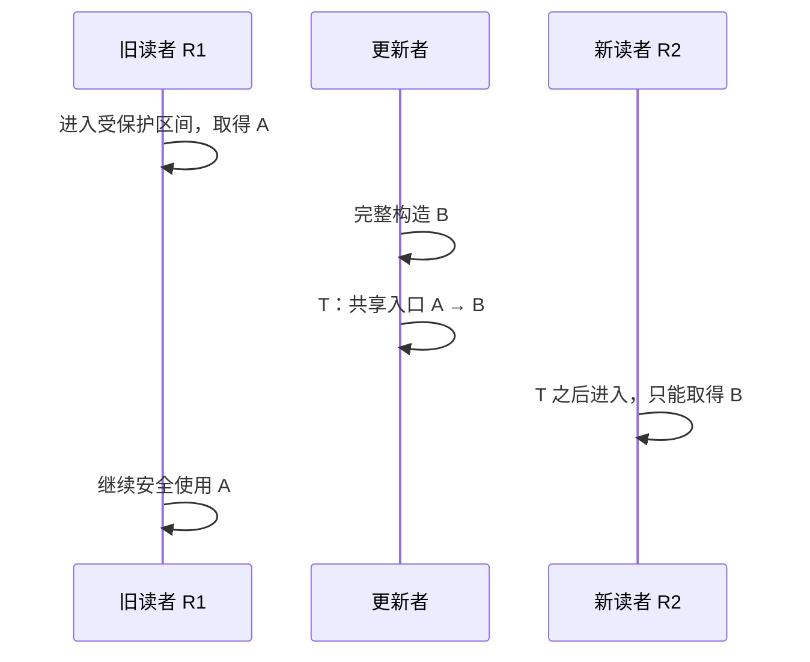

# 第2章\_RCU\_抽象机制推演

第一章已经说明读写锁、单纯原子换指针和引用计数分别留下什么缺口。本章暂时不看 Linux 字段和 API，而是假设我们要从零设计一种方案：高频读者尽量不争抢同一个共享写热点，更新者又必须证明旧对象已经无人使用。

> **阅读目标：** 从问题约束自行推出“发布新版本—划定旧读者边界—等待宽限期—延迟回收”的最小机制。下一章再用真实运行条件寻找这个朴素模型的漏洞。

## 2.1\_把设计目标写成约束

继续使用第一章的共享配置对象场景。新机制必须同时满足：

1. 多个读者可以并行读取当前配置。
2. 已经取得旧指针的读者不能因为更新而访问已释放内存。
3. 更新之后开始的读者应能取得新版本。
4. 旧对象最终必须可以回收，不能永久泄漏。
5. 普通读操作不能依赖每次修改同一个全局共享计数，否则会重新制造缓存行热点。

第五条决定了这不是“把读写锁换一种写法”。我们需要改变读者与更新者协作的方式，把更多工作转移到低频更新和回收路径。

## 2.2\_第一步\_不再原地覆盖读者正在使用的版本

如果写者直接修改 A 的多个字段，读者可能观察到一半旧值、一半新值。最直接的办法是先构造一个完整的新版本 B，再一次性切换共享入口：

```text
更新前：shared_ptr ──> A

写者在私有状态中构造 B

发布后：shared_ptr ──> B
                    A 仍然暂时存活
```

这个动作解决了“新读者应该看到哪个版本”，却没有解决“旧读者是否还在使用 A”。因此，**复制并发布新版本只是更新协议，不是回收协议。**

## 2.3\_第二步\_取消发布封闭旧读者集合

设写者在时刻 T 把共享入口从 A 切换到 B：

- T 之前进入的读者可能已经取得 A。
- T 之后从共享入口取值的读者只能取得 B。
- 新读者不需要等待旧读者，旧读者也不必被赶出临界区。

这意味着 T 形成了一条集合边界。回收者不必找出“历史上所有读取过 A 的任务”，只需证明 **T 之前可能取得 A 的读者都已经结束**。



> **关键转折：** RCU 不要求更新者阻塞旧读者，而是允许 A 与 B 暂时共存，把“何时安全释放 A”变成一个独立问题。

## 2.4\_第三步\_用宽限期等待边界前读者离场

从 T 开始，到所有 T 之前的相关读者都已经结束，这段逻辑等待过程称为宽限期（Grace Period，GP）。GP 的目标不是让系统出现一个“所有 CPU 同时没有读者”的瞬间，而是让每个旧读者分别跨过安全边界。

```text
时间 ──────────────────────────────────────────────>

旧读者 R0： [---------读取 A---------]
旧读者 R1：       [------读取 A------]
发布边界 T：                 |
新读者 R2：                  | [----读取 B----]
新读者 R3：                  |       [----读取 B----]
GP：                         [等待 R0、R1]
回收 A：                                      X
```

R2、R3 即使在 GP 期间持续读取 B，也不会延迟 A 的回收，因为它们不属于边界前旧读者集合。

## 2.5\_第四步\_把等待结果连接到对象回收

GP 完成只能产生“旧读者已经离场”的证明，最终还要把证明交给需要回收 A 的执行者。由此得到两种抽象方式：

| 方式 | 等待者怎样得到结果 | 适合场景 |
| --- | --- | --- |
| 同步等待 | 当前更新者睡眠，GP 完成后被唤醒 | 后续步骤必须立即使用完成结论 |
| 异步回调 | 更新者登记回收动作后继续执行，GP 完成后由系统调用回调 | 不希望更新路径阻塞 |

两者依赖同一个 GP 证明，区别只在于 **完成结果如何交付**。

## 2.6\_四类动作不能互相替代

| 推演出的动作 | 解决的问题 | 如果缺少会怎样 |
| --- | --- | --- |
| 标记受保护读取区间 | 确定哪些访问可能保留旧引用 | 无法区分受保护访问与任意普通取值 |
| 完整初始化后发布新版本 | 保证后来读者不会看到半初始化对象 | 指针已经可见，对象字段却可能尚不可见 |
| 从共享入口取消旧版本 | 阻止后来读者继续取得旧对象 | 旧读者集合没有封闭边界 |
| 等待既存读者并延迟回收 | 让边界前取得旧指针的读者完成 | 更新者可能在旧读者使用期间释放对象 |

**取消发布只负责关闭入口，不证明旧读者已经离场；等待旧读者只解决生命周期，不负责让新对象的初始化正确可见。** Linux API 到应用阶段再统一映射。

## 2.7\_发布为什么不能只是原子换指针

即使指针替换不会撕裂，也只能保证读者取得 A 或 B 中的一个合法地址，不能保证读者取得 B 时已经看见 B 的全部初始化。因此抽象机制还需要一份发布—取得顺序契约：

```text
写者完成 B 的字段初始化
    happens-before
写者发布指向 B 的入口
    synchronizes-with
读者取得 B
    happens-before
读者使用 B 的字段
```

具体需要哪些编译器约束和 CPU 内存序原语，取决于目标系统和体系结构；下一章再解释硬件为什么不会自动提供这份高层对象契约。

## 2.8\_最小抽象模型

把以上推演合并，可以得到不绑定具体 API 的伪代码：

```text
读者：
    进入受保护读取区间
    p = 取得当前发布指针
    使用 p 指向的版本
    退出受保护读取区间

更新者：
    完整构造新版本 B
    串行化并发更新者
    将共享入口从 A 发布为 B
    请求等待“发布 B 之前可能取得 A”的旧读者
    等待完成后回收 A
```

这里包含三种独立正确性责任：

- **写者串行化：** 多个更新者不能互相覆盖，具体由额外更新协议负责。
- **发布可见性：** 读者取得 B 时，必须同时看见 B 已完成的初始化。
- **旧版本生命周期：** A 必须存活到最后一个既存读者结束。

## 2.9\_朴素模型还没有回答什么

到这里，我们只得到一个逻辑要求：“等待所有边界前读者结束”。它还不是一套能在真实多核系统中运行的算法，因为至少有六个问题没有答案：

1. **读者状态放在哪里：** 如果不能让每次读取修改同一个全局计数，系统怎样留下读者存在的证据？
2. **读者离开原 CPU 怎么办：** 任务在保护区内被抢占或迁移后，谁继续代表它？
3. **CPU 不主动运行协调代码怎么办：** CPU 进入用户态、idle 或长时间无 tick 时，怎样判断它是否安全？
4. **多个 CPU 怎样汇聚：** 如果所有 CPU 最终仍争抢一个全局完成字，扩展性问题是否只是换了位置？
5. **参与者迟迟不报告怎么办：** 协调者是读取远端状态、发送 IPI，还是无限等待？
6. **跨 CPU 观察怎样有序：** 指针发布、读者访问和 GP 完成之间需要什么内存顺序？

> **本章故意停在这里。** 这些漏洞将逐个逼出每任务状态、每 CPU 状态、共享汇聚节点、EQS、强制探测和内存序约束；这正是下一章“机制完善”的任务。

## 2.10\_抽象机制不保证什么

RCU 抽象不会自动保证：

- 多个写者之间的互斥。
- 对象内部多字段不变量的原子更新。
- 离开受保护读取区间后对象仍然存活。
- 新读者立即观察到某一业务版本。
- 持有指针就拥有该对象的引用计数。

这些需求必须由更新锁、不变数据、seqcount、引用计数或其他机制分层完成。

## 2.11\_本章验收

1. 能从读写锁的共享写热点推出“读路径不能每次修改同一全局计数”的约束。
2. 能区分发布、取消发布、宽限期和最终回收。
3. 能解释为什么 GP 只需要覆盖边界前的既存读者。
4. 能列出朴素 GP 模型在真实多核系统中尚未解决的问题。
5. 不借助 Linux 字段，也能画出“发布新版本—封闭旧读者集合—等待—回收”的时间线。

上一篇：[为什么需要 RCU](P01_为什么需要_RCU.md)。

下一篇：[RCU 机制完善：硬件与运行约束](P03_RCU_机制完善_硬件与运行约束.md)。
